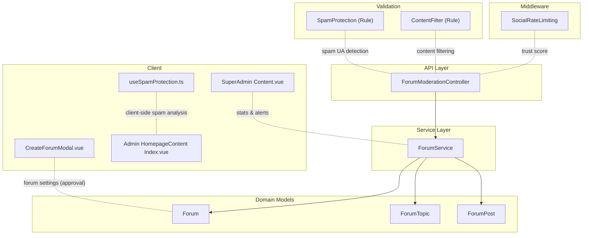
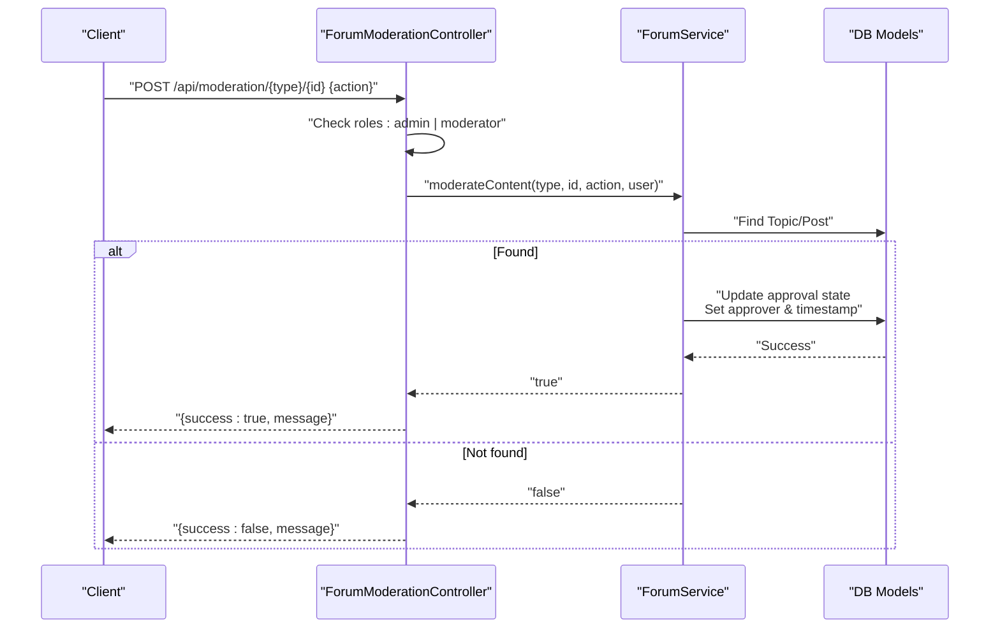
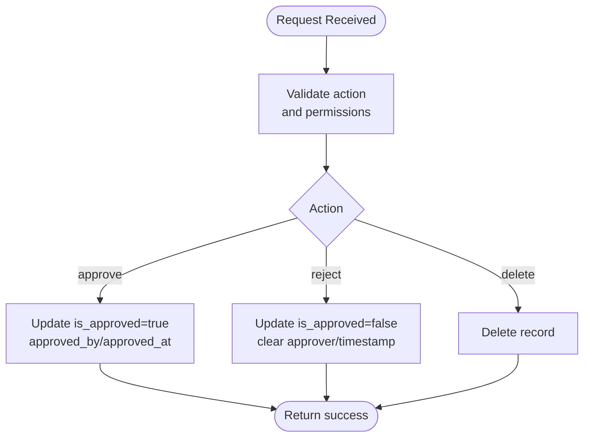
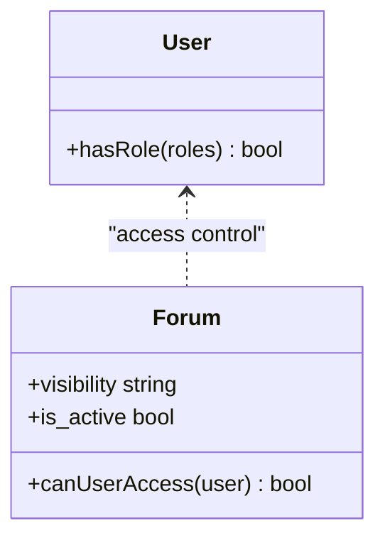
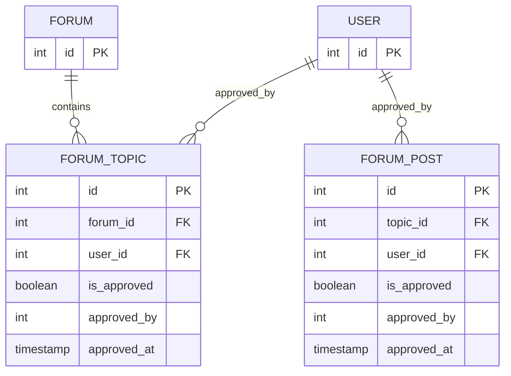
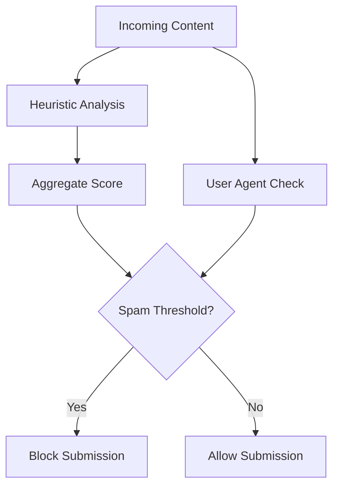
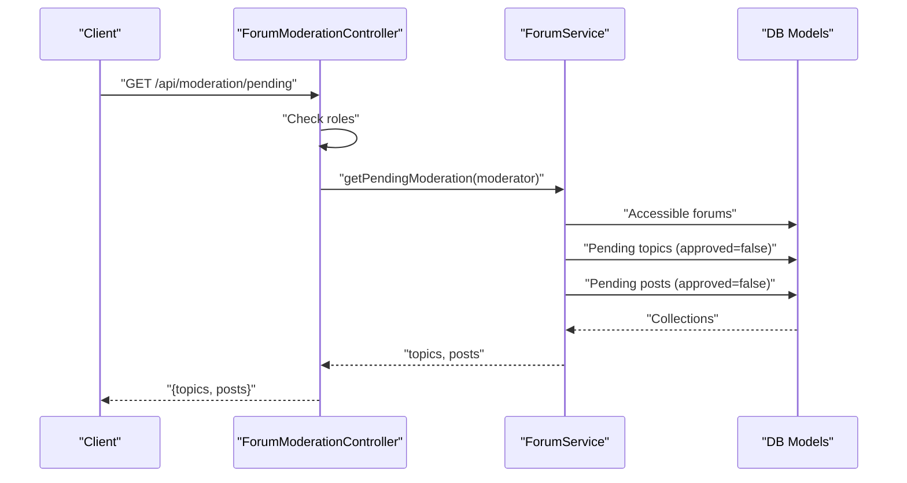
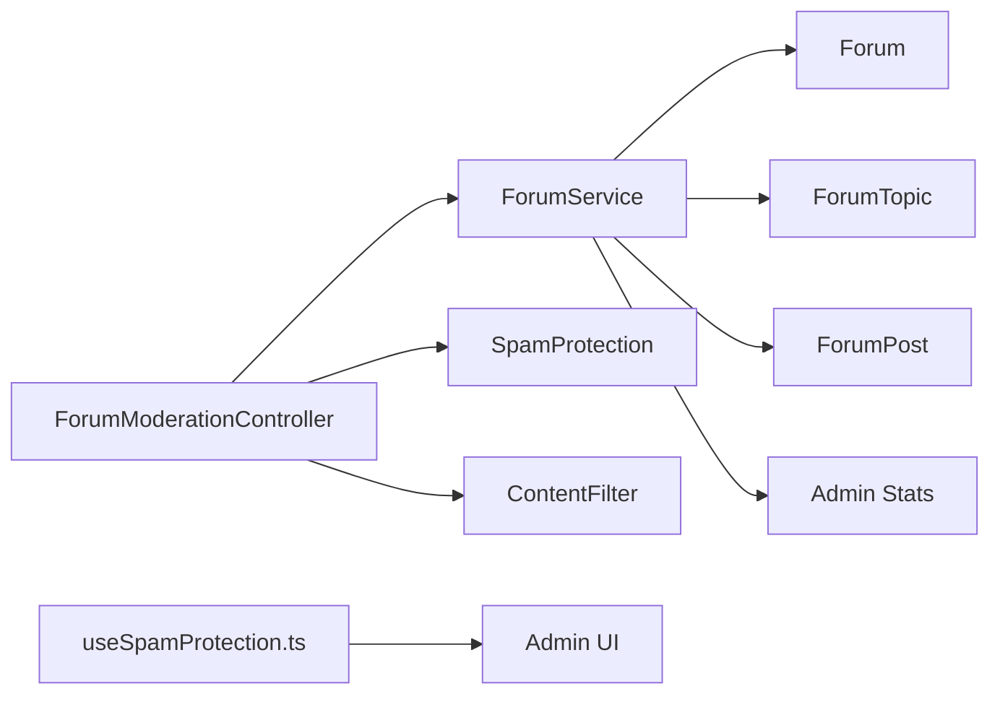

# Community Moderation

<cite>
**Referenced Files in This Document**
- [ForumModerationController.php](file://app/Http/Controllers/Api/ForumModerationController.php)
- [ForumService.php](file://app/Services/ForumService.php)
- [Forum.php](file://app/Models/Forum.php)
- [ForumTopic.php](file://app/Models/ForumTopic.php)
- [ForumPost.php](file://app/Models/ForumPost.php)
- [SpamProtection.php](file://app/Rules/SpamProtection.php)
- [ContentFilter.php](file://app/Rules/ContentFilter.php)
- [useSpamProtection.ts](file://resources/js/composables/useSpamProtection.ts)
- [CreateForumModal.vue](file://resources/js/components/Forums/CreateForumModal.vue)
- [Content.vue](file://resources/js/Pages/SuperAdmin/Content.vue)
- [Index.vue](file://resources/js/Pages/Admin/HomepageContent/Index.vue)
- [User.php](file://app/Models/User.php)
- [Role.php](file://app/Models/Role.php)
- [SocialRateLimiting.php](file://app/Http/Middleware/SocialRateLimiting.php)
- [FormValidationService.php](file://app/Services/FormValidationService.php)
- [Administrator-guide.md](file://docs/user-guides/admin/administrator-guide.md)
</cite>

## Table of Contents
1. [Introduction](#introduction)
2. [Project Structure](#project-structure)
3. [Core Components](#core-components)
4. [Architecture Overview](#architecture-overview)
5. [Detailed Component Analysis](#detailed-component-analysis)
6. [Dependency Analysis](#dependency-analysis)
7. [Performance Considerations](#performance-considerations)
8. [Troubleshooting Guide](#troubleshooting-guide)
9. [Conclusion](#conclusion)

## Introduction
This document describes the community moderation and content management system, focusing on the workflow for approving, rejecting, and deleting topics and posts, moderator permissions and access control, administrative oversight, content filtering and spam detection, automated flagging, moderation queues, decision tracking, reporting and appeals, bulk moderation, and audit trails. It also outlines integrations with user roles and reputation systems.

## Project Structure
The moderation system spans API controllers, services, models, validation rules, client-side composables, and admin dashboards. Key areas:
- API controller for moderation actions and pending content retrieval
- Service layer orchestrating moderation decisions and access filtering
- Eloquent models representing forums, topics, and posts with approval metadata
- Validation rules for spam protection and content filtering
- Frontend composables and pages for spam detection and moderation dashboards
- Middleware integrating user trust scores into rate limiting
- Administrator documentation covering policies and workflows

**Diagram sources**
- [ForumModerationController.php:1-109](file://app/Http/Controllers/Api/ForumModerationController.php#L1-L109)
- [ForumService.php:1-274](file://app/Services/ForumService.php#L1-L274)
- [Forum.php:1-101](file://app/Models/Forum.php#L1-L101)
- [ForumTopic.php:1-142](file://app/Models/ForumTopic.php#L1-L142)
- [ForumPost.php:1-151](file://app/Models/ForumPost.php#L1-L151)
- [SpamProtection.php:1-305](file://app/Rules/SpamProtection.php#L1-L305)
- [ContentFilter.php:122-262](file://app/Rules/ContentFilter.php#L122-L262)
- [useSpamProtection.ts:187-373](file://resources/js/composables/useSpamProtection.ts#L187-L373)
- [CreateForumModal.vue:116-147](file://resources/js/components/Forums/CreateForumModal.vue#L116-L147)
- [Index.vue:42-63](file://resources/js/Pages/Admin/HomepageContent/Index.vue#L42-L63)
- [Content.vue:44-66](file://resources/js/Pages/SuperAdmin/Content.vue#L44-L66)
- [SocialRateLimiting.php:155-197](file://app/Http/Middleware/SocialRateLimiting.php#L155-L197)

**Section sources**
- [ForumModerationController.php:1-109](file://app/Http/Controllers/Api/ForumModerationController.php#L1-L109)
- [ForumService.php:1-274](file://app/Services/ForumService.php#L1-L274)
- [Forum.php:1-101](file://app/Models/Forum.php#L1-L101)
- [ForumTopic.php:1-142](file://app/Models/ForumTopic.php#L1-L142)
- [ForumPost.php:1-151](file://app/Models/ForumPost.php#L1-L151)
- [SpamProtection.php:1-305](file://app/Rules/SpamProtection.php#L1-L305)
- [ContentFilter.php:122-262](file://app/Rules/ContentFilter.php#L122-L262)
- [useSpamProtection.ts:187-373](file://resources/js/composables/useSpamProtection.ts#L187-L373)
- [CreateForumModal.vue:116-147](file://resources/js/components/Forums/CreateForumModal.vue#L116-L147)
- [Index.vue:42-63](file://resources/js/Pages/Admin/HomepageContent/Index.vue#L42-L63)
- [Content.vue:44-66](file://resources/js/Pages/SuperAdmin/Content.vue#L44-L66)
- [SocialRateLimiting.php:155-197](file://app/Http/Middleware/SocialRateLimiting.php#L155-L197)

## Core Components
- Moderation API controller: Enforces role-based access and delegates moderation actions to the service layer.
- Forum service: Implements moderation logic, access-filtered pending content retrieval, and forum statistics.
- Domain models: Track approval state, approver identity, timestamps, and relationships for forums, topics, and posts.
- Validation rules: Detect suspicious user agents and filter spam-like content.
- Client-side spam protection: Heuristics for content and user agent analysis.
- Administrative UI: Dashboards for moderation stats, pending approvals, and homepage content workflows.
- Middleware: Integrates user trust scores into rate limiting.

**Section sources**
- [ForumModerationController.php:17-61](file://app/Http/Controllers/Api/ForumModerationController.php#L17-L61)
- [ForumService.php:200-272](file://app/Services/ForumService.php#L200-L272)
- [ForumTopic.php:13-38](file://app/Models/ForumTopic.php#L13-L38)
- [ForumPost.php:11-34](file://app/Models/ForumPost.php#L11-L34)
- [SpamProtection.php:156-215](file://app/Rules/SpamProtection.php#L156-L215)
- [ContentFilter.php:122-167](file://app/Rules/ContentFilter.php#L122-L167)
- [useSpamProtection.ts:190-253](file://resources/js/composables/useSpamProtection.ts#L190-L253)
- [Content.vue:44-66](file://resources/js/Pages/SuperAdmin/Content.vue#L44-L66)
- [Index.vue:42-63](file://resources/js/Pages/Admin/HomepageContent/Index.vue#L42-L63)
- [SocialRateLimiting.php:165-197](file://app/Http/Middleware/SocialRateLimiting.php#L165-L197)

## Architecture Overview
The moderation architecture follows a layered pattern:
- API controllers validate requests and enforce permissions.
- Service layer encapsulates business logic and applies access control to forums.
- Models persist approval metadata and maintain relationships.
- Validation rules and client-side heuristics support automated spam detection.
- Admin dashboards surface moderation metrics and pending queues.

**Diagram sources**
- [ForumModerationController.php:20-61](file://app/Http/Controllers/Api/ForumModerationController.php#L20-L61)
- [ForumService.php:203-242](file://app/Services/ForumService.php#L203-L242)
- [ForumTopic.php:13-38](file://app/Models/ForumTopic.php#L13-L38)
- [ForumPost.php:11-34](file://app/Models/ForumPost.php#L11-L34)

**Section sources**
- [ForumModerationController.php:17-61](file://app/Http/Controllers/Api/ForumModerationController.php#L17-L61)
- [ForumService.php:200-242](file://app/Services/ForumService.php#L200-L242)

## Detailed Component Analysis

### Moderation Workflow: Approve, Reject, Delete
- Endpoint: POST /api/moderation/{type}/{id}
- Allowed actions: approve, reject, delete
- Required permissions: admin or moderator
- Behavior:
  - Approve: sets approved flag, records approver and timestamp
  - Reject: clears approved flag and approver fields
  - Delete: removes the topic/post
- Returns structured JSON with success and message

**Diagram sources**
- [ForumModerationController.php:20-61](file://app/Http/Controllers/Api/ForumModerationController.php#L20-L61)
- [ForumService.php:203-242](file://app/Services/ForumService.php#L203-L242)
- [ForumTopic.php:13-38](file://app/Models/ForumTopic.php#L13-L38)
- [ForumPost.php:11-34](file://app/Models/ForumPost.php#L11-L34)

**Section sources**
- [ForumModerationController.php:17-61](file://app/Http/Controllers/Api/ForumModerationController.php#L17-L61)
- [ForumService.php:200-242](file://app/Services/ForumService.php#L200-L242)

### Moderator Permissions and Access Control
- Role-based access: only users with admin or moderator roles can moderate
- Accessible forums: moderation queries are filtered to forums the moderator can access
- Forum visibility rules: public, private (moderator/admin), or group-only membership gates

**Diagram sources**
- [ForumModerationController.php:24-30](file://app/Http/Controllers/Api/ForumModerationController.php#L24-L30)
- [ForumService.php:247-272](file://app/Services/ForumService.php#L247-L272)
- [Forum.php:81-93](file://app/Models/Forum.php#L81-L93)
- [User.php:446-449](file://app/Models/User.php#L446-L449)
- [Role.php:1-22](file://app/Models/Role.php#L1-L22)

**Section sources**
- [ForumModerationController.php:24-30](file://app/Http/Controllers/Api/ForumModerationController.php#L24-L30)
- [ForumService.php:247-272](file://app/Services/ForumService.php#L247-L272)
- [Forum.php:81-93](file://app/Models/Forum.php#L81-L93)
- [User.php:446-449](file://app/Models/User.php#L446-L449)
- [Role.php:1-22](file://app/Models/Role.php#L1-L22)

### Administrative Oversight and Decision Tracking
- Approval metadata stored on topics/posts: is_approved, approved_by, approved_at
- Accessor relationships for approver and last post user
- Statistics and recent activity feeds for admin dashboards

**Diagram sources**
- [ForumTopic.php:13-38](file://app/Models/ForumTopic.php#L13-L38)
- [ForumPost.php:11-34](file://app/Models/ForumPost.php#L11-L34)
- [User.php:1-818](file://app/Models/User.php#L1-L818)

**Section sources**
- [ForumTopic.php:13-38](file://app/Models/ForumTopic.php#L13-L38)
- [ForumPost.php:11-34](file://app/Models/ForumPost.php#L11-L34)
- [ForumService.php:132-198](file://app/Services/ForumService.php#L132-L198)

### Content Filtering Mechanisms and Spam Detection
- Backend validation:
  - SpamProtection rule validates user agent against suspicious patterns and legitimate browsers
  - ContentFilter rule detects spam keywords, suspicious patterns, URL limits, HTML presence, and low-quality content
- Frontend composable:
  - Heuristics for suspicious keywords, excessive links, punctuation, caps, repeated characters, and gibberish
  - Optional blocking based on user agent lists
- Additional form validation service:
  - Spam keyword scoring, excessive punctuation/caps, URL counts, IP reputation checks

**Diagram sources**
- [SpamProtection.php:156-215](file://app/Rules/SpamProtection.php#L156-L215)
- [ContentFilter.php:122-167](file://app/Rules/ContentFilter.php#L122-L167)
- [useSpamProtection.ts:190-253](file://resources/js/composables/useSpamProtection.ts#L190-L253)
- [FormValidationService.php:130-174](file://app/Services/FormValidationService.php#L130-L174)

**Section sources**
- [SpamProtection.php:1-305](file://app/Rules/SpamProtection.php#L1-L305)
- [ContentFilter.php:122-262](file://app/Rules/ContentFilter.php#L122-L262)
- [useSpamProtection.ts:187-373](file://resources/js/composables/useSpamProtection.ts#L187-L373)
- [FormValidationService.php:130-174](file://app/Services/FormValidationService.php#L130-L174)

### Moderation Queues and Pending Content Management
- Endpoint: GET /api/moderation/pending
- Returns pending topics and posts scoped to forums accessible by the moderator
- Limits enforced per queue

**Diagram sources**
- [ForumModerationController.php:66-109](file://app/Http/Controllers/Api/ForumModerationController.php#L66-L109)
- [ForumService.php:247-272](file://app/Services/ForumService.php#L247-L272)

**Section sources**
- [ForumModerationController.php:63-109](file://app/Http/Controllers/Api/ForumModerationController.php#L63-L109)
- [ForumService.php:244-272](file://app/Services/ForumService.php#L244-L272)

### Reporting Mechanisms and Appeals Processes
- Administrator guide documents platform content approval policies and moderation workflows including appeal and escalation procedures.
- Appeals are part of documented moderation workflow; implementation specifics depend on domain-specific processes.

**Section sources**
- [Administrator-guide.md:200-233](file://docs/user-guides/admin/administrator-guide.md#L200-L233)

### Bulk Moderation Operations
- No explicit bulk moderation endpoint was identified in the forum moderation controller.
- The system demonstrates bulk operations elsewhere (e.g., templates), indicating potential patterns for bulk moderation (e.g., batch approve/reject endpoints) that would follow similar role checks and audit trails.

**Section sources**
- [ForumModerationController.php:1-109](file://app/Http/Controllers/Api/ForumModerationController.php#L1-L109)

### Content Archiving and Audit Trail Maintenance
- Approval metadata (approver, timestamp) supports auditability.
- Admin dashboards expose moderation statistics and recent activity.
- Audit trail UI patterns exist for change history in other modules.

**Section sources**
- [ForumTopic.php:13-38](file://app/Models/ForumTopic.php#L13-L38)
- [ForumPost.php:11-34](file://app/Models/ForumPost.php#L11-L34)
- [ForumService.php:132-198](file://app/Services/ForumService.php#L132-L198)
- [Content.vue:44-66](file://resources/js/Pages/SuperAdmin/Content.vue#L44-L66)

### Integration with User Reputation Systems and Trust Scores
- Middleware calculates a user trust score based on account age, verification, profile completeness, connection count, and recent violations.
- This trust score influences rate limiting behavior, indirectly affecting moderation-related submissions.

**Section sources**
- [SocialRateLimiting.php:165-197](file://app/Http/Middleware/SocialRateLimiting.php#L165-L197)

## Dependency Analysis
- Controller depends on ForumService for moderation operations and on User roles for access control.
- Service depends on Forum, ForumTopic, ForumPost models and applies access control via Forum visibility rules.
- Validation rules and client-side composables feed into moderation decisions and spam prevention.
- Admin UIs consume service statistics and pending queues.

**Diagram sources**
- [ForumModerationController.php:1-109](file://app/Http/Controllers/Api/ForumModerationController.php#L1-L109)
- [ForumService.php:1-274](file://app/Services/ForumService.php#L1-L274)
- [Forum.php:1-101](file://app/Models/Forum.php#L1-L101)
- [ForumTopic.php:1-142](file://app/Models/ForumTopic.php#L1-L142)
- [ForumPost.php:1-151](file://app/Models/ForumPost.php#L1-L151)
- [SpamProtection.php:1-305](file://app/Rules/SpamProtection.php#L1-L305)
- [ContentFilter.php:122-262](file://app/Rules/ContentFilter.php#L122-L262)
- [useSpamProtection.ts:187-373](file://resources/js/composables/useSpamProtection.ts#L187-L373)
- [Content.vue:44-66](file://resources/js/Pages/SuperAdmin/Content.vue#L44-L66)

**Section sources**
- [ForumModerationController.php:1-109](file://app/Http/Controllers/Api/ForumModerationController.php#L1-L109)
- [ForumService.php:1-274](file://app/Services/ForumService.php#L1-L274)

## Performance Considerations
- Limit moderation queue results to avoid heavy queries.
- Use eager loading for relationships in moderation queues.
- Apply database indexing on approval flags and timestamps for faster filtering.
- Client-side spam analysis reduces server load but should remain lightweight.

## Troubleshooting Guide
- Insufficient permissions: Ensure the user has admin or moderator role.
- Content not found: Verify the type and ID correspond to existing topic or post.
- Access control issues: Confirm forum visibility and group membership align with moderator permissions.
- Spam detection false positives: Adjust client-side and server-side thresholds or whitelists as appropriate.

**Section sources**
- [ForumModerationController.php:24-49](file://app/Http/Controllers/Api/ForumModerationController.php#L24-L49)
- [ForumService.php:247-272](file://app/Services/ForumService.php#L247-L272)
- [Forum.php:81-93](file://app/Models/Forum.php#L81-L93)

## Conclusion
The moderation system enforces strict role-based access, integrates spam detection at both client and server layers, and provides robust queues and dashboards for administrators. Approval metadata ensures auditability, while middleware-driven trust scoring helps mitigate abusive submissions. Extending bulk moderation and formalized appeals would further strengthen operational workflows.