# Discussion Forums & Networking

<cite>
**Referenced Files in This Document**
- [Forum.php](file://app/Models/Forum.php)
- [ForumTopic.php](file://app/Models/ForumTopic.php)
- [ForumPost.php](file://app/Models/ForumPost.php)
- [ForumTag.php](file://app/Models/ForumTag.php)
- [ForumTopicSubscription.php](file://app/Models/ForumTopicSubscription.php)
- [ForumService.php](file://app/Services/ForumService.php)
- [ForumController.php](file://app/Http/Controllers/Api/ForumController.php)
- [ForumTopicController.php](file://app/Http/Controllers/Api/ForumTopicController.php)
- [ForumPostController.php](file://app/Http/Controllers/Api/ForumPostController.php)
- [ForumSearchController.php](file://app/Http/Controllers/Api/ForumSearchController.php)
- [ForumModerationController.php](file://app/Http/Controllers/Api/ForumModerationController.php)
- [AlumniRecommendationService.php](file://app/Services/AlumniRecommendationService.php)
- [SpamProtection.php](file://app/Rules/SpamProtection.php)
- [ContentFilter.php](file://app/Rules/ContentFilter.php)
- [Index.vue](file://resources/js/Pages/Forums/Index.vue)
- [Recommendations.vue](file://resources/js/Pages/Alumni/Recommendations.vue)
- [EventConnectionRecommendations.vue](file://resources/js/components/EventConnectionRecommendations.vue)
- [ConnectionInsights.vue](file://resources/js/components/ConnectionInsights.vue)
- [completeApiDocumentation.js](file://resources/js/Data/completeApiDocumentation.js)
</cite>

## Table of Contents
1. [Introduction](#introduction)
2. [Project Structure](#project-structure)
3. [Core Components](#core-components)
4. [Architecture Overview](#architecture-overview)
5. [Detailed Component Analysis](#detailed-component-analysis)
6. [Dependency Analysis](#dependency-analysis)
7. [Performance Considerations](#performance-considerations)
8. [Troubleshooting Guide](#troubleshooting-guide)
9. [Conclusion](#conclusion)
10. [Appendices](#appendices)

## Introduction
This document explains the discussion forums and networking system in Alumate. It covers forum creation and management, topic and post workflows, moderation, hierarchical data model, subscriptions, tagging, search, spam protection, and integration with alumni networking and connection recommendations. It also provides guidance on performance optimization and pagination for large-scale usage.

## Project Structure
The system is implemented with Laravel models, controllers, services, and Vue frontend components:
- Models define the hierarchical structure: Forum → ForumTopic → ForumPost, with tags and subscriptions.
- Controllers expose REST endpoints for forums, topics, posts, search, and moderation.
- Services encapsulate business logic such as search, moderation, and statistics.
- Frontend pages and components render forum listings, topic threads, and networking recommendations.

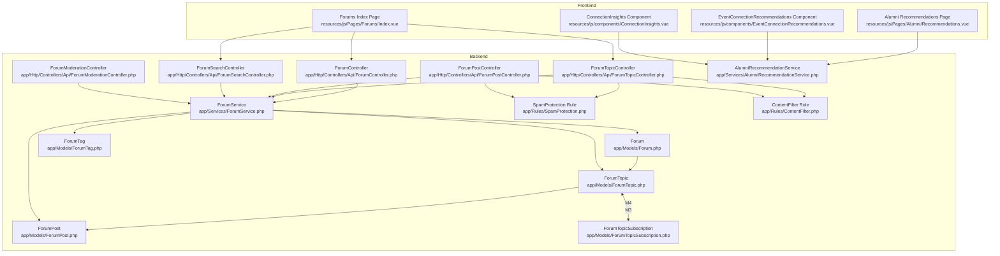

**Diagram sources**
- [Forum.php:10-101](file://app/Models/Forum.php#L10-L101)
- [ForumTopic.php:11-142](file://app/Models/ForumTopic.php#L11-L142)
- [ForumPost.php:9-151](file://app/Models/ForumPost.php#L9-L151)
- [ForumTag.php:9-66](file://app/Models/ForumTag.php#L9-L66)
- [ForumTopicSubscription.php:8-49](file://app/Models/ForumTopicSubscription.php#L8-L49)
- [ForumService.php:12-274](file://app/Services/ForumService.php#L12-L274)
- [ForumController.php:12-196](file://app/Http/Controllers/Api/ForumController.php#L12-L196)
- [ForumTopicController.php:15-383](file://app/Http/Controllers/Api/ForumTopicController.php#L15-L383)
- [ForumPostController.php:13-254](file://app/Http/Controllers/Api/ForumPostController.php#L13-L254)
- [ForumSearchController.php:12-154](file://app/Http/Controllers/Api/ForumSearchController.php#L12-L154)
- [ForumModerationController.php:11-128](file://app/Http/Controllers/Api/ForumModerationController.php#L11-L128)
- [SpamProtection.php:8-305](file://app/Rules/SpamProtection.php#L8-L305)
- [ContentFilter.php:122-167](file://app/Rules/ContentFilter.php#L122-L167)
- [AlumniRecommendationService.php:11-433](file://app/Services/AlumniRecommendationService.php#L11-L433)
- [Index.vue:112-272](file://resources/js/Pages/Forums/Index.vue#L112-L272)
- [Recommendations.vue:1-201](file://resources/js/Pages/Alumni/Recommendations.vue#L1-L201)
- [EventConnectionRecommendations.vue:240-282](file://resources/js/components/EventConnectionRecommendations.vue#L240-L282)
- [ConnectionInsights.vue:84-137](file://resources/js/components/ConnectionInsights.vue#L84-L137)

**Section sources**
- [Forum.php:10-101](file://app/Models/Forum.php#L10-L101)
- [ForumTopic.php:11-142](file://app/Models/ForumTopic.php#L11-L142)
- [ForumPost.php:9-151](file://app/Models/ForumPost.php#L9-L151)
- [ForumTag.php:9-66](file://app/Models/ForumTag.php#L9-L66)
- [ForumTopicSubscription.php:8-49](file://app/Models/ForumTopicSubscription.php#L8-L49)
- [ForumService.php:12-274](file://app/Services/ForumService.php#L12-L274)
- [ForumController.php:12-196](file://app/Http/Controllers/Api/ForumController.php#L12-L196)
- [ForumTopicController.php:15-383](file://app/Http/Controllers/Api/ForumTopicController.php#L15-L383)
- [ForumPostController.php:13-254](file://app/Http/Controllers/Api/ForumPostController.php#L13-L254)
- [ForumSearchController.php:12-154](file://app/Http/Controllers/Api/ForumSearchController.php#L12-L154)
- [ForumModerationController.php:11-128](file://app/Http/Controllers/Api/ForumModerationController.php#L11-L128)
- [SpamProtection.php:8-305](file://app/Rules/SpamProtection.php#L8-L305)
- [ContentFilter.php:122-167](file://app/Rules/ContentFilter.php#L122-L167)
- [AlumniRecommendationService.php:11-433](file://app/Services/AlumniRecommendationService.php#L11-L433)
- [Index.vue:112-272](file://resources/js/Pages/Forums/Index.vue#L112-L272)
- [Recommendations.vue:1-201](file://resources/js/Pages/Alumni/Recommendations.vue#L1-L201)
- [EventConnectionRecommendations.vue:240-282](file://resources/js/components/EventConnectionRecommendations.vue#L240-L282)
- [ConnectionInsights.vue:84-137](file://resources/js/components/ConnectionInsights.vue#L84-L137)

## Core Components
- Forum: Represents a discussion area with visibility, grouping, approval settings, and counters.
- ForumTopic: Represents a thread with lifecycle (active/locked/archived), sticky/announcement flags, and tag associations.
- ForumPost: Represents a post with nesting via parent_id, depth, and thread_path for threaded replies.
- ForumTag: Tagging system with popularity and featured flags.
- ForumTopicSubscription: Tracks user subscriptions and read status for topics.
- ForumService: Provides search, moderation, statistics, and tag aggregation.
- Controllers: Expose API endpoints for CRUD operations, subscriptions, likes, moderation, and search.
- AlumniRecommendationService: Generates personalized connection suggestions based on shared circles, mutual connections, interests, and geography.
- SpamProtection and ContentFilter: Validation rules to detect suspicious user agents and content patterns.

**Section sources**
- [Forum.php:10-101](file://app/Models/Forum.php#L10-L101)
- [ForumTopic.php:11-142](file://app/Models/ForumTopic.php#L11-L142)
- [ForumPost.php:9-151](file://app/Models/ForumPost.php#L9-L151)
- [ForumTag.php:9-66](file://app/Models/ForumTag.php#L9-L66)
- [ForumTopicSubscription.php:8-49](file://app/Models/ForumTopicSubscription.php#L8-L49)
- [ForumService.php:12-274](file://app/Services/ForumService.php#L12-L274)
- [ForumController.php:12-196](file://app/Http/Controllers/Api/ForumController.php#L12-L196)
- [ForumTopicController.php:15-383](file://app/Http/Controllers/Api/ForumTopicController.php#L15-L383)
- [ForumPostController.php:13-254](file://app/Http/Controllers/Api/ForumPostController.php#L13-L254)
- [ForumSearchController.php:12-154](file://app/Http/Controllers/Api/ForumSearchController.php#L12-L154)
- [ForumModerationController.php:11-128](file://app/Http/Controllers/Api/ForumModerationController.php#L11-L128)
- [AlumniRecommendationService.php:11-433](file://app/Services/AlumniRecommendationService.php#L11-L433)
- [SpamProtection.php:8-305](file://app/Rules/SpamProtection.php#L8-L305)
- [ContentFilter.php:122-167](file://app/Rules/ContentFilter.php#L122-L167)

## Architecture Overview
The system follows a layered architecture:
- Presentation: Vue pages and components consume REST endpoints.
- API: Controllers validate requests, enforce permissions, and delegate to services.
- Service Layer: Encapsulates business logic for search, moderation, and analytics.
- Persistence: Eloquent models define relationships and scopes.

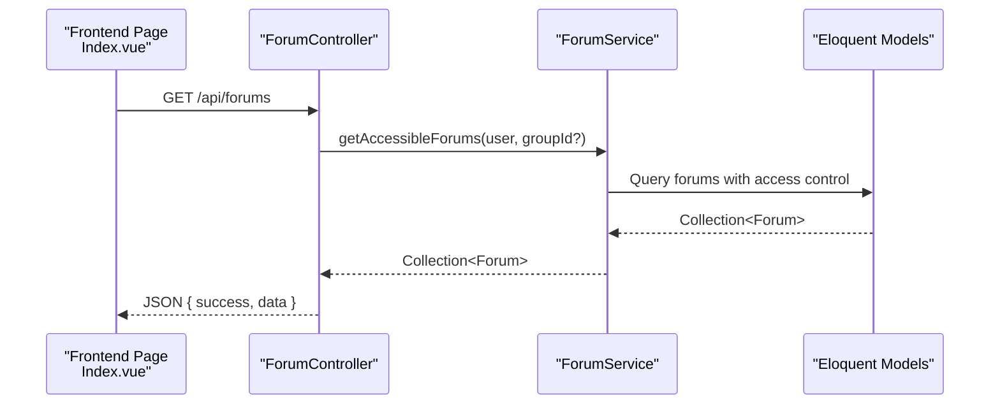

**Diagram sources**
- [Index.vue:112-272](file://resources/js/Pages/Forums/Index.vue#L112-L272)
- [ForumController.php:12-196](file://app/Http/Controllers/Api/ForumController.php#L12-L196)
- [ForumService.php:12-40](file://app/Services/ForumService.php#L12-L40)

**Section sources**
- [ForumController.php:12-196](file://app/Http/Controllers/Api/ForumController.php#L12-L196)
- [ForumService.php:12-40](file://app/Services/ForumService.php#L12-L40)
- [Index.vue:112-272](file://resources/js/Pages/Forums/Index.vue#L112-L272)

## Detailed Component Analysis

### Hierarchical Data Model
The forum domain is modeled with clear parent-child relationships and supporting metadata.

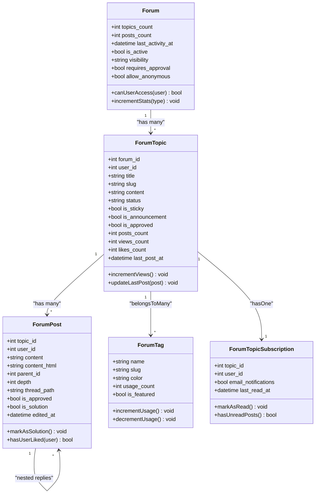

**Diagram sources**
- [Forum.php:10-101](file://app/Models/Forum.php#L10-L101)
- [ForumTopic.php:11-142](file://app/Models/ForumTopic.php#L11-L142)
- [ForumPost.php:9-151](file://app/Models/ForumPost.php#L9-L151)
- [ForumTag.php:9-66](file://app/Models/ForumTag.php#L9-L66)
- [ForumTopicSubscription.php:8-49](file://app/Models/ForumTopicSubscription.php#L8-L49)

**Section sources**
- [Forum.php:10-101](file://app/Models/Forum.php#L10-L101)
- [ForumTopic.php:11-142](file://app/Models/ForumTopic.php#L11-L142)
- [ForumPost.php:9-151](file://app/Models/ForumPost.php#L9-L151)
- [ForumTag.php:9-66](file://app/Models/ForumTag.php#L9-L66)
- [ForumTopicSubscription.php:8-49](file://app/Models/ForumTopicSubscription.php#L8-L49)

### Forum Creation and Permissions
- Creation: Only authorized users can create forums; visibility can be public, private, or group-only.
- Access Control: Users can access public forums or group-only forums if they are members of the associated group; admins/moderators can access private forums.
- Updates/Deletions: Controlled by authorization policies enforced in controllers.

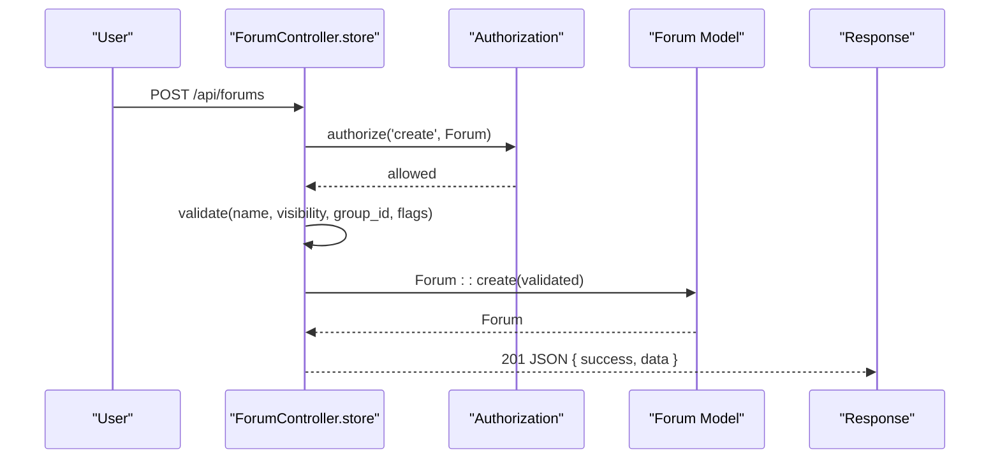

**Diagram sources**
- [ForumController.php:69-91](file://app/Http/Controllers/Api/ForumController.php#L69-L91)
- [Forum.php:81-93](file://app/Models/Forum.php#L81-L93)

**Section sources**
- [ForumController.php:69-91](file://app/Http/Controllers/Api/ForumController.php#L69-L91)
- [Forum.php:81-93](file://app/Models/Forum.php#L81-L93)

### Topic Management and Workflow
- Creation: Topics are created under a forum; approval depends on forum settings; tags are normalized and usage counts updated.
- Editing/Archival: Topics can be edited by owners or moderators; statuses include active, locked, archived.
- Deletion: Removes topic and decrements tag usage counts.
- Pagination: Topics are paginated with configurable per_page.

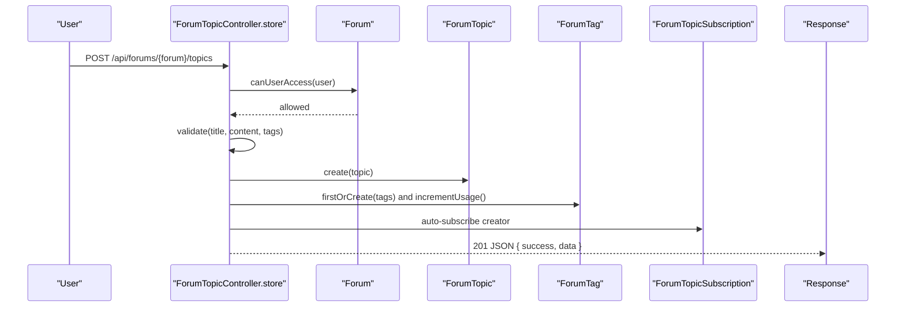

**Diagram sources**
- [ForumTopicController.php:86-150](file://app/Http/Controllers/Api/ForumTopicController.php#L86-L150)
- [Forum.php:81-93](file://app/Models/Forum.php#L81-L93)
- [ForumTopic.php:11-142](file://app/Models/ForumTopic.php#L11-L142)
- [ForumTag.php:9-66](file://app/Models/ForumTag.php#L9-L66)
- [ForumTopicSubscription.php:8-49](file://app/Models/ForumTopicSubscription.php#L8-L49)

**Section sources**
- [ForumTopicController.php:86-150](file://app/Http/Controllers/Api/ForumTopicController.php#L86-L150)
- [ForumTopic.php:11-142](file://app/Models/ForumTopic.php#L11-L142)
- [ForumTag.php:9-66](file://app/Models/ForumTag.php#L9-L66)
- [ForumTopicSubscription.php:8-49](file://app/Models/ForumTopicSubscription.php#L8-L49)

### Post Moderation and Nested Replies
- Approval: Posts inherit forum approval setting; moderation actions (approve/reject/delete) are available to admins/moderators.
- Nested Replies: Posts support threading via parent_id, depth, and thread_path; retrieval aggregates top-level posts and their replies.
- Likes: Users can like/unlike posts; ownership checks apply for editing/deleting.
- Solution marking: Only topic creators or moderators can mark a post as the solution.

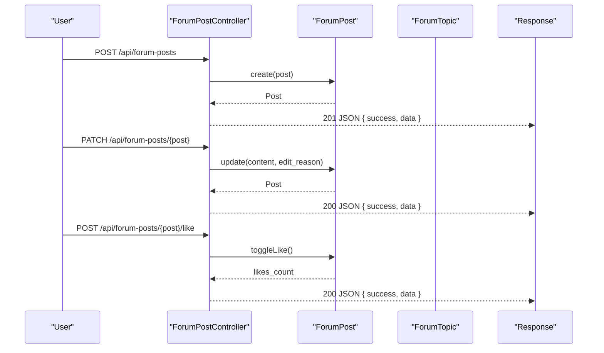

**Diagram sources**
- [ForumPostController.php:18-254](file://app/Http/Controllers/Api/ForumPostController.php#L18-L254)
- [ForumPost.php:9-151](file://app/Models/ForumPost.php#L9-L151)
- [ForumTopic.php:11-142](file://app/Models/ForumTopic.php#L11-L142)

**Section sources**
- [ForumPostController.php:18-254](file://app/Http/Controllers/Api/ForumPostController.php#L18-L254)
- [ForumPost.php:9-151](file://app/Models/ForumPost.php#L9-L151)
- [ForumTopic.php:11-142](file://app/Models/ForumTopic.php#L11-L142)

### Search, Tags, and Popular Tags
- Full-text search: Searches titles and content across accessible forums; supports filters by forum, tag, and author.
- Tagging: Topics can be tagged; tags are normalized and usage counts maintained.
- Popular tags: Endpoint returns popular or featured tags with usage counts.

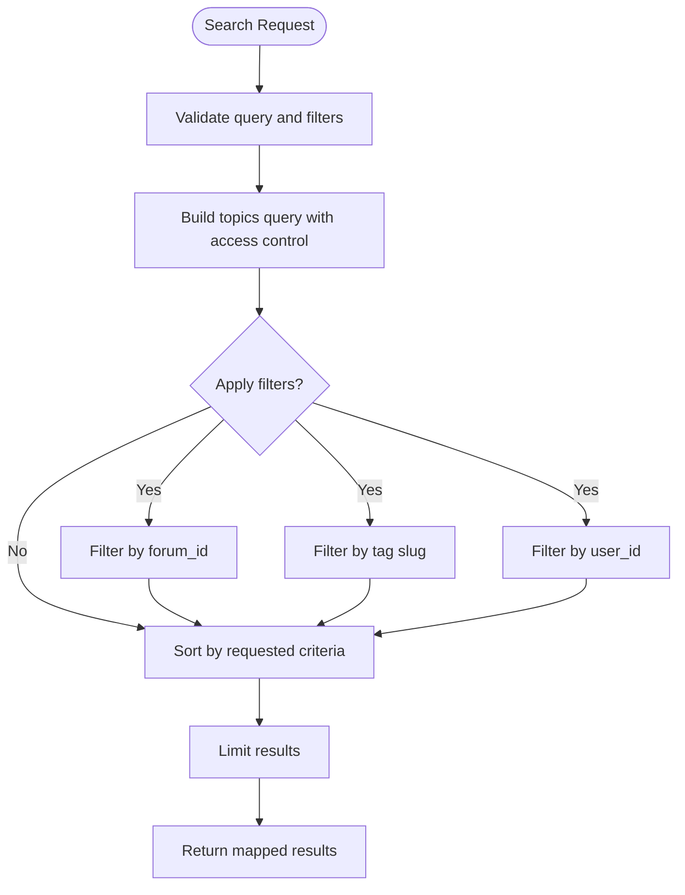

**Diagram sources**
- [ForumSearchController.php:21-107](file://app/Http/Controllers/Api/ForumSearchController.php#L21-L107)
- [ForumService.php:45-108](file://app/Services/ForumService.php#L45-L108)
- [ForumTag.php:46-49](file://app/Models/ForumTag.php#L46-L49)

**Section sources**
- [ForumSearchController.php:21-107](file://app/Http/Controllers/Api/ForumSearchController.php#L21-L107)
- [ForumService.php:45-108](file://app/Services/ForumService.php#L45-L108)
- [ForumTag.php:46-49](file://app/Models/ForumTag.php#L46-L49)

### Forum Subscriptions and Unread Tracking
- Subscription toggling: Users can subscribe/unsubscribe to topics; auto-subscription occurs on topic creation.
- Read tracking: Subscriptions record last_read_at; unread detection compares post timestamps to last_read_at.

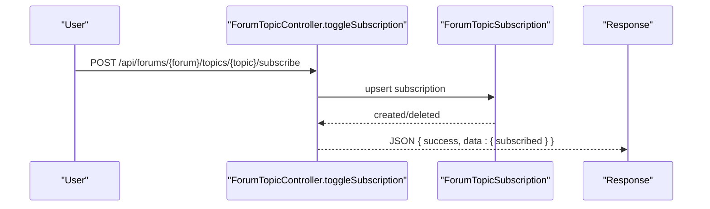

**Diagram sources**
- [ForumTopicController.php:348-381](file://app/Http/Controllers/Api/ForumTopicController.php#L348-L381)
- [ForumTopicSubscription.php:8-49](file://app/Models/ForumTopicSubscription.php#L8-L49)

**Section sources**
- [ForumTopicController.php:348-381](file://app/Http/Controllers/Api/ForumTopicController.php#L348-L381)
- [ForumTopicSubscription.php:8-49](file://app/Models/ForumTopicSubscription.php#L8-L49)

### Moderation Workflow
- Pending moderation: Lists topics/posts awaiting review for accessible forums.
- Actions: Approve, reject, or delete content; updates approvals and timestamps.

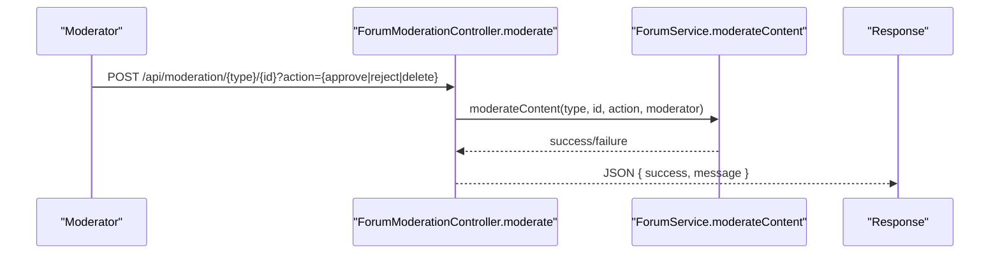

**Diagram sources**
- [ForumModerationController.php:20-61](file://app/Http/Controllers/Api/ForumModerationController.php#L20-L61)
- [ForumService.php:202-242](file://app/Services/ForumService.php#L202-L242)

**Section sources**
- [ForumModerationController.php:20-61](file://app/Http/Controllers/Api/ForumModerationController.php#L20-L61)
- [ForumService.php:202-242](file://app/Services/ForumService.php#L202-L242)

### Alumni Networking and Connection Recommendations
- Recommendation engine: Scores candidates based on shared circles, mutual connections, interest similarity, and geographic proximity; caches results.
- Frontend integration: Pages and components surface recommendations, allow connecting, and provide insights.

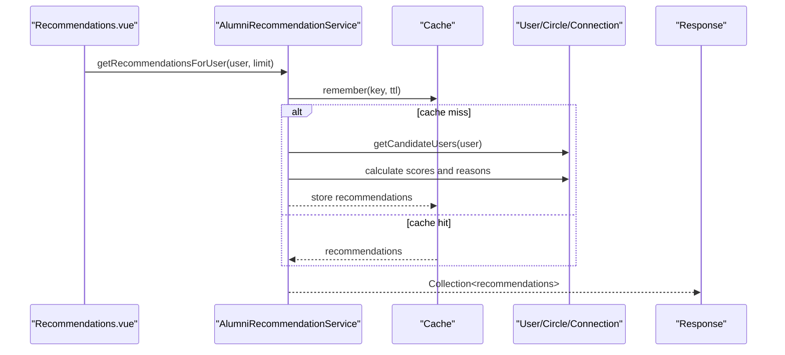

**Diagram sources**
- [Recommendations.vue:1-201](file://resources/js/Pages/Alumni/Recommendations.vue#L1-L201)
- [AlumniRecommendationService.php:29-57](file://app/Services/AlumniRecommendationService.php#L29-L57)
- [EventConnectionRecommendations.vue:240-282](file://resources/js/components/EventConnectionRecommendations.vue#L240-L282)
- [ConnectionInsights.vue:84-137](file://resources/js/components/ConnectionInsights.vue#L84-L137)

**Section sources**
- [AlumniRecommendationService.php:11-433](file://app/Services/AlumniRecommendationService.php#L11-L433)
- [Recommendations.vue:1-201](file://resources/js/Pages/Alumni/Recommendations.vue#L1-L201)
- [EventConnectionRecommendations.vue:240-282](file://resources/js/components/EventConnectionRecommendations.vue#L240-L282)
- [ConnectionInsights.vue:84-137](file://resources/js/components/ConnectionInsights.vue#L84-L137)

### Spam Protection and Content Moderation
- User agent validation: Detects suspicious or fake user agents and blocks them.
- Content analysis: Flags suspicious keywords, excessive URLs, punctuation, caps, repetition, and gibberish.
- Integration: Controllers can leverage these rules during creation/update operations.

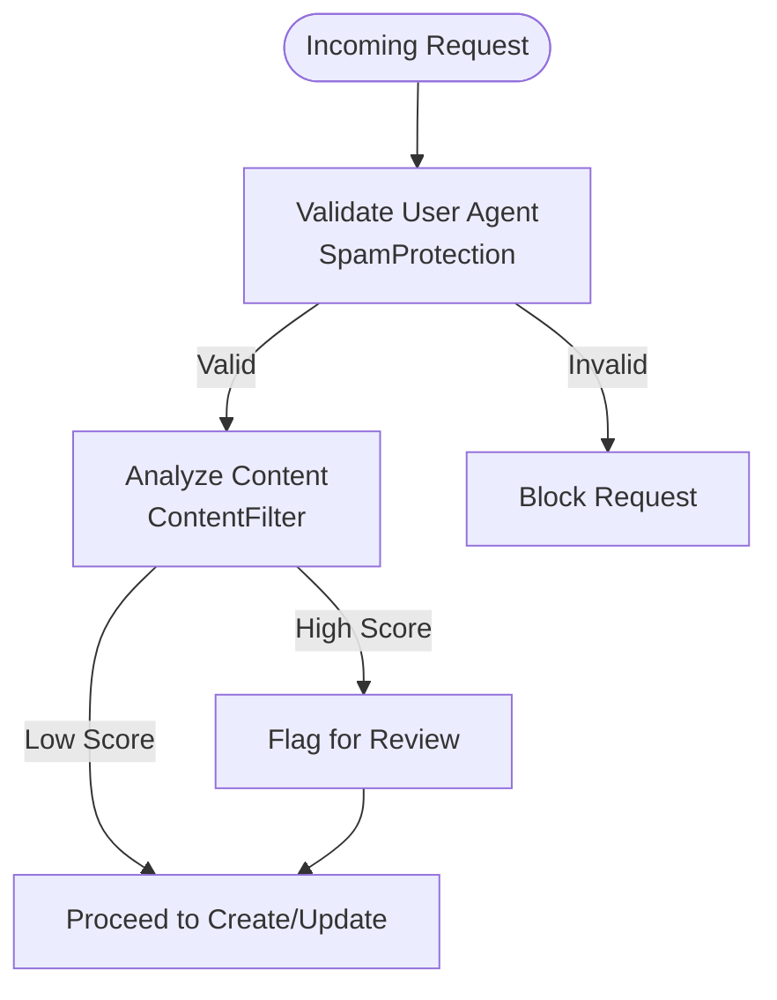

**Diagram sources**
- [SpamProtection.php:156-215](file://app/Rules/SpamProtection.php#L156-L215)
- [ContentFilter.php:122-167](file://app/Rules/ContentFilter.php#L122-L167)
- [ForumTopicController.php:86-150](file://app/Http/Controllers/Api/ForumTopicController.php#L86-L150)
- [ForumPostController.php:18-79](file://app/Http/Controllers/Api/ForumPostController.php#L18-L79)

**Section sources**
- [SpamProtection.php:8-305](file://app/Rules/SpamProtection.php#L8-L305)
- [ContentFilter.php:122-167](file://app/Rules/ContentFilter.php#L122-L167)
- [ForumTopicController.php:86-150](file://app/Http/Controllers/Api/ForumTopicController.php#L86-L150)
- [ForumPostController.php:18-79](file://app/Http/Controllers/Api/ForumPostController.php#L18-L79)

### Reporting Mechanisms
- Recommendations can be dismissed by users and cached to prevent repeated exposure.
- Moderation actions apply to topics and posts; pending moderation lists are available to authorized users.

**Section sources**
- [AlumniRecommendationService.php:388-400](file://app/Services/AlumniRecommendationService.php#L388-L400)
- [ForumModerationController.php:66-126](file://app/Http/Controllers/Api/ForumModerationController.php#L66-L126)

### Community Building Features
- Sticky and announcement flags elevate important topics.
- Tags enable discovery and categorization.
- Subscriptions and read tracking keep users engaged.
- Forum statistics and recent activity feed highlight community health.

**Section sources**
- [ForumTopic.php:11-142](file://app/Models/ForumTopic.php#L11-L142)
- [ForumTag.php:9-66](file://app/Models/ForumTag.php#L9-L66)
- [ForumTopicSubscription.php:8-49](file://app/Models/ForumTopicSubscription.php#L8-L49)
- [ForumService.php:132-198](file://app/Services/ForumService.php#L132-L198)

## Dependency Analysis
- Controllers depend on services for business logic and on models for persistence.
- Services depend on models and collections for queries and aggregations.
- Frontend pages depend on controllers via REST endpoints and on services for recommendations.

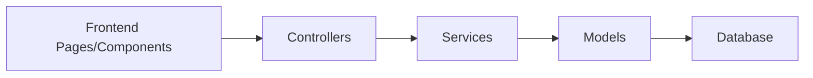

**Diagram sources**
- [ForumController.php:12-196](file://app/Http/Controllers/Api/ForumController.php#L12-L196)
- [ForumService.php:12-274](file://app/Services/ForumService.php#L12-L274)
- [Forum.php:10-101](file://app/Models/Forum.php#L10-L101)
- [ForumTopic.php:11-142](file://app/Models/ForumTopic.php#L11-L142)
- [ForumPost.php:9-151](file://app/Models/ForumPost.php#L9-L151)
- [ForumTag.php:9-66](file://app/Models/ForumTag.php#L9-L66)
- [ForumTopicSubscription.php:8-49](file://app/Models/ForumTopicSubscription.php#L8-L49)

**Section sources**
- [ForumController.php:12-196](file://app/Http/Controllers/Api/ForumController.php#L12-L196)
- [ForumService.php:12-274](file://app/Services/ForumService.php#L12-L274)
- [Forum.php:10-101](file://app/Models/Forum.php#L10-L101)
- [ForumTopic.php:11-142](file://app/Models/ForumTopic.php#L11-L142)
- [ForumPost.php:9-151](file://app/Models/ForumPost.php#L9-L151)
- [ForumTag.php:9-66](file://app/Models/ForumTag.php#L9-L66)
- [ForumTopicSubscription.php:8-49](file://app/Models/ForumTopicSubscription.php#L8-L49)

## Performance Considerations
- Pagination: Controllers paginate topics and tag results to avoid large payloads.
- Lazy loading: Controllers eager-load relationships (e.g., latest topics, posts) to reduce N+1 queries.
- Indexing: Ensure database indexes on frequently filtered columns (e.g., forum_id, is_approved, created_at).
- Caching: Recommendation service caches results; consider caching popular tags and forum statistics.
- Denormalization: Forum maintains counts (topics_count, posts_count) and last_activity_at for quick rendering.

**Section sources**
- [ForumTopicController.php:69-80](file://app/Http/Controllers/Api/ForumTopicController.php#L69-L80)
- [ForumSearchController.php:132-151](file://app/Http/Controllers/Api/ForumSearchController.php#L132-L151)
- [Forum.php:95-99](file://app/Models/Forum.php#L95-L99)
- [AlumniRecommendationService.php:31-56](file://app/Services/AlumniRecommendationService.php#L31-L56)

## Troubleshooting Guide
- Access Denied: Ensure the user meets visibility requirements (public/group membership/admin/moderator).
- Locked Topic: Prevents new posts; unlock or contact a moderator.
- Invalid Parent Post: Parent must belong to the same topic; verify thread_path and parent_id.
- Insufficient Permissions: Moderation actions require admin/moderator roles.
- Recommendation Not Showing: Verify user profile completeness and cache clearing if needed.

**Section sources**
- [ForumController.php:96-105](file://app/Http/Controllers/Api/ForumController.php#L96-L105)
- [ForumTopicController.php:29-34](file://app/Http/Controllers/Api/ForumTopicController.php#L29-L34)
- [ForumPostController.php:42-50](file://app/Http/Controllers/Api/ForumPostController.php#L42-L50)
- [ForumModerationController.php:24-30](file://app/Http/Controllers/Api/ForumModerationController.php#L24-L30)
- [AlumniRecommendationService.php:388-400](file://app/Services/AlumniRecommendationService.php#L388-L400)

## Conclusion
The discussion forums and networking system combines a robust hierarchical model with strong access control, moderation, tagging, and search capabilities. The integration with alumni recommendations enhances community building and connection opportunities. With pagination, caching, and performance-aware queries, the system scales to large communities while maintaining usability and safety.

## Appendices
- API endpoints for alumni networking and connections are documented in the frontend API documentation resource.

**Section sources**
- [completeApiDocumentation.js:210-259](file://resources/js/Data/completeApiDocumentation.js#L210-L259)