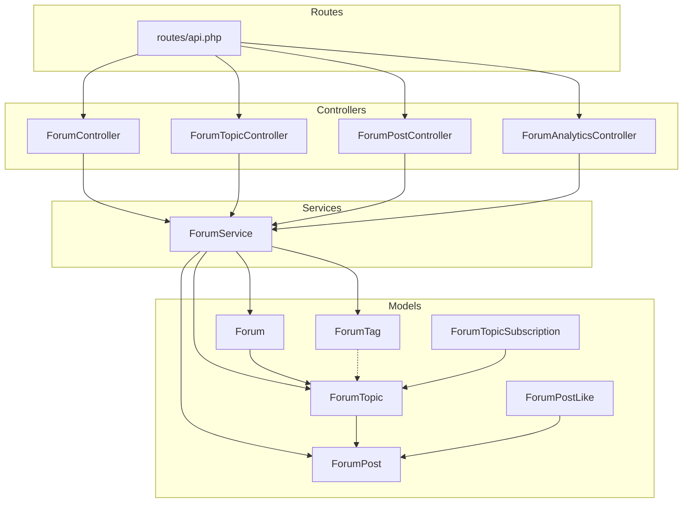
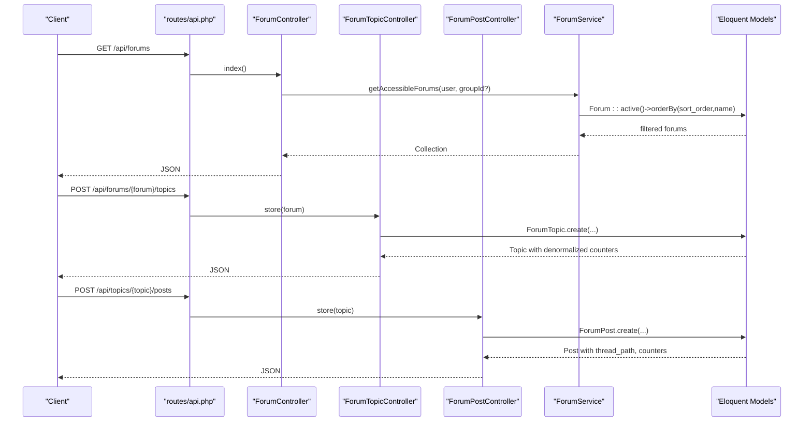
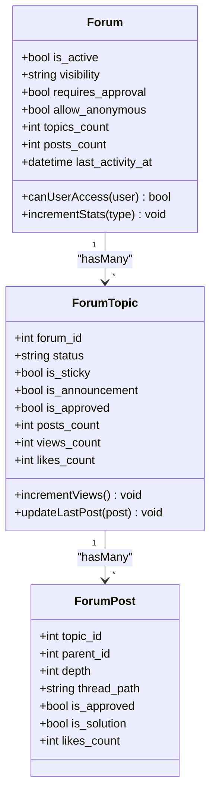
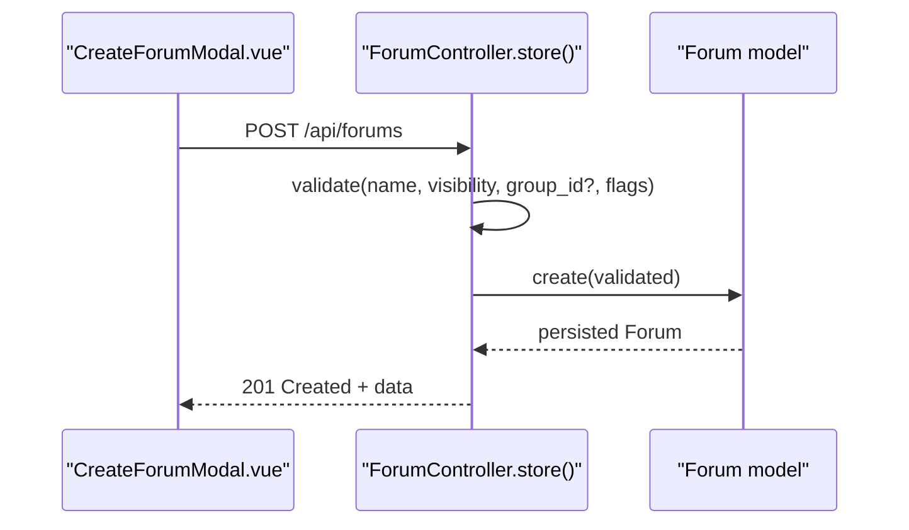
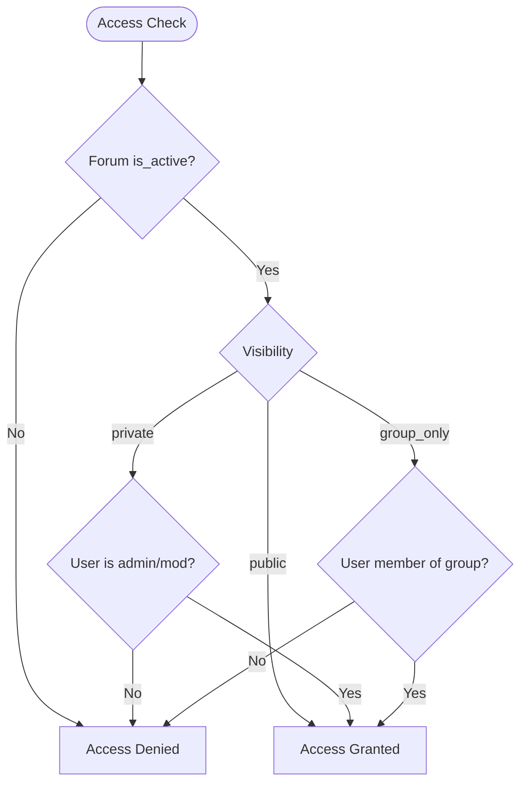
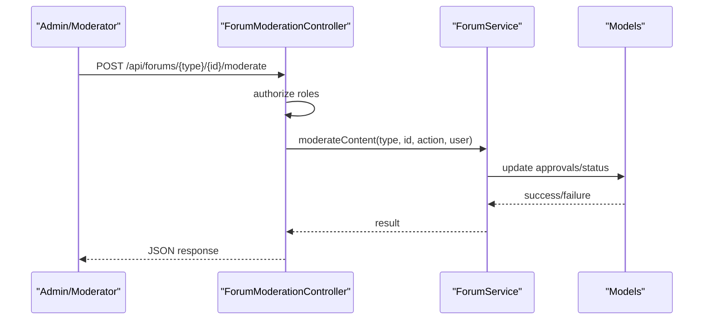
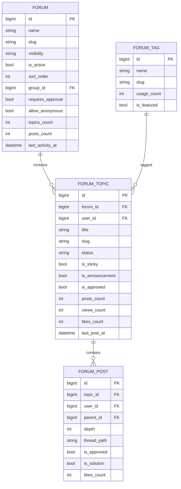
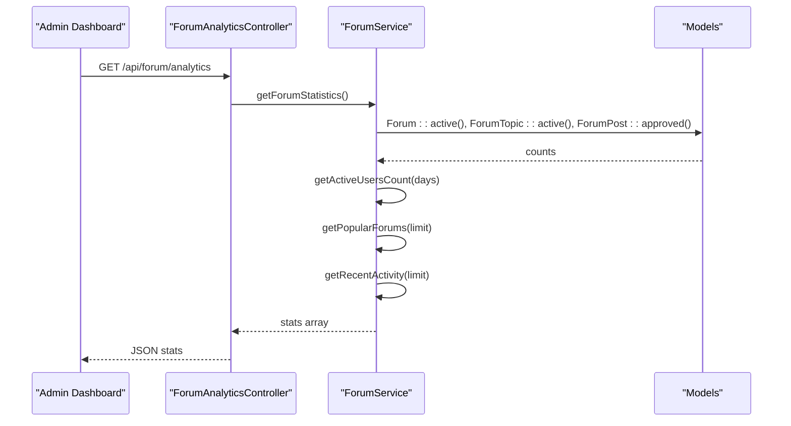
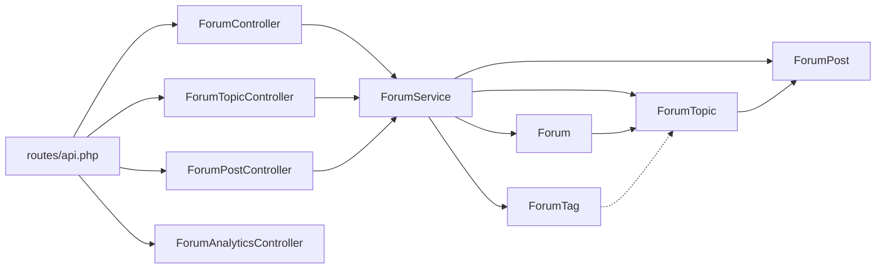

# Forum Management

<cite>
**Referenced Files in This Document**
- [Forum.php](file://app/Models/Forum.php)
- [ForumTopic.php](file://app/Models/ForumTopic.php)
- [ForumPost.php](file://app/Models/ForumPost.php)
- [ForumTag.php](file://app/Models/ForumTag.php)
- [ForumPostLike.php](file://app/Models/ForumPostLike.php)
- [ForumTopicSubscription.php](file://app/Models/ForumTopicSubscription.php)
- [ForumController.php](file://app/Http/Controllers/Api/ForumController.php)
- [ForumTopicController.php](file://app/Http/Controllers/Api/ForumTopicController.php)
- [ForumPostController.php](file://app/Http/Controllers/Api/ForumPostController.php)
- [ForumAnalyticsController.php](file://app/Http/Controllers/Api/ForumAnalyticsController.php)
- [ForumService.php](file://app/Services/ForumService.php)
- [api.php](file://routes/api.php)
- [CreateForumModal.vue](file://resources/js/components/Forums/CreateForumModal.vue)
- [Index.vue](file://resources/js/Pages/Forums/Index.vue)
- [2025_08_14_153603_create_forum_topics_table.php](file://database/migrations/2025_08_14_153603_create_forum_topics_table.php)
- [2025_08_14_153615_create_forum_posts_table.php](file://database/migrations/2025_08_14_153615_create_forum_posts_table.php)
- [2025_08_14_153645_create_forum_tags_table.php](file://database/migrations/2025_08_14_153645_create_forum_tags_table.php)
- [ForumSeeder.php](file://database/seeders/ForumSeeder.php)
</cite>

## Table of Contents
1. [Introduction](#introduction)
2. [Project Structure](#project-structure)
3. [Core Components](#core-components)
4. [Architecture Overview](#architecture-overview)
5. [Detailed Component Analysis](#detailed-component-analysis)
6. [Dependency Analysis](#dependency-analysis)
7. [Performance Considerations](#performance-considerations)
8. [Troubleshooting Guide](#troubleshooting-guide)
9. [Conclusion](#conclusion)
10. [Appendices](#appendices)

## Introduction
This document describes the forum management system in the Alumate platform. It covers the hierarchical structure (forums → topics → posts), visibility and access control, administrative controls, moderation workflows, statistics and popularity tracking, and lifecycle management including activation/deactivation and cleanup. It also documents configuration options, sorting mechanisms, group-based access, and the administrative dashboard features.

## Project Structure
The forum system spans models, controllers, services, routes, and frontend components:
- Models define the domain entities and relationships (Forum, ForumTopic, ForumPost, ForumTag, ForumPostLike, ForumTopicSubscription).
- Controllers expose REST endpoints for CRUD operations, moderation, and discovery.
- Service encapsulates business logic for access filtering, statistics, and moderation actions.
- Routes define the API surface for forum, topic, and post management.
- Frontend components provide the UI for creating forums and displaying community stats.

**Diagram sources**
- [api.php:688-705](file://routes/api.php#L688-L705)
- [ForumController.php:12-196](file://app/Http/Controllers/Api/ForumController.php#L12-L196)
- [ForumTopicController.php:15-383](file://app/Http/Controllers/Api/ForumTopicController.php#L15-L383)
- [ForumPostController.php:13-254](file://app/Http/Controllers/Api/ForumPostController.php#L13-L254)
- [ForumAnalyticsController.php:9-30](file://app/Http/Controllers/Api/ForumAnalyticsController.php#L9-L30)
- [ForumService.php:12-198](file://app/Services/ForumService.php#L12-L198)
- [Forum.php:10-101](file://app/Models/Forum.php#L10-L101)
- [ForumTopic.php:11-142](file://app/Models/ForumTopic.php#L11-L142)
- [ForumPost.php:9-151](file://app/Models/ForumPost.php#L9-L151)
- [ForumTag.php:9-66](file://app/Models/ForumTag.php#L9-L66)
- [ForumPostLike.php:8-39](file://app/Models/ForumPostLike.php#L8-L39)
- [ForumTopicSubscription.php:8-49](file://app/Models/ForumTopicSubscription.php#L8-L49)

**Section sources**
- [api.php:688-705](file://routes/api.php#L688-L705)
- [ForumController.php:12-196](file://app/Http/Controllers/Api/ForumController.php#L12-L196)
- [ForumTopicController.php:15-383](file://app/Http/Controllers/Api/ForumTopicController.php#L15-L383)
- [ForumPostController.php:13-254](file://app/Http/Controllers/Api/ForumPostController.php#L13-L254)
- [ForumAnalyticsController.php:9-30](file://app/Http/Controllers/Api/ForumAnalyticsController.php#L9-L30)
- [ForumService.php:12-198](file://app/Services/ForumService.php#L12-L198)
- [Forum.php:10-101](file://app/Models/Forum.php#L10-L101)
- [ForumTopic.php:11-142](file://app/Models/ForumTopic.php#L11-L142)
- [ForumPost.php:9-151](file://app/Models/ForumPost.php#L9-L151)
- [ForumTag.php:9-66](file://app/Models/ForumTag.php#L9-L66)
- [ForumPostLike.php:8-39](file://app/Models/ForumPostLike.php#L8-L39)
- [ForumTopicSubscription.php:8-49](file://app/Models/ForumTopicSubscription.php#L8-L49)

## Core Components
- Forum: Top-level container with visibility, grouping, approval settings, counters, and access checks.
- ForumTopic: Thread within a forum with statuses (active/locked/archived), stickiness, announcements, approvals, and denormalized stats.
- ForumPost: Hierarchical reply structure under topics with approvals, editing metadata, and likes.
- ForumTag: Tagging system for topics with usage counts and popularity.
- ForumPostLike: Per-post likes with denormalized counts.
- ForumTopicSubscription: User subscriptions to topics with read tracking and email preferences.

Key configuration options exposed via controllers and models include:
- Visibility: public, private, group_only.
- Approval gating: requires_approval.
- Anonymous posting: allow_anonymous.
- Sorting: sort_order for forums.
- Moderation: is_approved, approved_by, approved_at.
- Lifecycle: is_active, status (topic), archived/locked.

**Section sources**
- [Forum.php:12-34](file://app/Models/Forum.php#L12-L34)
- [ForumTopic.php:13-38](file://app/Models/ForumTopic.php#L13-L38)
- [ForumPost.php:11-27](file://app/Models/ForumPost.php#L11-L27)
- [ForumTag.php:11-22](file://app/Models/ForumTag.php#L11-L22)
- [ForumPostLike.php:10-14](file://app/Models/ForumPostLike.php#L10-L14)
- [ForumTopicSubscription.php:10-15](file://app/Models/ForumTopicSubscription.php#L10-L15)
- [ForumController.php:73-82](file://app/Http/Controllers/Api/ForumController.php#L73-L82)
- [ForumTopicController.php:97-102](file://app/Http/Controllers/Api/ForumTopicController.php#L97-L102)
- [ForumPostController.php:36-39](file://app/Http/Controllers/Api/ForumPostController.php#L36-L39)

## Architecture Overview
The system follows a layered architecture:
- API layer: Controllers handle requests, validations, and responses.
- Service layer: ForumService centralizes access control, statistics, and moderation orchestration.
- Persistence layer: Eloquent models with scopes and boot hooks manage relationships and denormalized counters.
- Routing layer: RESTful routes for forums, topics, posts, and analytics.

**Diagram sources**
- [api.php:688-705](file://routes/api.php#L688-L705)
- [ForumController.php:17-64](file://app/Http/Controllers/Api/ForumController.php#L17-L64)
- [ForumTopicController.php:86-150](file://app/Http/Controllers/Api/ForumTopicController.php#L86-L150)
- [ForumPostController.php:18-79](file://app/Http/Controllers/Api/ForumPostController.php#L18-L79)
- [ForumService.php:17-39](file://app/Services/ForumService.php#L17-L39)
- [Forum.php:66-79](file://app/Models/Forum.php#L66-L79)
- [ForumTopic.php:50-57](file://app/Models/ForumTopic.php#L50-L57)
- [ForumPost.php:52-65](file://app/Models/ForumPost.php#L52-L65)

## Detailed Component Analysis

### Forum Model and Access Control
- Visibility and access:
  - Public forums are visible to all active users.
  - Private forums require admin/moderator roles.
  - Group-only forums require membership in the associated group.
- Lifecycle:
  - is_active toggles visibility in listings.
  - Sort order and name govern presentation.
- Denormalized counters:
  - topics_count, posts_count, last_activity_at updated via boot hooks.

**Diagram sources**
- [Forum.php:10-101](file://app/Models/Forum.php#L10-L101)
- [ForumTopic.php:11-142](file://app/Models/ForumTopic.php#L11-L142)
- [ForumPost.php:9-151](file://app/Models/ForumPost.php#L9-L151)

**Section sources**
- [Forum.php:81-93](file://app/Models/Forum.php#L81-L93)
- [Forum.php:66-79](file://app/Models/Forum.php#L66-L79)
- [Forum.php:95-99](file://app/Models/Forum.php#L95-L99)
- [ForumTopic.php:122-135](file://app/Models/ForumTopic.php#L122-L135)
- [ForumPost.php:40-65](file://app/Models/ForumPost.php#L40-L65)

### Forum Creation and Configuration
- Backend creation validates name, description, color, icon, visibility, optional group association, and approval/anonymous flags.
- Frontend modal captures required fields and passes them to the API.

**Diagram sources**
- [CreateForumModal.vue:17-45](file://resources/js/components/Forums/CreateForumModal.vue#L17-L45)
- [ForumController.php:69-91](file://app/Http/Controllers/Api/ForumController.php#L69-L91)

**Section sources**
- [ForumController.php:69-91](file://app/Http/Controllers/Api/ForumController.php#L69-L91)
- [CreateForumModal.vue:17-45](file://resources/js/components/Forums/CreateForumModal.vue#L17-L45)

### Visibility Settings and Group-Based Access
- Controllers filter forums by visibility and group membership for non-admin users.
- ForumService applies the same logic for broader access queries.

**Diagram sources**
- [Forum.php:81-93](file://app/Models/Forum.php#L81-L93)
- [ForumController.php:28-39](file://app/Http/Controllers/Api/ForumController.php#L28-L39)
- [ForumService.php:27-37](file://app/Services/ForumService.php#L27-L37)

**Section sources**
- [Forum.php:81-93](file://app/Models/Forum.php#L81-L93)
- [ForumController.php:28-39](file://app/Http/Controllers/Api/ForumController.php#L28-L39)
- [ForumService.php:27-37](file://app/Services/ForumService.php#L27-L37)

### Administrative Controls and Moderation
- Moderation endpoint enforces admin/moderator roles and supports approve/reject/delete actions.
- Topic/post updates/edits enforce ownership or moderator/admin privileges.
- Solution marking restricted to topic creator or moderators.

**Diagram sources**
- [ForumModerationController.php:11-49](file://app/Http/Controllers/Api/ForumModerationController.php#L11-L49)
- [ForumService.php:12-198](file://app/Services/ForumService.php#L12-L198)

**Section sources**
- [ForumModerationController.php:20-49](file://app/Http/Controllers/Api/ForumModerationController.php#L20-L49)
- [ForumTopicController.php:255-316](file://app/Http/Controllers/Api/ForumTopicController.php#L255-L316)
- [ForumPostController.php:134-186](file://app/Http/Controllers/Api/ForumPostController.php#L134-L186)

### Hierarchical Structure: Forums → Topics → Posts
- Topics belong to forums and maintain denormalized counters and last-post metadata.
- Posts belong to topics and support nested replies via thread_path and depth.
- Tags are associated with topics and tracked for popularity.

**Diagram sources**
- [Forum.php:12-27](file://app/Models/Forum.php#L12-L27)
- [ForumTopic.php:13-30](file://app/Models/ForumTopic.php#L13-L30)
- [ForumPost.php:11-27](file://app/Models/ForumPost.php#L11-L27)
- [ForumTag.php:11-18](file://app/Models/ForumTag.php#L11-L18)
- [2025_08_14_153603_create_forum_topics_table.php:14-33](file://database/migrations/2025_08_14_153603_create_forum_topics_table.php#L14-L33)
- [2025_08_14_153615_create_forum_posts_table.php:14-47](file://database/migrations/2025_08_14_153615_create_forum_posts_table.php#L14-L47)
- [2025_08_14_153645_create_forum_tags_table.php:14-38](file://database/migrations/2025_08_14_153645_create_forum_tags_table.php#L14-L38)

**Section sources**
- [ForumTopic.php:59-98](file://app/Models/ForumTopic.php#L59-L98)
- [ForumPost.php:67-100](file://app/Models/ForumPost.php#L67-L100)
- [ForumTag.php:35-39](file://app/Models/ForumTag.php#L35-L39)

### Sorting Mechanisms
- Forums: sort_order, then name.
- Topics: default activity (sticky/announcement first, then last_post_at descending); alternatives include newest, oldest, popular (views).
- Posts: top-level posts ordered by creation time; replies inherit ordering via thread_path.

**Section sources**
- [ForumController.php:19-22](file://app/Http/Controllers/Api/ForumController.php#L19-L22)
- [ForumTopicController.php:50-67](file://app/Http/Controllers/Api/ForumTopicController.php#L50-L67)
- [ForumPost.php:117-134](file://app/Models/ForumPost.php#L117-L134)

### Forum Categories and Tagging
- Topics can be tagged; tags are normalized (name/slug) and usage counted.
- Popular tags are computed via scope and returned by the service.

**Section sources**
- [ForumTopicController.php:113-125](file://app/Http/Controllers/Api/ForumTopicController.php#L113-L125)
- [ForumTag.php:46-49](file://app/Models/ForumTag.php#L46-L49)
- [ForumService.php:113-127](file://app/Services/ForumService.php#L113-L127)

### User Role Assignments and Permissions
- Access checks rely on user roles (admin, moderator) for private visibility and moderation actions.
- Ownership checks apply for editing/deleting own posts/topics.

**Section sources**
- [ForumController.php:100-105](file://app/Http/Controllers/Api/ForumController.php#L100-L105)
- [ForumTopicController.php:259-264](file://app/Http/Controllers/Api/ForumTopicController.php#L259-L264)
- [ForumPostController.php:138-143](file://app/Http/Controllers/Api/ForumPostController.php#L138-L143)
- [ForumModerationController.php:25-30](file://app/Http/Controllers/Api/ForumModerationController.php#L25-L30)

### Forum Statistics and Popularity Metrics
- Admin dashboard statistics include total forums, topics, posts, tags, active users (daily/weekly), popular forums, and recent activity.
- Metrics leverage denormalized counters and approved scopes.

**Diagram sources**
- [ForumAnalyticsController.php:9-30](file://app/Http/Controllers/Api/ForumAnalyticsController.php#L9-L30)
- [ForumService.php:132-198](file://app/Services/ForumService.php#L132-L198)
- [Index.vue:112-133](file://resources/js/Pages/Forums/Index.vue#L112-L133)

**Section sources**
- [ForumAnalyticsController.php:30-30](file://app/Http/Controllers/Api/ForumAnalyticsController.php#L30-L30)
- [ForumService.php:132-198](file://app/Services/ForumService.php#L132-L198)
- [Index.vue:112-133](file://resources/js/Pages/Forums/Index.vue#L112-L133)

### Lifecycle Management: Activation/Deactivation and Cleanup
- Activation: is_active flag controls listing visibility.
- Deactivation: removing access via visibility and is_active.
- Cleanup:
  - Deleting topics decrements forum/topic counters.
  - Deleting posts decrements topic/post counters.
  - Deleting topics decrements tag usage counts.
  - Removing subscriptions on topic deletion.

**Section sources**
- [Forum.php:83-85](file://app/Models/Forum.php#L83-L85)
- [ForumTopic.php:54-56](file://app/Models/ForumTopic.php#L54-L56)
- [ForumPost.php:61-65](file://app/Models/ForumPost.php#L61-L65)
- [ForumTopicController.php:332-335](file://app/Http/Controllers/Api/ForumTopicController.php#L332-L335)

## Dependency Analysis
- Controllers depend on ForumService for access filtering and analytics.
- Models depend on each other via foreign keys and boot hooks for counter updates.
- Routes bind to controllers for forum/topic/post management and discovery.

**Diagram sources**
- [api.php:688-705](file://routes/api.php#L688-L705)
- [ForumController.php:12-196](file://app/Http/Controllers/Api/ForumController.php#L12-L196)
- [ForumTopicController.php:15-383](file://app/Http/Controllers/Api/ForumTopicController.php#L15-L383)
- [ForumPostController.php:13-254](file://app/Http/Controllers/Api/ForumPostController.php#L13-L254)
- [ForumAnalyticsController.php:9-30](file://app/Http/Controllers/Api/ForumAnalyticsController.php#L9-L30)
- [ForumService.php:12-198](file://app/Services/ForumService.php#L12-L198)
- [Forum.php:10-101](file://app/Models/Forum.php#L10-L101)
- [ForumTopic.php:11-142](file://app/Models/ForumTopic.php#L11-L142)
- [ForumPost.php:9-151](file://app/Models/ForumPost.php#L9-L151)
- [ForumTag.php:9-66](file://app/Models/ForumTag.php#L9-L66)

**Section sources**
- [api.php:688-705](file://routes/api.php#L688-L705)
- [ForumService.php:17-39](file://app/Services/ForumService.php#L17-L39)

## Performance Considerations
- Denormalized counters (topics_count, posts_count, likes_count) reduce joins for listing and stats.
- Indexes on forum_posts (topic_id, created_at), (user_id, created_at), (parent_id, created_at), (is_approved, created_at), and thread_path optimize queries.
- Pagination for topics and recent activity limits payload sizes.
- Scope usage (active, approved) ensures filtered queries avoid unnecessary rows.

[No sources needed since this section provides general guidance]

## Troubleshooting Guide
- Access denied to forum: Verify visibility and group membership; ensure user has required roles for private visibility.
- Topic locked: Prevents new posts; unlock or check moderation status.
- Invalid parent post: Parent must belong to the same topic; confirm parent_id and topic_id match.
- Unauthorized edits/deletes: Confirm ownership or admin/moderator role.
- Moderation failures: Ensure user has admin/moderator roles and action is valid.

**Section sources**
- [ForumController.php:100-105](file://app/Http/Controllers/Api/ForumController.php#L100-L105)
- [ForumTopicController.php:29-34](file://app/Http/Controllers/Api/ForumTopicController.php#L29-L34)
- [ForumPostController.php:42-50](file://app/Http/Controllers/Api/ForumPostController.php#L42-L50)
- [ForumModerationController.php:25-30](file://app/Http/Controllers/Api/ForumModerationController.php#L25-L30)

## Conclusion
The forum management system provides a robust, scalable foundation for community discussions with strong access control, hierarchical content modeling, tagging, moderation, and comprehensive analytics. Its design emphasizes performance via denormalized counters and indexing, while maintaining flexibility through visibility modes, group associations, and configurable approval workflows.

## Appendices

### API Endpoints Summary
- Forums: index, store, show, update, destroy
- Topics: index, store, show, update, destroy, toggleSubscription
- Posts: store, show, update, destroy, toggleLike, markAsSolution
- Analytics: forum statistics

**Section sources**
- [api.php:688-705](file://routes/api.php#L688-L705)
- [ForumController.php:17-194](file://app/Http/Controllers/Api/ForumController.php#L17-L194)
- [ForumTopicController.php:20-381](file://app/Http/Controllers/Api/ForumTopicController.php#L20-L381)
- [ForumPostController.php:18-252](file://app/Http/Controllers/Api/ForumPostController.php#L18-L252)
- [ForumAnalyticsController.php:30-30](file://app/Http/Controllers/Api/ForumAnalyticsController.php#L30-L30)

### Example Configuration Options
- Forum: name, description, color, icon, visibility, group_id, requires_approval, allow_anonymous, is_active, sort_order.
- Topic: title, content, tags, status, is_sticky, is_announcement, is_approved.
- Post: content, parent_id (for replies), is_approved.
- Subscription: email_notifications, last_read_at.

**Section sources**
- [ForumController.php:73-82](file://app/Http/Controllers/Api/ForumController.php#L73-L82)
- [ForumTopicController.php:97-102](file://app/Http/Controllers/Api/ForumTopicController.php#L97-L102)
- [ForumPostController.php:36-39](file://app/Http/Controllers/Api/ForumPostController.php#L36-L39)
- [ForumTopicSubscription.php:10-15](file://app/Models/ForumTopicSubscription.php#L10-L15)

### Seed Data
- Seeders populate initial forum data for testing and development.

**Section sources**
- [ForumSeeder.php](file://database/seeders/ForumSeeder.php)