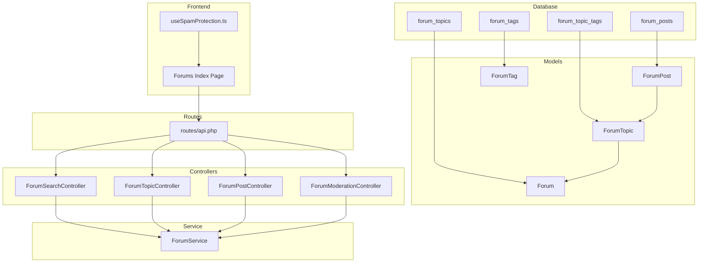
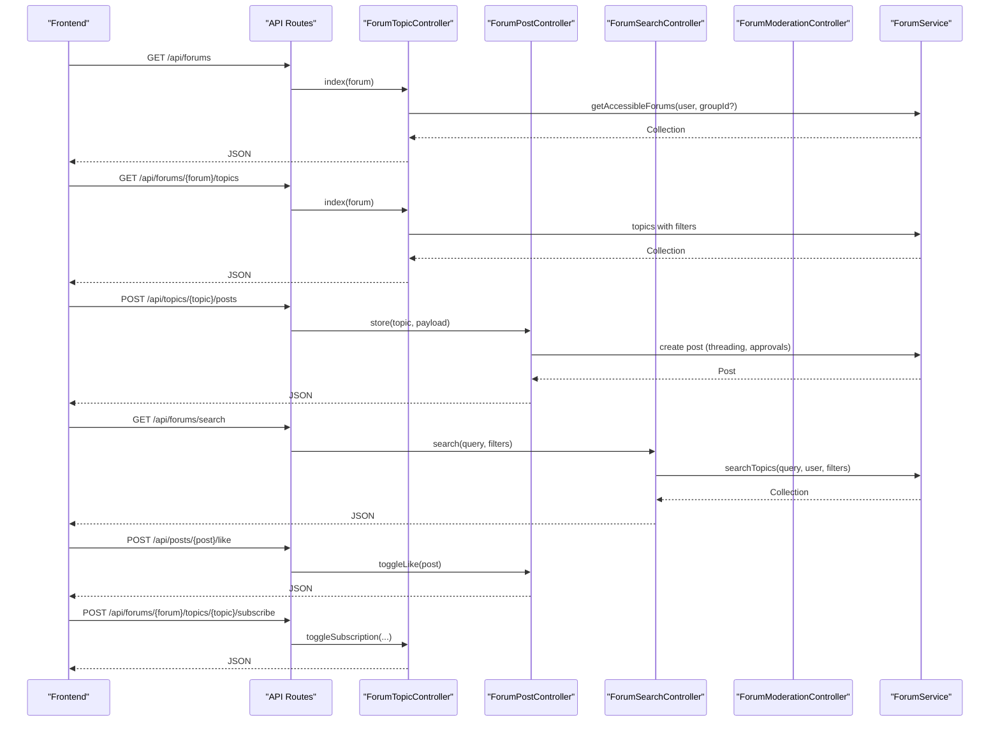
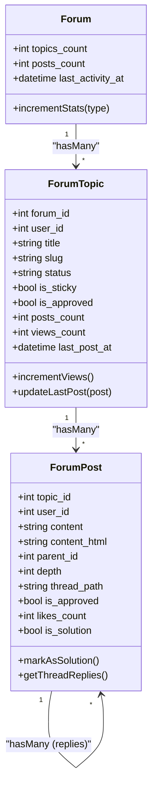
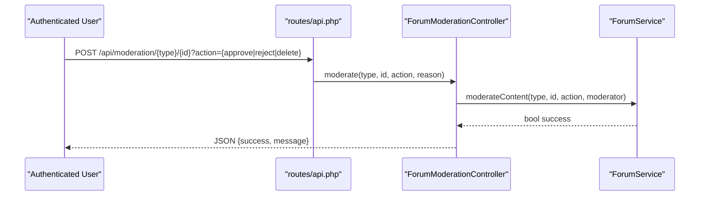
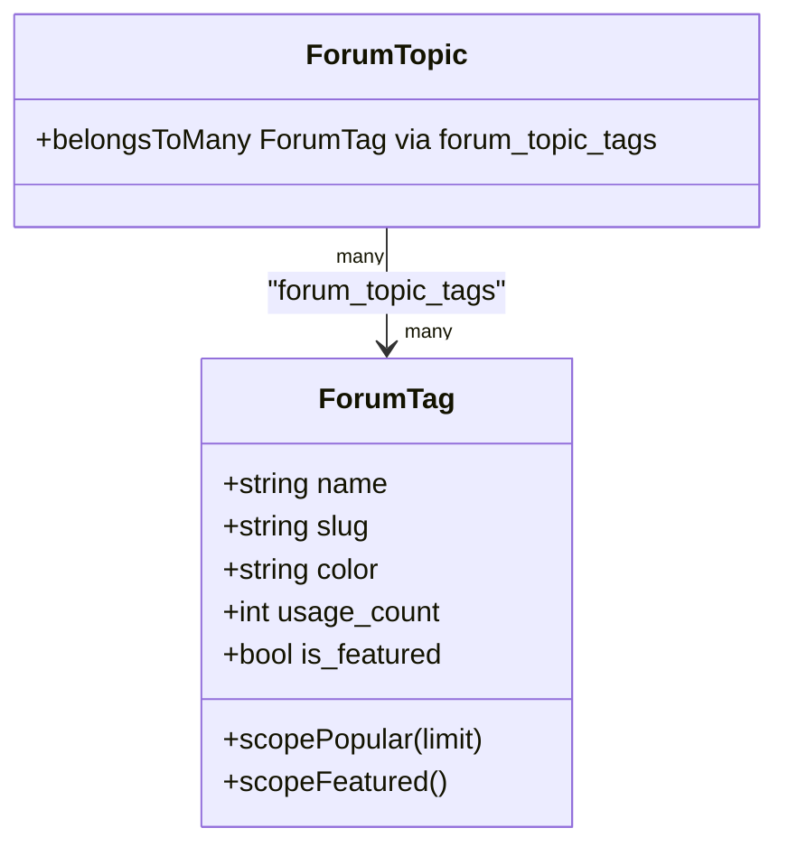
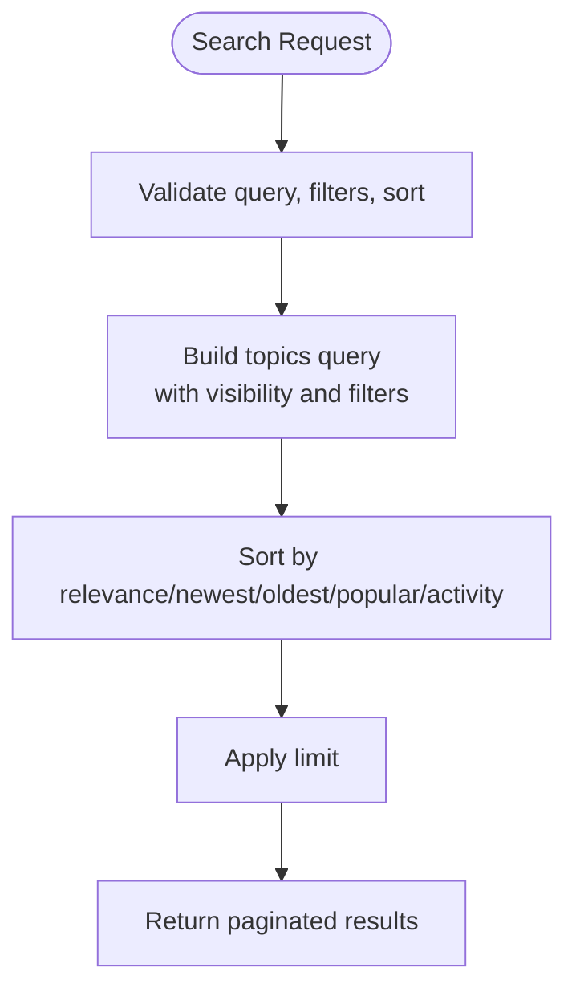
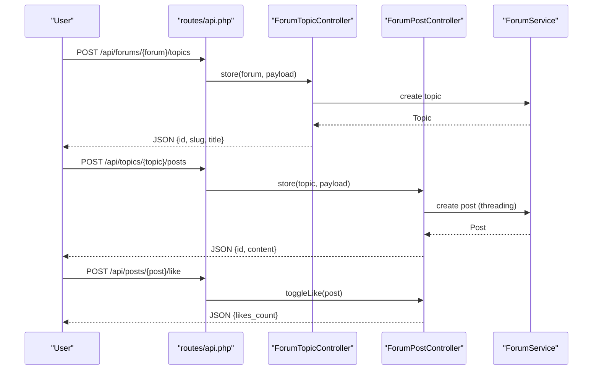
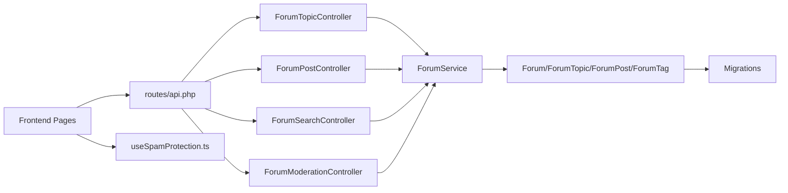

# Topic & Post System

<cite>
**Referenced Files in This Document**
- [2025_08_14_153615_create_forum_posts_table.php](file://database/migrations/2025_08_14_153615_create_forum_posts_table.php)
- [2025_08_14_153603_create_forum_topics_table.php](file://database/migrations/2025_08_14_153603_create_forum_topics_table.php)
- [2025_08_14_153645_create_forum_tags_table.php](file://database/migrations/2025_08_14_153645_create_forum_tags_table.php)
- [Forum.php](file://app/Models/Forum.php)
- [ForumTopic.php](file://app/Models/ForumTopic.php)
- [ForumPost.php](file://app/Models/ForumPost.php)
- [ForumTag.php](file://app/Models/ForumTag.php)
- [ForumService.php](file://app/Services/ForumService.php)
- [ForumSearchController.php](file://app/Http/Controllers/Api/ForumSearchController.php)
- [ForumTopicController.php](file://app/Http/Controllers/Api/ForumTopicController.php)
- [ForumPostController.php](file://app/Http/Controllers/Api/ForumPostController.php)
- [ForumModerationController.php](file://app/Http/Controllers/Api/ForumModerationController.php)
- [SpamProtection.php](file://app/Rules/SpamProtection.php)
- [RateLimitValidation.php](file://app/Rules/RateLimitValidation.php)
- [ContentFilter.php](file://app/Rules/ContentFilter.php)
- [api.php](file://routes/api.php)
- [Index.vue](file://resources/js/Pages/Forums/Index.vue)
- [useSpamProtection.ts](file://resources/js/composables/useSpamProtection.ts)
</cite>

## Table of Contents
1. [Introduction](#introduction)
2. [Project Structure](#project-structure)
3. [Core Components](#core-components)
4. [Architecture Overview](#architecture-overview)
5. [Detailed Component Analysis](#detailed-component-analysis)
6. [Dependency Analysis](#dependency-analysis)
7. [Performance Considerations](#performance-considerations)
8. [Troubleshooting Guide](#troubleshooting-guide)
9. [Conclusion](#conclusion)

## Introduction
This document describes the Topic & Post Management System, covering topic creation and threading, post approval and moderation, tagging with color coding and popularity metrics, search across forums with relevance scoring, filtering by tags/users/forums, pagination, view counting, activity tracking, content formatting, and spam prevention. It synthesizes the backend Laravel models, controllers, services, and frontend Vue components to provide a complete understanding of the system.

## Project Structure
The system spans database migrations, Eloquent models, service layer, API controllers, validation rules, and frontend composables. Routes define the REST endpoints for forums, topics, posts, and search.

**Diagram sources**
- [2025_08_14_153603_create_forum_topics_table.php:1-55](file://database/migrations/2025_08_14_153603_create_forum_topics_table.php#L1-L55)
- [2025_08_14_153615_create_forum_posts_table.php:1-57](file://database/migrations/2025_08_14_153615_create_forum_posts_table.php#L1-L57)
- [2025_08_14_153645_create_forum_tags_table.php:1-72](file://database/migrations/2025_08_14_153645_create_forum_tags_table.php#L1-L72)
- [Forum.php:1-101](file://app/Models/Forum.php#L1-L101)
- [ForumTopic.php:1-142](file://app/Models/ForumTopic.php#L1-L142)
- [ForumPost.php:1-151](file://app/Models/ForumPost.php#L1-L151)
- [ForumTag.php:1-66](file://app/Models/ForumTag.php#L1-L66)
- [ForumSearchController.php:1-154](file://app/Http/Controllers/Api/ForumSearchController.php#L1-L154)
- [ForumTopicController.php:1-47](file://app/Http/Controllers/Api/ForumTopicController.php#L1-L47)
- [ForumPostController.php:1-50](file://app/Http/Controllers/Api/ForumPostController.php#L1-L50)
- [ForumModerationController.php:1-78](file://app/Http/Controllers/Api/ForumModerationController.php#L1-L78)
- [ForumService.php:1-274](file://app/Services/ForumService.php#L1-L274)
- [api.php:688-705](file://routes/api.php#L688-L705)
- [Index.vue:34-196](file://resources/js/Pages/Forums/Index.vue#L34-L196)
- [useSpamProtection.ts:1-419](file://resources/js/composables/useSpamProtection.ts#L1-L419)

**Section sources**
- [api.php:688-705](file://routes/api.php#L688-L705)
- [ForumService.php:1-274](file://app/Services/ForumService.php#L1-L274)

## Core Components
- Forum: Represents categories of discussion with visibility, grouping, and counters.
- ForumTopic: Represents threads with status, stickiness, approvals, and activity tracking.
- ForumPost: Represents individual posts with threading, nesting, approvals, likes, and solution marking.
- ForumTag: Represents tags with color, usage count, and popularity.
- ForumService: Central orchestration for search, moderation, statistics, and filtering.
- Controllers: API endpoints for search, topic listing/indexing, post creation/threading, and moderation.
- Frontend: Forums index page and client-side spam protection composable.

**Section sources**
- [Forum.php:1-101](file://app/Models/Forum.php#L1-L101)
- [ForumTopic.php:1-142](file://app/Models/ForumTopic.php#L1-L142)
- [ForumPost.php:1-151](file://app/Models/ForumPost.php#L1-L151)
- [ForumTag.php:1-66](file://app/Models/ForumTag.php#L1-L66)
- [ForumService.php:1-274](file://app/Services/ForumService.php#L1-L274)
- [ForumSearchController.php:1-154](file://app/Http/Controllers/Api/ForumSearchController.php#L1-L154)
- [ForumTopicController.php:1-47](file://app/Http/Controllers/Api/ForumTopicController.php#L1-L47)
- [ForumPostController.php:1-50](file://app/Http/Controllers/Api/ForumPostController.php#L1-L50)
- [ForumModerationController.php:1-78](file://app/Http/Controllers/Api/ForumModerationController.php#L1-L78)
- [Index.vue:34-196](file://resources/js/Pages/Forums/Index.vue#L34-L196)
- [useSpamProtection.ts:1-419](file://resources/js/composables/useSpamProtection.ts#L1-L419)

## Architecture Overview
The system follows a layered architecture:
- Presentation: Vue pages consume REST endpoints.
- API Layer: Controllers validate requests and delegate to services.
- Service Layer: ForumService encapsulates business logic for search, moderation, and statistics.
- Persistence: Eloquent models map to relational tables with foreign keys and indexes.

**Diagram sources**
- [api.php:688-705](file://routes/api.php#L688-L705)
- [ForumTopicController.php:1-47](file://app/Http/Controllers/Api/ForumTopicController.php#L1-L47)
- [ForumPostController.php:1-50](file://app/Http/Controllers/Api/ForumPostController.php#L1-L50)
- [ForumSearchController.php:1-154](file://app/Http/Controllers/Api/ForumSearchController.php#L1-L154)
- [ForumService.php:1-274](file://app/Services/ForumService.php#L1-L274)

## Detailed Component Analysis

### Topic Creation, Editing, and Threading
- Topic creation sets slug, increments forum counters, and tracks last activity.
- Post creation supports threading via parent_id, depth, and materialized thread_path.
- Replies are fetched efficiently using thread_path and approved status.
- Editing tracks edits, editors, and optional reasons.

**Diagram sources**
- [Forum.php:1-101](file://app/Models/Forum.php#L1-L101)
- [ForumTopic.php:1-142](file://app/Models/ForumTopic.php#L1-L142)
- [ForumPost.php:1-151](file://app/Models/ForumPost.php#L1-L151)
- [2025_08_14_153603_create_forum_topics_table.php:1-55](file://database/migrations/2025_08_14_153603_create_forum_topics_table.php#L1-L55)
- [2025_08_14_153615_create_forum_posts_table.php:1-57](file://database/migrations/2025_08_14_153615_create_forum_posts_table.php#L1-L57)

**Section sources**
- [ForumTopic.php:122-135](file://app/Models/ForumTopic.php#L122-L135)
- [ForumPost.php:122-144](file://app/Models/ForumPost.php#L122-L144)
- [2025_08_14_153615_create_forum_posts_table.php:21-46](file://database/migrations/2025_08_14_153615_create_forum_posts_table.php#L21-L46)

### Post Approval Workflow and Moderation Status Tracking
- Approval flags and timestamps track moderation actions.
- Moderation controller validates roles and delegates to service.
- Service updates approvals and handles reject/delete actions.

**Diagram sources**
- [api.php:688-705](file://routes/api.php#L688-L705)
- [ForumModerationController.php:1-78](file://app/Http/Controllers/Api/ForumModerationController.php#L1-L78)
- [ForumService.php:200-242](file://app/Services/ForumService.php#L200-L242)

**Section sources**
- [ForumModerationController.php:17-61](file://app/Http/Controllers/Api/ForumModerationController.php#L17-L61)
- [ForumService.php:200-242](file://app/Services/ForumService.php#L200-L242)
- [2025_08_14_153615_create_forum_posts_table.php:26-38](file://database/migrations/2025_08_14_153615_create_forum_posts_table.php#L26-L38)

### Tagging System with Color Coding and Popularity Metrics
- Tags have color, usage_count, and is_featured flags.
- Topics are tagged via pivot table forum_topic_tags.
- Popular tags are retrieved by usage_count; featured tags are selectable.

**Diagram sources**
- [2025_08_14_153645_create_forum_tags_table.php:1-72](file://database/migrations/2025_08_14_153645_create_forum_tags_table.php#L1-L72)
- [ForumTag.php:1-66](file://app/Models/ForumTag.php#L1-L66)
- [ForumTopic.php:89-93](file://app/Models/ForumTopic.php#L89-L93)

**Section sources**
- [2025_08_14_153645_create_forum_tags_table.php:14-26](file://database/migrations/2025_08_14_153645_create_forum_tags_table.php#L14-L26)
- [ForumTag.php:41-59](file://app/Models/ForumTag.php#L41-L59)
- [ForumSearchController.php:76-107](file://app/Http/Controllers/Api/ForumSearchController.php#L76-L107)

### Search Functionality Across Forums with Relevance Scoring
- Search endpoint validates query and filters, then delegates to service.
- Service applies visibility-aware scopes and sorts by relevance (title/content match) and popularity.
- Pagination is supported for tag-topic listings.

**Diagram sources**
- [ForumSearchController.php:21-74](file://app/Http/Controllers/Api/ForumSearchController.php#L21-L74)
- [ForumService.php:45-108](file://app/Services/ForumService.php#L45-L108)
- [ForumTopicController.php:40-47](file://app/Http/Controllers/Api/ForumTopicController.php#L40-L47)

**Section sources**
- [ForumSearchController.php:21-74](file://app/Http/Controllers/Api/ForumSearchController.php#L21-L74)
- [ForumService.php:45-108](file://app/Services/ForumService.php#L45-L108)

### Filtering by Tags, Users, and Forums
- Topic listing supports tag filtering via slug and user_id filtering.
- Search supports forum_id and user_id filters.
- Visibility-aware scoping ensures only accessible forums are included.

**Section sources**
- [ForumTopicController.php:35-47](file://app/Http/Controllers/Api/ForumTopicController.php#L35-L47)
- [ForumSearchController.php:23-30](file://app/Http/Controllers/Api/ForumSearchController.php#L23-L30)
- [ForumService.php:47-77](file://app/Services/ForumService.php#L47-L77)

### Pagination, View Counting, and Activity Tracking
- Tag-topic listing uses paginate with metadata.
- Topic view counter incremented per view.
- Last post updates propagate to topic and forum activity timestamps.

**Section sources**
- [ForumSearchController.php:132-151](file://app/Http/Controllers/Api/ForumSearchController.php#L132-L151)
- [ForumTopic.php:122-125](file://app/Models/ForumTopic.php#L122-L125)
- [ForumPost.php:127-135](file://app/Models/ForumPost.php#L127-L135)

### Content Formatting, Attachment Handling, and Cross-Posting Restrictions
- Forum posts store raw content and rendered HTML separately.
- Attachments/media are handled via service layer (not part of forum posts in this codebase).
- Cross-posting is prevented by enforcing parent post belongs to the same topic.

**Section sources**
- [2025_08_14_153615_create_forum_posts_table.php:18-19](file://database/migrations/2025_08_14_153615_create_forum_posts_table.php#L18-L19)
- [ForumPostController.php:41-50](file://app/Http/Controllers/Api/ForumPostController.php#L41-L50)

### Spam Prevention Measures
- Client-side spam protection composable analyzes form timing, behavior, content, user agent, and rate limiting.
- Server-side validation includes SpamProtection rule (user agent checks), ContentFilter rule (keywords/patterns/URLs), and RateLimitValidation rule (attempts/time windows).
- These combine to reduce automated abuse while preserving legitimate user interactions.

**Section sources**
- [useSpamProtection.ts:1-419](file://resources/js/composables/useSpamProtection.ts#L1-L419)
- [SpamProtection.php:1-305](file://app/Rules/SpamProtection.php#L1-L305)
- [ContentFilter.php:122-167](file://app/Rules/ContentFilter.php#L122-L167)
- [RateLimitValidation.php:1-160](file://app/Rules/RateLimitValidation.php#L1-L160)

### Example Topic Workflows and Community Engagement Patterns
- New topic creation: user submits title and content; topic is created with slug and counters updated.
- Threaded replies: user selects a parent post; system validates same-topic constraint and builds thread_path.
- Community engagement: likes tracked per post; solution marking allowed per topic; tags improve discoverability.
- Moderation: flagged content requires approval; admins can approve, reject, or delete.

**Diagram sources**
- [api.php:688-705](file://routes/api.php#L688-L705)
- [ForumTopicController.php:1-47](file://app/Http/Controllers/Api/ForumTopicController.php#L1-L47)
- [ForumPostController.php:1-50](file://app/Http/Controllers/Api/ForumPostController.php#L1-L50)
- [ForumService.php:1-274](file://app/Services/ForumService.php#L1-L274)

## Dependency Analysis
- Controllers depend on ForumService for business logic.
- Models encapsulate relationships and scopes; migrations define schema and indexes.
- Routes bind endpoints to controllers.
- Frontend consumes endpoints and augments UX with client-side protections.

**Diagram sources**
- [api.php:688-705](file://routes/api.php#L688-L705)
- [ForumTopicController.php:1-47](file://app/Http/Controllers/Api/ForumTopicController.php#L1-L47)
- [ForumPostController.php:1-50](file://app/Http/Controllers/Api/ForumPostController.php#L1-L50)
- [ForumSearchController.php:1-154](file://app/Http/Controllers/Api/ForumSearchController.php#L1-L154)
- [ForumModerationController.php:1-78](file://app/Http/Controllers/Api/ForumModerationController.php#L1-L78)
- [ForumService.php:1-274](file://app/Services/ForumService.php#L1-L274)
- [Forum.php:1-101](file://app/Models/Forum.php#L1-L101)
- [ForumTopic.php:1-142](file://app/Models/ForumTopic.php#L1-L142)
- [ForumPost.php:1-151](file://app/Models/ForumPost.php#L1-L151)
- [ForumTag.php:1-66](file://app/Models/ForumTag.php#L1-L66)
- [2025_08_14_153603_create_forum_topics_table.php:1-55](file://database/migrations/2025_08_14_153603_create_forum_topics_table.php#L1-L55)
- [2025_08_14_153615_create_forum_posts_table.php:1-57](file://database/migrations/2025_08_14_153615_create_forum_posts_table.php#L1-L57)
- [2025_08_14_153645_create_forum_tags_table.php:1-72](file://database/migrations/2025_08_14_153645_create_forum_tags_table.php#L1-L72)
- [Index.vue:34-196](file://resources/js/Pages/Forums/Index.vue#L34-L196)
- [useSpamProtection.ts:1-419](file://resources/js/composables/useSpamProtection.ts#L1-L419)

**Section sources**
- [ForumService.php:1-274](file://app/Services/ForumService.php#L1-L274)
- [ForumSearchController.php:1-154](file://app/Http/Controllers/Api/ForumSearchController.php#L1-L154)

## Performance Considerations
- Indexes on forum_posts: topic_id, user_id, parent_id, is_approved, thread_path.
- Indexes on forum_topics: forum_id, is_sticky, last_post_at; unique forum_id + slug.
- Efficient thread queries using materialized thread_path and approved posts only.
- Pagination for tag-topic listings and recent activity.
- Relevance sorting prioritizes title matches and popularity.

[No sources needed since this section provides general guidance]

## Troubleshooting Guide
- Access Denied: Ensure user has appropriate role or group membership for forum visibility.
- Locked Topic: Posting is disabled when topic.status is locked.
- Invalid Parent Post: parent_id must belong to the same topic.
- Rate Limit Exceeded: Reduce submission frequency or adjust thresholds.
- Spam Detected: Review client-side analysis reasons and server-side validation failures.

**Section sources**
- [ForumTopicController.php:22-34](file://app/Http/Controllers/Api/ForumTopicController.php#L22-L34)
- [ForumPostController.php:42-49](file://app/Http/Controllers/Api/ForumPostController.php#L42-L49)
- [RateLimitValidation.php:32-54](file://app/Rules/RateLimitValidation.php#L32-L54)
- [SpamProtection.php:156-215](file://app/Rules/SpamProtection.php#L156-L215)
- [useSpamProtection.ts:293-355](file://resources/js/composables/useSpamProtection.ts#L293-L355)

## Conclusion
The Topic & Post Management System integrates robust threading, moderation, tagging, search, and spam controls. Its modular design separates concerns across models, services, controllers, and frontend composables, enabling scalable community discussions with strong governance and user experience.