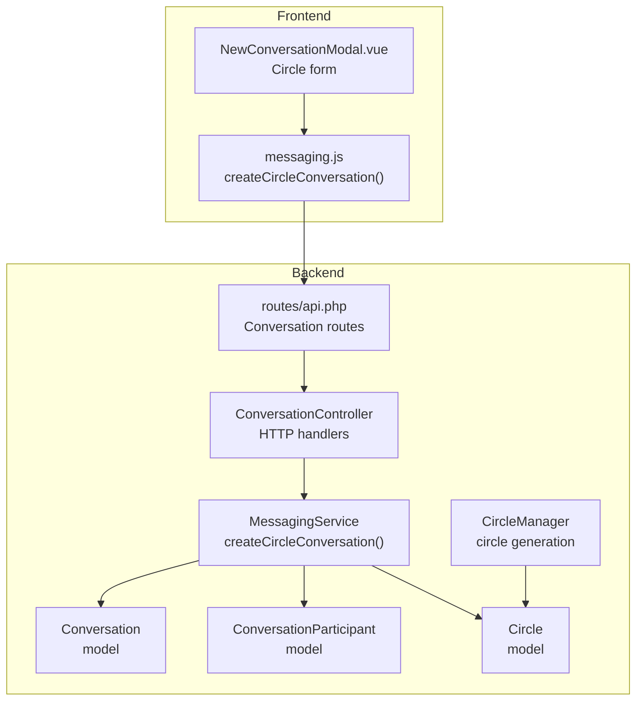
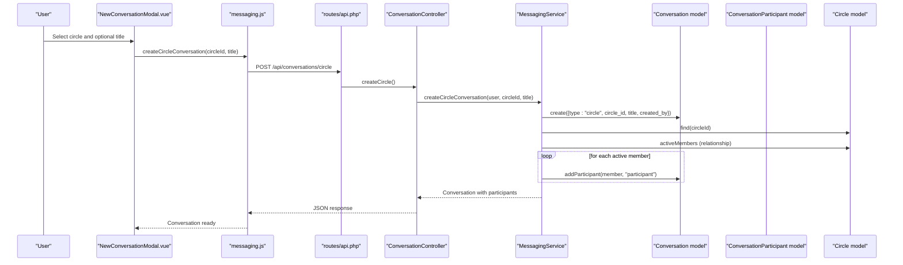
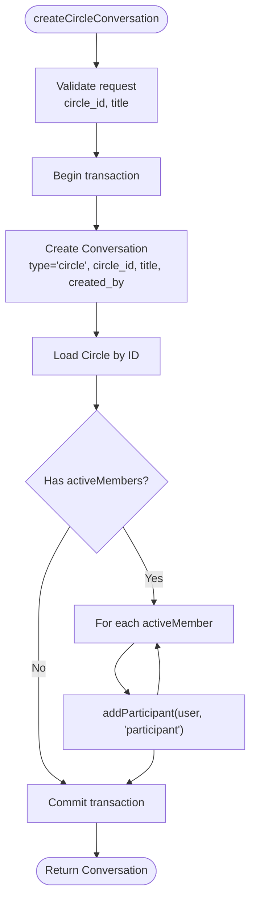
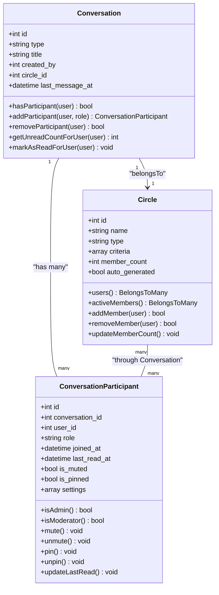
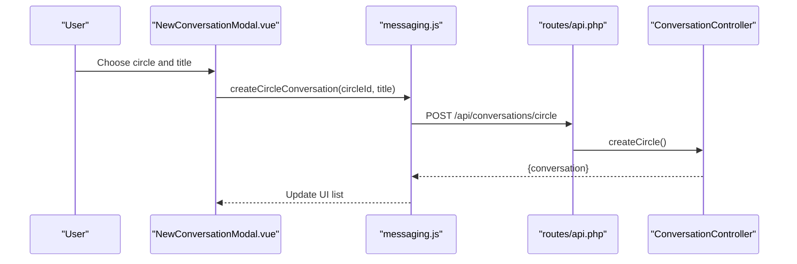
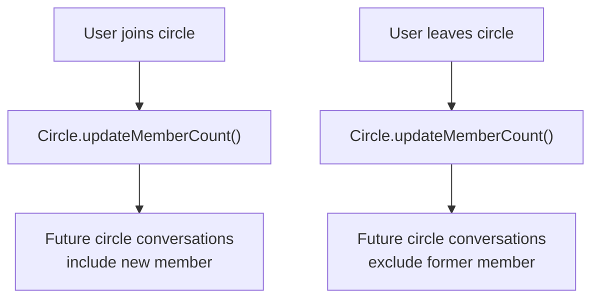
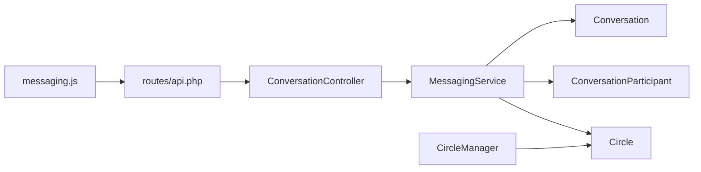

# Circle-Based Conversations

<cite>
**Referenced Files in This Document**
- [ConversationController.php](file://app/Http/Controllers/Api/ConversationController.php)
- [MessagingService.php](file://app/Services/MessagingService.php)
- [Conversation.php](file://app/Models/Conversation.php)
- [ConversationParticipant.php](file://app/Models/ConversationParticipant.php)
- [Circle.php](file://app/Models/Circle.php)
- [CircleManager.php](file://app/Services/CircleManager.php)
- [api.php](file://routes/api.php)
- [messaging.js](file://resources/js/Stores/messaging.js)
- [NewConversationModal.vue](file://resources/js/components/Messaging/NewConversationModal.vue)
</cite>

## Table of Contents
1. [Introduction](#introduction)
2. [Project Structure](#project-structure)
3. [Core Components](#core-components)
4. [Architecture Overview](#architecture-overview)
5. [Detailed Component Analysis](#detailed-component-analysis)
6. [Dependency Analysis](#dependency-analysis)
7. [Performance Considerations](#performance-considerations)
8. [Troubleshooting Guide](#troubleshooting-guide)
9. [Conclusion](#conclusion)

## Introduction
This document explains the circle-based conversation functionality in the platform. It covers the createCircleConversation method, automatic participant population from circle memberships, integration with the circle system (including active member detection), conversation creation workflows, membership validation, and participant synchronization. It also provides practical examples, permission handling, notifications, and conversation isolation patterns.

## Project Structure
The circle-based conversation feature spans backend controllers/services/models and frontend stores/components:

- Backend
  - API routes for conversation management
  - ConversationController handles HTTP requests
  - MessagingService orchestrates conversation creation and participant management
  - Conversation model manages conversation metadata and participants
  - ConversationParticipant model tracks per-conversation roles and settings
  - Circle model manages membership and active member queries
  - CircleManager generates and maintains auto-generated circles
- Frontend
  - Vue store action for creating circle conversations
  - Modal component for initiating circle conversations

**Diagram sources**
- [api.php:757-783](file://routes/api.php#L757-L783)
- [ConversationController.php:160-194](file://app/Http/Controllers/Api/ConversationController.php#L160-L194)
- [MessagingService.php:72-95](file://app/Services/MessagingService.php#L72-L95)
- [Conversation.php:1-223](file://app/Models/Conversation.php#L1-L223)
- [ConversationParticipant.php:1-181](file://app/Models/ConversationParticipant.php#L1-L181)
- [Circle.php:1-182](file://app/Models/Circle.php#L1-L182)
- [CircleManager.php:1-310](file://app/Services/CircleManager.php#L1-L310)
- [messaging.js:259-274](file://resources/js/Stores/messaging.js#L259-L274)
- [NewConversationModal.vue:209-234](file://resources/js/components/Messaging/NewConversationModal.vue#L209-L234)

**Section sources**
- [api.php:757-783](file://routes/api.php#L757-L783)
- [ConversationController.php:160-194](file://app/Http/Controllers/Api/ConversationController.php#L160-L194)
- [MessagingService.php:72-95](file://app/Services/MessagingService.php#L72-L95)
- [Conversation.php:1-223](file://app/Models/Conversation.php#L1-L223)
- [ConversationParticipant.php:1-181](file://app/Models/ConversationParticipant.php#L1-L181)
- [Circle.php:1-182](file://app/Models/Circle.php#L1-L182)
- [CircleManager.php:1-310](file://app/Services/CircleManager.php#L1-L310)
- [messaging.js:259-274](file://resources/js/Stores/messaging.js#L259-L274)
- [NewConversationModal.vue:209-234](file://resources/js/components/Messaging/NewConversationModal.vue#L209-L234)

## Core Components
- ConversationController.createCircle: Validates input and delegates to MessagingService
- MessagingService.createCircleConversation: Creates a circle conversation and auto-populates participants from the circle's active members
- Conversation model: Stores conversation metadata, participants, and helpers for participant checks and counts
- ConversationParticipant model: Tracks roles, mute/pin settings, and last read timestamps
- Circle model: Manages memberships and provides activeMembers relationship
- CircleManager: Generates auto-generated circles based on user education and updates membership counts
- Frontend store and component: Provide UI to select a circle and trigger conversation creation

**Section sources**
- [ConversationController.php:160-194](file://app/Http/Controllers/Api/ConversationController.php#L160-L194)
- [MessagingService.php:72-95](file://app/Services/MessagingService.php#L72-L95)
- [Conversation.php:1-223](file://app/Models/Conversation.php#L1-L223)
- [ConversationParticipant.php:1-181](file://app/Models/ConversationParticipant.php#L1-L181)
- [Circle.php:1-182](file://app/Models/Circle.php#L1-L182)
- [CircleManager.php:1-310](file://app/Services/CircleManager.php#L1-L310)
- [messaging.js:259-274](file://resources/js/Stores/messaging.js#L259-L274)
- [NewConversationModal.vue:209-234](file://resources/js/components/Messaging/NewConversationModal.vue#L209-L234)

## Architecture Overview
The circle conversation workflow integrates frontend UI, backend API, and domain services:

**Diagram sources**
- [NewConversationModal.vue:376-419](file://resources/js/components/Messaging/NewConversationModal.vue#L376-L419)
- [messaging.js:259-274](file://resources/js/Stores/messaging.js#L259-L274)
- [api.php:764-764](file://routes/api.php#L764-L764)
- [ConversationController.php:160-194](file://app/Http/Controllers/Api/ConversationController.php#L160-L194)
- [MessagingService.php:72-95](file://app/Services/MessagingService.php#L72-L95)
- [Conversation.php:106-121](file://app/Models/Conversation.php#L106-L121)
- [ConversationParticipant.php:106-113](file://app/Models/ConversationParticipant.php#L106-L113)
- [Circle.php:41-44](file://app/Models/Circle.php#L41-L44)

## Detailed Component Analysis

### Backend: Conversation Creation and Participant Population
- Input validation ensures a valid circle ID and optional title
- Transactional creation guarantees consistency
- Automatic participant assignment uses Circle.activeMembers relationship
- Conversation type is set to "circle" and linked to the circle

**Diagram sources**
- [ConversationController.php:160-194](file://app/Http/Controllers/Api/ConversationController.php#L160-L194)
- [MessagingService.php:72-95](file://app/Services/MessagingService.php#L72-L95)
- [Circle.php:41-44](file://app/Models/Circle.php#L41-L44)
- [Conversation.php:106-121](file://app/Models/Conversation.php#L106-L121)

**Section sources**
- [ConversationController.php:160-194](file://app/Http/Controllers/Api/ConversationController.php#L160-L194)
- [MessagingService.php:72-95](file://app/Services/MessagingService.php#L72-L95)
- [Circle.php:41-44](file://app/Models/Circle.php#L41-L44)
- [Conversation.php:106-121](file://app/Models/Conversation.php#L106-L121)

### Data Models: Conversation, Participants, and Circle

**Diagram sources**
- [Conversation.php:1-223](file://app/Models/Conversation.php#L1-L223)
- [ConversationParticipant.php:1-181](file://app/Models/ConversationParticipant.php#L1-L181)
- [Circle.php:1-182](file://app/Models/Circle.php#L1-L182)

**Section sources**
- [Conversation.php:1-223](file://app/Models/Conversation.php#L1-L223)
- [ConversationParticipant.php:1-181](file://app/Models/ConversationParticipant.php#L1-L181)
- [Circle.php:1-182](file://app/Models/Circle.php#L1-L182)

### Frontend: Creating Circle Conversations
- The modal allows selecting a circle from the user's eligible circles
- The store action sends a POST to /api/conversations/circle with circle_id and optional title
- On success, the new conversation is added to the UI list

**Diagram sources**
- [NewConversationModal.vue:376-419](file://resources/js/components/Messaging/NewConversationModal.vue#L376-L419)
- [messaging.js:259-274](file://resources/js/Stores/messaging.js#L259-L274)
- [api.php:764-764](file://routes/api.php#L764-L764)
- [ConversationController.php:160-194](file://app/Http/Controllers/Api/ConversationController.php#L160-L194)

**Section sources**
- [NewConversationModal.vue:209-234](file://resources/js/components/Messaging/NewConversationModal.vue#L209-L234)
- [NewConversationModal.vue:376-419](file://resources/js/components/Messaging/NewConversationModal.vue#L376-L419)
- [messaging.js:259-274](file://resources/js/Stores/messaging.js#L259-L274)
- [api.php:764-764](file://routes/api.php#L764-L764)
- [ConversationController.php:160-194](file://app/Http/Controllers/Api/ConversationController.php#L160-L194)

### Circle Integration Patterns and Dynamic Member Changes
- Active member detection: Circle.activeMembers filters by pivot status "active"
- Auto-generated circles: CircleManager generates circles based on education history and updates membership counts
- Dynamic synchronization: When a user joins/leaves a circle, future circle conversations automatically reflect membership changes

**Diagram sources**
- [Circle.php:92-96](file://app/Models/Circle.php#L92-L96)
- [CircleManager.php:226-246](file://app/Services/CircleManager.php#L226-L246)

**Section sources**
- [Circle.php:41-44](file://app/Models/Circle.php#L41-L44)
- [Circle.php:92-96](file://app/Models/Circle.php#L92-L96)
- [CircleManager.php:226-246](file://app/Services/CircleManager.php#L226-L246)

## Dependency Analysis
- ConversationController depends on MessagingService for business logic
- MessagingService depends on Conversation, Circle, and ConversationParticipant models
- Frontend store depends on API routes for conversation creation
- CircleManager supports the broader circle ecosystem and indirectly affects participant availability

**Diagram sources**
- [api.php:757-783](file://routes/api.php#L757-L783)
- [ConversationController.php:160-194](file://app/Http/Controllers/Api/ConversationController.php#L160-L194)
- [MessagingService.php:72-95](file://app/Services/MessagingService.php#L72-L95)
- [Conversation.php:1-223](file://app/Models/Conversation.php#L1-L223)
- [ConversationParticipant.php:1-181](file://app/Models/ConversationParticipant.php#L1-L181)
- [Circle.php:1-182](file://app/Models/Circle.php#L1-L182)
- [CircleManager.php:1-310](file://app/Services/CircleManager.php#L1-L310)

**Section sources**
- [api.php:757-783](file://routes/api.php#L757-L783)
- [ConversationController.php:160-194](file://app/Http/Controllers/Api/ConversationController.php#L160-L194)
- [MessagingService.php:72-95](file://app/Services/MessagingService.php#L72-L95)
- [Conversation.php:1-223](file://app/Models/Conversation.php#L1-L223)
- [ConversationParticipant.php:1-181](file://app/Models/ConversationParticipant.php#L1-L181)
- [Circle.php:1-182](file://app/Models/Circle.php#L1-L182)
- [CircleManager.php:1-310](file://app/Services/CircleManager.php#L1-L310)

## Performance Considerations
- Transactional creation prevents partial states during conversation and participant creation
- Using activeMembers relationship ensures only currently active members are added
- Pagination and lazy loading of conversations/messages help maintain responsiveness
- Consider batching participant additions if very large circles become common

## Troubleshooting Guide
Common issues and resolutions:
- Validation failures: Ensure circle_id exists and title length is acceptable
- Authorization: Only authenticated users can create conversations; ensure proper auth middleware
- Participant checks: MessagingService validates participants before operations
- Large circles: Adding many participants is supported by the current implementation; monitor performance if circles grow significantly

**Section sources**
- [ConversationController.php:160-194](file://app/Http/Controllers/Api/ConversationController.php#L160-L194)
- [MessagingService.php:100-107](file://app/Services/MessagingService.php#L100-L107)

## Conclusion
Circle-based conversations provide an efficient way to engage entire alumni groups automatically. The system leverages active member detection, transactional creation, and robust participant management to ensure reliable and scalable communication. The frontend offers a simple interface to initiate these conversations, while the backend enforces validation, permissions, and consistency.