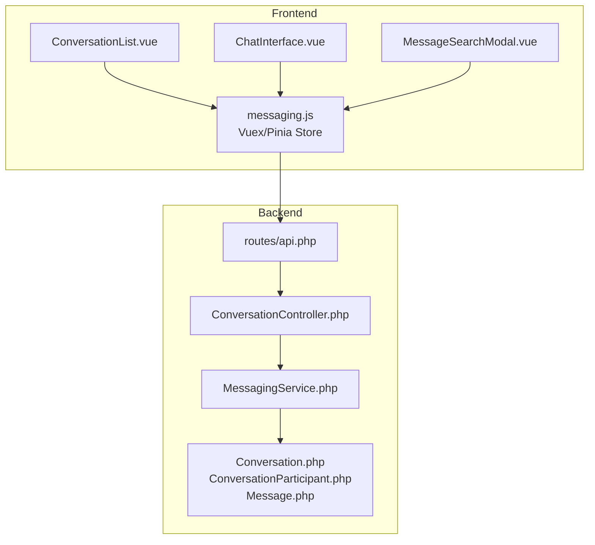
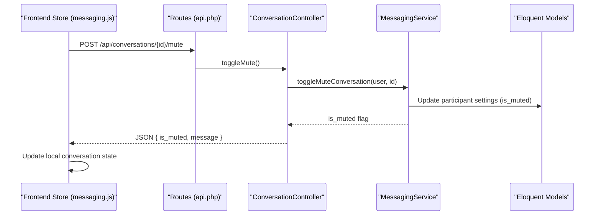
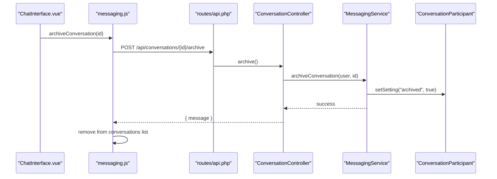
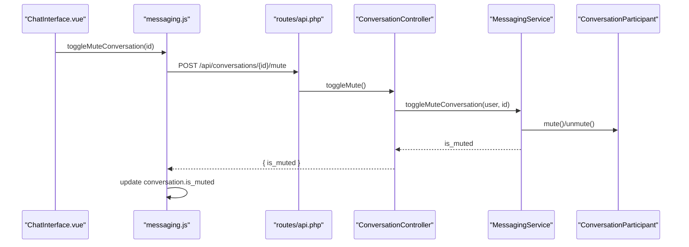
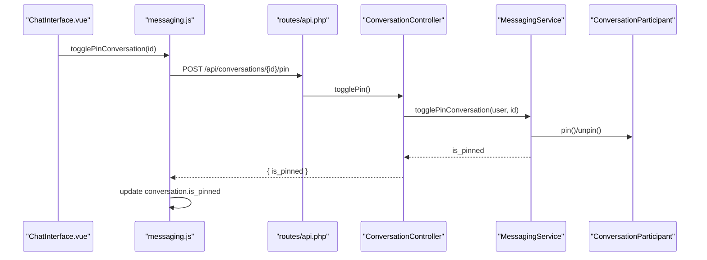
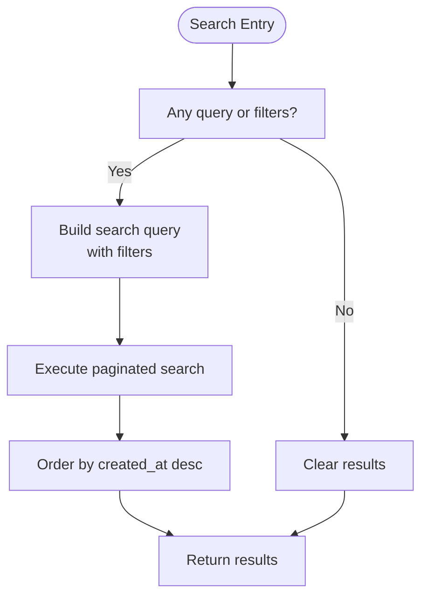
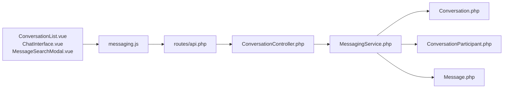

# Conversation Management

<cite>
**Referenced Files in This Document**
- [ConversationController.php](file://app/Http/Controllers/Api/ConversationController.php)
- [MessagingService.php](file://app/Services/MessagingService.php)
- [Conversation.php](file://app/Models/Conversation.php)
- [ConversationParticipant.php](file://app/Models/ConversationParticipant.php)
- [Message.php](file://app/Models/Message.php)
- [api.php](file://routes/api.php)
- [messaging.js](file://resources/js/Stores/messaging.js)
- [ChatInterface.vue](file://resources/js/components/Messaging/ChatInterface.vue)
- [ConversationList.vue](file://resources/js/components/Messaging/ConversationList.vue)
- [MessageSearchModal.vue](file://resources/js/components/Messaging/MessageSearchModal.vue)
</cite>

## Table of Contents
1. [Introduction](#introduction)
2. [Project Structure](#project-structure)
3. [Core Components](#core-components)
4. [Architecture Overview](#architecture-overview)
5. [Detailed Component Analysis](#detailed-component-analysis)
6. [Dependency Analysis](#dependency-analysis)
7. [Performance Considerations](#performance-considerations)
8. [Troubleshooting Guide](#troubleshooting-guide)
9. [Conclusion](#conclusion)

## Introduction
This document explains the conversation management system, covering archiving, muting, pinning, and search functionality. It documents user settings per conversation (archived status, mute preferences, pinning), conversation listing, pagination, and sorting. Practical examples demonstrate managing conversation states, bulk operations, and user preferences. It also addresses cleanup, archive management, and performance optimization for large conversation histories, with implementation examples for workflows and user preference handling.

## Project Structure
The conversation management feature spans backend Laravel controllers and services, Eloquent models, frontend Vue stores and components, and routing definitions.



**Diagram sources**
- [api.php:757-783](file://routes/api.php#L757-L783)
- [ConversationController.php:11-340](file://app/Http/Controllers/Api/ConversationController.php#L11-L340)
- [MessagingService.php:15-462](file://app/Services/MessagingService.php#L15-L462)
- [Conversation.php:11-223](file://app/Models/Conversation.php#L11-L223)
- [ConversationParticipant.php:8-181](file://app/Models/ConversationParticipant.php#L8-L181)
- [Message.php:11-294](file://app/Models/Message.php#L11-L294)
- [messaging.js:276-540](file://resources/js/Stores/messaging.js#L276-L540)
- [ConversationList.vue:198-248](file://resources/js/components/Messaging/ConversationList.vue#L198-L248)
- [ChatInterface.vue:80-105](file://resources/js/components/Messaging/ChatInterface.vue#L80-L105)
- [MessageSearchModal.vue:142-205](file://resources/js/components/Messaging/MessageSearchModal.vue#L142-L205)

**Section sources**
- [api.php:757-783](file://routes/api.php#L757-L783)
- [ConversationController.php:11-340](file://app/Http/Controllers/Api/ConversationController.php#L11-L340)
- [MessagingService.php:15-462](file://app/Services/MessagingService.php#L15-L462)
- [Conversation.php:11-223](file://app/Models/Conversation.php#L11-L223)
- [ConversationParticipant.php:8-181](file://app/Models/ConversationParticipant.php#L8-L181)
- [Message.php:11-294](file://app/Models/Message.php#L11-L294)
- [messaging.js:276-540](file://resources/js/Stores/messaging.js#L276-L540)
- [ConversationList.vue:198-248](file://resources/js/components/Messaging/ConversationList.vue#L198-L248)
- [ChatInterface.vue:80-105](file://resources/js/components/Messaging/ChatInterface.vue#L80-L105)
- [MessageSearchModal.vue:142-205](file://resources/js/components/Messaging/MessageSearchModal.vue#L142-L205)

## Core Components
- Backend API endpoints and controller orchestration
- Messaging service implementing business logic
- Eloquent models for conversations, participants, and messages
- Frontend store and components for UI interactions

Key capabilities:
- Conversation lifecycle: creation, listing, pagination, sorting
- Per-participant settings: mute, pin, archive
- Message operations: read receipts, search, edit/delete
- Real-time integrations via events and channels

**Section sources**
- [ConversationController.php:20-338](file://app/Http/Controllers/Api/ConversationController.php#L20-L338)
- [MessagingService.php:205-249](file://app/Services/MessagingService.php#L205-L249)
- [Conversation.php:77-221](file://app/Models/Conversation.php#L77-L221)
- [ConversationParticipant.php:10-181](file://app/Models/ConversationParticipant.php#L10-L181)
- [Message.php:15-294](file://app/Models/Message.php#L15-L294)
- [messaging.js:276-540](file://resources/js/Stores/messaging.js#L276-L540)

## Architecture Overview
The system follows a layered architecture:
- Routes define REST endpoints for conversations and messages
- Controller validates inputs and delegates to the MessagingService
- MessagingService coordinates model operations and broadcasts events
- Models encapsulate persistence and relationships
- Frontend store manages state and interacts with backend via Axios
- Components render lists, menus, and modals for user actions



**Diagram sources**
- [api.php:770-772](file://routes/api.php#L770-L772)
- [ConversationController.php:296-316](file://app/Http/Controllers/Api/ConversationController.php#L296-L316)
- [MessagingService.php:348-374](file://app/Services/MessagingService.php#L348-L374)
- [ConversationParticipant.php:80-91](file://app/Models/ConversationParticipant.php#L80-L91)
- [messaging.js:293-308](file://resources/js/Stores/messaging.js#L293-L308)

## Detailed Component Analysis

### Backend API and Controller
- Endpoints:
  - GET/POST conversations and messages
  - Conversation management: archive, mute, pin
  - Message operations: read, search, edit, delete
- Validation and error handling are centralized in the controller
- Pagination is supported for conversations and messages

Implementation highlights:
- Index/listing with per_page parameter and ordering by last_message_at
- Message listing ordered by created_at desc
- SearchMessages supports optional conversation scope

**Section sources**
- [api.php:757-783](file://routes/api.php#L757-L783)
- [ConversationController.php:20-338](file://app/Http/Controllers/Api/ConversationController.php#L20-L338)
- [MessagingService.php:205-249](file://app/Services/MessagingService.php#L205-L249)

### Messaging Service
Responsibilities:
- Conversation lifecycle: create direct/group/circle, add/remove participants, leave
- Message lifecycle: send, mark read, search, edit, delete
- User settings per conversation: archive, mute, pin via participant settings
- Unread counting aggregation across conversations

Important behaviors:
- Uses transactions for atomic operations (creation, sending, participant changes)
- Enforces permissions (admin/moderator roles)
- Updates last_message_at timestamps
- Broadcasts events for real-time updates

**Section sources**
- [MessagingService.php:15-462](file://app/Services/MessagingService.php#L15-L462)

### Models and Relationships
- Conversation
  - Type-scopes (direct, group, circle)
  - Participants relationship with pivot settings (is_muted, is_pinned, settings)
  - Latest message and unread count helpers
- ConversationParticipant
  - Roles and settings management
  - Helper methods for mute/pin and unread counts
- Message
  - Reply chain, read receipts, attachments
  - Legacy compatibility fields and scopes

**Section sources**
- [Conversation.php:11-223](file://app/Models/Conversation.php#L11-L223)
- [ConversationParticipant.php:8-181](file://app/Models/ConversationParticipant.php#L8-L181)
- [Message.php:11-294](file://app/Models/Message.php#L11-L294)

### Frontend Store and Components
- Store actions:
  - togglePinConversation, toggleMuteConversation, archiveConversation
  - loadConversations, loadMoreConversations, loadMessages
  - searchMessages
- Components:
  - ConversationList: filtering by unread/pinned/direct/groups and search
  - ChatInterface: menu actions for pin/mute/archive
  - MessageSearchModal: search with filters and modal UI

State synchronization:
- Frontend updates local conversation state after successful API calls
- Archive removes conversation from the list immediately

**Section sources**
- [messaging.js:276-540](file://resources/js/Stores/messaging.js#L276-L540)
- [ConversationList.vue:198-248](file://resources/js/components/Messaging/ConversationList.vue#L198-L248)
- [ChatInterface.vue:80-105](file://resources/js/components/Messaging/ChatInterface.vue#L80-L105)
- [MessageSearchModal.vue:142-205](file://resources/js/components/Messaging/MessageSearchModal.vue#L142-L205)

### Conversation Archiving
- Backend: sets participant setting "archived" to true
- Frontend: removes archived conversation from the list
- Effect: conversation disappears from active listings for the user



**Diagram sources**
- [ChatInterface.vue:460-469](file://resources/js/components/Messaging/ChatInterface.vue#L460-L469)
- [messaging.js:310-320](file://resources/js/Stores/messaging.js#L310-L320)
- [api.php:770-770](file://routes/api.php#L770-L770)
- [ConversationController.php:278-294](file://app/Http/Controllers/Api/ConversationController.php#L278-L294)
- [MessagingService.php:326-343](file://app/Services/MessagingService.php#L326-L343)
- [ConversationParticipant.php:143-148](file://app/Models/ConversationParticipant.php#L143-L148)

**Section sources**
- [MessagingService.php:326-343](file://app/Services/MessagingService.php#L326-L343)
- [ConversationParticipant.php:143-148](file://app/Models/ConversationParticipant.php#L143-L148)
- [messaging.js:310-320](file://resources/js/Stores/messaging.js#L310-L320)
- [ChatInterface.vue:460-469](file://resources/js/components/Messaging/ChatInterface.vue#L460-L469)

### Conversation Muting
- Backend toggles participant.is_muted
- Frontend updates local is_muted flag
- Effect: suppresses notifications for the conversation



**Diagram sources**
- [ChatInterface.vue:451-458](file://resources/js/components/Messaging/ChatInterface.vue#L451-L458)
- [messaging.js:293-308](file://resources/js/Stores/messaging.js#L293-L308)
- [api.php:771-771](file://routes/api.php#L771-L771)
- [ConversationController.php:299-316](file://app/Http/Controllers/Api/ConversationController.php#L299-L316)
- [MessagingService.php:348-374](file://app/Services/MessagingService.php#L348-L374)
- [ConversationParticipant.php:80-91](file://app/Models/ConversationParticipant.php#L80-L91)

**Section sources**
- [MessagingService.php:348-374](file://app/Services/MessagingService.php#L348-L374)
- [ConversationParticipant.php:80-91](file://app/Models/ConversationParticipant.php#L80-L91)
- [messaging.js:293-308](file://resources/js/Stores/messaging.js#L293-L308)
- [ChatInterface.vue:451-458](file://resources/js/components/Messaging/ChatInterface.vue#L451-L458)

### Conversation Pinning
- Backend toggles participant.is_pinned
- Frontend updates local is_pinned flag
- Effect: pins conversation to top of the list



**Diagram sources**
- [ChatInterface.vue:442-449](file://resources/js/components/Messaging/ChatInterface.vue#L442-L449)
- [messaging.js:276-291](file://resources/js/Stores/messaging.js#L276-L291)
- [api.php:772-772](file://routes/api.php#L772-L772)
- [ConversationController.php:321-338](file://app/Http/Controllers/Api/ConversationController.php#L321-L338)
- [MessagingService.php:379-405](file://app/Services/MessagingService.php#L379-L405)
- [ConversationParticipant.php:95-107](file://app/Models/ConversationParticipant.php#L95-L107)

**Section sources**
- [MessagingService.php:379-405](file://app/Services/MessagingService.php#L379-L405)
- [ConversationParticipant.php:95-107](file://app/Models/ConversationParticipant.php#L95-L107)
- [messaging.js:276-291](file://resources/js/Stores/messaging.js#L276-L291)
- [ChatInterface.vue:442-449](file://resources/js/components/Messaging/ChatInterface.vue#L442-L449)

### Conversation Search and Message Search
- Conversation listing supports:
  - Filter by unread, pinned, direct, groups
  - Text search across conversation title and latest message content
- Message search supports:
  - Free-text query
  - Optional conversation scope
  - Date range, message type, sender filters
  - Paginated results ordered by created_at desc



**Diagram sources**
- [ConversationList.vue:198-228](file://resources/js/components/Messaging/ConversationList.vue#L198-L228)
- [MessageSearchModal.vue:199-205](file://resources/js/components/Messaging/MessageSearchModal.vue#L199-L205)
- [MessagingService.php:234-249](file://app/Services/MessagingService.php#L234-L249)

**Section sources**
- [ConversationList.vue:198-228](file://resources/js/components/Messaging/ConversationList.vue#L198-L228)
- [MessageSearchModal.vue:199-205](file://resources/js/components/Messaging/MessageSearchModal.vue#L199-L205)
- [MessagingService.php:234-249](file://app/Services/MessagingService.php#L234-L249)

### Conversation Listing, Pagination, and Sorting
- Conversations listing:
  - per_page validated and defaulted
  - ordered by last_message_at desc
  - includes participants and latest message with user
- Messages listing:
  - per_page validated and defaulted
  - ordered by created_at desc
  - includes user, replies, and read receipts

```mermaid
classDiagram
class Conversation {
+forUser(user)
+direct()
+group()
+circle()
+messages()
+latestMessage()
+participants()
+getDisplayName(currentUser)
+updateLastMessageTime()
}
class ConversationParticipant {
+mute()
+unmute()
+pin()
+unpin()
+getUnreadCount()
+getSetting(key)
+setSetting(key, value)
}
class Message {
+conversation()
+user()
+replyTo()
+replies()
+reads()
+markAsReadBy(user)
+editContent(newContent)
}
Conversation "1" <-- "many" ConversationParticipant : "belongs_to_many"
Conversation "1" "has_many" Message : "messages()"
Message "1" "belongs_to" Conversation
Message "1" "belongs_to" User
```

**Diagram sources**
- [Conversation.php:184-221](file://app/Models/Conversation.php#L184-L221)
- [ConversationParticipant.php:10-181](file://app/Models/ConversationParticipant.php#L10-L181)
- [Message.php:48-170](file://app/Models/Message.php#L48-L170)

**Section sources**
- [ConversationController.php:23-52](file://app/Http/Controllers/Api/ConversationController.php#L23-L52)
- [MessagingService.php:205-229](file://app/Services/MessagingService.php#L205-L229)
- [Conversation.php:184-221](file://app/Models/Conversation.php#L184-L221)
- [Message.php:48-170](file://app/Models/Message.php#L48-L170)

### User Settings Management
- Per-conversation settings stored in participant.settings:
  - archived: boolean
  - is_muted: boolean
  - is_pinned: boolean
- Methods:
  - setSetting/getSetting on ConversationParticipant
  - toggleMuteConversation/togglePinConversation in MessagingService
  - archiveConversation updates archived flag

Best practices:
- Use participant settings for user-specific preferences
- Keep conversation-level metadata minimal; prefer participant settings for personalization

**Section sources**
- [ConversationParticipant.php:134-148](file://app/Models/ConversationParticipant.php#L134-L148)
- [MessagingService.php:348-405](file://app/Services/MessagingService.php#L348-L405)

### Practical Examples

#### Managing Conversation States
- Toggle mute:
  - Frontend action triggers API endpoint
  - Backend toggles participant setting
  - Frontend updates UI state
- Toggle pin:
  - Same flow; updates is_pinned
- Archive:
  - Backend sets archived
  - Frontend removes from list

**Section sources**
- [messaging.js:276-320](file://resources/js/Stores/messaging.js#L276-L320)
- [ConversationController.php:299-338](file://app/Http/Controllers/Api/ConversationController.php#L299-L338)
- [MessagingService.php:326-405](file://app/Services/MessagingService.php#L326-L405)

#### Bulk Operations
- Message deletion/edit:
  - MessagingService enforces ownership and role checks
  - Returns appropriate errors for unauthorized actions
- Participant management:
  - Admin/moderator checks enforced before adding/removing

**Section sources**
- [MessagingService.php:422-438](file://app/Services/MessagingService.php#L422-L438)
- [MessagingService.php:268-306](file://app/Services/MessagingService.php#L268-L306)

#### User Preferences Handling
- Frontend store maintains conversation flags (is_muted, is_pinned)
- Backend persists preferences per participant
- UI reflects changes immediately after successful API responses

**Section sources**
- [messaging.js:276-320](file://resources/js/Stores/messaging.js#L276-L320)
- [ConversationParticipant.php:134-148](file://app/Models/ConversationParticipant.php#L134-L148)

## Dependency Analysis


**Diagram sources**
- [api.php:757-783](file://routes/api.php#L757-L783)
- [ConversationController.php:11-340](file://app/Http/Controllers/Api/ConversationController.php#L11-L340)
- [MessagingService.php:15-462](file://app/Services/MessagingService.php#L15-L462)
- [Conversation.php:11-223](file://app/Models/Conversation.php#L11-L223)
- [ConversationParticipant.php:8-181](file://app/Models/ConversationParticipant.php#L8-L181)
- [Message.php:11-294](file://app/Models/Message.php#L11-L294)
- [messaging.js:276-540](file://resources/js/Stores/messaging.js#L276-L540)
- [ConversationList.vue:198-248](file://resources/js/components/Messaging/ConversationList.vue#L198-L248)
- [ChatInterface.vue:80-105](file://resources/js/components/Messaging/ChatInterface.vue#L80-L105)
- [MessageSearchModal.vue:142-205](file://resources/js/components/Messaging/MessageSearchModal.vue#L142-L205)

**Section sources**
- [api.php:757-783](file://routes/api.php#L757-L783)
- [ConversationController.php:11-340](file://app/Http/Controllers/Api/ConversationController.php#L11-L340)
- [MessagingService.php:15-462](file://app/Services/MessagingService.php#L15-L462)
- [messaging.js:276-540](file://resources/js/Stores/messaging.js#L276-L540)

## Performance Considerations
- Pagination
  - per_page validated with min/max bounds
  - Default page sizes chosen for responsiveness
- Queries
  - Eager-load relationships (participants, latestMessage, user)
  - Use scopes for type filtering (direct/group/circle)
- Indexing
  - Ensure indexes on conversation_id, user_id, created_at for messages
  - Consider indexes on participants.pivot fields for frequent lookups
- Real-time
  - Broadcasting events reduces polling overhead
- Cleanup
  - Soft deletes on messages and conversations support archival without data loss
  - Archive conversation for user via participant settings avoids heavy joins

[No sources needed since this section provides general guidance]

## Troubleshooting Guide
Common issues and resolutions:
- Permission errors when managing participants or editing messages
  - Ensure caller has admin/moderator role or owns the message
- Not a participant errors
  - Verify user is part of the conversation before performing operations
- Validation failures
  - per_page must be within allowed range; adjust client-side defaults accordingly
- Archive not reflected
  - Confirm participant setting "archived" is true and frontend removes the conversation from the list

**Section sources**
- [MessagingService.php:268-306](file://app/Services/MessagingService.php#L268-L306)
- [MessagingService.php:422-438](file://app/Services/MessagingService.php#L422-L438)
- [ConversationController.php:26-51](file://app/Http/Controllers/Api/ConversationController.php#L26-L51)

## Conclusion
The conversation management system provides robust controls for archiving, muting, pinning, and searching, with user-specific preferences stored per participant. Backend services enforce permissions and maintain data integrity, while the frontend store and components deliver responsive interactions. Pagination and eager-loading ensure scalability for large histories, and soft deletes enable flexible archive management.