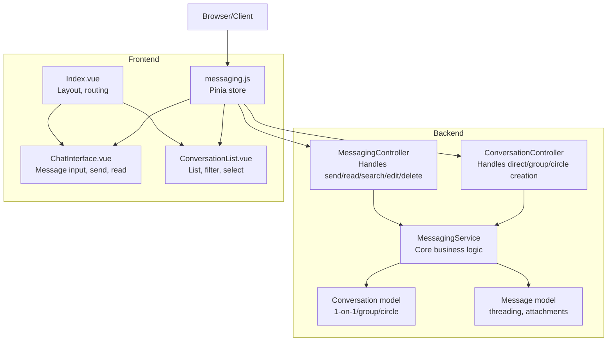
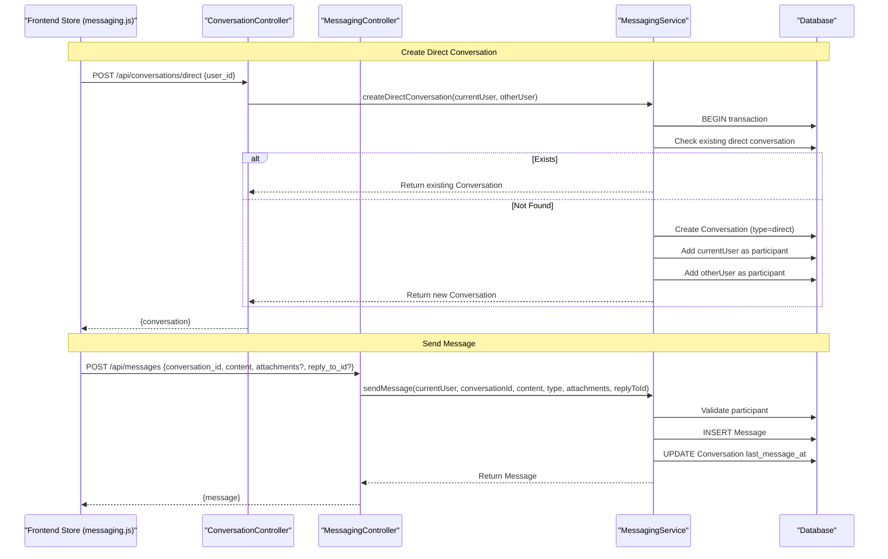
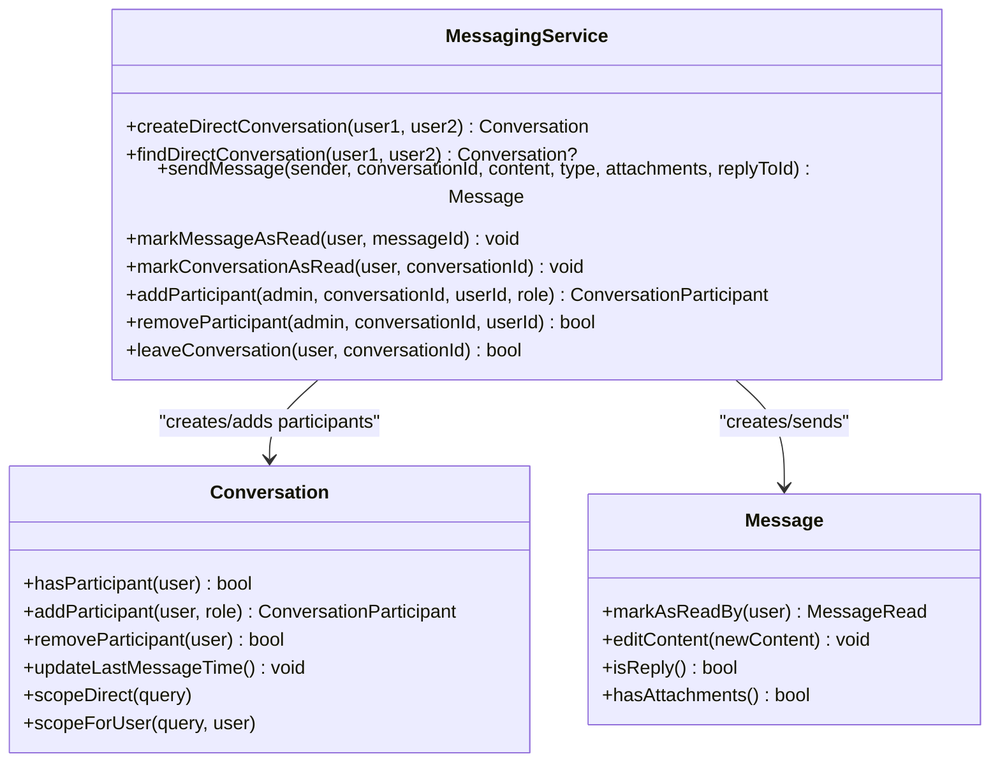
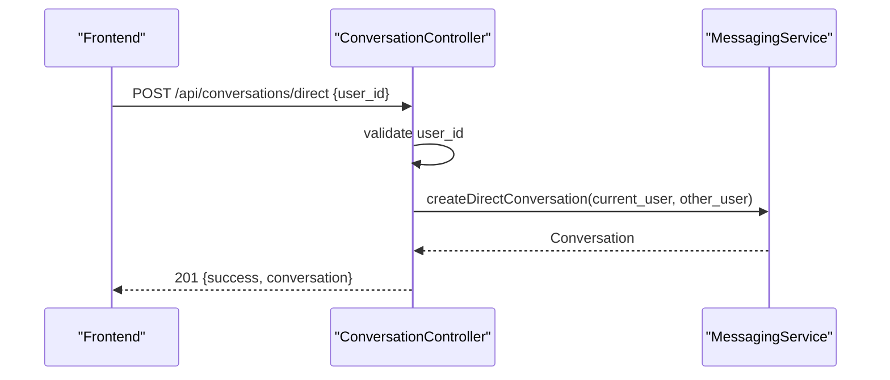
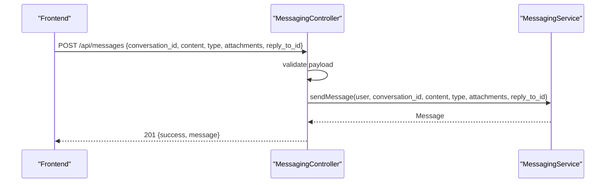
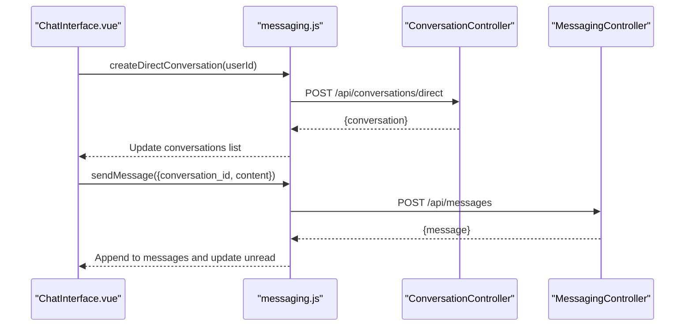
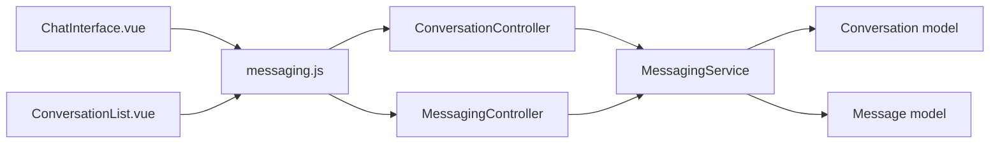

# Direct Messaging

<cite>
**Referenced Files in This Document**
- [MessagingService.php](file://app/Services/MessagingService.php)
- [ConversationController.php](file://app/Http/Controllers/Api/ConversationController.php)
- [MessagingController.php](file://app/Http/Controllers/Api/MessagingController.php)
- [Conversation.php](file://app/Models/Conversation.php)
- [Message.php](file://app/Models/Message.php)
- [messaging.js](file://resources/js/Stores/messaging.js)
- [ChatInterface.vue](file://resources/js/components/Messaging/ChatInterface.vue)
- [ConversationList.vue](file://resources/js/components/Messaging/ConversationList.vue)
- [Index.vue](file://resources/js/Pages/Messages/Index.vue)
</cite>

## Table of Contents
1. [Introduction](#introduction)
2. [Project Structure](#project-structure)
3. [Core Components](#core-components)
4. [Architecture Overview](#architecture-overview)
5. [Detailed Component Analysis](#detailed-component-analysis)
6. [Dependency Analysis](#dependency-analysis)
7. [Performance Considerations](#performance-considerations)
8. [Troubleshooting Guide](#troubleshooting-guide)
9. [Conclusion](#conclusion)
10. [Appendices](#appendices)

## Introduction
This document provides comprehensive documentation for the direct messaging functionality, focusing on 1-on-1 conversations. It covers automatic conversation creation, participant validation, message threading, content and attachment handling, conversation persistence, user permissions, and transaction management. Practical examples demonstrate API usage and integration patterns for initiating conversations, sending messages, and managing conversation state.

## Project Structure
The direct messaging system spans backend Laravel services/controllers/models and a Vue-based frontend store and components:
- Backend: Controllers handle HTTP requests, Services encapsulate business logic, Models represent domain entities.
- Frontend: A centralized messaging store coordinates API interactions, while Vue components render the chat interface and manage user actions.

**Diagram sources**
- [ConversationController.php:11-339](file://app/Http/Controllers/Api/ConversationController.php#L11-L339)
- [MessagingController.php:11-255](file://app/Http/Controllers/Api/MessagingController.php#L11-L255)
- [MessagingService.php:15-461](file://app/Services/MessagingService.php#L15-L461)
- [Conversation.php:11-222](file://app/Models/Conversation.php#L11-L222)
- [Message.php:11-293](file://app/Models/Message.php#L11-L293)
- [messaging.js:1-200](file://resources/js/Stores/messaging.js#L1-L200)
- [ChatInterface.vue:1-350](file://resources/js/components/Messaging/ChatInterface.vue#L1-L350)
- [ConversationList.vue:1-300](file://resources/js/components/Messaging/ConversationList.vue#L1-L300)
- [Index.vue:1-120](file://resources/js/Pages/Messages/Index.vue#L1-L120)

**Section sources**
- [ConversationController.php:11-339](file://app/Http/Controllers/Api/ConversationController.php#L11-L339)
- [MessagingController.php:11-255](file://app/Http/Controllers/Api/MessagingController.php#L11-L255)
- [MessagingService.php:15-461](file://app/Services/MessagingService.php#L15-L461)
- [Conversation.php:11-222](file://app/Models/Conversation.php#L11-L222)
- [Message.php:11-293](file://app/Models/Message.php#L11-L293)
- [messaging.js:1-200](file://resources/js/Stores/messaging.js#L1-L200)
- [ChatInterface.vue:1-350](file://resources/js/components/Messaging/ChatInterface.vue#L1-L350)
- [ConversationList.vue:1-300](file://resources/js/components/Messaging/ConversationList.vue#L1-L300)
- [Index.vue:1-120](file://resources/js/Pages/Messages/Index.vue#L1-L120)

## Core Components
- MessagingService: Implements core messaging operations including direct conversation creation, message sending, read receipts, typing indicators, and participant management. Uses database transactions for data consistency and validates user permissions.
- ConversationController: Exposes REST endpoints for creating conversations (direct/group/circle) and managing conversation-level actions (archive, mute, pin).
- MessagingController: Exposes REST endpoints for sending messages, marking read, typing indicators, searching, editing/deleting messages, and retrieving unread counts.
- Conversation model: Manages conversation metadata, participant relationships, and scopes for type filtering and user membership.
- Message model: Manages message content, threading via reply_to_id, read receipts, attachments, and legacy compatibility.
- Frontend store and components: Provide user-facing workflows for creating direct conversations, sending messages, viewing threads, and managing conversation state.

**Section sources**
- [MessagingService.php:15-461](file://app/Services/MessagingService.php#L15-L461)
- [ConversationController.php:11-339](file://app/Http/Controllers/Api/ConversationController.php#L11-L339)
- [MessagingController.php:11-255](file://app/Http/Controllers/Api/MessagingController.php#L11-L255)
- [Conversation.php:11-222](file://app/Models/Conversation.php#L11-L222)
- [Message.php:11-293](file://app/Models/Message.php#L11-L293)
- [messaging.js:1-200](file://resources/js/Stores/messaging.js#L1-L200)
- [ChatInterface.vue:1-350](file://resources/js/components/Messaging/ChatInterface.vue#L1-L350)
- [ConversationList.vue:1-300](file://resources/js/components/Messaging/ConversationList.vue#L1-L300)
- [Index.vue:1-120](file://resources/js/Pages/Messages/Index.vue#L1-L120)

## Architecture Overview
The system follows a layered architecture:
- Presentation: Vue components and Pinia store handle UI interactions and state.
- API Layer: Controllers validate requests and delegate to Services.
- Business Logic: Services encapsulate domain rules, enforce permissions, and coordinate transactions.
- Persistence: Eloquent models define relationships and scopes; database transactions ensure atomicity.

**Diagram sources**
- [ConversationController.php:92-119](file://app/Http/Controllers/Api/ConversationController.php#L92-L119)
- [MessagingController.php:23-61](file://app/Http/Controllers/Api/MessagingController.php#L23-L61)
- [MessagingService.php:20-40](file://app/Services/MessagingService.php#L20-L40)
- [MessagingService.php:100-127](file://app/Services/MessagingService.php#L100-L127)

## Detailed Component Analysis

### MessagingService: Direct Conversation Creation and Management
- createDirectConversation: Checks for existing direct conversation between two users; if none exists, creates a new conversation and adds both users as participants within a transaction.
- findDirectConversation: Uses type and participant existence scopes to locate an existing 1-on-1 conversation.
- sendMessage: Validates participant status, inserts message, updates conversation timestamps, and broadcasts a MessageSent event.
- markMessageAsRead and markConversationAsRead: Validate participant status, prevent self-read, and broadcast read receipts.
- addParticipant/removeParticipant/leaveConversation: Enforce role-based permissions and conversation type rules (e.g., disallow leaving direct conversations).
- Transaction management: Wraps critical operations to maintain data consistency.

**Diagram sources**
- [MessagingService.php:15-461](file://app/Services/MessagingService.php#L15-L461)
- [Conversation.php:11-222](file://app/Models/Conversation.php#L11-L222)
- [Message.php:11-293](file://app/Models/Message.php#L11-L293)

**Section sources**
- [MessagingService.php:17-40](file://app/Services/MessagingService.php#L17-L40)
- [MessagingService.php:251-264](file://app/Services/MessagingService.php#L251-L264)
- [MessagingService.php:100-127](file://app/Services/MessagingService.php#L100-L127)
- [MessagingService.php:132-153](file://app/Services/MessagingService.php#L132-L153)
- [MessagingService.php:158-184](file://app/Services/MessagingService.php#L158-L184)
- [MessagingService.php:269-306](file://app/Services/MessagingService.php#L269-L306)
- [MessagingService.php:311-321](file://app/Services/MessagingService.php#L311-L321)

### ConversationController: Direct Conversation Endpoint
- Validates request payload (user_id must be present, exist, and differ from current user).
- Delegates to MessagingService to create or reuse a direct conversation.
- Returns JSON response with conversation data and appropriate HTTP status.

**Diagram sources**
- [ConversationController.php:92-119](file://app/Http/Controllers/Api/ConversationController.php#L92-L119)
- [MessagingService.php:20-40](file://app/Services/MessagingService.php#L20-L40)

**Section sources**
- [ConversationController.php:92-119](file://app/Http/Controllers/Api/ConversationController.php#L92-L119)

### MessagingController: Message Operations
- sendMessage: Validates conversation membership, content length/type, optional attachments, and reply_to_id; delegates to MessagingService and returns the created message.
- markAsRead/markConversationAsRead: Validate participant status and broadcast read receipts.
- typing: Broadcasts typing indicators for real-time UX.
- search: Searches messages across user's conversations with optional conversation filter.
- editMessage/deleteMessage: Enforce ownership and moderation permissions.

**Diagram sources**
- [MessagingController.php:23-61](file://app/Http/Controllers/Api/MessagingController.php#L23-L61)
- [MessagingService.php:100-127](file://app/Services/MessagingService.php#L100-L127)

**Section sources**
- [MessagingController.php:23-61](file://app/Http/Controllers/Api/MessagingController.php#L23-L61)
- [MessagingController.php:66-103](file://app/Http/Controllers/Api/MessagingController.php#L66-L103)
- [MessagingController.php:108-139](file://app/Http/Controllers/Api/MessagingController.php#L108-L139)
- [MessagingController.php:144-177](file://app/Http/Controllers/Api/MessagingController.php#L144-L177)
- [MessagingController.php:182-233](file://app/Http/Controllers/Api/MessagingController.php#L182-L233)

### Frontend Integration: Creating Direct Conversations and Sending Messages
- Frontend store (messaging.js) exposes createDirectConversation and sendMessage methods that call backend endpoints and update local state.
- ChatInterface.vue handles message composition, reply previews, and sends messages via the store.
- ConversationList.vue displays conversations, filters by type (direct), and selects active conversation.

**Diagram sources**
- [messaging.js:200-260](file://resources/js/Stores/messaging.js#L200-L260)
- [ChatInterface.vue:250-340](file://resources/js/components/Messaging/ChatInterface.vue#L250-L340)
- [ConversationList.vue:190-260](file://resources/js/components/Messaging/ConversationList.vue#L190-L260)
- [ConversationController.php:92-119](file://app/Http/Controllers/Api/ConversationController.php#L92-L119)
- [MessagingController.php:23-61](file://app/Http/Controllers/Api/MessagingController.php#L23-L61)

**Section sources**
- [messaging.js:200-260](file://resources/js/Stores/messaging.js#L200-L260)
- [ChatInterface.vue:250-340](file://resources/js/components/Messaging/ChatInterface.vue#L250-L340)
- [ConversationList.vue:190-260](file://resources/js/components/Messaging/ConversationList.vue#L190-L260)

## Dependency Analysis
- Controllers depend on MessagingService for business logic.
- MessagingService depends on Eloquent models for persistence and relationships.
- Frontend store depends on API endpoints; components depend on store state and actions.
- No circular dependencies observed among core classes.

**Diagram sources**
- [ConversationController.php:11-339](file://app/Http/Controllers/Api/ConversationController.php#L11-L339)
- [MessagingController.php:11-255](file://app/Http/Controllers/Api/MessagingController.php#L11-L255)
- [MessagingService.php:15-461](file://app/Services/MessagingService.php#L15-L461)
- [Conversation.php:11-222](file://app/Models/Conversation.php#L11-L222)
- [Message.php:11-293](file://app/Models/Message.php#L11-L293)
- [messaging.js:1-200](file://resources/js/Stores/messaging.js#L1-L200)

**Section sources**
- [ConversationController.php:11-339](file://app/Http/Controllers/Api/ConversationController.php#L11-L339)
- [MessagingController.php:11-255](file://app/Http/Controllers/Api/MessagingController.php#L11-L255)
- [MessagingService.php:15-461](file://app/Services/MessagingService.php#L15-L461)
- [Conversation.php:11-222](file://app/Models/Conversation.php#L11-L222)
- [Message.php:11-293](file://app/Models/Message.php#L11-L293)
- [messaging.js:1-200](file://resources/js/Stores/messaging.js#L1-L200)

## Performance Considerations
- Pagination: Controllers support configurable per_page parameters for conversations and messages to limit payload sizes.
- Transactions: MessagingService wraps critical operations to avoid partial writes and maintain consistency.
- Indexing: Ensure database indexes exist on frequently queried columns (e.g., participants.user_id, messages.conversation_id, messages.created_at).
- Real-time updates: Broadcasting via events reduces polling overhead; frontend subscribes to WebSocket/private channels to receive live updates.

[No sources needed since this section provides general guidance]

## Troubleshooting Guide
Common issues and resolutions:
- Validation failures: Controllers return structured error responses with validation errors; check request payloads for required fields and constraints.
- Permission errors: MessagingService throws exceptions for unauthorized operations (e.g., non-participants, insufficient roles). Verify user membership and roles.
- Transaction rollbacks: If a failure occurs during create/update, the transaction ensures no partial state is persisted.
- Read receipts: markMessageAsRead prevents self-read and requires participant validation; ensure the user is part of the conversation.

**Section sources**
- [ConversationController.php:40-51](file://app/Http/Controllers/Api/ConversationController.php#L40-L51)
- [MessagingController.php:49-60](file://app/Http/Controllers/Api/MessagingController.php#L49-L60)
- [MessagingService.php:104-107](file://app/Services/MessagingService.php#L104-L107)
- [MessagingService.php:136-144](file://app/Services/MessagingService.php#L136-L144)

## Conclusion
The direct messaging system integrates robust backend services with a responsive frontend to deliver seamless 1-on-1 communication. Automatic conversation creation, strict participant validation, message threading, and transactional consistency form the backbone of reliable messaging. The modular design enables easy extension to group and circle conversations while maintaining clear separation of concerns.

[No sources needed since this section summarizes without analyzing specific files]

## Appendices

### API Usage Examples
- Create a direct conversation:
  - Method: POST /api/conversations/direct
  - Payload: { user_id }
  - Response: { success, conversation }
- Send a message:
  - Method: POST /api/messages
  - Payload: { conversation_id, content, type?, attachments?, reply_to_id? }
  - Response: { success, message }
- Mark message as read:
  - Method: POST /api/messages/{id}/read
  - Response: { success, message }
- Mark conversation as read:
  - Method: POST /api/conversations/{id}/read
  - Response: { success, message }

**Section sources**
- [ConversationController.php:92-119](file://app/Http/Controllers/Api/ConversationController.php#L92-L119)
- [MessagingController.php:23-61](file://app/Http/Controllers/Api/MessagingController.php#L23-L61)
- [MessagingController.php:66-103](file://app/Http/Controllers/Api/MessagingController.php#L66-L103)
- [MessagingController.php:87-103](file://app/Http/Controllers/Api/MessagingController.php#L87-L103)

### Frontend Integration Patterns
- Initialize messaging store and load conversations/unread counts.
- Use createDirectConversation to initiate a 1-on-1 thread with another user.
- Use sendMessage to post messages with optional attachments and reply-to references.
- Subscribe to WebSocket/private channels for real-time message and read receipts.

**Section sources**
- [messaging.js:1-200](file://resources/js/Stores/messaging.js#L1-L200)
- [ChatInterface.vue:250-340](file://resources/js/components/Messaging/ChatInterface.vue#L250-L340)
- [ConversationList.vue:190-260](file://resources/js/components/Messaging/ConversationList.vue#L190-L260)