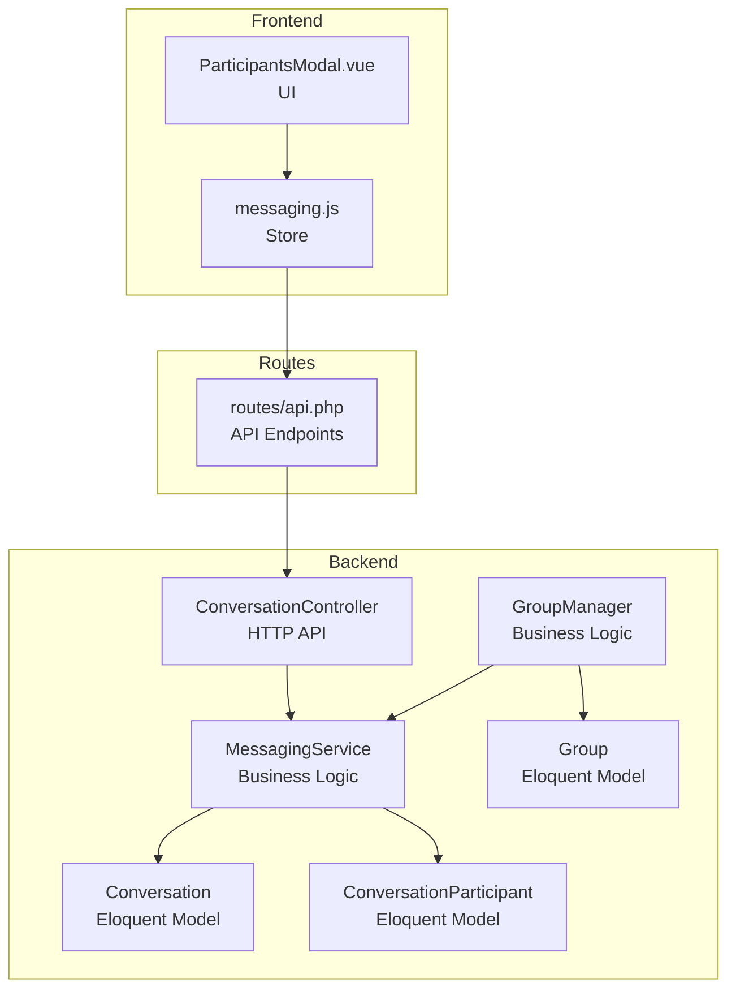
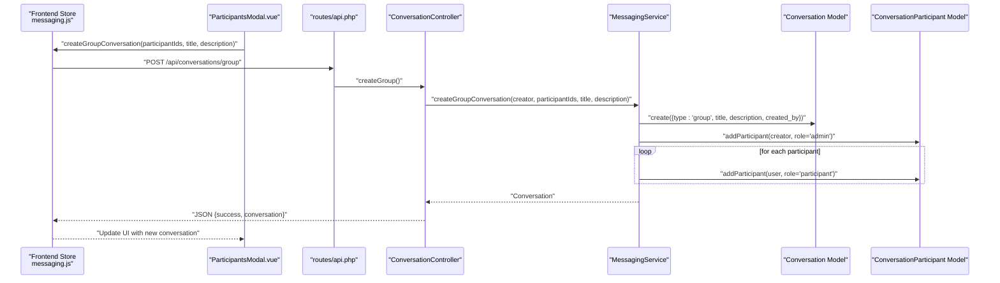
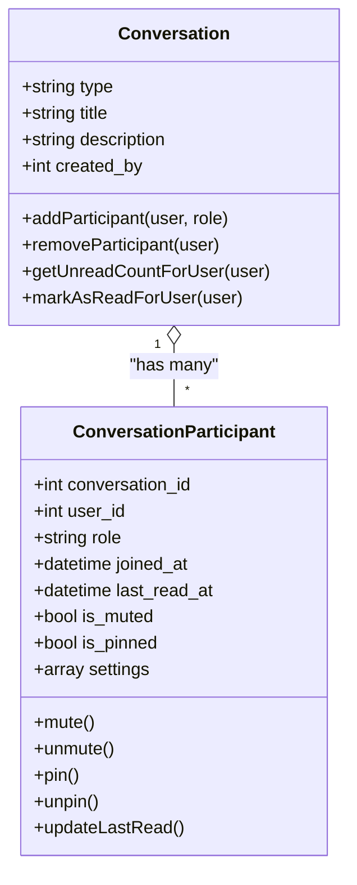
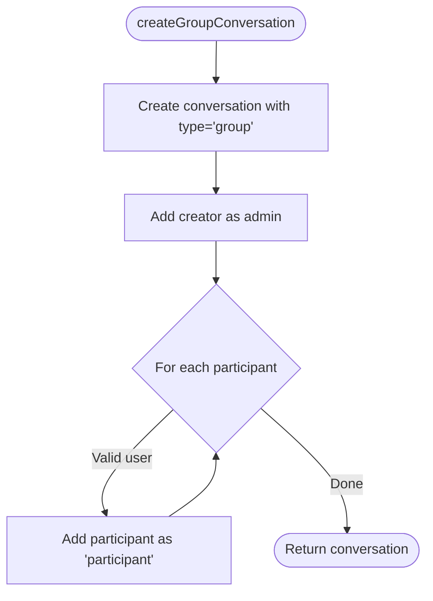
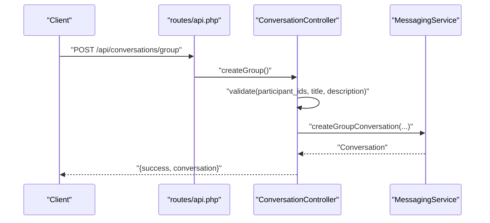
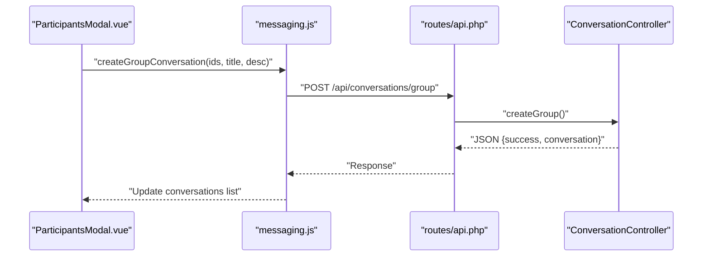
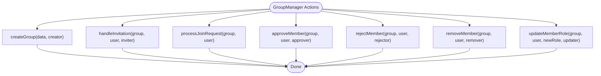
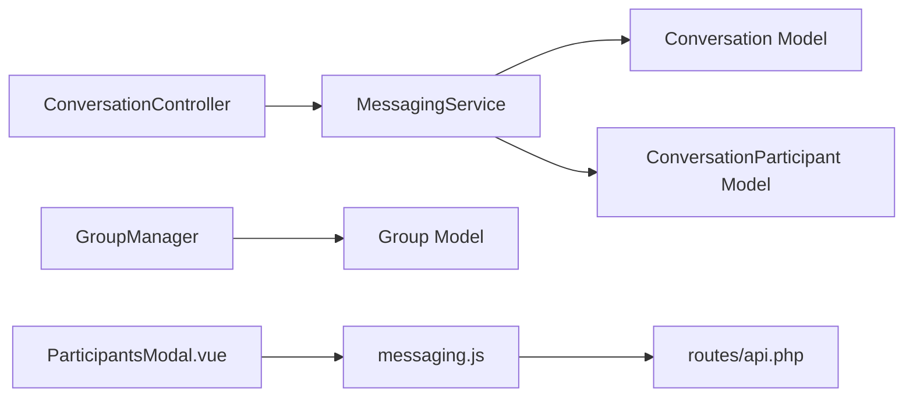

# Group Conversations

<cite>
**Referenced Files in This Document**
- [Conversation.php](file://app/Models/Conversation.php)
- [ConversationParticipant.php](file://app/Models/ConversationParticipant.php)
- [MessagingService.php](file://app/Services/MessagingService.php)
- [ConversationController.php](file://app/Http/Controllers/Api/ConversationController.php)
- [Group.php](file://app/Models/Group.php)
- [GroupManager.php](file://app/Services/GroupManager.php)
- [api.php](file://routes/api.php)
- [ParticipantsModal.vue](file://resources/js/components/Messaging/ParticipantsModal.vue)
- [messaging.js](file://resources/js/Stores/messaging.js)
</cite>

## Table of Contents
1. [Introduction](#introduction)
2. [Project Structure](#project-structure)
3. [Core Components](#core-components)
4. [Architecture Overview](#architecture-overview)
5. [Detailed Component Analysis](#detailed-component-analysis)
6. [Dependency Analysis](#dependency-analysis)
7. [Performance Considerations](#performance-considerations)
8. [Troubleshooting Guide](#troubleshooting-guide)
9. [Conclusion](#conclusion)

## Introduction
This document explains the group conversation management system. It covers how group conversations are created, how participants are managed, and how roles and permissions are enforced. It also documents conversation settings such as titles and descriptions, and outlines administrative controls, limits, and moderation features. Practical examples demonstrate creating groups, managing participants, and handling group-specific features.

## Project Structure
The group conversation feature spans models, services, controllers, routes, and frontend components:
- Models represent conversations, participants, and groups.
- Services encapsulate business logic for creating conversations and managing participants.
- Controllers expose API endpoints for conversation lifecycle operations.
- Routes define the HTTP surface for client integrations.
- Frontend components provide participant management UI and store integrations.

**Diagram sources**
- [ConversationController.php:124-158](file://app/Http/Controllers/Api/ConversationController.php#L124-L158)
- [MessagingService.php:45-70](file://app/Services/MessagingService.php#L45-L70)
- [Conversation.php:106-121](file://app/Models/Conversation.php#L106-L121)
- [ConversationParticipant.php:106-121](file://app/Models/ConversationParticipant.php#L106-L121)
- [Group.php:99-135](file://app/Models/Group.php#L99-L135)
- [GroupManager.php:19-42](file://app/Services/GroupManager.php#L19-L42)
- [api.php:757-783](file://routes/api.php#L757-L783)
- [ParticipantsModal.vue:107-150](file://resources/js/components/Messaging/ParticipantsModal.vue#L107-L150)
- [messaging.js:241-257](file://resources/js/Stores/messaging.js#L241-L257)

**Section sources**
- [ConversationController.php:124-158](file://app/Http/Controllers/Api/ConversationController.php#L124-L158)
- [MessagingService.php:45-70](file://app/Services/MessagingService.php#L45-L70)
- [Conversation.php:106-121](file://app/Models/Conversation.php#L106-L121)
- [ConversationParticipant.php:106-121](file://app/Models/ConversationParticipant.php#L106-L121)
- [Group.php:99-135](file://app/Models/Group.php#L99-L135)
- [GroupManager.php:19-42](file://app/Services/GroupManager.php#L19-L42)
- [api.php:757-783](file://routes/api.php#L757-L783)
- [ParticipantsModal.vue:107-150](file://resources/js/components/Messaging/ParticipantsModal.vue#L107-L150)
- [messaging.js:241-257](file://resources/js/Stores/messaging.js#L241-L257)

## Core Components
- Conversation model: Represents a chat container with type, title, description, creator, and participants. Provides helpers to add/remove participants and compute unread counts.
- ConversationParticipant model: Stores per-participant metadata (role, joined timestamp, last read time, mute/pin flags, and settings).
- MessagingService: Implements conversation creation (including group), participant management, and message sending.
- ConversationController: Validates inputs and delegates to MessagingService for conversation operations.
- Group model and GroupManager: Manage group membership, roles, and permissions for group-based contexts.

Key capabilities:
- Create group conversations with a creator and initial participants.
- Add/remove participants and manage roles (admin, moderator, participant).
- Enforce role-based permissions for moderation actions.
- Track participant settings (mute, pin) and unread counts.

**Section sources**
- [Conversation.php:106-121](file://app/Models/Conversation.php#L106-L121)
- [ConversationParticipant.php:106-121](file://app/Models/ConversationParticipant.php#L106-L121)
- [MessagingService.php:45-70](file://app/Services/MessagingService.php#L45-L70)
- [ConversationController.php:124-158](file://app/Http/Controllers/Api/ConversationController.php#L124-L158)
- [Group.php:99-135](file://app/Models/Group.php#L99-L135)
- [GroupManager.php:19-42](file://app/Services/GroupManager.php#L19-L42)

## Architecture Overview
The group conversation workflow follows a layered pattern: frontend triggers an API endpoint, the controller validates and invokes the service, the service persists changes via models, and the controller returns a structured JSON response.

**Diagram sources**
- [messaging.js:241-257](file://resources/js/Stores/messaging.js#L241-L257)
- [ParticipantsModal.vue:396-410](file://resources/js/components/Messaging/ParticipantsModal.vue#L396-L410)
- [api.php](file://routes/api.php#L763)
- [ConversationController.php:124-158](file://app/Http/Controllers/Api/ConversationController.php#L124-L158)
- [MessagingService.php:45-70](file://app/Services/MessagingService.php#L45-L70)
- [Conversation.php:106-121](file://app/Models/Conversation.php#L106-L121)
- [ConversationParticipant.php:106-121](file://app/Models/ConversationParticipant.php#L106-L121)

## Detailed Component Analysis

### Conversation Model: Group Creation and Participant Management
- Group creation: The service creates a conversation with type group and sets the creator as admin.
- Adding participants: The service adds each participant as a regular participant.
- Removing participants: The service removes a participant from the conversation.
- Unread tracking: The model exposes helpers to compute unread counts per user/participant.

**Diagram sources**
- [Conversation.php:106-121](file://app/Models/Conversation.php#L106-L121)
- [ConversationParticipant.php:106-121](file://app/Models/ConversationParticipant.php#L106-L121)

**Section sources**
- [Conversation.php:106-121](file://app/Models/Conversation.php#L106-L121)
- [ConversationParticipant.php:106-121](file://app/Models/ConversationParticipant.php#L106-L121)

### MessagingService: Group Conversation Creation
- Transactional creation ensures atomicity for conversation creation and initial participant additions.
- Creator is added as admin; other participants are added as participants.
- Returns the newly created conversation for immediate UI updates.

**Diagram sources**
- [MessagingService.php:45-70](file://app/Services/MessagingService.php#L45-L70)

**Section sources**
- [MessagingService.php:45-70](file://app/Services/MessagingService.php#L45-L70)

### ConversationController: API Surface for Group Conversations
- Validates inputs for participant lists, titles, and descriptions.
- Delegates to MessagingService for creation.
- Returns standardized JSON responses with success flags and errors.

**Diagram sources**
- [api.php](file://routes/api.php#L763)
- [ConversationController.php:124-158](file://app/Http/Controllers/Api/ConversationController.php#L124-L158)
- [MessagingService.php:45-70](file://app/Services/MessagingService.php#L45-L70)

**Section sources**
- [ConversationController.php:124-158](file://app/Http/Controllers/Api/ConversationController.php#L124-L158)
- [api.php](file://routes/api.php#L763)

### Frontend Integration: Participants Management UI
- ParticipantsModal.vue provides role management actions (make/remove admin, remove participant) and participant search.
- messaging.js integrates with the backend to create group conversations and update local state.

**Diagram sources**
- [ParticipantsModal.vue:107-150](file://resources/js/components/Messaging/ParticipantsModal.vue#L107-L150)
- [messaging.js:241-257](file://resources/js/Stores/messaging.js#L241-L257)
- [api.php](file://routes/api.php#L763)
- [ConversationController.php:124-158](file://app/Http/Controllers/Api/ConversationController.php#L124-L158)

**Section sources**
- [ParticipantsModal.vue:107-150](file://resources/js/components/Messaging/ParticipantsModal.vue#L107-L150)
- [messaging.js:241-257](file://resources/js/Stores/messaging.js#L241-L257)

### Group Management: Roles, Permissions, and Moderation
- GroupManager handles group creation, invitations, join requests, approvals, and removals.
- Enforces role-based permissions for administrative actions (e.g., approving/removing members).
- Supports role updates with checks against creator and role hierarchies.

**Diagram sources**
- [GroupManager.php:19-42](file://app/Services/GroupManager.php#L19-L42)
- [GroupManager.php:147-183](file://app/Services/GroupManager.php#L147-L183)
- [GroupManager.php:188-207](file://app/Services/GroupManager.php#L188-L207)
- [GroupManager.php:212-220](file://app/Services/GroupManager.php#L212-L220)
- [GroupManager.php:225-253](file://app/Services/GroupManager.php#L225-L253)

**Section sources**
- [GroupManager.php:19-42](file://app/Services/GroupManager.php#L19-L42)
- [GroupManager.php:147-183](file://app/Services/GroupManager.php#L147-L183)
- [GroupManager.php:188-207](file://app/Services/GroupManager.php#L188-L207)
- [GroupManager.php:212-220](file://app/Services/GroupManager.php#L212-L220)
- [GroupManager.php:225-253](file://app/Services/GroupManager.php#L225-L253)

## Dependency Analysis
- Controllers depend on MessagingService for business operations.
- MessagingService depends on Conversation and ConversationParticipant models.
- Group operations are handled by GroupManager and Group models.
- Frontend components depend on messaging.js store and routes.

**Diagram sources**
- [ConversationController.php:124-158](file://app/Http/Controllers/Api/ConversationController.php#L124-L158)
- [MessagingService.php:45-70](file://app/Services/MessagingService.php#L45-L70)
- [Conversation.php:106-121](file://app/Models/Conversation.php#L106-L121)
- [ConversationParticipant.php:106-121](file://app/Models/ConversationParticipant.php#L106-L121)
- [GroupManager.php:19-42](file://app/Services/GroupManager.php#L19-L42)
- [Group.php:99-135](file://app/Models/Group.php#L99-L135)
- [ParticipantsModal.vue:107-150](file://resources/js/components/Messaging/ParticipantsModal.vue#L107-L150)
- [messaging.js:241-257](file://resources/js/Stores/messaging.js#L241-L257)
- [api.php](file://routes/api.php#L763)

**Section sources**
- [ConversationController.php:124-158](file://app/Http/Controllers/Api/ConversationController.php#L124-L158)
- [MessagingService.php:45-70](file://app/Services/MessagingService.php#L45-L70)
- [Conversation.php:106-121](file://app/Models/Conversation.php#L106-L121)
- [ConversationParticipant.php:106-121](file://app/Models/ConversationParticipant.php#L106-L121)
- [GroupManager.php:19-42](file://app/Services/GroupManager.php#L19-L42)
- [Group.php:99-135](file://app/Models/Group.php#L99-L135)
- [ParticipantsModal.vue:107-150](file://resources/js/components/Messaging/ParticipantsModal.vue#L107-L150)
- [messaging.js:241-257](file://resources/js/Stores/messaging.js#L241-L257)
- [api.php](file://routes/api.php#L763)

## Performance Considerations
- Transactional creation prevents partial states during group conversation setup.
- Unread counting leverages timestamps to avoid expensive joins.
- Frontend stores batch UI updates after successful API calls to minimize re-renders.
- Consider pagination for participant lists and message retrieval in large groups.

## Troubleshooting Guide
Common issues and resolutions:
- Validation failures: Ensure participant arrays meet minimum/maximum constraints and user IDs are distinct from the creator.
- Authorization: Only admins/moderators can modify roles or remove participants; self-removal is allowed.
- Limits: Group participant limit is enforced server-side; adjust validations if scaling requirements change.
- Role hierarchies: Moderators cannot remove admins; creators cannot have their roles changed.

**Section sources**
- [ConversationController.php:127-132](file://app/Http/Controllers/Api/ConversationController.php#L127-L132)
- [GroupManager.php:304-331](file://app/Services/GroupManager.php#L304-L331)

## Conclusion
The group conversation system combines robust backend models and services with a clean API and intuitive frontend components. Administrators can create groups, manage participants, enforce role-based permissions, and moderate conversations effectively. The design supports scalability and maintainability while providing clear boundaries between presentation, business logic, and persistence.