# Messaging System

<cite>
**Referenced Files in This Document**
- [ConversationController.php](file://app/Http/Controllers/Api/ConversationController.php)
- [MessageController.php](file://app/Http/Controllers/MessageController.php)
- [Conversation.php](file://app/Models/Conversation.php)
- [Message.php](file://app/Models/Message.php)
- [ConversationParticipant.php](file://app/Models/ConversationParticipant.php)
- [MessageRead.php](file://app/Models/MessageRead.php)
- [api.php](file://routes/api.php)
- [task-10-communication-messaging-recap.md](file://docs/task-10-communication-messaging-recap.md)
</cite>

## Table of Contents
1. [Introduction](#introduction)
2. [Project Structure](#project-structure)
3. [Core Components](#core-components)
4. [Architecture Overview](#architecture-overview)
5. [Detailed Component Analysis](#detailed-component-analysis)
6. [Dependency Analysis](#dependency-analysis)
7. [Performance Considerations](#performance-considerations)
8. [Troubleshooting Guide](#troubleshooting-guide)
9. [Conclusion](#conclusion)
10. [Appendices](#appendices)

## Introduction
This document describes the messaging system component that powers direct messaging, group conversations, and circle-based conversations. It explains how conversations are created, how participants are managed, and how role-based permissions are enforced. It also documents message operations (send, edit, delete, attachments), read receipts, typing indicators, and administrative features such as archiving, muting, and pinning. The document concludes with database schema insights, performance considerations for large-scale deployments, and practical integration patterns.

## Project Structure
The messaging system is implemented around three primary models and their associated controllers:
- Conversation: central entity representing a chat (direct, group, or circle)
- Message: individual messages within a conversation
- ConversationParticipant: per-user participation state and roles
- MessageRead: read receipt records for messages

Controllers expose REST endpoints for managing conversations and messages.

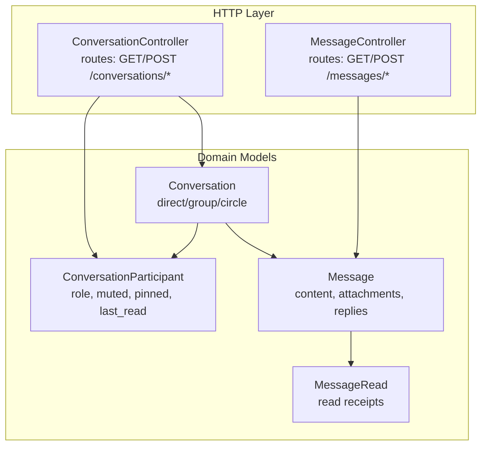

**Diagram sources**
- [ConversationController.php](file://app/Http/Controllers/Api/ConversationController.php)
- [MessageController.php](file://app/Http/Controllers/MessageController.php)
- [Conversation.php](file://app/Models/Conversation.php)
- [Message.php](file://app/Models/Message.php)
- [ConversationParticipant.php](file://app/Models/ConversationParticipant.php)
- [MessageRead.php](file://app/Models/MessageRead.php)

**Section sources**
- [api.php:757-772](file://routes/api.php#L757-L772)

## Core Components
- Conversation: encapsulates conversation metadata, type, creator, and relationships to participants and messages. Provides scopes for direct/group/circle, participant checks, unread counts, and read marking.
- Message: stores content, attachments, reply hierarchy, and read receipts. Includes helpers for editing, replying, and read tracking.
- ConversationParticipant: tracks per-user role, mute/pin state, joined timestamps, and last read time.
- MessageRead: records which users have read specific messages.

**Section sources**
- [Conversation.php:11-223](file://app/Models/Conversation.php#L11-L223)
- [Message.php:11-294](file://app/Models/Message.php#L11-L294)
- [ConversationParticipant.php:8-181](file://app/Models/ConversationParticipant.php#L8-L181)
- [MessageRead.php](file://app/Models/MessageRead.php)

## Architecture Overview
The messaging system follows a layered architecture:
- HTTP routes define the API surface for conversations and messages
- Controllers orchestrate requests, enforce authorization, and delegate to domain logic
- Eloquent models encapsulate persistence, relationships, and business methods
- Broadcasting and event systems enable real-time features (typing indicators, live notifications)

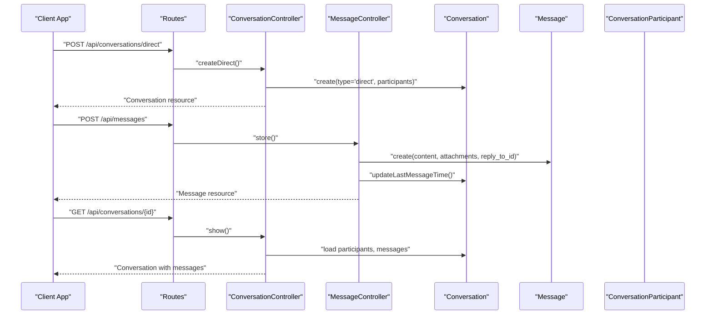

**Diagram sources**
- [api.php:757-772](file://routes/api.php#L757-L772)
- [ConversationController.php](file://app/Http/Controllers/Api/ConversationController.php)
- [MessageController.php](file://app/Http/Controllers/MessageController.php)
- [Conversation.php:218-221](file://app/Models/Conversation.php#L218-L221)
- [Message.php:163-170](file://app/Models/Message.php#L163-L170)

## Detailed Component Analysis

### Conversation Model
Responsibilities:
- Store conversation metadata (type, title, description, creator, circle/group linkage)
- Manage participants via a pivot table with roles and per-user settings
- Track last activity and archival state
- Provide scopes for filtering by type and user
- Compute unread counts and mark as read per participant

Key capabilities:
- Participant management: add/remove participants, role checks
- Read state: unread count calculation, mark as read
- Display name resolution for direct, circle, and group contexts
- Type scoping for direct, group, and circle conversations

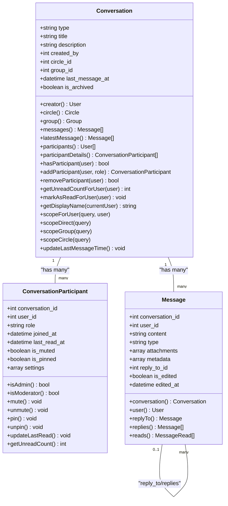

**Diagram sources**
- [Conversation.php:11-223](file://app/Models/Conversation.php#L11-L223)
- [ConversationParticipant.php:8-181](file://app/Models/ConversationParticipant.php#L8-L181)
- [Message.php:11-294](file://app/Models/Message.php#L11-L294)

**Section sources**
- [Conversation.php:11-223](file://app/Models/Conversation.php#L11-L223)

### Message Model
Responsibilities:
- Persist message content, type, attachments, and reply hierarchy
- Track edits and timestamps
- Provide read receipts and read statistics
- Support legacy fields for backward compatibility

Capabilities:
- Reply chain: parent-child relationships via reply_to_id
- Read receipts: per-user read tracking
- Attachment handling: array-backed metadata
- Scopes: by conversation, user, type, edited, recent, top-level vs replies

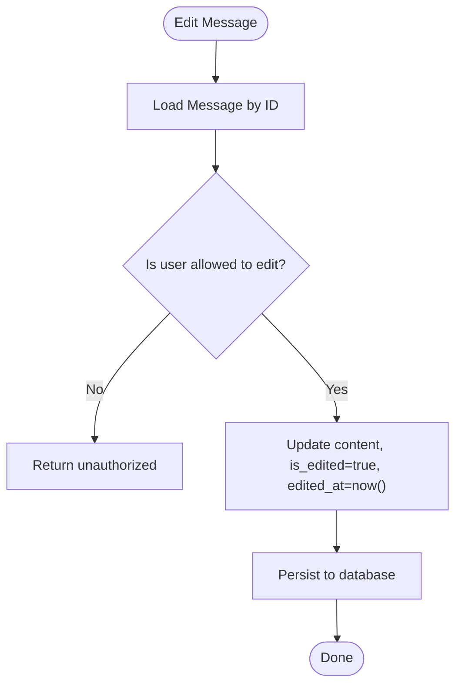

**Diagram sources**
- [Message.php:163-170](file://app/Models/Message.php#L163-L170)

**Section sources**
- [Message.php:11-294](file://app/Models/Message.php#L11-L294)

### ConversationParticipant Model
Responsibilities:
- Track per-user participation state within a conversation
- Enforce role-based permissions (admin/moderator/participant)
- Manage mute/pin preferences and last read timestamps
- Provide unread counts excluding self-sent messages

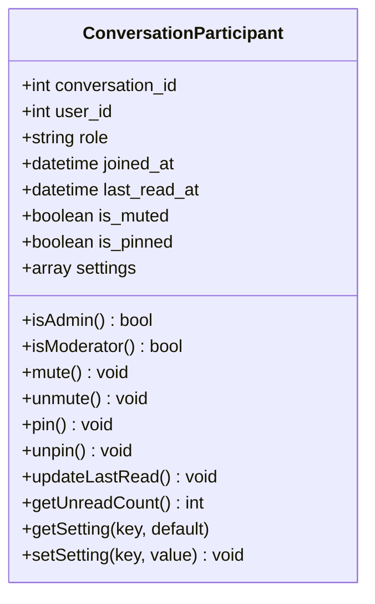

**Diagram sources**
- [ConversationParticipant.php:8-181](file://app/Models/ConversationParticipant.php#L8-L181)

**Section sources**
- [ConversationParticipant.php:8-181](file://app/Models/ConversationParticipant.php#L8-L181)

### Controllers and API Surface
Endpoints (selected):
- Conversations
  - GET /api/conversations
  - GET /api/conversations/{conversationId}
  - POST /api/conversations/direct
  - POST /api/conversations/group
  - POST /api/conversations/circle
  - POST /api/conversations/{conversationId}/participants
  - DELETE /api/conversations/{conversationId}/participants/{userId}
  - POST /api/conversations/{conversationId}/leave
  - POST /api/conversations/{conversationId}/archive
  - POST /api/conversations/{conversationId}/mute
  - POST /api/conversations/{conversationId}/pin
- Messages
  - GET /api/messages
  - GET /api/messages/{messageId}
  - POST /api/messages
  - PUT /api/messages/{messageId}
  - DELETE /api/messages/{messageId}

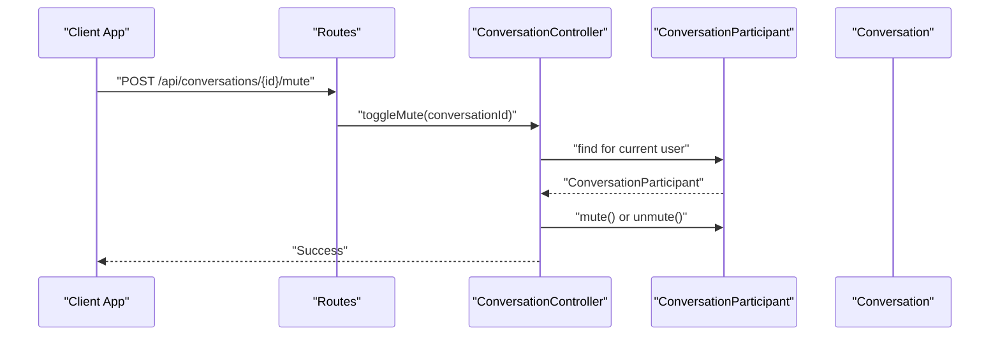

**Diagram sources**
- [api.php:757-772](file://routes/api.php#L757-L772)
- [ConversationController.php](file://app/Http/Controllers/Api/ConversationController.php)
- [ConversationParticipant.php:78-91](file://app/Models/ConversationParticipant.php#L78-L91)

**Section sources**
- [api.php:757-772](file://routes/api.php#L757-L772)
- [ConversationController.php](file://app/Http/Controllers/Api/ConversationController.php)
- [MessageController.php](file://app/Http/Controllers/MessageController.php)

### Real-time Features
- WebSocket integration for live messaging, typing indicators, presence, and notifications
- Broadcasting events for message, discussion, announcement, ticket, rating, and system events
- Presence system indicating online/offline status

Practical implications:
- Use WebSocket channels per conversation for efficient broadcast
- Emit typing indicators on user input events and clear after idle timeout
- Maintain presence state synchronized with user sessions

**Section sources**
- [task-10-communication-messaging-recap.md:334-350](file://docs/task-10-communication-messaging-recap.md#L334-L350)

### Conversation Types and Creation
- Direct conversations: two participants, auto-generated display name from other participant
- Group conversations: linked to a Group entity
- Circle conversations: linked to a Circle entity

Creation flows:
- Direct: resolve participants, ensure mutual consent, create conversation with type direct
- Group: select group, invite members, set type group
- Circle: select circle, invite members, set type circle

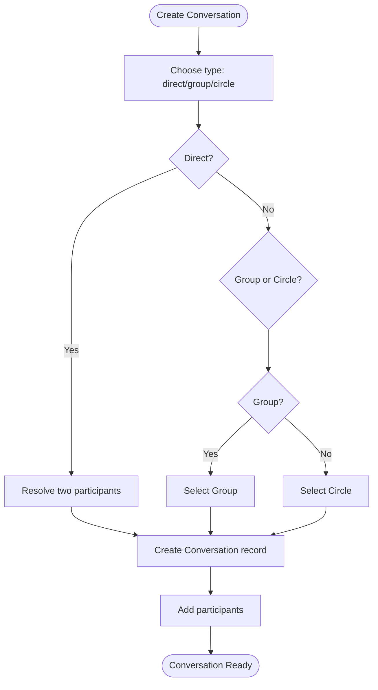

**Diagram sources**
- [Conversation.php:156-179](file://app/Models/Conversation.php#L156-L179)

**Section sources**
- [Conversation.php:15-31](file://app/Models/Conversation.php#L15-L31)
- [Conversation.php:156-179](file://app/Models/Conversation.php#L156-L179)

### Participant Management and Permissions
- Roles: admin, moderator, participant
- Admin/moderator can manage participants and modify conversation settings
- Participant actions: join, leave, mute, pin, mark as read
- Unread counting excludes self-sent messages for accuracy

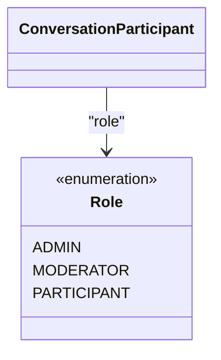

**Diagram sources**
- [ConversationParticipant.php:48-59](file://app/Models/ConversationParticipant.php#L48-L59)

**Section sources**
- [ConversationParticipant.php:48-59](file://app/Models/ConversationParticipant.php#L48-L59)
- [ConversationParticipant.php:151-174](file://app/Models/ConversationParticipant.php#L151-L174)

### Message Operations
- Sending: create message with content and optional attachments; update conversation last_message_at
- Editing: update content with edit flag and timestamp
- Deletion: soft-delete messages; consider tombstone pattern for sensitive content
- Attachments: store as array metadata; integrate with media upload service
- Replies: thread messages via reply_to_id; top-level vs replies scopes

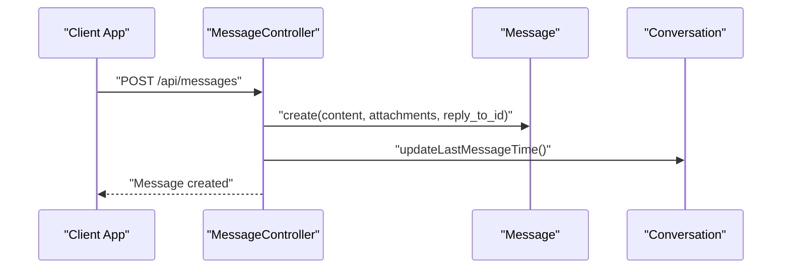

**Diagram sources**
- [MessageController.php](file://app/Http/Controllers/MessageController.php)
- [Message.php:163-170](file://app/Models/Message.php#L163-L170)
- [Conversation.php:218-221](file://app/Models/Conversation.php#L218-L221)

**Section sources**
- [Message.php:15-45](file://app/Models/Message.php#L15-L45)
- [Message.php:163-170](file://app/Models/Message.php#L163-L170)
- [Message.php:147-158](file://app/Models/Message.php#L147-L158)
- [Message.php:175-178](file://app/Models/Message.php#L175-L178)

### Read Receipts and Typing Indicators
- Read receipts: MessageRead entries track which users have read a message
- Typing indicators: broadcast typing events to other participants in a conversation

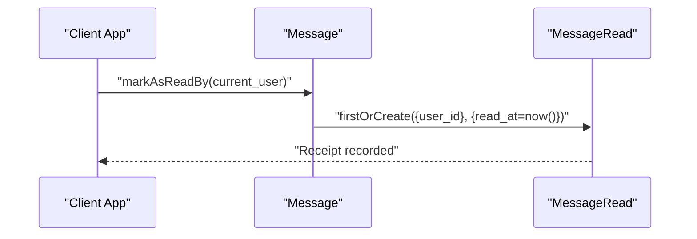

**Diagram sources**
- [Message.php:119-126](file://app/Models/Message.php#L119-L126)
- [MessageRead.php](file://app/Models/MessageRead.php)

**Section sources**
- [Message.php:111-142](file://app/Models/Message.php#L111-L142)
- [MessageRead.php](file://app/Models/MessageRead.php)

### Administrative Features: Archive, Mute, Pin
- Archive: move conversation out of active lists
- Mute: suppress notifications for a participant
- Pin: keep conversation at the top of the list

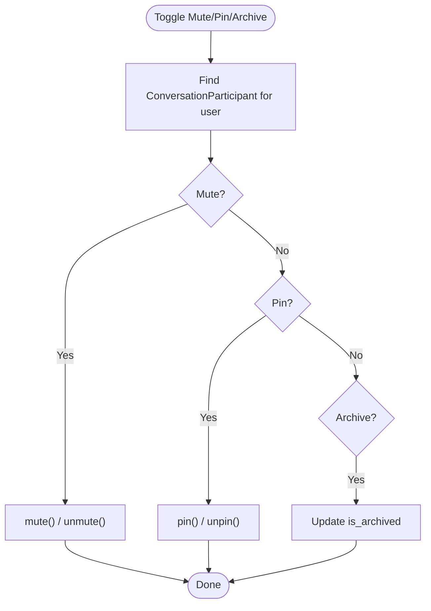

**Diagram sources**
- [ConversationParticipant.php:78-107](file://app/Models/ConversationParticipant.php#L78-L107)
- [Conversation.php:24-31](file://app/Models/Conversation.php#L24-L31)

**Section sources**
- [ConversationParticipant.php:78-107](file://app/Models/ConversationParticipant.php#L78-L107)
- [Conversation.php:24-31](file://app/Models/Conversation.php#L24-L31)

### Search Functionality
- Full-text search across messages and conversations
- Indexing strategy for performance on large datasets
- Filters by user, date range, type, and keywords

[No sources needed since this section provides general guidance]

### Database Schema Overview
```mermaid
erDiagram
CONVERSATIONS {
int id PK
string type
string title
text description
int created_by
int circle_id
int group_id
json metadata
datetime last_message_at
boolean is_archived
timestamps
}
USERS {
int id PK
string name
string email
timestamps
}
CIRCLES {
int id PK
string name
timestamps
}
GROUPS {
int id PK
string name
timestamps
}
MESSAGES {
int id PK
int conversation_id FK
int user_id FK
text content
string type
json attachments
json metadata
int reply_to_id FK
boolean is_edited
datetime edited_at
timestamps
}
CONVERSATION_PARTICIPANTS {
int id PK
int conversation_id FK
int user_id FK
string role
datetime joined_at
datetime last_read_at
boolean is_muted
boolean is_pinned
json settings
timestamps
}
MESSAGE_READS {
int id PK
int message_id FK
int user_id FK
datetime read_at
timestamps
}
CONVERSATIONS ||--o{ MESSAGES : "contains"
CONVERSATIONS ||--o{ CONVERSATION_PARTICIPANTS : "has"
USERS ||--o{ CONVERSATION_PARTICIPANTS : "joins"
USERS ||--o{ MESSAGES : "sends"
MESSAGES ||--o{ MESSAGE_READS : "read by"
CIRCLES ||--|| CONVERSATIONS : "owns"
GROUPS ||--|| CONVERSATIONS : "owns"
```

**Diagram sources**
- [Conversation.php:15-31](file://app/Models/Conversation.php#L15-L31)
- [Message.php:15-45](file://app/Models/Message.php#L15-L45)
- [ConversationParticipant.php:10-27](file://app/Models/ConversationParticipant.php#L10-L27)
- [MessageRead.php](file://app/Models/MessageRead.php)

**Section sources**
- [Conversation.php:15-31](file://app/Models/Conversation.php#L15-L31)
- [Message.php:15-45](file://app/Models/Message.php#L15-L45)
- [ConversationParticipant.php:10-27](file://app/Models/ConversationParticipant.php#L10-L27)
- [MessageRead.php](file://app/Models/MessageRead.php)

## Dependency Analysis
- Controllers depend on models for persistence and business logic
- Models encapsulate relationships and computed fields
- Broadcasting and event systems integrate with controllers for real-time updates
- Routes define the contract for clients and controllers

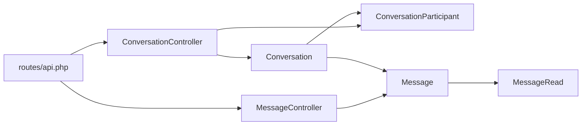

**Diagram sources**
- [api.php:757-772](file://routes/api.php#L757-L772)
- [ConversationController.php](file://app/Http/Controllers/Api/ConversationController.php)
- [MessageController.php](file://app/Http/Controllers/MessageController.php)
- [Conversation.php](file://app/Models/Conversation.php)
- [Message.php](file://app/Models/Message.php)
- [ConversationParticipant.php](file://app/Models/ConversationParticipant.php)
- [MessageRead.php](file://app/Models/MessageRead.php)

**Section sources**
- [api.php:757-772](file://routes/api.php#L757-L772)

## Performance Considerations
- Real-time performance: optimize WebSocket connections, use message queuing, and implement connection pooling
- Database optimization: create indexes on conversation_id, user_id, created_at; consider partitioning by date and user
- Caching strategy: cache frequently accessed conversations and participant lists
- Archiving: automatically archive old conversations and prune message history
- Horizontal scaling: scale WebSocket servers and database read replicas for analytics

[No sources needed since this section provides general guidance]

## Troubleshooting Guide
Common issues and resolutions:
- Unauthorized access: ensure proper authorization checks in controllers before mutating conversations or messages
- Missing read receipts: verify MessageRead entries are created when users open messages
- Stale unread counts: recalculate counts when participants join/leave or when messages are deleted
- Attachment handling: validate file uploads and ensure metadata arrays are properly serialized
- Real-time sync: confirm WebSocket channels are subscribed/unsubscribed on client disconnects

**Section sources**
- [Message.php:119-126](file://app/Models/Message.php#L119-L126)
- [ConversationParticipant.php:120-130](file://app/Models/ConversationParticipant.php#L120-L130)

## Conclusion
The messaging system provides a robust foundation for direct, group, and circle-based conversations. Its model-driven design cleanly separates concerns between conversations, messages, and participant states while supporting essential features like read receipts, typing indicators, and administrative controls. With appropriate indexing, caching, and real-time infrastructure, it scales to support large communities and extensive message histories.

## Appendices

### Practical Examples and Integration Patterns
- Creating a direct conversation: resolve two users, create conversation with type direct, add both as participants
- Adding/removing participants: use ConversationParticipant methods; enforce role checks for admin-only actions
- Sending a message: create Message under a conversation; update conversation last_message_at
- Managing read state: mark as read on message open; compute unread counts per participant
- Real-time integration: subscribe to conversation-specific channels; broadcast typing and read events

[No sources needed since this section provides general guidance]