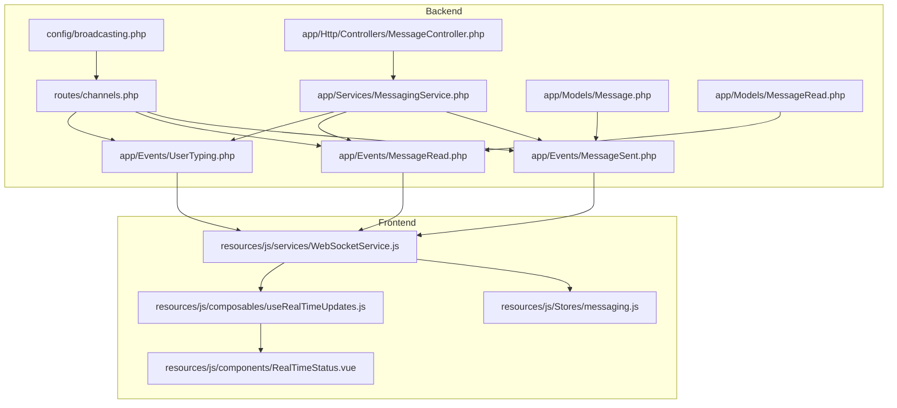
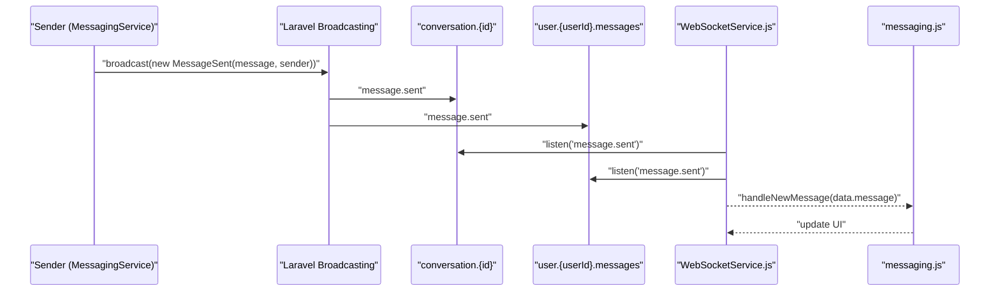
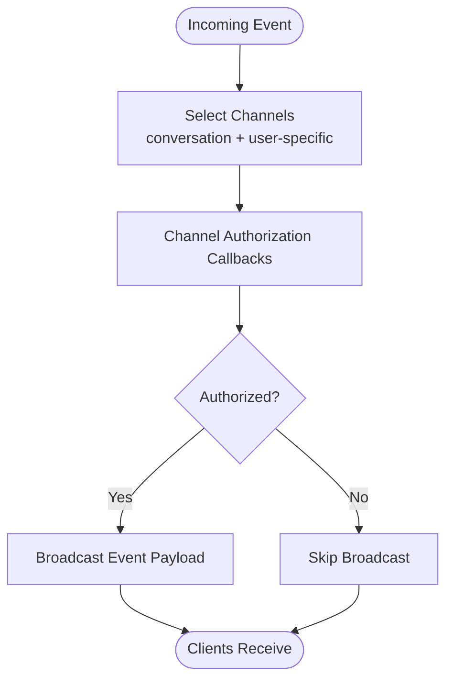
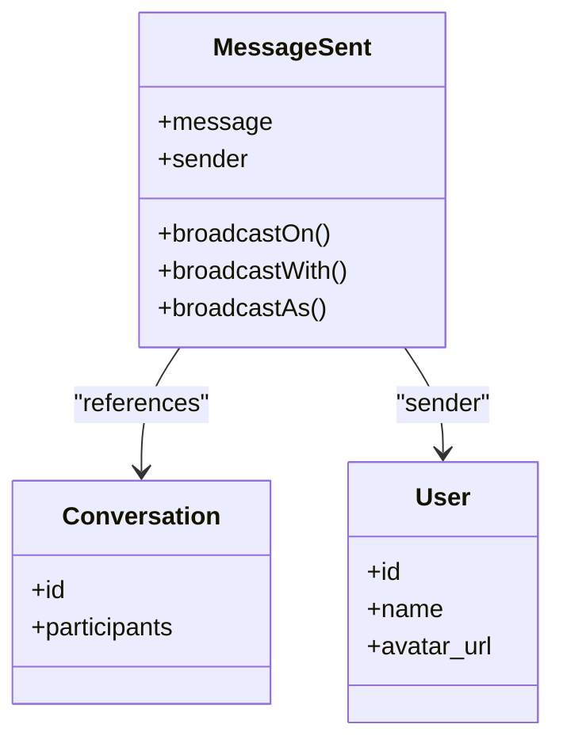
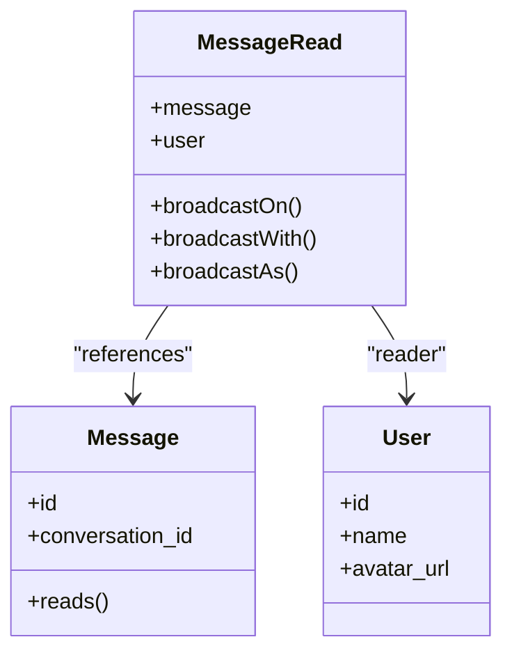
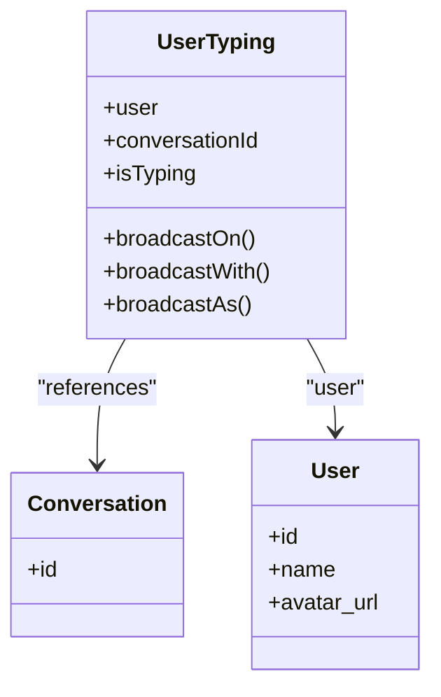
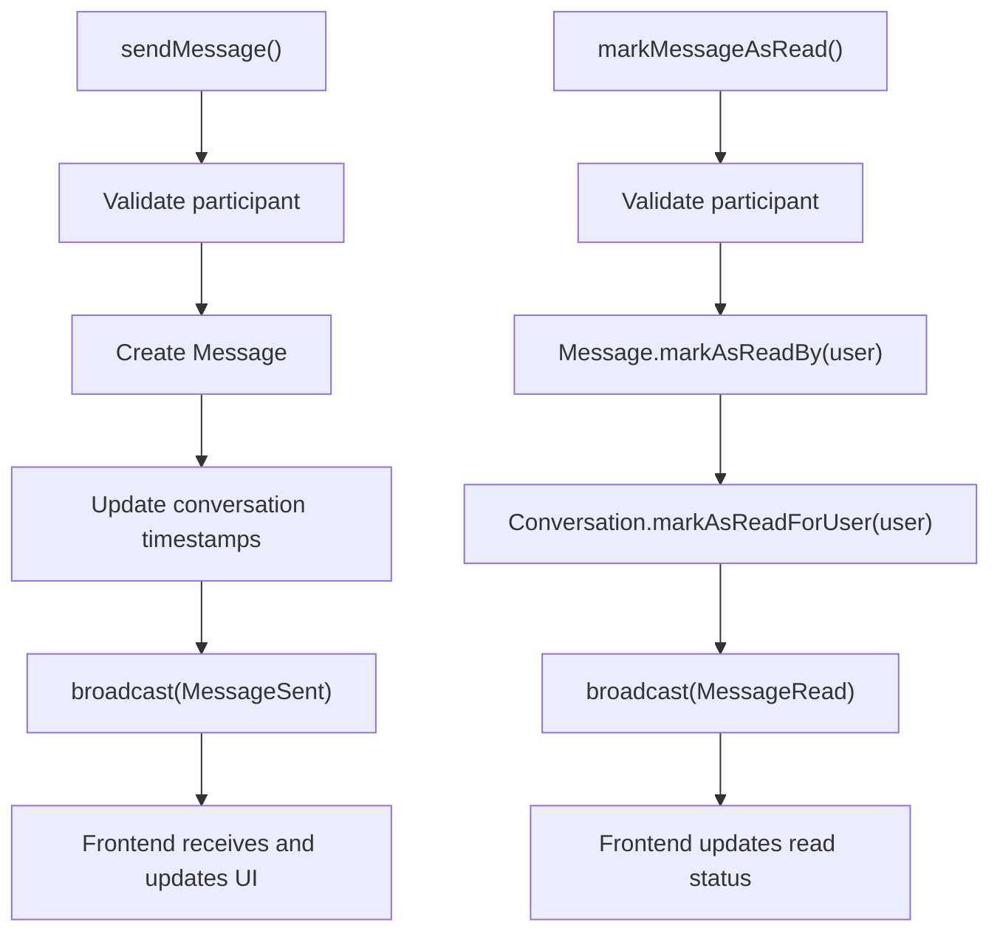
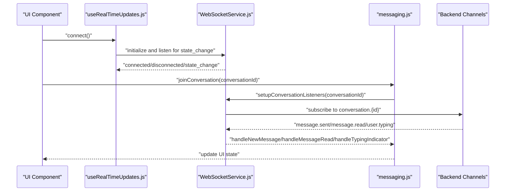
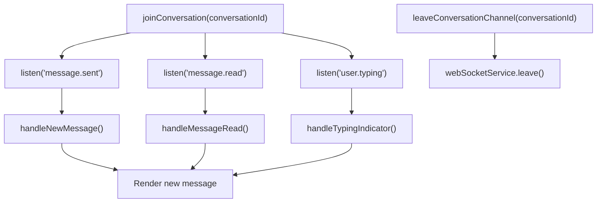
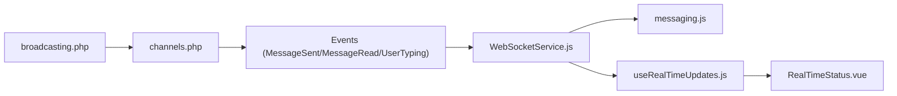

# Real-Time Features

<cite>
**Referenced Files in This Document**
- [broadcasting.php](file://config/broadcasting.php)
- [channels.php](file://routes/channels.php)
- [MessageSent.php](file://app/Events/MessageSent.php)
- [MessageRead.php](file://app/Events/MessageRead.php)
- [UserTyping.php](file://app/Events/UserTyping.php)
- [MessagingService.php](file://app/Services/MessagingService.php)
- [Message.php](file://app/Models/Message.php)
- [MessageRead.php](file://app/Models/MessageRead.php)
- [MessageController.php](file://app/Http/Controllers/MessageController.php)
- [WebSocketService.js](file://resources/js/services/WebSocketService.js)
- [useRealTimeUpdates.js](file://resources/js/composables/useRealTimeUpdates.js)
- [messaging.js](file://resources/js/Stores/messaging.js)
- [RealTimeStatus.vue](file://resources/js/components/RealTimeStatus.vue)
- [task-10-communication-messaging-recap.md](file://docs/task-10-communication-messaging-recap.md)
</cite>

## Table of Contents
1. [Introduction](#introduction)
2. [Project Structure](#project-structure)
3. [Core Components](#core-components)
4. [Architecture Overview](#architecture-overview)
5. [Detailed Component Analysis](#detailed-component-analysis)
6. [Dependency Analysis](#dependency-analysis)
7. [Performance Considerations](#performance-considerations)
8. [Troubleshooting Guide](#troubleshooting-guide)
9. [Conclusion](#conclusion)
10. [Appendices](#appendices)

## Introduction
This document explains the real-time messaging features implemented in the platform, focusing on live message delivery, read receipts, typing indicators, and WebSocket-driven event broadcasting. It covers the backend Laravel event broadcasting stack, the frontend WebSocket service and composables, and the client-side synchronization patterns used to keep the user interface responsive and up to date. Practical implementation examples are included to guide developers in adding real-time capabilities, handling connection states, and managing event subscriptions.

## Project Structure
The real-time messaging system spans backend and frontend layers:
- Backend: Event broadcasting via Laravel’s broadcasting layer, authorization channels, and event classes for message sending, read receipts, and typing indicators.
- Frontend: A WebSocket service wrapper around Echo/Pusher-compatible clients, Vue composables for connection lifecycle and subscriptions, and stores for synchronized state.

**Diagram sources**
- [broadcasting.php:1-72](file://config/broadcasting.php#L1-L72)
- [channels.php:131-146](file://routes/channels.php#L131-L146)
- [MessageSent.php:14-91](file://app/Events/MessageSent.php#L14-L91)
- [MessageRead.php:13-67](file://app/Events/MessageRead.php#L13-L67)
- [UserTyping.php:1-200](file://app/Events/UserTyping.php)
- [MessagingService.php:98-200](file://app/Services/MessagingService.php#L98-L200)
- [Message.php:108-142](file://app/Models/Message.php#L108-L142)
- [MessageRead.php:36-51](file://app/Models/MessageRead.php#L36-L51)
- [MessageController.php:212-229](file://app/Http/Controllers/MessageController.php#L212-L229)
- [WebSocketService.js:348-427](file://resources/js/services/WebSocketService.js#L348-L427)
- [useRealTimeUpdates.js:1-200](file://resources/js/composables/useRealTimeUpdates.js#L1-L200)
- [messaging.js:380-481](file://resources/js/Stores/messaging.js#L380-L481)
- [RealTimeStatus.vue:1-126](file://resources/js/components/RealTimeStatus.vue#L1-L126)

**Section sources**
- [broadcasting.php:1-72](file://config/broadcasting.php#L1-L72)
- [channels.php:131-146](file://routes/channels.php#L131-L146)
- [MessageSent.php:14-91](file://app/Events/MessageSent.php#L14-L91)
- [MessageRead.php:13-67](file://app/Events/MessageRead.php#L13-L67)
- [UserTyping.php:1-200](file://app/Events/UserTyping.php)
- [MessagingService.php:98-200](file://app/Services/MessagingService.php#L98-L200)
- [Message.php:108-142](file://app/Models/Message.php#L108-L142)
- [MessageRead.php:36-51](file://app/Models/MessageRead.php#L36-L51)
- [MessageController.php:212-229](file://app/Http/Controllers/MessageController.php#L212-L229)
- [WebSocketService.js:348-427](file://resources/js/services/WebSocketService.js#L348-L427)
- [useRealTimeUpdates.js:1-200](file://resources/js/composables/useRealTimeUpdates.js#L1-L200)
- [messaging.js:380-481](file://resources/js/Stores/messaging.js#L380-L481)
- [RealTimeStatus.vue:1-126](file://resources/js/components/RealTimeStatus.vue#L1-L126)

## Core Components
- Backend broadcasting configuration and channels:
  - Default driver selection and connection options.
  - Channel authorization for conversations, user-specific message channels, and presence channels.
- Event classes:
  - MessageSent: broadcasts new messages to conversation and recipient channels.
  - MessageRead: broadcasts read receipts to the conversation.
  - UserTyping: broadcasts typing indicators to the conversation.
- Service layer:
  - MessagingService orchestrates message creation, read receipts, and typing indicators, and triggers broadcasts.
- Models:
  - Message and MessageRead track read status and relationships.
- Frontend WebSocket service:
  - Provides typed listeners for message.sent, message.read, and user.typing on conversation channels.
  - Offers connection lifecycle hooks and channel statistics.
- Vue composables and store:
  - useRealTimeUpdates manages connection state and subscriptions.
  - messaging store handles conversation listeners, typing indicators, and UI updates.

**Section sources**
- [broadcasting.php:18-72](file://config/broadcasting.php#L18-L72)
- [channels.php:131-146](file://routes/channels.php#L131-L146)
- [MessageSent.php:36-91](file://app/Events/MessageSent.php#L36-L91)
- [MessageRead.php:35-67](file://app/Events/MessageRead.php#L35-L67)
- [UserTyping.php:1-200](file://app/Events/UserTyping.php)
- [MessagingService.php:98-200](file://app/Services/MessagingService.php#L98-L200)
- [Message.php:108-142](file://app/Models/Message.php#L108-L142)
- [MessageRead.php:36-51](file://app/Models/MessageRead.php#L36-L51)
- [WebSocketService.js:348-427](file://resources/js/services/WebSocketService.js#L348-L427)
- [useRealTimeUpdates.js:1-200](file://resources/js/composables/useRealTimeUpdates.js#L1-L200)
- [messaging.js:380-481](file://resources/js/Stores/messaging.js#L380-L481)

## Architecture Overview
The real-time messaging pipeline integrates Laravel broadcasting with a Pusher-compatible WebSocket client on the frontend. Events are authorized per-channel and broadcast to subscribed clients, who update UI state reactively.

**Diagram sources**
- [MessageSent.php:36-91](file://app/Events/MessageSent.php#L36-L91)
- [channels.php:131-146](file://routes/channels.php#L131-L146)
- [MessagingService.php:122-127](file://app/Services/MessagingService.php#L122-L127)
- [WebSocketService.js:348-427](file://resources/js/services/WebSocketService.js#L348-L427)
- [messaging.js:380-481](file://resources/js/Stores/messaging.js#L380-L481)

## Detailed Component Analysis

### Backend Broadcasting Configuration and Channels
- Default driver and connection options are configured for pusher, ably, redis, log, and null drivers.
- Authorization channels:
  - conversation.{conversationId}: participant-only access.
  - user.{userId}.messages: personal message channel for each user.
  - Presence channels for chats and other contexts ensure secure, authorized subscriptions.

**Diagram sources**
- [broadcasting.php:18-72](file://config/broadcasting.php#L18-L72)
- [channels.php:131-146](file://routes/channels.php#L131-L146)

**Section sources**
- [broadcasting.php:18-72](file://config/broadcasting.php#L18-L72)
- [channels.php:131-146](file://routes/channels.php#L131-L146)

### MessageSent Event
- Broadcasts to:
  - Private channel conversation.{conversationId}
  - Private channel user.{recipientId}.messages for each non-sender participant
- Payload includes message metadata and sender identity.

**Diagram sources**
- [MessageSent.php:14-91](file://app/Events/MessageSent.php#L14-L91)

**Section sources**
- [MessageSent.php:36-91](file://app/Events/MessageSent.php#L36-L91)

### MessageRead Event
- Broadcasts read receipts to conversation.{conversationId}.
- Payload includes message_id, conversation_id, user who read, and read_at timestamp.

**Diagram sources**
- [MessageRead.php:13-67](file://app/Events/MessageRead.php#L13-L67)

**Section sources**
- [MessageRead.php:35-67](file://app/Events/MessageRead.php#L35-L67)

### UserTyping Event
- Broadcasts typing indicators to conversation.{conversationId}.
- Payload includes user, conversation_id, and is_typing flag.

**Diagram sources**
- [UserTyping.php:1-200](file://app/Events/UserTyping.php)

**Section sources**
- [UserTyping.php:1-200](file://app/Events/UserTyping.php)

### MessagingService Orchestration
- sendMessage validates participation, creates the message, updates conversation timestamps, and broadcasts MessageSent.
- markMessageAsRead validates participation, marks read via Message->markAsReadBy, updates participant last-read, and broadcasts MessageRead.
- sendTypingIndicator validates participation and broadcasts UserTyping.

**Diagram sources**
- [MessagingService.php:98-200](file://app/Services/MessagingService.php#L98-L200)
- [Message.php:119-142](file://app/Models/Message.php#L119-L142)
- [MessageRead.php:36-51](file://app/Models/MessageRead.php#L36-L51)

**Section sources**
- [MessagingService.php:98-200](file://app/Services/MessagingService.php#L98-L200)
- [Message.php:119-142](file://app/Models/Message.php#L119-L142)
- [MessageRead.php:36-51](file://app/Models/MessageRead.php#L36-L51)

### Frontend WebSocket Service and Composables
- WebSocketService:
  - Provides listeners for message.sent, message.read, and user.typing on conversation channels.
  - Offers helpers to join/leave channels and retrieve channel statistics.
- useRealTimeUpdates:
  - Manages connection state, reconnect attempts, and subscription lifecycles.
  - Exposes helpers to listen for timeline, notifications, and other public channels.
- messaging store:
  - Subscribes to conversation channels on join.
  - Handles incoming message.sent, message.read, and user.typing events.
  - Updates typing indicators and conversation lists.

**Diagram sources**
- [WebSocketService.js:348-427](file://resources/js/services/WebSocketService.js#L348-L427)
- [useRealTimeUpdates.js:1-200](file://resources/js/composables/useRealTimeUpdates.js#L1-L200)
- [messaging.js:380-481](file://resources/js/Stores/messaging.js#L380-L481)
- [channels.php:131-146](file://routes/channels.php#L131-L146)

**Section sources**
- [WebSocketService.js:348-427](file://resources/js/services/WebSocketService.js#L348-L427)
- [useRealTimeUpdates.js:1-200](file://resources/js/composables/useRealTimeUpdates.js#L1-L200)
- [messaging.js:380-481](file://resources/js/Stores/messaging.js#L380-L481)
- [channels.php:131-146](file://routes/channels.php#L131-L146)

### Client-Side Synchronization Patterns
- Conversation listeners:
  - Subscribe to conversation.{id} for message.sent and message.read.
  - Unsubscribe on route change or component unmount.
- Typing indicators:
  - Maintain a per-conversation list of typing users.
  - Debounce or clear entries when is_typing is false.
- Read receipts:
  - Update message read status locally after receiving message.read.
- Connection status:
  - RealTimeStatus.vue displays current state and reconnect button.

**Diagram sources**
- [messaging.js:380-481](file://resources/js/Stores/messaging.js#L380-L481)
- [WebSocketService.js:348-427](file://resources/js/services/WebSocketService.js#L348-L427)
- [RealTimeStatus.vue:71-126](file://resources/js/components/RealTimeStatus.vue#L71-L126)

**Section sources**
- [messaging.js:380-481](file://resources/js/Stores/messaging.js#L380-L481)
- [WebSocketService.js:348-427](file://resources/js/services/WebSocketService.js#L348-L427)
- [RealTimeStatus.vue:71-126](file://resources/js/components/RealTimeStatus.vue#L71-L126)

## Dependency Analysis
- Backend dependencies:
  - Broadcasting configuration selects the driver and connection options.
  - Channel authorization ensures only authorized users receive events.
  - Event classes define payload shape and broadcast channels.
- Frontend dependencies:
  - WebSocketService depends on Echo/Pusher-compatible transport.
  - useRealTimeUpdates coordinates connection state and subscriptions.
  - messaging store consumes WebSocket events and updates UI state.

**Diagram sources**
- [broadcasting.php:18-72](file://config/broadcasting.php#L18-L72)
- [channels.php:131-146](file://routes/channels.php#L131-L146)
- [MessageSent.php:36-91](file://app/Events/MessageSent.php#L36-L91)
- [MessageRead.php:35-67](file://app/Events/MessageRead.php#L35-L67)
- [UserTyping.php:1-200](file://app/Events/UserTyping.php)
- [WebSocketService.js:348-427](file://resources/js/services/WebSocketService.js#L348-L427)
- [useRealTimeUpdates.js:1-200](file://resources/js/composables/useRealTimeUpdates.js#L1-L200)
- [messaging.js:380-481](file://resources/js/Stores/messaging.js#L380-L481)
- [RealTimeStatus.vue:71-126](file://resources/js/components/RealTimeStatus.vue#L71-L126)

**Section sources**
- [broadcasting.php:18-72](file://config/broadcasting.php#L18-L72)
- [channels.php:131-146](file://routes/channels.php#L131-L146)
- [MessageSent.php:36-91](file://app/Events/MessageSent.php#L36-L91)
- [MessageRead.php:35-67](file://app/Events/MessageRead.php#L35-L67)
- [UserTyping.php:1-200](file://app/Events/UserTyping.php)
- [WebSocketService.js:348-427](file://resources/js/services/WebSocketService.js#L348-L427)
- [useRealTimeUpdates.js:1-200](file://resources/js/composables/useRealTimeUpdates.js#L1-L200)
- [messaging.js:380-481](file://resources/js/Stores/messaging.js#L380-L481)
- [RealTimeStatus.vue:71-126](file://resources/js/components/RealTimeStatus.vue#L71-L126)

## Performance Considerations
- Use pagination for message lists to limit initial payload sizes.
- Debounce typing indicator updates to reduce event frequency.
- Leverage presence channels judiciously; avoid unnecessary subscriptions.
- Batch read receipts when marking an entire conversation as read to minimize broadcast volume.
- Monitor channel statistics to detect over-subscription or stale subscriptions.

[No sources needed since this section provides general guidance]

## Troubleshooting Guide
- Connection state management:
  - useRealTimeUpdates exposes connectionState and reconnectAttempts; use RealTimeStatus.vue to surface status and trigger manual reconnect.
- Subscription cleanup:
  - Always leave channels when navigating away or unmounting components to prevent memory leaks.
- Authorization errors:
  - Ensure channel authorization callbacks return true for authorized users; otherwise, clients will not receive events.
- Event payload mismatches:
  - Verify broadcastWith() shapes match frontend handlers to avoid runtime errors.

**Section sources**
- [useRealTimeUpdates.js:1-200](file://resources/js/composables/useRealTimeUpdates.js#L1-L200)
- [RealTimeStatus.vue:71-126](file://resources/js/components/RealTimeStatus.vue#L71-L126)
- [channels.php:131-146](file://routes/channels.php#L131-L146)
- [WebSocketService.js:348-427](file://resources/js/services/WebSocketService.js#L348-L427)

## Conclusion
The real-time messaging system combines Laravel’s robust broadcasting with a flexible frontend WebSocket service to deliver live message updates, read receipts, and typing indicators. By adhering to channel authorization, maintaining clean subscription lifecycles, and leveraging composables for connection state, teams can build responsive, scalable real-time experiences.

[No sources needed since this section summarizes without analyzing specific files]

## Appendices

### Implementation Examples

- Broadcasting message events:
  - Trigger MessageSent and MessageRead in MessagingService after creating or reading messages.
  - Ensure broadcastOn() includes conversation and user-specific channels.

- Handling connection states:
  - Use useRealTimeUpdates to track connectionState and reconnect when needed.
  - Display status via RealTimeStatus.vue.

- Managing event subscriptions:
  - In messaging store, subscribe to conversation channels on join and unsubscribe on leave.
  - Update typing indicators and read status based on received events.

- Fallback mechanisms:
  - Gracefully degrade UI when WebSocket is unavailable by relying on periodic polling for counts and last messages.
  - Log and surface errors via useRealTimeUpdates and RealTimeStatus.

**Section sources**
- [MessagingService.php:98-200](file://app/Services/MessagingService.php#L98-L200)
- [MessageSent.php:36-91](file://app/Events/MessageSent.php#L36-L91)
- [MessageRead.php:35-67](file://app/Events/MessageRead.php#L35-L67)
- [useRealTimeUpdates.js:1-200](file://resources/js/composables/useRealTimeUpdates.js#L1-L200)
- [RealTimeStatus.vue:71-126](file://resources/js/components/RealTimeStatus.vue#L71-L126)
- [messaging.js:380-481](file://resources/js/Stores/messaging.js#L380-L481)