# Notification System

<cite>
**Referenced Files in This Document**
- [NotificationService.php](file://app/Services/NotificationService.php)
- [NotificationPreference.php](file://app/Models/NotificationPreference.php)
- [NotificationTemplate.php](file://app/Models/NotificationTemplate.php)
- [NotificationLog.php](file://app/Models/NotificationLog.php)
- [MessageSent.php](file://app/Events/MessageSent.php)
- [SendNotificationDigestJob.php](file://app/Jobs/SendNotificationDigestJob.php)
- [SendNotificationDigestsCommand.php](file://app/Console/Commands/SendNotificationDigestsCommand.php)
- [broadcasting.php](file://config/broadcasting.php)
- [User.php](file://app/Models/User.php)
- [ForumTopicSubscription.php](file://app/Models/ForumTopicSubscription.php)
- [2025_07_30_023010_add_notification_preferences_to_users_table.php](file://database/migrations/2025_07_30_023010_add_notification_preferences_to_users_table.php)
</cite>

## Table of Contents
1. [Introduction](#introduction)
2. [Project Structure](#project-structure)
3. [Core Components](#core-components)
4. [Architecture Overview](#architecture-overview)
5. [Detailed Component Analysis](#detailed-component-analysis)
6. [Dependency Analysis](#dependency-analysis)
7. [Performance Considerations](#performance-considerations)
8. [Troubleshooting Guide](#troubleshooting-guide)
9. [Conclusion](#conclusion)
10. [Appendices](#appendices)

## Introduction
This document describes the notification system component of the platform. It covers supported notification types (in-app, email, SMS, push), user preferences and subscription management, real-time delivery via WebSocket broadcasting, notification templates and personalization, segmentation and batching, analytics and delivery tracking, integrations with messaging and forum events, and operational workflows for high-volume, reliable delivery.

## Project Structure
The notification system spans services, models, jobs, events, and configuration:
- Service layer orchestrates sending, preferences, templates, and logging
- Models encapsulate preferences, templates, logs, and user relationships
- Jobs implement scheduled and batched delivery (e.g., digests)
- Events enable real-time broadcasting for messaging
- Configuration defines WebSocket broadcasting drivers

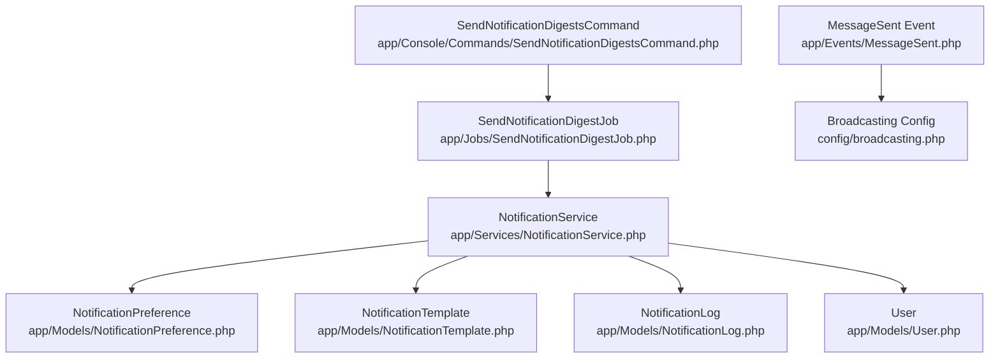

**Diagram sources**
- [NotificationService.php:1-386](file://app/Services/NotificationService.php#L1-L386)
- [NotificationPreference.php:1-139](file://app/Models/NotificationPreference.php#L1-L139)
- [NotificationTemplate.php:1-101](file://app/Models/NotificationTemplate.php#L1-L101)
- [NotificationLog.php:1-104](file://app/Models/NotificationLog.php#L1-L104)
- [User.php:1-818](file://app/Models/User.php#L1-L818)
- [MessageSent.php:1-91](file://app/Events/MessageSent.php#L1-L91)
- [SendNotificationDigestJob.php:1-157](file://app/Jobs/SendNotificationDigestJob.php#L1-L157)
- [SendNotificationDigestsCommand.php:1-63](file://app/Console/Commands/SendNotificationDigestsCommand.php#L1-L63)
- [broadcasting.php:1-72](file://config/broadcasting.php#L1-L72)

**Section sources**
- [NotificationService.php:1-386](file://app/Services/NotificationService.php#L1-L386)
- [NotificationPreference.php:1-139](file://app/Models/NotificationPreference.php#L1-L139)
- [NotificationTemplate.php:1-101](file://app/Models/NotificationTemplate.php#L1-L101)
- [NotificationLog.php:1-104](file://app/Models/NotificationLog.php#L1-L104)
- [User.php:1-818](file://app/Models/User.php#L1-L818)
- [MessageSent.php:1-91](file://app/Events/MessageSent.php#L1-L91)
- [SendNotificationDigestJob.php:1-157](file://app/Jobs/SendNotificationDigestJob.php#L1-L157)
- [SendNotificationDigestsCommand.php:1-63](file://app/Console/Commands/SendNotificationDigestsCommand.php#L1-L63)
- [broadcasting.php:1-72](file://config/broadcasting.php#L1-L72)

## Core Components
- NotificationService: Central orchestration for sending, preferences, templates, logging, scheduling, and cache clearing
- NotificationPreference: Per-user, per-type preferences with tenant scoping and defaults
- NotificationTemplate: Multi-channel templates with variable substitution and activation scoping
- NotificationLog: Delivery attempts tracking with status and timestamps
- MessageSent Event: Real-time broadcasting for messaging updates
- SendNotificationDigestJob: Batched email digest generation and delivery
- Broadcasting configuration: WebSocket driver selection and options

**Section sources**
- [NotificationService.php:1-386](file://app/Services/NotificationService.php#L1-L386)
- [NotificationPreference.php:1-139](file://app/Models/NotificationPreference.php#L1-L139)
- [NotificationTemplate.php:1-101](file://app/Models/NotificationTemplate.php#L1-L101)
- [NotificationLog.php:1-104](file://app/Models/NotificationLog.php#L1-L104)
- [MessageSent.php:1-91](file://app/Events/MessageSent.php#L1-L91)
- [SendNotificationDigestJob.php:1-157](file://app/Jobs/SendNotificationDigestJob.php#L1-L157)
- [broadcasting.php:1-72](file://config/broadcasting.php#L1-L72)

## Architecture Overview
The system supports multi-channel notifications with preference-driven routing, template-based personalization, and robust logging. Real-time updates are delivered via WebSocket broadcasting for messaging. Scheduled and batched deliveries are handled by queued jobs.

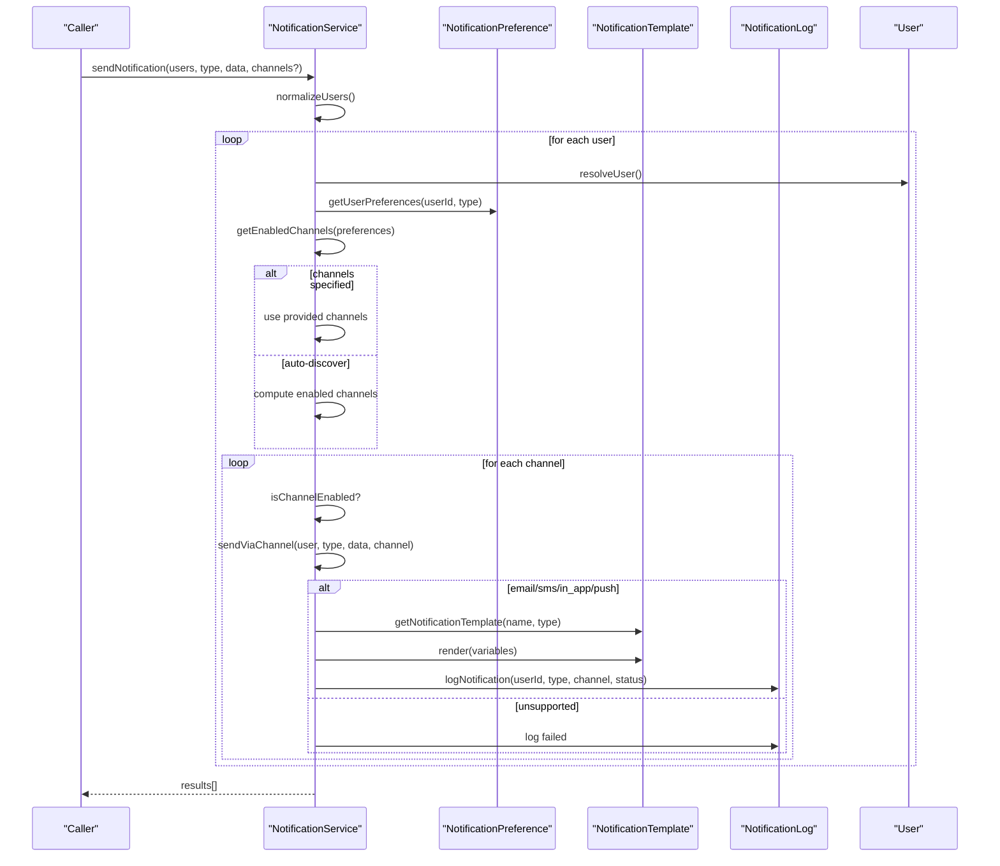

**Diagram sources**
- [NotificationService.php:34-123](file://app/Services/NotificationService.php#L34-L123)
- [NotificationPreference.php:199-249](file://app/Models/NotificationPreference.php#L199-L249)
- [NotificationTemplate.php:58-91](file://app/Models/NotificationTemplate.php#L58-L91)
- [NotificationLog.php:61-102](file://app/Models/NotificationLog.php#L61-L102)

## Detailed Component Analysis

### NotificationService
Responsibilities:
- Single and bulk notification dispatch
- Channel selection based on user preferences
- Template resolution and rendering
- Logging of delivery attempts
- Preference caching and cache invalidation
- Scheduling future notifications
- In-app notification creation and optional real-time broadcasting hooks

Key behaviors:
- sendNotification/sendBulkNotifications accept user identifiers or models, notification type, and optional channels
- sendViaChannel delegates to channel-specific handlers and records outcomes
- Templates are resolved from NotificationTemplate with tenant-aware scoping and caching
- Delivery attempts recorded in NotificationLog with status and timestamps

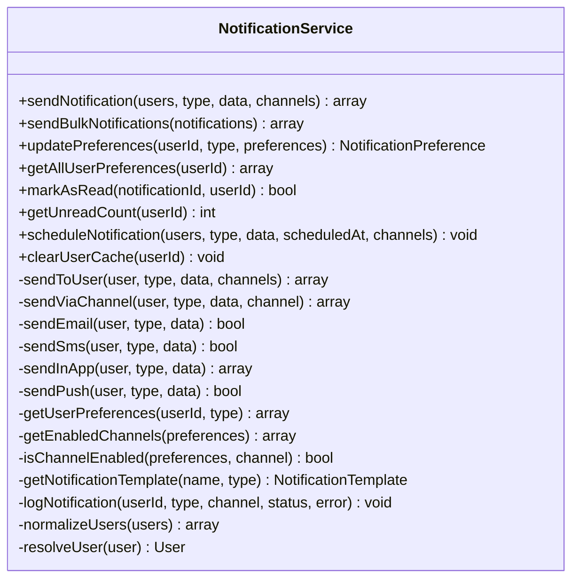

**Diagram sources**
- [NotificationService.php:21-386](file://app/Services/NotificationService.php#L21-L386)

**Section sources**
- [NotificationService.php:21-386](file://app/Services/NotificationService.php#L21-L386)

### NotificationPreference
Responsibilities:
- Store per-user, per-type preference flags for channels
- Tenant scoping for multi-tenant isolation
- Default preference sets for built-in notification types
- Aggregation of user preferences across all types

Key behaviors:
- Global scope applies tenant filtering when multi-tenancy is enabled
- Defaults include email, SMS, in-app, and push flags for several types
- Helper method merges persisted preferences with defaults for a complete profile

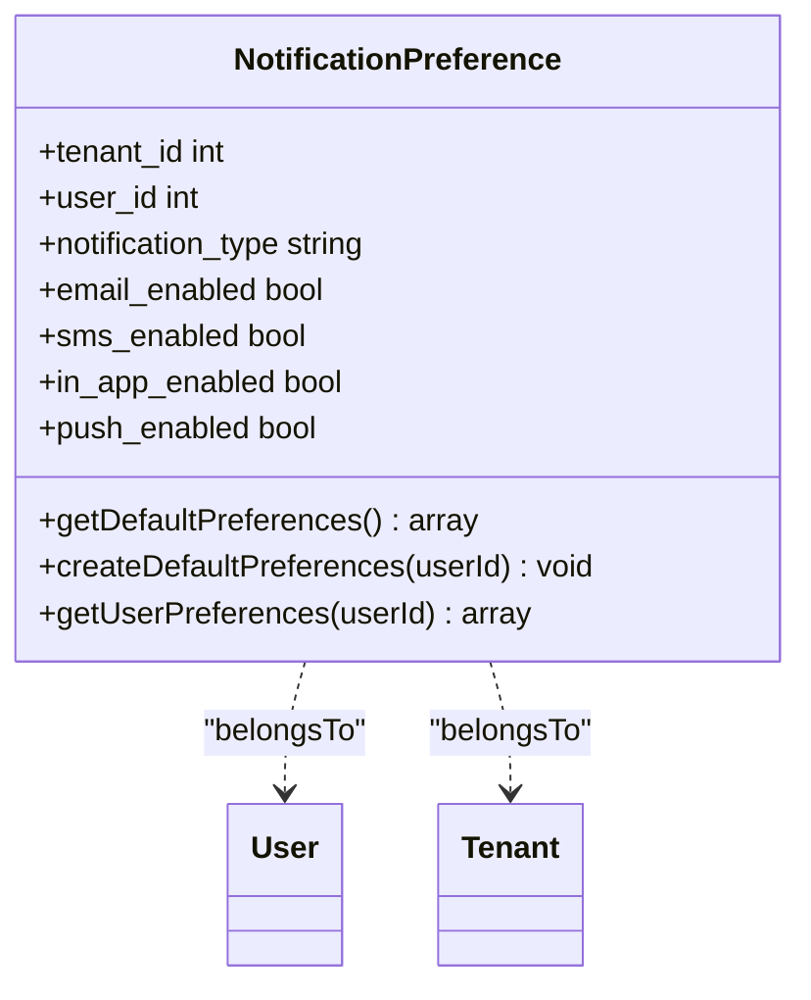

**Diagram sources**
- [NotificationPreference.php:9-139](file://app/Models/NotificationPreference.php#L9-L139)

**Section sources**
- [NotificationPreference.php:9-139](file://app/Models/NotificationPreference.php#L9-L139)

### NotificationTemplate
Responsibilities:
- Store multi-channel templates with subject/content and variable placeholders
- Activation scoping and tenant scoping
- Variable substitution during render

Key behaviors:
- render replaces placeholders in both subject and content
- Scope filters for active templates and type/tenant
- Helper method to fetch a named template by type

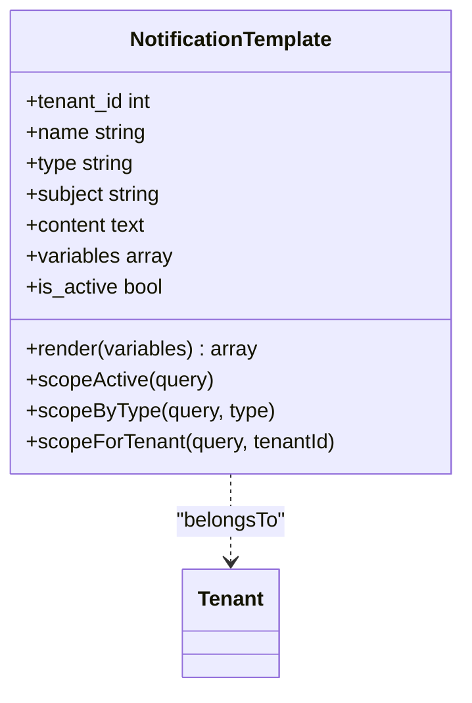

**Diagram sources**
- [NotificationTemplate.php:9-101](file://app/Models/NotificationTemplate.php#L9-L101)

**Section sources**
- [NotificationTemplate.php:9-101](file://app/Models/NotificationTemplate.php#L9-L101)

### NotificationLog
Responsibilities:
- Track delivery attempts per channel with status and timestamps
- Tenant scoping for multi-tenant isolation
- Helpers to mark sent/failed and scope by status

Key behaviors:
- Records sent_at on successful delivery
- Stores error messages on failures
- Provides scopes for sent/failed/pending

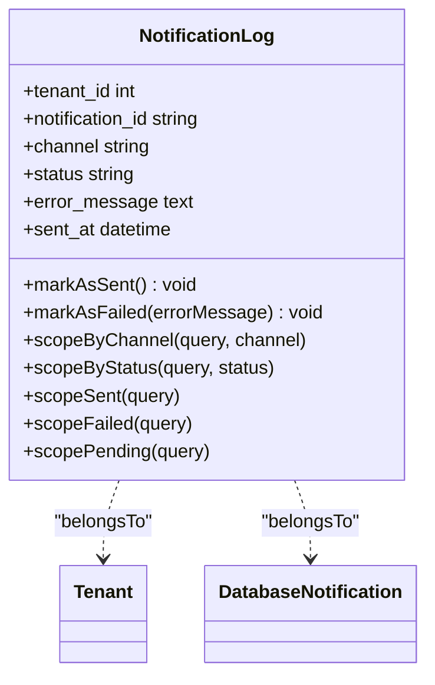

**Diagram sources**
- [NotificationLog.php:9-104](file://app/Models/NotificationLog.php#L9-L104)

**Section sources**
- [NotificationLog.php:9-104](file://app/Models/NotificationLog.php#L9-L104)

### Real-time Delivery via WebSocket (Messaging)
The messaging subsystem emits a broadcastable event that pushes updates to WebSocket clients. Channels include:
- Private channel per conversation
- Private channels per participant for direct message updates

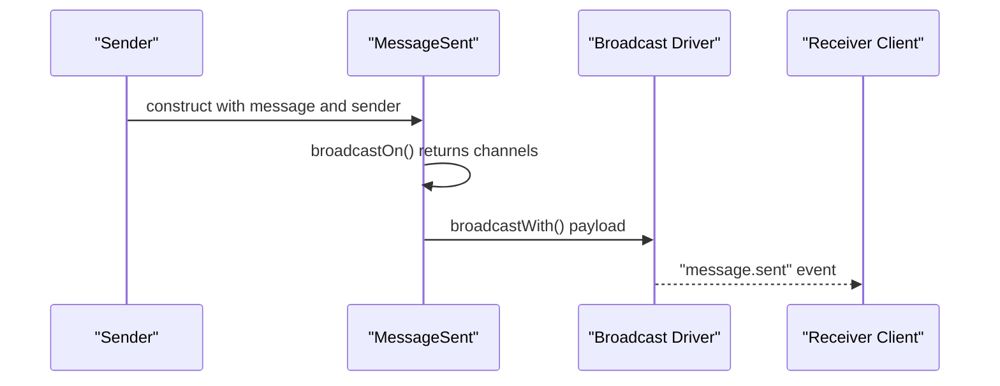

**Diagram sources**
- [MessageSent.php:14-91](file://app/Events/MessageSent.php#L14-L91)
- [broadcasting.php:31-69](file://config/broadcasting.php#L31-L69)

**Section sources**
- [MessageSent.php:14-91](file://app/Events/MessageSent.php#L14-L91)
- [broadcasting.php:1-72](file://config/broadcasting.php#L1-L72)

### Digest Delivery Workflow
Digest emails are generated and sent via a queued job. Users can subscribe to daily or weekly digests based on preferences stored in the user record.

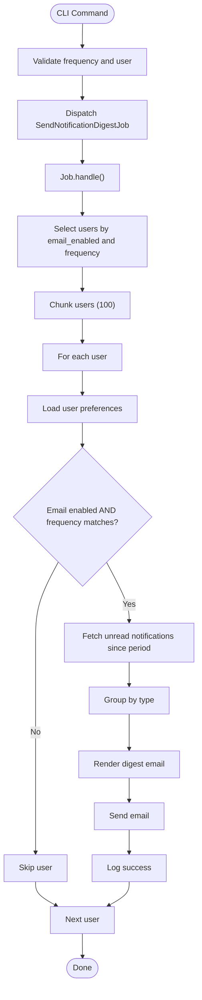

**Diagram sources**
- [SendNotificationDigestsCommand.php:8-63](file://app/Console/Commands/SendNotificationDigestsCommand.php#L8-L63)
- [SendNotificationDigestJob.php:15-157](file://app/Jobs/SendNotificationDigestJob.php#L15-L157)

**Section sources**
- [SendNotificationDigestsCommand.php:1-63](file://app/Console/Commands/SendNotificationDigestsCommand.php#L1-L63)
- [SendNotificationDigestJob.php:1-157](file://app/Jobs/SendNotificationDigestJob.php#L1-L157)

### User Preferences and Subscription Management
- Per-user, per-type preferences are stored in NotificationPreference with tenant scoping
- Defaults are applied for built-in types
- Preferences can be updated programmatically or via UI
- A JSON column stores user-level preferences in the users table for quick access

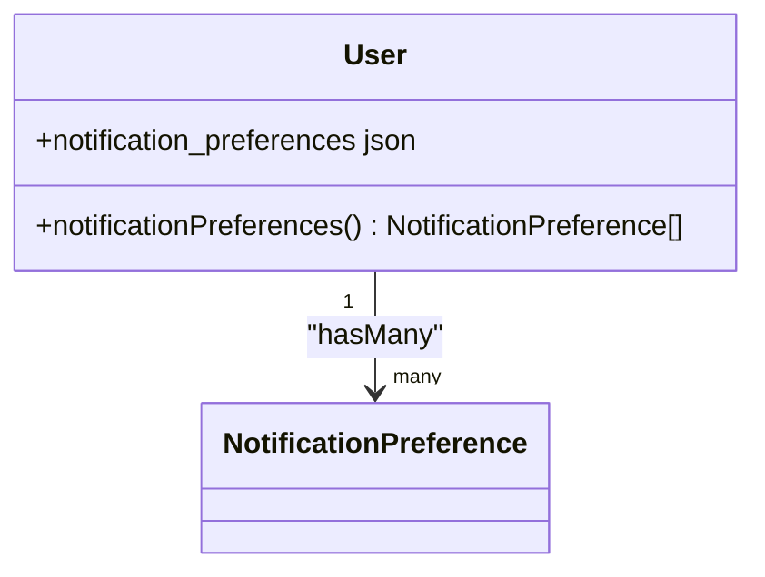

**Diagram sources**
- [User.php:149-152](file://app/Models/User.php#L149-L152)
- [NotificationPreference.php:54-62](file://app/Models/NotificationPreference.php#L54-L62)

**Section sources**
- [NotificationPreference.php:1-139](file://app/Models/NotificationPreference.php#L1-L139)
- [User.php:1-818](file://app/Models/User.php#L1-L818)
- [2025_07_30_023010_add_notification_preferences_to_users_table.php:1-28](file://database/migrations/2025_07_30_023010_add_notification_preferences_to_users_table.php#L1-L28)

### Forum Subscriptions and Email Notifications
Forum topics support email notifications and read/unread tracking. While not part of the generic notification service, it demonstrates subscription-based email delivery.

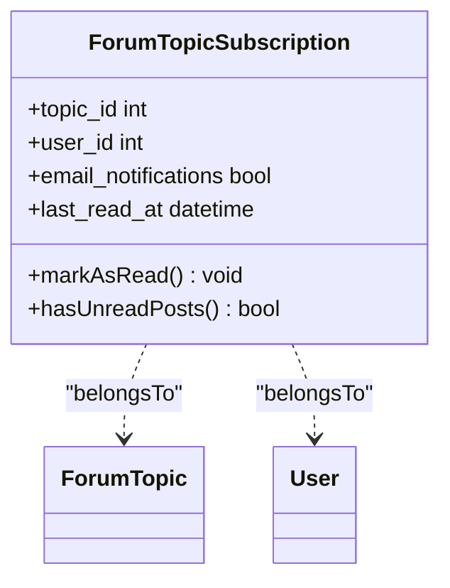

**Diagram sources**
- [ForumTopicSubscription.php:8-49](file://app/Models/ForumTopicSubscription.php#L8-L49)

**Section sources**
- [ForumTopicSubscription.php:1-49](file://app/Models/ForumTopicSubscription.php#L1-L49)

## Dependency Analysis
High-level dependencies among core components:

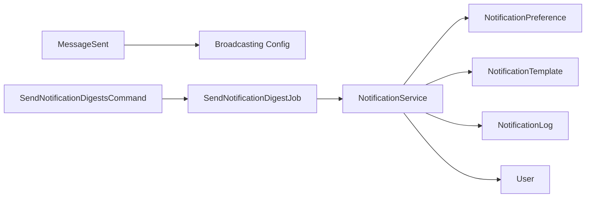

**Diagram sources**
- [NotificationService.php:1-386](file://app/Services/NotificationService.php#L1-L386)
- [NotificationPreference.php:1-139](file://app/Models/NotificationPreference.php#L1-L139)
- [NotificationTemplate.php:1-101](file://app/Models/NotificationTemplate.php#L1-L101)
- [NotificationLog.php:1-104](file://app/Models/NotificationLog.php#L1-L104)
- [User.php:1-818](file://app/Models/User.php#L1-L818)
- [MessageSent.php:1-91](file://app/Events/MessageSent.php#L1-L91)
- [SendNotificationDigestJob.php:1-157](file://app/Jobs/SendNotificationDigestJob.php#L1-L157)
- [SendNotificationDigestsCommand.php:1-63](file://app/Console/Commands/SendNotificationDigestsCommand.php#L1-L63)
- [broadcasting.php:1-72](file://config/broadcasting.php#L1-L72)

**Section sources**
- [NotificationService.php:1-386](file://app/Services/NotificationService.php#L1-L386)
- [NotificationPreference.php:1-139](file://app/Models/NotificationPreference.php#L1-L139)
- [NotificationTemplate.php:1-101](file://app/Models/NotificationTemplate.php#L1-L101)
- [NotificationLog.php:1-104](file://app/Models/NotificationLog.php#L1-L104)
- [User.php:1-818](file://app/Models/User.php#L1-L818)
- [MessageSent.php:1-91](file://app/Events/MessageSent.php#L1-L91)
- [SendNotificationDigestJob.php:1-157](file://app/Jobs/SendNotificationDigestJob.php#L1-L157)
- [SendNotificationDigestsCommand.php:1-63](file://app/Console/Commands/SendNotificationDigestsCommand.php#L1-L63)
- [broadcasting.php:1-72](file://config/broadcasting.php#L1-L72)

## Performance Considerations
- Prefer bulk operations: use sendBulkNotifications for high-volume sends
- Leverage caching: NotificationService caches preferences and templates for 1 hour
- Use chunked processing: SendNotificationDigestJob chunks users to avoid memory pressure
- Queue heavy tasks: Digests and scheduled notifications are queued via jobs
- Minimize N+1 queries: Preload relationships when building notification contexts
- Tenant scoping: Ensure multi-tenant filters are active to avoid cross-tenant scans
- Real-time broadcasting: Use efficient channels and avoid unnecessary broadcasts

[No sources needed since this section provides general guidance]

## Troubleshooting Guide
Common issues and remedies:
- Channel not enabled: Verify NotificationPreference flags for the user and type
- Template missing: Confirm NotificationTemplate exists with correct name/type and is active
- Delivery failures: Inspect NotificationLog entries for status and error messages
- Digest not sent: Check user preferences (email_enabled and frequency) and job execution logs
- Real-time delivery not received: Validate broadcasting driver configuration and client subscriptions

Operational checks:
- Review NotificationLog for recent attempts and statuses
- Confirm broadcasting driver is configured and reachable
- Validate user preferences and defaults
- Ensure tenant scoping is active in multi-tenant environments

**Section sources**
- [NotificationLog.php:61-102](file://app/Models/NotificationLog.php#L61-L102)
- [broadcasting.php:1-72](file://config/broadcasting.php#L1-L72)
- [NotificationPreference.php:33-51](file://app/Models/NotificationPreference.php#L33-L51)
- [SendNotificationDigestJob.php:35-57](file://app/Jobs/SendNotificationDigestJob.php#L35-L57)

## Conclusion
The notification system provides a flexible, tenant-aware foundation for multi-channel notifications with preference-driven routing, template-based personalization, and robust logging. Real-time updates are supported for messaging via WebSocket broadcasting, while batched and scheduled deliveries are handled reliably through queued jobs. Extending to additional channels or integrating with forum and system events follows established patterns in the codebase.

[No sources needed since this section summarizes without analyzing specific files]

## Appendices

### Notification Types and Channels
- In-app: Stored as user notifications; optionally broadcast for real-time updates
- Email: Rendered from NotificationTemplate and sent via configured mail transport
- SMS: Resolved via template and logged; integration points for carrier APIs
- Push: Resolved via template and logged; integration points for push providers

**Section sources**
- [NotificationService.php:128-194](file://app/Services/NotificationService.php#L128-L194)
- [NotificationTemplate.php:74-91](file://app/Models/NotificationTemplate.php#L74-L91)

### Notification Preferences and Opt-out
- Preferences are stored per user and type with tenant scoping
- Defaults are provided for built-in types
- Opt-out is achieved by disabling specific channels or setting lower-frequency digests

**Section sources**
- [NotificationPreference.php:65-105](file://app/Models/NotificationPreference.php#L65-L105)
- [SendNotificationDigestJob.php:76-83](file://app/Jobs/SendNotificationDigestJob.php#L76-L83)

### Real-time Delivery via WebSocket
- Messaging events broadcast to conversation and participant channels
- Broadcasting driver configured in config/broadcasting.php

**Section sources**
- [MessageSent.php:36-52](file://app/Events/MessageSent.php#L36-L52)
- [broadcasting.php:31-69](file://config/broadcasting.php#L31-L69)

### Templates, Personalization, and Segmentation
- Templates support variable substitution and activation scoping
- Segmentation is supported via user preferences and job-based grouping (digests)

**Section sources**
- [NotificationTemplate.php:74-91](file://app/Models/NotificationTemplate.php#L74-L91)
- [SendNotificationDigestJob.php:98-100](file://app/Jobs/SendNotificationDigestJob.php#L98-L100)

### Analytics, Delivery Tracking, and Engagement Metrics
- Delivery tracking via NotificationLog with status and timestamps
- Engagement metrics can be derived from user actions on in-app notifications and email opens/tracks (external integrations)

**Section sources**
- [NotificationLog.php:61-102](file://app/Models/NotificationLog.php#L61-L102)

### Integration with Messaging and Forum Events
- Messaging: Event-driven real-time updates via broadcasting
- Forum: Topic subscriptions with email notifications and read tracking

**Section sources**
- [MessageSent.php:14-91](file://app/Events/MessageSent.php#L14-L91)
- [ForumTopicSubscription.php:1-49](file://app/Models/ForumTopicSubscription.php#L1-L49)

### Examples of Notification Workflows
- Sending a single notification with explicit channels
- Bulk sending across many users and types
- Generating and sending a daily or weekly digest email
- Creating in-app notifications and optionally broadcasting updates

**Section sources**
- [NotificationService.php:34-66](file://app/Services/NotificationService.php#L34-L66)
- [SendNotificationDigestJob.php:35-129](file://app/Jobs/SendNotificationDigestJob.php#L35-L129)

### Performance Optimization and Reliability
- Use bulk APIs and chunked processing
- Cache preferences and templates
- Queue long-running tasks
- Monitor delivery logs and retry failed attempts
- Validate tenant scoping and broadcasting configuration

**Section sources**
- [NotificationService.php:23-24](file://app/Services/NotificationService.php#L23-L24)
- [SendNotificationDigestJob.php:66-71](file://app/Jobs/SendNotificationDigestJob.php#L66-L71)
- [NotificationLog.php:61-102](file://app/Models/NotificationLog.php#L61-L102)