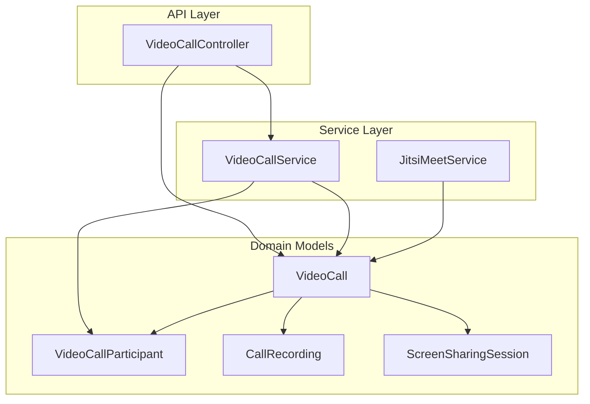
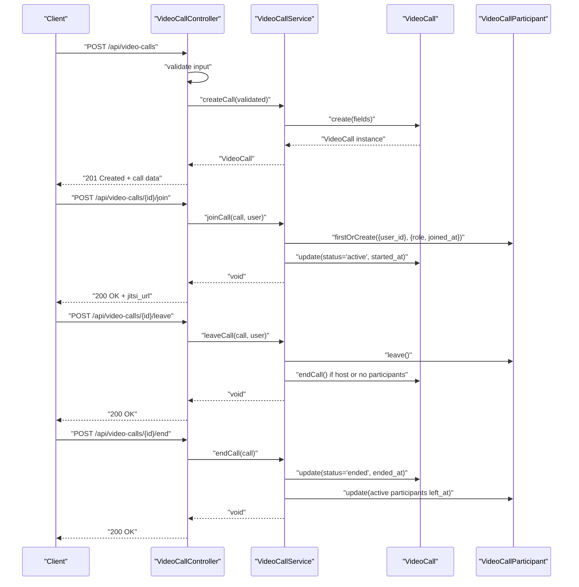
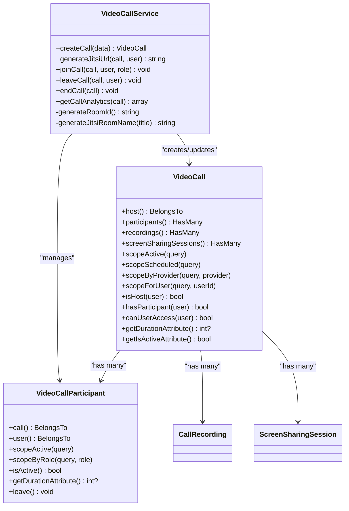
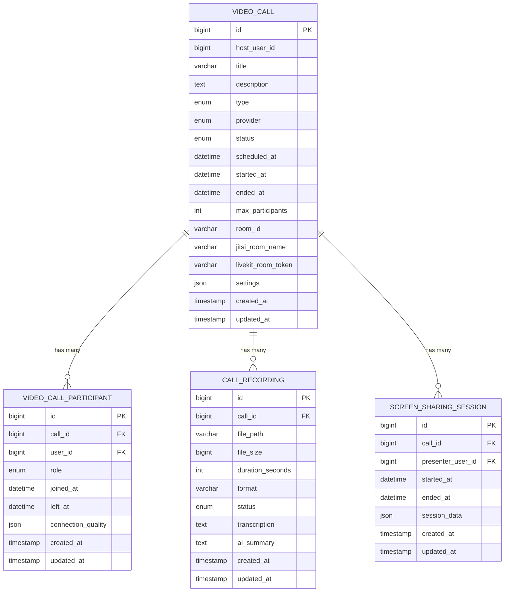
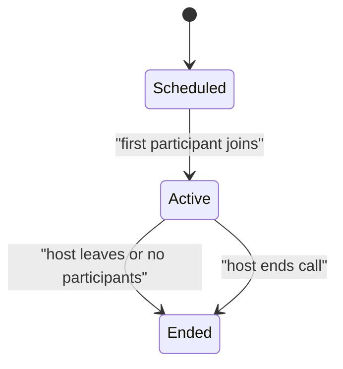
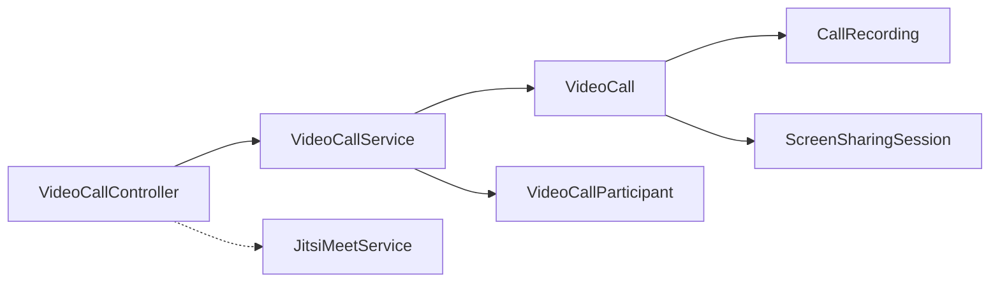

# Call Management

<cite>
**Referenced Files in This Document**
- [VideoCallService.php](file://app/Services/VideoCallService.php)
- [VideoCall.php](file://app/Models/VideoCall.php)
- [VideoCallParticipant.php](file://app/Models/VideoCallParticipant.php)
- [VideoCallController.php](file://app/Http/Controllers/Api/VideoCallController.php)
- [JitsiMeetService.php](file://app/Services/JitsiMeetService.php)
- [CallRecording.php](file://app/Models/CallRecording.php)
- [ScreenSharingSession.php](file://app/Models/ScreenSharingSession.php)
- [video-calling-implementation.md](file://docs/video-calling-implementation.md)
</cite>

## Table of Contents
1. [Introduction](#introduction)
2. [Project Structure](#project-structure)
3. [Core Components](#core-components)
4. [Architecture Overview](#architecture-overview)
5. [Detailed Component Analysis](#detailed-component-analysis)
6. [Dependency Analysis](#dependency-analysis)
7. [Performance Considerations](#performance-considerations)
8. [Troubleshooting Guide](#troubleshooting-guide)
9. [Conclusion](#conclusion)
10. [Appendices](#appendices)

## Introduction
This document describes the video call management system built around the VideoCallService class and related models. It covers call creation, participant management, lifecycle operations, status transitions, Jitsi Meet URL generation, room ID strategies, and analytics collection. It also provides practical examples for creating calls, joining/leaving calls, and ending calls programmatically.

## Project Structure
The call management system centers on:
- Service layer: VideoCallService orchestrates call lifecycle and Jitsi URL generation
- Models: VideoCall, VideoCallParticipant, CallRecording, ScreenSharingSession
- API layer: VideoCallController exposes endpoints for CRUD, join/leave/end, and analytics
- Supporting service: JitsiMeetService for event-based Jitsi integration (separate from the primary call system)

**Diagram sources**
- [VideoCallController.php:12-276](file://app/Http/Controllers/Api/VideoCallController.php#L12-L276)
- [VideoCallService.php:9-112](file://app/Services/VideoCallService.php#L9-L112)
- [VideoCall.php:10-126](file://app/Models/VideoCall.php#L10-L126)
- [VideoCallParticipant.php:8-66](file://app/Models/VideoCallParticipant.php#L8-L66)
- [CallRecording.php:8-94](file://app/Models/CallRecording.php#L8-L94)
- [ScreenSharingSession.php:8-65](file://app/Models/ScreenSharingSession.php#L8-L65)
- [JitsiMeetService.php:8-345](file://app/Services/JitsiMeetService.php#L8-L345)

**Section sources**
- [VideoCallController.php:12-276](file://app/Http/Controllers/Api/VideoCallController.php#L12-L276)
- [VideoCallService.php:9-112](file://app/Services/VideoCallService.php#L9-L112)
- [VideoCall.php:10-126](file://app/Models/VideoCall.php#L10-L126)
- [VideoCallParticipant.php:8-66](file://app/Models/VideoCallParticipant.php#L8-L66)
- [CallRecording.php:8-94](file://app/Models/CallRecording.php#L8-L94)
- [ScreenSharingSession.php:8-65](file://app/Models/ScreenSharingSession.php#L8-L65)
- [JitsiMeetService.php:8-345](file://app/Services/JitsiMeetService.php#L8-L345)

## Core Components
- VideoCallService: Central orchestration for call creation, participant join/leave/end, Jitsi URL generation, room ID and room name generation, and analytics aggregation.
- VideoCall: Eloquent model representing a call with fields host_user_id, title, description, type, provider, scheduled_at, max_participants, room_id, jitsi_room_name, settings, plus scopes and helpers for status and access checks.
- VideoCallParticipant: Eloquent model representing a participant with role, timestamps, and convenience methods for activity and duration.
- VideoCallController: API endpoints for listing, creating, updating, deleting, joining, leaving, ending calls, and retrieving analytics.
- CallRecording and ScreenSharingSession: Related models for recording and screen sharing tracking associated with a call.
- JitsiMeetService: Separate service for event-based Jitsi meeting creation and configuration (not the primary call system).

**Section sources**
- [VideoCallService.php:9-112](file://app/Services/VideoCallService.php#L9-L112)
- [VideoCall.php:10-126](file://app/Models/VideoCall.php#L10-L126)
- [VideoCallParticipant.php:8-66](file://app/Models/VideoCallParticipant.php#L8-L66)
- [VideoCallController.php:12-276](file://app/Http/Controllers/Api/VideoCallController.php#L12-L276)
- [CallRecording.php:8-94](file://app/Models/CallRecording.php#L8-L94)
- [ScreenSharingSession.php:8-65](file://app/Models/ScreenSharingSession.php#L8-L65)
- [JitsiMeetService.php:8-345](file://app/Services/JitsiMeetService.php#L8-L345)

## Architecture Overview
The system follows a layered architecture:
- API layer validates requests and delegates to VideoCallService
- Service layer encapsulates business logic for call lifecycle and Jitsi URL generation
- Models represent domain entities and relationships
- Analytics are aggregated from related models (recordings, screen sharing sessions)

**Diagram sources**
- [VideoCallController.php:56-252](file://app/Http/Controllers/Api/VideoCallController.php#L56-L252)
- [VideoCallService.php:11-82](file://app/Services/VideoCallService.php#L11-L82)
- [VideoCall.php:47-125](file://app/Models/VideoCall.php#L47-L125)
- [VideoCallParticipant.php:45-64](file://app/Models/VideoCallParticipant.php#L45-L64)

## Detailed Component Analysis

### VideoCallService
Responsibilities:
- Create calls with generated room identifiers and Jitsi room names
- Generate Jitsi URLs with user metadata and configuration parameters
- Manage participant join/leave and call lifecycle transitions
- Aggregate analytics from related models

Key methods and behaviors:
- createCall: Validates input, generates room_id and jitsi_room_name, persists call
- generateJitsiUrl: Builds URL with domain, room name, and user params
- joinCall: Adds participant, sets role, updates call status to active on first join
- leaveCall: Marks participant as left; ends call if host leaves or no participants remain
- endCall: Sets status to ended and marks active participants as left
- getCallAnalytics: Returns duration, participant counts, recording counts, and screen sharing sessions
- Internal generators: generateRoomId (UUID-based), generateJitsiRoomName (slug + timestamp)

**Diagram sources**
- [VideoCallService.php:9-112](file://app/Services/VideoCallService.php#L9-L112)
- [VideoCall.php:10-126](file://app/Models/VideoCall.php#L10-L126)
- [VideoCallParticipant.php:8-66](file://app/Models/VideoCallParticipant.php#L8-L66)
- [CallRecording.php:8-94](file://app/Models/CallRecording.php#L8-L94)
- [ScreenSharingSession.php:8-65](file://app/Models/ScreenSharingSession.php#L8-L65)

**Section sources**
- [VideoCallService.php:11-112](file://app/Services/VideoCallService.php#L11-L112)
- [VideoCall.php:47-125](file://app/Models/VideoCall.php#L47-L125)
- [VideoCallParticipant.php:25-64](file://app/Models/VideoCallParticipant.php#L25-L64)

### VideoCall Model
Fields and capabilities:
- Fillable fields include host_user_id, title, description, type, provider, status, scheduled_at, started_at, ended_at, max_participants, room_id, jitsi_room_name, livekit_room_token, settings
- Casts: scheduled_at, started_at, ended_at as datetime; settings as array
- Boot: auto-generates room_id if empty using UUID
- Relationships: host (BelongsTo), participants (HasMany), recordings (HasMany), screenSharingSessions (HasMany), coffeeChatRequest (HasMany)
- Scopes: active, scheduled, byProvider, forUser
- Helpers: isHost, hasParticipant, canUserAccess, duration attribute, isActive attribute

**Diagram sources**
- [VideoCall.php:12-34](file://app/Models/VideoCall.php#L12-L34)
- [VideoCallParticipant.php:10-23](file://app/Models/VideoCallParticipant.php#L10-L23)
- [CallRecording.php:10-19](file://app/Models/CallRecording.php#L10-L19)
- [ScreenSharingSession.php:10-22](file://app/Models/ScreenSharingSession.php#L10-L22)

**Section sources**
- [VideoCall.php:12-45](file://app/Models/VideoCall.php#L12-L45)
- [VideoCall.php:47-125](file://app/Models/VideoCall.php#L47-L125)

### VideoCallParticipant Model
- Tracks user participation with role, joined_at, left_at, and connection_quality
- Provides scopes for active participants and filtering by role
- Helper methods for isActive and duration calculations
- Belongs to VideoCall and User

**Section sources**
- [VideoCallParticipant.php:10-64](file://app/Models/VideoCallParticipant.php#L10-L64)

### Call Analytics and Metrics
- Duration: computed from started_at to ended_at
- Participants count: total participants
- Max concurrent participants: currently approximated by total participant count
- Recordings count: completed recordings
- Screen sharing sessions: total sessions

**Section sources**
- [VideoCallService.php:94-110](file://app/Services/VideoCallService.php#L94-L110)
- [VideoCall.php:112-119](file://app/Models/VideoCall.php#L112-L119)
- [CallRecording.php:26-39](file://app/Models/CallRecording.php#L26-L39)
- [ScreenSharingSession.php:34-47](file://app/Models/ScreenSharingSession.php#L34-L47)

### Jitsi Meet URL Generation
- Base URL sourced from configuration (default: meet.jit.si)
- Room name derived from jitsi_room_name field
- Query parameters include user display name and email, and initial mute settings
- URL generation occurs in VideoCallService and is exposed via VideoCallController.show/join

**Section sources**
- [VideoCallService.php:30-43](file://app/Services/VideoCallService.php#L30-L43)
- [VideoCallController.php:96-109](file://app/Http/Controllers/Api/VideoCallController.php#L96-L109)

### Room ID and Room Name Generation Strategies
- Room ID: UUID-based, prefixed with "room_" and set during creation/boot
- Jitsi room name: slugified title + timestamp, prefixed with "alumni_"
- These strategies ensure uniqueness and meaningful identifiers for Jitsi integration

**Section sources**
- [VideoCallService.php:84-92](file://app/Services/VideoCallService.php#L84-L92)
- [VideoCall.php:36-45](file://app/Models/VideoCall.php#L36-L45)

### Call Status Management and Automatic Transitions
- Initial status: scheduled
- First participant join triggers transition to active and sets started_at
- Host leave or last participant leaving triggers endCall, setting status to ended and ended_at
- Manual end endpoint only available to the host

**Diagram sources**
- [VideoCallService.php:54-71](file://app/Services/VideoCallService.php#L54-L71)
- [VideoCallController.php:175-252](file://app/Http/Controllers/Api/VideoCallController.php#L175-L252)

**Section sources**
- [VideoCallService.php:54-82](file://app/Services/VideoCallService.php#L54-L82)
- [VideoCallController.php:175-252](file://app/Http/Controllers/Api/VideoCallController.php#L175-L252)

### Examples

#### Creating a Call
- Endpoint: POST /api/video-calls
- Required fields: title, type, scheduled_at; optional: description, max_participants, provider, settings
- Host is set from authenticated user
- Returns created call with host loaded

**Section sources**
- [VideoCallController.php:56-77](file://app/Http/Controllers/Api/VideoCallController.php#L56-L77)
- [VideoCallService.php:11-28](file://app/Services/VideoCallService.php#L11-L28)

#### Joining a Call
- Endpoint: POST /api/video-calls/{id}/join
- Access control: must be host or invited participant
- On first join, call status becomes active and started_at is set
- Returns jitsi_url if provider is jitsi or jitsi_videobridge

**Section sources**
- [VideoCallController.php:175-208](file://app/Http/Controllers/Api/VideoCallController.php#L175-L208)
- [VideoCallService.php:45-58](file://app/Services/VideoCallService.php#L45-L58)

#### Leaving a Call
- Endpoint: POST /api/video-calls/{id}/leave
- Access control: must be a participant
- Marks participant as left; ends call if host leaves or no participants remain

**Section sources**
- [VideoCallController.php:213-230](file://app/Http/Controllers/Api/VideoCallController.php#L213-L230)
- [VideoCallService.php:60-71](file://app/Services/VideoCallService.php#L60-L71)

#### Ending a Call Programmatically
- Endpoint: POST /api/video-calls/{id}/end
- Access control: only host can end
- Sets status to ended and ended_at; marks active participants as left

**Section sources**
- [VideoCallController.php:235-252](file://app/Http/Controllers/Api/VideoCallController.php#L235-L252)
- [VideoCallService.php:73-82](file://app/Services/VideoCallService.php#L73-L82)

## Dependency Analysis
- VideoCallController depends on VideoCallService for business logic
- VideoCallService depends on VideoCall and VideoCallParticipant models
- VideoCall aggregates related models (recordings, screen sharing sessions)
- JitsiMeetService is separate and unrelated to the primary call system

**Diagram sources**
- [VideoCallController.php:14-16](file://app/Http/Controllers/Api/VideoCallController.php#L14-L16)
- [VideoCallService.php:9-112](file://app/Services/VideoCallService.php#L9-L112)
- [VideoCall.php:52-65](file://app/Models/VideoCall.php#L52-L65)
- [JitsiMeetService.php:8-345](file://app/Services/JitsiMeetService.php#L8-L345)

**Section sources**
- [VideoCallController.php:14-16](file://app/Http/Controllers/Api/VideoCallController.php#L14-L16)
- [VideoCallService.php:9-112](file://app/Services/VideoCallService.php#L9-L112)
- [VideoCall.php:52-65](file://app/Models/VideoCall.php#L52-L65)
- [JitsiMeetService.php:8-345](file://app/Services/JitsiMeetService.php#L8-L345)

## Performance Considerations
- Room ID generation uses UUID to minimize collision risk and simplify indexing
- Jitsi room name generation uses slug + timestamp to improve readability and uniqueness
- Analytics aggregation uses eager-loaded relations to reduce N+1 queries
- Consider adding database indexes on frequently filtered fields (status, provider, scheduled_at) for improved query performance

## Troubleshooting Guide
Common issues and resolutions:
- Access denied to call: Ensure user is host or participant; controller enforces access checks
- Cannot delete active call: Deletion is blocked while call is active
- Cannot join ended/cancelled call: Join endpoint rejects calls with ended/cancelled status
- Host-only actions: End call endpoint requires host privileges
- Jitsi URL missing: Only returned for jitsi or jitsi_videobridge providers

**Section sources**
- [VideoCallController.php:86-91](file://app/Http/Controllers/Api/VideoCallController.php#L86-L91)
- [VideoCallController.php:146-170](file://app/Http/Controllers/Api/VideoCallController.php#L146-L170)
- [VideoCallController.php:186-191](file://app/Http/Controllers/Api/VideoCallController.php#L186-L191)
- [VideoCallController.php:239-244](file://app/Http/Controllers/Api/VideoCallController.php#L239-L244)
- [VideoCallController.php:96-99](file://app/Http/Controllers/Api/VideoCallController.php#L96-L99)

## Conclusion
The video call management system provides a robust foundation for scheduling, hosting, and managing video calls with integrated Jitsi Meet support. The VideoCallService centralizes lifecycle operations, participant management, and analytics, while the model layer ensures strong relationships and convenient helpers. The documented examples and troubleshooting guidance should enable smooth integration and maintenance of the call system.

## Appendices

### API Endpoints Summary
- GET /api/video-calls: List calls for the authenticated user with pagination and filters
- POST /api/video-calls: Create a new call
- GET /api/video-calls/{id}: Retrieve call details and analytics
- PUT /api/video-calls/{id}: Update call details (host only)
- DELETE /api/video-calls/{id}: Delete call (host only; blocked if active)
- POST /api/video-calls/{id}/join: Join a call
- POST /api/video-calls/{id}/leave: Leave a call
- POST /api/video-calls/{id}/end: End a call (host only)
- GET /api/video-calls/{id}/analytics: Retrieve call analytics

**Section sources**
- [VideoCallController.php:21-51](file://app/Http/Controllers/Api/VideoCallController.php#L21-L51)
- [VideoCallController.php:56-77](file://app/Http/Controllers/Api/VideoCallController.php#L56-L77)
- [VideoCallController.php:82-110](file://app/Http/Controllers/Api/VideoCallController.php#L82-L110)
- [VideoCallController.php:115-141](file://app/Http/Controllers/Api/VideoCallController.php#L115-L141)
- [VideoCallController.php:146-170](file://app/Http/Controllers/Api/VideoCallController.php#L146-L170)
- [VideoCallController.php:175-208](file://app/Http/Controllers/Api/VideoCallController.php#L175-L208)
- [VideoCallController.php:213-230](file://app/Http/Controllers/Api/VideoCallController.php#L213-L230)
- [VideoCallController.php:235-252](file://app/Http/Controllers/Api/VideoCallController.php#L235-L252)
- [VideoCallController.php:257-274](file://app/Http/Controllers/Api/VideoCallController.php#L257-L274)