# Scheduling & Invitations

<cite>
**Referenced Files in This Document**
- [ScheduleCallModal.vue](file://resources/js/components/VideoCall/ScheduleCallModal.vue)
- [VideoCallController.php](file://app/Http/Controllers/Api/VideoCallController.php)
- [VideoCallService.php](file://app/Services/VideoCallService.php)
- [VideoCall.php](file://app/Models/VideoCall.php)
- [VideoCallParticipant.php](file://app/Models/VideoCallParticipant.php)
- [CoffeeChatModal.vue](file://resources/js/components/VideoCall/CoffeeChatModal.vue)
- [CoffeeChatRequestCard.vue](file://resources/js/components/VideoCall/CoffeeChatRequestCard.vue)
- [CoffeeChatController.php](file://app/Http/Controllers/Api/CoffeeChatController.php)
- [CoffeeChatService.php](file://app/Services/CoffeeChatService.php)
- [CoffeeChatRequest.php](file://app/Models/CoffeeChatRequest.php)
- [calendar-implementation-plan.md](file://calendar-implementation-plan.md)
- [detailed-calendar-implementation-plan.md](file://detailed-calendar-implementation-plan.md)
- [CalendarIntegrationService.php](file://app/Services/CalendarIntegrationService.php)
- [CalendarConnection.php](file://app/Models/CalendarConnection.php)
- [CalendarConnectionException.php](file://app/Exceptions/CalendarConnectionException.php)
- [CalendarProviderException.php](file://app/Exceptions/CalendarProviderException.php)
- [CalendarSyncException.php](file://app/Exceptions/CalendarSyncException.php)
- [CalendarInviteMail.php](file://app/Mail/CalendarInviteMail.php)
- [SessionScheduledNotification.php](file://app/Notifications/SessionScheduledNotification.php)
- [VideoCallInterface.vue](file://resources/js/components/VideoCall/VideoCallInterface.vue)
- [Index.vue](file://resources/js/Pages/VideoCall/Index.vue)
</cite>

## Table of Contents
1. [Introduction](#introduction)
2. [Project Structure](#project-structure)
3. [Core Components](#core-components)
4. [Architecture Overview](#architecture-overview)
5. [Detailed Component Analysis](#detailed-component-analysis)
6. [Dependency Analysis](#dependency-analysis)
7. [Performance Considerations](#performance-considerations)
8. [Troubleshooting Guide](#troubleshooting-guide)
9. [Conclusion](#conclusion)

## Introduction
This document describes the video call scheduling and invitation system, focusing on the ScheduleCallModal component for creating new video calls, participant invitations, meeting settings, and related workflows. It also covers coffee chat scheduling, calendar synchronization, conflict detection, reminders, participant capacity management, waiting room functionality, and moderator permissions during scheduling.

## Project Structure
The scheduling system spans Vue frontend components, Laravel controllers/services/models, and supporting infrastructure for calendar integration and notifications.

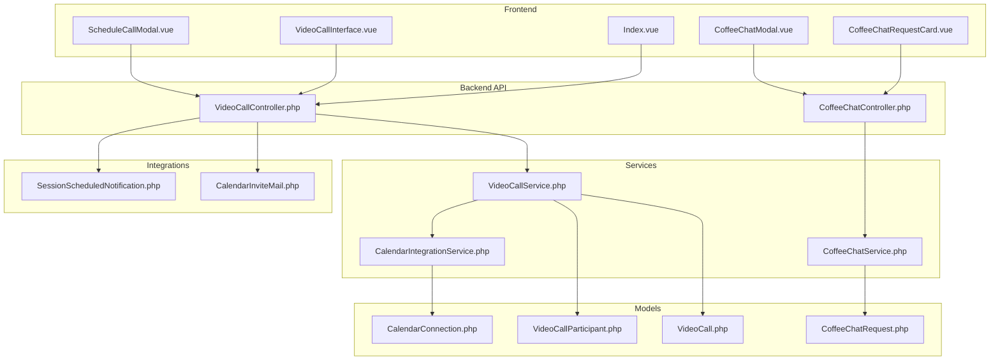

**Diagram sources**
- [ScheduleCallModal.vue:1-236](file://resources/js/components/VideoCall/ScheduleCallModal.vue#L1-L236)
- [VideoCallController.php:1-276](file://app/Http/Controllers/Api/VideoCallController.php#L1-L276)
- [VideoCallService.php:1-112](file://app/Services/VideoCallService.php#L1-L112)
- [VideoCall.php:1-126](file://app/Models/VideoCall.php#L1-L126)
- [VideoCallParticipant.php:1-66](file://app/Models/VideoCallParticipant.php#L1-L66)
- [CoffeeChatModal.vue](file://resources/js/components/VideoCall/CoffeeChatModal.vue)
- [CoffeeChatRequestCard.vue](file://resources/js/components/VideoCall/CoffeeChatRequestCard.vue)
- [CoffeeChatController.php](file://app/Http/Controllers/Api/CoffeeChatController.php)
- [CoffeeChatService.php](file://app/Services/CoffeeChatService.php)
- [CoffeeChatRequest.php](file://app/Models/CoffeeChatRequest.php)
- [CalendarIntegrationService.php](file://app/Services/CalendarIntegrationService.php)
- [CalendarConnection.php](file://app/Models/CalendarConnection.php)
- [CalendarInviteMail.php](file://app/Mail/CalendarInviteMail.php)
- [SessionScheduledNotification.php](file://app/Notifications/SessionScheduledNotification.php)
- [VideoCallInterface.vue](file://resources/js/components/VideoCall/VideoCallInterface.vue)
- [Index.vue](file://resources/js/Pages/VideoCall/Index.vue)

**Section sources**
- [ScheduleCallModal.vue:1-236](file://resources/js/components/VideoCall/ScheduleCallModal.vue#L1-L236)
- [VideoCallController.php:1-276](file://app/Http/Controllers/Api/VideoCallController.php#L1-L276)
- [VideoCallService.php:1-112](file://app/Services/VideoCallService.php#L1-L112)
- [VideoCall.php:1-126](file://app/Models/VideoCall.php#L1-L126)
- [VideoCallParticipant.php:1-66](file://app/Models/VideoCallParticipant.php#L1-L66)
- [CoffeeChatModal.vue](file://resources/js/components/VideoCall/CoffeeChatModal.vue)
- [CoffeeChatRequestCard.vue](file://resources/js/components/VideoCall/CoffeeChatRequestCard.vue)
- [CoffeeChatController.php](file://app/Http/Controllers/Api/CoffeeChatController.php)
- [CoffeeChatService.php](file://app/Services/CoffeeChatService.php)
- [CoffeeChatRequest.php](file://app/Models/CoffeeChatRequest.php)
- [CalendarIntegrationService.php](file://app/Services/CalendarIntegrationService.php)
- [CalendarConnection.php](file://app/Models/CalendarConnection.php)
- [CalendarInviteMail.php](file://app/Mail/CalendarInviteMail.php)
- [SessionScheduledNotification.php](file://app/Notifications/SessionScheduledNotification.php)
- [VideoCallInterface.vue](file://resources/js/components/VideoCall/VideoCallInterface.vue)
- [Index.vue](file://resources/js/Pages/VideoCall/Index.vue)

## Core Components
- ScheduleCallModal: Frontend modal for scheduling video calls with date/time selection, duration, type, agenda, timezone, and reminder preferences.
- VideoCallController: API endpoints for listing, creating, viewing, updating, joining, leaving, ending calls, and retrieving analytics.
- VideoCallService: Business logic for creating calls, generating Jitsi URLs, managing participant joins/leaves/ends, and analytics.
- VideoCall model: Eloquent model with relationships to host, participants, recordings, screen sharing sessions, and coffee chat requests.
- VideoCallParticipant model: Tracks participant roles, join/leave timestamps, and connection quality.
- CoffeeChat components and services: Informal networking scheduling and request management.
- Calendar integration: Planning documents and services for external calendar sync and conflict detection.
- Notifications and emails: Calendar invite emails and session scheduled notifications.

**Section sources**
- [ScheduleCallModal.vue:1-236](file://resources/js/components/VideoCall/ScheduleCallModal.vue#L1-L236)
- [VideoCallController.php:1-276](file://app/Http/Controllers/Api/VideoCallController.php#L1-L276)
- [VideoCallService.php:1-112](file://app/Services/VideoCallService.php#L1-L112)
- [VideoCall.php:1-126](file://app/Models/VideoCall.php#L1-L126)
- [VideoCallParticipant.php:1-66](file://app/Models/VideoCallParticipant.php#L1-L66)
- [CoffeeChatModal.vue](file://resources/js/components/VideoCall/CoffeeChatModal.vue)
- [CoffeeChatRequestCard.vue](file://resources/js/components/VideoCall/CoffeeChatRequestCard.vue)
- [CoffeeChatController.php](file://app/Http/Controllers/Api/CoffeeChatController.php)
- [CoffeeChatService.php](file://app/Services/CoffeeChatService.php)
- [CoffeeChatRequest.php](file://app/Models/CoffeeChatRequest.php)
- [calendar-implementation-plan.md](file://calendar-implementation-plan.md)
- [detailed-calendar-implementation-plan.md](file://detailed-calendar-implementation-plan.md)
- [CalendarIntegrationService.php](file://app/Services/CalendarIntegrationService.php)
- [CalendarConnection.php](file://app/Models/CalendarConnection.php)
- [CalendarInviteMail.php](file://app/Mail/CalendarInviteMail.php)
- [SessionScheduledNotification.php](file://app/Notifications/SessionScheduledNotification.php)

## Architecture Overview
The scheduling system follows a layered architecture:
- Presentation: Vue components (ScheduleCallModal, CoffeeChat components, VideoCallInterface).
- API: Laravel controllers handling request validation, authorization, and response formatting.
- Service Layer: Business logic encapsulated in services (VideoCallService, CoffeeChatService, CalendarIntegrationService).
- Persistence: Eloquent models with relationships and scopes.
- Integrations: Email notifications and calendar invites.

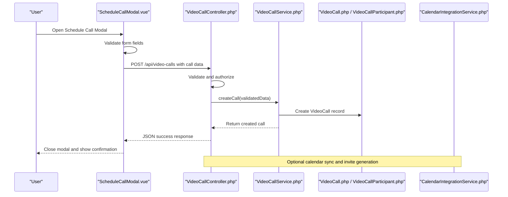

**Diagram sources**
- [ScheduleCallModal.vue:161-236](file://resources/js/components/VideoCall/ScheduleCallModal.vue#L161-L236)
- [VideoCallController.php:56-77](file://app/Http/Controllers/Api/VideoCallController.php#L56-L77)
- [VideoCallService.php:11-28](file://app/Services/VideoCallService.php#L11-L28)
- [VideoCall.php:10-45](file://app/Models/VideoCall.php#L10-L45)
- [VideoCallParticipant.php:8-33](file://app/Models/VideoCallParticipant.php#L8-L33)
- [CalendarIntegrationService.php](file://app/Services/CalendarIntegrationService.php)

**Section sources**
- [VideoCallController.php:1-276](file://app/Http/Controllers/Api/VideoCallController.php#L1-L276)
- [VideoCallService.php:1-112](file://app/Services/VideoCallService.php#L1-L112)
- [VideoCall.php:1-126](file://app/Models/VideoCall.php#L1-L126)
- [VideoCallParticipant.php:1-66](file://app/Models/VideoCallParticipant.php#L1-L66)

## Detailed Component Analysis

### ScheduleCallModal Component
Purpose: Provides a form to schedule video calls with:
- Title, date, time, duration, call type, agenda, timezone
- Optional reminder flag
- Emits submit event with structured data

Key behaviors:
- Enforces minimum date (tomorrow)
- Constructs scheduledAt from date and time
- Emits submit event with participantId/requestId (if present) and form data
- Resets form on close

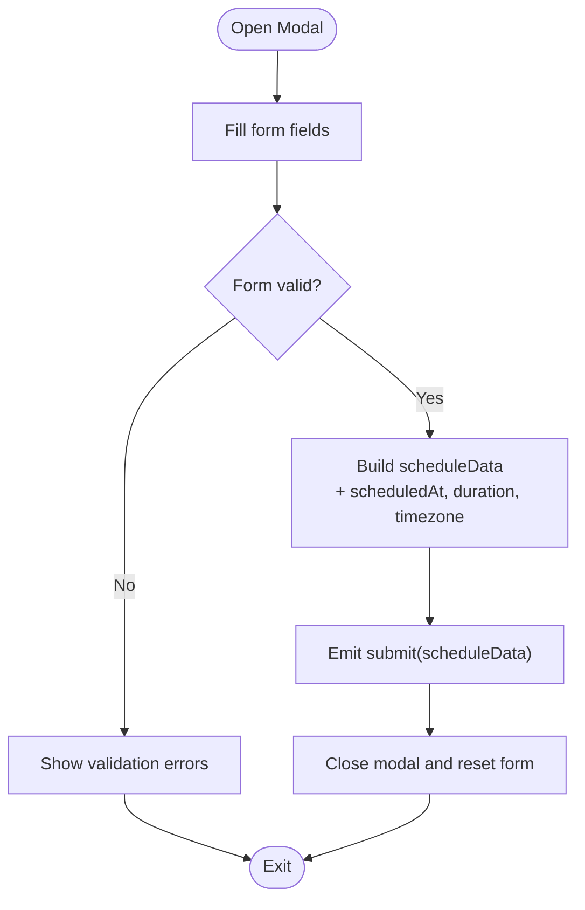

**Diagram sources**
- [ScheduleCallModal.vue:190-236](file://resources/js/components/VideoCall/ScheduleCallModal.vue#L190-L236)

**Section sources**
- [ScheduleCallModal.vue:1-236](file://resources/js/components/VideoCall/ScheduleCallModal.vue#L1-L236)

### Video Call API Endpoints
Endpoints and responsibilities:
- GET /api/video-calls: List calls for current user with filters and pagination
- POST /api/video-calls: Create a new call (hosted by current user)
- GET /api/video-calls/{call}: Retrieve call details, Jitsi URL (if applicable), moderation rights, analytics
- PUT /api/video-calls/{call}: Update call (host only)
- DELETE /api/video-calls/{call}: Delete call (host only, not active)
- POST /api/video-calls/{call}/join: Join a call
- POST /api/video-calls/{call}/leave: Leave a call
- POST /api/video-calls/{call}/end: End a call (host only)
- GET /api/video-calls/{call}/analytics: Retrieve call analytics

Authorization and validation:
- Host checks for updates/deletes/end
- Access checks for viewing and joining
- Validation ensures scheduled_at is in the future and max_participants within bounds

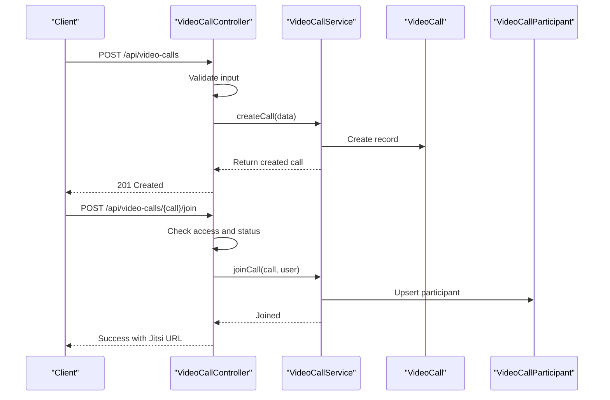

**Diagram sources**
- [VideoCallController.php:56-77](file://app/Http/Controllers/Api/VideoCallController.php#L56-L77)
- [VideoCallController.php:175-208](file://app/Http/Controllers/Api/VideoCallController.php#L175-L208)
- [VideoCallService.php:11-28](file://app/Services/VideoCallService.php#L11-L28)
- [VideoCallService.php:45-58](file://app/Services/VideoCallService.php#L45-L58)

**Section sources**
- [VideoCallController.php:1-276](file://app/Http/Controllers/Api/VideoCallController.php#L1-L276)
- [VideoCallService.php:1-112](file://app/Services/VideoCallService.php#L1-L112)

### VideoCall and VideoCallParticipant Models
Responsibilities:
- VideoCall: Fillable attributes include host, title, description, type, provider, status, scheduling timestamps, participant limits, room identifiers, and settings. Includes scopes for active/scheduled/provider/user filtering and helper methods for host/participant checks and durations.
- VideoCallParticipant: Tracks user participation, role, join/leave timestamps, and connection quality. Provides active participant scope and duration calculation.

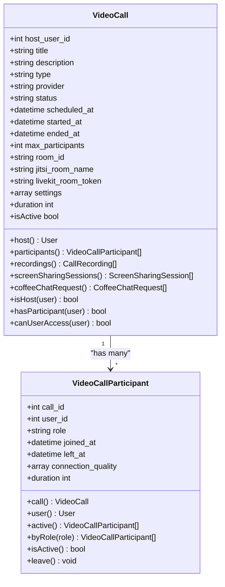

**Diagram sources**
- [VideoCall.php:10-126](file://app/Models/VideoCall.php#L10-L126)
- [VideoCallParticipant.php:8-66](file://app/Models/VideoCallParticipant.php#L8-L66)

**Section sources**
- [VideoCall.php:1-126](file://app/Models/VideoCall.php#L1-L126)
- [VideoCallParticipant.php:1-66](file://app/Models/VideoCallParticipant.php#L1-L66)

### Coffee Chat Scheduling
Coffee chat enables informal networking meetings. The system includes:
- CoffeeChatModal.vue: Modal for initiating coffee chat requests
- CoffeeChatRequestCard.vue: Displays pending or accepted requests
- CoffeeChatController.php: API endpoints for coffee chat requests
- CoffeeChatService.php: Business logic for request lifecycle
- CoffeeChatRequest.php: Eloquent model for requests linked to calls

Workflows:
- Request creation and acceptance/rejection
- Integration with call scheduling (requests can lead to scheduled calls)
- UI components for discovery and management

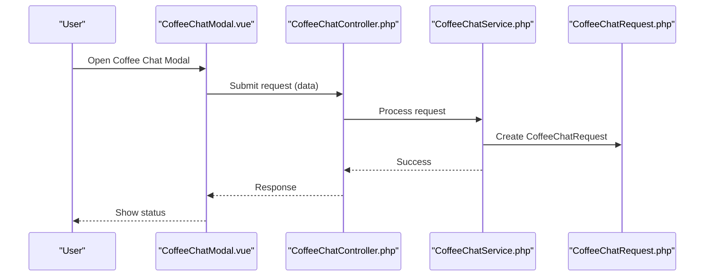

**Diagram sources**
- [CoffeeChatModal.vue](file://resources/js/components/VideoCall/CoffeeChatModal.vue)
- [CoffeeChatRequestCard.vue](file://resources/js/components/VideoCall/CoffeeChatRequestCard.vue)
- [CoffeeChatController.php](file://app/Http/Controllers/Api/CoffeeChatController.php)
- [CoffeeChatService.php](file://app/Services/CoffeeChatService.php)
- [CoffeeChatRequest.php](file://app/Models/CoffeeChatRequest.php)

**Section sources**
- [CoffeeChatModal.vue](file://resources/js/components/VideoCall/CoffeeChatModal.vue)
- [CoffeeChatRequestCard.vue](file://resources/js/components/VideoCall/CoffeeChatRequestCard.vue)
- [CoffeeChatController.php](file://app/Http/Controllers/Api/CoffeeChatController.php)
- [CoffeeChatService.php](file://app/Services/CoffeeChatService.php)
- [CoffeeChatRequest.php](file://app/Models/CoffeeChatRequest.php)

### Calendar Integration and Conflict Detection
Planning documents outline calendar synchronization capabilities:
- calendar-implementation-plan.md
- detailed-calendar-implementation-plan.md

Supporting components:
- CalendarIntegrationService.php: Centralized service for calendar operations
- CalendarConnection.php: Stores user calendar connections
- CalendarConnectionException.php, CalendarProviderException.php, CalendarSyncException.php: Exception types for calendar operations
- CalendarInviteMail.php: Email template for calendar invites
- SessionScheduledNotification.php: Notification for scheduled sessions

Conflict detection and synchronization:
- Use CalendarConnection records to connect user calendars
- Implement conflict checks against existing events
- Generate calendar invites via CalendarInviteMail
- Handle provider-specific exceptions

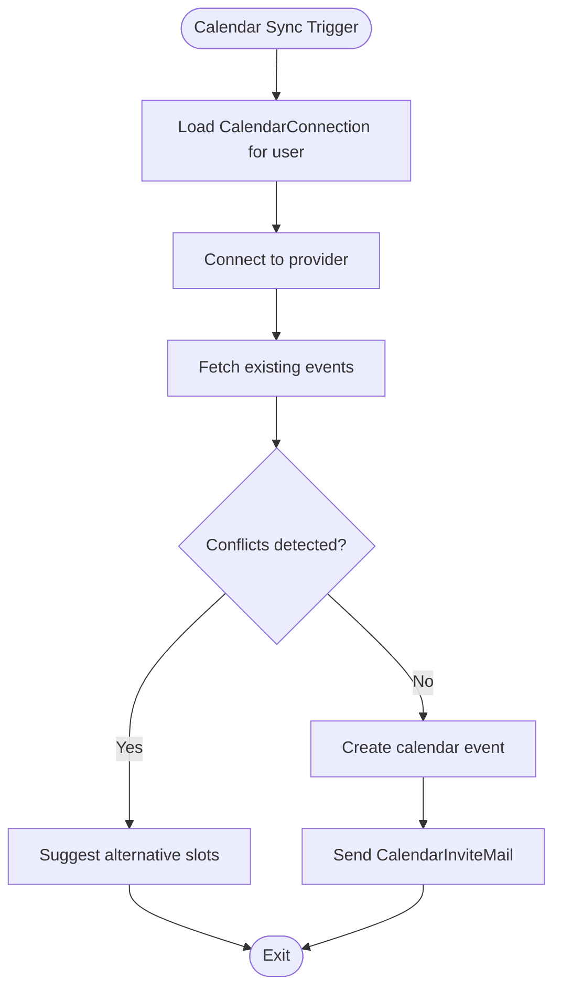

**Diagram sources**
- [calendar-implementation-plan.md](file://calendar-implementation-plan.md)
- [detailed-calendar-implementation-plan.md](file://detailed-calendar-implementation-plan.md)
- [CalendarIntegrationService.php](file://app/Services/CalendarIntegrationService.php)
- [CalendarConnection.php](file://app/Models/CalendarConnection.php)
- [CalendarInviteMail.php](file://app/Mail/CalendarInviteMail.php)
- [CalendarConnectionException.php](file://app/Exceptions/CalendarConnectionException.php)
- [CalendarProviderException.php](file://app/Exceptions/CalendarProviderException.php)
- [CalendarSyncException.php](file://app/Exceptions/CalendarSyncException.php)

**Section sources**
- [calendar-implementation-plan.md](file://calendar-implementation-plan.md)
- [detailed-calendar-implementation-plan.md](file://detailed-calendar-implementation-plan.md)
- [CalendarIntegrationService.php](file://app/Services/CalendarIntegrationService.php)
- [CalendarConnection.php](file://app/Models/CalendarConnection.php)
- [CalendarInviteMail.php](file://app/Mail/CalendarInviteMail.php)
- [SessionScheduledNotification.php](file://app/Notifications/SessionScheduledNotification.php)
- [CalendarConnectionException.php](file://app/Exceptions/CalendarConnectionException.php)
- [CalendarProviderException.php](file://app/Exceptions/CalendarProviderException.php)
- [CalendarSyncException.php](file://app/Exceptions/CalendarSyncException.php)

### Invitation Workflows and Reminders
- Email notifications: CalendarInviteMail is used to send calendar invites to participants.
- SessionScheduledNotification: Notifies users when a session is scheduled.
- Reminder preferences: ScheduleCallModal supports sending a reminder 24 hours prior to the call.

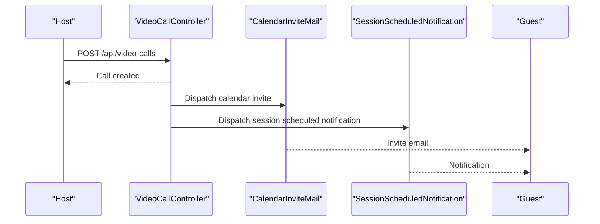

**Diagram sources**
- [VideoCallController.php:56-77](file://app/Http/Controllers/Api/VideoCallController.php#L56-L77)
- [CalendarInviteMail.php](file://app/Mail/CalendarInviteMail.php)
- [SessionScheduledNotification.php](file://app/Notifications/SessionScheduledNotification.php)
- [ScheduleCallModal.vue:136-138](file://resources/js/components/VideoCall/ScheduleCallModal.vue#L136-L138)

**Section sources**
- [VideoCallController.php:56-77](file://app/Http/Controllers/Api/VideoCallController.php#L56-L77)
- [CalendarInviteMail.php](file://app/Mail/CalendarInviteMail.php)
- [SessionScheduledNotification.php](file://app/Notifications/SessionScheduledNotification.php)
- [ScheduleCallModal.vue:136-138](file://resources/js/components/VideoCall/ScheduleCallModal.vue#L136-L138)

### Participant Capacity Management and Waiting Room
- Capacity: max_participants is validated and stored on VideoCall.
- Waiting room: While not explicitly modeled in the referenced files, waiting room functionality can be represented via settings on VideoCall and enforced by VideoCallService during join operations.

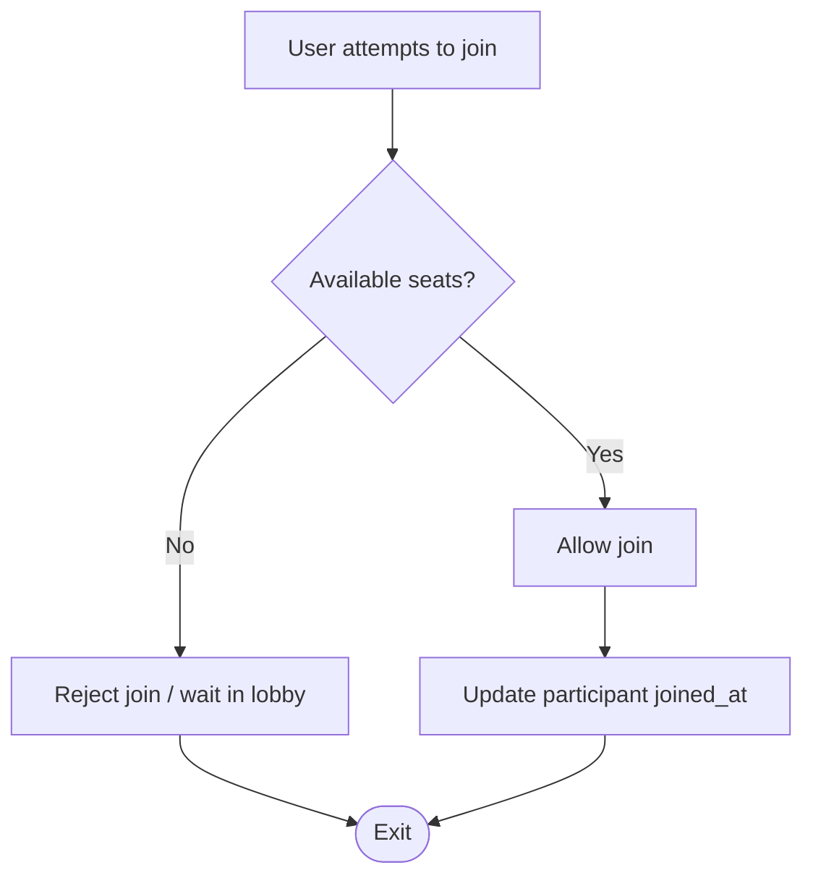

**Diagram sources**
- [VideoCallController.php:175-208](file://app/Http/Controllers/Api/VideoCallController.php#L175-L208)
- [VideoCall.php:22-27](file://app/Models/VideoCall.php#L22-L27)
- [VideoCallService.php:45-58](file://app/Services/VideoCallService.php#L45-L58)

**Section sources**
- [VideoCallController.php:175-208](file://app/Http/Controllers/Api/VideoCallController.php#L175-L208)
- [VideoCall.php:22-27](file://app/Models/VideoCall.php#L22-L27)
- [VideoCallService.php:45-58](file://app/Services/VideoCallService.php#L45-L58)

### Moderator Permissions During Scheduling
- Host privileges: Only the host can update/delete/end calls and moderate participants.
- Access checks: Controllers verify host permissions and user access before operations.

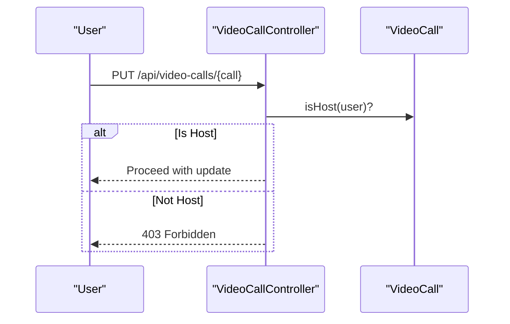

**Diagram sources**
- [VideoCallController.php:115-141](file://app/Http/Controllers/Api/VideoCallController.php#L115-L141)
- [VideoCall.php:97-110](file://app/Models/VideoCall.php#L97-L110)

**Section sources**
- [VideoCallController.php:115-141](file://app/Http/Controllers/Api/VideoCallController.php#L115-L141)
- [VideoCall.php:97-110](file://app/Models/VideoCall.php#L97-L110)

## Dependency Analysis
- Frontend depends on API endpoints for all scheduling operations.
- Controllers depend on services for business logic and models for persistence.
- Services encapsulate provider-specific logic (e.g., Jitsi URL generation) and participant management.
- Calendar integration relies on CalendarConnection and provider-specific exceptions.

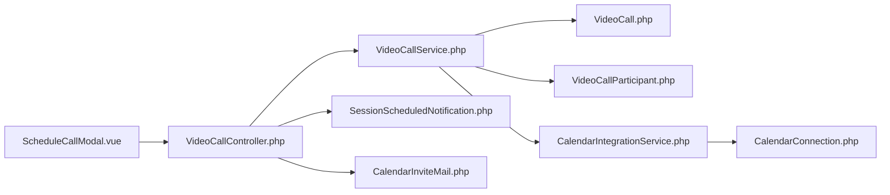

**Diagram sources**
- [ScheduleCallModal.vue:1-236](file://resources/js/components/VideoCall/ScheduleCallModal.vue#L1-L236)
- [VideoCallController.php:1-276](file://app/Http/Controllers/Api/VideoCallController.php#L1-L276)
- [VideoCallService.php:1-112](file://app/Services/VideoCallService.php#L1-L112)
- [VideoCall.php:1-126](file://app/Models/VideoCall.php#L1-L126)
- [VideoCallParticipant.php:1-66](file://app/Models/VideoCallParticipant.php#L1-L66)
- [SessionScheduledNotification.php](file://app/Notifications/SessionScheduledNotification.php)
- [CalendarInviteMail.php](file://app/Mail/CalendarInviteMail.php)
- [CalendarIntegrationService.php](file://app/Services/CalendarIntegrationService.php)
- [CalendarConnection.php](file://app/Models/CalendarConnection.php)

**Section sources**
- [VideoCallController.php:1-276](file://app/Http/Controllers/Api/VideoCallController.php#L1-L276)
- [VideoCallService.php:1-112](file://app/Services/VideoCallService.php#L1-L112)
- [VideoCall.php:1-126](file://app/Models/VideoCall.php#L1-L126)
- [VideoCallParticipant.php:1-66](file://app/Models/VideoCallParticipant.php#L1-L66)
- [CalendarIntegrationService.php](file://app/Services/CalendarIntegrationService.php)
- [CalendarConnection.php](file://app/Models/CalendarConnection.php)

## Performance Considerations
- Pagination: Listing endpoints support per_page pagination to limit payload sizes.
- Lazy loading: Related data (host, participants, recordings, screen sharing sessions) is loaded on demand.
- Minimal casts: Timestamps and arrays are cast at model level to reduce overhead.
- Provider URL generation: Jitsi URL construction is lightweight and cached client-side if needed.

[No sources needed since this section provides general guidance]

## Troubleshooting Guide
Common issues and resolutions:
- Access Denied: Ensure the user has access to the call or is the host before attempting updates or moderation actions.
- Active Call Operations: Deleting or modifying active calls is restricted; end the call first.
- Calendar Sync Failures: Check CalendarConnection credentials and handle provider-specific exceptions.
- Validation Errors: Ensure scheduled_at is in the future and max_participants is within allowed range.

**Section sources**
- [VideoCallController.php:86-92](file://app/Http/Controllers/Api/VideoCallController.php#L86-L92)
- [VideoCallController.php:148-170](file://app/Http/Controllers/Api/VideoCallController.php#L148-L170)
- [CalendarConnectionException.php](file://app/Exceptions/CalendarConnectionException.php)
- [CalendarProviderException.php](file://app/Exceptions/CalendarProviderException.php)
- [CalendarSyncException.php](file://app/Exceptions/CalendarSyncException.php)

## Conclusion
The scheduling and invitation system provides a robust foundation for video call creation, participant management, and calendar integration. The ScheduleCallModal offers a streamlined UX for scheduling, while controllers and services enforce authorization, capacity, and lifecycle rules. Coffee chat features complement formal scheduling for informal networking. Calendar integration and notifications enhance user experience through automated invites and reminders. Extending the system with explicit waiting room controls and advanced conflict detection will further improve reliability and user satisfaction.