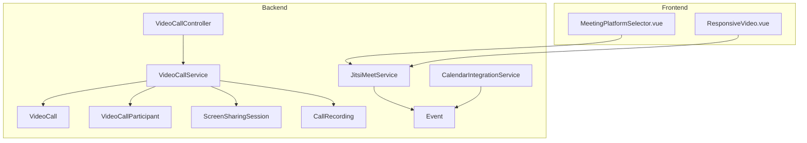
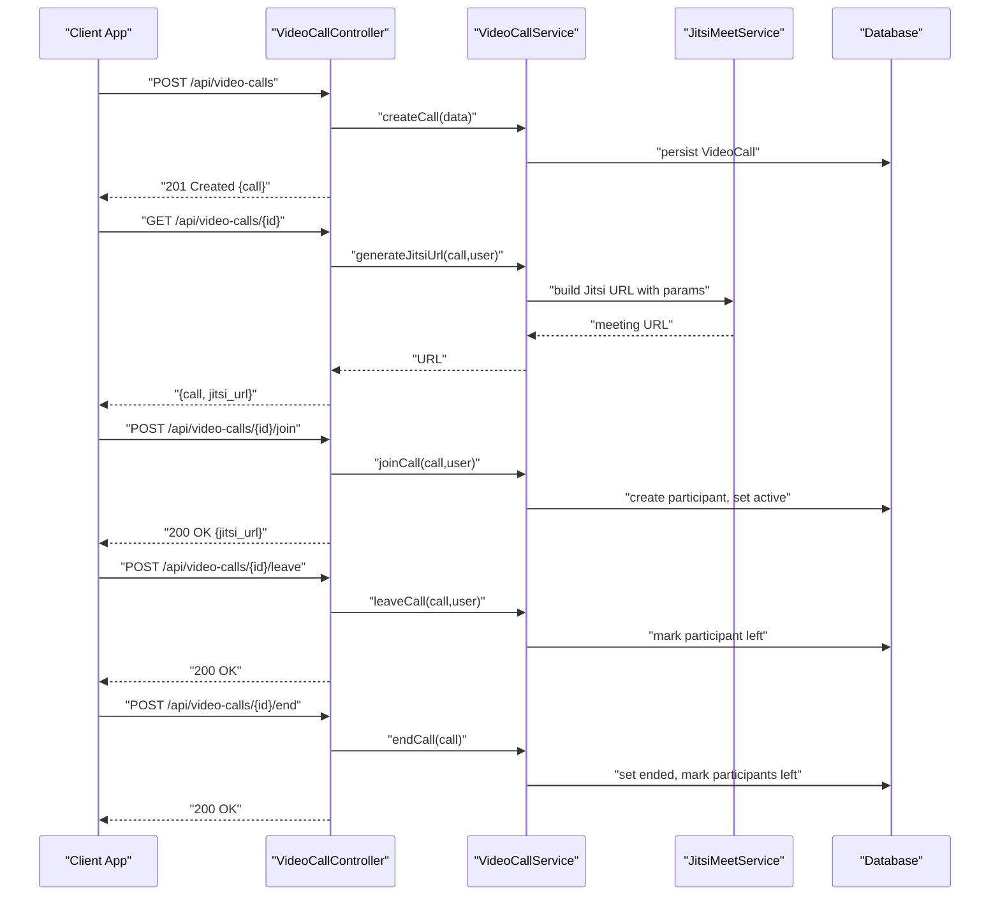
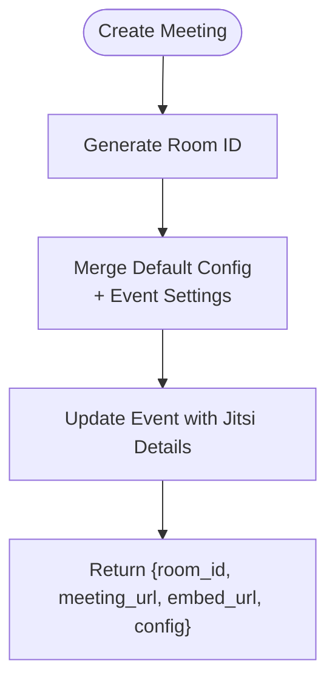
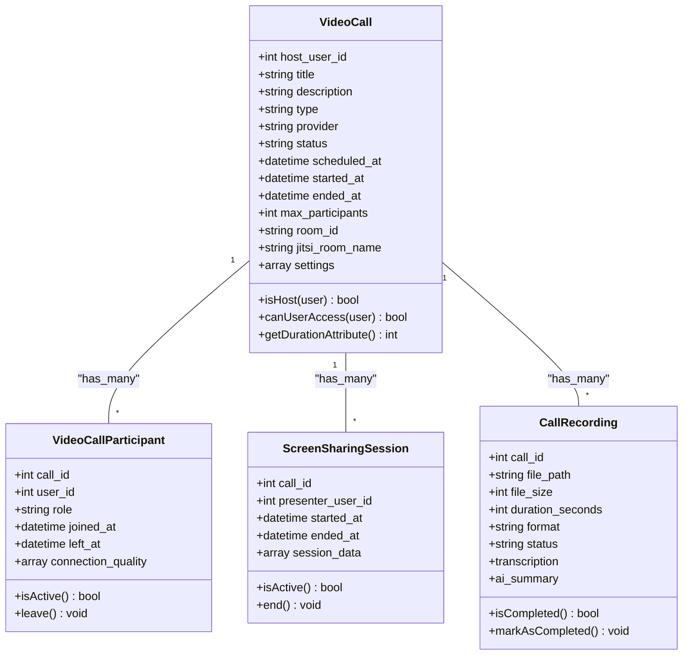
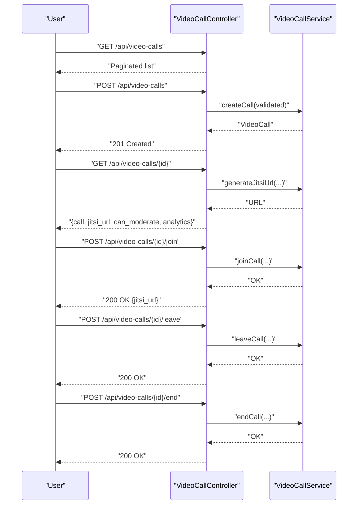
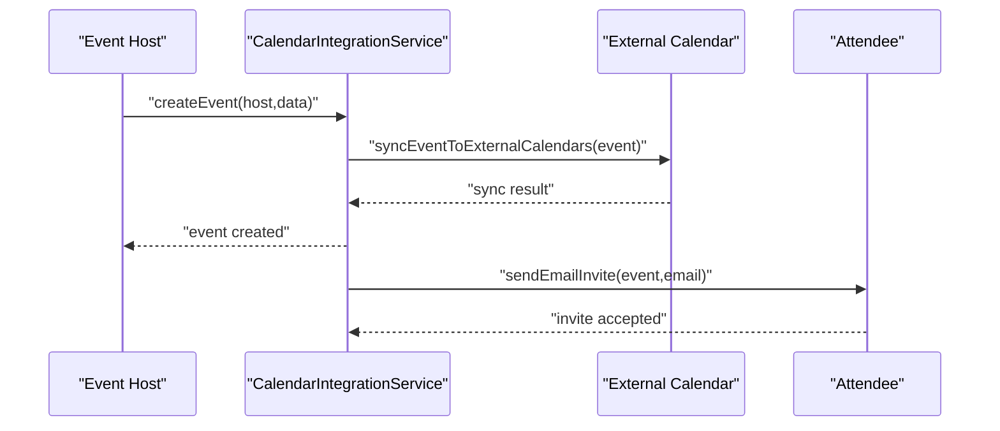
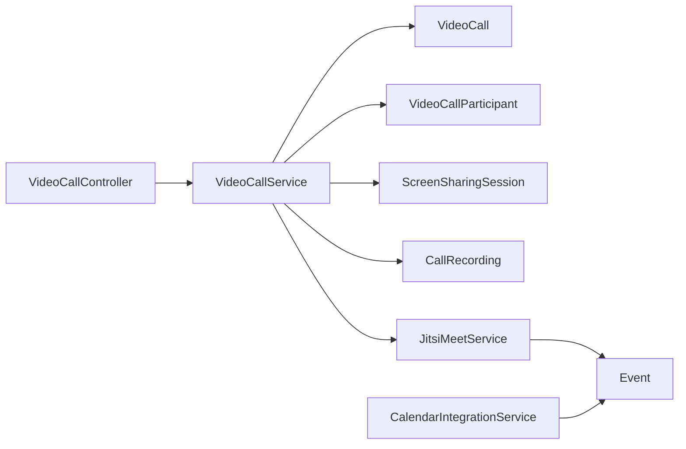

# Video Calling & Virtual Meetings

<cite>
**Referenced Files in This Document**
- [JitsiMeetService.php](file://app/Services/JitsiMeetService.php)
- [VideoCallService.php](file://app/Services/VideoCallService.php)
- [VideoCallController.php](file://app/Http/Controllers/Api/VideoCallController.php)
- [VideoCall.php](file://app/Models/VideoCall.php)
- [VideoCallParticipant.php](file://app/Models/VideoCallParticipant.php)
- [ScreenSharingSession.php](file://app/Models/ScreenSharingSession.php)
- [CallRecording.php](file://app/Models/CallRecording.php)
- [Event.php](file://app/Models/Event.php)
- [CalendarIntegrationService.php](file://app/Services/CalendarIntegrationService.php)
- [SessionScheduledNotification.php](file://app/Notifications/SessionScheduledNotification.php)
- [MeetingPlatformSelector.vue](file://resources/js/components/MeetingPlatformSelector.vue)
- [ResponsiveVideo.vue](file://resources/js/components/common/ResponsiveVideo.vue)
- [task-17-performance-optimization-recap.md](file://docs/task-17-performance-optimization-recap.md)
- [component-library-system/design.md](file://.kiro/specs/component-library-system/design.md)
</cite>

## Table of Contents
1. [Introduction](#introduction)
2. [Project Structure](#project-structure)
3. [Core Components](#core-components)
4. [Architecture Overview](#architecture-overview)
5. [Detailed Component Analysis](#detailed-component-analysis)
6. [Dependency Analysis](#dependency-analysis)
7. [Performance Considerations](#performance-considerations)
8. [Troubleshooting Guide](#troubleshooting-guide)
9. [Conclusion](#conclusion)
10. [Appendices](#appendices)

## Introduction
This document explains the video calling and virtual meetings system built on Jitsi Meet within the platform. It covers secure video conferencing integration, call scheduling and invitations, participant coordination, meeting room management, recording and screen sharing, notifications, join/leave flows, participant controls, waiting rooms and moderator permissions, calendar integration, and practical workflows. It also addresses security, bandwidth optimization, and quality-of-service considerations.

## Project Structure
The system spans Laravel backend services, Eloquent models, controllers, and frontend components:
- Backend services orchestrate Jitsi Meet room creation, credentials generation, and meeting URL validation.
- Controllers expose API endpoints for scheduling, joining, leaving, and managing calls.
- Models represent calls, participants, screen sharing sessions, and recordings.
- Calendar integration synchronizes events and sends invitations.
- Frontend components support platform selection and adaptive video playback with bandwidth detection.

**Diagram sources**
- [JitsiMeetService.php:1-345](file://app/Services/JitsiMeetService.php#L1-L345)
- [VideoCallService.php:1-112](file://app/Services/VideoCallService.php#L1-L112)
- [VideoCallController.php:1-276](file://app/Http/Controllers/Api/VideoCallController.php#L1-L276)
- [VideoCall.php:1-126](file://app/Models/VideoCall.php#L1-L126)
- [VideoCallParticipant.php:1-66](file://app/Models/VideoCallParticipant.php#L1-L66)
- [ScreenSharingSession.php:1-65](file://app/Models/ScreenSharingSession.php#L1-L65)
- [CallRecording.php:1-94](file://app/Models/CallRecording.php#L1-L94)
- [Event.php:1-633](file://app/Models/Event.php#L1-L633)
- [CalendarIntegrationService.php:1-800](file://app/Services/CalendarIntegrationService.php#L1-L800)
- [MeetingPlatformSelector.vue:1-38](file://resources/js/components/MeetingPlatformSelector.vue#L1-L38)
- [ResponsiveVideo.vue:523-563](file://resources/js/components/common/ResponsiveVideo.vue#L523-L563)

**Section sources**
- [JitsiMeetService.php:1-345](file://app/Services/JitsiMeetService.php#L1-L345)
- [VideoCallService.php:1-112](file://app/Services/VideoCallService.php#L1-L112)
- [VideoCallController.php:1-276](file://app/Http/Controllers/Api/VideoCallController.php#L1-L276)
- [Event.php:1-633](file://app/Models/Event.php#L1-L633)
- [CalendarIntegrationService.php:1-800](file://app/Services/CalendarIntegrationService.php#L1-L800)
- [MeetingPlatformSelector.vue:1-38](file://resources/js/components/MeetingPlatformSelector.vue#L1-L38)
- [ResponsiveVideo.vue:523-563](file://resources/js/components/common/ResponsiveVideo.vue#L523-L563)

## Core Components
- JitsiMeetService: Creates rooms, generates credentials, validates/extracts meeting URLs, builds embed configurations, and produces platform-specific instructions.
- VideoCallService: Manages call lifecycle (create, join, leave, end), participant roles, and analytics.
- VideoCallController: Exposes REST endpoints for listing, creating, updating, deleting, joining, leaving, ending calls, and retrieving analytics.
- Models: VideoCall, VideoCallParticipant, ScreenSharingSession, CallRecording encapsulate domain logic and persistence.
- Event model: Integrates virtual meeting metadata (Jitsi room ID, meeting URL, waiting room, chat, screen sharing, recording).
- CalendarIntegrationService: Connects calendars, syncs events, and sends invitations.
- Frontend components: Platform selector and responsive video player with bandwidth detection.

**Section sources**
- [JitsiMeetService.php:20-89](file://app/Services/JitsiMeetService.php#L20-L89)
- [VideoCallService.php:11-82](file://app/Services/VideoCallService.php#L11-L82)
- [VideoCallController.php:18-274](file://app/Http/Controllers/Api/VideoCallController.php#L18-L274)
- [VideoCall.php:12-125](file://app/Models/VideoCall.php#L12-L125)
- [VideoCallParticipant.php:10-64](file://app/Models/VideoCallParticipant.php#L10-L64)
- [ScreenSharingSession.php:10-63](file://app/Models/ScreenSharingSession.php#L10-L63)
- [CallRecording.php:10-93](file://app/Models/CallRecording.php#L10-L93)
- [Event.php:377-440](file://app/Models/Event.php#L377-L440)
- [CalendarIntegrationService.php:33-180](file://app/Services/CalendarIntegrationService.php#L33-L180)

## Architecture Overview
The system integrates Jitsi Meet for secure, standards-based video conferencing. Controllers delegate to services that manage domain logic and persistence. Events store virtual meeting metadata and enable waiting rooms, chat, screen sharing, and recording. Calendar integration automates scheduling and invitations.

**Diagram sources**
- [VideoCallController.php:56-252](file://app/Http/Controllers/Api/VideoCallController.php#L56-L252)
- [VideoCallService.php:11-82](file://app/Services/VideoCallService.php#L11-L82)
- [JitsiMeetService.php:30-42](file://app/Services/JitsiMeetService.php#L30-L42)

## Detailed Component Analysis

### Jitsi Meet Integration
- Room creation: Generates a unique room identifier and merges default configuration with event-specific settings (audio/video defaults, welcome page, prejoin, deep-linking, toolbar buttons).
- Credentials and embed: Produces meeting credentials, embed URL, and instructions; supports waiting room and feature toggles.
- URL validation/extraction: Validates and extracts meeting details from multiple platforms, enabling unified handling.
- Toolbar customization: Dynamically includes chat, recording, and desktop sharing based on event settings.

**Diagram sources**
- [JitsiMeetService.php:23-58](file://app/Services/JitsiMeetService.php#L23-L58)

**Section sources**
- [JitsiMeetService.php:20-89](file://app/Services/JitsiMeetService.php#L20-L89)
- [Event.php:377-440](file://app/Models/Event.php#L377-L440)

### Call Lifecycle and Participant Controls
- Creation: Builds a call record with provider, scheduled time, and settings.
- Join/Leave: Adds/removes participants, updates call status to active upon first join, and ends call when host leaves or no participants remain.
- End Call: Marks call as ended and finalizes participant leave timestamps.
- Analytics: Provides duration, participant counts, recordings, and screen sharing sessions.

**Diagram sources**
- [VideoCall.php:12-125](file://app/Models/VideoCall.php#L12-L125)
- [VideoCallParticipant.php:10-64](file://app/Models/VideoCallParticipant.php#L10-L64)
- [ScreenSharingSession.php:10-63](file://app/Models/ScreenSharingSession.php#L10-L63)
- [CallRecording.php:10-93](file://app/Models/CallRecording.php#L10-L93)

**Section sources**
- [VideoCallService.php:11-82](file://app/Services/VideoCallService.php#L11-L82)
- [VideoCall.php:97-125](file://app/Models/VideoCall.php#L97-L125)
- [VideoCallParticipant.php:45-64](file://app/Models/VideoCallParticipant.php#L45-L64)
- [ScreenSharingSession.php:44-52](file://app/Models/ScreenSharingSession.php#L44-L52)
- [CallRecording.php:41-64](file://app/Models/CallRecording.php#L41-L64)

### API Endpoints and Workflows
- Listing calls for a user, filtering by status/type, paginated.
- Creating a call with validation for title, type, scheduling, and optional provider/settings.
- Showing call details with Jitsi URL for eligible providers, moderation capability, and analytics.
- Updating/deleting calls restricted to hosts and non-active calls.
- Joining/leaving/end endpoints enforce access and state checks.

**Diagram sources**
- [VideoCallController.php:21-252](file://app/Http/Controllers/Api/VideoCallController.php#L21-L252)
- [VideoCallService.php:30-82](file://app/Services/VideoCallService.php#L30-L82)

**Section sources**
- [VideoCallController.php:18-274](file://app/Http/Controllers/Api/VideoCallController.php#L18-L274)

### Meeting Room Management, Recording, and Screen Sharing
- Room management: Jitsi configuration controls waiting room, chat, recording, and screen sharing visibility.
- Recording: CallRecording tracks status, file size/duration, and human-readable attributes.
- Screen sharing: ScreenSharingSession captures presenter, timing, and session data.

**Section sources**
- [JitsiMeetService.php:31-42](file://app/Services/JitsiMeetService.php#L31-L42)
- [CallRecording.php:56-93](file://app/Models/CallRecording.php#L56-L93)
- [ScreenSharingSession.php:49-63](file://app/Models/ScreenSharingSession.php#L49-L63)

### Waiting Rooms, Moderator Permissions, and Participant Controls
- Waiting room: Controlled per-event; prejoin page enabled when waiting room is turned on.
- Moderation: Host-only actions (update/delete/end) enforced by controller checks.
- Participant roles: Participants are recorded with joined/leave timestamps; analytics derive counts and durations.

**Section sources**
- [JitsiMeetService.php:37-41](file://app/Services/JitsiMeetService.php#L37-L41)
- [VideoCallController.php:119-162](file://app/Http/Controllers/Api/VideoCallController.php#L119-L162)
- [VideoCall.php:97-110](file://app/Models/VideoCall.php#L97-L110)
- [VideoCallParticipant.php:45-64](file://app/Models/VideoCallParticipant.php#L45-L64)

### Calendar Integration and Invitation Management
- Calendar connections: Supports Google, Outlook, Apple, and CalDAV; validates and syncs events.
- Event creation: Persists event with optional virtual meeting metadata.
- Invitations: Sends email invites with ICS attachments and creates events in user calendars when possible.
- Availability and scheduling: Computes user availability across providers and finds time slots.

**Diagram sources**
- [CalendarIntegrationService.php:93-180](file://app/Services/CalendarIntegrationService.php#L93-L180)

**Section sources**
- [CalendarIntegrationService.php:33-180](file://app/Services/CalendarIntegrationService.php#L33-L180)
- [Event.php:96-121](file://app/Models/Event.php#L96-L121)

### Frontend Integration and UX
- Platform selector: Allows choosing virtual meeting platform with icons and descriptions.
- Adaptive video: Detects bandwidth and recommends appropriate quality, with warnings and manual overrides.

**Section sources**
- [MeetingPlatformSelector.vue:1-38](file://resources/js/components/MeetingPlatformSelector.vue#L1-L38)
- [ResponsiveVideo.vue:523-563](file://resources/js/components/common/ResponsiveVideo.vue#L523-L563)

## Dependency Analysis
- Controllers depend on services for business logic.
- Services depend on models for persistence and on JitsiMeetService for meeting URL generation.
- Event model centralizes virtual meeting metadata and integrates with Jitsi configuration.
- CalendarIntegrationService depends on external providers and manages credentials securely.

**Diagram sources**
- [VideoCallController.php:14-16](file://app/Http/Controllers/Api/VideoCallController.php#L14-L16)
- [VideoCallService.php:9-28](file://app/Services/VideoCallService.php#L9-L28)
- [JitsiMeetService.php:8-18](file://app/Services/JitsiMeetService.php#L8-L18)
- [Event.php:32-80](file://app/Models/Event.php#L32-L80)
- [CalendarIntegrationService.php:33-54](file://app/Services/CalendarIntegrationService.php#L33-L54)

**Section sources**
- [VideoCallController.php:14-16](file://app/Http/Controllers/Api/VideoCallController.php#L14-L16)
- [VideoCallService.php:9-28](file://app/Services/VideoCallService.php#L9-L28)
- [JitsiMeetService.php:8-18](file://app/Services/JitsiMeetService.php#L8-L18)
- [CalendarIntegrationService.php:33-54](file://app/Services/CalendarIntegrationService.php#L33-L54)

## Performance Considerations
- Bandwidth detection and adaptive quality: The frontend detects effective connection type and recommends suitable video quality, optionally downscaling to improve stability on constrained networks.
- CDN and media optimization: Tests demonstrate adaptive bitrate and quality tiers for video assets, supporting efficient delivery.
- Security and reliability: Performance optimization documentation emphasizes DDoS protection, resource monitoring, anomaly detection, and secure headers to maintain responsiveness under load.

**Section sources**
- [ResponsiveVideo.vue:523-563](file://resources/js/components/common/ResponsiveVideo.vue#L523-L563)
- [task-17-performance-optimization-recap.md:673-705](file://docs/task-17-performance-optimization-recap.md#L673-L705)
- [component-library-system/design.md:345-355](file://.kiro/specs/component-library-system/design.md#L345-L355)

## Troubleshooting Guide
- Invalid meeting URL: Validation returns structured errors for unsupported formats; ensure correct platform-specific URL patterns.
- Access denied: Controllers enforce access checks; users must be registered participants or hosts.
- Active call deletion: Deleting active calls is blocked; end the call first.
- Leaving when not in call: Attempting to leave a call you are not part of is rejected.
- Calendar sync failures: Errors are logged with context; verify provider credentials and network connectivity.

**Section sources**
- [JitsiMeetService.php:124-189](file://app/Services/JitsiMeetService.php#L124-L189)
- [VideoCallController.php:179-191](file://app/Http/Controllers/Api/VideoCallController.php#L179-L191)
- [VideoCallController.php:147-170](file://app/Http/Controllers/Api/VideoCallController.php#L147-L170)
- [CalendarIntegrationService.php:75-87](file://app/Services/CalendarIntegrationService.php#L75-L87)

## Conclusion
The system provides a robust, standards-based video calling solution integrated with Jitsi Meet, offering secure, scalable virtual meetings with waiting rooms, chat, screen sharing, and recording. It includes calendar integration for scheduling and invitations, participant controls, and frontend adaptivity for bandwidth-constrained environments. The modular design ensures maintainability and extensibility for future enhancements.

## Appendices

### Best Practices
- Prefer waiting rooms for large or sensitive meetings.
- Enable recording only when necessary and ensure compliance with privacy policies.
- Use calendar integration to automate scheduling and reduce administrative overhead.
- Monitor analytics to optimize meeting experiences and troubleshoot issues.
- Apply bandwidth detection and adaptive quality to balance quality and stability.

### Example Workflows
- Schedule a virtual event:
  - Create an event with meeting metadata; Jitsi room is generated automatically.
  - Send invitations via calendar integration; recipients receive ICS emails.
- Host a meeting:
  - Use the generated Jitsi URL; configure waiting room and feature toggles as needed.
  - Moderate participants and manage screen sharing/recording.
- Attend a meeting:
  - Join via the embedded URL; follow platform instructions; exit cleanly to avoid lingering participant records.

[No sources needed since this section summarizes workflows conceptually]