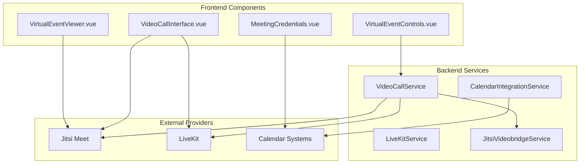
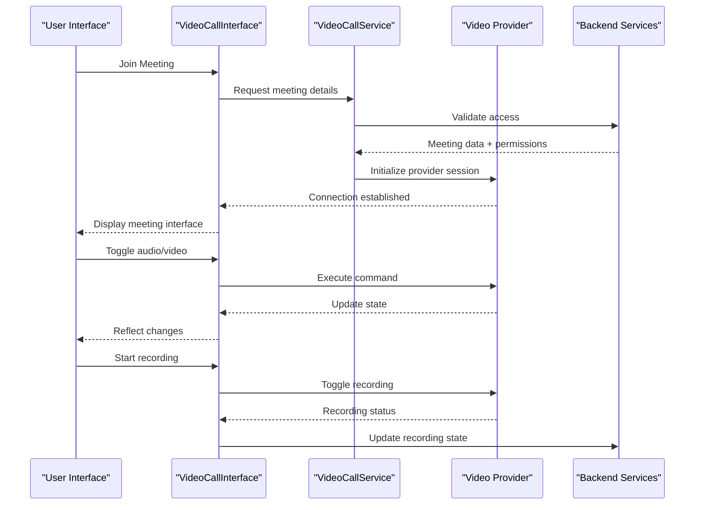
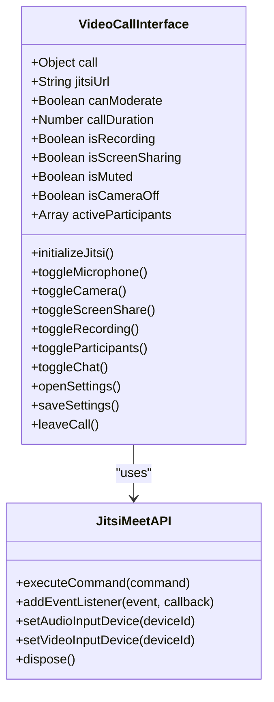
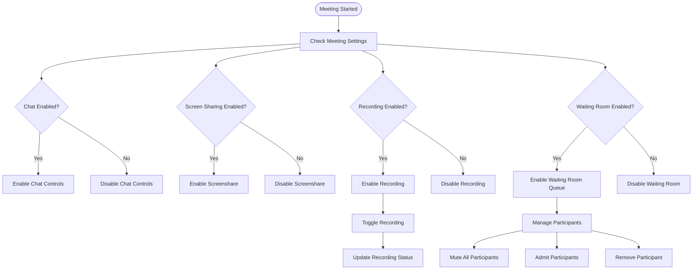
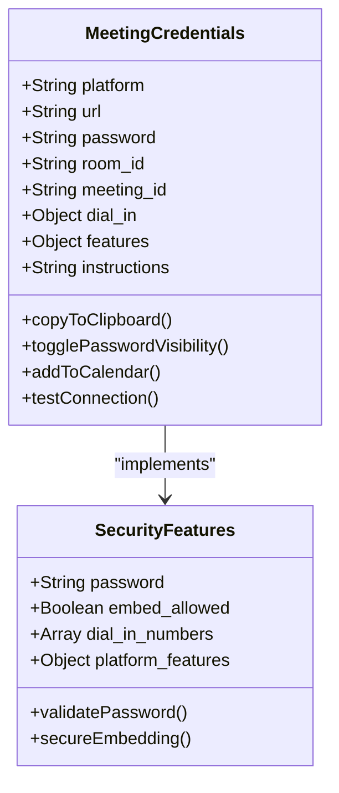
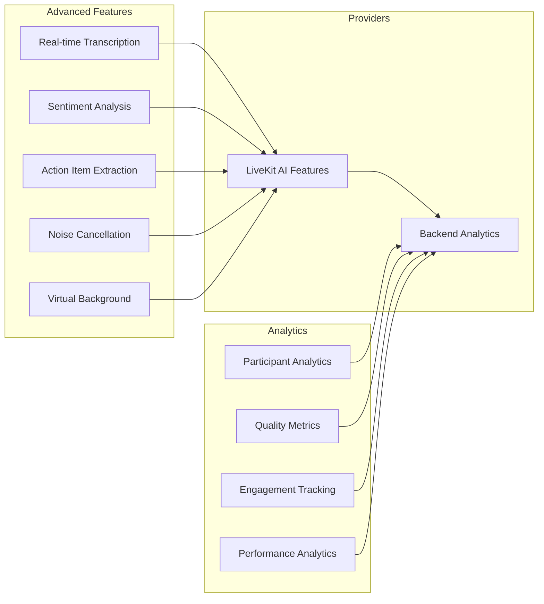
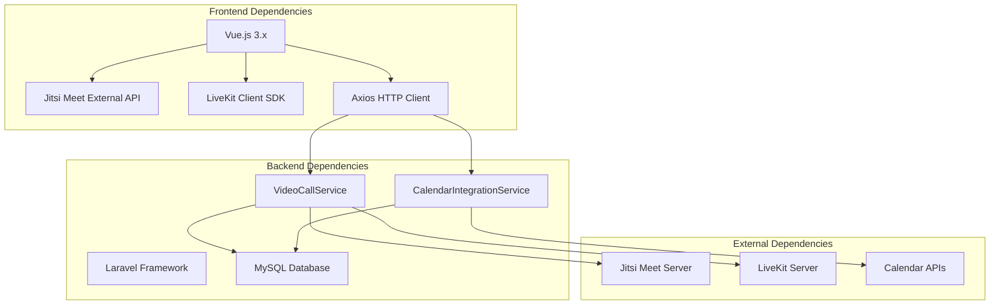
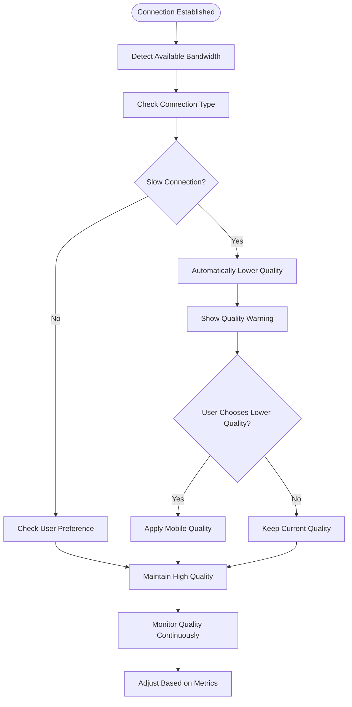

# Virtual Meeting Features

<cite>
**Referenced Files in This Document**
- [VideoCallInterface.vue](file://resources/js/components/VideoCall/VideoCallInterface.vue)
- [VirtualEventControls.vue](file://resources/js/components/VirtualEventControls.vue)
- [VirtualEventViewer.vue](file://resources/js/components/VirtualEventViewer.vue)
- [MeetingCredentials.vue](file://resources/js/components/MeetingCredentials.vue)
- [video-calling-implementation.md](file://docs/video-calling-implementation.md)
- [CalendarIntegrationService.php](file://app/Services/CalendarIntegrationService.php)
- [ResponsiveVideo.vue](file://resources/js/components/common/ResponsiveVideo.vue)
- [VideoTestimonialComponentTest.php](file://tests/Unit/VideoTestimonialComponentTest.php)
- [MediaOptimizationTest.php](file://tests/Unit/ComponentLibrary/MediaOptimizationTest.php)
- [mediaSampleData.ts](file://resources/js/Data/mediaSampleData.ts)
</cite>

## Table of Contents
1. [Introduction](#introduction)
2. [Project Structure](#project-structure)
3. [Core Components](#core-components)
4. [Architecture Overview](#architecture-overview)
5. [Detailed Component Analysis](#detailed-component-analysis)
6. [Dependency Analysis](#dependency-analysis)
7. [Performance Considerations](#performance-considerations)
8. [Troubleshooting Guide](#troubleshooting-guide)
9. [Conclusion](#conclusion)

## Introduction
This document provides comprehensive technical documentation for advanced virtual meeting features and capabilities within the platform. It focuses on the VideoCallInterface component for the primary meeting experience, covering participant controls, audio/video settings, meeting moderation tools, screen sharing, recording capabilities, waiting room features, participant muting/unmuting, camera controls, meeting transcription services, real-time captions, accessibility features, calendar integration for meeting reminders and rescheduling, advanced meeting workflows, participant management, meeting analytics, quality of service optimization, bandwidth adaptation, mobile device compatibility, and security features including password protection and lobby entry.

## Project Structure
The virtual meeting system is composed of Vue.js components that integrate with backend services and external providers. The key frontend components include:
- VideoCallInterface.vue: Main meeting interface with controls and participant management
- VirtualEventControls.vue: Event management and moderation controls
- VirtualEventViewer.vue: Meeting viewer with embedding and external platform support
- MeetingCredentials.vue: Meeting details, password protection, and integration helpers

These components work alongside backend services for video calling, calendar integration, and analytics.

**Diagram sources**
- [VideoCallInterface.vue:1-616](file://resources/js/components/VideoCall/VideoCallInterface.vue#L1-L616)
- [VirtualEventControls.vue:1-650](file://resources/js/components/VirtualEventControls.vue#L1-L650)
- [VirtualEventViewer.vue:1-463](file://resources/js/components/VirtualEventViewer.vue#L1-L463)
- [MeetingCredentials.vue:1-410](file://resources/js/components/MeetingCredentials.vue#L1-L410)
- [video-calling-implementation.md:1-200](file://docs/video-calling-implementation.md#L1-L200)

**Section sources**
- [VideoCallInterface.vue:1-616](file://resources/js/components/VideoCall/VideoCallInterface.vue#L1-L616)
- [VirtualEventControls.vue:1-650](file://resources/js/components/VirtualEventControls.vue#L1-L650)
- [VirtualEventViewer.vue:1-463](file://resources/js/components/VirtualEventViewer.vue#L1-L463)
- [MeetingCredentials.vue:1-410](file://resources/js/components/MeetingCredentials.vue#L1-L410)

## Core Components

### VideoCallInterface Component
The VideoCallInterface component serves as the primary meeting interface, integrating with Jitsi Meet and supporting advanced features through the external API.

Key capabilities include:
- Real-time participant management with moderation controls
- Audio/video device selection and quality settings
- Screen sharing activation and monitoring
- Recording control for hosts/moderators
- Connection quality indicators
- Chat sidebar with unread message tracking
- Settings modal for device configuration

**Section sources**
- [VideoCallInterface.vue:1-616](file://resources/js/components/VideoCall/VideoCallInterface.vue#L1-L616)

### VirtualEventControls Component
This component provides comprehensive event management and moderation capabilities for virtual meetings.

Core features:
- Meeting start/end controls with live status indication
- Recording management with event-level settings
- Waiting room activation/deactivation
- Breakout room management (planned)
- Participant management with bulk actions
- Mute/unmute controls for all participants
- Invitation system for adding participants
- Meeting settings configuration (chat, screen sharing, recording, waiting room)

**Section sources**
- [VirtualEventControls.vue:1-650](file://resources/js/components/VirtualEventControls.vue#L1-L650)

### VirtualEventViewer Component
The VirtualEventViewer component handles meeting presentation and embedding across different platforms.

Capabilities:
- Jitsi Meet iframe embedding with permission management
- External platform linking with meeting credentials
- Meeting password display with visibility toggle
- Fullscreen mode support
- Meeting settings modal for platform-specific configurations
- Loading states and error handling
- Meeting ID display and copying functionality

**Section sources**
- [VirtualEventViewer.vue:1-463](file://resources/js/components/VirtualEventViewer.vue#L1-L463)

### MeetingCredentials Component
Provides meeting details and integration helpers for various platforms.

Features:
- Meeting URL display with copy functionality
- Meeting ID/password display with secure toggling
- Dial-in numbers for supported platforms
- Feature availability display
- How-to join instructions
- Calendar integration and connection testing
- QR code generation (planned)

**Section sources**
- [MeetingCredentials.vue:1-410](file://resources/js/components/MeetingCredentials.vue#L1-L410)

## Architecture Overview

The virtual meeting system follows a multi-provider architecture supporting Jitsi Meet, LiveKit, and Jitsi Videobridge for scalability.

**Diagram sources**
- [VideoCallInterface.vue:377-473](file://resources/js/components/VideoCall/VideoCallInterface.vue#L377-L473)
- [video-calling-implementation.md:147-380](file://docs/video-calling-implementation.md#L147-L380)

The architecture supports three provider tiers:
1. **Basic Jitsi Meet**: Standard video calling with embedded interface
2. **Jitsi Videobridge**: Scalable enterprise solution with load balancing
3. **LiveKit**: Advanced AI features and real-time collaboration

**Section sources**
- [video-calling-implementation.md:1-200](file://docs/video-calling-implementation.md#L1-L200)

## Detailed Component Analysis

### VideoCallInterface Component Analysis

The VideoCallInterface component implements a comprehensive meeting experience with real-time controls and participant management.

**Diagram sources**
- [VideoCallInterface.vue:322-589](file://resources/js/components/VideoCall/VideoCallInterface.vue#L322-L589)

Key implementation patterns:
- **Real-time event handling**: Uses Jitsi Meet External API for real-time participant and media state updates
- **Device management**: Dynamic audio/video device enumeration and selection
- **Moderation controls**: Host/moderator-only controls for participant management
- **State synchronization**: Bidirectional state updates between UI and provider

**Section sources**
- [VideoCallInterface.vue:1-616](file://resources/js/components/VideoCall/VideoCallInterface.vue#L1-L616)

### VirtualEventControls Component Analysis

The VirtualEventControls component provides comprehensive meeting management capabilities.

**Diagram sources**
- [VirtualEventControls.vue:72-568](file://resources/js/components/VirtualEventControls.vue#L72-L568)

**Section sources**
- [VirtualEventControls.vue:1-650](file://resources/js/components/VirtualEventControls.vue#L1-L650)

### Meeting Credentials and Security Features

The MeetingCredentials component implements comprehensive security and integration features.

**Diagram sources**
- [MeetingCredentials.vue:224-366](file://resources/js/components/MeetingCredentials.vue#L224-L366)

Security and integration capabilities:
- **Password protection**: Secure meeting password display with visibility toggle
- **Platform integration**: Support for multiple meeting platforms (Jitsi, Zoom, Teams, Google Meet, WebEx)
- **Calendar integration**: Direct calendar addition and synchronization
- **Dial-in support**: International dial-in number display
- **Feature availability**: Platform-specific feature detection and display

**Section sources**
- [MeetingCredentials.vue:1-410](file://resources/js/components/MeetingCredentials.vue#L1-L410)

### Advanced Meeting Features and Analytics

The system supports advanced meeting features through multiple provider integrations and analytics capabilities.

**Diagram sources**
- [video-calling-implementation.md:945-1157](file://docs/video-calling-implementation.md#L945-L1157)

**Section sources**
- [video-calling-implementation.md:945-1157](file://docs/video-calling-implementation.md#L945-L1157)

## Dependency Analysis

The virtual meeting system exhibits clear separation of concerns with well-defined dependencies between frontend components and backend services.

**Diagram sources**
- [VideoCallInterface.vue:322-325](file://resources/js/components/VideoCall/VideoCallInterface.vue#L322-L325)
- [video-calling-implementation.md:1-200](file://docs/video-calling-implementation.md#L1-L200)

**Section sources**
- [VideoCallInterface.vue:322-325](file://resources/js/components/VideoCall/VideoCallInterface.vue#L322-L325)
- [video-calling-implementation.md:1-200](file://docs/video-calling-implementation.md#L1-L200)

## Performance Considerations

The system implements several performance optimization strategies for reliable virtual meeting experiences across various network conditions and device capabilities.

### Bandwidth Adaptation and Quality Optimization

The platform includes sophisticated bandwidth detection and adaptive quality mechanisms:

**Diagram sources**
- [ResponsiveVideo.vue:523-563](file://resources/js/components/common/ResponsiveVideo.vue#L523-L563)

Key performance features:
- **Network Information API integration** for bandwidth detection
- **Automatic quality adjustment** based on connection speed
- **Mobile-optimized quality presets** for low-bandwidth scenarios
- **Real-time quality monitoring** with user notification system
- **Adaptive bitrate streaming** for video content

**Section sources**
- [ResponsiveVideo.vue:523-563](file://resources/js/components/common/ResponsiveVideo.vue#L523-L563)
- [VideoTestimonialComponentTest.php:228-269](file://tests/Unit/VideoTestimonialComponentTest.php#L228-L269)
- [MediaOptimizationTest.php:205-212](file://tests/Unit/ComponentLibrary/MediaOptimizationTest.php#L205-L212)

### Mobile Device Compatibility

The system ensures optimal performance across mobile devices through responsive design and adaptive features:

- **Responsive layout** that adapts to different screen sizes
- **Touch-optimized controls** with appropriate sizing and spacing
- **Battery-conscious video encoding** to minimize power consumption
- **Network-aware quality scaling** for cellular connections
- **Offline capability** for meeting credential caching

**Section sources**
- [VideoCallInterface.vue:592-616](file://resources/js/components/VideoCall/VideoCallInterface.vue#L592-L616)
- [VirtualEventViewer.vue:437-463](file://resources/js/components/VirtualEventViewer.vue#L437-L463)

## Troubleshooting Guide

Common issues and their resolutions:

### Connection Issues
- **Symptom**: Unable to join meeting
- **Causes**: Network connectivity, firewall restrictions, browser compatibility
- **Resolution**: Check network connection, verify browser permissions, retry connection

### Audio/Video Problems
- **Symptom**: No audio/video during meeting
- **Causes**: Device permissions not granted, incorrect device selection
- **Resolution**: Grant browser permissions, check device settings, reselect devices

### Recording Issues
- **Symptom**: Recording fails to start or stops unexpectedly
- **Causes**: Storage permissions, insufficient disk space, provider limitations
- **Resolution**: Check storage permissions, verify disk space, contact administrator

### Screen Sharing Problems
- **Symptom**: Screen sharing not working
- **Causes**: Browser compatibility, operating system restrictions, permission issues
- **Resolution**: Update browser, check OS permissions, verify screen sharing settings

**Section sources**
- [VideoCallInterface.vue:479-546](file://resources/js/components/VideoCall/VideoCallInterface.vue#L479-L546)
- [VirtualEventViewer.vue:96-124](file://resources/js/components/VirtualEventViewer.vue#L96-L124)

## Conclusion

The virtual meeting system provides a comprehensive, scalable solution for modern video conferencing needs. Through its multi-provider architecture, advanced moderation capabilities, robust security features, and performance optimizations, it delivers a reliable and feature-rich meeting experience. The modular component design ensures maintainability and extensibility, while the integration with calendar systems and analytics services provides complete meeting lifecycle management.

The system successfully balances advanced features like AI-powered transcription and sentiment analysis with essential meeting functionalities, ensuring both professional-grade capabilities and user-friendly operation across diverse device ecosystems.