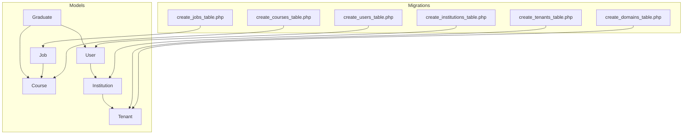
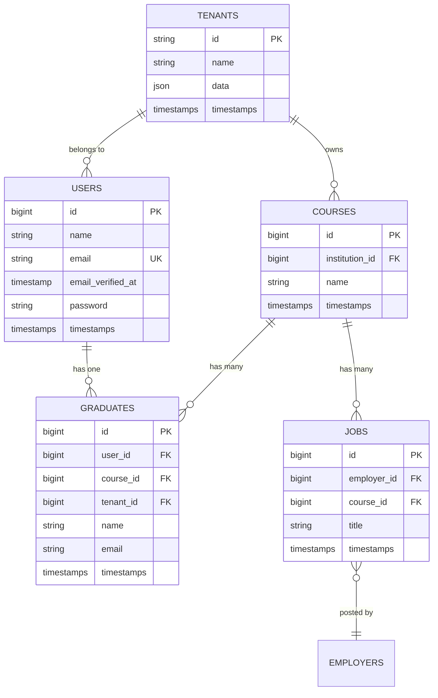
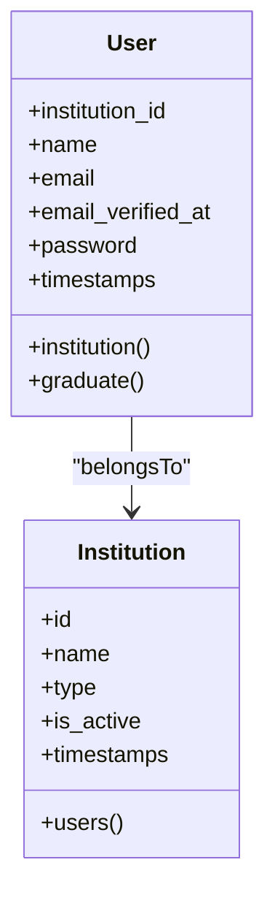
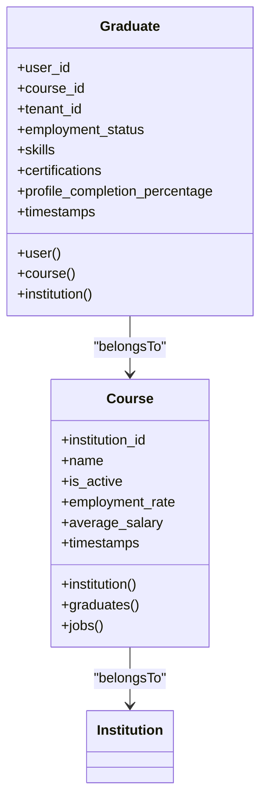
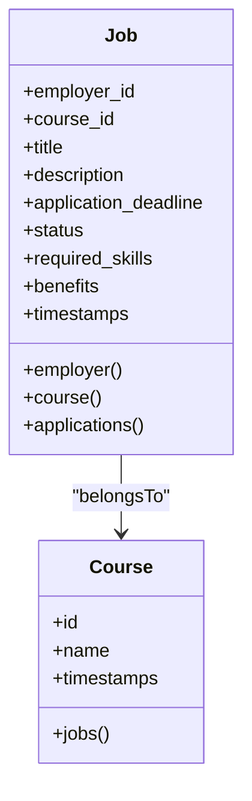
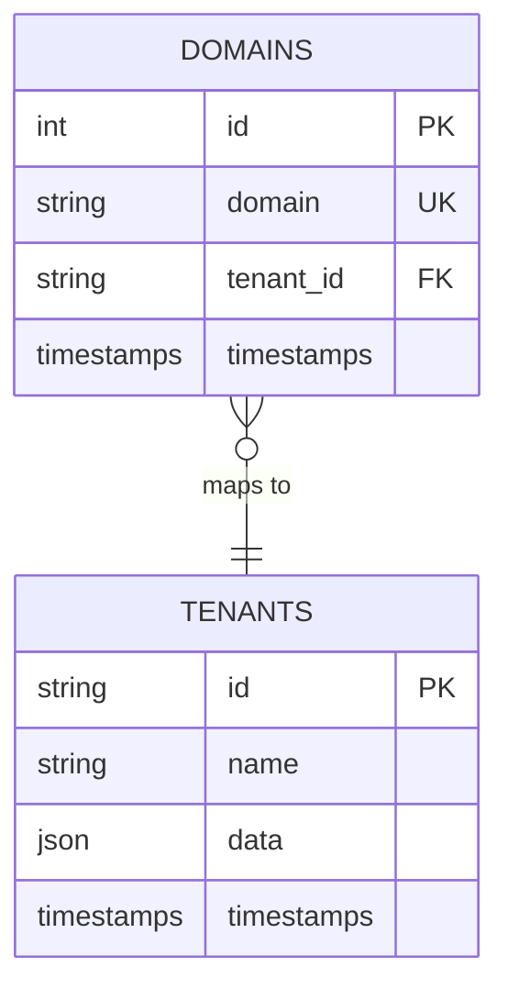
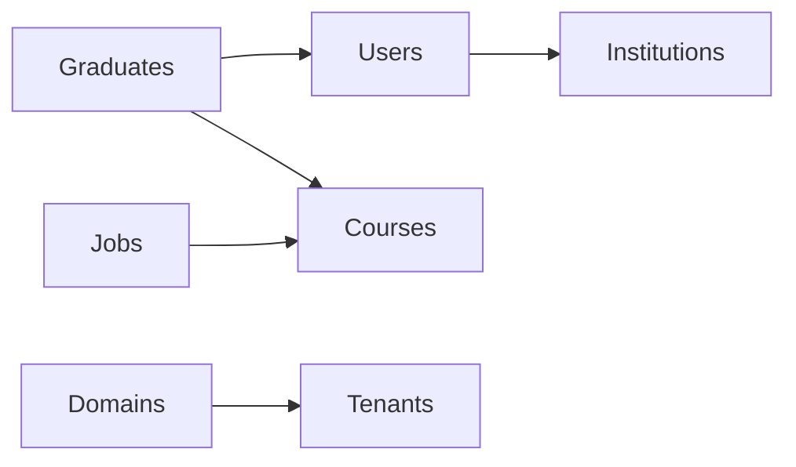

# Database Schema Design

<cite>
**Referenced Files in This Document**
- [User.php](file://app/Models/User.php)
- [Graduate.php](file://app/Models/Graduate.php)
- [Job.php](file://app/Models/Job.php)
- [Course.php](file://app/Models/Course.php)
- [Institution.php](file://app/Models/Institution.php)
- [create_users_table.php](file://database/migrations/0001_01_01_000000_create_users_table.php)
- [create_institutions_table.php](file://database/migrations/2024_12_01_000000_create_institutions_table.php)
- [create_courses_table.php](file://database/migrations/2024_01_01_000007_create_courses_table.php)
- [create_jobs_table.php](file://database/migrations/2024_01_01_000006_create_jobs_table.php)
- [create_tenants_table.php](file://database/migrations/2024_01_01_000000_create_tenants_table.php)
- [create_domains_table.php](file://database/migrations/2024_01_01_000001_create_domains_table.php)
</cite>

## Table of Contents
1. [Introduction](#introduction)
2. [Project Structure](#project-structure)
3. [Core Components](#core-components)
4. [Architecture Overview](#architecture-overview)
5. [Detailed Component Analysis](#detailed-component-analysis)
6. [Dependency Analysis](#dependency-analysis)
7. [Performance Considerations](#performance-considerations)
8. [Troubleshooting Guide](#troubleshooting-guide)
9. [Conclusion](#conclusion)
10. [Appendices](#appendices)

## Introduction
This document provides comprehensive data model documentation for the Alumate database schema with a focus on entity relationships, migration strategies, and optimization techniques. It covers the core entities—users, graduates, jobs, courses, and institutions—and explains how they connect, validated via Eloquent model definitions and migration blueprints. It also documents field definitions, data types, primary/foreign keys, indexes, constraints, referential integrity, and practical guidance for data access patterns, caching, performance tuning, lifecycle and retention, migration paths, versioning, and tenant isolation.

## Project Structure
The schema is primarily defined by Laravel Eloquent models and database migrations. The relevant files are organized under:
- app/Models: Entity models that define fillable attributes, casts, relationships, scopes, and helpers
- database/migrations: Versioned schema creation and alteration scripts

**Diagram sources**
- [User.php:124-137](file://app/Models/User.php#L124-L137)
- [Graduate.php:61-78](file://app/Models/Graduate.php#L61-L78)
- [Job.php:73-81](file://app/Models/Job.php#L73-L81)
- [Course.php:55-68](file://app/Models/Course.php#L55-L68)
- [Institution.php:56-75](file://app/Models/Institution.php#L56-L75)
- [create_users_table.php:14-22](file://database/migrations/0001_01_01_000000_create_users_table.php#L14-L22)
- [create_institutions_table.php:13-26](file://database/migrations/2024_12_01_000000_create_institutions_table.php#L13-L26)
- [create_courses_table.php:16-21](file://database/migrations/2024_01_01_000007_create_courses_table.php#L16-L21)
- [create_jobs_table.php:16-24](file://database/migrations/2024_01_01_000006_create_jobs_table.php#L16-L24)
- [create_tenants_table.php:16-24](file://database/migrations/2024_01_01_000000_create_tenants_table.php#L16-L24)
- [create_domains_table.php:16-23](file://database/migrations/2024_01_01_000001_create_domains_table.php#L16-L23)

**Section sources**
- [User.php:124-137](file://app/Models/User.php#L124-L137)
- [Graduate.php:61-78](file://app/Models/Graduate.php#L61-L78)
- [Job.php:73-81](file://app/Models/Job.php#L73-L81)
- [Course.php:55-68](file://app/Models/Course.php#L55-L68)
- [Institution.php:56-75](file://app/Models/Institution.php#L56-L75)
- [create_users_table.php:14-22](file://database/migrations/0001_01_01_000000_create_users_table.php#L14-L22)
- [create_institutions_table.php:13-26](file://database/migrations/2024_12_01_000000_create_institutions_table.php#L13-L26)
- [create_courses_table.php:16-21](file://database/migrations/2024_01_01_000007_create_courses_table.php#L16-L21)
- [create_jobs_table.php:16-24](file://database/migrations/2024_01_01_000006_create_jobs_table.php#L16-L24)
- [create_tenants_table.php:16-24](file://database/migrations/2024_01_01_000000_create_tenants_table.php#L16-L24)
- [create_domains_table.php:16-23](file://database/migrations/2024_01_01_000001_create_domains_table.php#L16-L23)

## Core Components
This section outlines the principal entities and their roles in the schema.

- User
  - Purpose: Authentication, authorization, and personal profile management
  - Key relationships: belongs to Institution (via institution_id), has one Graduate, has many related activities and preferences
  - Validation rules: email uniqueness enforced at DB level; timestamps and soft deletes supported
  - Indexes/constraints: unique email; foreign key to Institution via institution_id
  - Access patterns: role-based dashboards, activity logs, notifications, and onboarding state

- Graduate
  - Purpose: Alumni profile, employment status, and course association
  - Key relationships: belongs to User, belongs to Course, belongs to Institution (tenant), has many JobApplication entries
  - Validation rules: numeric and decimal casts for GPA and salaries; boolean flags for privacy and job search
  - Indexes/constraints: foreign keys to User and Course; tenant scoping via tenant_id
  - Access patterns: profile completion metrics, employment status updates, and audit logs

- Job
  - Purpose: Employment opportunities posted by employers aligned to courses
  - Key relationships: belongs to Employer (via employer_id), belongs to Course, has many JobApplication entries
  - Validation rules: arrays for skills/benefits; booleans for approval flags; datetime fields for deadlines
  - Indexes/constraints: foreign key to Employer; cascading delete policy on employer removal
  - Access patterns: application statistics, match scoring, performance metrics, and renewal workflows

- Course
  - Purpose: Academic program catalog and analytics
  - Key relationships: belongs to Institution (tenant), has many Graduates and Jobs
  - Validation rules: numeric and decimal casts for enrollment and outcomes; arrays for prerequisites and learning outcomes
  - Indexes/constraints: foreign key to Institution (tenant_id)
  - Access patterns: popularity indicators, employment rates, and skills overlap with jobs

- Institution
  - Purpose: Multi-tenant container for users, events, and groups
  - Key relationships: has many Users, Events, and Groups
  - Validation rules: arrays for address/settings; booleans for activation and verification
  - Indexes/constraints: soft-deletable with standard indexes on name/type/is_active
  - Access patterns: tenant scoping, subscription and feature flags, and branding metadata

**Section sources**
- [User.php:124-137](file://app/Models/User.php#L124-L137)
- [Graduate.php:61-78](file://app/Models/Graduate.php#L61-L78)
- [Job.php:73-81](file://app/Models/Job.php#L73-L81)
- [Course.php:55-68](file://app/Models/Course.php#L55-L68)
- [Institution.php:56-75](file://app/Models/Institution.php#L56-L75)

## Architecture Overview
The schema supports a multi-tenant architecture centered around Institutions and Users. Courses serve as academic anchors linking Graduates to Jobs. Employers post Jobs that are filtered and matched against Graduate profiles.

**Diagram sources**
- [create_users_table.php:14-22](file://database/migrations/0001_01_01_000000_create_users_table.php#L14-L22)
- [create_tenants_table.php:16-24](file://database/migrations/2024_01_01_000000_create_tenants_table.php#L16-L24)
- [create_courses_table.php:16-21](file://database/migrations/2024_01_01_000007_create_courses_table.php#L16-L21)
- [create_jobs_table.php:16-24](file://database/migrations/2024_01_01_000006_create_jobs_table.php#L16-L24)
- [User.php:124-137](file://app/Models/User.php#L124-L137)
- [Graduate.php:61-78](file://app/Models/Graduate.php#L61-L78)
- [Course.php:55-68](file://app/Models/Course.php#L55-L68)
- [Job.php:73-81](file://app/Models/Job.php#L73-L81)

## Detailed Component Analysis

### Users and Institutions
- Relationship: User belongs to Institution via institution_id; Institution has many Users
- Constraints: Unique email on users; foreign key from users.institution_id to institutions.id
- Indexes: sessions.user_id is indexed; institutions include indexes on name, type, is_active
- Validation: Eloquent casts handle date/time and boolean normalization; unique constraint on email

**Diagram sources**
- [User.php:124-137](file://app/Models/User.php#L124-L137)
- [Institution.php:56-75](file://app/Models/Institution.php#L56-L75)
- [create_users_table.php:14-22](file://database/migrations/0001_01_01_000000_create_users_table.php#L14-L22)
- [create_institutions_table.php:13-26](file://database/migrations/2024_12_01_000000_create_institutions_table.php#L13-L26)

**Section sources**
- [User.php:124-137](file://app/Models/User.php#L124-L137)
- [Institution.php:56-75](file://app/Models/Institution.php#L56-L75)
- [create_users_table.php:14-22](file://database/migrations/0001_01_01_000000_create_users_table.php#L14-L22)
- [create_institutions_table.php:13-26](file://database/migrations/2024_12_01_000000_create_institutions_table.php#L13-L26)

### Graduates and Courses
- Relationship: Graduate belongs to User and Course; Course belongs to Institution (tenant)
- Constraints: Foreign keys from graduates.user_id, graduates.course_id, and graduates.tenant_id
- Validation: Decimal and integer casts; array casts for skills and certifications
- Access patterns: Profile completion calculation, employment status updates, and audit logs

**Diagram sources**
- [Graduate.php:61-78](file://app/Models/Graduate.php#L61-L78)
- [Course.php:55-68](file://app/Models/Course.php#L55-L68)
- [create_courses_table.php:16-21](file://database/migrations/2024_01_01_000007_create_courses_table.php#L16-L21)

**Section sources**
- [Graduate.php:61-78](file://app/Models/Graduate.php#L61-L78)
- [Course.php:55-68](file://app/Models/Course.php#L55-L68)
- [create_courses_table.php:16-21](file://database/migrations/2024_01_01_000007_create_courses_table.php#L16-L21)

### Jobs and Matching
- Relationship: Job belongs to Employer (via employer_id) and Course; has many JobApplication entries
- Constraints: Foreign key to employer; cascade delete policy on employer removal
- Validation: Arrays for skills and benefits; booleans for approval flags; datetimes for deadlines
- Access patterns: Application stats, match scoring, performance metrics, and renewal workflows

**Diagram sources**
- [Job.php:73-81](file://app/Models/Job.php#L73-L81)
- [Course.php:65-68](file://app/Models/Course.php#L65-L68)
- [create_jobs_table.php:16-24](file://database/migrations/2024_01_01_000006_create_jobs_table.php#L16-L24)

**Section sources**
- [Job.php:73-81](file://app/Models/Job.php#L73-L81)
- [Course.php:65-68](file://app/Models/Course.php#L65-L68)
- [create_jobs_table.php:16-24](file://database/migrations/2024_01_01_000006_create_jobs_table.php#L16-L24)

### Multi-Tenancy and Domains
- Tenant model: tenants.id is string (UUID/slug); stores tenant-level data in JSON
- Domain mapping: domains.domain is unique and maps to tenants.id
- Constraint: domains.tenant_id references tenants.id with cascade updates/deletes

**Diagram sources**
- [create_tenants_table.php:16-24](file://database/migrations/2024_01_01_000000_create_tenants_table.php#L16-L24)
- [create_domains_table.php:16-23](file://database/migrations/2024_01_01_000001_create_domains_table.php#L16-L23)

**Section sources**
- [create_tenants_table.php:16-24](file://database/migrations/2024_01_01_000000_create_tenants_table.php#L16-L24)
- [create_domains_table.php:16-23](file://database/migrations/2024_01_01_000001_create_domains_table.php#L16-L23)

## Dependency Analysis
- Referential integrity
  - Users → Institutions via institution_id
  - Graduates → Users and Courses
  - Jobs → Courses (and implicitly Employers via employer_id)
  - Domains → Tenants
- Coupling and cohesion
  - Models encapsulate relationships and scopes; migrations define physical constraints
  - Course and Graduate are tightly coupled via course_id; Job and Course via course_id
- Potential circular dependencies
  - None observed among the reviewed models and migrations

**Diagram sources**
- [User.php:124-137](file://app/Models/User.php#L124-L137)
- [Graduate.php:61-78](file://app/Models/Graduate.php#L61-L78)
- [Job.php:73-81](file://app/Models/Job.php#L73-L81)
- [Course.php:55-68](file://app/Models/Course.php#L55-L68)
- [create_domains_table.php:16-23](file://database/migrations/2024_01_01_000001_create_domains_table.php#L16-L23)
- [create_tenants_table.php:16-24](file://database/migrations/2024_01_01_000000_create_tenants_table.php#L16-L24)

**Section sources**
- [User.php:124-137](file://app/Models/User.php#L124-L137)
- [Graduate.php:61-78](file://app/Models/Graduate.php#L61-L78)
- [Job.php:73-81](file://app/Models/Job.php#L73-L81)
- [Course.php:55-68](file://app/Models/Course.php#L55-L68)
- [create_domains_table.php:16-23](file://database/migrations/2024_01_01_000001_create_domains_table.php#L16-L23)
- [create_tenants_table.php:16-24](file://database/migrations/2024_01_01_000000_create_tenants_table.php#L16-L24)

## Performance Considerations
- Indexing strategy
  - sessions.user_id is indexed in users migration
  - institutions include indexes on name, type, is_active
  - Consider adding indexes on frequently filtered fields (e.g., graduates.tenant_id, graduates.course_id, jobs.status, jobs.application_deadline)
- Query patterns
  - Use eager loading for relationships (e.g., with('course', 'user')) to avoid N+1 queries
  - Apply scopes for common filters (e.g., Course scopes for active/featured/high employment rate)
- Caching
  - Cache course employment rates and average salary aggregates
  - Cache job performance metrics and recent graduates lists
- Denormalization
  - Consider storing computed fields like profile_completion_percentage on graduates for fast sorting and filtering
- Partitioning/archival
  - Archive old job postings and application records after retention periods
  - Use tenant-level partitioning for large-scale growth

[No sources needed since this section provides general guidance]

## Troubleshooting Guide
- Duplicate email errors
  - Cause: Unique constraint on users.email
  - Resolution: Validate email uniqueness before insert/update
- Orphaned records after employer deletion
  - Cause: Jobs reference employer_id with cascade delete
  - Resolution: Ensure dependent records are handled during employer removal
- Slow joins across tenants
  - Cause: Missing indexes on tenant-scoped fields
  - Resolution: Add indexes on graduates.tenant_id and course.institution_id
- Data visibility across institutions
  - Cause: Missing tenant scoping
  - Resolution: Enforce tenant_id filtering in queries and model scopes

**Section sources**
- [create_users_table.php:17-17](file://database/migrations/0001_01_01_000000_create_users_table.php#L17-L17)
- [create_jobs_table.php:18-18](file://database/migrations/2024_01_01_000006_create_jobs_table.php#L18-L18)
- [Graduate.php:71-74](file://app/Models/Graduate.php#L71-L74)
- [Course.php:55-58](file://app/Models/Course.php#L55-L58)

## Conclusion
The Alumate schema centers on a clean multi-tenant design with strong relationships between Users, Graduates, Jobs, Courses, and Institutions. Migrations define robust constraints and indexes, while Eloquent models encapsulate business logic, validations, and access patterns. By applying targeted indexing, caching, and tenant-aware scoping, the system can scale efficiently while maintaining referential integrity and performance.

[No sources needed since this section summarizes without analyzing specific files]

## Appendices

### Field Definitions and Data Types
- Users
  - Fields: id, name, email (unique), email_verified_at, password, rememberToken, timestamps
  - Types: string, timestamp, text; unique index on email
  - Constraints: unique email; foreign key to Institution via institution_id
- Institutions
  - Fields: id, name, type, location, website, description, is_active, timestamps
  - Types: string, boolean, text; indexes on name, type, is_active
- Courses
  - Fields: id, institution_id, name, description, timestamps
  - Types: string, text; foreign key to Institution (tenant)
- Jobs
  - Fields: id, employer_id, course_id, title, description, location, salary, timestamps
  - Types: string, text, decimal; foreign key to employer; cascade delete
- Tenants
  - Fields: id, name, address, contact_information, plan, data (JSON), timestamps
  - Types: string, json; id is string
- Domains
  - Fields: id, domain (unique), tenant_id, timestamps
  - Types: string; foreign key to tenants.id with cascade

**Section sources**
- [create_users_table.php:14-22](file://database/migrations/0001_01_01_000000_create_users_table.php#L14-L22)
- [create_institutions_table.php:13-26](file://database/migrations/2024_12_01_000000_create_institutions_table.php#L13-L26)
- [create_courses_table.php:16-21](file://database/migrations/2024_01_01_000007_create_courses_table.php#L16-L21)
- [create_jobs_table.php:16-24](file://database/migrations/2024_01_01_000006_create_jobs_table.php#L16-L24)
- [create_tenants_table.php:16-24](file://database/migrations/2024_01_01_000000_create_tenants_table.php#L16-L24)
- [create_domains_table.php:16-23](file://database/migrations/2024_01_01_000001_create_domains_table.php#L16-L23)

### Sample Data Examples
- User
  - Example: id=1, name="John Doe", email="john@example.edu", institution_id=5, status="active", created_at=2024-01-01
- Graduate
  - Example: id=101, user_id=1, course_id=7, tenant_id="inst-uuid", employment_status="employed", skills=["PHP","MySQL"], profile_completion_percentage=85.5
- Course
  - Example: id=7, institution_id=5, name="Computer Science", is_active=true, employment_rate=87.2, average_salary=65000.00
- Job
  - Example: id=201, employer_id=3, course_id=7, title="Backend Developer", application_deadline=2025-06-01, status="active", required_skills=["PHP","Laravel","MySQL"]
- Institution
  - Example: id=5, name="Example University", type="University", is_active=true, verified_at=2024-01-01
- Tenant
  - Example: id="inst-uuid", name="Example University Tenant", data={"brand":"primary-blue"}
- Domain
  - Example: id=1, domain="example.edu", tenant_id="inst-uuid"

[No sources needed since this section provides general guidance]

### Data Lifecycle, Retention, and Archival
- Lifecycle stages
  - Creation: Users register; Graduates enroll; Jobs posted
  - Active: Applications processed; employment updates; analytics collected
  - Archival: Jobs older than X months; inactive users beyond Y months
- Retention
  - Keep user activity logs for 12–24 months depending on compliance
  - Maintain job history for 6–12 months for reporting
- Archival rules
  - Move archived jobs to read-only historical tables
  - Anonymize personal identifiers for long-term analytics

[No sources needed since this section provides general guidance]

### Migration Paths, Version Management, and Tenant Isolation
- Migration strategy
  - Use Laravel migrations for schema changes; keep migrations idempotent where possible
  - Add indexes and constraints in dedicated migration steps
- Version management
  - Tag releases with schema versions; document breaking changes
- Tenant isolation
  - Enforce tenant_id filtering in queries and model scopes
  - Use separate schemas or UUID-based separation per tenant
  - Validate domain-to-tenant mapping via domains table

**Section sources**
- [create_domains_table.php:16-23](file://database/migrations/2024_01_01_000001_create_domains_table.php#L16-L23)
- [create_tenants_table.php:16-24](file://database/migrations/2024_01_01_000000_create_tenants_table.php#L16-L24)
- [User.php:305-308](file://app/Models/User.php#L305-L308)
- [Graduate.php:71-74](file://app/Models/Graduate.php#L71-L74)
- [Course.php:55-58](file://app/Models/Course.php#L55-L58)