# Entity Relationships and Data Models

<cite>
**Referenced Files in This Document**
- [User.php](file://app/Models/User.php)
- [Tenant.php](file://app/Models/Tenant.php)
- [Graduate.php](file://app/Models/Graduate.php)
- [Job.php](file://app/Models/Job.php)
- [Company.php](file://app/Models/Company.php)
- [Institution.php](file://app/Models/Institution.php)
- [Course.php](file://app/Models/Course.php)
- [Circle.php](file://app/Models/Circle.php)
- [Group.php](file://app/Models/Group.php)
- [Post.php](file://app/Models/Post.php)
- [Message.php](file://app/Models/Message.php)
- [Event.php](file://app/Models/Event.php)
- [LandingPage.php](file://app/Models/LandingPage.php)
- [Template.php](file://app/Models/Template.php)
</cite>

## Table of Contents
1. [Introduction](#introduction)
2. [Project Structure](#project-structure)
3. [Core Components](#core-components)
4. [Architecture Overview](#architecture-overview)
5. [Detailed Component Analysis](#detailed-component-analysis)
6. [Dependency Analysis](#dependency-analysis)
7. [Performance Considerations](#performance-considerations)
8. [Troubleshooting Guide](#troubleshooting-guide)
9. [Conclusion](#conclusion)

## Introduction
This document provides comprehensive entity relationship documentation for Alumate’s core data models. It explains primary and foreign keys, many-to-many relationships via pivot tables, business rules enforced by foreign keys and model relationships, and multi-tenancy isolation patterns. It also covers soft deletes, cascading behaviors, and tenant scoping across models.

## Project Structure
The data models are organized under the application’s Models namespace. Core entities include Users, Tenants, Graduates, Jobs, Companies, Institutions, Courses, Connections, Circles, Groups, Posts, Messages, Events, LandingPages, Templates, and supporting analytics-related models. Relationships are primarily defined through Eloquent model methods and pivot tables.

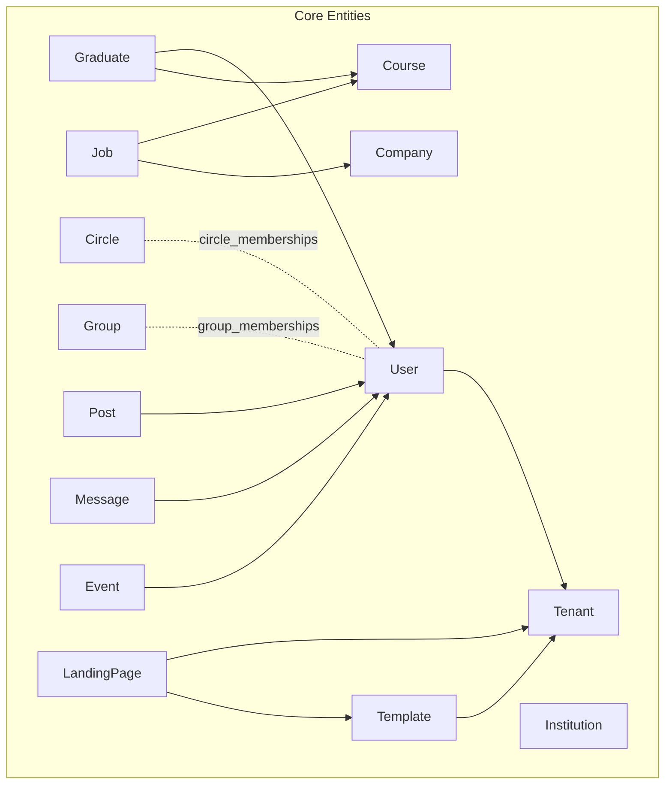

**Diagram sources**
- [User.php:124-137](file://app/Models/User.php#L124-L137)
- [Tenant.php:48-84](file://app/Models/Tenant.php#L48-L84)
- [Graduate.php:61-79](file://app/Models/Graduate.php#L61-L79)
- [Job.php:73-81](file://app/Models/Job.php#L73-L81)
- [Company.php:34-45](file://app/Models/Company.php#L34-L45)
- [Course.php:55-68](file://app/Models/Course.php#L55-L68)
- [Circle.php:31-36](file://app/Models/Circle.php#L31-L36)
- [Group.php:50-55](file://app/Models/Group.php#L50-L55)
- [Post.php:36-39](file://app/Models/Post.php#L36-L39)
- [Message.php:50-61](file://app/Models/Message.php#L50-L61)
- [Event.php:124-137](file://app/Models/Event.php#L124-L137)
- [LandingPage.php:180-191](file://app/Models/LandingPage.php#L180-L191)
- [Template.php:178-181](file://app/Models/Template.php#L178-L181)

**Section sources**
- [User.php:124-137](file://app/Models/User.php#L124-L137)
- [Tenant.php:48-84](file://app/Models/Tenant.php#L48-L84)
- [Graduate.php:61-79](file://app/Models/Graduate.php#L61-L79)
- [Job.php:73-81](file://app/Models/Job.php#L73-L81)
- [Company.php:34-45](file://app/Models/Company.php#L34-L45)
- [Course.php:55-68](file://app/Models/Course.php#L55-L68)
- [Circle.php:31-36](file://app/Models/Circle.php#L31-L36)
- [Group.php:50-55](file://app/Models/Group.php#L50-L55)
- [Post.php:36-39](file://app/Models/Post.php#L36-L39)
- [Message.php:50-61](file://app/Models/Message.php#L50-L61)
- [Event.php:124-137](file://app/Models/Event.php#L124-L137)
- [LandingPage.php:180-191](file://app/Models/LandingPage.php#L180-L191)
- [Template.php:178-181](file://app/Models/Template.php#L178-L181)

## Core Components
This section outlines primary and foreign keys, many-to-many relationships, and key business rules.

- Users
  - Primary key: id
  - Foreign keys: institution_id → Tenants.id
  - Many-to-many:
    - user_skills → pivot table for skills
    - circle_memberships → Circle
    - group_memberships → Group
    - alumni_connections → User (self-referencing via requester_id/recipient_id)
  - Business rules:
    - User belongs to a single Tenant via institution_id
    - Connections are filtered by pivot status = accepted for default connections()

- Tenants
  - Primary key: id
  - Users, Courses, Employers, Jobs scoped by institution_id
  - Multi-tenancy isolation via tenant scoping in LandingPage and Template

- Graduates
  - Primary key: id
  - Foreign keys: user_id → Users.id, course_id → Courses.id, tenant_id → Tenants.id
  - Business rules:
    - One-to-one with User via user_id
    - Employment and profile completion tracked via attributes and scopes

- Jobs
  - Primary key: id
  - Foreign keys: course_id → Courses.id, employer_id → Employers.id
  - Business rules:
    - Status lifecycle (active/pending_approval/cancelled/paused/filled/expired)
    - Application deadline and renewal logic
    - Match scoring against Graduates’ skills and profile completion

- Companies
  - Primary key: id
  - Job postings relationship
  - Verified scope and industry scoping

- Institutions
  - Primary key: id
  - Users, Events, Groups owned by institution

- Courses
  - Primary key: id
  - Foreign key: institution_id → Tenants.id
  - Many-to-many with Jobs via course_id
  - Statistics computed for employment rates and average salaries

- Circles
  - Primary key: id
  - Many-to-many with Users via circle_memberships
  - Membership status and auto-generated membership rules

- Groups
  - Primary key: id
  - Many-to-many with Users via group_memberships
  - Privacy and role-based permissions (admin/moderator/member)

- Posts
  - Primary key: id
  - Foreign key: user_id → Users.id
  - Visibility controlled by circle_ids/group_ids JSON arrays and user membership

- Messages
  - Primary key: id
  - Foreign keys: conversation_id → Conversations.id, user_id → Users.id
  - Reply threading via reply_to_id
  - Read receipts via MessageRead

- Events
  - Primary key: id
  - Foreign keys: organizer_id → Users.id, institution_id → Institutions.id
  - Registration, check-in, networking, and reunion features

- LandingPages
  - Primary key: id
  - Foreign keys: template_id → Templates.id, tenant_id → Tenants.id
  - Tenant scoping via global scope and multi-tenant domain logic

- Templates
  - Primary key: id
  - Foreign keys: tenant_id → Tenants.id
  - Tenant scoping via global scope

**Section sources**
- [User.php:124-137](file://app/Models/User.php#L124-L137)
- [Tenant.php:48-84](file://app/Models/Tenant.php#L48-L84)
- [Graduate.php:61-79](file://app/Models/Graduate.php#L61-L79)
- [Job.php:73-81](file://app/Models/Job.php#L73-L81)
- [Company.php:34-45](file://app/Models/Company.php#L34-L45)
- [Institution.php:56-76](file://app/Models/Institution.php#L56-L76)
- [Course.php:55-68](file://app/Models/Course.php#L55-L68)
- [Circle.php:31-36](file://app/Models/Circle.php#L31-L36)
- [Group.php:50-55](file://app/Models/Group.php#L50-L55)
- [Post.php:36-39](file://app/Models/Post.php#L36-L39)
- [Message.php:50-61](file://app/Models/Message.php#L50-L61)
- [Event.php:124-137](file://app/Models/Event.php#L124-L137)
- [LandingPage.php:180-191](file://app/Models/LandingPage.php#L180-L191)
- [Template.php:178-181](file://app/Models/Template.php#L178-L181)

## Architecture Overview
The system enforces multi-tenancy by scoping LandingPages and Templates to the current tenant. Users are associated with a Tenant via institution_id, enabling tenant isolation across user-centric models. Many-to-many relationships are implemented via explicit pivot tables with additional pivot fields (e.g., timestamps, roles, statuses).

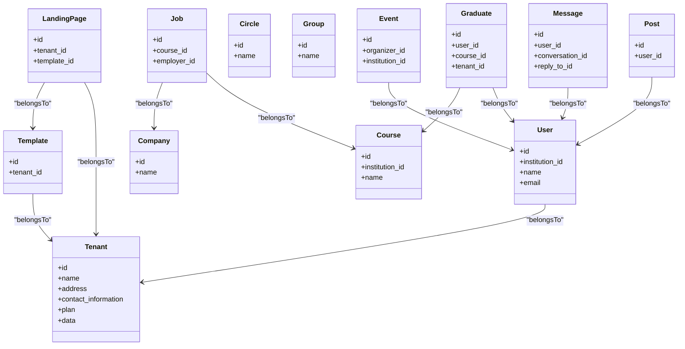

**Diagram sources**
- [Tenant.php:48-84](file://app/Models/Tenant.php#L48-L84)
- [User.php:124-137](file://app/Models/User.php#L124-L137)
- [Graduate.php:61-79](file://app/Models/Graduate.php#L61-L79)
- [Course.php:55-68](file://app/Models/Course.php#L55-L68)
- [Job.php:73-81](file://app/Models/Job.php#L73-L81)
- [Company.php:34-45](file://app/Models/Company.php#L34-L45)
- [Post.php:36-39](file://app/Models/Post.php#L36-L39)
- [Message.php:50-61](file://app/Models/Message.php#L50-L61)
- [Event.php:124-137](file://app/Models/Event.php#L124-L137)
- [LandingPage.php:180-191](file://app/Models/LandingPage.php#L180-L191)
- [Template.php:178-181](file://app/Models/Template.php#L178-L181)

## Detailed Component Analysis

### Users and Tenants
- Relationship: Users belong to a Tenant via institution_id; Tenants have collections of Users, Courses, Employers, and Jobs.
- Multi-tenancy: Tenant scoping is applied globally to LandingPage and Template models.

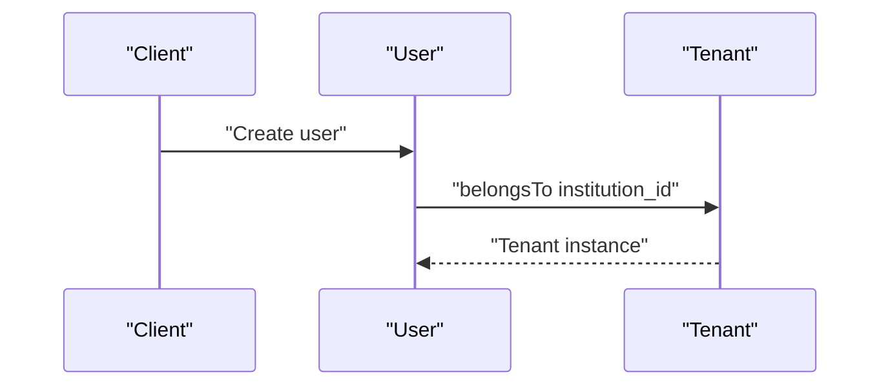

**Diagram sources**
- [User.php:124-137](file://app/Models/User.php#L124-L137)
- [Tenant.php:48-84](file://app/Models/Tenant.php#L48-L84)

**Section sources**
- [User.php:124-137](file://app/Models/User.php#L124-L137)
- [Tenant.php:48-84](file://app/Models/Tenant.php#L48-L84)

### Graduates and Courses
- Relationship: Graduates belong to a Course and a Tenant; Courses belong to a Tenant.
- Business rules: Employment status and profile completion are tracked and updated via model methods.

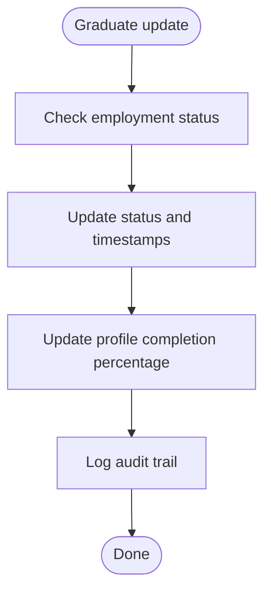

**Diagram sources**
- [Graduate.php:191-221](file://app/Models/Graduate.php#L191-L221)

**Section sources**
- [Graduate.php:61-79](file://app/Models/Graduate.php#L61-L79)
- [Course.php:55-68](file://app/Models/Course.php#L55-L68)

### Jobs and Matching
- Relationship: Jobs belong to a Course and a Company; Jobs maintain application statistics and match scores.
- Business rules: Status lifecycle, deadlines, and match scoring against Graduate profiles.

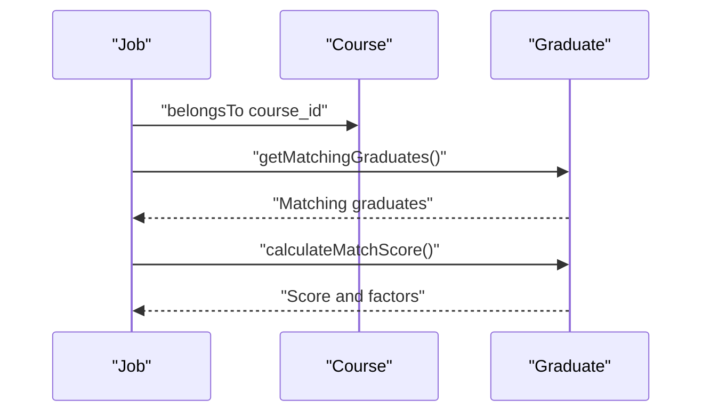

**Diagram sources**
- [Job.php:250-275](file://app/Models/Job.php#L250-L275)
- [Job.php:277-313](file://app/Models/Job.php#L277-L313)
- [Course.php:55-68](file://app/Models/Course.php#L55-L68)

**Section sources**
- [Job.php:73-81](file://app/Models/Job.php#L73-L81)
- [Job.php:250-275](file://app/Models/Job.php#L250-L275)
- [Job.php:277-313](file://app/Models/Job.php#L277-L313)

### Circles and Groups
- Relationship: Users belong to Circles and Groups via pivot tables with additional pivot fields (joined_at, status, role).
- Business rules: Membership status, privacy controls, and role-based permissions.

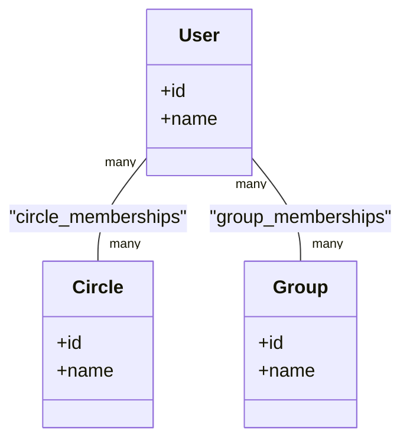

**Diagram sources**
- [User.php:207-219](file://app/Models/User.php#L207-L219)
- [Circle.php:31-36](file://app/Models/Circle.php#L31-L36)
- [Group.php:50-55](file://app/Models/Group.php#L50-L55)

**Section sources**
- [User.php:207-219](file://app/Models/User.php#L207-L219)
- [Circle.php:31-36](file://app/Models/Circle.php#L31-L36)
- [Group.php:50-55](file://app/Models/Group.php#L50-L55)

### Posts and Visibility
- Relationship: Posts belong to a User; visibility depends on circle_ids and group_ids JSON arrays and user membership.
- Business rules: Visibility scopes and membership checks for viewing and engagement.

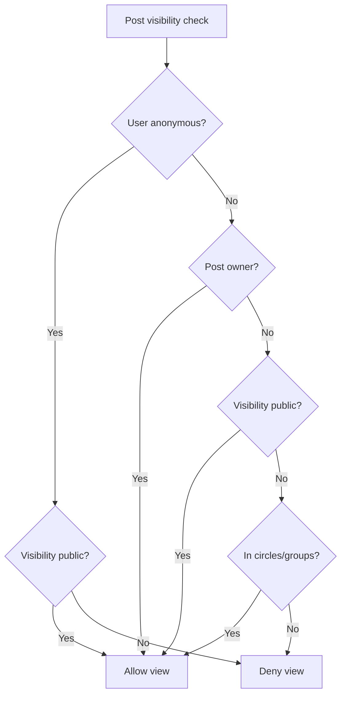

**Diagram sources**
- [Post.php:60-78](file://app/Models/Post.php#L60-L78)
- [Post.php:186-208](file://app/Models/Post.php#L186-L208)

**Section sources**
- [Post.php:36-39](file://app/Models/Post.php#L36-L39)
- [Post.php:60-78](file://app/Models/Post.php#L60-L78)
- [Post.php:186-208](file://app/Models/Post.php#L186-L208)

### Messages and Threads
- Relationship: Messages belong to a User and Conversation; threaded via reply_to_id; read receipts via MessageRead.
- Business rules: Reply detection, read receipts, and legacy compatibility fields.

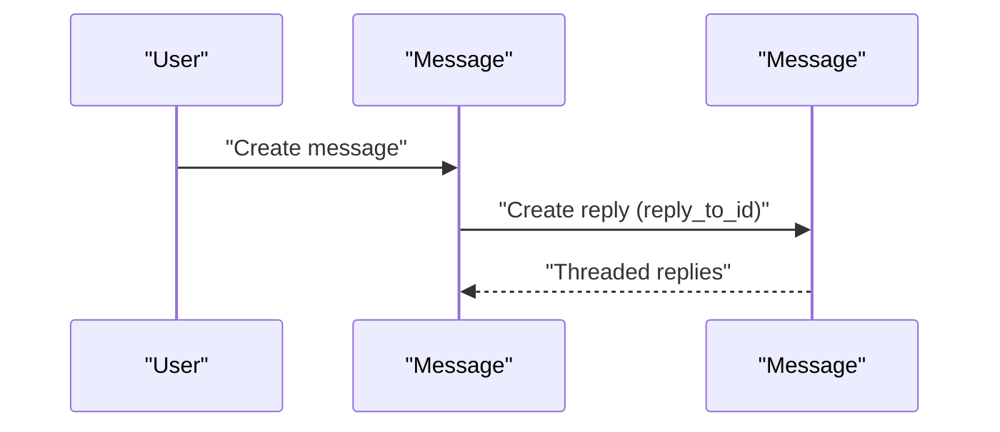

**Diagram sources**
- [Message.php:50-77](file://app/Models/Message.php#L50-L77)

**Section sources**
- [Message.php:50-77](file://app/Models/Message.php#L50-L77)

### Events and Registrations
- Relationship: Events belong to a User (organizer) and Institution; manage registrations, check-ins, and networking.
- Business rules: Capacity limits, registration deadlines, and visibility controls.

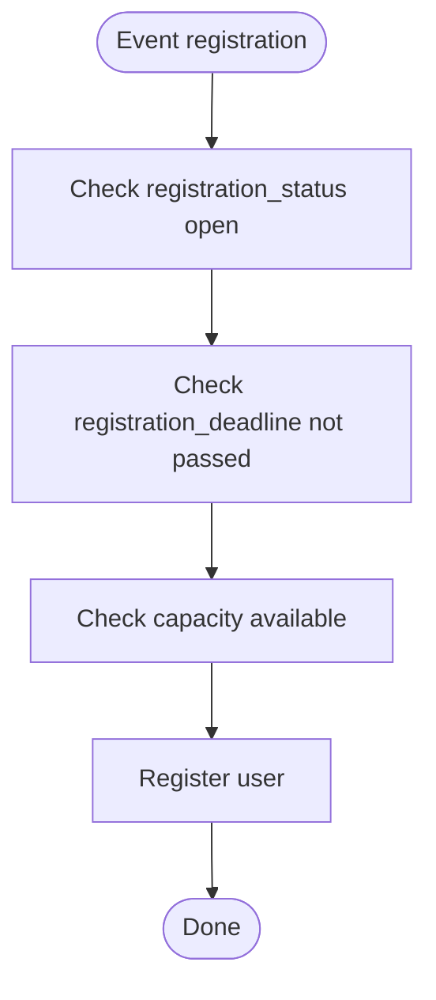

**Diagram sources**
- [Event.php:258-273](file://app/Models/Event.php#L258-L273)

**Section sources**
- [Event.php:124-137](file://app/Models/Event.php#L124-L137)
- [Event.php:258-273](file://app/Models/Event.php#L258-L273)

### LandingPages and Templates
- Relationship: LandingPages belong to a Tenant and Template; Templates belong to a Tenant.
- Multi-tenancy: Global scopes enforce tenant isolation; public URLs adapt to subdomain or path based on tenant configuration.

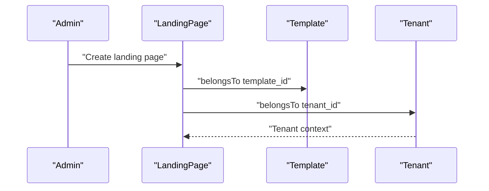

**Diagram sources**
- [LandingPage.php:180-191](file://app/Models/LandingPage.php#L180-L191)
- [Template.php:178-181](file://app/Models/Template.php#L178-L181)

**Section sources**
- [LandingPage.php:180-191](file://app/Models/LandingPage.php#L180-L191)
- [Template.php:178-181](file://app/Models/Template.php#L178-L181)

## Dependency Analysis
This section maps dependencies among core models and highlights many-to-many relationships and pivot tables.

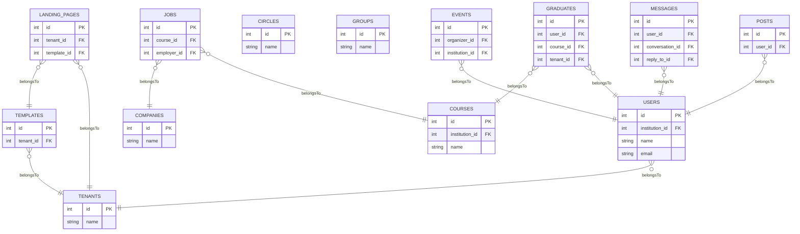

**Diagram sources**
- [User.php:124-137](file://app/Models/User.php#L124-L137)
- [Tenant.php:48-84](file://app/Models/Tenant.php#L48-L84)
- [Graduate.php:61-79](file://app/Models/Graduate.php#L61-L79)
- [Course.php:55-68](file://app/Models/Course.php#L55-L68)
- [Job.php:73-81](file://app/Models/Job.php#L73-L81)
- [Company.php:34-45](file://app/Models/Company.php#L34-L45)
- [Post.php:36-39](file://app/Models/Post.php#L36-L39)
- [Message.php:50-61](file://app/Models/Message.php#L50-L61)
- [Event.php:124-137](file://app/Models/Event.php#L124-L137)
- [LandingPage.php:180-191](file://app/Models/LandingPage.php#L180-L191)
- [Template.php:178-181](file://app/Models/Template.php#L178-L181)

**Section sources**
- [User.php:124-137](file://app/Models/User.php#L124-L137)
- [Tenant.php:48-84](file://app/Models/Tenant.php#L48-L84)
- [Graduate.php:61-79](file://app/Models/Graduate.php#L61-L79)
- [Course.php:55-68](file://app/Models/Course.php#L55-L68)
- [Job.php:73-81](file://app/Models/Job.php#L73-L81)
- [Company.php:34-45](file://app/Models/Company.php#L34-L45)
- [Post.php:36-39](file://app/Models/Post.php#L36-L39)
- [Message.php:50-61](file://app/Models/Message.php#L50-L61)
- [Event.php:124-137](file://app/Models/Event.php#L124-L137)
- [LandingPage.php:180-191](file://app/Models/LandingPage.php#L180-L191)
- [Template.php:178-181](file://app/Models/Template.php#L178-L181)

## Performance Considerations
- JSON-based visibility filters (Post) rely on JSON overlap queries; ensure appropriate indexing on JSON columns for performance.
- Many-to-many pivots (circle_memberships, group_memberships) store timestamps and additional fields; consider indexing pivot fields frequently queried (status, joined_at).
- Tenant scoping via global scopes avoids accidental cross-tenant queries; keep tenant context consistent during batch operations.
- Job matching and graduate filtering involve array-based skill matching; consider normalized skills tables for large-scale matching.

## Troubleshooting Guide
- Tenant isolation failures:
  - Verify tenant() context availability and that LandingPage and Template global scopes are active.
  - Confirm tenant_id is set consistently when creating LandingPages and Templates.
- Visibility issues for Posts:
  - Ensure circle_ids and group_ids arrays are properly populated and user memberships are active.
  - Use Post visibility scopes to confirm eligibility.
- Message threading anomalies:
  - Confirm reply_to_id is set correctly and MessageRead entries are created upon read.
- Event registration problems:
  - Validate registration_deadline, max_capacity, and current_attendees counters.
  - Check visibility and editing permissions for organizers and admins.

**Section sources**
- [LandingPage.php:94-106](file://app/Models/LandingPage.php#L94-L106)
- [Template.php:105-117](file://app/Models/Template.php#L105-L117)
- [Post.php:60-78](file://app/Models/Post.php#L60-L78)
- [Message.php:119-126](file://app/Models/Message.php#L119-L126)
- [Event.php:258-273](file://app/Models/Event.php#L258-L273)

## Conclusion
Alumate’s data model establishes clear tenant boundaries, robust many-to-many relationships with pivot tables, and strong business rules around visibility, matching, and lifecycle management. Multi-tenancy is enforced at the model level, ensuring data isolation and scalability. Proper indexing and scope usage are recommended to maintain performance as the system grows.