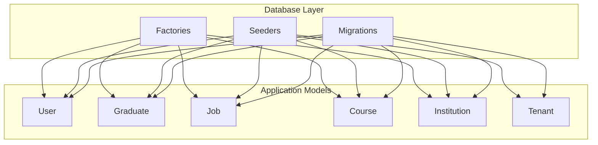
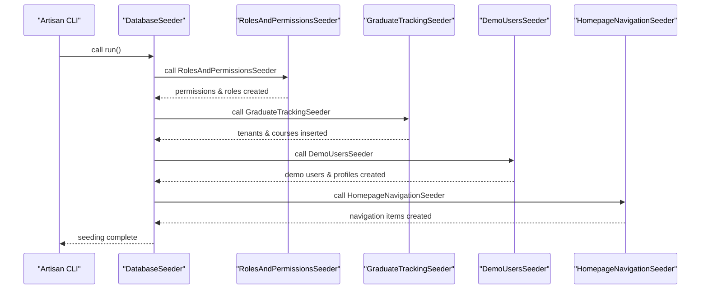
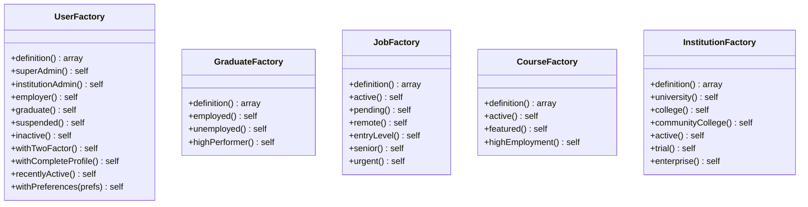
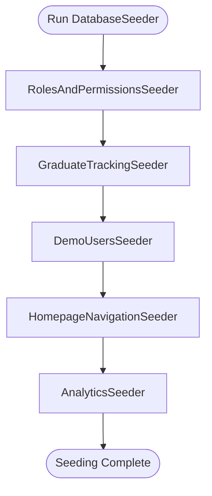
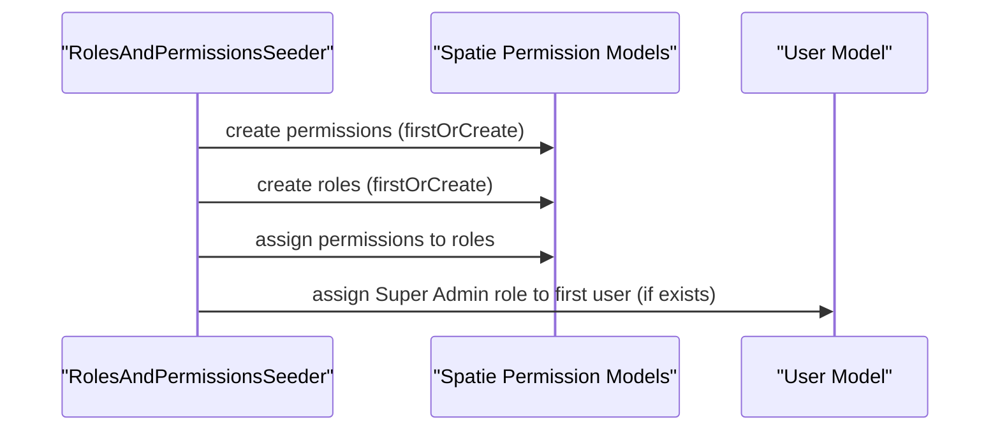
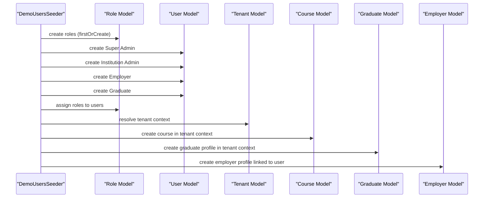
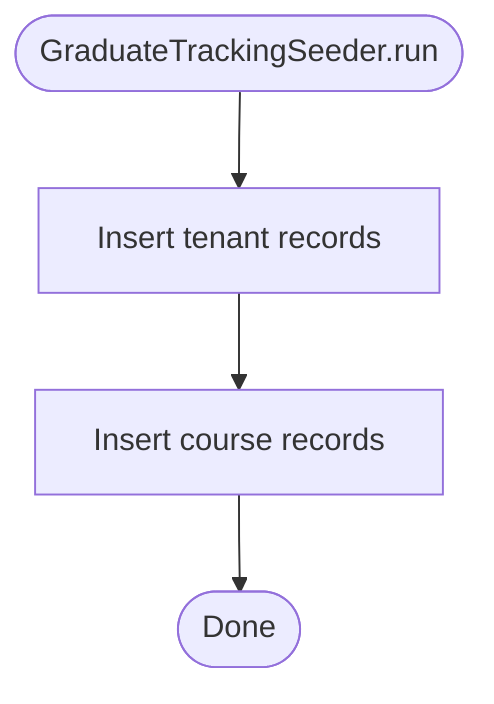
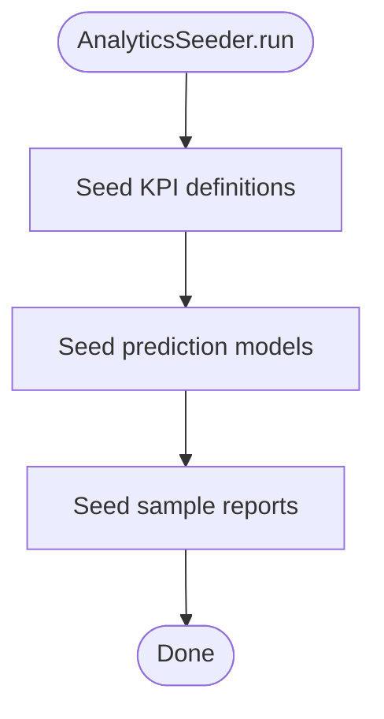
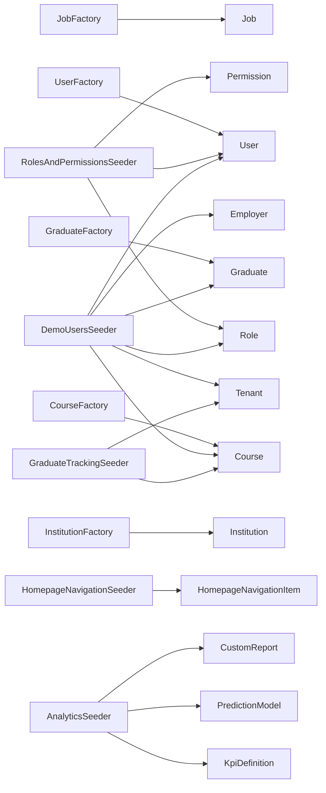

# Migration and Seeding Strategies

<cite>
**Referenced Files in This Document**
- [UserFactory.php](file://database/factories/UserFactory.php)
- [GraduateFactory.php](file://database/factories/GraduateFactory.php)
- [JobFactory.php](file://database/factories/JobFactory.php)
- [CourseFactory.php](file://database/factories/CourseFactory.php)
- [InstitutionFactory.php](file://database/factories/InstitutionFactory.php)
- [DatabaseSeeder.php](file://database/seeders/DatabaseSeeder.php)
- [RolesAndPermissionsSeeder.php](file://database/seeders/RolesAndPermissionsSeeder.php)
- [RolePermissionSeeder.php](file://database/seeders/RolePermissionSeeder.php)
- [GraduateTrackingSeeder.php](file://database/seeders/GraduateTrackingSeeder.php)
- [DemoUsersSeeder.php](file://database/seeders/DemoUsersSeeder.php)
- [HomepageNavigationSeeder.php](file://database/seeders/HomepageNavigationSeeder.php)
- [AnalyticsSeeder.php](file://database/seeders/AnalyticsSeeder.php)
</cite>

## Table of Contents
1. [Introduction](#introduction)
2. [Project Structure](#project-structure)
3. [Core Components](#core-components)
4. [Architecture Overview](#architecture-overview)
5. [Detailed Component Analysis](#detailed-component-analysis)
6. [Dependency Analysis](#dependency-analysis)
7. [Performance Considerations](#performance-considerations)
8. [Troubleshooting Guide](#troubleshooting-guide)
9. [Conclusion](#conclusion)
10. [Appendices](#appendices)

## Introduction
This document provides comprehensive guidance for Alumate’s database initialization and data population strategies. It covers migration file structure and naming conventions, sequential execution order, tenant-aware migrations and multi-tenant data isolation, factory patterns for realistic test data, seeders for initial system setup, role-permission configurations, demo data, and analytics fixtures. It also addresses rollback strategies, data transformation patterns, version control for schema changes, environment-specific seeding, data anonymization for testing, and bulk import/export procedures.

## Project Structure
Alumate organizes database-related assets under the database directory:
- Factories: Eloquent factories for generating realistic test data across models (users, graduates, jobs, courses, institutions).
- Seeders: Database seeders for roles/permissions, demo users, navigation, analytics fixtures, and basic tenant/course data.
- Migrations: Schema change definitions (not explored in this document due to absence of migration files in the provided context).

[No sources needed since this diagram shows conceptual workflow, not actual code structure]

## Core Components
- Factories define realistic, randomized attributes and state variants for models, enabling repeatable and varied test datasets.
- Seeders initialize baseline data, roles, permissions, navigation, and analytics fixtures, supporting local development and demos.
- Multi-tenant data isolation is achieved via tenant-scoped factories and seeder logic that initializes tenant contexts before creating tenant-bound records.

**Section sources**
- [UserFactory.php:25-68](file://database/factories/UserFactory.php#L25-L68)
- [GraduateFactory.php:14-53](file://database/factories/GraduateFactory.php#L14-L53)
- [JobFactory.php:14-70](file://database/factories/JobFactory.php#L14-L70)
- [CourseFactory.php:13-53](file://database/factories/CourseFactory.php#L13-L53)
- [InstitutionFactory.php:12-55](file://database/factories/InstitutionFactory.php#L12-L55)
- [DatabaseSeeder.php:13-26](file://database/seeders/DatabaseSeeder.php#L13-L26)

## Architecture Overview
The system uses Laravel’s database factories and seeders to build deterministic yet diverse datasets. Factories encapsulate model creation logic and state variants, while seeders orchestrate the order and scope of data creation. Multi-tenant isolation is enforced by scoping factories and seeders to tenant contexts.

**Diagram sources**
- [DatabaseSeeder.php:13-26](file://database/seeders/DatabaseSeeder.php#L13-L26)
- [RolesAndPermissionsSeeder.php:16-92](file://database/seeders/RolesAndPermissionsSeeder.php#L16-L92)
- [GraduateTrackingSeeder.php:13-80](file://database/seeders/GraduateTrackingSeeder.php#L13-L80)
- [DemoUsersSeeder.php:14-157](file://database/seeders/DemoUsersSeeder.php#L14-L157)
- [HomepageNavigationSeeder.php:13-72](file://database/seeders/HomepageNavigationSeeder.php#L13-L72)

## Detailed Component Analysis

### Factory Patterns and Data Generation
Factories produce realistic, randomized attributes and support state variants for quick generation of domain-relevant datasets.

- UserFactory
  - Generates user profiles with preferences, timezone/language, and optional two-factor settings.
  - Provides state variants for roles (super-admin, institution-admin, employer, graduate), suspension, and completeness.
  - Example snippet path: [UserFactory.php:25-68](file://database/factories/UserFactory.php#L25-L68)

- GraduateFactory
  - Creates graduate profiles scoped to tenants and courses, with employment and skill attributes.
  - Provides states for employment status, unemployment, and high performers.
  - Example snippet path: [GraduateFactory.php:14-53](file://database/factories/GraduateFactory.php#L14-L53)

- JobFactory
  - Generates job postings with required skills mapped to job titles, salary bands, and approval metadata.
  - Includes states for active, pending, remote, entry-level, senior, and urgent jobs.
  - Example snippet path: [JobFactory.php:14-70](file://database/factories/JobFactory.php#L14-L70)

- CourseFactory
  - Produces courses with department mapping, career paths, and employment statistics.
  - Includes states for active, featured, and high-employment courses.
  - Example snippet path: [CourseFactory.php:13-53](file://database/factories/CourseFactory.php#L13-L53)

- InstitutionFactory
  - Builds institution profiles with subscription plans, verification, and branding settings.
  - Provides states for university, college, community college, and enterprise tiers.
  - Example snippet path: [InstitutionFactory.php:12-55](file://database/factories/InstitutionFactory.php#L12-L55)

**Diagram sources**
- [UserFactory.php:13-244](file://database/factories/UserFactory.php#L13-L244)
- [GraduateFactory.php:10-87](file://database/factories/GraduateFactory.php#L10-L87)
- [JobFactory.php:10-143](file://database/factories/JobFactory.php#L10-L143)
- [CourseFactory.php:9-133](file://database/factories/CourseFactory.php#L9-L133)
- [InstitutionFactory.php:8-166](file://database/factories/InstitutionFactory.php#L8-L166)

**Section sources**
- [UserFactory.php:25-244](file://database/factories/UserFactory.php#L25-L244)
- [GraduateFactory.php:14-87](file://database/factories/GraduateFactory.php#L14-L87)
- [JobFactory.php:14-143](file://database/factories/JobFactory.php#L14-L143)
- [CourseFactory.php:13-133](file://database/factories/CourseFactory.php#L13-L133)
- [InstitutionFactory.php:12-166](file://database/factories/InstitutionFactory.php#L12-L166)

### Seeding Strategy and Execution Order
The DatabaseSeeder orchestrates the seeding pipeline, ensuring dependencies are satisfied and data is created in the correct order.

**Diagram sources**
- [DatabaseSeeder.php:13-26](file://database/seeders/DatabaseSeeder.php#L13-L26)

**Section sources**
- [DatabaseSeeder.php:13-26](file://database/seeders/DatabaseSeeder.php#L13-L26)

### Role and Permission Initialization
Two complementary seeders establish roles, permissions, and assignments:
- RolesAndPermissionsSeeder: Defines comprehensive permissions and role sets, including Super Admin, Institution Admin, Graduate, Employer, Student, and Tutor.
- RolePermissionSeeder: Creates a smaller set of permissions and assigns them to admin, moderator, and user roles.

**Diagram sources**
- [RolesAndPermissionsSeeder.php:16-92](file://database/seeders/RolesAndPermissionsSeeder.php#L16-L92)
- [RolePermissionSeeder.php:15-62](file://database/seeders/RolePermissionSeeder.php#L15-L62)

**Section sources**
- [RolesAndPermissionsSeeder.php:16-92](file://database/seeders/RolesAndPermissionsSeeder.php#L16-L92)
- [RolePermissionSeeder.php:15-62](file://database/seeders/RolePermissionSeeder.php#L15-L62)

### Demo Users and Multi-Tenant Profiles
DemoUsersSeeder creates a complete set of users across roles and scopes, including:
- Super Admin, Institution Admin, Employer, and Graduate accounts.
- Employer and Graduate profiles created within the tenant context to ensure proper isolation.
- Role assignments and permission synchronization.

**Diagram sources**
- [DemoUsersSeeder.php:14-157](file://database/seeders/DemoUsersSeeder.php#L14-L157)

**Section sources**
- [DemoUsersSeeder.php:14-157](file://database/seeders/DemoUsersSeeder.php#L14-L157)

### Basic Tenant and Course Data
GraduateTrackingSeeder inserts foundational tenant and course records for demonstration and testing.

**Diagram sources**
- [GraduateTrackingSeeder.php:13-80](file://database/seeders/GraduateTrackingSeeder.php#L13-L80)

**Section sources**
- [GraduateTrackingSeeder.php:13-80](file://database/seeders/GraduateTrackingSeeder.php#L13-L80)

### Navigation and Analytics Fixtures
- HomepageNavigationSeeder clears existing navigation items and rebuilds the main menu with dropdowns and child links.
- AnalyticsSeeder seeds KPI definitions, prediction models, and sample reports, including scheduling and formatting configurations.

**Diagram sources**
- [AnalyticsSeeder.php:13-351](file://database/seeders/AnalyticsSeeder.php#L13-L351)

**Section sources**
- [HomepageNavigationSeeder.php:13-72](file://database/seeders/HomepageNavigationSeeder.php#L13-L72)
- [AnalyticsSeeder.php:13-351](file://database/seeders/AnalyticsSeeder.php#L13-L351)

## Dependency Analysis
- Factories depend on Faker and model classes to generate domain-relevant data.
- Seeders depend on models and external libraries (e.g., Spatie Permission) to create roles, permissions, and navigation.
- Multi-tenant isolation depends on tenant resolution and initialization prior to creating tenant-scoped records.

**Diagram sources**
- [UserFactory.php:13-244](file://database/factories/UserFactory.php#L13-L244)
- [GraduateFactory.php:10-87](file://database/factories/GraduateFactory.php#L10-L87)
- [JobFactory.php:10-143](file://database/factories/JobFactory.php#L10-L143)
- [CourseFactory.php:9-133](file://database/factories/CourseFactory.php#L9-L133)
- [InstitutionFactory.php:8-166](file://database/factories/InstitutionFactory.php#L8-L166)
- [RolesAndPermissionsSeeder.php:16-92](file://database/seeders/RolesAndPermissionsSeeder.php#L16-L92)
- [DemoUsersSeeder.php:14-157](file://database/seeders/DemoUsersSeeder.php#L14-L157)
- [GraduateTrackingSeeder.php:13-80](file://database/seeders/GraduateTrackingSeeder.php#L13-L80)
- [HomepageNavigationSeeder.php:13-72](file://database/seeders/HomepageNavigationSeeder.php#L13-L72)
- [AnalyticsSeeder.php:13-351](file://database/seeders/AnalyticsSeeder.php#L13-L351)

**Section sources**
- [DatabaseSeeder.php:13-26](file://database/seeders/DatabaseSeeder.php#L13-L26)

## Performance Considerations
- Batch insertions: Use insertOrIgnore for initial tenant and course data to minimize overhead during seeding.
- Caching: Clear permission caches when reseeding roles/permissions to avoid stale authorizations.
- Tenant initialization: Initialize tenant context before creating tenant-scoped records to prevent unnecessary cross-tenant writes.
- Factory reuse: Prefer factory states to reduce duplication and improve maintainability.

[No sources needed since this section provides general guidance]

## Troubleshooting Guide
- Duplicate permissions/roles: Use firstOrCreate or updateOrCreate patterns to avoid conflicts.
- Missing tenant context: Ensure tenant initialization before creating tenant-scoped records.
- Role assignment failures: Verify role names and permission names match those created by seeders.
- Navigation inconsistencies: Clear existing navigation items before rebuilding to avoid orphaned entries.

**Section sources**
- [RolesAndPermissionsSeeder.php:18-44](file://database/seeders/RolesAndPermissionsSeeder.php#L18-L44)
- [DemoUsersSeeder.php:118-149](file://database/seeders/DemoUsersSeeder.php#L118-L149)
- [HomepageNavigationSeeder.php:15-16](file://database/seeders/HomepageNavigationSeeder.php#L15-L16)

## Conclusion
Alumate’s migration and seeding strategy leverages Laravel factories and seeders to deliver robust, tenant-aware dataset initialization. Factories provide flexible, realistic data generation, while seeders enforce a logical execution order and isolate data per tenant. The combination supports local development, demos, and analytics fixture setup with clear extension points for additional environments and datasets.

[No sources needed since this section summarizes without analyzing specific files]

## Appendices

### Migration File Structure and Naming Conventions
- Naming convention: Use descriptive prefixes indicating intent (e.g., create_, add_, remove_, rename_) followed by resource names and timestamps.
- Structure: Keep related changes in single migration files; split destructive changes into separate migrations for safer rollbacks.
- Version control: Commit migrations alongside feature branches; document breaking changes and rollback steps.

[No sources needed since this section provides general guidance]

### Sequential Execution Order
- Dependencies: Seeders should be ordered to satisfy foreign keys and model prerequisites.
- Recommended order: Roles and permissions → Basic tenant/course data → Demo users → Navigation → Analytics fixtures.

[No sources needed since this section provides general guidance]

### Tenant-Aware Migrations and Multi-Tenant Isolation
- Isolation pattern: Resolve tenant context before creating tenant-scoped records; ensure tenant_id is present on tenant-bound models.
- Schema considerations: Include tenant_id on multi-tenant tables; use tenant-specific indexes and constraints where appropriate.

[No sources needed since this section provides general guidance]

### Rollback Strategies and Data Transformation Patterns
- Rollback-friendly migrations: Split destructive changes; prefer add/remove columns over modify; use safe defaults.
- Data transformation: Normalize data in seeders; avoid complex transformations in migrations; keep transformations idempotent.

[No sources needed since this section provides general guidance]

### Environment-Specific Seeding
- Local development: Use factories for rapid iteration; seeders for baseline data.
- Staging/production: Limit seeders to non-sensitive fixtures; prefer controlled imports for real data.

[No sources needed since this section provides general guidance]

### Data Anonymization for Testing
- Anonymization: Replace personally identifiable information with Faker-generated values; mask or remove sensitive fields.
- Consistency: Maintain referential integrity by anonymizing related records together.

[No sources needed since this section provides general guidance]

### Bulk Import/Export Procedures
- Import: Use Laravel Excel for CSV/Excel imports; validate data before insertion; batch inserts for performance.
- Export: Use Laravel Excel for standardized exports; anonymize data for sharing.

[No sources needed since this section provides general guidance]