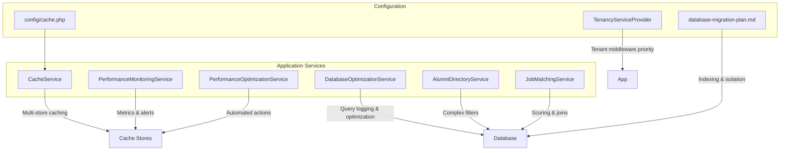
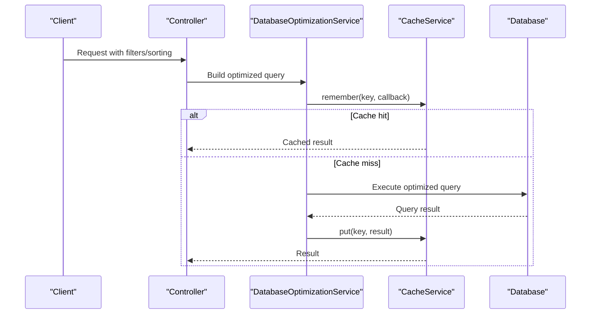
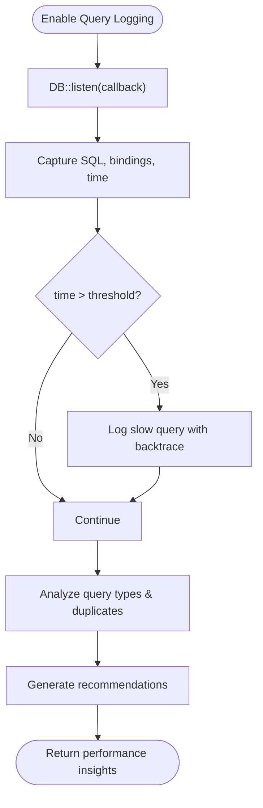
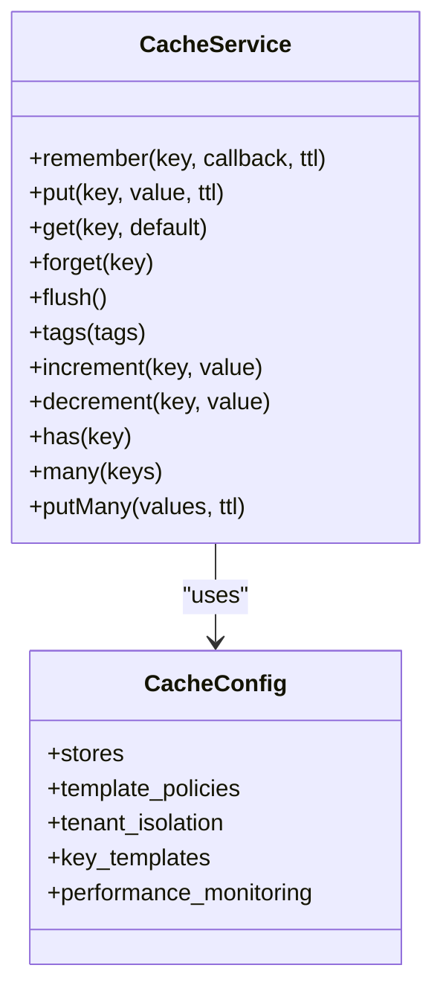
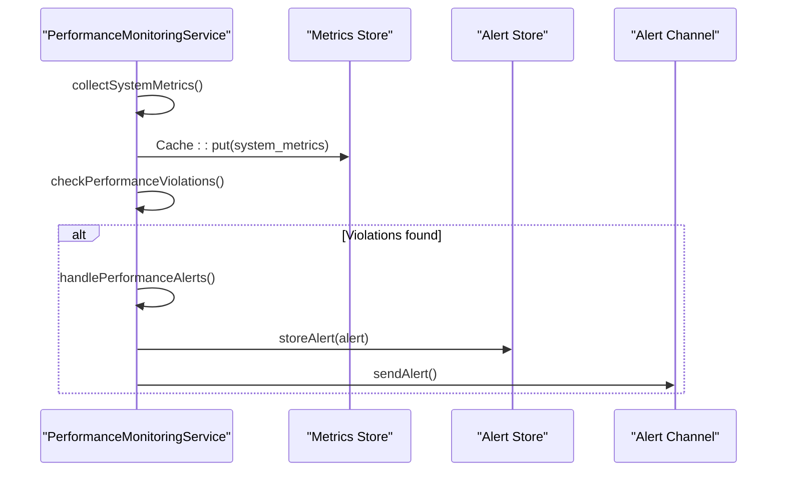
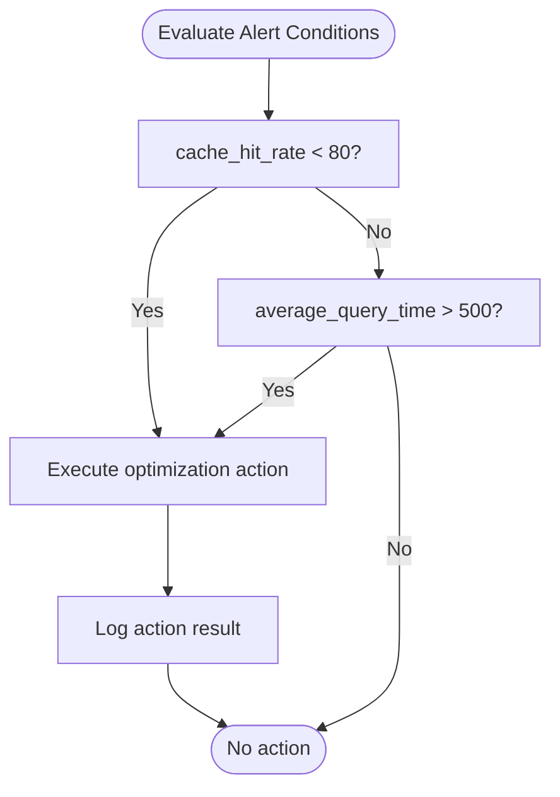
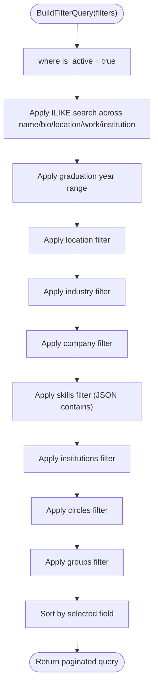
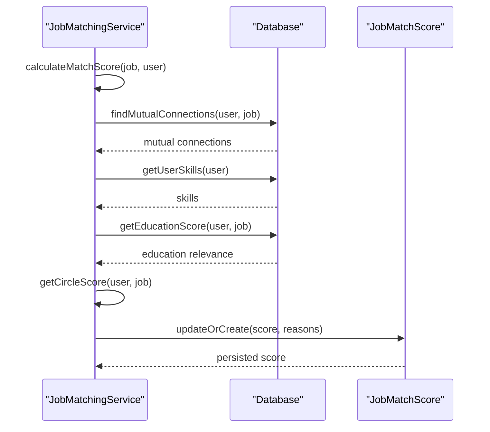
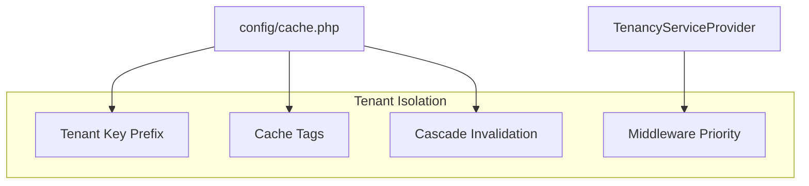
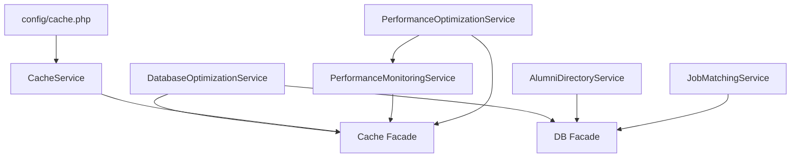

# Performance Optimization and Indexing

<cite>
**Referenced Files in This Document**
- [DatabaseOptimizationService.php](file://app/Services/DatabaseOptimizationService.php)
- [CacheService.php](file://app/Services/CacheService.php)
- [PerformanceMonitoringService.php](file://app/Services/PerformanceMonitoringService.php)
- [PerformanceOptimizationService.php](file://app/Services/PerformanceOptimizationService.php)
- [AlumniDirectoryService.php](file://app/Services/AlumniDirectoryService.php)
- [JobMatchingService.php](file://app/Services/JobMatchingService.php)
- [cache.php](file://config/cache.php)
- [TenancyServiceProvider.php](file://app/Providers/TenancyServiceProvider.php)
- [database-migration-plan.md](file://database-migration-plan.md)
</cite>

## Table of Contents
1. [Introduction](#introduction)
2. [Project Structure](#project-structure)
3. [Core Components](#core-components)
4. [Architecture Overview](#architecture-overview)
5. [Detailed Component Analysis](#detailed-component-analysis)
6. [Dependency Analysis](#dependency-analysis)
7. [Performance Considerations](#performance-considerations)
8. [Troubleshooting Guide](#troubleshooting-guide)
9. [Conclusion](#conclusion)

## Introduction
This document provides comprehensive performance optimization guidance for Alumate’s database design and runtime systems. It focuses on indexing strategies, query optimization, caching patterns, partitioning considerations, tenant isolation, and monitoring. The content synthesizes existing implementations and proposes targeted enhancements for graduate filtering, job matching, and alumni directory queries, while ensuring scalability and operational reliability.

## Project Structure
The performance-related logic spans several services and configuration files:
- Database optimization and query logging are handled by a dedicated service.
- Caching is centralized via a cache service and configured with multi-store support.
- Performance monitoring and alerting are implemented in a monitoring service.
- Specialized services for alumni directory and job matching encapsulate complex queries and scoring.
- Configuration defines cache stores, policies, and tenant isolation strategies.
- Migration plans outline indexing and tenant isolation for new schema designs.

**Diagram sources**
- [DatabaseOptimizationService.php:1-414](file://app/Services/DatabaseOptimizationService.php#L1-L414)
- [CacheService.php:1-173](file://app/Services/CacheService.php#L1-L173)
- [PerformanceMonitoringService.php:1-433](file://app/Services/PerformanceMonitoringService.php#L1-L433)
- [PerformanceOptimizationService.php:884-918](file://app/Services/PerformanceOptimizationService.php#L884-L918)
- [AlumniDirectoryService.php:1-464](file://app/Services/AlumniDirectoryService.php#L1-L464)
- [JobMatchingService.php:1-362](file://app/Services/JobMatchingService.php#L1-L362)
- [cache.php:1-328](file://config/cache.php#L1-L328)
- [TenancyServiceProvider.php:1-41](file://app/Providers/TenancyServiceProvider.php#L1-L41)
- [database-migration-plan.md:1-289](file://database-migration-plan.md#L1-L289)

**Section sources**
- [DatabaseOptimizationService.php:1-414](file://app/Services/DatabaseOptimizationService.php#L1-L414)
- [CacheService.php:1-173](file://app/Services/CacheService.php#L1-L173)
- [PerformanceMonitoringService.php:1-433](file://app/Services/PerformanceMonitoringService.php#L1-L433)
- [PerformanceOptimizationService.php:884-918](file://app/Services/PerformanceOptimizationService.php#L884-L918)
- [AlumniDirectoryService.php:1-464](file://app/Services/AlumniDirectoryService.php#L1-L464)
- [JobMatchingService.php:1-362](file://app/Services/JobMatchingService.php#L1-L362)
- [cache.php:1-328](file://config/cache.php#L1-L328)
- [TenancyServiceProvider.php:1-41](file://app/Providers/TenancyServiceProvider.php#L1-L41)
- [database-migration-plan.md:1-289](file://database-migration-plan.md#L1-L289)

## Core Components
- DatabaseOptimizationService: Implements query logging, slow query detection, index creation, and query performance analysis. It also optimizes database connection settings and caches frequently accessed data.
- CacheService: Provides a unified interface for caching with robust error handling, tag-based invalidation, and multi-store support.
- PerformanceMonitoringService: Collects system metrics, enforces performance budgets, and triggers alerts with cooldowns and persistence.
- PerformanceOptimizationService: Evaluates performance metrics and executes automated optimization actions based on alert rules.
- AlumniDirectoryService: Builds complex filter queries across user profiles, educations, work experiences, and social data with pagination and eager loading.
- JobMatchingService: Computes composite match scores using connections, skills, education, and circles with scoring logic and detailed reasons.
- Cache configuration: Defines multi-layer cache stores, tenant isolation policies, invalidation strategies, and key templates for performance monitoring.

**Section sources**
- [DatabaseOptimizationService.php:1-414](file://app/Services/DatabaseOptimizationService.php#L1-L414)
- [CacheService.php:1-173](file://app/Services/CacheService.php#L1-L173)
- [PerformanceMonitoringService.php:1-433](file://app/Services/PerformanceMonitoringService.php#L1-L433)
- [PerformanceOptimizationService.php:884-918](file://app/Services/PerformanceOptimizationService.php#L884-L918)
- [AlumniDirectoryService.php:1-464](file://app/Services/AlumniDirectoryService.php#L1-L464)
- [JobMatchingService.php:1-362](file://app/Services/JobMatchingService.php#L1-L362)
- [cache.php:1-328](file://config/cache.php#L1-L328)

## Architecture Overview
The performance architecture integrates query optimization, caching tiers, monitoring, and tenant-aware policies. DatabaseOptimizationService captures query traces and slow queries, while CacheService and configuration provide multi-store caching with tenant isolation. PerformanceMonitoringService tracks system metrics and triggers alerts, and PerformanceOptimizationService applies automated remediation actions.

**Diagram sources**
- [DatabaseOptimizationService.php:57-84](file://app/Services/DatabaseOptimizationService.php#L57-L84)
- [CacheService.php:16-27](file://app/Services/CacheService.php#L16-L27)

## Detailed Component Analysis

### Database Optimization Service
Key responsibilities:
- Query logging and slow query detection with configurable thresholds.
- Creation of composite indexes tailored to common search patterns (employment status, course employment, skills, job status/course, required skills).
- Query performance analysis with type grouping, duplicate detection, and recommendations.
- Database connection tuning for improved throughput and reduced latency.

Recommended enhancements:
- Add JSON path indexes for employment status and skills arrays.
- Introduce partial indexes for active statuses and recent timestamps.
- Implement materialized aggregates for frequently accessed summary statistics.

**Diagram sources**
- [DatabaseOptimizationService.php:25-52](file://app/Services/DatabaseOptimizationService.php#L25-L52)
- [DatabaseOptimizationService.php:254-298](file://app/Services/DatabaseOptimizationService.php#L254-L298)

**Section sources**
- [DatabaseOptimizationService.php:25-52](file://app/Services/DatabaseOptimizationService.php#L25-L52)
- [DatabaseOptimizationService.php:200-249](file://app/Services/DatabaseOptimizationService.php#L200-L249)
- [DatabaseOptimizationService.php:254-298](file://app/Services/DatabaseOptimizationService.php#L254-L298)
- [DatabaseOptimizationService.php:389-412](file://app/Services/DatabaseOptimizationService.php#L389-L412)

### Cache Service and Configuration
Key responsibilities:
- Unified caching interface with error handling and fallbacks.
- Multi-store support (array, redis, database) enabling layered caching strategies.
- Tag-based invalidation and TTL management for tenant isolation.
- Key templates and policies for consistent cache management.

Tenant isolation strategies:
- Key prefixing with tenant identifiers.
- Tag-based invalidation cascading across tenant boundaries.
- Dedicated stores for L1/L2/L3 cache layers.

**Diagram sources**
- [CacheService.php:1-173](file://app/Services/CacheService.php#L1-L173)
- [cache.php:34-159](file://config/cache.php#L34-L159)
- [cache.php:184-328](file://config/cache.php#L184-L328)

**Section sources**
- [CacheService.php:1-173](file://app/Services/CacheService.php#L1-L173)
- [cache.php:34-159](file://config/cache.php#L34-L159)
- [cache.php:184-328](file://config/cache.php#L184-L328)

### Performance Monitoring and Alerting
Key responsibilities:
- System metrics collection (memory, CPU, response time).
- Component-level performance tracking with budgets and violations.
- Alerting with cooldowns and persistent storage for dashboards.
- Performance reports and recommendations generation.

**Diagram sources**
- [PerformanceMonitoringService.php:62-82](file://app/Services/PerformanceMonitoringService.php#L62-L82)
- [PerformanceMonitoringService.php:87-138](file://app/Services/PerformanceMonitoringService.php#L87-L138)
- [PerformanceMonitoringService.php:207-218](file://app/Services/PerformanceMonitoringService.php#L207-L218)

**Section sources**
- [PerformanceMonitoringService.php:62-82](file://app/Services/PerformanceMonitoringService.php#L62-L82)
- [PerformanceMonitoringService.php:87-138](file://app/Services/PerformanceMonitoringService.php#L87-L138)
- [PerformanceMonitoringService.php:207-218](file://app/Services/PerformanceMonitoringService.php#L207-L218)

### Automated Performance Optimization
Key responsibilities:
- Evaluate metrics against alert conditions.
- Execute optimization actions and log results.
- Maintain action history and severity levels.

**Diagram sources**
- [PerformanceOptimizationService.php:909-918](file://app/Services/PerformanceOptimizationService.php#L909-L918)

**Section sources**
- [PerformanceOptimizationService.php:884-904](file://app/Services/PerformanceOptimizationService.php#L884-L904)
- [PerformanceOptimizationService.php:909-918](file://app/Services/PerformanceOptimizationService.php#L909-L918)

### Alumni Directory Queries
Key responsibilities:
- Filter alumni by search terms, graduation years, location, industry, company, skills, institutions, circles, and groups.
- Eager load related data to prevent N+1 queries.
- Paginate results and sort by name, location, graduation year, or created_at.

Recommended enhancements:
- Composite indexes for filters: (location, is_active), (graduation_year, course_id), (skills JSON), (institution_id, is_active).
- Denormalize frequently filtered attributes to reduce joins.
- Use materialized views for top locations/industries/skills.

**Diagram sources**
- [AlumniDirectoryService.php:30-155](file://app/Services/AlumniDirectoryService.php#L30-L155)

**Section sources**
- [AlumniDirectoryService.php:17-25](file://app/Services/AlumniDirectoryService.php#L17-L25)
- [AlumniDirectoryService.php:30-155](file://app/Services/AlumniDirectoryService.php#L30-L155)

### Job Matching Queries
Key responsibilities:
- Calculate composite match scores using connections, skills, education, and circles.
- Store or update match scores with detailed reasons.
- Retrieve mutual connections and compute overlap with company employees.

Recommended enhancements:
- Composite indexes for job status and course, required skills array, and user skills JSON.
- Precompute match scores periodically for active jobs and users.
- Use window functions or materialized aggregates for top matches.

**Diagram sources**
- [JobMatchingService.php:26-41](file://app/Services/JobMatchingService.php#L26-L41)
- [JobMatchingService.php:258-280](file://app/Services/JobMatchingService.php#L258-L280)

**Section sources**
- [JobMatchingService.php:26-41](file://app/Services/JobMatchingService.php#L26-L41)
- [JobMatchingService.php:258-280](file://app/Services/JobMatchingService.php#L258-L280)

### Tenant Isolation and Multi-Tenant Performance
Key responsibilities:
- Tenant-aware cache key templates and tag invalidation.
- Middleware priority configuration to minimize overhead on central routes.
- Migration plan for tenant isolation across new schema designs.

**Diagram sources**
- [cache.php:229-263](file://config/cache.php#L229-L263)
- [TenancyServiceProvider.php:29-40](file://app/Providers/TenancyServiceProvider.php#L29-L40)

**Section sources**
- [cache.php:229-263](file://config/cache.php#L229-L263)
- [TenancyServiceProvider.php:29-40](file://app/Providers/TenancyServiceProvider.php#L29-L40)
- [database-migration-plan.md:262-268](file://database-migration-plan.md#L262-L268)

## Dependency Analysis
- DatabaseOptimizationService depends on DB facade for query logging and statement execution, and on Cache for result caching.
- CacheService depends on Laravel Cache facade and supports multiple drivers.
- PerformanceMonitoringService depends on Cache for storing metrics and alerts.
- PerformanceOptimizationService depends on metrics collected by PerformanceMonitoringService and Cache for storing performance metrics.
- AlumniDirectoryService and JobMatchingService depend on Eloquent relationships and DB facade for complex queries.
- Configuration files define cache stores and policies that underpin all caching strategies.

**Diagram sources**
- [DatabaseOptimizationService.php:5-8](file://app/Services/DatabaseOptimizationService.php#L5-L8)
- [CacheService.php:5-7](file://app/Services/CacheService.php#L5-L7)
- [PerformanceMonitoringService.php:5-11](file://app/Services/PerformanceMonitoringService.php#L5-L11)
- [PerformanceOptimizationService.php:404-417](file://app/Services/PerformanceOptimizationService.php#L404-L417)
- [AlumniDirectoryService.php:9-10](file://app/Services/AlumniDirectoryService.php#L9-L10)
- [JobMatchingService.php:9-10](file://app/Services/JobMatchingService.php#L9-L10)
- [cache.php:34-159](file://config/cache.php#L34-L159)

**Section sources**
- [DatabaseOptimizationService.php:5-8](file://app/Services/DatabaseOptimizationService.php#L5-L8)
- [CacheService.php:5-7](file://app/Services/CacheService.php#L5-L7)
- [PerformanceMonitoringService.php:5-11](file://app/Services/PerformanceMonitoringService.php#L5-L11)
- [PerformanceOptimizationService.php:404-417](file://app/Services/PerformanceOptimizationService.php#L404-L417)
- [AlumniDirectoryService.php:9-10](file://app/Services/AlumniDirectoryService.php#L9-L10)
- [JobMatchingService.php:9-10](file://app/Services/JobMatchingService.php#L9-L10)
- [cache.php:34-159](file://config/cache.php#L34-L159)

## Performance Considerations
- Indexing strategies:
  - Composite indexes for common filters: (status, course_id) on jobs, (tenant_id, category) on templates, (tenant_id, status) on landing pages.
  - JSON path indexes for employment status and skills arrays.
  - Partial indexes for active records and recent timestamps.
- Query optimization:
  - Use raw queries for summaries and cached aggregates.
  - Eager load relationships to prevent N+1 queries.
  - Prefer EXISTS or LIMIT clauses to reduce result sets.
- Caching patterns:
  - Multi-layer caching: L1 (fast memory), L2 (Redis/Memcached), L3 (archive).
  - Tenant-aware keys and tag-based invalidation.
  - TTL tuning based on volatility and access frequency.
- Partitioning and tenant isolation:
  - Foreign keys with cascade deletes for clean tenant data removal.
  - Indexes on tenant_id for fast tenant isolation.
  - Consider table partitioning for large analytical tables by date ranges.
- Monitoring and alerting:
  - Track cache hit rates, slow queries, and system metrics.
  - Enforce budgets with cooldowns to avoid alert storms.
  - Automated remediation actions for recurring issues.

[No sources needed since this section provides general guidance]

## Troubleshooting Guide
- Slow query identification:
  - Review slow query logs captured by DatabaseOptimizationService.
  - Use analyzeQueryPerformance() to identify query types and duplicates.
  - Apply recommended index strategies and query restructuring.
- Cache issues:
  - Verify cache store availability and connectivity.
  - Check tag-based invalidation and key templates.
  - Monitor cache miss rates and adjust TTLs.
- Performance monitoring:
  - Review system metrics and component render times.
  - Investigate violations against budgets and trigger alerts.
  - Use recommendations to prioritize optimization efforts.

**Section sources**
- [DatabaseOptimizationService.php:254-298](file://app/Services/DatabaseOptimizationService.php#L254-L298)
- [PerformanceMonitoringService.php:87-138](file://app/Services/PerformanceMonitoringService.php#L87-L138)
- [PerformanceOptimizationService.php:423-434](file://app/Services/PerformanceOptimizationService.php#L423-L434)

## Conclusion
Alumate’s performance architecture combines targeted database indexing, multi-layer caching, and robust monitoring to deliver scalable and responsive experiences. By extending composite indexes, leveraging caching tiers, and applying automated optimization, the platform can efficiently support graduate filtering, job matching, and alumni directory queries while maintaining strong tenant isolation and operational reliability.