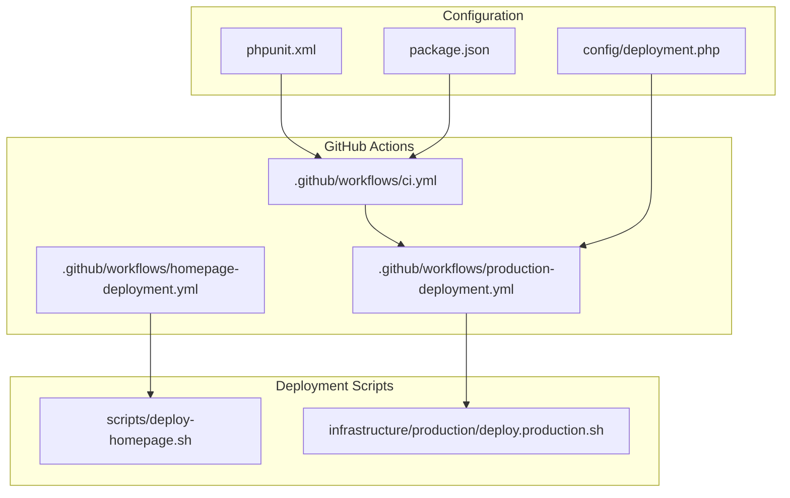
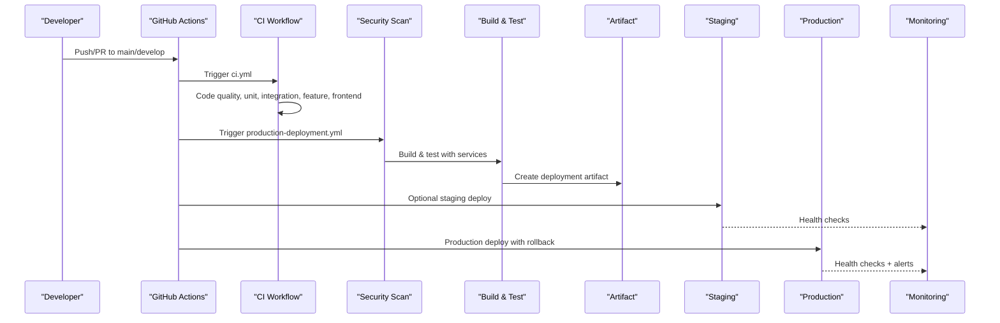
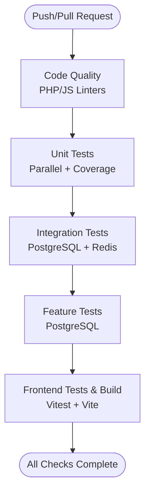
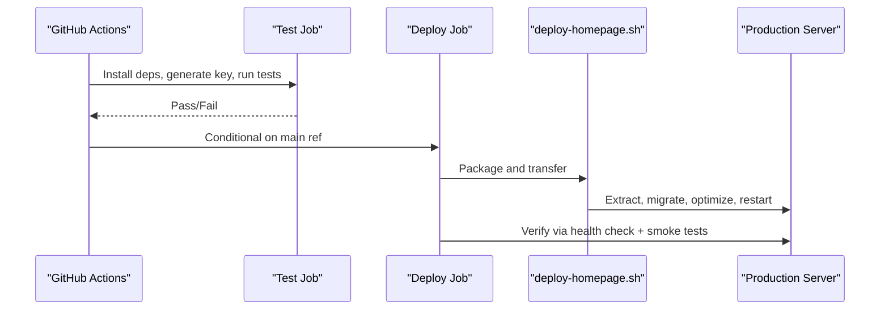
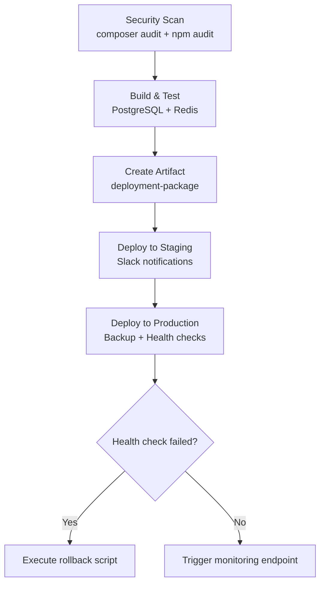
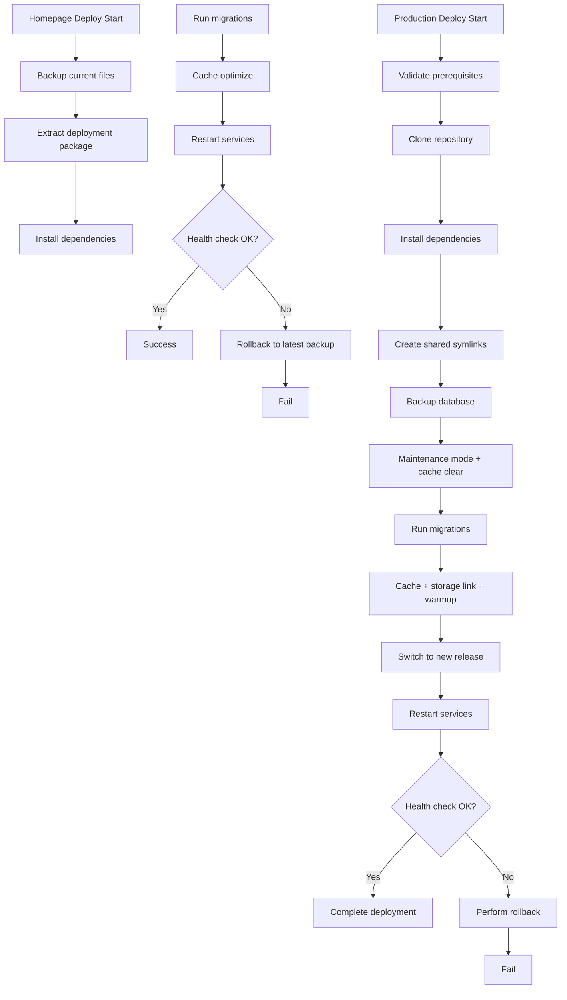
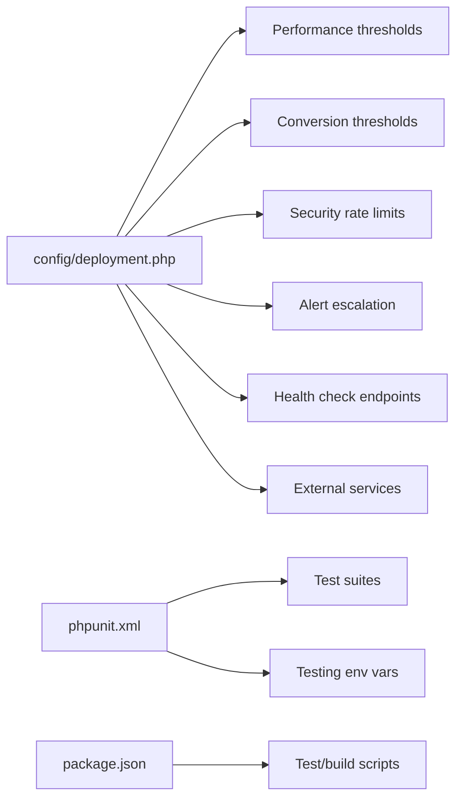
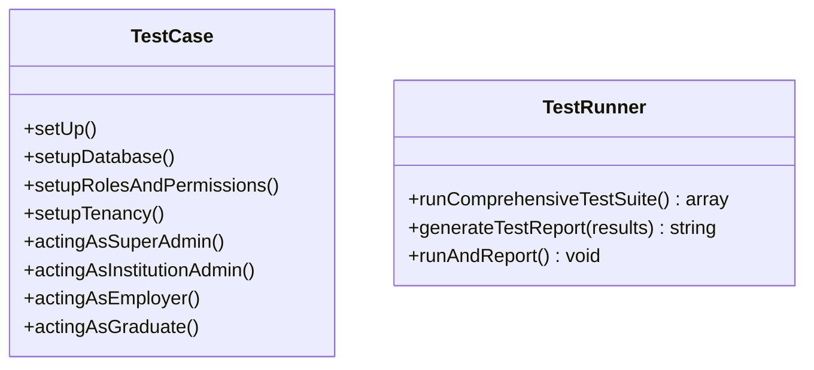
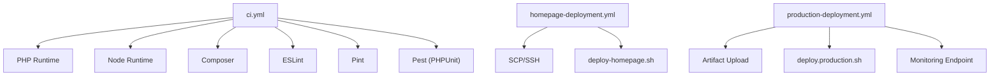

# CI/CD Pipelines

<cite>
**Referenced Files in This Document**
- [.github/workflows/ci.yml](file://.github/workflows/ci.yml)
- [.github/workflows/homepage-deployment.yml](file://.github/workflows/homepage-deployment.yml)
- [.github/workflows/production-deployment.yml](file://.github/workflows/production-deployment.yml)
- [deployment-plan.md](file://deployment-plan.md)
- [config/deployment.php](file://config/deployment.php)
- [scripts/deploy-homepage.sh](file://scripts/deploy-homepage.sh)
- [infrastructure/production/deploy.production.sh](file://infrastructure/production/deploy.production.sh)
- [phpunit.xml](file://phpunit.xml)
- [package.json](file://package.json)
- [tests/TestCase.php](file://tests/TestCase.php)
- [tests/TestRunner.php](file://tests/TestRunner.php)
- [.gitignore](file://.gitignore)
- [docker-compose.yml](file://docker-compose.yml)
- [infrastructure/production/docker-compose.prod.yml](file://infrastructure/production/docker-compose.prod.yml)
</cite>

## Table of Contents
1. [Introduction](#introduction)
2. [Project Structure](#project-structure)
3. [Core Components](#core-components)
4. [Architecture Overview](#architecture-overview)
5. [Detailed Component Analysis](#detailed-component-analysis)
6. [Dependency Analysis](#dependency-analysis)
7. [Performance Considerations](#performance-considerations)
8. [Troubleshooting Guide](#troubleshooting-guide)
9. [Conclusion](#conclusion)
10. [Appendices](#appendices)

## Introduction
This document describes the CI/CD implementation for automated testing, building, and deployment across environments. It covers GitHub Actions workflows for continuous integration, including code quality checks, unit, integration, feature, and frontend tests. It also documents deployment pipelines for staging and production with automated rollback capabilities, environment-specific configurations, secrets management, artifact handling, pipeline triggers, branch protection rules, and deployment approval processes. Practical examples of customization, failure handling, and performance optimization are included, along with monitoring and alerting integrations within CI/CD workflows.

## Project Structure
The CI/CD system is primarily defined by GitHub Actions workflows under .github/workflows and supporting deployment scripts and configuration files. The repository includes:
- GitHub Actions workflows for CI and deployments
- Deployment scripts for homepage and production environments
- Configuration for monitoring and alerting
- Test configuration and runner utilities
- Container orchestration for local and production environments

**Diagram sources**
- [.github/workflows/ci.yml:1-280](file://.github/workflows/ci.yml#L1-L280)
- [.github/workflows/homepage-deployment.yml:1-136](file://.github/workflows/homepage-deployment.yml#L1-L136)
- [.github/workflows/production-deployment.yml:1-366](file://.github/workflows/production-deployment.yml#L1-L366)
- [scripts/deploy-homepage.sh:1-85](file://scripts/deploy-homepage.sh#L1-L85)
- [infrastructure/production/deploy.production.sh:1-483](file://infrastructure/production/deploy.production.sh#L1-L483)
- [config/deployment.php:1-231](file://config/deployment.php#L1-L231)
- [phpunit.xml:1-65](file://phpunit.xml#L1-L65)
- [package.json:1-90](file://package.json#L1-L90)

**Section sources**
- [.github/workflows/ci.yml:1-280](file://.github/workflows/ci.yml#L1-L280)
- [.github/workflows/homepage-deployment.yml:1-136](file://.github/workflows/homepage-deployment.yml#L1-L136)
- [.github/workflows/production-deployment.yml:1-366](file://.github/workflows/production-deployment.yml#L1-L366)
- [config/deployment.php:1-231](file://config/deployment.php#L1-L231)

## Core Components
- Continuous Integration workflow validates code quality and executes unit, integration, feature, and frontend tests.
- Homepage deployment workflow targets specific paths and deploys homepage assets and backend components to production with verification and smoke tests.
- Production deployment workflow performs security scans, builds and tests artifacts, uploads deployment packages, optionally deploys to staging, and then to production with health checks and rollback support.
- Deployment scripts encapsulate zero-downtime and rollback logic for production and homepage deployments.
- Configuration files define monitoring/alerting thresholds and external service integrations.
- Test configuration and runner utilities standardize test execution and reporting.

**Section sources**
- [.github/workflows/ci.yml:13-280](file://.github/workflows/ci.yml#L13-L280)
- [.github/workflows/homepage-deployment.yml:1-136](file://.github/workflows/homepage-deployment.yml#L1-L136)
- [.github/workflows/production-deployment.yml:1-366](file://.github/workflows/production-deployment.yml#L1-L366)
- [scripts/deploy-homepage.sh:1-85](file://scripts/deploy-homepage.sh#L1-L85)
- [infrastructure/production/deploy.production.sh:1-483](file://infrastructure/production/deploy.production.sh#L1-L483)
- [config/deployment.php:1-231](file://config/deployment.php#L1-L231)
- [phpunit.xml:1-65](file://phpunit.xml#L1-L65)
- [package.json:1-90](file://package.json#L1-L90)
- [tests/TestCase.php:1-158](file://tests/TestCase.php#L1-L158)
- [tests/TestRunner.php:1-148](file://tests/TestRunner.php#L1-L148)

## Architecture Overview
The CI/CD architecture integrates GitHub Actions with deployment scripts and configuration-driven monitoring. The diagram below maps the primary components and their interactions.

**Diagram sources**
- [.github/workflows/ci.yml:1-280](file://.github/workflows/ci.yml#L1-L280)
- [.github/workflows/production-deployment.yml:1-366](file://.github/workflows/production-deployment.yml#L1-L366)
- [config/deployment.php:1-231](file://config/deployment.php#L1-L231)

## Detailed Component Analysis

### CI Workflow (.github/workflows/ci.yml)
The CI workflow orchestrates:
- Code quality checks via PHP and JS linters
- Unit tests with parallel execution and coverage
- Integration and feature tests with managed services (PostgreSQL and Redis)
- Frontend tests and build

**Diagram sources**
- [.github/workflows/ci.yml:13-280](file://.github/workflows/ci.yml#L13-L280)

**Section sources**
- [.github/workflows/ci.yml:1-280](file://.github/workflows/ci.yml#L1-L280)

### Homepage Deployment Workflow (.github/workflows/homepage-deployment.yml)
Triggers on changes to homepage-related paths and supports manual dispatch. It:
- Installs dependencies and generates application keys
- Runs PHP and JS tests scoped to homepage
- Builds assets and verifies deployment via health checks and smoke tests
- Deploys to production using SSH and a dedicated deployment script

**Diagram sources**
- [.github/workflows/homepage-deployment.yml:1-136](file://.github/workflows/homepage-deployment.yml#L1-L136)
- [scripts/deploy-homepage.sh:1-85](file://scripts/deploy-homepage.sh#L1-L85)

**Section sources**
- [.github/workflows/homepage-deployment.yml:1-136](file://.github/workflows/homepage-deployment.yml#L1-L136)
- [scripts/deploy-homepage.sh:1-85](file://scripts/deploy-homepage.sh#L1-L85)

### Production Deployment Workflow (.github/workflows/production-deployment.yml)
This workflow enforces security and quality gates, builds and tests artifacts, and manages deployment to staging and production with:
- Security scan (PHP and JS dependency audits)
- Build and test with PostgreSQL and Redis services
- Artifact creation and upload
- Optional staging deployment with Slack notifications
- Production deployment with database backup, health checks, and rollback
- Monitoring integration via external endpoints

**Diagram sources**
- [.github/workflows/production-deployment.yml:1-366](file://.github/workflows/production-deployment.yml#L1-L366)
- [infrastructure/production/deploy.production.sh:358-400](file://infrastructure/production/deploy.production.sh#L358-L400)

**Section sources**
- [.github/workflows/production-deployment.yml:1-366](file://.github/workflows/production-deployment.yml#L1-L366)
- [infrastructure/production/deploy.production.sh:1-483](file://infrastructure/production/deploy.production.sh#L1-L483)

### Deployment Scripts
- Homepage deployment script automates backup, extraction, dependency installation, migrations, caching, service restarts, and verification with rollback on failure.
- Production deployment script implements zero-downtime deployment with release directories, shared storage symlinks, pre/post deployment hooks, database migrations, health checks, and rollback.

**Diagram sources**
- [scripts/deploy-homepage.sh:1-85](file://scripts/deploy-homepage.sh#L1-L85)
- [infrastructure/production/deploy.production.sh:1-483](file://infrastructure/production/deploy.production.sh#L1-L483)

**Section sources**
- [scripts/deploy-homepage.sh:1-85](file://scripts/deploy-homepage.sh#L1-L85)
- [infrastructure/production/deploy.production.sh:1-483](file://infrastructure/production/deploy.production.sh#L1-L483)

### Configuration and Monitoring
- Deployment configuration defines homepage monitoring, performance thresholds, conversion thresholds, security rate limits, alert escalation, health check endpoints, and external service integrations (Sentry, DataDog, NewRelic, PagerDuty).
- Test configuration sets up PHPUnit suites, environment overrides for testing, and logging outputs.
- Package scripts define linting, testing, and build tasks used by CI.

**Diagram sources**
- [config/deployment.php:1-231](file://config/deployment.php#L1-L231)
- [phpunit.xml:1-65](file://phpunit.xml#L1-L65)
- [package.json:1-90](file://package.json#L1-L90)

**Section sources**
- [config/deployment.php:1-231](file://config/deployment.php#L1-L231)
- [phpunit.xml:1-65](file://phpunit.xml#L1-L65)
- [package.json:1-90](file://package.json#L1-L90)

### Test Infrastructure
- TestCase configures database connections for PostgreSQL, seeds roles/permissions, and initializes multi-tenancy for tenant-aware tests.
- TestRunner aggregates test results across categories and generates a markdown report.

**Diagram sources**
- [tests/TestCase.php:1-158](file://tests/TestCase.php#L1-L158)
- [tests/TestRunner.php:1-148](file://tests/TestRunner.php#L1-L148)

**Section sources**
- [tests/TestCase.php:1-158](file://tests/TestCase.php#L1-L158)
- [tests/TestRunner.php:1-148](file://tests/TestRunner.php#L1-L148)

## Dependency Analysis
The CI/CD system relies on:
- GitHub Actions for orchestration and environment provisioning
- Composer and npm for dependency management
- PostgreSQL and Redis containers for integration testing
- Deployment scripts for production automation
- Configuration files for monitoring and alerting

**Diagram sources**
- [.github/workflows/ci.yml:1-280](file://.github/workflows/ci.yml#L1-L280)
- [.github/workflows/homepage-deployment.yml:1-136](file://.github/workflows/homepage-deployment.yml#L1-L136)
- [.github/workflows/production-deployment.yml:1-366](file://.github/workflows/production-deployment.yml#L1-L366)
- [scripts/deploy-homepage.sh:1-85](file://scripts/deploy-homepage.sh#L1-L85)
- [infrastructure/production/deploy.production.sh:1-483](file://infrastructure/production/deploy.production.sh#L1-L483)

**Section sources**
- [.github/workflows/ci.yml:1-280](file://.github/workflows/ci.yml#L1-L280)
- [.github/workflows/homepage-deployment.yml:1-136](file://.github/workflows/homepage-deployment.yml#L1-L136)
- [.github/workflows/production-deployment.yml:1-366](file://.github/workflows/production-deployment.yml#L1-L366)

## Performance Considerations
- Parallel test execution reduces CI runtime for unit tests.
- Caching Composer dependencies accelerates repeated runs.
- Using PostgreSQL and Redis in CI mirrors production-like conditions for integration and feature tests.
- Frontend asset builds and tests are isolated in dedicated jobs to minimize cross-job interference.
- Artifact-based deployments reduce redundant work in later stages.

[No sources needed since this section provides general guidance]

## Troubleshooting Guide
Common issues and remedies:
- Secrets missing in GitHub Actions: Ensure secrets are configured for deployment hosts, keys, paths, and monitoring endpoints.
- Health check failures: Review production deployment health checks and rollback logic; verify domain endpoints and timeouts.
- Database migration errors: Confirm migrations run in order and tenant migrations are executed when enabled.
- Frontend build failures: Validate Node.js version and dependency installation steps; check Vite build scripts.
- Monitoring integration failures: Confirm external service credentials and endpoints are correctly set in configuration.

**Section sources**
- [.github/workflows/production-deployment.yml:272-342](file://.github/workflows/production-deployment.yml#L272-L342)
- [config/deployment.php:208-231](file://config/deployment.php#L208-L231)

## Conclusion
The CI/CD implementation provides robust automation for code quality, testing, building, and deployment across staging and production. It incorporates security scanning, artifact management, environment-specific configurations, secrets handling, and monitoring/alerting. The deployment scripts enable zero-downtime updates and automated rollbacks, ensuring reliable releases.

[No sources needed since this section summarizes without analyzing specific files]

## Appendices

### Pipeline Triggers and Branch Protection
- CI workflow triggers on pushes and pull requests to develop and main.
- Homepage deployment triggers on specific paths and supports manual dispatch.
- Production deployment triggers on main with path filters and supports manual dispatch with environment selection and confirmation.

**Section sources**
- [.github/workflows/ci.yml:3-11](file://.github/workflows/ci.yml#L3-L11)
- [.github/workflows/homepage-deployment.yml:3-13](file://.github/workflows/homepage-deployment.yml#L3-L13)
- [.github/workflows/production-deployment.yml:3-26](file://.github/workflows/production-deployment.yml#L3-L26)

### Environment-Specific Configurations and Secrets
- Environment variables for PHP and Node versions are centralized in workflow files.
- Secrets are injected for deployment credentials, paths, domains, and monitoring webhooks.
- Configuration files define monitoring thresholds and external service integrations.

**Section sources**
- [.github/workflows/homepage-deployment.yml:15-17](file://.github/workflows/homepage-deployment.yml#L15-L17)
- [.github/workflows/production-deployment.yml:27-31](file://.github/workflows/production-deployment.yml#L27-L31)
- [config/deployment.php:25-231](file://config/deployment.php#L25-L231)

### Artifact Handling
- CI workflow does not produce deployment artifacts; tests are isolated per job.
- Production workflow creates a compressed deployment package and uploads it as an artifact for later stages.

**Section sources**
- [.github/workflows/ci.yml:160-182](file://.github/workflows/ci.yml#L160-L182)
- [.github/workflows/production-deployment.yml:160-182](file://.github/workflows/production-deployment.yml#L160-L182)

### Monitoring and Alerting Integration
- Configuration supports enabling/disabling monitoring features and setting thresholds for performance, conversions, and security.
- External services (Sentry, DataDog, NewRelic, PagerDuty) can be toggled via environment variables.
- Production workflow sends Slack notifications and triggers a monitoring endpoint upon completion.

**Section sources**
- [config/deployment.php:25-231](file://config/deployment.php#L25-L231)
- [.github/workflows/production-deployment.yml:241-250](file://.github/workflows/production-deployment.yml#L241-L250)
- [.github/workflows/production-deployment.yml:359-366](file://.github/workflows/production-deployment.yml#L359-L366)

### Containerized Environments
- Local development uses Docker Compose with Laravel Sail and Vite.
- Production uses a multi-service Docker Compose stack with Nginx, Laravel app, PostgreSQL, Redis, queue workers, scheduler, and Prometheus monitoring.

**Section sources**
- [docker-compose.yml:1-52](file://docker-compose.yml#L1-L52)
- [infrastructure/production/docker-compose.prod.yml:1-221](file://infrastructure/production/docker-compose.prod.yml#L1-L221)