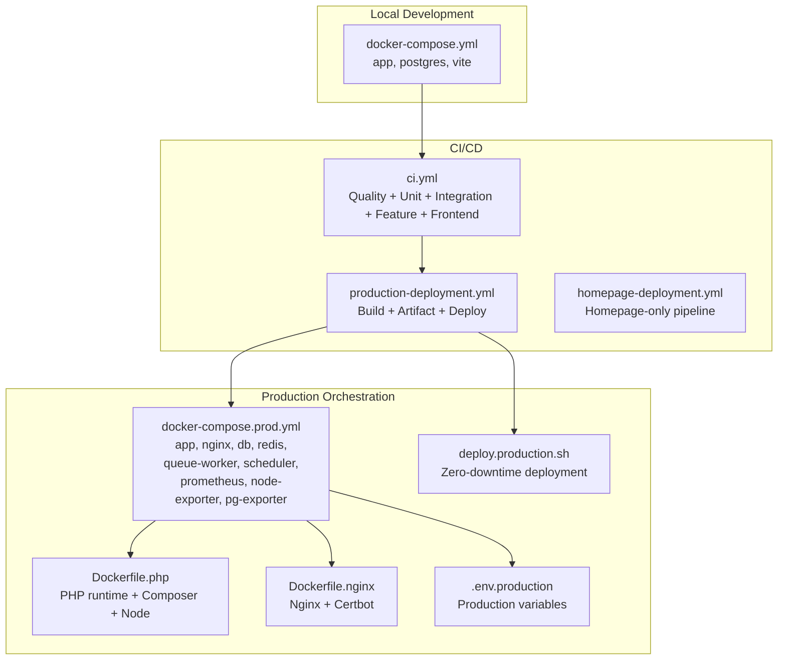
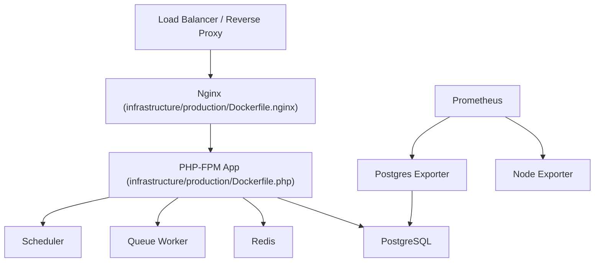
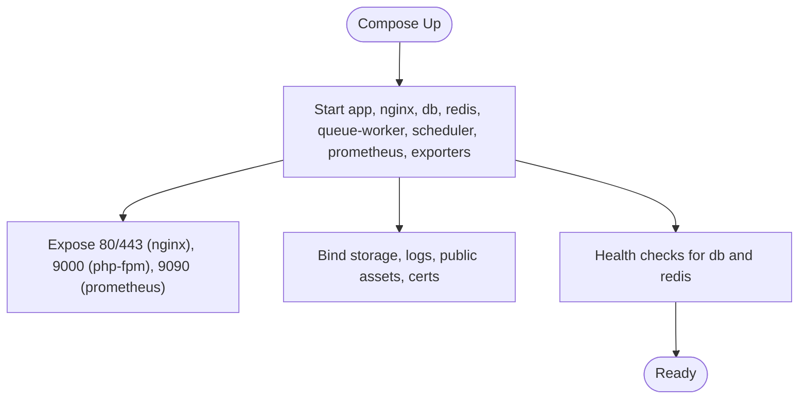
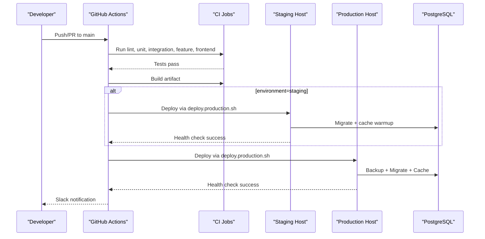
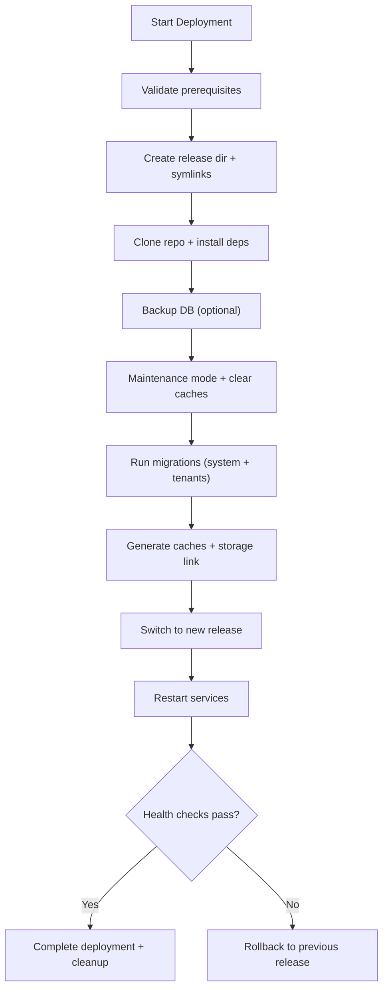
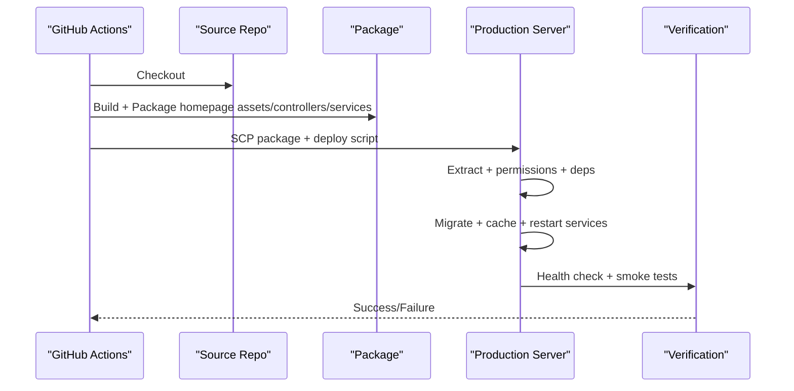
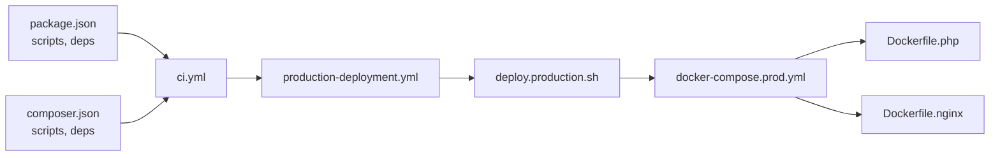

# Deployment & DevOps

<cite>
**Referenced Files in This Document**
- [docker-compose.yml](file://docker-compose.yml)
- [deployment-plan.md](file://deployment-plan.md)
- [deploy.sh](file://deploy.sh)
- [scripts/deploy-homepage.sh](file://scripts/deploy-homepage.sh)
- [config/deployment.php](file://config/deployment.php)
- [infrastructure/README.md](file://infrastructure/README.md)
- [infrastructure/production/docker-compose.prod.yml](file://infrastructure/production/docker-compose.prod.yml)
- [infrastructure/production/Dockerfile.php](file://infrastructure/production/Dockerfile.php)
- [infrastructure/production/Dockerfile.nginx](file://infrastructure/production/Dockerfile.nginx)
- [infrastructure/production/.env.production](file://infrastructure/production/.env.production)
- [infrastructure/production/deploy.production.sh](file://infrastructure/production/deploy.production.sh)
- [.github/workflows/ci.yml](file://.github/workflows/ci.yml)
- [.github/workflows/production-deployment.yml](file://.github/workflows/production-deployment.yml)
- [.github/workflows/homepage-deployment.yml](file://.github/workflows/homepage-deployment.yml)
- [composer.json](file://composer.json)
- [package.json](file://package.json)
</cite>

## Table of Contents
1. [Introduction](#introduction)
2. [Project Structure](#project-structure)
3. [Core Components](#core-components)
4. [Architecture Overview](#architecture-overview)
5. [Detailed Component Analysis](#detailed-component-analysis)
6. [Dependency Analysis](#dependency-analysis)
7. [Performance Considerations](#performance-considerations)
8. [Troubleshooting Guide](#troubleshooting-guide)
9. [Conclusion](#conclusion)
10. [Appendices](#appendices)

## Introduction
This document provides a comprehensive guide to deployment and DevOps for the Alumate platform, focusing on Docker containerization, CI/CD pipelines, and production deployment. It explains how to achieve consistent environments across development and production, orchestrate multi-container services, automate testing and deployment, and operate reliably in production with monitoring, backups, and disaster recovery.

## Project Structure
The repository includes:
- A lightweight development stack using Docker Compose for local iteration
- A production-grade Docker Compose stack with Nginx, PHP-FPM, PostgreSQL, Redis, Prometheus, and exporters
- GitHub Actions workflows for CI, staging, and production deployments
- Deployment scripts for zero-downtime updates and rollback
- Configuration for monitoring, alerting, and homepage-specific deployments

**Diagram sources**
- [docker-compose.yml:1-52](file://docker-compose.yml#L1-L52)
- [infrastructure/production/docker-compose.prod.yml:1-221](file://infrastructure/production/docker-compose.prod.yml#L1-L221)
- [infrastructure/production/Dockerfile.php:1-113](file://infrastructure/production/Dockerfile.php#L1-L113)
- [infrastructure/production/Dockerfile.nginx:1-41](file://infrastructure/production/Dockerfile.nginx#L1-L41)
- [infrastructure/production/.env.production:1-288](file://infrastructure/production/.env.production#L1-L288)
- [infrastructure/production/deploy.production.sh:1-483](file://infrastructure/production/deploy.production.sh#L1-L483)
- [.github/workflows/ci.yml:1-280](file://.github/workflows/ci.yml#L1-L280)
- [.github/workflows/production-deployment.yml:1-366](file://.github/workflows/production-deployment.yml#L1-L366)
- [.github/workflows/homepage-deployment.yml:1-136](file://.github/workflows/homepage-deployment.yml#L1-L136)

**Section sources**
- [docker-compose.yml:1-52](file://docker-compose.yml#L1-L52)
- [infrastructure/README.md:1-244](file://infrastructure/README.md#L1-L244)

## Core Components
- Dockerized development stack for local parity
- Production Docker Compose with Nginx, PHP-FPM, PostgreSQL, Redis, queue/scheduler, and observability
- GitHub Actions CI/CD with security scans, builds, and multi-environment deployments
- Zero-downtime deployment script with rollback and health checks
- Homepage-specific deployment workflow for targeted feature updates
- Configuration-driven monitoring and alerting

**Section sources**
- [docker-compose.yml:1-52](file://docker-compose.yml#L1-L52)
- [infrastructure/production/docker-compose.prod.yml:1-221](file://infrastructure/production/docker-compose.prod.yml#L1-L221)
- [.github/workflows/ci.yml:1-280](file://.github/workflows/ci.yml#L1-L280)
- [.github/workflows/production-deployment.yml:1-366](file://.github/workflows/production-deployment.yml#L1-L366)
- [infrastructure/production/deploy.production.sh:1-483](file://infrastructure/production/deploy.production.sh#L1-L483)
- [scripts/deploy-homepage.sh:1-85](file://scripts/deploy-homepage.sh#L1-L85)
- [config/deployment.php:1-231](file://config/deployment.php#L1-L231)

## Architecture Overview
The production architecture centers on containerized services behind Nginx, with Redis for cache/session/queue and PostgreSQL for persistence. Prometheus and exporters collect metrics, while queue workers and schedulers run inside the application container.

**Diagram sources**
- [infrastructure/production/docker-compose.prod.yml:1-221](file://infrastructure/production/docker-compose.prod.yml#L1-L221)
- [infrastructure/production/Dockerfile.nginx:1-41](file://infrastructure/production/Dockerfile.nginx#L1-L41)
- [infrastructure/production/Dockerfile.php:1-113](file://infrastructure/production/Dockerfile.php#L1-L113)

**Section sources**
- [infrastructure/production/docker-compose.prod.yml:1-221](file://infrastructure/production/docker-compose.prod.yml#L1-L221)
- [infrastructure/production/Dockerfile.php:1-113](file://infrastructure/production/Dockerfile.php#L1-L113)
- [infrastructure/production/Dockerfile.nginx:1-41](file://infrastructure/production/Dockerfile.nginx#L1-L41)

## Detailed Component Analysis

### Docker Configuration and Multi-Container Orchestration
- Local development stack defines app, postgres, and vite services with explicit ports and volumes for iterative development.
- Production stack adds Nginx, PHP-FPM, PostgreSQL, Redis, queue worker, scheduler, and monitoring services with health checks and persistent volumes.

**Diagram sources**
- [docker-compose.yml:1-52](file://docker-compose.yml#L1-L52)
- [infrastructure/production/docker-compose.prod.yml:1-221](file://infrastructure/production/docker-compose.prod.yml#L1-L221)

**Section sources**
- [docker-compose.yml:1-52](file://docker-compose.yml#L1-L52)
- [infrastructure/production/docker-compose.prod.yml:1-221](file://infrastructure/production/docker-compose.prod.yml#L1-L221)

### CI/CD Pipeline with GitHub Actions
- CI workflow enforces code quality, runs unit/integration/feature tests, and builds frontend assets.
- Production deployment workflow performs security audits, builds artifacts, optionally deploys to staging, then to production with database backup, health checks, and optional rollback.
- Homepage deployment workflow targets frontend/backend changes for homepage features with isolated testing and verification.

**Diagram sources**
- [.github/workflows/ci.yml:1-280](file://.github/workflows/ci.yml#L1-L280)
- [.github/workflows/production-deployment.yml:1-366](file://.github/workflows/production-deployment.yml#L1-L366)
- [infrastructure/production/deploy.production.sh:1-483](file://infrastructure/production/deploy.production.sh#L1-L483)

**Section sources**
- [.github/workflows/ci.yml:1-280](file://.github/workflows/ci.yml#L1-L280)
- [.github/workflows/production-deployment.yml:1-366](file://.github/workflows/production-deployment.yml#L1-L366)
- [infrastructure/production/deploy.production.sh:1-483](file://infrastructure/production/deploy.production.sh#L1-L483)

### Production Deployment Procedures
- Zero-downtime deployment script orchestrates cloning, dependency installation, shared storage symlinking, pre-deploy maintenance mode, database migrations (including tenant migrations), cache generation, switching the symlink, restarting services, health checks, and cleanup.
- Optional rollback restores from last backup and reverts to the previous release if health checks fail.

**Diagram sources**
- [infrastructure/production/deploy.production.sh:1-483](file://infrastructure/production/deploy.production.sh#L1-L483)

**Section sources**
- [infrastructure/production/deploy.production.sh:1-483](file://infrastructure/production/deploy.production.sh#L1-L483)

### Homepage Deployment Workflow
- Isolated pipeline for homepage features: targeted testing, building, packaging, and deploying only the necessary components, followed by verification and smoke tests.

**Diagram sources**
- [.github/workflows/homepage-deployment.yml:1-136](file://.github/workflows/homepage-deployment.yml#L1-L136)
- [scripts/deploy-homepage.sh:1-85](file://scripts/deploy-homepage.sh#L1-L85)

**Section sources**
- [.github/workflows/homepage-deployment.yml:1-136](file://.github/workflows/homepage-deployment.yml#L1-L136)
- [scripts/deploy-homepage.sh:1-85](file://scripts/deploy-homepage.sh#L1-L85)

### Environment Configuration and Secrets
- Local development uses environment variables for app, debug, and service endpoints.
- Production configuration is centralized in a dedicated .env.production with multi-tenancy, database, cache, sessions, queues, Redis, mail, broadcasting, filesystem, logging, monitoring, security headers, performance, analytics, third-party integrations, backup, security/compliance, and scheduled tasks.

**Section sources**
- [docker-compose.yml:12-18](file://docker-compose.yml#L12-L18)
- [infrastructure/production/.env.production:1-288](file://infrastructure/production/.env.production#L1-L288)

### Monitoring and Alerting
- Configuration-driven monitoring toggles and thresholds for homepage performance, conversions, security, and alert escalation.
- Health check endpoints expose system status, database connectivity, cache health, and template/system metrics.
- External services support Sentry, Datadog, New Relic, and PagerDuty integrations.

**Section sources**
- [config/deployment.php:1-231](file://config/deployment.php#L1-L231)
- [deployment-plan.md:497-572](file://deployment-plan.md#L497-L572)

### Backup and Recovery
- Automated backup script captures database, storage, and configuration snapshots and uploads to cloud storage, with retention policies.
- Disaster recovery plan includes damage assessment, database/file restoration, integrity verification, service restart, and monitoring.

**Section sources**
- [deployment-plan.md:609-717](file://deployment-plan.md#L609-L717)

### Database Migration Strategy
- Migration process includes pre-deployment checks, backups, local testing, rollback validation, staging rollout, verification, production deployment, monitoring, and rollback if needed.
- Migration safety measures emphasize non-blocking schema changes and background population of initial data.

**Section sources**
- [deployment-plan.md:220-299](file://deployment-plan.md#L220-L299)

## Dependency Analysis
- Application dependencies are managed via Composer and NPM; scripts define dev/test/build commands.
- CI/CD relies on GitHub-hosted runners with service containers for PostgreSQL and Redis.
- Production Dockerfiles install PHP extensions, Composer, Node, and configure supervisord for queue and cron.

**Diagram sources**
- [package.json:1-90](file://package.json#L1-L90)
- [composer.json:1-94](file://composer.json#L1-L94)
- [.github/workflows/ci.yml:1-280](file://.github/workflows/ci.yml#L1-L280)
- [.github/workflows/production-deployment.yml:1-366](file://.github/workflows/production-deployment.yml#L1-L366)
- [infrastructure/production/deploy.production.sh:1-483](file://infrastructure/production/deploy.production.sh#L1-L483)
- [infrastructure/production/docker-compose.prod.yml:1-221](file://infrastructure/production/docker-compose.prod.yml#L1-L221)
- [infrastructure/production/Dockerfile.php:1-113](file://infrastructure/production/Dockerfile.php#L1-L113)
- [infrastructure/production/Dockerfile.nginx:1-41](file://infrastructure/production/Dockerfile.nginx#L1-L41)

**Section sources**
- [package.json:1-90](file://package.json#L1-L90)
- [composer.json:1-94](file://composer.json#L1-L94)
- [.github/workflows/ci.yml:1-280](file://.github/workflows/ci.yml#L1-L280)
- [.github/workflows/production-deployment.yml:1-366](file://.github/workflows/production-deployment.yml#L1-L366)
- [infrastructure/production/deploy.production.sh:1-483](file://infrastructure/production/deploy.production.sh#L1-L483)

## Performance Considerations
- PHP-FPM and Nginx optimized for production with health checks and supervised processes.
- OPcache and performance flags configured in production environment.
- Asset caching, minification, and CDN integration supported by configuration.
- Database and exporter metrics enable capacity planning and bottleneck detection.

[No sources needed since this section provides general guidance]

## Troubleshooting Guide
Common operational issues and remedies:
- Container startup failures: inspect logs, validate compose config, and restart with verbose logging.
- Health check failures: verify database connectivity, Redis connection, SSL certificates, and application logs.
- Deployment failures: check deployment script permissions, SSH keys/connectivity, disk space, and backup integrity.
- Logs locations: application logs under storage/logs, Nginx logs, PostgreSQL logs, and deployment logs.

**Section sources**
- [infrastructure/README.md:167-200](file://infrastructure/README.md#L167-L200)

## Conclusion
The Alumate project provides a robust, repeatable deployment and DevOps framework. Docker ensures consistent environments, GitHub Actions automates quality and delivery, and the production stack delivers scalability and observability. The included scripts and configurations support zero-downtime deployments, comprehensive monitoring, and resilient recovery.

[No sources needed since this section summarizes without analyzing specific files]

## Appendices

### Practical Deployment Workflows
- Local development: start the stack and iterate with hot-reload for backend and frontend.
- Staging deployment: build artifact, upload, run migrations, cache generation, and health checks.
- Production deployment: backup database, deploy with zero-downtime strategy, run health checks, and notify stakeholders.
- Homepage deployment: build and deploy only homepage assets and backend components, then verify and smoke test.

**Section sources**
- [docker-compose.yml:1-52](file://docker-compose.yml#L1-L52)
- [.github/workflows/production-deployment.yml:1-366](file://.github/workflows/production-deployment.yml#L1-L366)
- [infrastructure/production/deploy.production.sh:1-483](file://infrastructure/production/deploy.production.sh#L1-L483)
- [.github/workflows/homepage-deployment.yml:1-136](file://.github/workflows/homepage-deployment.yml#L1-L136)