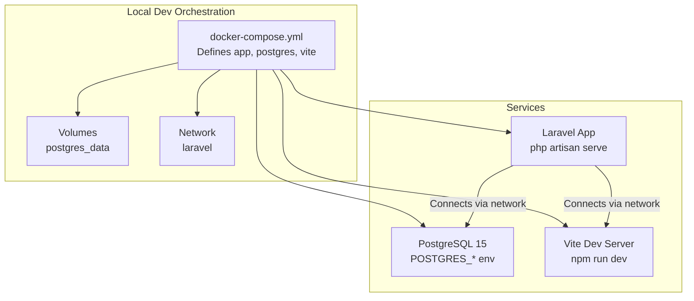
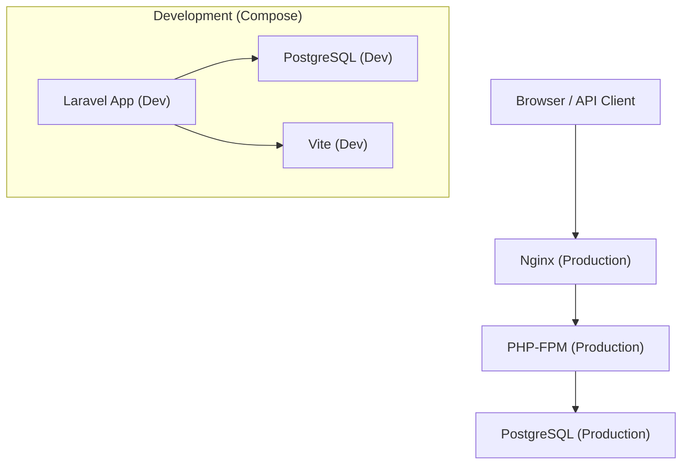
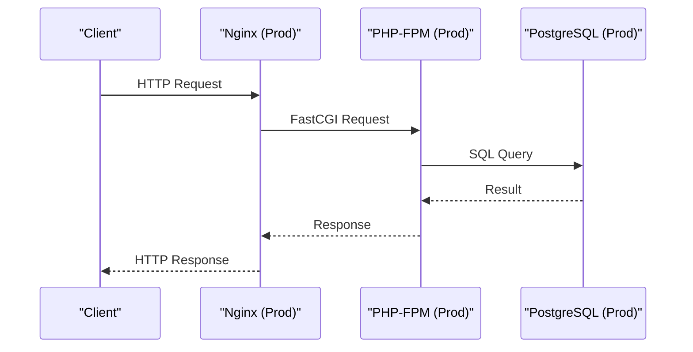
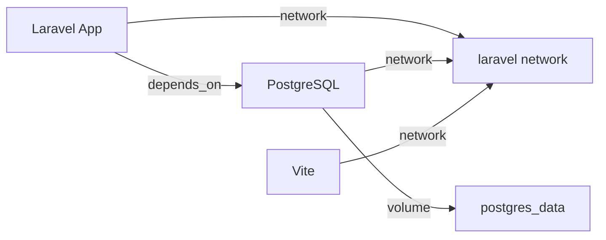

# Docker Containerization

<cite>
**Referenced Files in This Document**
- [docker-compose.yml](file://docker-compose.yml)
- [package.json](file://package.json)
- [vite.config.ts](file://vite.config.ts)
- [Dockerfile.nginx](file://infrastructure/production/Dockerfile.nginx)
- [Dockerfile.php](file://infrastructure/production/Dockerfile.php)
- [app.php](file://config/app.php)
- [database.php](file://config/database.php)
- [artisan.sh](file://artisan.sh)
- [start-dev.sh](file://start-dev.sh)
</cite>

## Table of Contents
1. [Introduction](#introduction)
2. [Project Structure](#project-structure)
3. [Core Components](#core-components)
4. [Architecture Overview](#architecture-overview)
5. [Detailed Component Analysis](#detailed-component-analysis)
6. [Dependency Analysis](#dependency-analysis)
7. [Performance Considerations](#performance-considerations)
8. [Troubleshooting Guide](#troubleshooting-guide)
9. [Conclusion](#conclusion)
10. [Appendices](#appendices)

## Introduction
This document explains how to containerize the Laravel application with Docker, focusing on multi-container orchestration and a local development environment. It covers Docker Compose configuration for the Laravel application, PostgreSQL database, and Vite frontend services, along with container networking, volume mounting, and service dependencies. It also documents production Dockerfile configurations for Nginx and PHP-FPM containers, environment variable management, port mapping, and data persistence strategies. Practical examples demonstrate container startup, scaling, and troubleshooting common containerization issues, plus best practices for container security, resource limits, and health checks.

## Project Structure
The repository includes:
- A Docker Compose configuration that defines three services: Laravel application, PostgreSQL database, and Vite frontend, plus a named volume and a custom network.
- Production Dockerfiles for Nginx and PHP-FPM with health checks and production-ready runtime configuration.
- Frontend tooling via Vite and Vue, configured in package.json and vite.config.ts.
- Laravel configuration files that define environment-driven behavior for app, URL, debug, and database connections.

**Diagram sources**
- [docker-compose.yml:1-52](file://docker-compose.yml#L1-L52)

**Section sources**
- [docker-compose.yml:1-52](file://docker-compose.yml#L1-L52)

## Core Components
- Laravel application service
  - Uses a Sail-based PHP image, mounts the project root, exposes port 8080, sets environment variables for local development, runs php artisan serve, and declares a dependency on the database service.
- PostgreSQL service
  - Runs PostgreSQL 15, sets database credentials, publishes port 5432 externally on 5433, and persists data in a named volume.
- Vite service
  - Runs Node 20, mounts the project root, exposes port 5100, runs npm run dev with host binding, and connects to the same network as other services.

Environment variables and ports:
- Laravel app: APP_ENV, APP_DEBUG, port 8080
- PostgreSQL: POSTGRES_DB, POSTGRES_USER, POSTGRES_PASSWORD, port 5433 mapped to 5432
- Vite: port 5100

Volume mounting:
- PostgreSQL data persisted in a named volume to survive container recreation.

Networking:
- All services join a custom bridge network called laravel, enabling service-to-service communication by service name.

**Section sources**
- [docker-compose.yml:3-52](file://docker-compose.yml#L3-L52)

## Architecture Overview
The development stack consists of three containers orchestrated by Docker Compose:
- Laravel application container serving the backend API and web routes.
- PostgreSQL container providing relational data persistence.
- Vite container serving the frontend assets and HMR during development.

**Diagram sources**
- [Dockerfile.nginx:1-41](file://infrastructure/production/Dockerfile.nginx#L1-L41)
- [Dockerfile.php:1-113](file://infrastructure/production/Dockerfile.php#L1-L113)
- [docker-compose.yml:3-52](file://docker-compose.yml#L3-L52)

## Detailed Component Analysis

### Laravel Application Service (Development)
- Image and command: Uses a Sail PHP image and runs php artisan serve bound to 0.0.0.0 on port 8080.
- Environment: Sets APP_ENV and APP_DEBUG for local development.
- Dependencies: Declares depends_on for the database service to ensure startup order.
- Networking: Joins the laravel network for internal service discovery.
- Persistence: Mounts the project root into the container for live code updates.

Operational notes:
- The service binds to port 8080 internally and maps it to 8080 on the host.
- Ensure the database is reachable using the service name as the hostname within the network.

**Section sources**
- [docker-compose.yml:4-19](file://docker-compose.yml#L4-L19)

### PostgreSQL Service (Development)
- Image: Official PostgreSQL 15.
- Environment: Configures database name, user, and password.
- Ports: Exposes 5432 internally and maps to 5433 on the host.
- Volumes: Persists data in a named volume postgres_data.
- Networking: Joins the laravel network.

Operational notes:
- Use the service name as the database host in Laravel configuration.
- The initial admin password is set via environment variables; update in non-production environments.

**Section sources**
- [docker-compose.yml:21-34](file://docker-compose.yml#L21-L34)

### Vite Service (Development)
- Image: Node 20.
- Working directory: /app.
- Command: npm run dev with host binding for HMR.
- Ports: Exposes 5100 internally and maps to 5100 on the host.
- Networking: Joins the laravel network.

Operational notes:
- The frontend dev server listens on port 5100.
- Configure CORS and proxy settings in the frontend tooling to allow requests to the Laravel backend.

**Section sources**
- [docker-compose.yml:35-46](file://docker-compose.yml#L35-L46)

### Production Nginx Container
- Base image: nginx:alpine.
- Configuration: Copies Nginx configuration files from infrastructure/production/config/nginx/.
- Certificates: Prepares directories for Let's Encrypt and installs required packages.
- Health check: Probes the application’s health endpoint over HTTP.
- Ports: Exposes 80 and 443.
- Startup: Runs nginx in the foreground.

Operational notes:
- Ensure static assets and logs directories are writable by the nginx user.
- The health check relies on the backend exposing a health endpoint.

**Section sources**
- [Dockerfile.nginx:1-41](file://infrastructure/production/Dockerfile.nginx#L1-L41)

### Production PHP-FPM Container
- Base image: php:8.3-fpm-alpine.
- System dependencies: Installs PHP extensions, databases clients, Node.js, npm, and supervisord.
- PHP configuration: Applies production php.ini and php-fpm pool configuration.
- Composer: Installs dependencies excluding dev packages.
- Assets: Installs Node dependencies and builds the frontend.
- Supervisor: Manages cron and queue workers alongside PHP-FPM.
- Health check: Probes the application’s health-check endpoint.
- Ports: Exposes 9000 for upstream proxying.
- Startup: Executes a dedicated start script.

Operational notes:
- The start script initializes directories and permissions, then launches supervisor.
- The container expects environment-specific .env.production to be present at build time.

**Section sources**
- [Dockerfile.php:1-113](file://infrastructure/production/Dockerfile.php#L1-L113)

### Environment Variable Management
- Laravel app configuration reads environment variables for application name, environment, debug mode, URL, key, and maintenance settings.
- Database configuration reads environment variables for connection type, host, port, database name, username, password, charset, collation, and SSL mode.

Operational notes:
- For development, ensure APP_URL matches the host URL used by the browser.
- For production, provide .env.production with database credentials and application keys.

**Section sources**
- [app.php:16-100](file://config/app.php#L16-L100)
- [database.php:19-135](file://config/database.php#L19-L135)

### Port Mapping and Data Persistence
- Port mappings:
  - Laravel app: 8080:8080
  - PostgreSQL: 5433:5432
  - Vite: 5100:5100
- Data persistence:
  - PostgreSQL data stored in a named volume postgres_data.

Operational notes:
- Adjust host ports if conflicts arise.
- Back up the postgres_data volume regularly for production deployments.

**Section sources**
- [docker-compose.yml:10-31](file://docker-compose.yml#L10-L31)

### Frontend Tooling and Proxy Configuration
- Scripts: The project provides npm scripts for dev, build, and testing.
- Vite configuration:
  - Defines plugin chain for Laravel and Vue.
  - Configures asset chunking and naming for performance.
  - Sets development server host/port, HMR host/port, CORS origins, and proxy targets for API requests to the Laravel backend.

Operational notes:
- Ensure the proxy target matches the Laravel app service name and port within the network.
- The frontend should be served by Nginx in production after building assets.

**Section sources**
- [package.json:4-21](file://package.json#L4-L21)
- [vite.config.ts:6-163](file://vite.config.ts#L6-L163)

## Architecture Overview
The development and production architectures differ slightly. In development, the Laravel app serves both API and web routes, while in production, Nginx proxies to PHP-FPM, which communicates with PostgreSQL.

**Diagram sources**
- [Dockerfile.nginx:1-41](file://infrastructure/production/Dockerfile.nginx#L1-L41)
- [Dockerfile.php:1-113](file://infrastructure/production/Dockerfile.php#L1-L113)

## Detailed Component Analysis

### Laravel Application Service (Development)
- Image and command: Uses a Sail PHP image and runs php artisan serve bound to 0.0.0.0 on port 8080.
- Environment: Sets APP_ENV and APP_DEBUG for local development.
- Dependencies: Declares depends_on for the database service to ensure startup order.
- Networking: Joins the laravel network for internal service discovery.
- Persistence: Mounts the project root into the container for live code updates.

Operational notes:
- The service binds to port 8080 internally and maps it to 8080 on the host.
- Ensure the database is reachable using the service name as the hostname within the network.

**Section sources**
- [docker-compose.yml:4-19](file://docker-compose.yml#L4-L19)

### PostgreSQL Service (Development)
- Image: Official PostgreSQL 15.
- Environment: Configures database name, user, and password.
- Ports: Exposes 5432 internally and maps to 5433 on the host.
- Volumes: Persists data in a named volume postgres_data.
- Networking: Joins the laravel network.

Operational notes:
- Use the service name as the database host in Laravel configuration.
- The initial admin password is set via environment variables; update in non-production environments.

**Section sources**
- [docker-compose.yml:21-34](file://docker-compose.yml#L21-L34)

### Vite Service (Development)
- Image: Node 20.
- Working directory: /app.
- Command: npm run dev with host binding for HMR.
- Ports: Exposes 5100 internally and maps to 5100 on the host.
- Networking: Joins the laravel network.

Operational notes:
- The frontend dev server listens on port 5100.
- Configure CORS and proxy settings in the frontend tooling to allow requests to the Laravel backend.

**Section sources**
- [docker-compose.yml:35-46](file://docker-compose.yml#L35-L46)

### Production Nginx Container
- Base image: nginx:alpine.
- Configuration: Copies Nginx configuration files from infrastructure/production/config/nginx/.
- Certificates: Prepares directories for Let's Encrypt and installs required packages.
- Health check: Probes the application’s health endpoint over HTTP.
- Ports: Exposes 80 and 443.
- Startup: Runs nginx in the foreground.

Operational notes:
- Ensure static assets and logs directories are writable by the nginx user.
- The health check relies on the backend exposing a health endpoint.

**Section sources**
- [Dockerfile.nginx:1-41](file://infrastructure/production/Dockerfile.nginx#L1-L41)

### Production PHP-FPM Container
- Base image: php:8.3-fpm-alpine.
- System dependencies: Installs PHP extensions, databases clients, Node.js, npm, and supervisord.
- PHP configuration: Applies production php.ini and php-fpm pool configuration.
- Composer: Installs dependencies excluding dev packages.
- Assets: Installs Node dependencies and builds the frontend.
- Supervisor: Manages cron and queue workers alongside PHP-FPM.
- Health check: Probes the application’s health-check endpoint.
- Ports: Exposes 9000 for upstream proxying.
- Startup: Executes a dedicated start script.

Operational notes:
- The start script initializes directories and permissions, then launches supervisor.
- The container expects environment-specific .env.production to be present at build time.

**Section sources**
- [Dockerfile.php:1-113](file://infrastructure/production/Dockerfile.php#L1-L113)

### Environment Variable Management
- Laravel app configuration reads environment variables for application name, environment, debug mode, URL, key, and maintenance settings.
- Database configuration reads environment variables for connection type, host, port, database name, username, password, charset, collation, and SSL mode.

Operational notes:
- For development, ensure APP_URL matches the host URL used by the browser.
- For production, provide .env.production with database credentials and application keys.

**Section sources**
- [app.php:16-100](file://config/app.php#L16-L100)
- [database.php:19-135](file://config/database.php#L19-L135)

### Port Mapping and Data Persistence
- Port mappings:
  - Laravel app: 8080:8080
  - PostgreSQL: 5433:5432
  - Vite: 5100:5100
- Data persistence:
  - PostgreSQL data stored in a named volume postgres_data.

Operational notes:
- Adjust host ports if conflicts arise.
- Back up the postgres_data volume regularly for production deployments.

**Section sources**
- [docker-compose.yml:10-31](file://docker-compose.yml#L10-L31)

### Frontend Tooling and Proxy Configuration
- Scripts: The project provides npm scripts for dev, build, and testing.
- Vite configuration:
  - Defines plugin chain for Laravel and Vue.
  - Configures asset chunking and naming for performance.
  - Sets development server host/port, HMR host/port, CORS origins, and proxy targets for API requests to the Laravel backend.

Operational notes:
- Ensure the proxy target matches the Laravel app service name and port within the network.
- The frontend should be served by Nginx in production after building assets.

**Section sources**
- [package.json:4-21](file://package.json#L4-L21)
- [vite.config.ts:6-163](file://vite.config.ts#L6-L163)

## Dependency Analysis
- Service dependencies
  - The Laravel application service declares a dependency on the PostgreSQL service, ensuring the database is ready before the app starts.
- Network dependencies
  - All services share the laravel network, enabling internal DNS resolution by service name.
- Volume dependencies
  - The PostgreSQL service uses a named volume for persistent storage.

**Diagram sources**
- [docker-compose.yml:16-19](file://docker-compose.yml#L16-L19)
- [docker-compose.yml:32-33](file://docker-compose.yml#L32-L33)

**Section sources**
- [docker-compose.yml:16-19](file://docker-compose.yml#L16-L19)
- [docker-compose.yml:32-33](file://docker-compose.yml#L32-L33)

## Performance Considerations
- Build optimization
  - Use production Dockerfiles to precompile assets and install only production dependencies.
- Resource allocation
  - Limit CPU and memory for each service using Docker Compose deploy options to prevent resource contention.
- Caching
  - Persist Composer and Node module caches outside the container to speed up rebuilds.
- Health checks
  - Rely on built-in health checks to enable automatic restarts and load balancer readiness probes.

[No sources needed since this section provides general guidance]

## Troubleshooting Guide
Common issues and resolutions:
- Port conflicts
  - If ports 8080, 5433, or 5100 are in use, change the host mappings in the Compose file or stop conflicting services.
- Database connectivity
  - Verify the Laravel database host is set to the PostgreSQL service name and credentials match the environment variables.
- CORS and proxy errors
  - Confirm the frontend proxy target and allowed origins in the Vite configuration align with the Laravel app service and port.
- Health check failures
  - Ensure the backend exposes the expected health endpoints referenced by the health checks in the production Dockerfiles.
- Development server startup
  - Use the provided development startup script to launch and monitor both Vite and Laravel servers, with automatic restarts and logging.

Practical examples:
- Starting the development environment
  - Bring up the stack with the Compose configuration to start all services.
- Scaling services
  - Scale the Laravel app service horizontally using compose scale to increase concurrency.
- Inspecting logs
  - Tail the logs for each service to diagnose startup and runtime issues.

**Section sources**
- [start-dev.sh:446-484](file://start-dev.sh#L446-L484)
- [artisan.sh:1-43](file://artisan.sh#L1-L43)

## Conclusion
This guide outlined how to containerize the Laravel application using Docker Compose for local development and production-grade Dockerfiles for Nginx and PHP-FPM. It covered service dependencies, networking, volume mounting, environment variable management, port mapping, and data persistence. By following the provided configurations and operational notes, teams can reliably develop, test, and deploy the application with predictable behavior and improved maintainability.

[No sources needed since this section summarizes without analyzing specific files]

## Appendices

### Appendix A: Development Startup and Monitoring
- Use the development startup script to launch Vite and Laravel servers, monitor their health, and manage restarts.
- The script detects executables, checks ports, starts servers, and tails logs for diagnostics.

**Section sources**
- [start-dev.sh:351-484](file://start-dev.sh#L351-L484)

### Appendix B: Production Build and Deployment Notes
- Nginx container
  - Copies configuration files and prepares certificate directories; health checks rely on backend endpoints.
- PHP-FPM container
  - Installs system dependencies, PHP extensions, Composer, Node, and builds assets; supervisord manages workers; health checks rely on backend endpoints.

**Section sources**
- [Dockerfile.nginx:12-41](file://infrastructure/production/Dockerfile.nginx#L12-L41)
- [Dockerfile.php:54-113](file://infrastructure/production/Dockerfile.php#L54-L113)