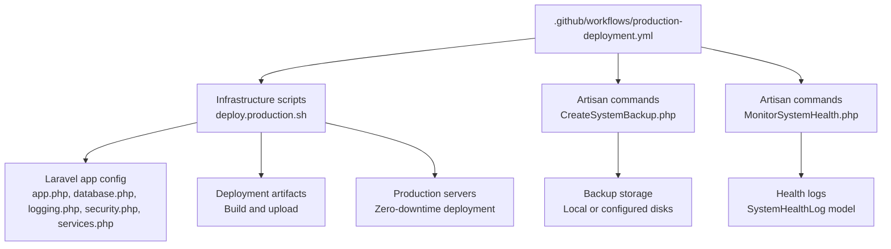
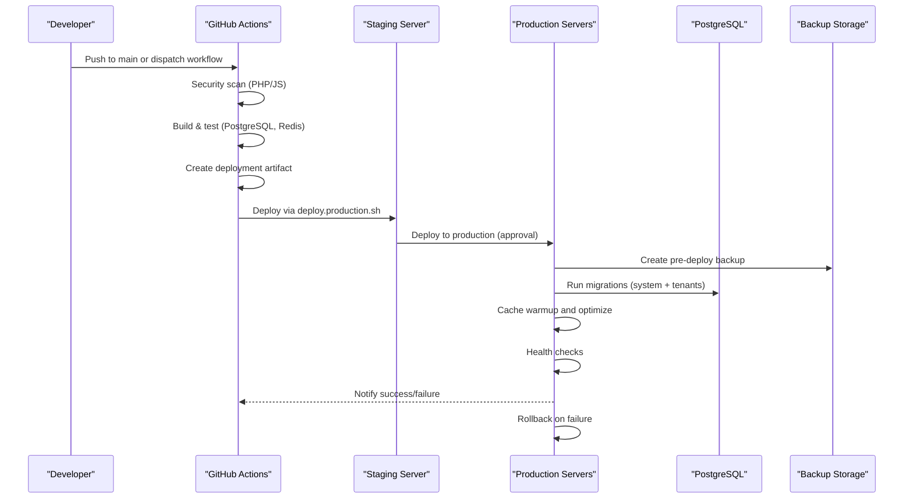
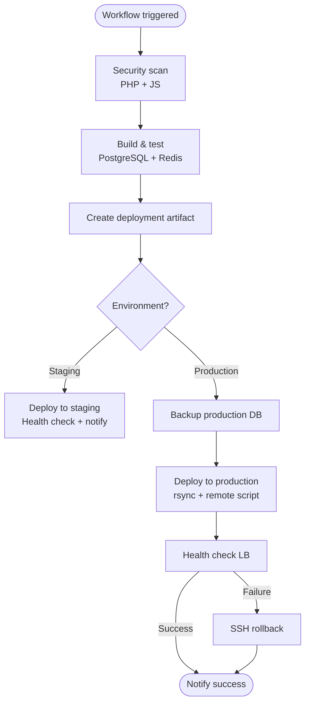
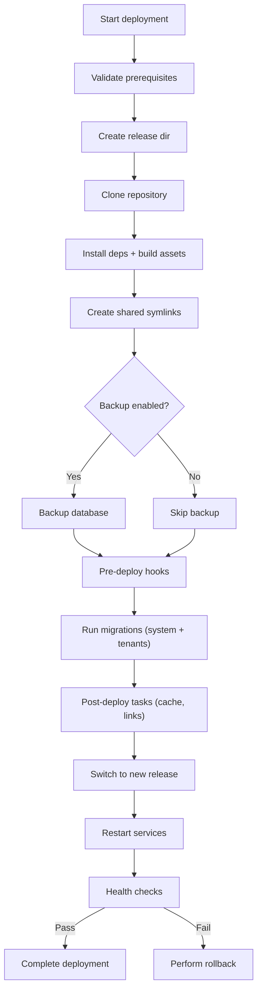
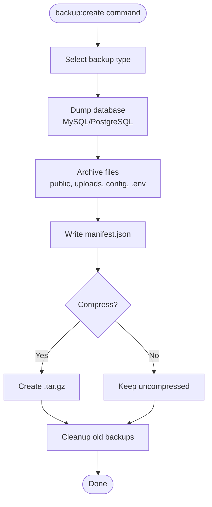
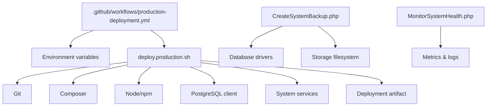

# Production Deployment

<cite>
**Referenced Files in This Document**
- [production-deployment.yml](file://.github/workflows/production-deployment.yml)
- [deploy.production.sh](file://infrastructure/production/deploy.production.sh)
- [deploy.sh](file://deploy.sh)
- [deploy-homepage.sh](file://scripts/deploy-homepage.sh)
- [deployment.php](file://config/deployment.php)
- [app.php](file://config/app.php)
- [database.php](file://config/database.php)
- [logging.php](file://config/logging.php)
- [security.php](file://config/security.php)
- [services.php](file://config/services.php)
- [CreateSystemBackup.php](file://app/Console/Commands/CreateSystemBackup.php)
- [MonitorSystemHealth.php](file://app/Console/Commands/MonitorSystemHealth.php)
</cite>

## Table of Contents
1. [Introduction](#introduction)
2. [Project Structure](#project-structure)
3. [Core Components](#core-components)
4. [Architecture Overview](#architecture-overview)
5. [Detailed Component Analysis](#detailed-component-analysis)
6. [Dependency Analysis](#dependency-analysis)
7. [Performance Considerations](#performance-considerations)
8. [Troubleshooting Guide](#troubleshooting-guide)
9. [Conclusion](#conclusion)
10. [Appendices](#appendices)

## Introduction
This document provides comprehensive production deployment procedures for secure and reliable application deployment. It covers environment setup, SSL and load balancing, deployment scripts, database migrations, asset compilation, configuration management, secrets handling, backups, monitoring, disaster recovery, maintenance, capacity planning, rollback and zero-downtime strategies, security hardening, log rotation, and system optimization.

## Project Structure
The repository includes:
- GitHub Actions workflow for automated CI/CD with staging and production stages
- Bash deployment scripts for multi-tenant, zero-downtime deployments
- Laravel configuration for app, database, logging, security, and monitoring integrations
- Artisan commands for system backup and health monitoring
- Scripts for homepage-specific deployments

**Diagram sources**
- [production-deployment.yml:1-366](file://.github/workflows/production-deployment.yml#L1-L366)
- [deploy.production.sh:1-483](file://infrastructure/production/deploy.production.sh#L1-L483)
- [CreateSystemBackup.php:1-272](file://app/Console/Commands/CreateSystemBackup.php#L1-L272)
- [MonitorSystemHealth.php:1-406](file://app/Console/Commands/MonitorSystemHealth.php#L1-L406)

**Section sources**
- [production-deployment.yml:1-366](file://.github/workflows/production-deployment.yml#L1-L366)
- [deploy.production.sh:1-483](file://infrastructure/production/deploy.production.sh#L1-L483)

## Core Components
- GitHub Actions pipeline orchestrates security scanning, building, testing, artifact creation, and deployment to staging and production with approvals and rollbacks.
- Advanced deployment script supports multi-release management, shared storage symlinking, database backups, migrations, caching, and health checks with rollback capability.
- Artisan backup command automates database and file backups with compression and retention policies.
- Artisan health monitor evaluates database, cache, storage, queue, memory, and disk health and logs results.
- Configuration files define application behavior, database connections, logging channels, security policies, and monitoring integrations.

**Section sources**
- [production-deployment.yml:34-366](file://.github/workflows/production-deployment.yml#L34-L366)
- [deploy.production.sh:1-483](file://infrastructure/production/deploy.production.sh#L1-L483)
- [CreateSystemBackup.php:1-272](file://app/Console/Commands/CreateSystemBackup.php#L1-L272)
- [MonitorSystemHealth.php:1-406](file://app/Console/Commands/MonitorSystemHealth.php#L1-L406)
- [app.php:1-179](file://config/app.php#L1-L179)
- [database.php:1-211](file://config/database.php#L1-L211)
- [logging.php:1-206](file://config/logging.php#L1-L206)
- [security.php:1-76](file://config/security.php#L1-L76)
- [services.php:1-55](file://config/services.php#L1-L55)

## Architecture Overview
The production deployment architecture integrates CI/CD, deployment automation, and operational tooling.

**Diagram sources**
- [production-deployment.yml:34-366](file://.github/workflows/production-deployment.yml#L34-L366)
- [deploy.production.sh:190-469](file://infrastructure/production/deploy.production.sh#L190-L469)

## Detailed Component Analysis

### GitHub Actions Production Pipeline
- Triggers on pushes to main and manual dispatch with environment selection.
- Security scanning includes PHP composer audit and Node.js dependency audit.
- Build and test stage provisions PostgreSQL and Redis containers, sets up test environment, generates keys, migrates databases, runs unit tests, builds assets, and packages artifacts.
- Optional staging deployment with Slack notifications and health checks.
- Production deployment with database backup, rsync of artifacts, remote execution of deployment script, health checks against load balancer and direct server, automatic rollback on failure, and deployment status updates.

**Diagram sources**
- [production-deployment.yml:34-366](file://.github/workflows/production-deployment.yml#L34-L366)

**Section sources**
- [production-deployment.yml:1-366](file://.github/workflows/production-deployment.yml#L1-L366)

### Advanced Multi-Tenant Deployment Script
- Zero-downtime deployment with release directories and atomic switching via symbolic links.
- Pre-deployment hooks enable maintenance mode and clear caches.
- Database backup using PostgreSQL client, migrations for system and tenant schemas, and post-deployment optimization.
- Shared storage symlinking ensures persistent logs, cache, sessions, views, and public uploads.
- Health checks against application endpoint with retry loop; rollback restores previous release and database from backup.
- Service restarts for PHP-FPM and queue workers; deployment notifications via webhook.

**Diagram sources**
- [deploy.production.sh:82-469](file://infrastructure/production/deploy.production.sh#L82-L469)

**Section sources**
- [deploy.production.sh:1-483](file://infrastructure/production/deploy.production.sh#L1-L483)

### Legacy Single-Server Deployment Script
- Quick update flow: put app down, git pull, install dependencies, migrate, clear and rebuild caches, build assets, then bring app up.

**Section sources**
- [deploy.sh:1-33](file://deploy.sh#L1-L33)

### Homepage-Specific Deployment Script
- Creates backups of homepage assets and code, extracts new deployment, installs dependencies, runs targeted migrations, optimizes caches, restarts services, verifies health, and cleans up old backups.

**Section sources**
- [deploy-homepage.sh:1-85](file://scripts/deploy-homepage.sh#L1-L85)

### Backup Strategy
- Artisan backup command supports full/incremental/differential backups, database dump generation for MySQL/PostgreSQL, file archival, optional compression, manifest creation, and cleanup of old backups based on retention policy.
- Configuration supports retention days, compression, and storage disk selection.

**Diagram sources**
- [CreateSystemBackup.php:70-200](file://app/Console/Commands/CreateSystemBackup.php#L70-L200)

**Section sources**
- [CreateSystemBackup.php:1-272](file://app/Console/Commands/CreateSystemBackup.php#L1-L272)
- [security.php:44-48](file://config/security.php#L44-L48)

### System Health Monitoring
- Artisan health check evaluates database connectivity and query performance, cache read/write/delete, storage read/write/delete, queue size and failed jobs, memory usage, and disk space utilization.
- Results logged to SystemHealthLog with metrics; critical issues trigger security event logging and critical logs.

**Section sources**
- [MonitorSystemHealth.php:1-406](file://app/Console/Commands/MonitorSystemHealth.php#L1-L406)

### Configuration Management and Secrets Handling
- Application configuration includes environment, debug mode, URL, timezone, locale, encryption key, and maintenance mode driver.
- Database configuration defines connections for SQLite, MySQL, MariaDB, PostgreSQL, central, tenant, and SQL Server; includes Redis options and migration repository settings.
- Logging configuration defines channels for daily rotation, Slack, syslog, stderr, and specialized channels for homepage and templates.
- Security configuration controls login attempts, rate limits, session timeouts, two-factor requirements, backup settings, and health thresholds.
- Services configuration stores third-party credentials and monitoring endpoints.

**Section sources**
- [app.php:1-179](file://config/app.php#L1-L179)
- [database.php:1-211](file://config/database.php#L1-L211)
- [logging.php:1-206](file://config/logging.php#L1-L206)
- [security.php:1-76](file://config/security.php#L1-L76)
- [services.php:1-55](file://config/services.php#L1-L55)

### Monitoring and Alerting
- Deployment pipeline posts notifications to Slack and updates external monitoring endpoints.
- Deployment configuration enables homepage monitoring, performance thresholds, security headers, and external service integrations (Sentry, DataDog, NewRelic, PagerDuty).
- Logging channels support dedicated logs for homepage and template subsystems with retention policies.

**Section sources**
- [production-deployment.yml:241-351](file://.github/workflows/production-deployment.yml#L241-L351)
- [deployment.php:1-231](file://config/deployment.php#L1-L231)
- [logging.php:130-203](file://config/logging.php#L130-L203)
- [services.php:38-52](file://config/services.php#L38-L52)

## Dependency Analysis
- CI/CD depends on environment variables for database credentials, Redis password, application key, and deployment targets.
- Deployment script depends on Git, Composer, Node/npm, PostgreSQL client, and system service management.
- Backup and health commands depend on database drivers, filesystem access, and configured storage disks.

**Diagram sources**
- [production-deployment.yml:287-316](file://.github/workflows/production-deployment.yml#L287-L316)
- [deploy.production.sh:86-91](file://infrastructure/production/deploy.production.sh#L86-L91)
- [CreateSystemBackup.php:111-149](file://app/Console/Commands/CreateSystemBackup.php#L111-L149)
- [MonitorSystemHealth.php:94-336](file://app/Console/Commands/MonitorSystemHealth.php#L94-L336)

**Section sources**
- [production-deployment.yml:287-316](file://.github/workflows/production-deployment.yml#L287-L316)
- [deploy.production.sh:82-103](file://infrastructure/production/deploy.production.sh#L82-L103)
- [CreateSystemBackup.php:111-149](file://app/Console/Commands/CreateSystemBackup.php#L111-L149)
- [MonitorSystemHealth.php:94-336](file://app/Console/Commands/MonitorSystemHealth.php#L94-L336)

## Performance Considerations
- Use PostgreSQL for production-grade reliability and performance.
- Enable and tune Redis for caching and queue backends.
- Employ daily log rotation with retention policies to control disk usage.
- Apply application caching (config, routes, views) and optimize autoloader during deployments.
- Monitor database query performance and apply indexing strategies as needed.
- Scale horizontally behind a load balancer and ensure health checks target application endpoints.

[No sources needed since this section provides general guidance]

## Troubleshooting Guide
- Health check failures: Review deployment logs, verify database connectivity, and confirm service restarts.
- Backup failures: Validate PostgreSQL client availability and credentials; inspect backup retention and storage permissions.
- Rollback execution: Confirm rollback file presence and previous release availability; ensure database restoration completes.
- Monitoring alerts: Check Slack/webhook configurations and external monitoring credentials.

**Section sources**
- [deploy.production.sh:358-400](file://infrastructure/production/deploy.production.sh#L358-L400)
- [CreateSystemBackup.php:137-146](file://app/Console/Commands/CreateSystemBackup.php#L137-L146)
- [MonitorSystemHealth.php:356-371](file://app/Console/Commands/MonitorSystemHealth.php#L356-L371)

## Conclusion
The repository provides a robust production deployment framework combining CI/CD automation, zero-downtime deployment scripts, comprehensive backup and health monitoring, and strong configuration management. By following the documented procedures and leveraging the included scripts and commands, teams can achieve secure, reliable, and scalable deployments.

[No sources needed since this section summarizes without analyzing specific files]

## Appendices

### Production Environment Checklist
- SSL/TLS termination at load balancer or reverse proxy; enforce HTTPS and modern ciphers.
- Load balancing with health checks and auto-scaling groups.
- Database hosted on managed PostgreSQL with replication and automated backups.
- Redis configured for caching and sessions; monitor memory usage.
- Environment variables secured via secret manager or CI/CD secrets vault.
- Automated daily backups with offsite retention; test restore procedures monthly.
- Centralized logging with log rotation and retention; integrate with SIEM.
- Monitoring dashboards for latency, error rates, throughput, and resource utilization.
- Disaster recovery plan with RTO/RPO targets and cross-region failover.

[No sources needed since this section provides general guidance]

### Zero-Downtime Deployment Procedures
- Use the advanced deployment script to stage releases atomically and validate health before switching traffic.
- Ensure shared storage symlinks persist logs, cache, sessions, and uploaded assets across releases.
- Perform pre-deploy database backup and verify restoration procedure.
- Execute health checks against application endpoints; rollback automatically on failure.

**Section sources**
- [deploy.production.sh:294-331](file://infrastructure/production/deploy.production.sh#L294-L331)
- [deploy.production.sh:358-400](file://infrastructure/production/deploy.production.sh#L358-L400)

### Database Migration Procedures
- Run system migrations followed by tenant migrations during deployment.
- Validate migration status endpoints post-deployment.
- Use dedicated migration commands for multi-tenancy.

**Section sources**
- [deploy.production.sh:248-266](file://infrastructure/production/deploy.production.sh#L248-L266)
- [production-deployment.yml:353-358](file://.github/workflows/production-deployment.yml#L353-L358)

### Asset Compilation Processes
- Build frontend assets during CI/CD and in deployment script.
- Ensure Node/npm installation and build steps succeed before packaging.

**Section sources**
- [production-deployment.yml:157-158](file://.github/workflows/production-deployment.yml#L157-L158)
- [deploy.production.sh:151-156](file://infrastructure/production/deploy.production.sh#L151-L156)

### Environment Configuration Management
- Maintain separate environment files for each environment.
- Use CI/CD secrets for sensitive values; avoid committing secrets to repositories.
- Validate configuration via health checks and environment-specific overrides.

**Section sources**
- [app.php:29-55](file://config/app.php#L29-L55)
- [database.php:19-120](file://config/database.php#L19-L120)
- [logging.php:21-74](file://config/logging.php#L21-L74)

### Secrets Handling
- Store secrets in CI/CD secret stores and pass via environment variables to deployment scripts.
- Restrict SSH keys and database credentials to authorized personnel only.

**Section sources**
- [production-deployment.yml:206-216](file://.github/workflows/production-deployment.yml#L206-L216)
- [deploy.production.sh:94-100](file://infrastructure/production/deploy.production.sh#L94-L100)

### Backup Strategies
- Full backups before deployments; retain compressed archives with manifests.
- Automate cleanup of expired backups based on retention policies.
- Test restoration procedures regularly.

**Section sources**
- [CreateSystemBackup.php:202-218](file://app/Console/Commands/CreateSystemBackup.php#L202-L218)
- [security.php:44-48](file://config/security.php#L44-L48)

### Monitoring Setup
- Integrate Sentry, DataDog, NewRelic, and PagerDuty via service configuration.
- Configure homepage monitoring thresholds and alert escalation.
- Use dedicated logging channels for performance and security telemetry.

**Section sources**
- [services.php:38-52](file://config/services.php#L38-L52)
- [deployment.php:25-133](file://config/deployment.php#L25-L133)
- [logging.php:130-203](file://config/logging.php#L130-L203)

### Disaster Recovery Procedures
- Maintain recent database backups and test restore procedures.
- Automate rollback to previous release on deployment failure.
- Document RTO/RPO targets and cross-region failover steps.

**Section sources**
- [deploy.production.sh:358-400](file://infrastructure/production/deploy.production.sh#L358-L400)
- [CreateSystemBackup.php:19-68](file://app/Console/Commands/CreateSystemBackup.php#L19-L68)

### System Maintenance Tasks
- Regular system health checks via Artisan command.
- Monitor queue backlog and failed jobs; scale workers accordingly.
- Rotate logs and clean up old releases and backups.

**Section sources**
- [MonitorSystemHealth.php:29-92](file://app/Console/Commands/MonitorSystemHealth.php#L29-L92)
- [deploy.production.sh:345-356](file://infrastructure/production/deploy.production.sh#L345-L356)

### Capacity Planning
- Track memory usage, disk utilization, and database size trends.
- Scale database, cache, and application tiers based on observed metrics.
- Plan for peak loads with horizontal scaling and CDN optimization.

**Section sources**
- [MonitorSystemHealth.php:276-336](file://app/Console/Commands/MonitorSystemHealth.php#L276-L336)
- [security.php:66-74](file://config/security.php#L66-L74)

### Security Hardening
- Enforce HTTPS, HSTS, CSP, and strict security headers.
- Limit login attempts and enforce rate limits.
- Enable two-factor authentication for privileged roles.
- Monitor suspicious activity and malicious requests.

**Section sources**
- [deployment.php:181-196](file://config/deployment.php#L181-L196)
- [security.php:9-38](file://config/security.php#L9-L38)
- [security.php:55-59](file://config/security.php#L55-L59)

### Log Rotation and System Optimization
- Use daily log channels with retention windows.
- Optimize application caches and storage links during deployments.
- Monitor and adjust PHP-FPM and queue worker configurations.

**Section sources**
- [logging.php:68-74](file://config/logging.php#L68-L74)
- [logging.php:130-203](file://config/logging.php#L130-L203)
- [deploy.production.sh:275-284](file://infrastructure/production/deploy.production.sh#L275-L284)
- [deploy.production.sh:414-428](file://infrastructure/production/deploy.production.sh#L414-L428)