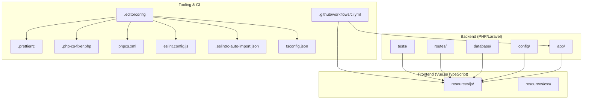
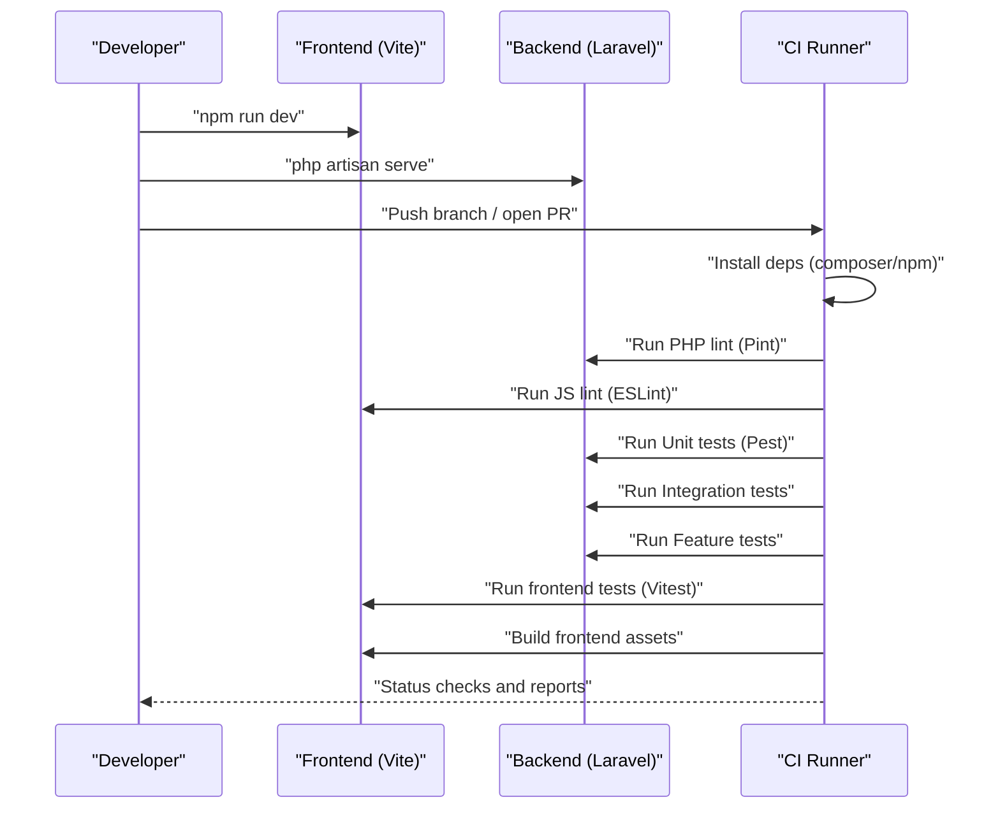
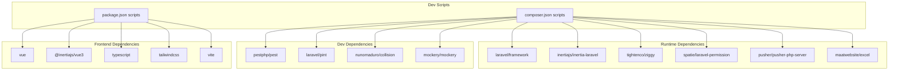

# Development Guidelines

<cite>
**Referenced Files in This Document**
- [.editorconfig](file://.editorconfig)
- [.eslintrc-auto-import.json](file://.eslintrc-auto-import.json)
- [eslint.config.js](file://eslint.config.js)
- [.prettierrc](file://.prettierrc)
- [.php-cs-fixer.php](file://.php-cs-fixer.php)
- [phpcs.xml](file://phpcs.xml)
- [tsconfig.json](file://tsconfig.json)
- [.github/workflows/ci.yml](file://.github/workflows/ci.yml)
- [phpunit.xml](file://phpunit.xml)
- [package.json](file://package.json)
- [composer.json](file://composer.json)
- [docs/DEVELOPMENT.md](file://docs/DEVELOPMENT.md)
- [docs/coding-standards.md](file://docs/coding-standards.md)
- [docs/component-style-guide.md](file://docs/component-style-guide.md)
- [start-dev.sh](file://start-dev.sh)
- [artisan.sh](file://artisan.sh)
</cite>

## Table of Contents
1. [Introduction](#introduction)
2. [Project Structure](#project-structure)
3. [Core Components](#core-components)
4. [Architecture Overview](#architecture-overview)
5. [Detailed Component Analysis](#detailed-component-analysis)
6. [Dependency Analysis](#dependency-analysis)
7. [Performance Considerations](#performance-considerations)
8. [Troubleshooting Guide](#troubleshooting-guide)
9. [Conclusion](#conclusion)
10. [Appendices](#appendices)

## Introduction
This document consolidates development guidelines for the Alumate platform, covering coding standards, contribution processes, development best practices, and quality assurance. It aligns with the existing configuration and documentation in the repository to provide a unified reference for contributors working on both backend (PHP/Laravel) and frontend (TypeScript/Vue.js) components.

## Project Structure
The project follows a Laravel monorepo-like structure with a modern frontend built on Vue.js and TypeScript. Key areas include:
- Backend: PHP/Laravel application under the app/ directory, with controllers, models, services, policies, jobs, notifications, and more.
- Frontend: Vue.js components and TypeScript under resources/js/, organized into pages, components, composables, and types.
- Testing: Pest-based suites under tests/ with Unit, Feature, Integration, Performance, Security, and EndToEnd categories.
- Tooling: ESLint, Prettier, PHP-CS-Fixer, and CI workflows under .github/workflows/.

**Diagram sources**
- [docs/DEVELOPMENT.md:129-149](file://docs/DEVELOPMENT.md#L129-L149)
- [.editorconfig:1-19](file://.editorconfig#L1-L19)
- [.prettierrc:1-19](file://.prettierrc#L1-L19)
- [.php-cs-fixer.php:1-39](file://.php-cs-fixer.php#L1-L39)
- [phpcs.xml:1-30](file://phpcs.xml#L1-L30)
- [eslint.config.js:1-20](file://eslint.config.js#L1-L20)
- [.eslintrc-auto-import.json:1-535](file://.eslintrc-auto-import.json#L1-L535)
- [tsconfig.json:1-132](file://tsconfig.json#L1-L132)
- [.github/workflows/ci.yml:1-280](file://.github/workflows/ci.yml#L1-L280)

**Section sources**
- [docs/DEVELOPMENT.md:129-149](file://docs/DEVELOPMENT.md#L129-L149)

## Core Components
This section outlines the coding standards and tooling that define consistent development practices across the stack.

- PHP/Laravel coding standards
  - PSR-12 compliance via PHP-CS-Fixer and phpcs.xml, with additional rules for arrays, imports, whitespace, and class element ordering.
  - Strict typing enabled in tsconfig.json for TypeScript to mirror PHP’s strictness philosophy.

- TypeScript/Vue.js standards
  - ESLint with Vue flat config and TypeScript plugin, plus Prettier for formatting.
  - Auto-imports configured globally for Vue components and composables to reduce boilerplate.

- Formatting and editor conventions
  - EditorConfig enforces LF line endings, UTF-8 charset, 4-space indentation, trailing whitespace removal, and tailored indentation for YAML.

- Testing and coverage
  - Pest-based suites with PHPUnit configuration for Unit, Feature, Integration, Performance, Security, and EndToEnd tests.
  - CI workflow runs linting, unit, integration, feature, and frontend tests with parallel execution.

**Section sources**
- [.php-cs-fixer.php:13-38](file://.php-cs-fixer.php#L13-L38)
- [phpcs.xml:5-12](file://phpcs.xml#L5-L12)
- [tsconfig.json:98-121](file://tsconfig.json#L98-L121)
- [eslint.config.js:6-19](file://eslint.config.js#L6-L19)
- [.eslintrc-auto-import.json:1-535](file://.eslintrc-auto-import.json#L1-L535)
- [.prettierrc:1-19](file://.prettierrc#L1-L19)
- [.editorconfig:3-18](file://.editorconfig#L3-L18)
- [phpunit.xml:10-29](file://phpunit.xml#L10-L29)
- [.github/workflows/ci.yml:14-280](file://.github/workflows/ci.yml#L14-L280)

## Architecture Overview
The development lifecycle integrates backend and frontend tooling with CI automation:

**Diagram sources**
- [.github/workflows/ci.yml:14-280](file://.github/workflows/ci.yml#L14-L280)
- [package.json:4-21](file://package.json#L4-L21)
- [composer.json:47-76](file://composer.json#L47-L76)

## Detailed Component Analysis

### PHP Coding Standards (PSR-12)
- Enforced via PHP-CS-Fixer with rules for short array syntax, ordered imports, unused imports, trailing commas, scalar docblock types, unary/binary operator spacing, blank lines before statements, single quotes, concat spacing, class attribute separation, and ordered class elements.
- phpcs.xml includes PSR1/PSR2 and Laravel standards, excluding strict types requirement.

Recommended practices
- Keep controllers thin; delegate business logic to services.
- Use Form Request classes for validation.
- Define explicit return types and model casts.
- Use model factories for deterministic tests.

**Section sources**
- [.php-cs-fixer.php:13-38](file://.php-cs-fixer.php#L13-L38)
- [phpcs.xml:5-12](file://phpcs.xml#L5-L12)
- [docs/coding-standards.md:35-185](file://docs/coding-standards.md#L35-L185)

### TypeScript and Vue.js Standards
- ESLint flat config for Vue and TypeScript with Prettier integration and global auto-imports.
- tsconfig.json sets strict mode, ESNext target, JSX preserve with Vue import source, path aliases (@/*), JSON modules, and source maps.

Recommended practices
- Use Composition API with TypeScript interfaces.
- Create reusable composables for common logic.
- Prefer Tailwind utilities; use scoped styles sparingly.
- Maintain accessibility with ARIA roles and keyboard navigation.

**Section sources**
- [eslint.config.js:6-19](file://eslint.config.js#L6-L19)
- [.eslintrc-auto-import.json:1-535](file://.eslintrc-auto-import.json#L1-L535)
- [tsconfig.json:14-47](file://tsconfig.json#L14-L47)
- [docs/coding-standards.md:187-386](file://docs/coding-standards.md#L187-L386)
- [docs/component-style-guide.md:170-531](file://docs/component-style-guide.md#L170-L531)

### Code Formatting and EditorConfig
- EditorConfig settings enforce UTF-8, LF line endings, 4-space indentation, final newline, and trailing whitespace trimming across files, with YAML-specific indentation.

**Section sources**
- [.editorconfig:3-18](file://.editorconfig#L3-L18)

### Testing Standards and Coverage
- PHPUnit configuration defines test suites and environment variables for testing.
- CI workflow runs parallelized Pest test suites and Vitest tests, builds frontend assets, and generates reports.

Recommended practices
- Write unit tests for services and repositories.
- Write feature tests for API endpoints and user journeys.
- Use factories and seeding for deterministic scenarios.
- Include accessibility checks for Vue components.

**Section sources**
- [phpunit.xml:10-29](file://phpunit.xml#L10-L29)
- [.github/workflows/ci.yml:54-280](file://.github/workflows/ci.yml#L54-L280)
- [docs/coding-standards.md:573-671](file://docs/coding-standards.md#L573-L671)
- [docs/component-style-guide.md:553-591](file://docs/component-style-guide.md#L553-L591)

### Contribution Workflow and Pull Requests
- Branching: Use feature branches for new development.
- Commit messages: Follow conventional commits.
- PRs: Include descriptive descriptions; ensure all checks pass.

**Section sources**
- [docs/coding-standards.md:29-34](file://docs/coding-standards.md#L29-L34)

### Continuous Integration Standards
- CI runs PHP linting, JS linting, unit, integration, feature, and frontend tests.
- Services like PostgreSQL and Redis are provisioned for integration tests.
- Frontend build and tests are executed in a separate job.

**Section sources**
- [.github/workflows/ci.yml:14-280](file://.github/workflows/ci.yml#L14-L280)

### Development Environment Setup
- Quick start scripts for Windows and Unix environments.
- Interactive helpers and environment-specific commands.

**Section sources**
- [docs/DEVELOPMENT.md:1-164](file://docs/DEVELOPMENT.md#L1-L164)
- [start-dev.sh:1-484](file://start-dev.sh#L1-L484)
- [artisan.sh:1-43](file://artisan.sh#L1-L43)

## Dependency Analysis
The project’s toolchain and runtime dependencies are managed via Composer and npm/pnpm. Scripts orchestrate development and testing.

**Diagram sources**
- [composer.json:11-34](file://composer.json#L11-L34)
- [composer.json:47-76](file://composer.json#L47-L76)
- [package.json:48-82](file://package.json#L48-L82)

**Section sources**
- [composer.json:11-94](file://composer.json#L11-L94)
- [package.json:4-90](file://package.json#L4-L90)

## Performance Considerations
- Backend
  - Use eager loading to avoid N+1 queries.
  - Add appropriate indexes and leverage database transactions.
  - Apply caching strategies and optimize slow queries.

- Frontend
  - Tree-shakeable components and dynamic imports.
  - Virtualize large lists and lazy-load images/components.
  - Debounce user inputs and clean up event listeners and timers.

**Section sources**
- [docs/coding-standards.md:794-800](file://docs/coding-standards.md#L794-L800)
- [docs/component-style-guide.md:533-552](file://docs/component-style-guide.md#L533-L552)

## Troubleshooting Guide
Common issues and resolutions
- “Tenant could not be identified” error: Ensure correct URLs for central vs tenant domains.
- Vite server page instead of Laravel: Use the Laravel application URL, not the Vite dev server URL.
- PHP command not found: Add PHP to PATH or use the full path.

Operational scripts
- start-dev.sh: Manages Vite and Laravel servers, health checks, memory usage, and log viewing.
- artisan.sh: Wrapper around Laravel Artisan for Bash environments.

**Section sources**
- [docs/DEVELOPMENT.md:105-128](file://docs/DEVELOPMENT.md#L105-L128)
- [start-dev.sh:68-122](file://start-dev.sh#L68-L122)
- [artisan.sh:10-26](file://artisan.sh#L10-L26)

## Conclusion
These guidelines consolidate the repository’s existing standards and tooling into a coherent development workflow. By adhering to PSR-12, ESLint/Prettier, TypeScript strictness, and the CI pipeline, contributors can deliver consistent, maintainable, and high-quality features across both backend and frontend.

## Appendices

### Appendix A: Code Review Checklist
- Standards adherence (PSR-12, ESLint, Prettier)
- Test coverage (unit, feature, integration)
- Accessibility and performance best practices
- Clear commit messages and PR descriptions
- No hardcoded secrets or sensitive data

### Appendix B: Commit Message Conventions
- Use conventional commits for descriptive and structured messages.

**Section sources**
- [docs/coding-standards.md:29-34](file://docs/coding-standards.md#L29-L34)