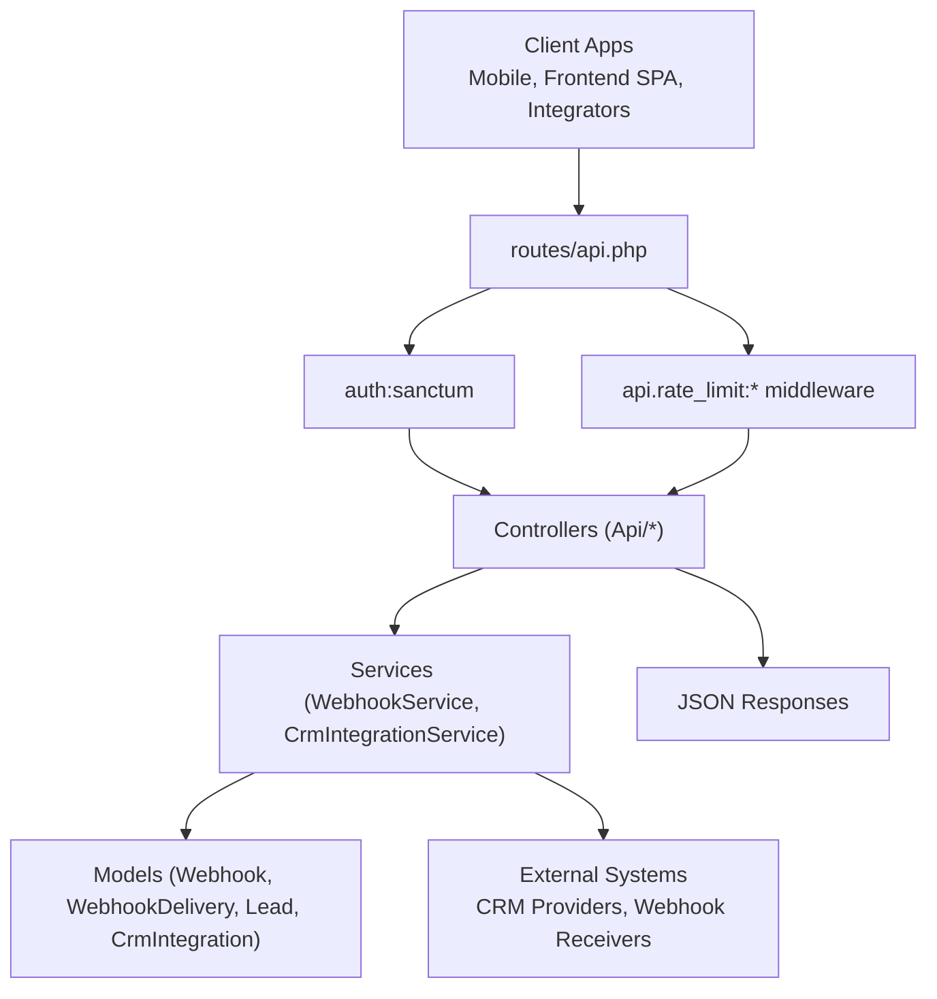
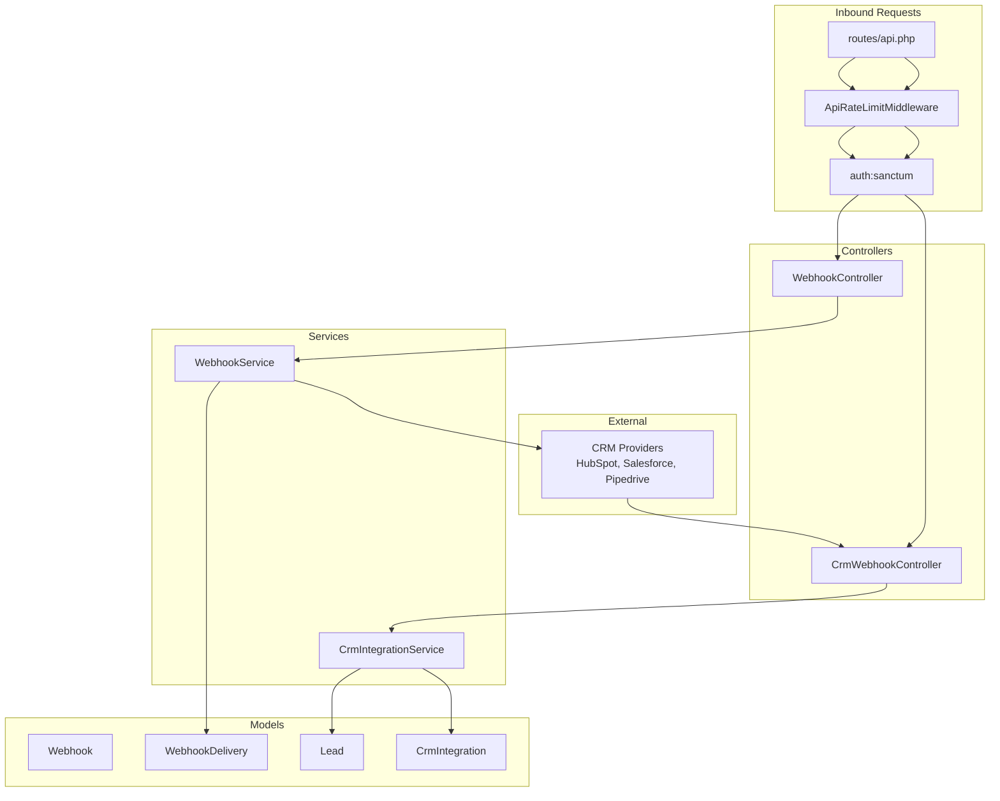
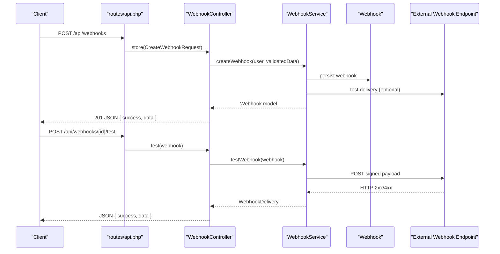
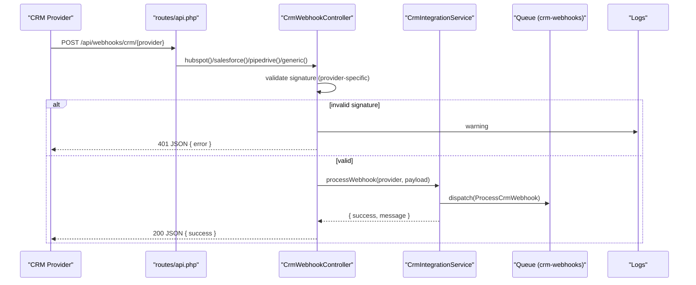
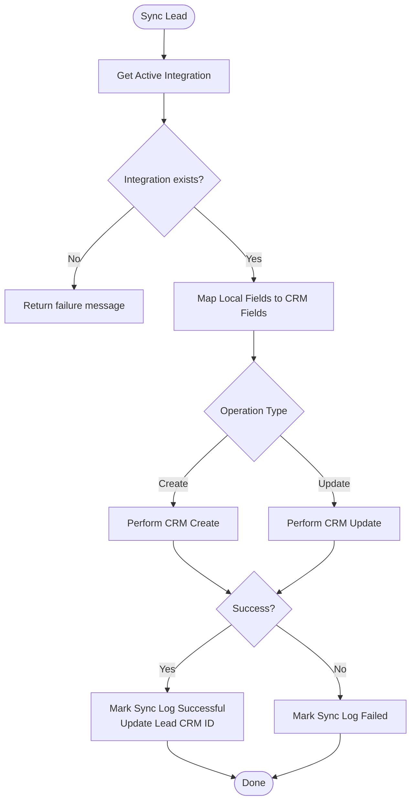
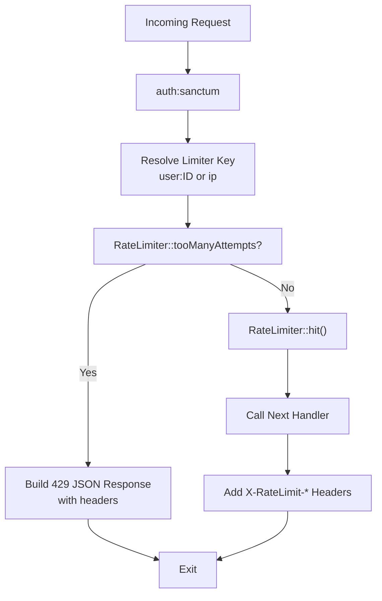
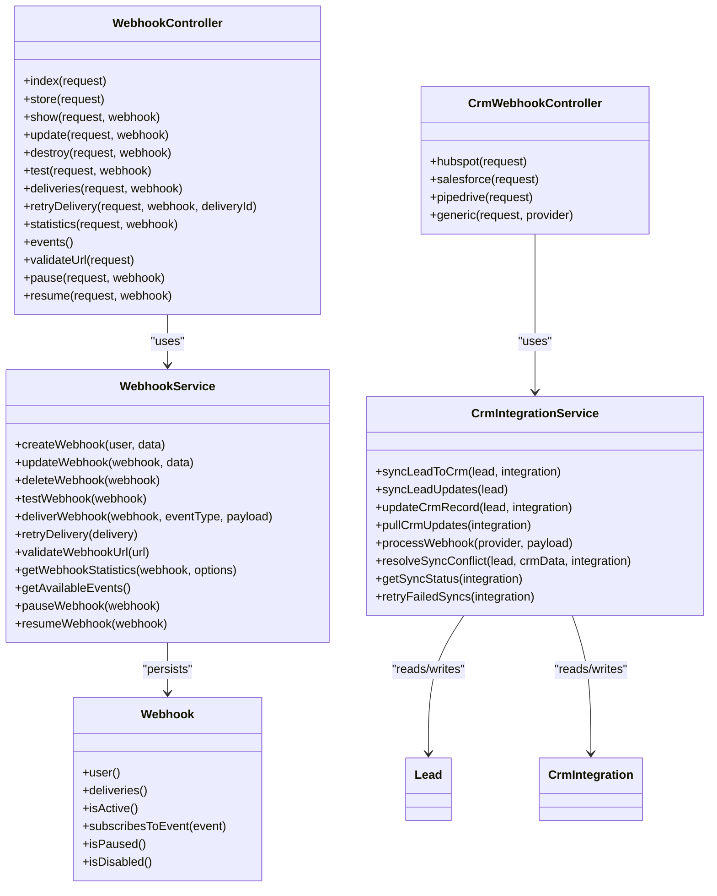

# API Extension & Integration

<cite>
**Referenced Files in This Document**
- [routes/api.php](file://routes/api.php)
- [app/Http/Middleware/ApiRateLimitMiddleware.php](file://app/Http/Middleware/ApiRateLimitMiddleware.php)
- [app/Services/WebhookService.php](file://app/Services/WebhookService.php)
- [app/Http/Controllers/Api/CrmWebhookController.php](file://app/Http/Controllers/Api/CrmWebhookController.php)
- [app/Services/CrmIntegrationService.php](file://app/Services/CrmIntegrationService.php)
- [app/Http/Controllers/Api/WebhookController.php](file://app/Http/Controllers/Api/WebhookController.php)
- [app/Models/Webhook.php](file://app/Models/Webhook.php)
- [config/services.php](file://config/services.php)
</cite>

## Table of Contents
1. [Introduction](#introduction)
2. [Project Structure](#project-structure)
3. [Core Components](#core-components)
4. [Architecture Overview](#architecture-overview)
5. [Detailed Component Analysis](#detailed-component-analysis)
6. [Dependency Analysis](#dependency-analysis)
7. [Performance Considerations](#performance-considerations)
8. [Troubleshooting Guide](#troubleshooting-guide)
9. [Conclusion](#conclusion)

## Introduction
This document explains how to extend existing API endpoints, add new API functionality, and integrate with external systems in the platform. It covers webhook implementation patterns, request validation, response formatting, rate limiting, authentication, third-party integrations, data synchronization, API versioning strategies, and error handling, logging, and monitoring for extended API functionality.

## Project Structure
The API surface is primarily defined in the routes file and implemented via controllers and services. Middleware enforces rate limits and authentication. Webhooks are managed through dedicated controllers and services, with CRM integrations supporting inbound webhooks and outbound synchronization.

**Diagram sources**
- [routes/api.php:1-800](file://routes/api.php#L1-L800)
- [app/Http/Middleware/ApiRateLimitMiddleware.php:1-125](file://app/Http/Middleware/ApiRateLimitMiddleware.php#L1-L125)
- [app/Services/WebhookService.php:1-517](file://app/Services/WebhookService.php#L1-L517)
- [app/Services/CrmIntegrationService.php:1-547](file://app/Services/CrmIntegrationService.php#L1-L547)
- [app/Http/Controllers/Api/WebhookController.php:1-264](file://app/Http/Controllers/Api/WebhookController.php#L1-L264)
- [app/Models/Webhook.php:1-60](file://app/Models/Webhook.php#L1-L60)

**Section sources**
- [routes/api.php:1-800](file://routes/api.php#L1-L800)

## Core Components
- API routing and grouping: Routes define endpoint groups with middleware for authentication and rate limiting. Examples include statistics, notifications, posts, timelines, events, fundraising, and developer tools.
- Authentication: The auth:sanctum middleware secures most API endpoints, ensuring requests originate from authenticated users.
- Rate limiting: The api.rate_limit middleware supports named limiter keys (e.g., api, search, upload, webhook) with per-limiter thresholds and decay windows.
- Webhook management: Dedicated controller and service manage creation, validation, signing, delivery, retries, and statistics.
- CRM integration: Inbound CRM webhooks are validated and queued for processing; outbound synchronization manages lead creation/update and pull updates.

**Section sources**
- [routes/api.php:26-800](file://routes/api.php#L26-L800)
- [app/Http/Middleware/ApiRateLimitMiddleware.php:10-125](file://app/Http/Middleware/ApiRateLimitMiddleware.php#L10-L125)
- [app/Services/WebhookService.php:14-517](file://app/Services/WebhookService.php#L14-L517)
- [app/Http/Controllers/Api/CrmWebhookController.php:11-242](file://app/Http/Controllers/Api/CrmWebhookController.php#L11-L242)
- [app/Services/CrmIntegrationService.php:24-547](file://app/Services/CrmIntegrationService.php#L24-L547)
- [app/Http/Controllers/Api/WebhookController.php:15-264](file://app/Http/Controllers/Api/WebhookController.php#L15-L264)
- [app/Models/Webhook.php:9-60](file://app/Models/Webhook.php#L9-L60)

## Architecture Overview
The API architecture separates concerns across routes, controllers, services, and models. Controllers handle HTTP concerns (validation, authorization, pagination, response formatting). Services encapsulate business logic (webhook delivery, CRM synchronization). Models represent persisted state (webhooks, deliveries, leads, integrations). Middleware enforces authentication and rate limits.

**Diagram sources**
- [routes/api.php:44-50](file://routes/api.php#L44-L50)
- [app/Http/Middleware/ApiRateLimitMiddleware.php:17-34](file://app/Http/Middleware/ApiRateLimitMiddleware.php#L17-L34)
- [app/Http/Controllers/Api/WebhookController.php:15-264](file://app/Http/Controllers/Api/WebhookController.php#L15-L264)
- [app/Services/WebhookService.php:14-517](file://app/Services/WebhookService.php#L14-L517)
- [app/Http/Controllers/Api/CrmWebhookController.php:11-242](file://app/Http/Controllers/Api/CrmWebhookController.php#L11-L242)
- [app/Services/CrmIntegrationService.php:24-547](file://app/Services/CrmIntegrationService.php#L24-L547)
- [app/Models/Webhook.php:9-60](file://app/Models/Webhook.php#L9-L60)

## Detailed Component Analysis

### Webhook Management API
The webhook management API allows authenticated users to create, list, update, delete, test, retry, and inspect webhooks. It validates URLs, signs payloads, tracks delivery outcomes, and computes statistics.

**Diagram sources**
- [routes/api.php:619-637](file://routes/api.php#L619-L637)
- [app/Http/Controllers/Api/WebhookController.php:53-65](file://app/Http/Controllers/Api/WebhookController.php#L53-L65)
- [app/Services/WebhookService.php:49-82](file://app/Services/WebhookService.php#L49-L82)
- [app/Services/WebhookService.php:138-152](file://app/Services/WebhookService.php#L138-L152)

Key behaviors:
- Validation: Uses Laravel form requests to validate inputs before service invocation.
- Signing: Adds X-Signature header using HMAC-SHA256 when a secret is present.
- Delivery: Sends HTTP POST with JSON payload and standard headers; captures response code/body/time.
- Retries: Schedules exponential backoff retries when failures occur.
- Statistics: Aggregates success/failure counts, response codes, and average response time.

**Section sources**
- [app/Http/Controllers/Api/WebhookController.php:15-264](file://app/Http/Controllers/Api/WebhookController.php#L15-L264)
- [app/Services/WebhookService.php:14-517](file://app/Services/WebhookService.php#L14-L517)
- [app/Models/Webhook.php:9-60](file://app/Models/Webhook.php#L9-L60)

### CRM Webhook Ingestion
The CRM webhook controller accepts provider-specific webhooks, validates signatures, and queues asynchronous processing.

**Diagram sources**
- [routes/api.php:44-50](file://routes/api.php#L44-L50)
- [app/Http/Controllers/Api/CrmWebhookController.php:20-52](file://app/Http/Controllers/Api/CrmWebhookController.php#L20-L52)
- [app/Http/Controllers/Api/CrmWebhookController.php:57-89](file://app/Http/Controllers/Api/CrmWebhookController.php#L57-L89)
- [app/Http/Controllers/Api/CrmWebhookController.php:94-126](file://app/Http/Controllers/Api/CrmWebhookController.php#L94-L126)
- [app/Services/CrmIntegrationService.php:218-252](file://app/Services/CrmIntegrationService.php#L218-L252)

Provider-specific validation:
- HubSpot: Validates signature and timestamp against configured secret.
- Salesforce: Performs UA/IP checks and allows development bypass.
- Pipedrive: Basic UA and payload presence checks with development allowance.

**Section sources**
- [app/Http/Controllers/Api/CrmWebhookController.php:11-242](file://app/Http/Controllers/Api/CrmWebhookController.php#L11-L242)
- [app/Services/CrmIntegrationService.php:24-547](file://app/Services/CrmIntegrationService.php#L24-L547)

### Outbound CRM Synchronization
The CRM integration service orchestrates bidirectional synchronization of leads with external providers, including create/update operations, pull updates, conflict resolution, and retry logic.

**Diagram sources**
- [app/Services/CrmIntegrationService.php:29-87](file://app/Services/CrmIntegrationService.php#L29-L87)
- [app/Services/CrmIntegrationService.php:122-164](file://app/Services/CrmIntegrationService.php#L122-L164)
- [app/Services/CrmIntegrationService.php:169-213](file://app/Services/CrmIntegrationService.php#L169-L213)

**Section sources**
- [app/Services/CrmIntegrationService.php:24-547](file://app/Services/CrmIntegrationService.php#L24-L547)

### Rate Limiting and Authentication
- Authentication: Most API routes are guarded by auth:sanctum, ensuring requests carry a valid session token.
- Rate limiting: The ApiRateLimitMiddleware supports named limiters (api, search, upload, webhook) with configurable thresholds and decay windows. It injects standard rate limit headers and returns a structured 429 response when exceeded.

**Diagram sources**
- [routes/api.php:90-95](file://routes/api.php#L90-L95)
- [routes/api.php:171-180](file://routes/api.php#L171-L180)
- [routes/api.php:98-100](file://routes/api.php#L98-L100)
- [routes/api.php:620-637](file://routes/api.php#L620-L637)
- [app/Http/Middleware/ApiRateLimitMiddleware.php:17-34](file://app/Http/Middleware/ApiRateLimitMiddleware.php#L17-L34)
- [app/Http/Middleware/ApiRateLimitMiddleware.php:53-76](file://app/Http/Middleware/ApiRateLimitMiddleware.php#L53-L76)
- [app/Http/Middleware/ApiRateLimitMiddleware.php:89-123](file://app/Http/Middleware/ApiRateLimitMiddleware.php#L89-L123)

**Section sources**
- [app/Http/Middleware/ApiRateLimitMiddleware.php:10-125](file://app/Http/Middleware/ApiRateLimitMiddleware.php#L10-L125)
- [routes/api.php:90-100](file://routes/api.php#L90-L100)
- [routes/api.php:171-180](file://routes/api.php#L171-L180)
- [routes/api.php:620-637](file://routes/api.php#L620-L637)

### Adding New API Endpoints
Steps to add a new API endpoint:
1. Define route(s) in routes/api.php under appropriate group (e.g., authenticated or public).
2. Create a controller in app/Http/Controllers/Api/ with action methods.
3. Implement request validation using form requests under app/Http/Requests/Api/.
4. Encapsulate business logic in a service under app/Services/.
5. Persist state via Eloquent models under app/Models/ if needed.
6. Apply middleware (auth:sanctum, api.rate_limit:*) as appropriate.
7. Return standardized JSON responses with success flag and data/meta.

Example patterns:
- CRUD resource endpoints: Use apiResource with explicit names where needed.
- Batch operations: Use POST endpoints with paginated retrieval.
- Event-driven endpoints: Use webhook routes with provider-specific validation.

**Section sources**
- [routes/api.php:1-800](file://routes/api.php#L1-L800)
- [app/Http/Controllers/Api/WebhookController.php:15-264](file://app/Http/Controllers/Api/WebhookController.php#L15-L264)
- [app/Services/WebhookService.php:14-517](file://app/Services/WebhookService.php#L14-L517)

### API Versioning Strategies
Current routes do not explicitly version endpoints. Recommended approaches:
- URI versioning: Prefix routes with /api/v1, /api/v2.
- Header versioning: Accept-Version header to select implementation.
- Content negotiation: media-type versioning (application/vnd.vendor.v1+json).
- Canary deployments: Use feature flags or separate subdomains.

[No sources needed since this section provides general guidance]

### Error Handling, Logging, and Monitoring
- Error responses: Structured JSON with success=false and error.code/message/details for rate limiting and controller exceptions.
- Logging: Controllers and services log info/warning/error with contextual data (headers, payload keys, error messages).
- Monitoring: Centralized configuration for monitoring services (email, Slack, PagerDuty, Datadog, NewRelic) under config/services.php.

**Section sources**
- [app/Http/Middleware/ApiRateLimitMiddleware.php:103-123](file://app/Http/Middleware/ApiRateLimitMiddleware.php#L103-L123)
- [app/Http/Controllers/Api/CrmWebhookController.php:41-51](file://app/Http/Controllers/Api/CrmWebhookController.php#L41-L51)
- [app/Services/WebhookService.php:193-224](file://app/Services/WebhookService.php#L193-L224)
- [config/services.php:46-52](file://config/services.php#L46-L52)

## Dependency Analysis
The following diagram highlights key dependencies among controllers, services, and models involved in webhook and CRM flows.

**Diagram sources**
- [app/Http/Controllers/Api/WebhookController.php:15-264](file://app/Http/Controllers/Api/WebhookController.php#L15-L264)
- [app/Services/WebhookService.php:14-517](file://app/Services/WebhookService.php#L14-L517)
- [app/Http/Controllers/Api/CrmWebhookController.php:11-242](file://app/Http/Controllers/Api/CrmWebhookController.php#L11-L242)
- [app/Services/CrmIntegrationService.php:24-547](file://app/Services/CrmIntegrationService.php#L24-L547)
- [app/Models/Webhook.php:9-60](file://app/Models/Webhook.php#L9-L60)

**Section sources**
- [app/Http/Controllers/Api/WebhookController.php:15-264](file://app/Http/Controllers/Api/WebhookController.php#L15-L264)
- [app/Services/WebhookService.php:14-517](file://app/Services/WebhookService.php#L14-L517)
- [app/Http/Controllers/Api/CrmWebhookController.php:11-242](file://app/Http/Controllers/Api/CrmWebhookController.php#L11-L242)
- [app/Services/CrmIntegrationService.php:24-547](file://app/Services/CrmIntegrationService.php#L24-L547)
- [app/Models/Webhook.php:9-60](file://app/Models/Webhook.php#L9-L60)

## Performance Considerations
- Asynchronous processing: Use queues for webhook delivery retries and CRM synchronization to avoid blocking requests.
- Efficient pagination: Controllers support pagination to limit payload sizes.
- Minimal serialization: Resource classes reduce over-fetching and keep payloads lean.
- Retry scheduling: Exponential backoff reduces load spikes during transient failures.

[No sources needed since this section provides general guidance]

## Troubleshooting Guide
Common issues and resolutions:
- Rate limit exceeded: Inspect X-RateLimit-* headers and Retry-After. Adjust client-side backoff or request pacing.
- Webhook signature invalid: Verify provider-specific validation logic and secrets. Confirm timestamps and user agents where applicable.
- Webhook delivery failures: Review delivery records, response codes, and error messages. Retry failed deliveries via the retry endpoint.
- CRM sync errors: Check sync logs, field mappings, and provider credentials. Retry failed operations.

**Section sources**
- [app/Http/Middleware/ApiRateLimitMiddleware.php:89-123](file://app/Http/Middleware/ApiRateLimitMiddleware.php#L89-L123)
- [app/Http/Controllers/Api/CrmWebhookController.php:30-34](file://app/Http/Controllers/Api/CrmWebhookController.php#L30-L34)
- [app/Services/WebhookService.php:210-231](file://app/Services/WebhookService.php#L210-L231)
- [app/Services/CrmIntegrationService.php:318-353](file://app/Services/CrmIntegrationService.php#L318-L353)

## Conclusion
The platform provides a robust foundation for API extension and integration. By leveraging the existing middleware, controllers, services, and models, you can add new endpoints, implement webhooks, integrate with external systems, enforce rate limits, and maintain strong error handling and observability. Adopt the recommended patterns for validation, response formatting, and versioning to ensure scalable and maintainable integrations.