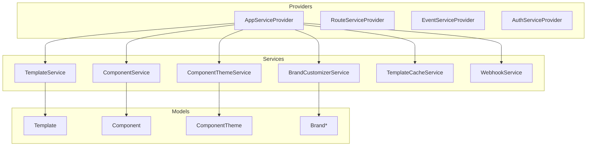
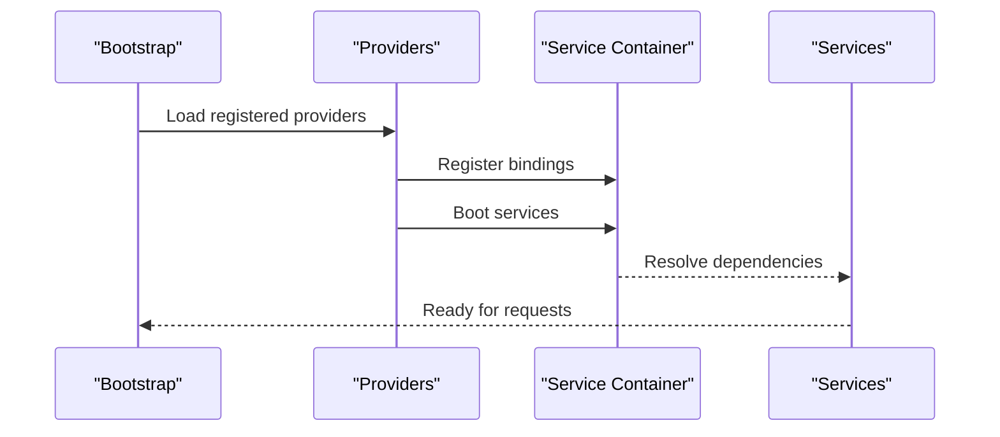
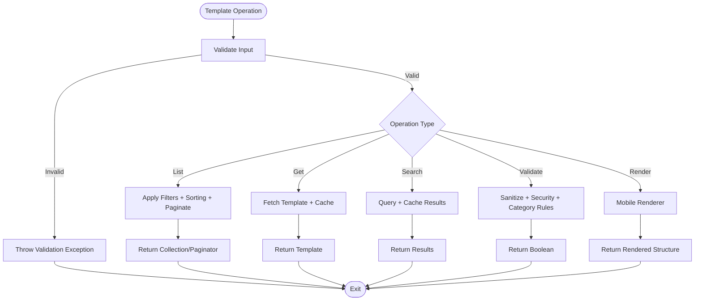
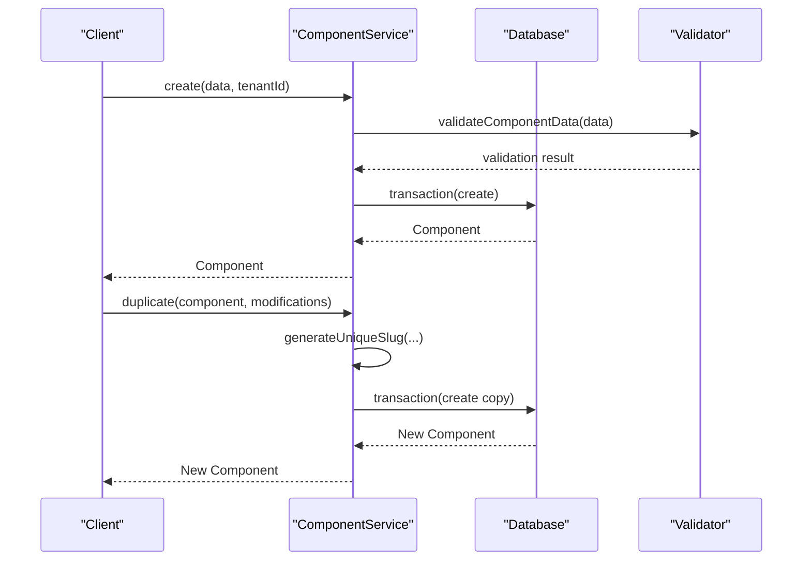
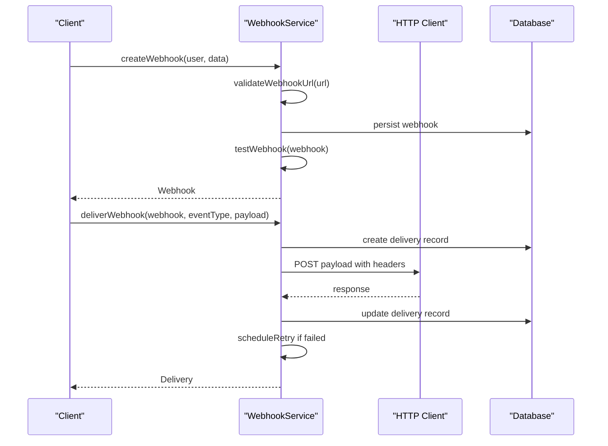
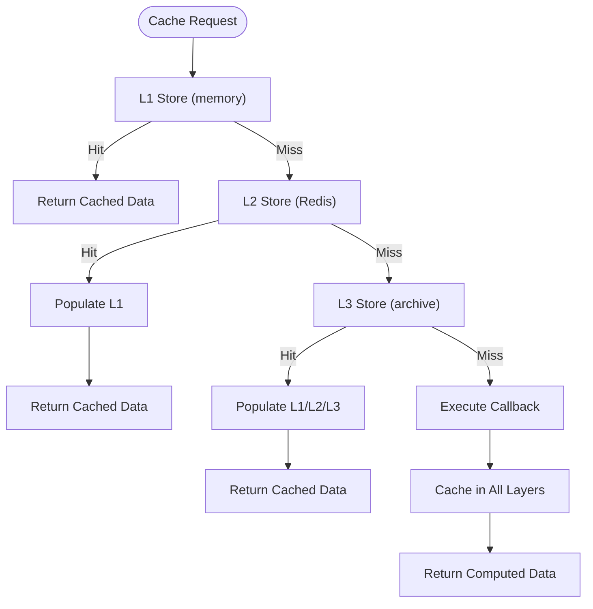
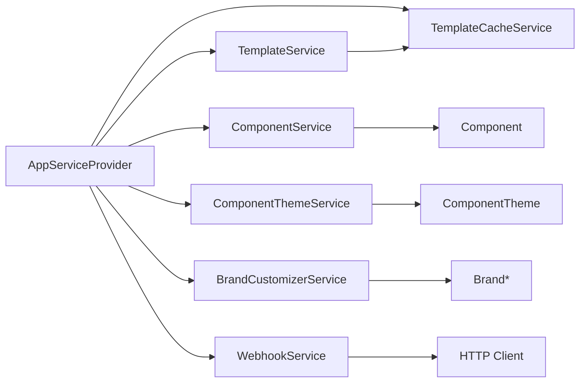

# Extension & Customization

<cite>
**Referenced Files in This Document**
- [AppServiceProvider.php](file://app/Providers/AppServiceProvider.php)
- [AuthServiceProvider.php](file://app/Providers/AuthServiceProvider.php)
- [EventServiceProvider.php](file://app/Providers/EventServiceProvider.php)
- [RouteServiceProvider.php](file://app/Providers/RouteServiceProvider.php)
- [providers.php](file://bootstrap/providers.php)
- [TemplateService.php](file://app/Services/TemplateService.php)
- [ComponentService.php](file://app/Services/ComponentService.php)
- [ComponentThemeService.php](file://app/Services/ComponentThemeService.php)
- [BrandCustomizerService.php](file://app/Services/BrandCustomizerService.php)
- [TemplateCacheService.php](file://app/Services/TemplateCacheService.php)
- [WebhookService.php](file://app/Services/WebhookService.php)
</cite>

## Table of Contents
1. [Introduction](#introduction)
2. [Project Structure](#project-structure)
3. [Core Components](#core-components)
4. [Architecture Overview](#architecture-overview)
5. [Detailed Component Analysis](#detailed-component-analysis)
6. [Dependency Analysis](#dependency-analysis)
7. [Performance Considerations](#performance-considerations)
8. [Troubleshooting Guide](#troubleshooting-guide)
9. [Conclusion](#conclusion)
10. [Appendices](#appendices)

## Introduction
This document explains how to extend and customize the platform with a focus on plugin development, custom service creation, and template/theme customization. It covers the service provider architecture for registering custom services, middleware hooks for extending functionality, and policy classes for authorization. It also documents API extension points, webhook integration, third-party connectivity, UI customization patterns, business logic extension, and data model modifications. Practical workflows and diagrams illustrate how to build extensions safely and efficiently.

## Project Structure
The platform follows Laravel conventions with a layered architecture:
- Providers: Service registration and bootstrapping
- Services: Business logic for templates, components, themes, branding, caching, and webhooks
- Models: Data entities and relationships
- Routes and middleware: HTTP pipeline and rate limiting
- Events and Listeners: Decoupled workflows and automation



**Diagram sources**
- [AppServiceProvider.php:12-32](file://app/Providers/AppServiceProvider.php#L12-L32)
- [RouteServiceProvider.php:25-39](file://app/Providers/RouteServiceProvider.php#L25-L39)
- [EventServiceProvider.php:18-71](file://app/Providers/EventServiceProvider.php#L18-L71)
- [AuthServiceProvider.php:14-24](file://app/Providers/AuthServiceProvider.php#L14-L24)
- [TemplateService.php:23-42](file://app/Services/TemplateService.php#L23-L42)
- [ComponentService.php:14-54](file://app/Services/ComponentService.php#L14-L54)
- [ComponentThemeService.php:12-39](file://app/Services/ComponentThemeService.php#L12-L39)
- [BrandCustomizerService.php:18-50](file://app/Services/BrandCustomizerService.php#L18-L50)
- [TemplateCacheService.php:16-81](file://app/Services/TemplateCacheService.php#L16-L81)
- [WebhookService.php:14-82](file://app/Services/WebhookService.php#L14-L82)

**Section sources**
- [AppServiceProvider.php:12-32](file://app/Providers/AppServiceProvider.php#L12-L32)
- [RouteServiceProvider.php:25-39](file://app/Providers/RouteServiceProvider.php#L25-L39)
- [EventServiceProvider.php:18-71](file://app/Providers/EventServiceProvider.php#L18-L71)
- [AuthServiceProvider.php:14-24](file://app/Providers/AuthServiceProvider.php#L14-L24)
- [providers.php:3-6](file://bootstrap/providers.php#L3-L6)

## Core Components
This section outlines the primary extension points and customization services.

- Service Provider Architecture
  - AppServiceProvider: Registers console commands and disables observers by default to reduce startup overhead.
  - RouteServiceProvider: Defines rate limits and mounts API/web routes with middleware stacks.
  - EventServiceProvider: Declares event-to-listener mappings and subscribers; discovery is disabled.
  - AuthServiceProvider: Maps policies to models for authorization.

- Template Management
  - TemplateService: Centralized template operations with tenant isolation, filtering, sorting, pagination, validation, performance metrics, and mobile rendering.

- Component System
  - ComponentService: CRUD, duplication, versioning, activation/deactivation, search/filtering, and preview generation with category-specific validations.

- Theming and Branding
  - ComponentThemeService: Theme creation with inheritance, validation, preview, accessibility checks, CSS compilation, backups, and tenant isolation.
  - BrandCustomizerService: Logo upload and optimization, color accessibility checks, font management, brand template creation, consistency reporting, and exports.

- Caching and Performance
  - TemplateCacheService: Multi-layer caching (memory, Redis, archive) with invalidation and warming strategies.

- Webhooks
  - WebhookService: Event-driven integrations with URL validation, signing, retry scheduling, statistics, and lifecycle controls.

**Section sources**
- [AppServiceProvider.php:12-32](file://app/Providers/AppServiceProvider.php#L12-L32)
- [RouteServiceProvider.php:25-39](file://app/Providers/RouteServiceProvider.php#L25-L39)
- [EventServiceProvider.php:25-44](file://app/Providers/EventServiceProvider.php#L25-L44)
- [AuthServiceProvider.php:14-16](file://app/Providers/AuthServiceProvider.php#L14-L16)
- [TemplateService.php:51-67](file://app/Services/TemplateService.php#L51-L67)
- [ComponentService.php:19-54](file://app/Services/ComponentService.php#L19-L54)
- [ComponentThemeService.php:17-39](file://app/Services/ComponentThemeService.php#L17-L39)
- [BrandCustomizerService.php:23-50](file://app/Services/BrandCustomizerService.php#L23-L50)
- [TemplateCacheService.php:39-81](file://app/Services/TemplateCacheService.php#L39-L81)
- [WebhookService.php:49-82](file://app/Services/WebhookService.php#L49-L82)

## Architecture Overview
The extension architecture leverages Laravel’s provider and service container patterns. Providers bootstrap services and bind them into the container. Services encapsulate domain logic and coordinate with models and external systems (e.g., Redis, HTTP clients). Events decouple workflows, while policies enforce authorization.

```mermaid
classDiagram
class AppServiceProvider {
+register() void
+boot() void
}
class RouteServiceProvider {
+HOME string
+boot() void
}
class EventServiceProvider {
+boot() void
+shouldDiscoverEvents() bool
}
class AuthServiceProvider {
+boot() void
}
class TemplateService {
+getAllTemplates(filters, options)
+getTemplateById(id)
+searchTemplates(query, filters, options)
+validateTemplateStructure(structure)
+renderForMobile(templateId, deviceType, options)
}
class ComponentService {
+create(data, tenantId)
+update(component, data)
+duplicate(component, modifications)
+createVersion(component, version, changes)
+search(filters, tenantId, perPage)
}
class ComponentThemeService {
+applyTheme(theme, componentIds)
+createThemeWithInheritance(tenantId, name, config, parentTheme)
+validateThemeConfig(config)
+generateThemePreview(theme, components)
+backupTheme(theme)
+restoreTheme(path, tenantId)
}
class BrandCustomizerService {
+getBrandData(tenantId)
+uploadLogo(file, tenantId)
+createColor(data, tenantId)
+createFont(data, tenantId)
+createTemplate(data, tenantId)
+runConsistencyCheck(guidelines, assets, tenantId)
}
class TemplateCacheService {
+rememberTemplate(id, callback)
+rememberSearchResults(query, filters, callback)
+invalidateTemplate(id)
+warmUpTemplateCache(templates)
}
class WebhookService {
+createWebhook(user, data)
+updateWebhook(webhook, data)
+deliverWebhook(webhook, eventType, payload)
+retryDelivery(delivery)
+getWebhookStatistics(webhook, options)
}
AppServiceProvider --> TemplateService : "registers"
AppServiceProvider --> ComponentService : "registers"
AppServiceProvider --> ComponentThemeService : "registers"
AppServiceProvider --> BrandCustomizerService : "registers"
AppServiceProvider --> TemplateCacheService : "registers"
AppServiceProvider --> WebhookService : "registers"
```



**Diagram sources**
- [AppServiceProvider.php:12-32](file://app/Providers/AppServiceProvider.php#L12-L32)
- [TemplateService.php:23-42](file://app/Services/TemplateService.php#L23-L42)
- [ComponentService.php:14-54](file://app/Services/ComponentService.php#L14-L54)
- [ComponentThemeService.php:12-39](file://app/Services/ComponentThemeService.php#L12-L39)
- [BrandCustomizerService.php:18-50](file://app/Services/BrandCustomizerService.php#L18-L50)
- [TemplateCacheService.php:16-81](file://app/Services/TemplateCacheService.php#L16-L81)
- [WebhookService.php:14-82](file://app/Services/WebhookService.php#L14-L82)

## Detailed Component Analysis

### Service Provider Architecture
- AppServiceProvider
  - Purpose: Register console commands and disable observers during boot to minimize startup dependencies.
  - Extension point: Add custom bindings, singletons, and command registrations.
- RouteServiceProvider
  - Purpose: Configure rate limiting and mount API/web routes with middleware stacks.
  - Extension point: Add custom rate limiter profiles or middleware groups.
- EventServiceProvider
  - Purpose: Define event-to-listener mappings and subscribers; discovery disabled.
  - Extension point: Register new event/listener pairs or subscribers.
- AuthServiceProvider
  - Purpose: Map policies to models for authorization.
  - Extension point: Add new model-policy mappings.



**Diagram sources**
- [providers.php:3-6](file://bootstrap/providers.php#L3-L6)
- [AppServiceProvider.php:12-32](file://app/Providers/AppServiceProvider.php#L12-L32)
- [RouteServiceProvider.php:25-39](file://app/Providers/RouteServiceProvider.php#L25-L39)
- [EventServiceProvider.php:59-62](file://app/Providers/EventServiceProvider.php#L59-L62)
- [AuthServiceProvider.php:21-24](file://app/Providers/AuthServiceProvider.php#L21-L24)

**Section sources**
- [providers.php:3-6](file://bootstrap/providers.php#L3-L6)
- [AppServiceProvider.php:12-32](file://app/Providers/AppServiceProvider.php#L12-L32)
- [RouteServiceProvider.php:25-39](file://app/Providers/RouteServiceProvider.php#L25-L39)
- [EventServiceProvider.php:59-62](file://app/Providers/EventServiceProvider.php#L59-L62)
- [AuthServiceProvider.php:21-24](file://app/Providers/AuthServiceProvider.php#L21-L24)

### Template Management Service
TemplateService centralizes template operations with tenant isolation, filtering, validation, and performance monitoring. It delegates caching and mobile rendering to dedicated services.



**Diagram sources**
- [TemplateService.php:51-67](file://app/Services/TemplateService.php#L51-L67)
- [TemplateService.php:76-99](file://app/Services/TemplateService.php#L76-L99)
- [TemplateService.php:109-129](file://app/Services/TemplateService.php#L109-L129)
- [TemplateService.php:235-263](file://app/Services/TemplateService.php#L235-L263)
- [TemplateService.php:509-518](file://app/Services/TemplateService.php#L509-L518)

**Section sources**
- [TemplateService.php:51-67](file://app/Services/TemplateService.php#L51-L67)
- [TemplateService.php:76-99](file://app/Services/TemplateService.php#L76-L99)
- [TemplateService.php:109-129](file://app/Services/TemplateService.php#L109-L129)
- [TemplateService.php:235-263](file://app/Services/TemplateService.php#L235-L263)
- [TemplateService.php:509-518](file://app/Services/TemplateService.php#L509-L518)

### Component System Service
ComponentService supports creation, updates, duplication, versioning, activation, search, and preview generation. It enforces tenant scoping and validates configurations per category.



**Diagram sources**
- [ComponentService.php:19-54](file://app/Services/ComponentService.php#L19-L54)
- [ComponentService.php:104-129](file://app/Services/ComponentService.php#L104-L129)

**Section sources**
- [ComponentService.php:19-54](file://app/Services/ComponentService.php#L19-L54)
- [ComponentService.php:104-129](file://app/Services/ComponentService.php#L104-L129)

### Theming and Branding Services
- ComponentThemeService
  - Validates theme configs, generates CSS variables, compiles CSS, previews, and manages backups/restores.
  - Enforces tenant isolation and accessibility checks.
- BrandCustomizerService
  - Handles logo uploads and optimization, color accessibility, font management, brand template creation, consistency checks, and exports.

```mermaid
classDiagram
class ComponentThemeService {
+applyTheme(theme, componentIds)
+createThemeWithInheritance(tenantId, name, config, parentTheme)
+validateThemeConfig(config)
+generateThemePreview(theme, components)
+backupTheme(theme)
+restoreTheme(path, tenantId)
}
class BrandCustomizerService {
+getBrandData(tenantId)
+uploadLogo(file, tenantId)
+createColor(data, tenantId)
+createFont(data, tenantId)
+createTemplate(data, tenantId)
+runConsistencyCheck(guidelines, assets, tenantId)
+exportAssets(assets, guidelines, format, tenantId)
}
ComponentThemeService --> ComponentTheme : "operates on"
BrandCustomizerService --> Brand* : "manages"
```

**Diagram sources**
- [ComponentThemeService.php:17-39](file://app/Services/ComponentThemeService.php#L17-L39)
- [ComponentThemeService.php:275-286](file://app/Services/ComponentThemeService.php#L275-L286)
- [BrandCustomizerService.php:23-50](file://app/Services/BrandCustomizerService.php#L23-L50)
- [BrandCustomizerService.php:507-530](file://app/Services/BrandCustomizerService.php#L507-L530)

**Section sources**
- [ComponentThemeService.php:17-39](file://app/Services/ComponentThemeService.php#L17-L39)
- [ComponentThemeService.php:275-286](file://app/Services/ComponentThemeService.php#L275-L286)
- [BrandCustomizerService.php:23-50](file://app/Services/BrandCustomizerService.php#L23-L50)
- [BrandCustomizerService.php:507-530](file://app/Services/BrandCustomizerService.php#L507-L530)

### Webhook Integration Service
WebhookService enables event-driven integrations with URL validation, signing, retry scheduling, and statistics.



**Diagram sources**
- [WebhookService.php:49-82](file://app/Services/WebhookService.php#L49-L82)
- [WebhookService.php:157-232](file://app/Services/WebhookService.php#L157-L232)
- [WebhookService.php:237-285](file://app/Services/WebhookService.php#L237-L285)

**Section sources**
- [WebhookService.php:49-82](file://app/Services/WebhookService.php#L49-L82)
- [WebhookService.php:157-232](file://app/Services/WebhookService.php#L157-L232)
- [WebhookService.php:237-285](file://app/Services/WebhookService.php#L237-L285)

### Caching Strategy for Templates
TemplateCacheService implements a multi-layer cache with L1/L2/L3 stores and metadata/optimization archives, enabling fast retrieval and intelligent invalidation.



**Diagram sources**
- [TemplateCacheService.php:39-81](file://app/Services/TemplateCacheService.php#L39-L81)
- [TemplateCacheService.php:160-173](file://app/Services/TemplateCacheService.php#L160-L173)

**Section sources**
- [TemplateCacheService.php:39-81](file://app/Services/TemplateCacheService.php#L39-L81)
- [TemplateCacheService.php:160-173](file://app/Services/TemplateCacheService.php#L160-L173)

## Dependency Analysis
- Providers depend on the container to resolve services and register bindings.
- Services depend on models and external systems (Redis, HTTP client).
- TemplateService composes TemplateCacheService and MobileTemplateRenderer.
- ComponentThemeService depends on ComponentTheme and tenant-scoped queries.
- BrandCustomizerService coordinates multiple Brand* models and storage.
- WebhookService integrates with HTTP and persistence layers.



**Diagram sources**
- [AppServiceProvider.php:12-32](file://app/Providers/AppServiceProvider.php#L12-L32)
- [TemplateService.php:23-42](file://app/Services/TemplateService.php#L23-L42)
- [ComponentService.php:14-54](file://app/Services/ComponentService.php#L14-L54)
- [ComponentThemeService.php:12-39](file://app/Services/ComponentThemeService.php#L12-L39)
- [BrandCustomizerService.php:18-50](file://app/Services/BrandCustomizerService.php#L18-L50)
- [TemplateCacheService.php:16-81](file://app/Services/TemplateCacheService.php#L16-L81)
- [WebhookService.php:14-82](file://app/Services/WebhookService.php#L14-L82)

**Section sources**
- [AppServiceProvider.php:12-32](file://app/Providers/AppServiceProvider.php#L12-L32)
- [TemplateService.php:23-42](file://app/Services/TemplateService.php#L23-L42)
- [ComponentService.php:14-54](file://app/Services/ComponentService.php#L14-L54)
- [ComponentThemeService.php:12-39](file://app/Services/ComponentThemeService.php#L12-L39)
- [BrandCustomizerService.php:18-50](file://app/Services/BrandCustomizerService.php#L18-L50)
- [TemplateCacheService.php:16-81](file://app/Services/TemplateCacheService.php#L16-L81)
- [WebhookService.php:14-82](file://app/Services/WebhookService.php#L14-L82)

## Performance Considerations
- Use TemplateCacheService to cache frequently accessed templates and search results.
- Prefer paginated queries for large datasets in TemplateService and ComponentService.
- Leverage component previews to reduce rendering overhead during authoring.
- Apply theme CSS compilation and caching via ComponentThemeService to minimize runtime computation.
- Use WebhookService’s retry scheduling and exponential backoff to balance reliability and resource usage.

[No sources needed since this section provides general guidance]

## Troubleshooting Guide
- Template validation failures: Review validation rules and security checks in TemplateService; confirm sanitized structure and category-specific rules.
- Component creation/update errors: Validate data against category-specific rules and ensure tenant scoping.
- Theme validation failures: Confirm color formats, contrast ratios, and required fields in theme config.
- Webhook delivery issues: Inspect signatures, headers, timeouts, and retry attempts; review delivery records and logs.
- Cache misses: Verify multi-layer cache keys and invalidation sequences; use cache warming for popular templates.

**Section sources**
- [TemplateService.php:235-263](file://app/Services/TemplateService.php#L235-L263)
- [ComponentService.php:303-331](file://app/Services/ComponentService.php#L303-L331)
- [ComponentThemeService.php:79-118](file://app/Services/ComponentThemeService.php#L79-L118)
- [WebhookService.php:157-232](file://app/Services/WebhookService.php#L157-L232)
- [TemplateCacheService.php:160-173](file://app/Services/TemplateCacheService.php#L160-L173)

## Conclusion
The platform provides robust extension points through providers, services, and policies. Developers can register custom services, extend functionality via middleware and events, enforce authorization with policies, and customize templates, components, themes, and branding. Webhook integration and caching services enable scalable integrations and performance. Following the outlined workflows and diagrams ensures safe, maintainable, and extensible customizations.

[No sources needed since this section summarizes without analyzing specific files]

## Appendices

### Plugin Development Guidelines
- Encapsulate logic in dedicated services under app/Services.
- Register services in AppServiceProvider and bind interfaces where appropriate.
- Use events and listeners for decoupled workflows; define mappings in EventServiceProvider.
- Enforce authorization via policies mapped in AuthServiceProvider.

**Section sources**
- [AppServiceProvider.php:12-32](file://app/Providers/AppServiceProvider.php#L12-L32)
- [EventServiceProvider.php:25-44](file://app/Providers/EventServiceProvider.php#L25-L44)
- [AuthServiceProvider.php:14-16](file://app/Providers/AuthServiceProvider.php#L14-L16)

### Custom Component Creation Workflow
- Define category-specific validation rules in ComponentService.
- Use create() to validate and persist; leverage duplicate() and createVersion() for iterations.
- Generate previews with generatePreview() to validate rendering.

**Section sources**
- [ComponentService.php:19-54](file://app/Services/ComponentService.php#L19-L54)
- [ComponentService.php:104-129](file://app/Services/ComponentService.php#L104-L129)
- [ComponentService.php:419-441](file://app/Services/ComponentService.php#L419-L441)

### Theme Customization Patterns
- Create themes with inheritance via ComponentThemeService and validate configs.
- Apply themes to components and compile CSS; generate previews and accessibility reports.
- Back up and restore themes for disaster recovery.

**Section sources**
- [ComponentThemeService.php:44-74](file://app/Services/ComponentThemeService.php#L44-L74)
- [ComponentThemeService.php:17-39](file://app/Services/ComponentThemeService.php#L17-L39)
- [ComponentThemeService.php:242-270](file://app/Services/ComponentThemeService.php#L242-L270)

### API Extension Points and Webhook Integration
- Extend routes via RouteServiceProvider and attach middleware.
- Integrate third-party systems using WebhookService with signing and retry logic.
- Emit events to trigger downstream actions; manage subscriptions in EventServiceProvider.

**Section sources**
- [RouteServiceProvider.php:25-39](file://app/Providers/RouteServiceProvider.php#L25-L39)
- [WebhookService.php:157-232](file://app/Services/WebhookService.php#L157-L232)
- [EventServiceProvider.php:25-44](file://app/Providers/EventServiceProvider.php#L25-L44)

### UI Customization and Data Model Modifications
- Customize component rendering via category-specific preview generators.
- Modify brand assets and templates through BrandCustomizerService.
- Adjust tenant-scoped models to reflect branding and theme preferences.

**Section sources**
- [ComponentService.php:419-558](file://app/Services/ComponentService.php#L419-L558)
- [BrandCustomizerService.php:507-530](file://app/Services/BrandCustomizerService.php#L507-L530)
- [BrandCustomizerService.php:641-672](file://app/Services/BrandCustomizerService.php#L641-L672)