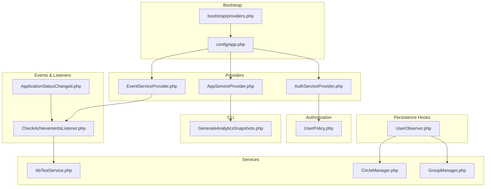
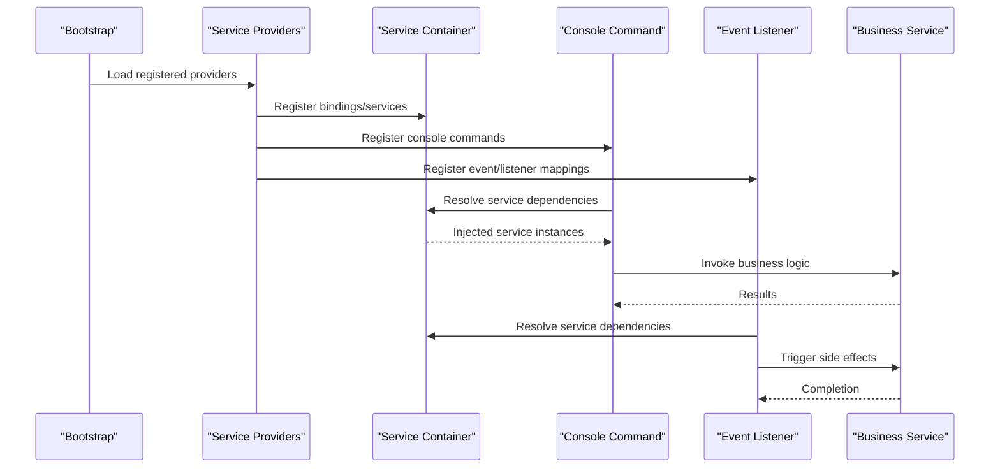
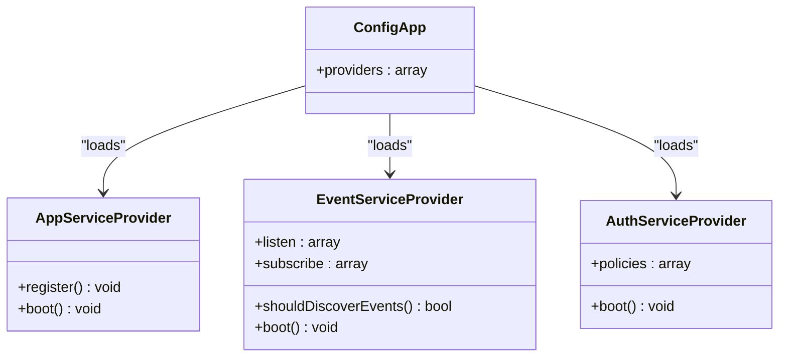
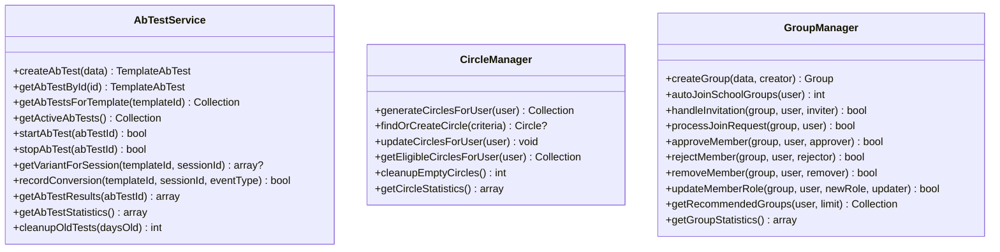
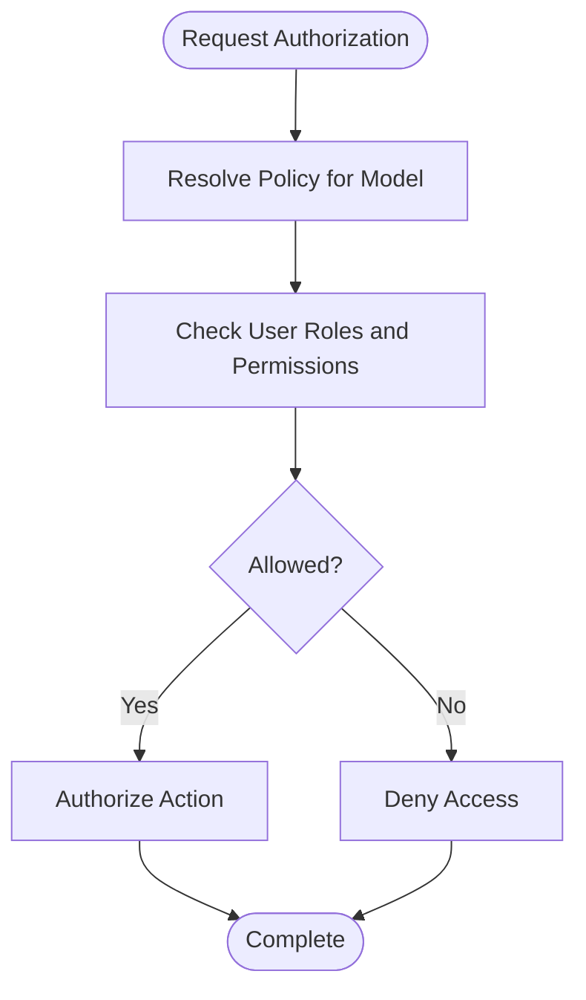
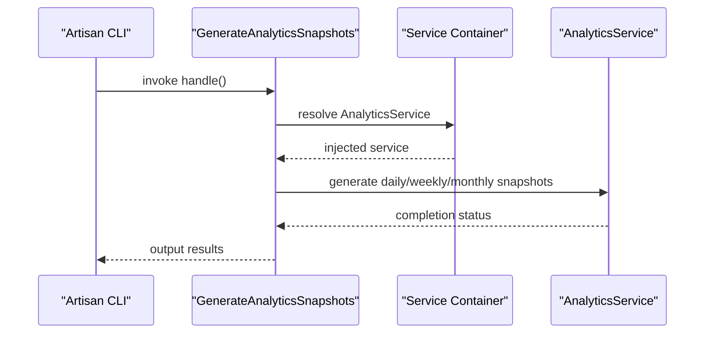
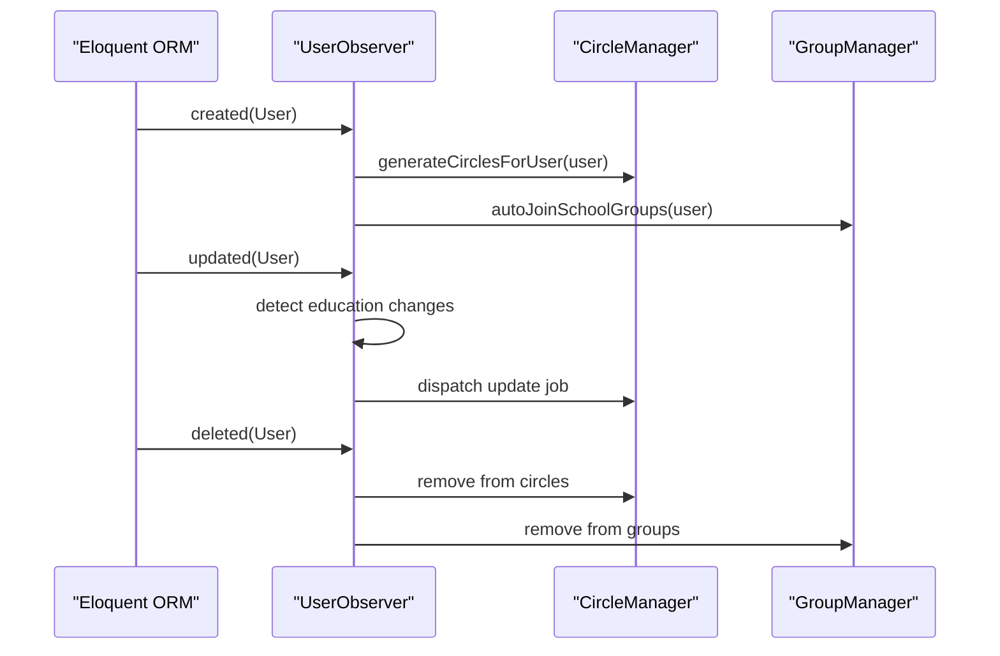
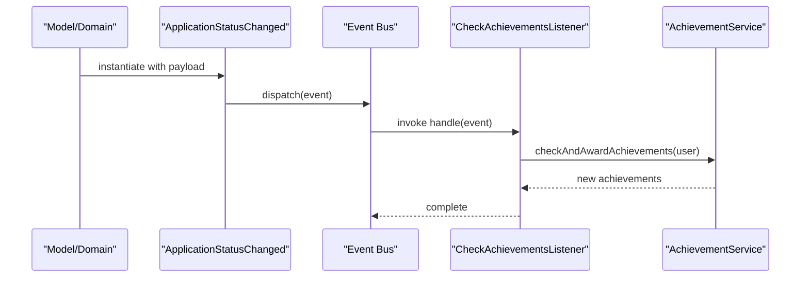
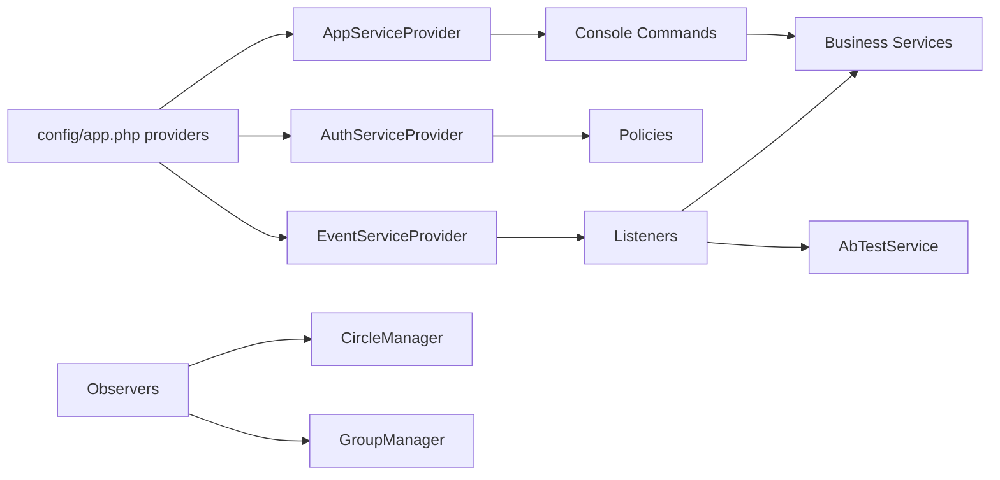

# Plugin Development & Service Extension

<cite>
**Referenced Files in This Document**
- [AppServiceProvider.php](file://app/Providers/AppServiceProvider.php)
- [AuthServiceProvider.php](file://app/Providers/AuthServiceProvider.php)
- [EventServiceProvider.php](file://app/Providers/EventServiceProvider.php)
- [providers.php](file://bootstrap/providers.php)
- [app.php](file://config/app.php)
- [AbTestService.php](file://app/Services/AbTestService.php)
- [CircleManager.php](file://app/Services/CircleManager.php)
- [GroupManager.php](file://app/Services/GroupManager.php)
- [UserPolicy.php](file://app/Policies/UserPolicy.php)
- [GenerateAnalyticsSnapshots.php](file://app/Console/Commands/GenerateAnalyticsSnapshots.php)
- [UserObserver.php](file://app/Observers/UserObserver.php)
- [ApplicationStatusChanged.php](file://app/Events/ApplicationStatusChanged.php)
- [CheckAchievementsListener.php](file://app/Listeners/CheckAchievementsListener.php)
</cite>

## Table of Contents
1. [Introduction](#introduction)
2. [Project Structure](#project-structure)
3. [Core Components](#core-components)
4. [Architecture Overview](#architecture-overview)
5. [Detailed Component Analysis](#detailed-component-analysis)
6. [Dependency Analysis](#dependency-analysis)
7. [Performance Considerations](#performance-considerations)
8. [Troubleshooting Guide](#troubleshooting-guide)
9. [Conclusion](#conclusion)
10. [Appendices](#appendices)

## Introduction
This document explains how to develop plugins and extend services in a Laravel application using the existing patterns present in the codebase. It focuses on:
- Service provider registration and lifecycle hooks
- Creating and registering custom services
- Extending functionality via middleware, policies, commands, observers, and event/listener mechanisms
- Practical examples for building reusable service packages and integrating third-party services
- Dependency injection patterns, service registration, and configuration management

The goal is to enable developers to build modular, testable, and maintainable extensions that integrate cleanly with the framework’s service container and event system.

## Project Structure
The Laravel application organizes extension points across providers, services, policies, commands, observers, and events. Providers define registration and bootstrapping behavior; services encapsulate domain logic; policies enforce authorization; commands expose CLI capabilities; observers react to model lifecycle events; and events/listeners decouple cross-cutting concerns.

**Diagram sources**
- [providers.php:1-7](file://bootstrap/providers.php#L1-L7)
- [app.php:119-158](file://config/app.php#L119-L158)
- [AppServiceProvider.php:12-32](file://app/Providers/AppServiceProvider.php#L12-L32)
- [AuthServiceProvider.php:14-24](file://app/Providers/AuthServiceProvider.php#L14-L24)
- [EventServiceProvider.php:25-62](file://app/Providers/EventServiceProvider.php#L25-L62)
- [AbTestService.php:18-53](file://app/Services/AbTestService.php#L18-L53)
- [CircleManager.php:11-62](file://app/Services/CircleManager.php#L11-L62)
- [GroupManager.php:14-42](file://app/Services/GroupManager.php#L14-L42)
- [UserPolicy.php:7-38](file://app/Policies/UserPolicy.php#L7-L38)
- [GenerateAnalyticsSnapshots.php:9-24](file://app/Console/Commands/GenerateAnalyticsSnapshots.php#L9-L24)
- [UserObserver.php:11-46](file://app/Observers/UserObserver.php#L11-L46)
- [ApplicationStatusChanged.php:10-26](file://app/Events/ApplicationStatusChanged.php#L10-L26)
- [CheckAchievementsListener.php:10-48](file://app/Listeners/CheckAchievementsListener.php#L10-L48)

**Section sources**
- [providers.php:1-7](file://bootstrap/providers.php#L1-L7)
- [app.php:119-158](file://config/app.php#L119-L158)

## Core Components
- Service providers: centralize registration and boot logic for services, commands, policies, and event mappings.
- Services: encapsulate business logic and interact with models, cache, and external systems.
- Policies: define authorization rules per model and action.
- Commands: CLI entry points for scheduled tasks and batch operations.
- Observers: model lifecycle hooks for side effects and background jobs.
- Events and listeners: decoupled reactions to application actions.

**Section sources**
- [AppServiceProvider.php:12-32](file://app/Providers/AppServiceProvider.php#L12-L32)
- [AuthServiceProvider.php:14-24](file://app/Providers/AuthServiceProvider.php#L14-L24)
- [EventServiceProvider.php:25-62](file://app/Providers/EventServiceProvider.php#L25-L62)
- [AbTestService.php:18-53](file://app/Services/AbTestService.php#L18-L53)
- [UserPolicy.php:7-38](file://app/Policies/UserPolicy.php#L7-L38)
- [GenerateAnalyticsSnapshots.php:9-24](file://app/Console/Commands/GenerateAnalyticsSnapshots.php#L9-L24)
- [UserObserver.php:11-46](file://app/Observers/UserObserver.php#L11-L46)
- [ApplicationStatusChanged.php:10-26](file://app/Events/ApplicationStatusChanged.php#L10-L26)
- [CheckAchievementsListener.php:10-48](file://app/Listeners/CheckAchievementsListener.php#L10-L48)

## Architecture Overview
The application uses Laravel’s provider-driven architecture:
- Providers are registered in configuration and bootstrapped on application start.
- Services are resolved from the container and injected into commands, controllers, listeners, and observers.
- Authorization is enforced via model-policy mappings.
- Events decouple actions from side effects; listeners coordinate outcomes.

**Diagram sources**
- [app.php:119-158](file://config/app.php#L119-L158)
- [AppServiceProvider.php:12-32](file://app/Providers/AppServiceProvider.php#L12-L32)
- [EventServiceProvider.php:25-62](file://app/Providers/EventServiceProvider.php#L25-L62)
- [GenerateAnalyticsSnapshots.php:20-24](file://app/Console/Commands/GenerateAnalyticsSnapshots.php#L20-L24)
- [CheckAchievementsListener.php:14-16](file://app/Listeners/CheckAchievementsListener.php#L14-L16)

## Detailed Component Analysis

### Service Provider Registration and Lifecycle
- Providers are enumerated in configuration and loaded during bootstrap.
- AppServiceProvider demonstrates registering console commands and temporarily disabling model observers.
- EventServiceProvider defines event-to-listener mappings and subscription lists.
- AuthServiceProvider maps models to policies.

**Diagram sources**
- [app.php:119-158](file://config/app.php#L119-L158)
- [AppServiceProvider.php:12-32](file://app/Providers/AppServiceProvider.php#L12-L32)
- [EventServiceProvider.php:25-71](file://app/Providers/EventServiceProvider.php#L25-L71)
- [AuthServiceProvider.php:14-24](file://app/Providers/AuthServiceProvider.php#L14-L24)

**Section sources**
- [providers.php:1-7](file://bootstrap/providers.php#L1-L7)
- [app.php:119-158](file://config/app.php#L119-L158)
- [AppServiceProvider.php:12-32](file://app/Providers/AppServiceProvider.php#L12-L32)
- [EventServiceProvider.php:25-71](file://app/Providers/EventServiceProvider.php#L25-L71)
- [AuthServiceProvider.php:14-24](file://app/Providers/AuthServiceProvider.php#L14-L24)

### Custom Services: Business Logic Encapsulation
- AbTestService encapsulates A/B testing workflows, caching, validation, and statistical summaries.
- CircleManager and GroupManager orchestrate membership and grouping logic with transactional safety and logging.
- These services are designed for dependency injection and can be extended or mocked for testing.

**Diagram sources**
- [AbTestService.php:18-311](file://app/Services/AbTestService.php#L18-L311)
- [CircleManager.php:11-310](file://app/Services/CircleManager.php#L11-L310)
- [GroupManager.php:14-392](file://app/Services/GroupManager.php#L14-L392)

**Section sources**
- [AbTestService.php:18-311](file://app/Services/AbTestService.php#L18-L311)
- [CircleManager.php:11-310](file://app/Services/CircleManager.php#L11-L310)
- [GroupManager.php:14-392](file://app/Services/GroupManager.php#L14-L392)

### Authorization Extensions via Policies
- Model-policy mappings are declared in AuthServiceProvider.
- Policies implement granular authorization checks for actions like view, create, update, delete, suspend, manageRoles, and viewActivityLogs.
- Policies delegate to user roles and permissions, enabling reusable authorization logic.

**Diagram sources**
- [AuthServiceProvider.php:14-24](file://app/Providers/AuthServiceProvider.php#L14-L24)
- [UserPolicy.php:7-185](file://app/Policies/UserPolicy.php#L7-L185)

**Section sources**
- [AuthServiceProvider.php:14-24](file://app/Providers/AuthServiceProvider.php#L14-L24)
- [UserPolicy.php:7-185](file://app/Policies/UserPolicy.php#L7-L185)

### CLI Commands and Dependency Injection
- Commands declare signature and description, receive services via constructor injection, and implement handle logic.
- Example: GenerateAnalyticsSnapshots uses AnalyticsService to produce historical snapshots across multiple categories.

**Diagram sources**
- [GenerateAnalyticsSnapshots.php:9-80](file://app/Console/Commands/GenerateAnalyticsSnapshots.php#L9-L80)

**Section sources**
- [GenerateAnalyticsSnapshots.php:9-80](file://app/Console/Commands/GenerateAnalyticsSnapshots.php#L9-L80)

### Observers and Side Effects
- Observers react to model lifecycle events (created, updated, deleted).
- UserObserver integrates CircleManager and GroupManager to generate circles, auto-join groups, and clean up memberships.
- Observers can dispatch queued jobs and log outcomes.

**Diagram sources**
- [UserObserver.php:11-117](file://app/Observers/UserObserver.php#L11-L117)
- [CircleManager.php:11-62](file://app/Services/CircleManager.php#L11-L62)
- [GroupManager.php:14-118](file://app/Services/GroupManager.php#L14-L118)

**Section sources**
- [UserObserver.php:11-117](file://app/Observers/UserObserver.php#L11-L117)
- [CircleManager.php:11-62](file://app/Services/CircleManager.php#L11-L62)
- [GroupManager.php:14-118](file://app/Services/GroupManager.php#L14-L118)

### Events and Listeners for Decoupling
- Events represent notable occurrences; listeners react without coupling to the triggering code.
- Example: ApplicationStatusChanged triggers achievement checks through CheckAchievementsListener.
- Listener resolves AchievementService and coordinates awarding logic.

**Diagram sources**
- [ApplicationStatusChanged.php:10-26](file://app/Events/ApplicationStatusChanged.php#L10-L26)
- [CheckAchievementsListener.php:10-79](file://app/Listeners/CheckAchievementsListener.php#L10-L79)

**Section sources**
- [ApplicationStatusChanged.php:10-26](file://app/Events/ApplicationStatusChanged.php#L10-L26)
- [CheckAchievementsListener.php:10-79](file://app/Listeners/CheckAchievementsListener.php#L10-L79)

## Dependency Analysis
- Providers depend on configuration arrays to load and register components.
- Services depend on models, cache, database, and logging facilities.
- Commands and listeners depend on services via constructor injection.
- Observers depend on managers and job dispatchers.

**Diagram sources**
- [app.php:119-158](file://config/app.php#L119-L158)
- [AppServiceProvider.php:12-32](file://app/Providers/AppServiceProvider.php#L12-L32)
- [AuthServiceProvider.php:14-24](file://app/Providers/AuthServiceProvider.php#L14-L24)
- [EventServiceProvider.php:25-62](file://app/Providers/EventServiceProvider.php#L25-L62)
- [UserObserver.php:11-21](file://app/Observers/UserObserver.php#L11-L21)

**Section sources**
- [app.php:119-158](file://config/app.php#L119-L158)
- [AppServiceProvider.php:12-32](file://app/Providers/AppServiceProvider.php#L12-L32)
- [AuthServiceProvider.php:14-24](file://app/Providers/AuthServiceProvider.php#L14-L24)
- [EventServiceProvider.php:25-62](file://app/Providers/EventServiceProvider.php#L25-L62)
- [UserObserver.php:11-21](file://app/Observers/UserObserver.php#L11-L21)

## Performance Considerations
- Prefer caching for frequently accessed data in services (e.g., AbTestService uses cache keys and durations).
- Use transactions for atomic operations in managers (e.g., CircleManager and GroupManager).
- Queue long-running tasks triggered by listeners or observers to keep requests responsive.
- Minimize N+1 queries by eager-loading relations and batching operations.

[No sources needed since this section provides general guidance]

## Troubleshooting Guide
- If commands do not appear in CLI, verify provider registration and console detection logic.
- If authorization fails unexpectedly, review policy mappings and user roles/permissions.
- If observers cause database errors, wrap operations in transactions and add robust logging.
- If listeners fail silently, ensure they implement proper error logging and consider queue-backed listeners.

**Section sources**
- [AppServiceProvider.php:26-31](file://app/Providers/AppServiceProvider.php#L26-L31)
- [AuthServiceProvider.php:14-24](file://app/Providers/AuthServiceProvider.php#L14-L24)
- [UserObserver.php:26-46](file://app/Observers/UserObserver.php#L26-L46)
- [CheckAchievementsListener.php:21-48](file://app/Listeners/CheckAchievementsListener.php#L21-L48)

## Conclusion
By leveraging Laravel’s provider architecture, dependency injection, and event system, you can build extensible plugins that encapsulate business logic in services, enforce authorization via policies, automate tasks with commands, react to lifecycle events with observers, and decouple cross-cutting concerns with events and listeners. The provided patterns offer a blueprint for creating reusable, maintainable, and testable extensions.

[No sources needed since this section summarizes without analyzing specific files]

## Appendices

### Practical Patterns for Plugin Development
- Service registration: bind interfaces to implementations in a provider’s register method; resolve via constructor injection in commands, listeners, and controllers.
- Configuration management: define feature flags and third-party credentials in config files; load via env helpers.
- Third-party integration: wrap external APIs in dedicated service classes; inject clients via constructor; mock for tests.
- Reusable packages: namespace services under a dedicated folder, export bindings in a separate provider, and publish config via a package provider.

[No sources needed since this section provides general guidance]