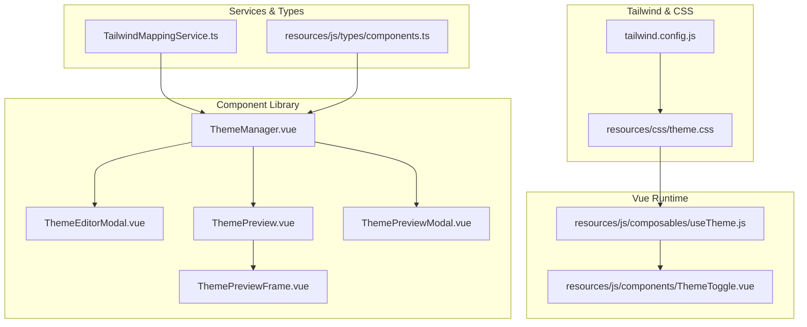
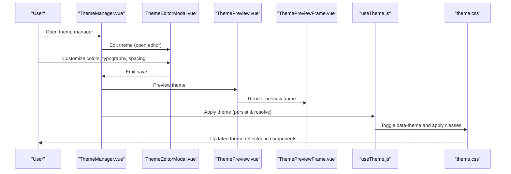
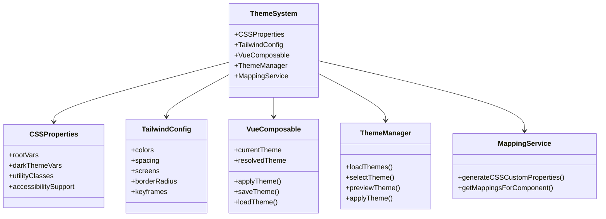
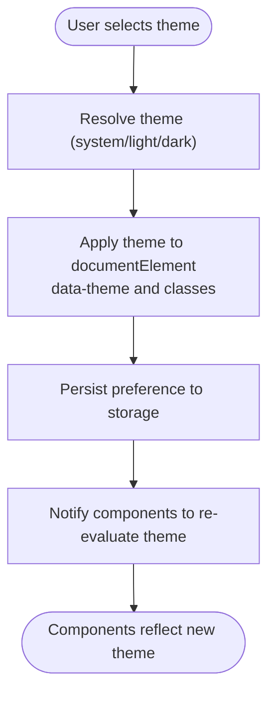
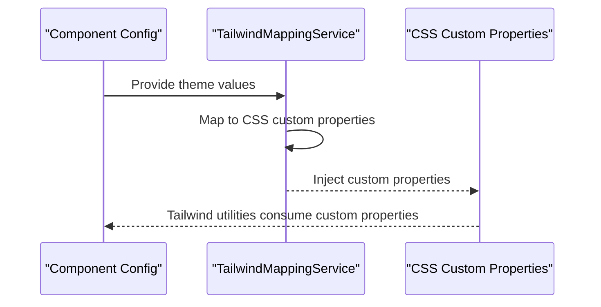
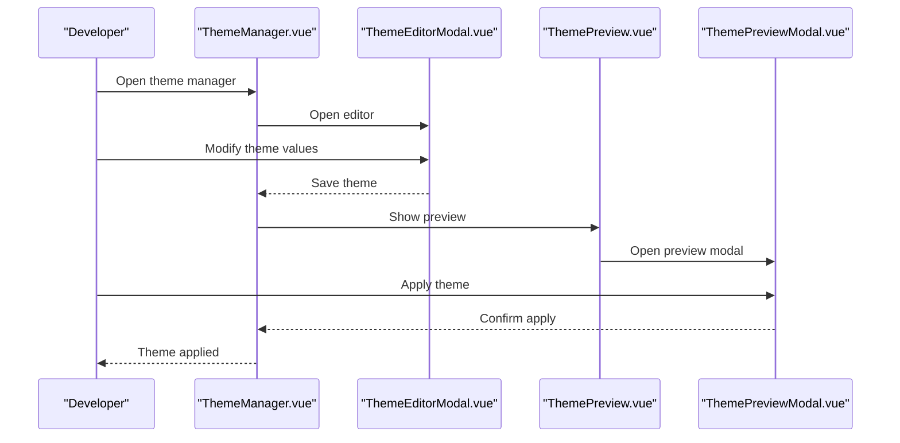
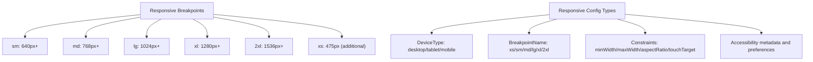
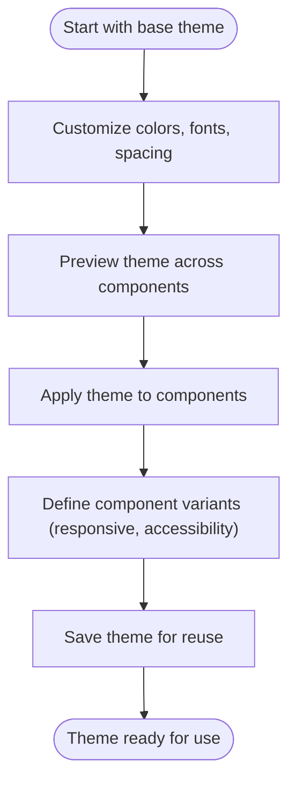
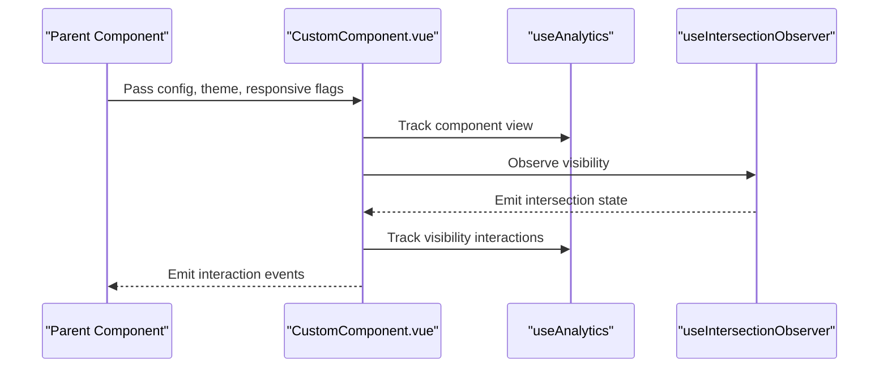
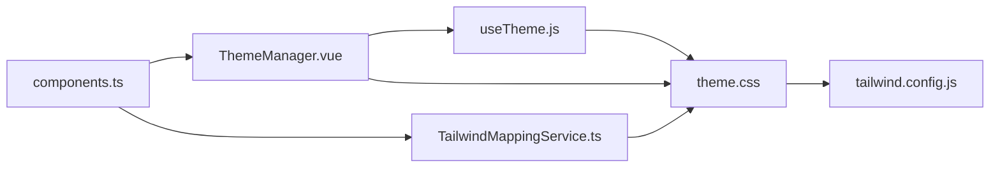

# UI Customization & Theming

<cite>
**Referenced Files in This Document**
- [tailwind.config.js](file://tailwind.config.js)
- [theme.css](file://resources/css/theme.css)
- [useTheme.js](file://resources/js/composables/useTheme.js)
- [ThemeManager.vue](file://resources/js/components/ComponentLibrary/Theme/ThemeManager.vue)
- [ThemeEditorModal.vue](file://resources/js/components/ComponentLibrary/Theme/ThemeEditorModal.vue)
- [ThemePreview.vue](file://resources/js/components/ComponentLibrary/Theme/ThemePreview.vue)
- [ThemePreviewFrame.vue](file://resources/js/components/ComponentLibrary/Theme/ThemePreviewFrame.vue)
- [ThemePreviewModal.vue](file://resources/js/components/ComponentLibrary/Theme/ThemePreviewModal.vue)
- [ThemeToggle.vue](file://resources/js/components/ThemeToggle.vue)
- [TailwindMappingService.ts](file://resources/js/services/TailwindMappingService.ts)
- [components.ts](file://resources/js/types/components.ts)
- [Showcase.vue](file://resources/js/Pages/DesignSystem/Showcase.vue)
- [ResponsiveDesign.vue](file://resources/js/Pages/DesignSystem/ResponsiveDesign.vue)
- [user-guide.md](file://docs/component-library/user-guide.md)
- [troubleshooting-guide.md](file://docs/component-library/troubleshooting-guide.md)
- [developer-guide.md](file://docs/component-library/developer-guide.md)
</cite>

## Table of Contents
1. [Introduction](#introduction)
2. [Project Structure](#project-structure)
3. [Core Components](#core-components)
4. [Architecture Overview](#architecture-overview)
5. [Detailed Component Analysis](#detailed-component-analysis)
6. [Dependency Analysis](#dependency-analysis)
7. [Performance Considerations](#performance-considerations)
8. [Troubleshooting Guide](#troubleshooting-guide)
9. [Conclusion](#conclusion)
10. [Appendices](#appendices)

## Introduction
This document explains how to customize and theme UI components in the platform’s Vue-based component library, leveraging Tailwind CSS and a robust design system. It covers:
- How to customize existing components and create new component variations
- Implementing theme switching (light/dark/system) and dynamic theme generation
- Tailwind CSS theming via CSS custom properties and runtime mapping
- Responsive design patterns and accessibility compliance
- Examples of component composition, state management integration, and best practices

## Project Structure
The theming and customization system spans CSS, Vue composables, and component library modules:
- Tailwind configuration defines theme extensions and responsive breakpoints
- CSS custom properties provide a centralized theme surface
- Vue composables manage theme state and persistence
- Component library theme manager enables preview, edit, and apply workflows
- Type definitions formalize component configuration, responsive behavior, and constraints

**Diagram sources**
- [tailwind.config.js:1-106](file://tailwind.config.js#L1-L106)
- [theme.css:1-115](file://resources/css/theme.css#L1-L115)
- [useTheme.js:1-144](file://resources/js/composables/useTheme.js#L1-L144)
- [ThemeManager.vue:113-207](file://resources/js/components/ComponentLibrary/Theme/ThemeManager.vue#L113-L207)
- [ThemeEditorModal.vue](file://resources/js/components/ComponentLibrary/Theme/ThemeEditorModal.vue)
- [ThemePreview.vue](file://resources/js/components/ComponentLibrary/Theme/ThemePreview.vue)
- [ThemePreviewFrame.vue](file://resources/js/components/ComponentLibrary/Theme/ThemePreviewFrame.vue)
- [ThemePreviewModal.vue](file://resources/js/components/ComponentLibrary/Theme/ThemePreviewModal.vue)
- [ThemeToggle.vue](file://resources/js/components/ThemeToggle.vue)
- [TailwindMappingService.ts:595-628](file://resources/js/services/TailwindMappingService.ts#L595-L628)
- [components.ts:1-200](file://resources/js/types/components.ts#L1-L200)

**Section sources**
- [tailwind.config.js:1-106](file://tailwind.config.js#L1-L106)
- [theme.css:1-115](file://resources/css/theme.css#L1-L115)
- [useTheme.js:1-144](file://resources/js/composables/useTheme.js#L1-L144)
- [ThemeManager.vue:113-207](file://resources/js/components/ComponentLibrary/Theme/ThemeManager.vue#L113-L207)
- [TailwindMappingService.ts:595-628](file://resources/js/services/TailwindMappingService.ts#L595-L628)
- [components.ts:1-200](file://resources/js/types/components.ts#L1-L200)

## Core Components
- Tailwind theme extension: Centralizes color palettes, spacing, typography, and responsive breakpoints for consistent styling across components.
- CSS custom properties: Provide a single source of truth for theme values, enabling runtime theme switching and dynamic updates.
- Theme composable: Manages theme state, persists preferences, detects system preference, and applies theme attributes to the document element.
- Theme manager UI: Offers theme browsing, preview, editing, importing, and applying within the component library.
- Tailwind mapping service: Converts component theme configurations into CSS custom properties for dynamic Tailwind usage.
- Component types: Define responsive behavior, accessibility metadata, constraints, and Tailwind class mappings for component customization.

**Section sources**
- [tailwind.config.js:11-102](file://tailwind.config.js#L11-L102)
- [theme.css:1-115](file://resources/css/theme.css#L1-L115)
- [useTheme.js:1-144](file://resources/js/composables/useTheme.js#L1-L144)
- [ThemeManager.vue:113-207](file://resources/js/components/ComponentLibrary/Theme/ThemeManager.vue#L113-L207)
- [TailwindMappingService.ts:595-628](file://resources/js/services/TailwindMappingService.ts#L595-L628)
- [components.ts:1-200](file://resources/js/types/components.ts#L1-L200)

## Architecture Overview
The theming architecture integrates Tailwind CSS with a design system built on CSS custom properties and Vue state management. The flow below shows how theme selection and application propagate from the UI to component rendering.

**Diagram sources**
- [ThemeManager.vue:113-207](file://resources/js/components/ComponentLibrary/Theme/ThemeManager.vue#L113-L207)
- [ThemeEditorModal.vue](file://resources/js/components/ComponentLibrary/Theme/ThemeEditorModal.vue)
- [ThemePreview.vue](file://resources/js/components/ComponentLibrary/Theme/ThemePreview.vue)
- [ThemePreviewFrame.vue](file://resources/js/components/ComponentLibrary/Theme/ThemePreviewFrame.vue)
- [useTheme.js:23-39](file://resources/js/composables/useTheme.js#L23-L39)
- [theme.css:88-115](file://resources/css/theme.css#L88-L115)

## Detailed Component Analysis

### Theme System Composition
The theme system combines CSS custom properties, Tailwind configuration, and Vue composables to deliver a flexible, accessible, and responsive design system.

**Diagram sources**
- [theme.css:1-115](file://resources/css/theme.css#L1-L115)
- [tailwind.config.js:11-102](file://tailwind.config.js#L11-L102)
- [useTheme.js:1-144](file://resources/js/composables/useTheme.js#L1-L144)
- [ThemeManager.vue:113-207](file://resources/js/components/ComponentLibrary/Theme/ThemeManager.vue#L113-L207)
- [TailwindMappingService.ts:595-628](file://resources/js/services/TailwindMappingService.ts#L595-L628)

**Section sources**
- [theme.css:1-115](file://resources/css/theme.css#L1-L115)
- [tailwind.config.js:11-102](file://tailwind.config.js#L11-L102)
- [useTheme.js:1-144](file://resources/js/composables/useTheme.js#L1-L144)
- [ThemeManager.vue:113-207](file://resources/js/components/ComponentLibrary/Theme/ThemeManager.vue#L113-L207)
- [TailwindMappingService.ts:595-628](file://resources/js/services/TailwindMappingService.ts#L595-L628)

### Theme Switching Workflow
The theme switching workflow demonstrates how user actions trigger theme resolution and persistence, and how CSS custom properties drive visual updates.

**Diagram sources**
- [useTheme.js:23-39](file://resources/js/composables/useTheme.js#L23-L39)
- [useTheme.js:42-61](file://resources/js/composables/useTheme.js#L42-L61)
- [useTheme.js:77-83](file://resources/js/composables/useTheme.js#L77-L83)

**Section sources**
- [useTheme.js:1-144](file://resources/js/composables/useTheme.js#L1-L144)

### Tailwind Mapping and Dynamic Properties
The Tailwind mapping service converts component theme configurations into CSS custom properties, enabling dynamic Tailwind usage at runtime.

**Diagram sources**
- [TailwindMappingService.ts:595-628](file://resources/js/services/TailwindMappingService.ts#L595-L628)
- [theme.css:1-115](file://resources/css/theme.css#L1-L115)

**Section sources**
- [TailwindMappingService.ts:595-628](file://resources/js/services/TailwindMappingService.ts#L595-L628)
- [theme.css:1-115](file://resources/css/theme.css#L1-L115)

### Component Library Theme Management
The component library provides a dedicated theme manager with editor, preview, and import capabilities, enabling designers and developers to iterate on themes efficiently.

**Diagram sources**
- [ThemeManager.vue:113-207](file://resources/js/components/ComponentLibrary/Theme/ThemeManager.vue#L113-L207)
- [ThemeEditorModal.vue](file://resources/js/components/ComponentLibrary/Theme/ThemeEditorModal.vue)
- [ThemePreview.vue](file://resources/js/components/ComponentLibrary/Theme/ThemePreview.vue)
- [ThemePreviewModal.vue](file://resources/js/components/ComponentLibrary/Theme/ThemePreviewModal.vue)

**Section sources**
- [ThemeManager.vue:113-207](file://resources/js/components/ComponentLibrary/Theme/ThemeManager.vue#L113-L207)
- [ThemeEditorModal.vue](file://resources/js/components/ComponentLibrary/Theme/ThemeEditorModal.vue)
- [ThemePreview.vue](file://resources/js/components/ComponentLibrary/Theme/ThemePreview.vue)
- [ThemePreviewModal.vue](file://resources/js/components/ComponentLibrary/Theme/ThemePreviewModal.vue)

### Responsive Design Patterns
The design system defines a comprehensive breakpoint system and responsive configuration types to ensure components adapt across devices while maintaining accessibility and performance.

**Diagram sources**
- [ResponsiveDesign.vue:27-90](file://resources/js/Pages/DesignSystem/ResponsiveDesign.vue#L27-L90)
- [components.ts:7-40](file://resources/js/types/components.ts#L7-L40)
- [components.ts:117-146](file://resources/js/types/components.ts#L117-L146)

**Section sources**
- [ResponsiveDesign.vue:27-90](file://resources/js/Pages/DesignSystem/ResponsiveDesign.vue#L27-L90)
- [components.ts:7-40](file://resources/js/types/components.ts#L7-L40)
- [components.ts:117-146](file://resources/js/types/components.ts#L117-L146)

### Creating Custom Themes and Variations
The component library supports creating custom themes and component variations through:
- Theme editor for color, typography, and spacing customization
- Preview and apply workflows
- Component configuration with responsive and accessibility metadata
- Tailwind class mapping for style management

**Diagram sources**
- [user-guide.md:363-412](file://docs/component-library/user-guide.md#L363-L412)
- [ThemeManager.vue:113-207](file://resources/js/components/ComponentLibrary/Theme/ThemeManager.vue#L113-L207)
- [components.ts:148-194](file://resources/js/types/components.ts#L148-L194)

**Section sources**
- [user-guide.md:363-412](file://docs/component-library/user-guide.md#L363-L412)
- [ThemeManager.vue:113-207](file://resources/js/components/ComponentLibrary/Theme/ThemeManager.vue#L113-L207)
- [components.ts:148-194](file://resources/js/types/components.ts#L148-L194)

### Component Composition and Accessibility
Components integrate with the design system through:
- Props for configuration, theme, responsiveness, and analytics
- Slots for content composition
- Accessibility metadata and keyboard navigation support
- Intersection observer for analytics and visibility tracking

**Diagram sources**
- [developer-guide.md:208-433](file://docs/component-library/developer-guide.md#L208-L433)

**Section sources**
- [developer-guide.md:208-433](file://docs/component-library/developer-guide.md#L208-L433)

## Dependency Analysis
The theming system exhibits clear separation of concerns:
- CSS custom properties depend on Tailwind configuration for color and spacing scales
- Vue composables depend on CSS custom properties for theme application
- Component library depends on both CSS and Vue composables for theme management
- Tailwind mapping service bridges component configuration to CSS custom properties

**Diagram sources**
- [theme.css:1-115](file://resources/css/theme.css#L1-L115)
- [tailwind.config.js:11-102](file://tailwind.config.js#L11-L102)
- [useTheme.js:1-144](file://resources/js/composables/useTheme.js#L1-L144)
- [ThemeManager.vue:113-207](file://resources/js/components/ComponentLibrary/Theme/ThemeManager.vue#L113-L207)
- [TailwindMappingService.ts:595-628](file://resources/js/services/TailwindMappingService.ts#L595-L628)
- [components.ts:1-200](file://resources/js/types/components.ts#L1-L200)

**Section sources**
- [theme.css:1-115](file://resources/css/theme.css#L1-L115)
- [tailwind.config.js:11-102](file://tailwind.config.js#L11-L102)
- [useTheme.js:1-144](file://resources/js/composables/useTheme.js#L1-L144)
- [ThemeManager.vue:113-207](file://resources/js/components/ComponentLibrary/Theme/ThemeManager.vue#L113-L207)
- [TailwindMappingService.ts:595-628](file://resources/js/services/TailwindMappingService.ts#L595-L628)
- [components.ts:1-200](file://resources/js/types/components.ts#L1-L200)

## Performance Considerations
- Prefer CSS custom properties for theme values to minimize repaints during theme switches
- Use Tailwind utilities mapped to CSS variables to avoid JIT churn on frequent theme changes
- Leverage responsive breakpoints and device-specific configs to optimize rendering on smaller screens
- Apply reduced motion and high contrast media queries to improve accessibility and performance

## Troubleshooting Guide
Common issues and solutions:
- Ensure theme props are passed to components and CSS variables are generated
- Use theme variables consistently instead of hardcoded values
- Verify CSS variable generation and Tailwind mapping service output
- Confirm theme application lifecycle and persistence

**Section sources**
- [troubleshooting-guide.md:319-365](file://docs/component-library/troubleshooting-guide.md#L319-L365)

## Conclusion
The platform’s theming and customization system provides a cohesive, scalable foundation for building accessible, responsive UIs. By combining CSS custom properties, Tailwind configuration, Vue composables, and a component library theme manager, teams can rapidly iterate on themes, compose components with confidence, and maintain design consistency across diverse devices and user preferences.

## Appendices

### Design System Showcase
The design system showcase highlights color palettes, typography, and spacing scales, enabling quick validation of theme applications.

**Section sources**
- [Showcase.vue:39-73](file://resources/js/Pages/DesignSystem/Showcase.vue#L39-L73)