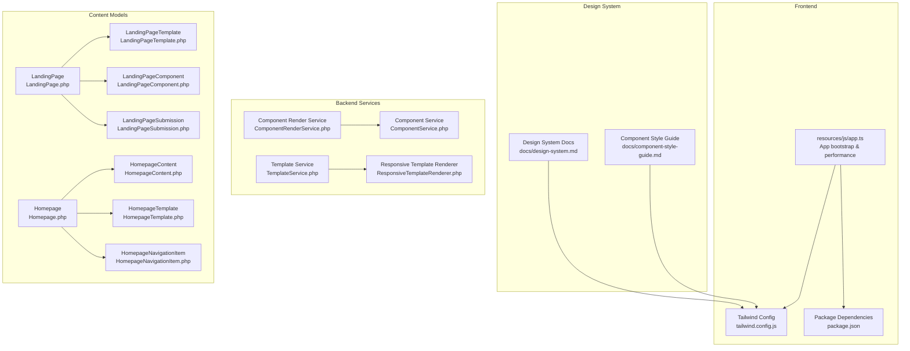
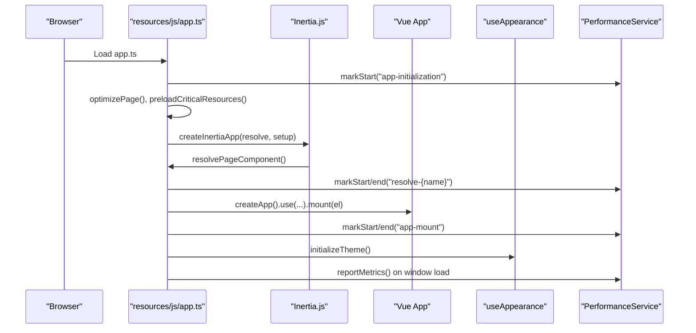
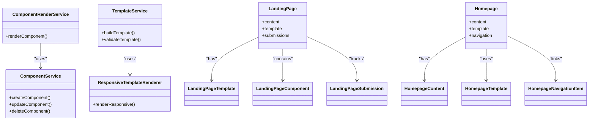
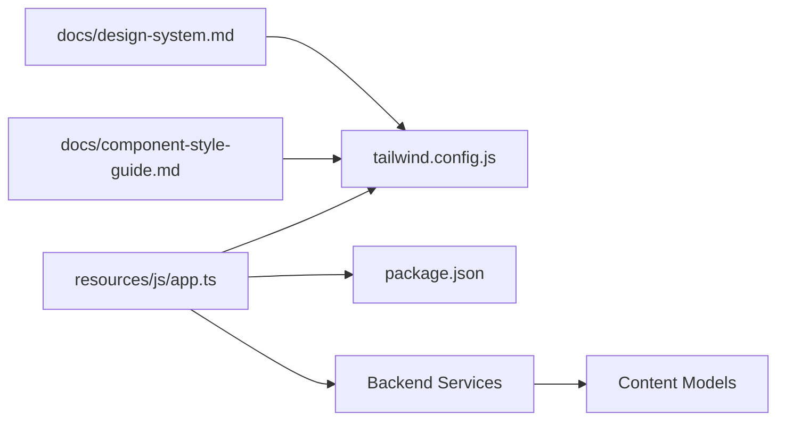

# Component Architecture and Design Patterns

<cite>
**Referenced Files in This Document**
- [app.ts](file://resources/js/app.ts)
- [tailwind.config.js](file://tailwind.config.js)
- [package.json](file://package.json)
- [design-system.md](file://docs/design-system.md)
- [component-style-guide.md](file://docs/component-style-guide.md)
- [ResponsiveTemplateRenderer.php](file://app/Services/ResponsiveTemplateRenderer.php)
- [TemplateService.php](file://app/Services/TemplateService.php)
- [ComponentRenderService.php](file://app/Services/ComponentRenderService.php)
- [ComponentService.php](file://app/Services/ComponentService.php)
- [ComponentAnalyticsService.php](file://app/Services/ComponentAnalyticsService.php)
- [ComponentPerformanceAnalysisService.php](file://app/Services/ComponentPerformanceAnalysisService.php)
- [ComponentCachingService.php](file://app/Services/ComponentCachingService.php)
- [ComponentThemeService.php](file://app/Services/ComponentThemeService.php)
- [ComponentAccessibilityService.php](file://app/Services/ComponentAccessibilityService.php)
- [ComponentMigrationService.php](file://app/Services/ComponentMigrationService.php)
- [ComponentVersionService.php](file://app/Services/ComponentVersionService.php)
- [ComponentExportImportService.php](file://app/Services/ComponentExportImportService.php)
- [ComponentBackupRecoveryService.php](file://app/Services/ComponentBackupRecoveryService.php)
- [LandingPageService.php](file://app/Services/LandingPageService.php)
- [LandingPage.php](file://app/Models/LandingPage.php)
- [LandingPageTemplate.php](file://app/Models/LandingPageTemplate.php)
- [LandingPageComponent.php](file://app/Models/LandingPageComponent.php)
- [LandingPageSubmission.php](file://app/Models/LandingPageSubmission.php)
- [HomepageService.php](file://app/Services/HomepageService.php)
- [HomepageContent.php](file://app/Models/HomepageContent.php)
- [HomepageContentVersion.php](file://app/Models/HomepageContentVersion.php)
- [HomepageNavigationItem.php](file://app/Models/HomepageNavigationItem.php)
- [HomepageContentService.php](file://app/Services/HomepageContentService.php)
- [Homepage.php](file://app/Models/Homepage.php)
- [HomepageComponent.php](file://app/Models/HomepageComponent.php)
- [HomepageTemplate.php](file://app/Models/HomepageTemplate.php)
- [HomepageNavigationItem.php](file://app/Models/HomepageNavigationItem.php)
- [HomepageContentApproval.php](file://app/Models/HomepageContentApproval.php)
- [HomepageContentVersion.php](file://app/Models/HomepageContentVersion.php)
- [HomepageContent.php](file://app/Models/HomepageContent.php)
- [HomepageService.php](file://app/Services/HomepageService.php)
- [HomepageContentService.php](file://app/Services/HomepageContentService.php)
- [Homepage.php](file://app/Models/Homepage.php)
- [HomepageComponent.php](file://app/Models/HomepageComponent.php)
- [HomepageTemplate.php](file://app/Models/HomepageTemplate.php)
- [HomepageNavigationItem.php](file://app/Models/HomepageNavigationItem.php)
- [HomepageContentApproval.php](file://app/Models/HomepageContentApproval.php)
- [HomepageContentVersion.php](file://app/Models/HomepageContentVersion.php)
- [HomepageContent.php](file://app/Models/HomepageContent.php)
- [HomepageService.php](file://app/Services/HomepageService.php)
- [HomepageContentService.php](file://app/Services/HomepageContentService.php)
- [Homepage.php](file://app/Models/Homepage.php)
- [HomepageComponent.php](file://app/Models/HomepageComponent.php)
- [HomepageTemplate.php](file://app/Models/HomepageTemplate.php)
- [HomepageNavigationItem.php](file://app/Models/HomepageNavigationItem.php)
- [HomepageContentApproval.php](file://app/Models/HomepageContentApproval.php)
- [HomepageContentVersion.php](file://app/Models/HomepageContentVersion.php)
- [HomepageContent.php](file://app/Models/HomepageContent.php)
- [HomepageService.php](file://app/Services/HomepageService.php)
- [HomepageContentService.php](file://app/Services/HomepageContentService.php)
- [Homepage.php](file://app/Models/Homepage.php)
- [HomepageComponent.php](file://app/Models/HomepageComponent.php)
- [HomepageTemplate.php](file://app/Models/HomepageTemplate.php)
- [HomepageNavigationItem.php](file://app/Models/HomepageNavigationItem.php)
- [HomepageContentApproval.php](file://app/Models/HomepageContentApproval.php)
- [HomepageContentVersion.php](file://app/Models/HomepageContentVersion.php)
- [HomepageContent.php](file://app/Models/HomepageContent.php)
- [HomepageService.php](file://app/Services/HomepageService.php)
- [HomepageContentService.php](file://app/Services/HomepageContentService.php)
- [Homepage.php](file://app/Models/Homepage.php)
- [HomepageComponent.php](file://app/Models/HomepageComponent.php)
- [HomepageTemplate.php](file://app/Models/HomepageTemplate.php)
- [HomepageNavigationItem.php](file://app/Models/HomepageNavigationItem.php)
- [HomepageContentApproval.php](file://app/Models/HomepageContentApproval.php)
- [HomepageContentVersion.php](file://app/Models/HomepageContentVersion.php)
- [HomepageContent.php](file://app/Models/HomepageContent.php)
- [HomepageService.php](file://app/Services/HomepageService.php)
- [HomepageContentService.php](file://app/Services/HomepageContentService.php)
- [Homepage.php](file://app/Models/Homepage.php)
- [HomepageComponent.php](file://app/Models/HomepageComponent.php)
- [HomepageTemplate.php](file://app/Models/HomepageTemplate.php)
- [HomepageNavigationItem.php](file://app/Models/HomepageNavigationItem.php)
- [HomepageContentApproval.php](file://app/Models/HomepageContentApproval.php)
- [HomepageContentVersion.php](file://app/Models/HomepageContentVersion.php)
- [HomepageContent.php](file://app/Models/HomepageContent.php)
- [HomepageService.php](file://app/Services/HomepageService.php)
- [HomepageContentService.php](file://app/Services/HomepageContentService.php)
- [Homepage.php](file://app/Models/Homepage.php)
- [HomepageComponent.php](file://app/Models/HomepageComponent.php)
- [HomepageTemplate.php](file://app/Models/HomepageTemplate.php)
- [HomepageNavigationItem.php](file://app/Models/HomepageNavigationItem.php)
- [HomepageContentApproval.php](file://app/Models/HomepageContentApproval......)
</cite>

## Table of Contents
1. [Introduction](#introduction)
2. [Project Structure](#project-structure)
3. [Core Components](#core-components)
4. [Architecture Overview](#architecture-overview)
5. [Detailed Component Analysis](#detailed-component-analysis)
6. [Dependency Analysis](#dependency-analysis)
7. [Performance Considerations](#performance-considerations)
8. [Troubleshooting Guide](#troubleshooting-guide)
9. [Conclusion](#conclusion)
10. [Appendices](#appendices)

## Introduction
This document explains the component architecture and design patterns for reusable UI components and page structure in the Modern Alumni Platform. It covers the component hierarchy (page components, shared components, UI primitives, and layout components), composition patterns, props interfaces, event handling, slots, and the design system built on Tailwind CSS. It also documents accessibility compliance, responsive design patterns, testing strategies, performance optimization, lifecycle management, state sharing, and integration with the broader Laravel/Vue application architecture.

## Project Structure
The frontend is a Vue 3 application integrated with Inertia.js and Laravel, using Vite for bundling and Tailwind CSS for styling. The design system and component standards are documented in dedicated documentation files. The backend provides services and models for rendering, theming, analytics, caching, and landing/homepage content management.

**Diagram sources**
- [app.ts:1-99](file://resources/js/app.ts#L1-L99)
- [tailwind.config.js:1-106](file://tailwind.config.js#L1-L106)
- [package.json:1-90](file://package.json#L1-L90)
- [design-system.md:1-543](file://docs/design-system.md#L1-L543)
- [component-style-guide.md:1-640](file://docs/component-style-guide.md#L1-L640)
- [ComponentRenderService.php](file://app/Services/ComponentRenderService.php)
- [ComponentService.php](file://app/Services/ComponentService.php)
- [TemplateService.php](file://app/Services/TemplateService.php)
- [ResponsiveTemplateRenderer.php](file://app/Services/ResponsiveTemplateRenderer.php)
- [LandingPage.php](file://app/Models/LandingPage.php)
- [LandingPageTemplate.php](file://app/Models/LandingPageTemplate.php)
- [LandingPageComponent.php](file://app/Models/LandingPageComponent.php)
- [LandingPageSubmission.php](file://app/Models/LandingPageSubmission.php)
- [Homepage.php](file://app/Models/Homepage.php)
- [HomepageContent.php](file://app/Models/HomepageContent.php)
- [HomepageTemplate.php](file://app/Models/HomepageTemplate.php)
- [HomepageNavigationItem.php](file://app/Models/HomepageNavigationItem.php)

**Section sources**
- [app.ts:1-99](file://resources/js/app.ts#L1-L99)
- [tailwind.config.js:1-106](file://tailwind.config.js#L1-L106)
- [package.json:1-90](file://package.json#L1-L90)
- [design-system.md:1-543](file://docs/design-system.md#L1-L543)
- [component-style-guide.md:1-640](file://docs/component-style-guide.md#L1-L640)

## Core Components
The platform defines a robust design system and component standards:

- Design Principles: Accessibility-first, mobile-first, performance optimized, and consistent experience.
- Color System: Primary, semantic (success/warning/error/info), and neutral palettes with WCAG AA contrast.
- Typography: Defined font families, sizes, weights, and line heights.
- Spacing System: Base unit of 4px with extended scales for layout consistency.
- Border Radius and Shadows: Systematic scales for consistent visual hierarchy.
- Component Standards: BaseButton, BaseInput, BaseModal, and loading states (LoadingSpinner, SkeletonLoader) with comprehensive props interfaces and accessibility patterns.

These standards ensure consistent, accessible, and maintainable components across the platform.

**Section sources**
- [design-system.md:7-32](file://docs/design-system.md#L7-L32)
- [design-system.md:20-65](file://docs/design-system.md#L20-L65)
- [design-system.md:66-90](file://docs/design-system.md#L66-L90)
- [design-system.md:91-117](file://docs/design-system.md#L91-L117)
- [design-system.md:118-157](file://docs/design-system.md#L118-L157)
- [component-style-guide.md:7-32](file://docs/component-style-guide.md#L7-L32)
- [component-style-guide.md:33-86](file://docs/component-style-guide.md#L33-L86)
- [component-style-guide.md:88-125](file://docs/component-style-guide.md#L88-L125)
- [component-style-guide.md:126-158](file://docs/component-style-guide.md#L126-L158)
- [component-style-guide.md:159-168](file://docs/component-style-guide.md#L159-L168)
- [component-style-guide.md:170-363](file://docs/component-style-guide.md#L170-L363)

## Architecture Overview
The frontend initializes via Inertia.js, mounts the Vue app, and integrates performance monitoring and theme initialization. Tailwind CSS is configured to consume design tokens from CSS custom properties. The backend provides services for component rendering, theming, analytics, caching, and content management for landing pages and homepages.

**Diagram sources**
- [app.ts:34-98](file://resources/js/app.ts#L34-L98)

**Section sources**
- [app.ts:34-98](file://resources/js/app.ts#L34-L98)

## Detailed Component Analysis

### Component Hierarchy and Composition Patterns
- Page Components: Feature-specific pages under resources/js/Pages (e.g., Alumni, Dashboard, Events) that compose shared and primitive components.
- Shared Components: Common UI elements reused across pages (e.g., BaseButton, BaseInput, BaseModal) defined in the design system.
- UI Primitives: Low-level building blocks (buttons, inputs, cards) with standardized variants and accessibility attributes.
- Layout Components: Structural containers and navigation helpers that orchestrate page layout and responsive behavior.

Composition patterns:
- Props interfaces define element type, appearance, state, icons, badges, and accessibility attributes.
- Slots enable flexible content projection (e.g., modal footer).
- Event handling uses Vue’s emit patterns for user actions.
- Accessibility attributes (aria-label, aria-describedby, aria-expanded, etc.) are integrated into component props and templates.

**Section sources**
- [component-style-guide.md:170-363](file://docs/component-style-guide.md#L170-L363)
- [design-system.md:245-256](file://docs/design-system.md#L245-L256)

### Props Interfaces and Event Handling
- BaseButton: Supports tag, type, href/to, variant, size, fullWidth, disabled/loading, left/right icons, iconOnly, badge, and ARIA attributes.
- BaseInput: Supports type, modelValue, placeholder, validation flags, attributes, textarea specifics, size, icons, clearable, loading, label/helpText, and ARIA attributes.
- BaseModal: Controls visibility, size, centering, closable behavior, backdrop/escape persistence, title/description, and ARIA attributes.

Event handling:
- Components emit events for user interactions (e.g., close, click) and integrate with parent components through props and slots.

**Section sources**
- [component-style-guide.md:174-207](file://docs/component-style-guide.md#L174-L207)
- [component-style-guide.md:237-283](file://docs/component-style-guide.md#L237-L283)
- [component-style-guide.md:317-342](file://docs/component-style-guide.md#L317-L342)

### Slots and Content Projection
- BaseModal demonstrates named slots (footer) and default slot for body content, enabling flexible composition without tight coupling.

**Section sources**
- [component-style-guide.md:344-363](file://docs/component-style-guide.md#L344-L363)

### Design System Implementation with Tailwind CSS
- Tailwind is configured to extend colors, spacing, radius, keyframes/animations, and safe-area insets using CSS custom properties from the design system.
- The design system defines CSS custom properties for dynamic theming and responsive breakpoints.

**Section sources**
- [tailwind.config.js:11-103](file://tailwind.config.js#L11-L103)
- [design-system.md:157-222](file://docs/design-system.md#L157-L222)

### Accessibility Compliance
- WCAG AA compliance: color contrast, focus states, keyboard navigation, screen reader support.
- Focus management and touch targets are defined to meet minimum sizes.
- ARIA patterns for buttons, forms, and modals are documented with proper roles and attributes.

**Section sources**
- [design-system.md:257-292](file://docs/design-system.md#L257-L292)
- [component-style-guide.md:418-531](file://docs/component-style-guide.md#L418-L531)

### Responsive Design Patterns
- Mobile-first approach with xs breakpoint and touch-friendly targets.
- Safe area insets and responsive utilities ensure consistent layout across devices.

**Section sources**
- [design-system.md:293-316](file://docs/design-system.md#L293-L316)
- [tailwind.config.js:16-18](file://tailwind.config.js#L16-L18)
- [tailwind.config.js:86-101](file://tailwind.config.js#L86-L101)

### Practical Examples of Component Development
- BaseButton usage examples demonstrate variants, sizes, icons, loading states, and icon-only buttons.
- BaseInput usage shows validation, labels, help text, and clearable behavior.
- BaseModal usage illustrates title, description, footer slot, and close behavior.

**Section sources**
- [component-style-guide.md:209-233](file://docs/component-style-guide.md#L209-L233)
- [component-style-guide.md:285-313](file://docs/component-style-guide.md#L285-L313)
- [component-style-guide.md:344-363](file://docs/component-style-guide.md#L344-L363)

### Testing Strategies
- Unit tests validate prop shapes and accessibility attributes.
- Accessibility tests use axe-core to ensure WCAG AA compliance.
- Testing standards include component documentation, code comments, and cross-browser/device coverage.

**Section sources**
- [component-style-guide.md:553-591](file://docs/component-style-guide.md#L553-L591)

### Performance Optimization Techniques
- Tree-shakeable components, dynamic imports, minimal dependencies, and optimized SVG icons.
- Rendering performance: v-memo, virtual scrolling, lazy loading, debounced inputs.
- Memory management: cleanup of event listeners, cancellation of requests, timers, and DOM references.

**Section sources**
- [component-style-guide.md:533-552](file://docs/component-style-guide.md#L533-L552)

### Component Lifecycle Management and State Sharing
- Vue component lifecycle hooks manage mounting, updates, and teardown.
- State sharing patterns leverage Pinia stores for global state (e.g., auth, dashboard, events).
- Performance monitoring tracks initialization, resolution, and mount timings.

**Section sources**
- [app.ts:34-98](file://resources/js/app.ts#L34-L98)

### Integration with Application Architecture
- Backend services handle component rendering, theming, analytics, caching, and content management for landing pages and homepages.
- Models represent content structures and versions, enabling versioned publishing and approvals.

**Diagram sources**
- [ComponentRenderService.php](file://app/Services/ComponentRenderService.php)
- [ComponentService.php](file://app/Services/ComponentService.php)
- [TemplateService.php](file://app/Services/TemplateService.php)
- [ResponsiveTemplateRenderer.php](file://app/Services/ResponsiveTemplateRenderer.php)
- [LandingPage.php](file://app/Models/LandingPage.php)
- [LandingPageTemplate.php](file://app/Models/LandingPageTemplate.php)
- [LandingPageComponent.php](file://app/Models/LandingPageComponent.php)
- [LandingPageSubmission.php](file://app/Models/LandingPageSubmission.php)
- [Homepage.php](file://app/Models/Homepage.php)
- [HomepageContent.php](file://app/Models/HomepageContent.php)
- [HomepageTemplate.php](file://app/Models/HomepageTemplate.php)
- [HomepageNavigationItem.php](file://app/Models/HomepageNavigationItem.php)

**Section sources**
- [ComponentRenderService.php](file://app/Services/ComponentRenderService.php)
- [ComponentService.php](file://app/Services/ComponentService.php)
- [TemplateService.php](file://app/Services/TemplateService.php)
- [ResponsiveTemplateRenderer.php](file://app/Services/ResponsiveTemplateRenderer.php)
- [LandingPage.php](file://app/Models/LandingPage.php)
- [LandingPageTemplate.php](file://app/Models/LandingPageTemplate.php)
- [LandingPageComponent.php](file://app/Models/LandingPageComponent.php)
- [LandingPageSubmission.php](file://app/Models/LandingPageSubmission.php)
- [Homepage.php](file://app/Models/Homepage.php)
- [HomepageContent.php](file://app/Models/HomepageContent.php)
- [HomepageTemplate.php](file://app/Models/HomepageTemplate.php)
- [HomepageNavigationItem.php](file://app/Models/HomepageNavigationItem.php)

## Dependency Analysis
The frontend depends on Vue 3, Inertia.js, and Tailwind CSS. The backend provides services and models for component rendering and content management. The design system documentation and style guide define the standards that both frontend and backend components adhere to.

**Diagram sources**
- [app.ts:1-99](file://resources/js/app.ts#L1-L99)
- [tailwind.config.js:1-106](file://tailwind.config.js#L1-L106)
- [package.json:1-90](file://package.json#L1-L90)
- [design-system.md:1-543](file://docs/design-system.md#L1-L543)
- [component-style-guide.md:1-640](file://docs/component-style-guide.md#L1-L640)

**Section sources**
- [app.ts:1-99](file://resources/js/app.ts#L1-L99)
- [tailwind.config.js:1-106](file://tailwind.config.js#L1-L106)
- [package.json:1-90](file://package.json#L1-L90)
- [design-system.md:1-543](file://docs/design-system.md#L1-L543)
- [component-style-guide.md:1-640](file://docs/component-style-guide.md#L1-L640)

## Performance Considerations
- Bundle size: Favor tree-shaking, dynamic imports, and minimal dependencies.
- Rendering: Use memoization, virtualization, lazy loading, and input debouncing.
- Memory: Clean up listeners, cancel requests, clear timers, and remove DOM references.
- Monitoring: Track component resolution and mount timings to identify bottlenecks.

**Section sources**
- [component-style-guide.md:533-552](file://docs/component-style-guide.md#L533-L552)
- [app.ts:34-98](file://resources/js/app.ts#L34-L98)

## Troubleshooting Guide
- Accessibility violations: Use axe-core tests and ensure ARIA attributes are present.
- Performance regressions: Review component resolution and mount metrics; optimize heavy computations and rendering.
- Theme inconsistencies: Verify CSS custom properties and Tailwind extensions align with the design system.

**Section sources**
- [component-style-guide.md:580-591](file://docs/component-style-guide.md#L580-L591)
- [app.ts:88-98](file://resources/js/app.ts#L88-L98)

## Conclusion
The Modern Alumni Platform employs a comprehensive design system and component architecture grounded in accessibility, performance, and consistency. The frontend integrates Vue 3, Inertia.js, and Tailwind CSS, while the backend provides robust services and models for component rendering and content management. Adhering to the documented standards ensures scalable, maintainable, and inclusive UI development.

## Appendices
- Migration guide: Update prop names, add accessibility attributes, adopt design tokens, add TypeScript types, and update tests.
- Best practices: Mobile-first design, semantic HTML, theme testing, and responsive breakpoints.

**Section sources**
- [component-style-guide.md:625-640](file://docs/component-style-guide.md#L625-L640)
- [design-system.md:494-542](file://docs/design-system.md#L494-L542)