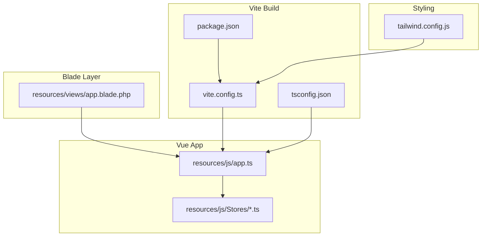
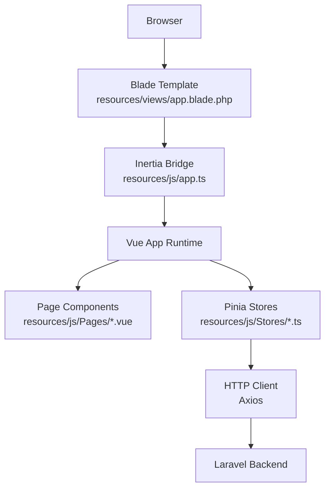
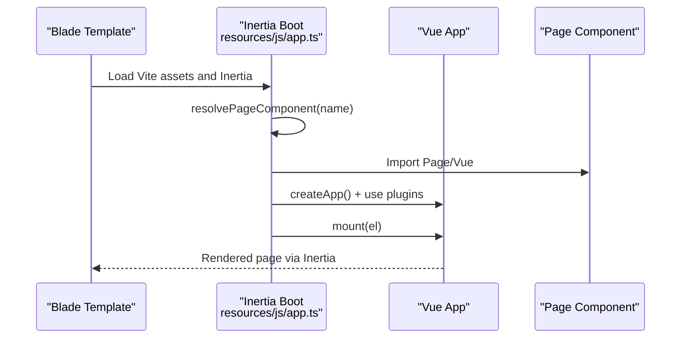
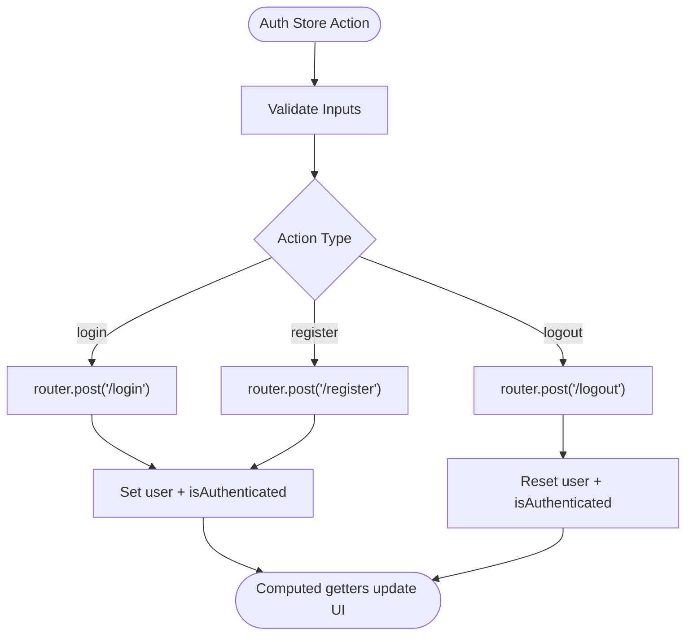
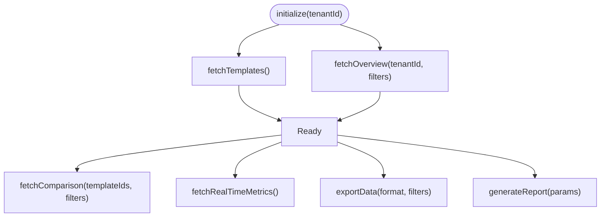
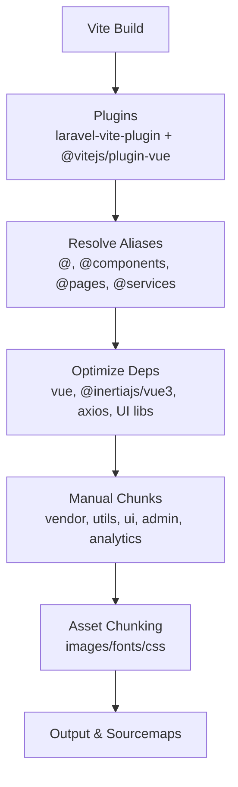
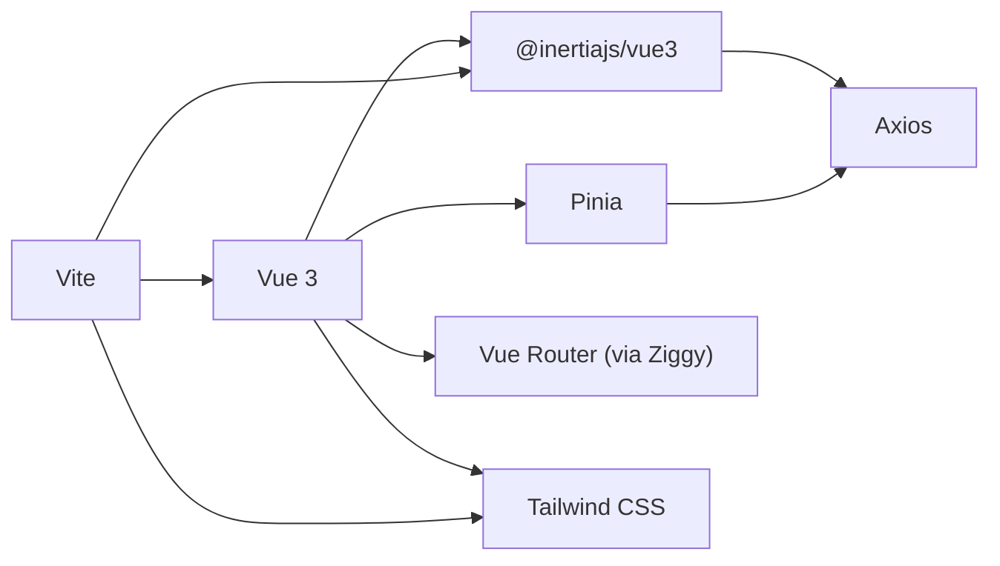

# Frontend Architecture

<cite>
**Referenced Files in This Document**
- [package.json](file://package.json)
- [vite.config.ts](file://vite.config.ts)
- [tailwind.config.js](file://tailwind.config.js)
- [tsconfig.json](file://tsconfig.json)
- [resources/js/app.ts](file://resources/js/app.ts)
- [resources/views/app.blade.php](file://resources/views/app.blade.php)
- [resources/js/Stores/auth.ts](file://resources/js/Stores/auth.ts)
- [resources/js/Stores/dashboard.ts](file://resources/js/Stores/dashboard.ts)
</cite>

## Table of Contents
1. [Introduction](#introduction)
2. [Project Structure](#project-structure)
3. [Core Components](#core-components)
4. [Architecture Overview](#architecture-overview)
5. [Detailed Component Analysis](#detailed-component-analysis)
6. [Dependency Analysis](#dependency-analysis)
7. [Performance Considerations](#performance-considerations)
8. [Troubleshooting Guide](#troubleshooting-guide)
9. [Conclusion](#conclusion)
10. [Appendices](#appendices)

## Introduction
This document describes the frontend architecture of the application with a focus on Vue.js 3, TypeScript, Inertia.js, Pinia state management, Vue Router, Tailwind CSS, and Vite build tooling. It explains the component hierarchy, integration patterns, and development workflow, and provides guidance on responsive design, accessibility, and performance optimization.

## Project Structure
The frontend is organized around a Vue 3 + TypeScript + Inertia.js stack with Vite as the build tool and Tailwind CSS for styling. The Blade template integrates Inertia and Vite assets, while Pinia manages global state. The structure emphasizes:
- Page components under a Pages directory resolved by Inertia
- Shared stores under a Stores directory
- Utilities, composables, and services under dedicated directories
- Tailwind scanning configured for Vue, JS, TS, and Blade files
- Vite aliases and code-splitting for optimal delivery

**Diagram sources**
- [resources/views/app.blade.php:1-77](file://resources/views/app.blade.php#L1-L77)
- [vite.config.ts:1-163](file://vite.config.ts#L1-L163)
- [package.json:1-90](file://package.json#L1-L90)
- [tsconfig.json:1-132](file://tsconfig.json#L1-L132)
- [resources/js/app.ts:1-99](file://resources/js/app.ts#L1-L99)
- [tailwind.config.js:1-106](file://tailwind.config.js#L1-L106)

**Section sources**
- [resources/views/app.blade.php:1-77](file://resources/views/app.blade.php#L1-L77)
- [vite.config.ts:1-163](file://vite.config.ts#L1-L163)
- [package.json:1-90](file://package.json#L1-L90)
- [tsconfig.json:1-132](file://tsconfig.json#L1-L132)
- [tailwind.config.js:1-106](file://tailwind.config.js#L1-L106)

## Core Components
- Inertia bootstrapper: Initializes the Vue app, resolves page components, mounts the app, and wires progress indicators and performance timing.
- Blade template: Provides the HTML shell, PWA metadata, and injects Vite/HMR and Inertia rendering.
- Pinia stores: Encapsulate domain-specific state and actions (authentication, dashboard analytics).
- Vite configuration: Defines entry points, code splitting, asset chunking, aliases, dev server, and optimization targets.
- Tailwind configuration: Scans Vue/JS/TS and Blade files, defines design tokens, responsive breakpoints, and animations.

Key responsibilities:
- resources/js/app.ts: Bootstraps Inertia, resolves pages, initializes theme, performance hooks, and toast notifications.
- resources/views/app.blade.php: Supplies HTML shell, PWA manifests, Vite directives, and Inertia rendering.
- resources/js/Stores/*.ts: Provide typed stores for authentication and dashboard analytics.
- vite.config.ts: Configures plugins, aliases, build optimization, and dev/proxy settings.
- tailwind.config.js: Tailwind scanning and theme customization.

**Section sources**
- [resources/js/app.ts:1-99](file://resources/js/app.ts#L1-L99)
- [resources/views/app.blade.php:1-77](file://resources/views/app.blade.php#L1-L77)
- [resources/js/Stores/auth.ts:1-87](file://resources/js/Stores/auth.ts#L1-L87)
- [resources/js/Stores/dashboard.ts:1-226](file://resources/js/Stores/dashboard.ts#L1-L226)
- [vite.config.ts:1-163](file://vite.config.ts#L1-L163)
- [tailwind.config.js:1-106](file://tailwind.config.js#L1-L106)

## Architecture Overview
The frontend uses Inertia.js to render Vue pages on the server via Blade, enabling a full-stack feel with SPA-like navigation and progressive enhancement. Vite handles fast development and optimized production builds, while Tailwind provides utility-first styling. Pinia manages cross-component state.

**Diagram sources**
- [resources/views/app.blade.php:1-77](file://resources/views/app.blade.php#L1-L77)
- [resources/js/app.ts:1-99](file://resources/js/app.ts#L1-L99)
- [resources/js/Stores/auth.ts:1-87](file://resources/js/Stores/auth.ts#L1-L87)
- [resources/js/Stores/dashboard.ts:1-226](file://resources/js/Stores/dashboard.ts#L1-L226)

## Detailed Component Analysis

### Inertia Bootstrapper and Page Resolution
The Inertia bootstrapper creates the Vue app, resolves page components, and wires performance timing and resource preloading. It integrates Ziggy for route helpers and toast notifications.

**Diagram sources**
- [resources/views/app.blade.php:54-56](file://resources/views/app.blade.php#L54-L56)
- [resources/js/app.ts:43-82](file://resources/js/app.ts#L43-L82)

**Section sources**
- [resources/js/app.ts:1-99](file://resources/js/app.ts#L1-L99)
- [resources/views/app.blade.php:1-77](file://resources/views/app.blade.php#L1-L77)

### Authentication Store (Pinia)
The authentication store encapsulates user state, login/logout/register flows, and role/permission checks. It leverages Inertia’s router for HTTP requests and exposes computed getters for reactive UI updates.

**Diagram sources**
- [resources/js/Stores/auth.ts:25-56](file://resources/js/Stores/auth.ts#L25-L56)
- [resources/js/Stores/auth.ts:74-86](file://resources/js/Stores/auth.ts#L74-L86)

**Section sources**
- [resources/js/Stores/auth.ts:1-87](file://resources/js/Stores/auth.ts#L1-L87)

### Dashboard Analytics Store (Pinia)
The dashboard store manages overview data, template comparisons, real-time metrics, and export/report generation. It centralizes HTTP interactions and exposes typed state and actions.

**Diagram sources**
- [resources/js/Stores/dashboard.ts:189-199](file://resources/js/Stores/dashboard.ts#L189-L199)
- [resources/js/Stores/dashboard.ts:94-133](file://resources/js/Stores/dashboard.ts#L94-L133)
- [resources/js/Stores/dashboard.ts:135-144](file://resources/js/Stores/dashboard.ts#L135-L144)
- [resources/js/Stores/dashboard.ts:155-179](file://resources/js/Stores/dashboard.ts#L155-L179)

**Section sources**
- [resources/js/Stores/dashboard.ts:1-226](file://resources/js/Stores/dashboard.ts#L1-L226)

### Routing with Ziggy
Ziggy integrates route helpers into the frontend, enabling type-safe navigation and URL construction. It is registered during app setup.

**Section sources**
- [resources/js/app.ts:7-7](file://resources/js/app.ts#L7-L7)

### Styling with Tailwind CSS
Tailwind scans Vue, JS, TS, and Blade files, and extends design tokens, responsive breakpoints, spacing, and animations. The configuration ensures consistent theming across components.

**Section sources**
- [tailwind.config.js:1-106](file://tailwind.config.js#L1-L106)

### Build Configuration with Vite
Vite is configured with:
- Aliases for efficient imports (@, @components, @pages, @services)
- Code splitting into vendor, utils, UI, and feature-specific chunks
- Optimized asset chunking and naming for images/fonts/CSS
- Dev server with HMR, CORS, and proxy to backend
- Dependency optimization and modern ES target

**Diagram sources**
- [vite.config.ts:7-24](file://vite.config.ts#L7-L24)
- [vite.config.ts:110-117](file://vite.config.ts#L110-L117)
- [vite.config.ts:140-152](file://vite.config.ts#L140-L152)
- [vite.config.ts:25-97](file://vite.config.ts#L25-L97)

**Section sources**
- [vite.config.ts:1-163](file://vite.config.ts#L1-L163)
- [package.json:1-90](file://package.json#L1-L90)

### TypeScript Integration
TypeScript is configured with strictness, DOM/libraries, JSX preservation, and path aliases. It includes type roots for Vite, Node, and custom types, and is used across stores, composables, and utilities.

**Section sources**
- [tsconfig.json:1-132](file://tsconfig.json#L1-L132)

### Component Hierarchy and Page Components
- Page components are resolved dynamically by Inertia from the Pages directory and rendered within the Blade template.
- The app integrates PWA capabilities and theme initialization for immediate UI feedback.

**Section sources**
- [resources/js/app.ts:43-82](file://resources/js/app.ts#L43-L82)
- [resources/views/app.blade.php:54-56](file://resources/views/app.blade.php#L54-L56)

## Dependency Analysis
The frontend stack relies on cohesive integrations:
- Inertia connects Vue pages to Laravel backend
- Vite manages assets and code splitting
- Tailwind provides design system primitives
- Pinia centralizes state
- TypeScript enforces type safety

**Diagram sources**
- [package.json:48-82](file://package.json#L48-L82)
- [resources/js/app.ts:3-16](file://resources/js/app.ts#L3-L16)
- [vite.config.ts:1-24](file://vite.config.ts#L1-L24)

**Section sources**
- [package.json:1-90](file://package.json#L1-L90)
- [resources/js/app.ts:1-99](file://resources/js/app.ts#L1-L99)
- [vite.config.ts:1-163](file://vite.config.ts#L1-L163)

## Performance Considerations
- Code splitting: Manual chunks for vendor, utils, UI, and feature areas reduce initial payload.
- Asset chunking: Images, fonts, and CSS are separated for caching and CDN optimization.
- Dev server: HMR, CORS, and proxy enable fast iteration with backend services.
- Dependency optimization: Includes heavy libraries in optimizeDeps to speed cold starts.
- Target modern browsers: ES2015 target and esbuild minification improve runtime performance.
- Lazy loading: Preload critical resources and next likely pages to improve perceived performance.

Practical tips:
- Keep page components small and lazy-load heavy features.
- Use Tailwind utilities to avoid shipping unused CSS.
- Prefer functional composition and lightweight stores.
- Monitor bundle size and split chunks further if needed.

**Section sources**
- [vite.config.ts:25-108](file://vite.config.ts#L25-L108)
- [vite.config.ts:119-138](file://vite.config.ts#L119-L138)
- [vite.config.ts:140-152](file://vite.config.ts#L140-L152)
- [resources/js/app.ts:34-42](file://resources/js/app.ts#L34-L42)

## Troubleshooting Guide
Common issues and resolutions:
- Inertia page not found: Verify the page component exists under Pages and matches the route name.
- Vite HMR/CORS errors: Confirm dev server host/port and CORS origins in Vite config.
- Tailwind utilities not applied: Ensure content globs include Vue/JS/TS/Blade paths.
- TypeScript errors: Align types with store interfaces and component props.
- Build failures: Check optimizeDeps exclusions and manual chunk definitions.

**Section sources**
- [resources/js/app.ts:43-61](file://resources/js/app.ts#L43-L61)
- [vite.config.ts:119-138](file://vite.config.ts#L119-L138)
- [tailwind.config.js:3-10](file://tailwind.config.js#L3-L10)
- [tsconfig.json:123-131](file://tsconfig.json#L123-L131)

## Conclusion
The frontend architecture combines Vue 3, TypeScript, Inertia.js, Pinia, Tailwind CSS, and Vite to deliver a modern, maintainable, and performant user experience. The design emphasizes clear separation of concerns, scalable state management, and efficient asset delivery, with strong developer ergonomics and accessibility foundations.

## Appendices
- Example store usage patterns:
  - Authentication: Use the auth store to guard routes and render user-specific UI.
  - Dashboard: Initialize dashboard data on page load and expose computed metrics to components.
- Example build commands:
  - Development: Run the dev server and hot-reload pages.
  - Production: Build optimized assets with code splitting and sourcemaps.
- Example linting/formatting:
  - Use ESLint and Prettier to enforce style and quality standards.

**Section sources**
- [package.json:4-21](file://package.json#L4-L21)
- [resources/js/Stores/auth.ts:74-86](file://resources/js/Stores/auth.ts#L74-L86)
- [resources/js/Stores/dashboard.ts:189-199](file://resources/js/Stores/dashboard.ts#L189-L199)