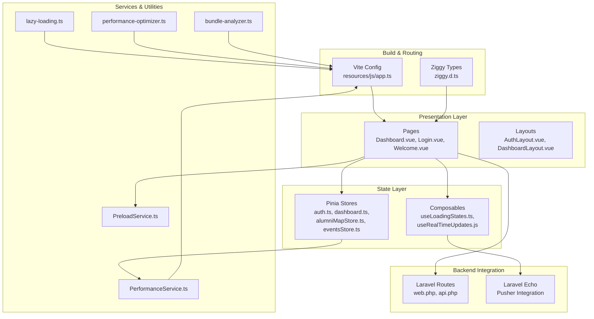
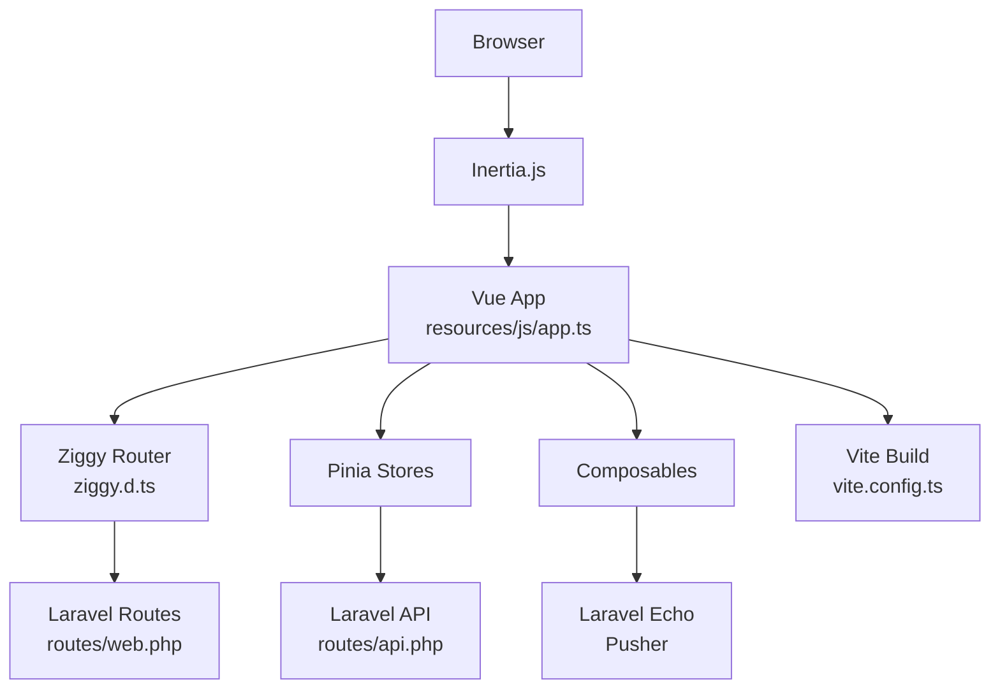
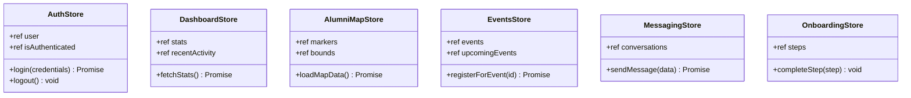
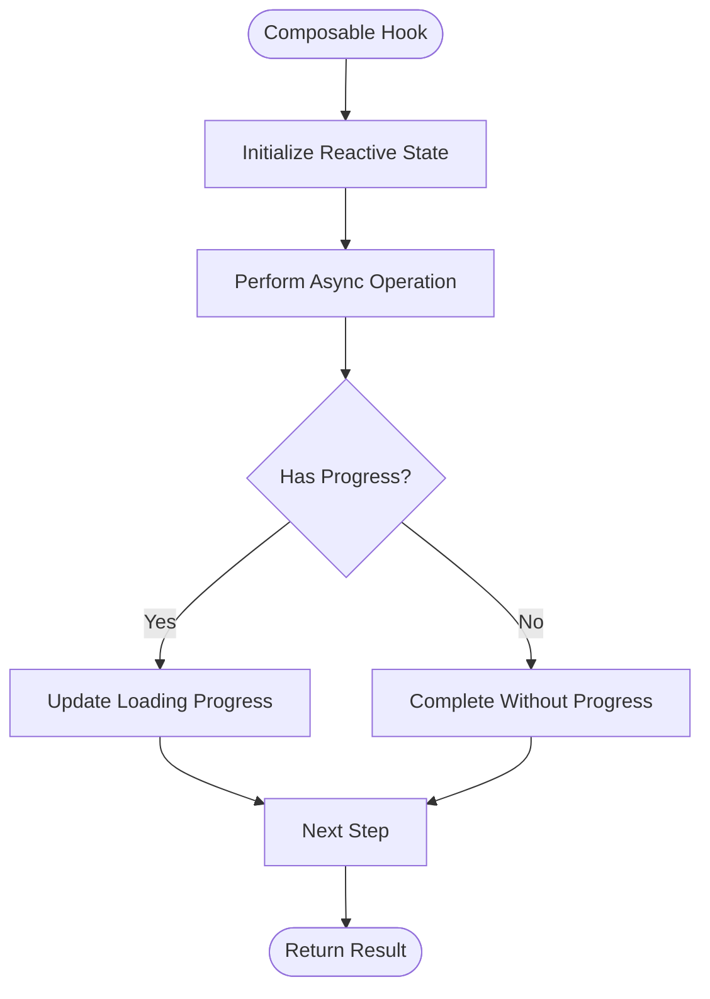
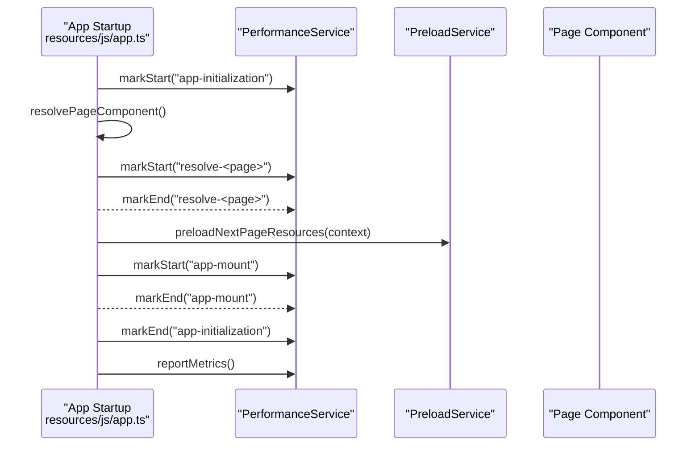
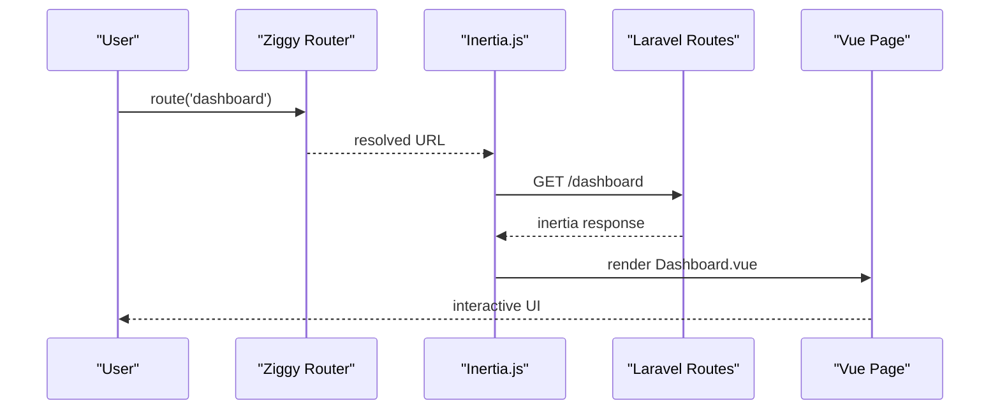
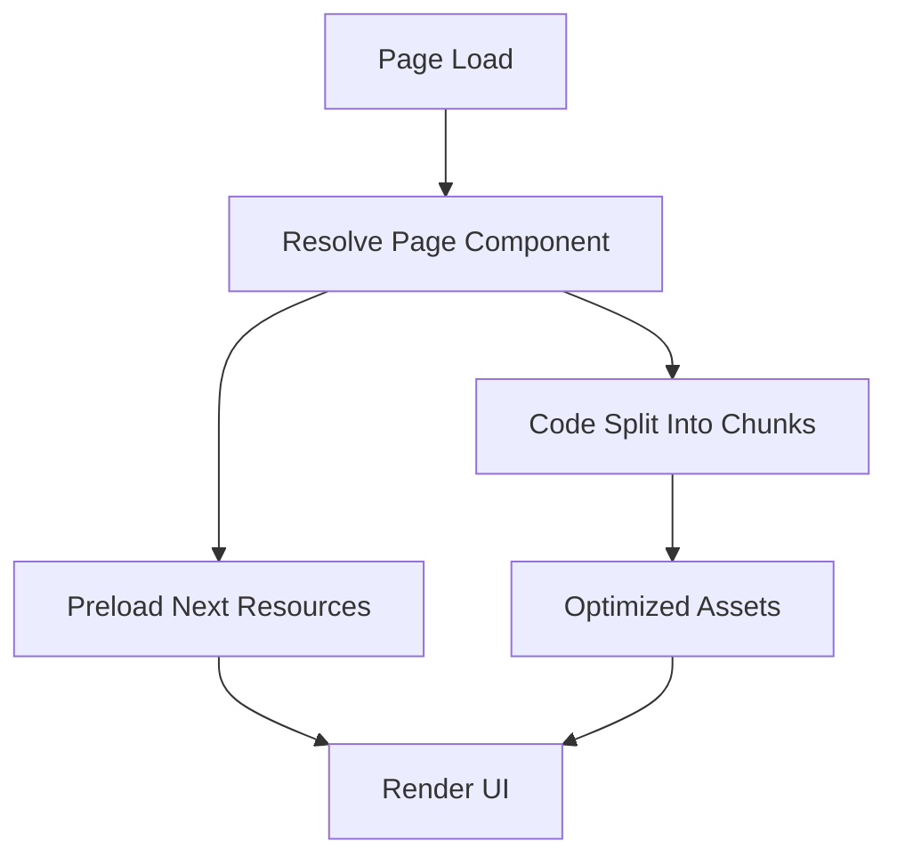
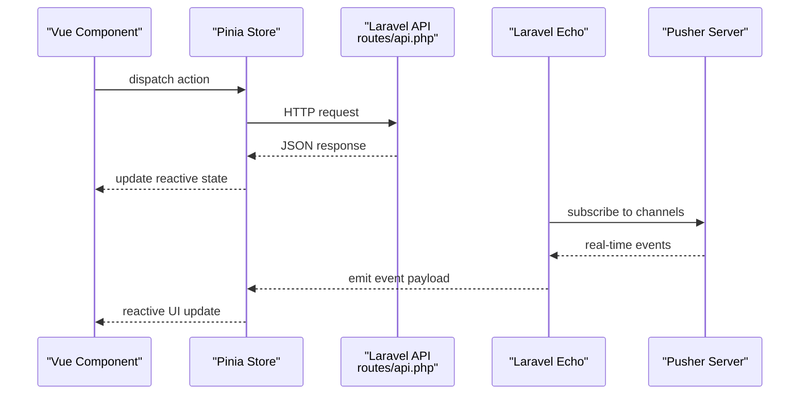
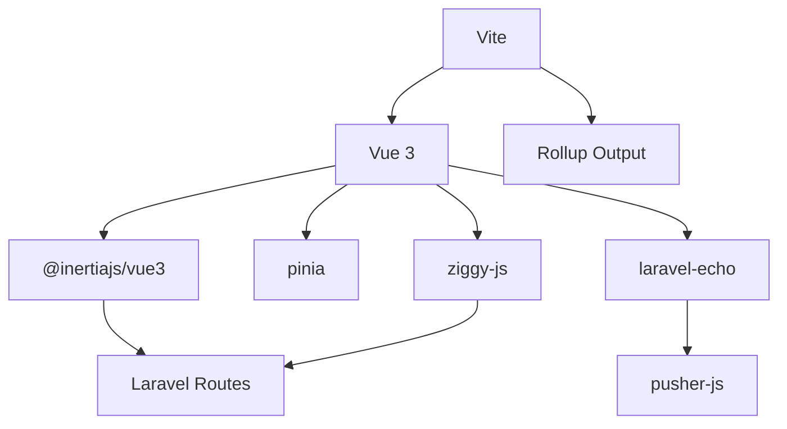

# State Management and Routing

<cite>
**Referenced Files in This Document**
- [package.json](file://package.json)
- [vite.config.ts](file://vite.config.ts)
- [resources/js/app.ts](file://resources/js/app.ts)
- [resources/js/types/globals.d.ts](file://resources/js/types/globals.d.ts)
- [resources/js/types/ziggy.d.ts](file://resources/js/types/ziggy.d.ts)
- [resources/js/stores/auth.ts](file://resources/js/stores/auth.ts)
- [resources/js/stores/dashboard.ts](file://resources/js/stores/dashboard.ts)
- [resources/js/stores/alumniMapStore.ts](file://resources/js/stores/alumniMapStore.ts)
- [resources/js/stores/eventsStore.ts](file://resources/js/stores/eventsStore.ts)
- [resources/js/stores/messaging.js](file://resources/js/stores/messaging.js)
- [resources/js/stores/onboardingStore.js](file://resources/js/stores/onboardingStore.js)
- [resources/js/composables/useLoadingStates.ts](file://resources/js/composables/useLoadingStates.ts)
- [resources/js/composables/useRealTimeUpdates.js](file://resources/js/composables/useRealTimeUpdates.js)
- [resources/js/services/PerformanceService.ts](file://resources/js/services/PerformanceService.ts)
- [resources/js/services/PreloadService.ts](file://resources/js/services/PreloadService.ts)
- [resources/js/utils/lazy-loading.ts](file://resources/js/utils/lazy-loading.ts)
- [resources/js/utils/performance-optimizer.ts](file://resources/js/utils/performance-optimizer.ts)
- [resources/js/utils/bundle-analyzer.ts](file://resources/js/utils/bundle-analyzer.ts)
- [resources/js/layouts/AuthLayout.vue](file://resources/js/layouts/AuthLayout.vue)
- [resources/js/layouts/DashboardLayout.vue](file://resources/js/layouts/DashboardLayout.vue)
- [resources/js/Pages/Dashboard.vue](file://resources/js/Pages/Dashboard.vue)
- [resources/js/Pages/Auth/Login.vue](file://resources/js/Pages/Auth/Login.vue)
- [resources/js/Pages/Welcome.vue](file://resources/js/Pages/Welcome.vue)
- [routes/web.php](file://routes/web.php)
- [routes/api.php](file://routes/api.php)
- [bootstrap/app.php](file://bootstrap/app.php)
- [config/app.php](file://config/app.php)
</cite>

## Table of Contents
1. [Introduction](#introduction)
2. [Project Structure](#project-structure)
3. [Core Components](#core-components)
4. [Architecture Overview](#architecture-overview)
5. [Detailed Component Analysis](#detailed-component-analysis)
6. [Dependency Analysis](#dependency-analysis)
7. [Performance Considerations](#performance-considerations)
8. [Troubleshooting Guide](#troubleshooting-guide)
9. [Conclusion](#conclusion)

## Introduction
This document explains the state management and routing architecture of the frontend application, focusing on how Pinia stores, composable functions, and the service layer integrate with Vue Router and Inertia.js to deliver reactive data flows and efficient navigation. It covers route configuration, guards, navigation patterns, and performance optimizations including code splitting, route-based preloading, and resource optimization. Practical examples demonstrate reactive state management, computed properties, watchers, and async data fetching, along with integration patterns to Laravel backend services via API calls and real-time updates.

## Project Structure
The frontend is organized around a modular structure with dedicated directories for pages, components, stores, composables, services, and utilities. The build system leverages Vite for development and production bundling, enabling code splitting and asset optimization. Inertia.js bridges Laravel backend routes with Vue pages, while Ziggy provides type-safe client-side routing helpers.

**Diagram sources**
- [vite.config.ts:1-163](file://vite.config.ts#L1-L163)
- [resources/js/app.ts:1-99](file://resources/js/app.ts#L1-L99)
- [resources/js/types/ziggy.d.ts:1-12](file://resources/js/types/ziggy.d.ts#L1-L12)
- [resources/js/stores/auth.ts](file://resources/js/stores/auth.ts)
- [resources/js/stores/dashboard.ts](file://resources/js/stores/dashboard.ts)
- [resources/js/stores/alumniMapStore.ts](file://resources/js/stores/alumniMapStore.ts)
- [resources/js/stores/eventsStore.ts](file://resources/js/stores/eventsStore.ts)
- [resources/js/composables/useLoadingStates.ts:22-74](file://resources/js/composables/useLoadingStates.ts#L22-L74)
- [resources/js/composables/useRealTimeUpdates.js](file://resources/js/composables/useRealTimeUpdates.js)
- [resources/js/services/PerformanceService.ts](file://resources/js/services/PerformanceService.ts)
- [resources/js/services/PreloadService.ts](file://resources/js/services/PreloadService.ts)
- [resources/js/utils/lazy-loading.ts](file://resources/js/utils/lazy-loading.ts)
- [resources/js/utils/performance-optimizer.ts](file://resources/js/utils/performance-optimizer.ts)
- [resources/js/utils/bundle-analyzer.ts](file://resources/js/utils/bundle-analyzer.ts)
- [resources/js/Pages/Dashboard.vue](file://resources/js/Pages/Dashboard.vue)
- [resources/js/Pages/Auth/Login.vue](file://resources/js/Pages/Auth/Login.vue)
- [resources/js/Pages/Welcome.vue](file://resources/js/Pages/Welcome.vue)
- [resources/js/layouts/AuthLayout.vue](file://resources/js/layouts/AuthLayout.vue)
- [resources/js/layouts/DashboardLayout.vue](file://resources/js/layouts/DashboardLayout.vue)
- [routes/web.php](file://routes/web.php)
- [routes/api.php](file://routes/api.php)

**Section sources**
- [vite.config.ts:1-163](file://vite.config.ts#L1-L163)
- [resources/js/app.ts:1-99](file://resources/js/app.ts#L1-L99)
- [resources/js/types/ziggy.d.ts:1-12](file://resources/js/types/ziggy.d.ts#L1-L12)

## Core Components
- State Management with Pinia: Centralized stores manage domain-specific state (authentication, dashboard, alumni map, events, messaging, onboarding). Stores expose reactive state, actions, and getters for UI components and composables.
- Composables: Encapsulate cross-cutting concerns like loading states and real-time updates, providing reusable logic across pages.
- Service Layer: PerformanceService tracks timing metrics; PreloadService orchestrates route-based preloading; utilities handle lazy loading, optimization, and bundle analysis.
- Routing with Inertia.js and Ziggy: Inertia.js renders Vue pages from Laravel routes; Ziggy provides type-safe route helpers integrated into Vue components.

**Section sources**
- [resources/js/stores/auth.ts](file://resources/js/stores/auth.ts)
- [resources/js/stores/dashboard.ts](file://resources/js/stores/dashboard.ts)
- [resources/js/stores/alumniMapStore.ts](file://resources/js/stores/alumniMapStore.ts)
- [resources/js/stores/eventsStore.ts](file://resources/js/stores/eventsStore.ts)
- [resources/js/stores/messaging.js](file://resources/js/stores/messaging.js)
- [resources/js/stores/onboardingStore.js](file://resources/js/stores/onboardingStore.js)
- [resources/js/composables/useLoadingStates.ts:22-74](file://resources/js/composables/useLoadingStates.ts#L22-L74)
- [resources/js/composables/useRealTimeUpdates.js](file://resources/js/composables/useRealTimeUpdates.js)
- [resources/js/services/PerformanceService.ts](file://resources/js/services/PerformanceService.ts)
- [resources/js/services/PreloadService.ts](file://resources/js/services/PreloadService.ts)
- [resources/js/utils/lazy-loading.ts](file://resources/js/utils/lazy-loading.ts)
- [resources/js/utils/performance-optimizer.ts](file://resources/js/utils/performance-optimizer.ts)
- [resources/js/utils/bundle-analyzer.ts](file://resources/js/utils/bundle-analyzer.ts)

## Architecture Overview
The frontend architecture follows a layered approach:
- Build and Runtime: Vite handles development and production builds with code splitting and asset optimization; Inertia.js integrates Vue pages with Laravel routes.
- State Layer: Pinia stores encapsulate application state; composables provide reusable logic for async operations and real-time updates.
- Presentation Layer: Pages and layouts render reactive UI driven by stores and composables.
- Backend Integration: Laravel routes serve both HTML pages (via Inertia) and API endpoints; Pusher/Laravel Echo enables real-time updates.

**Diagram sources**
- [resources/js/app.ts:1-99](file://resources/js/app.ts#L1-L99)
- [resources/js/types/ziggy.d.ts:1-12](file://resources/js/types/ziggy.d.ts#L1-L12)
- [resources/js/stores/auth.ts](file://resources/js/stores/auth.ts)
- [resources/js/composables/useRealTimeUpdates.js](file://resources/js/composables/useRealTimeUpdates.js)
- [routes/web.php](file://routes/web.php)
- [routes/api.php](file://routes/api.php)
- [vite.config.ts:1-163](file://vite.config.ts#L1-L163)

## Detailed Component Analysis

### State Management with Pinia
Pinia stores centralize reactive state and actions. Example stores include authentication, dashboard, alumni map, events, messaging, and onboarding. They expose:
- Reactive state: refs for domain data
- Getters: computed derivations (e.g., upcoming events)
- Actions: async operations that mutate state and coordinate with services

**Diagram sources**
- [resources/js/stores/auth.ts](file://resources/js/stores/auth.ts)
- [resources/js/stores/dashboard.ts](file://resources/js/stores/dashboard.ts)
- [resources/js/stores/alumniMapStore.ts](file://resources/js/stores/alumniMapStore.ts)
- [resources/js/stores/eventsStore.ts](file://resources/js/stores/eventsStore.ts)
- [resources/js/stores/messaging.js](file://resources/js/stores/messaging.js)
- [resources/js/stores/onboardingStore.js](file://resources/js/stores/onboardingStore.js)

**Section sources**
- [resources/js/stores/auth.ts](file://resources/js/stores/auth.ts)
- [resources/js/stores/dashboard.ts](file://resources/js/stores/dashboard.ts)
- [resources/js/stores/alumniMapStore.ts](file://resources/js/stores/alumniMapStore.ts)
- [resources/js/stores/eventsStore.ts](file://resources/js/stores/eventsStore.ts)
- [resources/js/stores/messaging.js](file://resources/js/stores/messaging.js)
- [resources/js/stores/onboardingStore.js](file://resources/js/stores/onboardingStore.js)

### Composables for Reactive Logic
Composables encapsulate reusable logic:
- useLoadingStates: Manages global loading contexts with progress and contextual messages.
- useRealTimeUpdates: Provides connection lifecycle and event subscription for Laravel Echo channels.

**Diagram sources**
- [resources/js/composables/useLoadingStates.ts:22-74](file://resources/js/composables/useLoadingStates.ts#L22-L74)

**Section sources**
- [resources/js/composables/useLoadingStates.ts:22-74](file://resources/js/composables/useLoadingStates.ts#L22-L74)
- [resources/js/composables/useRealTimeUpdates.js](file://resources/js/composables/useRealTimeUpdates.js)

### Service Layer Integration
- PerformanceService: Marks performance timings during component resolution and app mount, reporting metrics after load.
- PreloadService: Preloads likely next-page resources based on current page context.
- Lazy Loading Utilities: Defer non-critical resources to improve initial load performance.
- Performance Optimizer and Bundle Analyzer: Optimize page rendering and generate development bundle insights.

**Diagram sources**
- [resources/js/app.ts:43-82](file://resources/js/app.ts#L43-L82)
- [resources/js/services/PerformanceService.ts](file://resources/js/services/PerformanceService.ts)
- [resources/js/services/PreloadService.ts](file://resources/js/services/PreloadService.ts)

**Section sources**
- [resources/js/app.ts:43-82](file://resources/js/app.ts#L43-L82)
- [resources/js/services/PerformanceService.ts](file://resources/js/services/PerformanceService.ts)
- [resources/js/services/PreloadService.ts](file://resources/js/services/PreloadService.ts)
- [resources/js/utils/lazy-loading.ts](file://resources/js/utils/lazy-loading.ts)
- [resources/js/utils/performance-optimizer.ts](file://resources/js/utils/performance-optimizer.ts)
- [resources/js/utils/bundle-analyzer.ts](file://resources/js/utils/bundle-analyzer.ts)

### Routing with Inertia.js and Ziggy
- Inertia.js: Bridges Laravel routes to Vue pages, enabling fast navigation without full page reloads.
- Ziggy: Provides type-safe route helpers integrated into Vue components via global types.
- Route Guards: Implemented at the Laravel level (web.php) and optionally at the Vue level via navigation guards in pages or composables.

**Diagram sources**
- [resources/js/types/ziggy.d.ts:1-12](file://resources/js/types/ziggy.d.ts#L1-L12)
- [resources/js/app.ts:43-82](file://resources/js/app.ts#L43-L82)
- [routes/web.php](file://routes/web.php)

**Section sources**
- [resources/js/types/ziggy.d.ts:1-12](file://resources/js/types/ziggy.d.ts#L1-L12)
- [resources/js/app.ts:43-82](file://resources/js/app.ts#L43-L82)
- [routes/web.php](file://routes/web.php)

### Navigation Patterns and Lazy Loading Strategies
- Route-based Preloading: After resolving a page, the app preloads likely next-page resources to reduce perceived latency.
- Code Splitting: Vite groups large libraries into named chunks (vendor, utils, UI) and splits large component libraries into separate chunks.
- Asset Optimization: Images, fonts, and CSS are placed into optimized asset folders; chunk naming improves caching.

**Diagram sources**
- [resources/js/app.ts:43-82](file://resources/js/app.ts#L43-L82)
- [vite.config.ts:25-96](file://vite.config.ts#L25-L96)

**Section sources**
- [resources/js/app.ts:43-82](file://resources/js/app.ts#L43-L82)
- [vite.config.ts:25-96](file://vite.config.ts#L25-L96)

### Backend Integration: API Calls and Real-time Updates
- API Layer: Laravel routes serve both HTML and JSON APIs; Vue components call backend endpoints via Axios or Inertia forms.
- Real-time Updates: Laravel Echo connects to Pusher; composables manage subscriptions and cleanup lifecycle.

**Diagram sources**
- [routes/api.php](file://routes/api.php)
- [resources/js/composables/useRealTimeUpdates.js](file://resources/js/composables/useRealTimeUpdates.js)

**Section sources**
- [routes/api.php](file://routes/api.php)
- [resources/js/composables/useRealTimeUpdates.js](file://resources/js/composables/useRealTimeUpdates.js)

## Dependency Analysis
The frontend depends on Vue 3, Inertia.js, Ziggy, and Pinia. Vite manages bundling and code splitting. The runtime integrates with Laravel through Inertia and Ziggy, and with Pusher for real-time updates.

**Diagram sources**
- [package.json:48-81](file://package.json#L48-L81)
- [vite.config.ts:1-163](file://vite.config.ts#L1-L163)
- [resources/js/app.ts:1-99](file://resources/js/app.ts#L1-L99)

**Section sources**
- [package.json:48-81](file://package.json#L48-L81)
- [vite.config.ts:1-163](file://vite.config.ts#L1-L163)
- [resources/js/app.ts:1-99](file://resources/js/app.ts#L1-L99)

## Performance Considerations
- Code Splitting: Manual chunks for vendor, utils, UI, and large component libraries; custom chunk naming for admin and analytics pages.
- Asset Optimization: Separate asset folders for images, fonts, and CSS; reduced warnings threshold and minification settings.
- Lazy Loading: Defer non-critical resources; route-based preloading reduces navigation latency.
- Dev Tools: Bundle analyzer generates reports in development; performance optimizer enhances initial render.

**Section sources**
- [vite.config.ts:25-96](file://vite.config.ts#L25-L96)
- [resources/js/utils/lazy-loading.ts](file://resources/js/utils/lazy-loading.ts)
- [resources/js/services/PreloadService.ts](file://resources/js/services/PreloadService.ts)
- [resources/js/utils/performance-optimizer.ts](file://resources/js/utils/performance-optimizer.ts)
- [resources/js/utils/bundle-analyzer.ts](file://resources/js/utils/bundle-analyzer.ts)

## Troubleshooting Guide
- Route Helpers Not Found: Ensure Ziggy types are declared globally and route helpers are available in components.
- Inertia Page Resolution Failures: Verify page paths under Pages and that resolvePageComponent matches the configured glob pattern.
- Real-time Updates Not Working: Confirm Echo initialization and channel subscriptions; check Pusher credentials and network connectivity.
- Performance Metrics Missing: Ensure PerformanceService marks are called during component resolution and app mount; verify report timing after load.

**Section sources**
- [resources/js/types/ziggy.d.ts:1-12](file://resources/js/types/ziggy.d.ts#L1-L12)
- [resources/js/app.ts:43-82](file://resources/js/app.ts#L43-L82)
- [resources/js/composables/useRealTimeUpdates.js](file://resources/js/composables/useRealTimeUpdates.js)
- [resources/js/services/PerformanceService.ts](file://resources/js/services/PerformanceService.ts)

## Conclusion
The frontend employs a clean separation of concerns: Inertia.js and Ziggy handle routing and navigation, Pinia stores manage reactive state, composables encapsulate reusable logic, and a service layer optimizes performance and preloading. The architecture integrates seamlessly with Laravel backend services through API endpoints and real-time updates via Pusher, delivering a responsive and maintainable application.