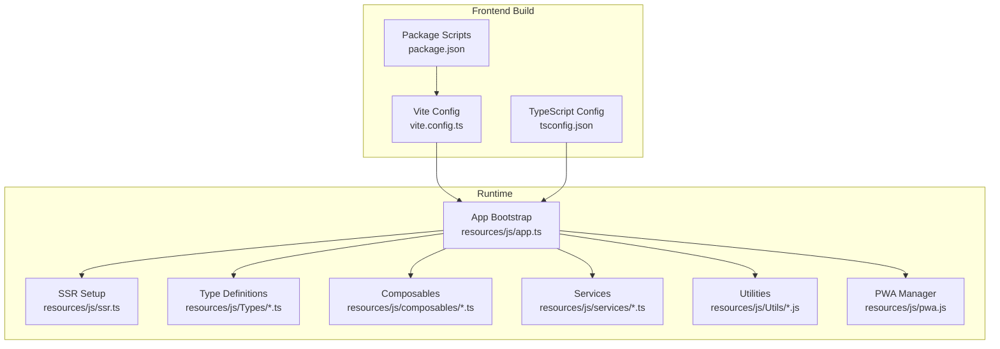
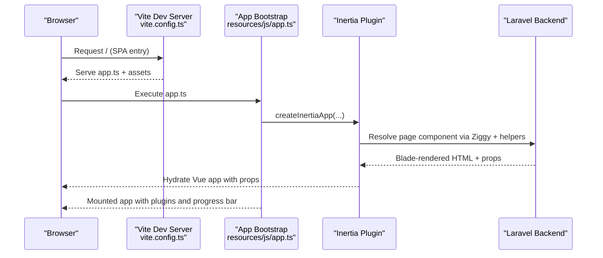
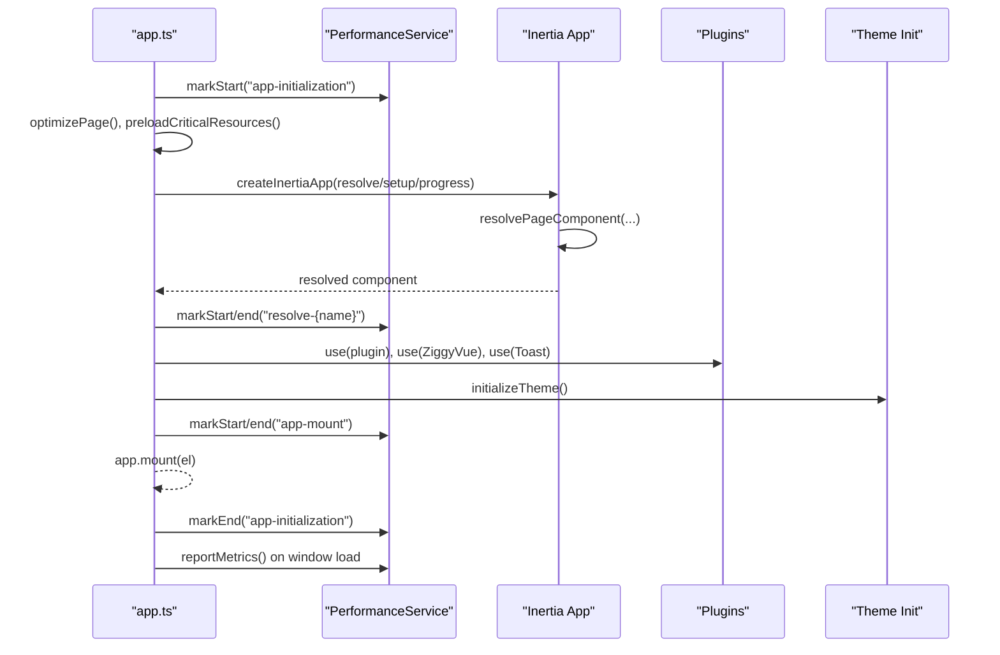
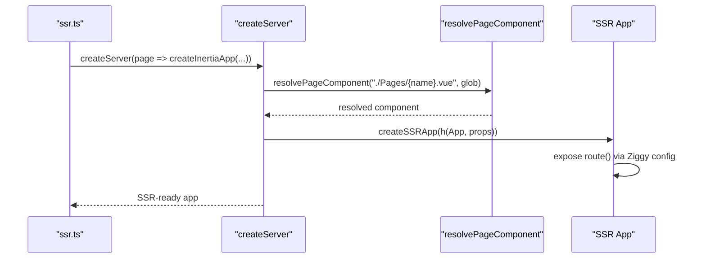
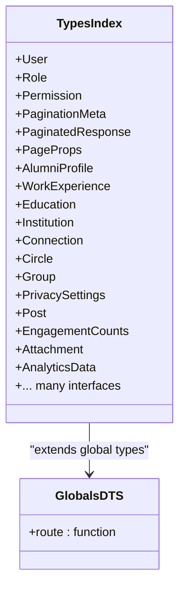
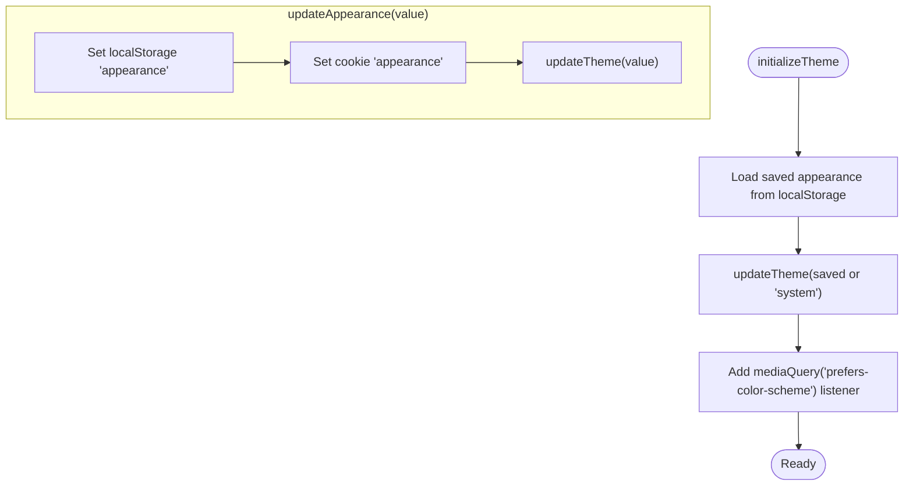
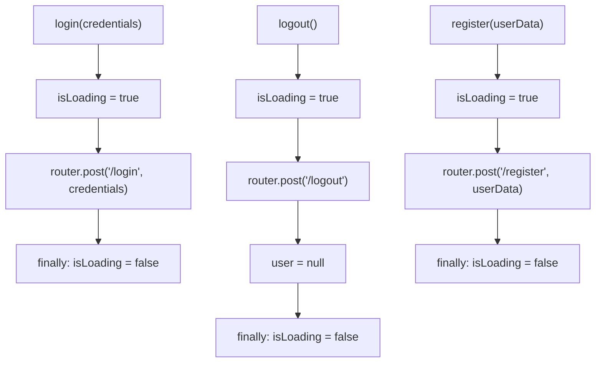
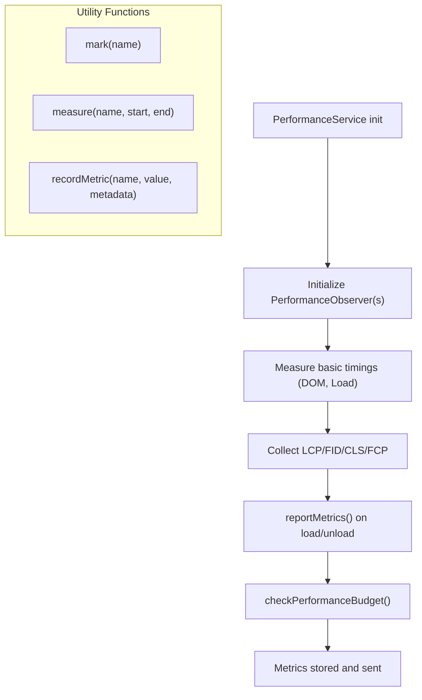
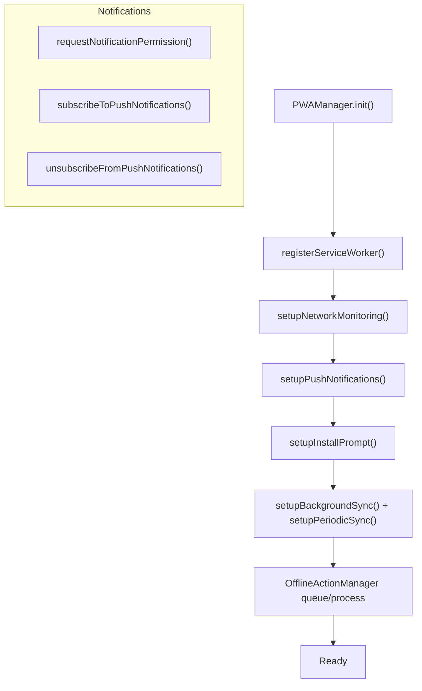

# Vue.js and TypeScript Implementation

<cite>
**Referenced Files in This Document**
- [package.json](file://package.json)
- [tsconfig.json](file://tsconfig.json)
- [vite.config.ts](file://vite.config.ts)
- [resources/js/app.ts](file://resources/js/app.ts)
- [resources/js/ssr.ts](file://resources/js/ssr.ts)
- [resources/js/pwa.js](file://resources/js/pwa.js)
- [resources/js/Types/index.ts](file://resources/js/Types/index.ts)
- [resources/js/Types/globals.d.ts](file://resources/js/Types/globals.d.ts)
- [resources/js/composables/useAppearance.ts](file://resources/js/composables/useAppearance.ts)
- [resources/js/services/PerformanceService.ts](file://resources/js/services/PerformanceService.ts)
- [resources/js/stores/auth.ts](file://resources/js/stores/auth.ts)
- [resources/js/Utils/performance-monitor.js](file://resources/js/Utils/performance-monitor.js)
</cite>

## Table of Contents
1. [Introduction](#introduction)
2. [Project Structure](#project-structure)
3. [Core Components](#core-components)
4. [Architecture Overview](#architecture-overview)
5. [Detailed Component Analysis](#detailed-component-analysis)
6. [Dependency Analysis](#dependency-analysis)
7. [Performance Considerations](#performance-considerations)
8. [Troubleshooting Guide](#troubleshooting-guide)
9. [Conclusion](#conclusion)
10. [Appendices](#appendices)

## Introduction
This document explains the modern frontend implementation built with Vue.js 3 and TypeScript, integrated with Inertia.js for seamless Laravel backend communication. It covers the Composition API usage, TypeScript configuration and type safety, reactive state management via Pinia, and performance monitoring. It also documents application bootstrapping, global plugin registration, and PWA capabilities.

## Project Structure
The frontend assets live under `resources/js` and are bundled via Vite. Key areas:
- Bootstrapping and Inertia integration: `resources/js/app.ts`, `resources/js/ssr.ts`
- TypeScript configuration and type definitions: `tsconfig.json`, `resources/js/Types/*.ts`
- Composables and services: `resources/js/composables/*.ts`, `resources/js/services/*.ts`
- Global utilities and performance monitoring: `resources/js/Utils/*.js`
- PWA integration: `resources/js/pwa.js`
- Build configuration: `vite.config.ts`, `package.json`



**Diagram sources**
- [vite.config.ts:1-163](file://vite.config.ts#L1-L163)
- [tsconfig.json:1-132](file://tsconfig.json#L1-L132)
- [package.json:1-90](file://package.json#L1-L90)
- [resources/js/app.ts:1-99](file://resources/js/app.ts#L1-L99)
- [resources/js/ssr.ts:1-42](file://resources/js/ssr.ts#L1-L42)
- [resources/js/Types/index.ts:1-524](file://resources/js/Types/index.ts#L1-L524)
- [resources/js/composables/useAppearance.ts:1-93](file://resources/js/composables/useAppearance.ts#L1-L93)
- [resources/js/services/PerformanceService.ts:1-236](file://resources/js/services/PerformanceService.ts#L1-L236)
- [resources/js/Utils/performance-monitor.js:1-621](file://resources/js/Utils/performance-monitor.js#L1-L621)
- [resources/js/pwa.js:1-847](file://resources/js/pwa.js#L1-L847)

**Section sources**
- [vite.config.ts:1-163](file://vite.config.ts#L1-L163)
- [tsconfig.json:1-132](file://tsconfig.json#L1-L132)
- [package.json:1-90](file://package.json#L1-L90)
- [resources/js/app.ts:1-99](file://resources/js/app.ts#L1-L99)
- [resources/js/ssr.ts:1-42](file://resources/js/ssr.ts#L1-L42)

## Core Components
- Application bootstrap with Inertia and Ziggy: Initializes plugins, sets up progress bar, and mounts the app.
- SSR server setup: Resolves page components and exposes Ziggy route function during server rendering.
- TypeScript configuration: Strict mode, path aliases, and type roots for Vue and TS.
- Type definitions: Comprehensive interfaces for user, roles, permissions, pagination, analytics, and more.
- Composables: Theme management and appearance persistence.
- Services: Performance monitoring and reporting.
- Utilities: Performance monitor with Core Web Vitals, custom metrics, and reporting.
- PWA: Service worker registration, offline actions, push notifications, and install prompts.

**Section sources**
- [resources/js/app.ts:1-99](file://resources/js/app.ts#L1-L99)
- [resources/js/ssr.ts:1-42](file://resources/js/ssr.ts#L1-L42)
- [tsconfig.json:1-132](file://tsconfig.json#L1-L132)
- [resources/js/Types/index.ts:1-524](file://resources/js/Types/index.ts#L1-L524)
- [resources/js/composables/useAppearance.ts:1-93](file://resources/js/composables/useAppearance.ts#L1-L93)
- [resources/js/services/PerformanceService.ts:1-236](file://resources/js/services/PerformanceService.ts#L1-L236)
- [resources/js/Utils/performance-monitor.js:1-621](file://resources/js/Utils/performance-monitor.js#L1-L621)
- [resources/js/pwa.js:1-847](file://resources/js/pwa.js#L1-L847)

## Architecture Overview
The frontend uses Inertia.js to bridge Vue SPA navigation with Laravel backend responses. Vite handles development and production builds, with code splitting and chunk naming tailored to feature areas. TypeScript enforces type safety across components, stores, and services. Performance monitoring runs continuously, capturing Core Web Vitals and custom metrics.



**Diagram sources**
- [resources/js/app.ts:43-82](file://resources/js/app.ts#L43-L82)
- [vite.config.ts:8-24](file://vite.config.ts#L8-L24)
- [resources/js/ssr.ts:10-41](file://resources/js/ssr.ts#L10-L41)

## Detailed Component Analysis

### Application Bootstrapping and Inertia Integration
- Creates the Vue app, registers Inertia, Ziggy, and toast plugins.
- Resolves page components dynamically and measures component resolution time.
- Sets up progress bar and theme initialization.
- Reports performance metrics after load and generates bundle analysis in development.



**Diagram sources**
- [resources/js/app.ts:34-98](file://resources/js/app.ts#L34-L98)
- [resources/js/services/PerformanceService.ts:161-191](file://resources/js/services/PerformanceService.ts#L161-L191)

**Section sources**
- [resources/js/app.ts:1-99](file://resources/js/app.ts#L1-L99)
- [resources/js/services/PerformanceService.ts:1-236](file://resources/js/services/PerformanceService.ts#L1-L236)

### SSR Setup
- Uses `@inertiajs/vue3/server` to render pages on the server.
- Resolves page components with inertia-helpers and injects Ziggy route function with SSR-aware configuration.



**Diagram sources**
- [resources/js/ssr.ts:10-41](file://resources/js/ssr.ts#L10-L41)

**Section sources**
- [resources/js/ssr.ts:1-42](file://resources/js/ssr.ts#L1-L42)

### TypeScript Configuration and Type Safety
- Strict TypeScript configuration with path aliases (`@/*`) and explicit type roots.
- Global Ziggy route typing via `globals.d.ts`.
- Comprehensive domain types for users, roles, permissions, pagination, analytics, and more.



**Diagram sources**
- [resources/js/Types/index.ts:1-524](file://resources/js/Types/index.ts#L1-L524)
- [resources/js/Types/globals.d.ts:1-6](file://resources/js/Types/globals.d.ts#L1-L6)

**Section sources**
- [tsconfig.json:1-132](file://tsconfig.json#L1-L132)
- [resources/js/Types/index.ts:1-524](file://resources/js/Types/index.ts#L1-L524)
- [resources/js/Types/globals.d.ts:1-6](file://resources/js/Types/globals.d.ts#L1-L6)

### Composables: Appearance Management
- Manages light/dark/system theme preferences with localStorage and cookies.
- Updates DOM classes and listens to system theme changes.



**Diagram sources**
- [resources/js/composables/useAppearance.ts:52-93](file://resources/js/composables/useAppearance.ts#L52-L93)

**Section sources**
- [resources/js/composables/useAppearance.ts:1-93](file://resources/js/composables/useAppearance.ts#L1-L93)

### Reactive State Management: Authentication Store
- Pinia store managing user state, authentication status, and role/permission checks.
- Integrates with Inertia router for login/logout/register flows.



**Diagram sources**
- [resources/js/stores/auth.ts:25-56](file://resources/js/stores/auth.ts#L25-L56)
- [resources/js/stores/auth.ts:34-42](file://resources/js/stores/auth.ts#L34-L42)
- [resources/js/stores/auth.ts:44-56](file://resources/js/stores/auth.ts#L44-L56)

**Section sources**
- [resources/js/stores/auth.ts:1-87](file://resources/js/stores/auth.ts#L1-L87)

### Performance Monitoring
- Core Web Vitals collection and custom metrics via PerformanceObserver and user timing.
- Reports metrics to backend and performs budget checks.
- Utility wrapper for component and async operation timing.



**Diagram sources**
- [resources/js/services/PerformanceService.ts:33-226](file://resources/js/services/PerformanceService.ts#L33-L226)
- [resources/js/Utils/performance-monitor.js:8-616](file://resources/js/Utils/performance-monitor.js#L8-L616)

**Section sources**
- [resources/js/services/PerformanceService.ts:1-236](file://resources/js/services/PerformanceService.ts#L1-L236)
- [resources/js/Utils/performance-monitor.js:1-621](file://resources/js/Utils/performance-monitor.js#L1-L621)

### PWA Integration
- Service worker registration, network status monitoring, and offline action queuing.
- Push notification setup with VAPID, install prompt, and periodic background sync.



**Diagram sources**
- [resources/js/pwa.js:6-650](file://resources/js/pwa.js#L6-L650)
- [resources/js/pwa.js:680-847](file://resources/js/pwa.js#L680-L847)

**Section sources**
- [resources/js/pwa.js:1-847](file://resources/js/pwa.js#L1-L847)

## Dependency Analysis
- Build and toolchain: Vite, TypeScript, ESLint, TailwindCSS, PostCSS.
- Runtime: Vue 3, Inertia.js, Ziggy, Pinia, VueUse, Chart.js, Leaflet, vee-validate, lucide icons.
- SSR: @vue/server-renderer with Inertia SSR server.
- PWA: Service Worker, Push API, IndexedDB for offline actions.

```mermaid
graph TB
subgraph "Build Tools"
Vite["Vite"]
TS["TypeScript"]
ESLint["ESLint"]
Tailwind["TailwindCSS"]
end
subgraph "Runtime"
Vue["Vue 3"]
Inertia["@inertiajs/vue3"]
Ziggy["Ziggy"]
Pinia["Pinia"]
VueUse["@vueuse/core"]
end
subgraph "UI & UX"
Icons["@heroicons/vue, lucide-vue-next"]
Charts["Chart.js"]
Leaflet["Leaflet + vue-leaflet"]
Toast["vue-toastification"]
end
subgraph "SSR"
SSR["@vue/server-renderer"]
end
Vite --> Vue
Vite --> Inertia
Vite --> Ziggy
Vite --> Pinia
Vite --> VueUse
Vite --> Icons
Vite --> Charts
Vite --> Leaflet
Vite --> Toast
SSR --> Inertia
```

**Diagram sources**
- [package.json:22-87](file://package.json#L22-L87)
- [vite.config.ts:1-163](file://vite.config.ts#L1-L163)

**Section sources**
- [package.json:1-90](file://package.json#L1-L90)
- [vite.config.ts:1-163](file://vite.config.ts#L1-L163)

## Performance Considerations
- Code splitting: Manual chunks for vendor, utils, UI, and feature-specific pages.
- Chunk naming: Custom naming for admin, analytics, and component libraries.
- Asset optimization: Separate image, font, and CSS chunk paths.
- Minification and sourcemaps: ESBuild minify, optional sourcemaps in development.
- Performance monitoring: Continuous collection of Core Web Vitals and custom metrics; reporting on load/unload.
- Lazy loading: Preload critical resources and prefetch likely next pages.

**Section sources**
- [vite.config.ts:25-108](file://vite.config.ts#L25-L108)
- [resources/js/app.ts:40-41](file://resources/js/app.ts#L40-L41)
- [resources/js/services/PerformanceService.ts:173-191](file://resources/js/services/PerformanceService.ts#L173-L191)

## Troubleshooting Guide
- Inertia page resolution failures: Verify page component paths and ensure `laravel-vite-plugin/inertia-helpers` glob matches actual files.
- TypeScript errors: Confirm `tsconfig.json` includes Vue and TS files and path aliases are correct.
- Performance reporting issues: Check `/monitoring/api/performance-metrics` endpoint availability and CORS settings.
- PWA not registering: Ensure service worker path `/sw.js` exists and HTTPS in production; verify browser support for Push API and Background Sync.
- SSR routing: Confirm Ziggy SSR config includes `location` and `ziggy` props are passed to the SSR app.

**Section sources**
- [resources/js/app.ts:45-61](file://resources/js/app.ts#L45-L61)
- [tsconfig.json:123-131](file://tsconfig.json#L123-L131)
- [resources/js/services/PerformanceService.ts:180-190](file://resources/js/services/PerformanceService.ts#L180-L190)
- [resources/js/pwa.js:40-71](file://resources/js/pwa.js#L40-L71)
- [resources/js/ssr.ts:20-34](file://resources/js/ssr.ts#L20-L34)

## Conclusion
This implementation demonstrates a modern, type-safe Vue 3 + TypeScript frontend with Inertia.js for Laravel integration. It emphasizes performance monitoring, SSR readiness, and progressive enhancement via PWA features. The Composition API and Pinia provide clean reactive patterns, while strict TypeScript configuration ensures maintainability and scalability.

## Appendices
- Development commands: `dev`, `build`, `test`, `lint`, `format`, `analyze`, `perf:test`, `perf:lighthouse`.
- Vite server: Host/port configuration and CORS/proxy for API traffic.
- Path aliases: `@`, `@components`, `@pages`, `@services`.

**Section sources**
- [package.json:4-21](file://package.json#L4-L21)
- [vite.config.ts:119-138](file://vite.config.ts#L119-L138)
- [tsconfig.json:36-47](file://tsconfig.json#L36-L47)