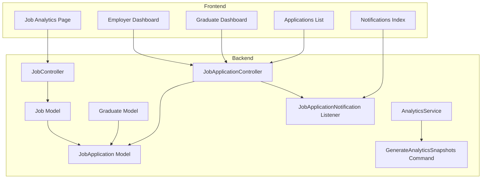
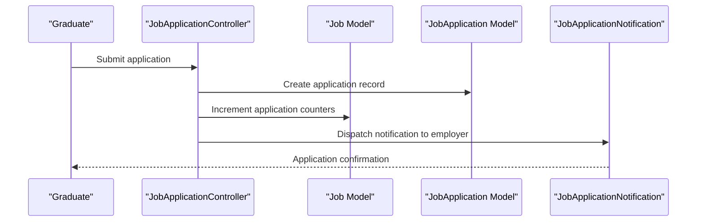
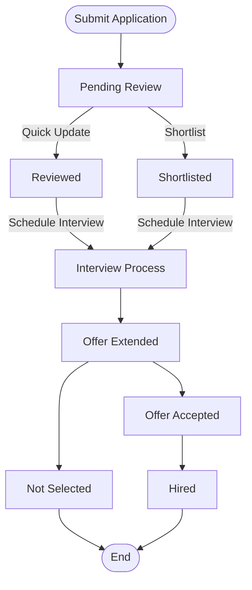
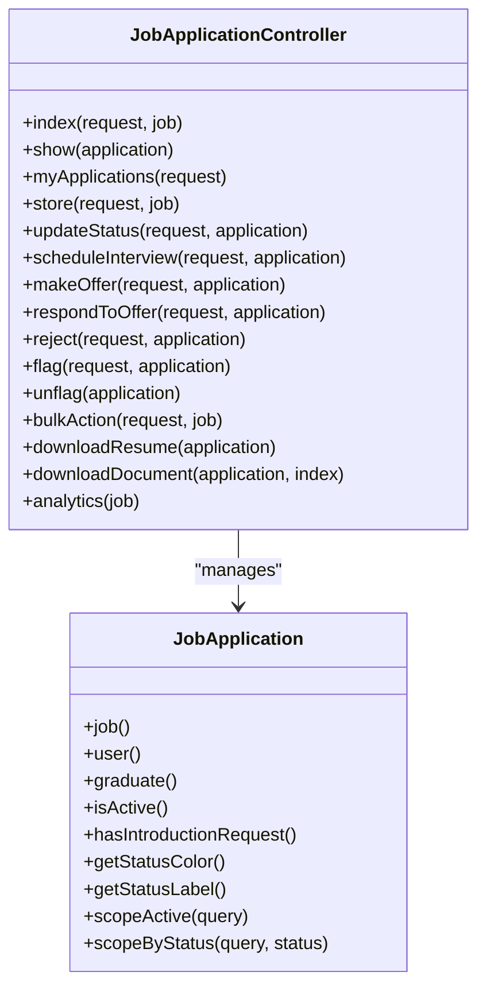
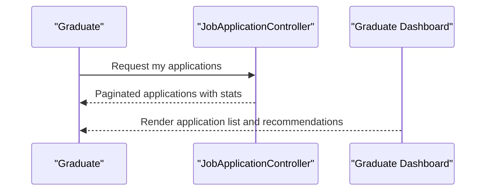
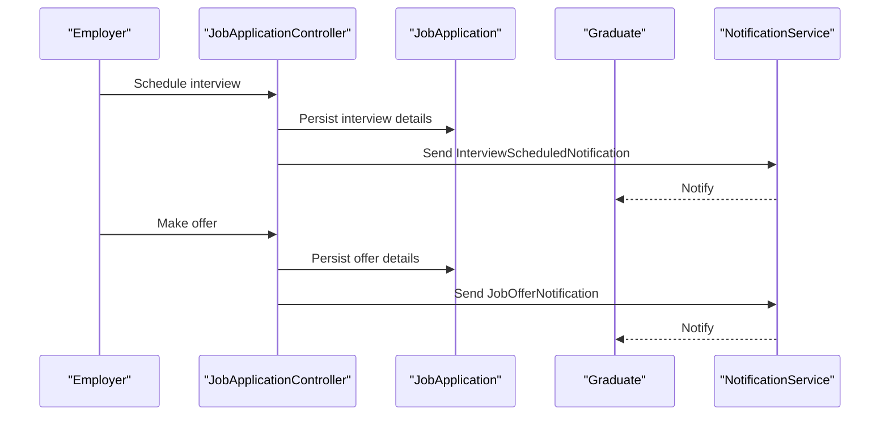
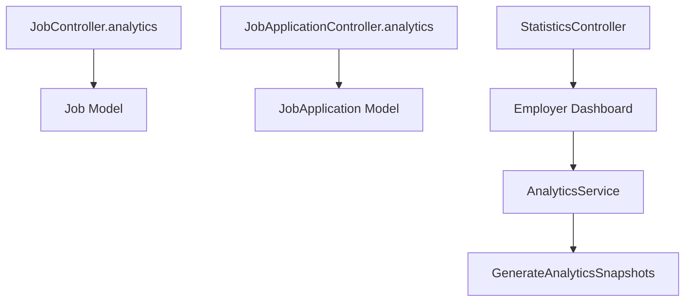
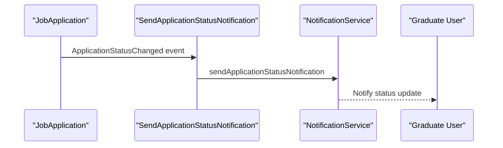
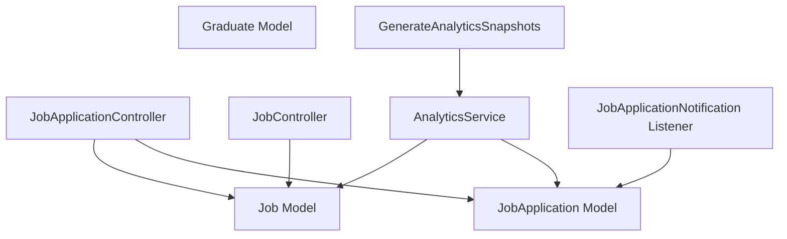

# Application Tracking & Analytics

<cite>
**Referenced Files in This Document**
- [JobApplication.php](file://app/Models/JobApplication.php)
- [Job.php](file://app/Models/Job.php)
- [Graduate.php](file://app/Models/Graduate.php)
- [JobApplicationController.php](file://app/Http/Controllers/JobApplicationController.php)
- [JobController.php](file://app/Http/Controllers/JobController.php)
- [AnalyticsService.php](file://app/Services/AnalyticsService.php)
- [SendApplicationStatusNotification.php](file://app/Listeners/SendApplicationStatusNotification.php)
- [JobApplicationNotification.php](file://app/Notifications/JobApplicationNotification.php)
- [GenerateAnalyticsSnapshots.php](file://app/Console/Commands/GenerateAnalyticsSnapshots.php)
- [Index.vue](file://resources/js/Pages/Jobs/Applications/Index.vue)
- [Analytics.vue](file://resources/js/Pages/Jobs/Analytics.vue)
- [Employer.vue](file://resources/js/Pages/Dashboard/Employer.vue)
- [Graduate.vue](file://resources/js/Pages/Dashboard/Graduate.vue)
- [StatisticsController.php](file://app/Http/Controllers/Api/StatisticsController.php)
- [Index.vue](file://resources/js/Pages/Notifications/Index.vue)
- [Preferences.vue](file://resources/js/Pages/Notifications/Preferences.vue)
- [TestDataSets.php](file://tests/UserAcceptance/TestDataSets.php)
- [TestRunner.php](file://tests/UserAcceptance/TestRunner.php)
- [TestScenarios.md](file://tests/UserAcceptance/TestScenarios.md)
- [requirements.md](file://docs/graduate-tracking-system/requirements.md)
- [tasks.md](file://docs/graduate-tracking-system/tasks.md)
</cite>

## Table of Contents
1. [Introduction](#introduction)
2. [Project Structure](#project-structure)
3. [Core Components](#core-components)
4. [Architecture Overview](#architecture-overview)
5. [Detailed Component Analysis](#detailed-component-analysis)
6. [Dependency Analysis](#dependency-analysis)
7. [Performance Considerations](#performance-considerations)
8. [Troubleshooting Guide](#troubleshooting-guide)
9. [Conclusion](#conclusion)
10. [Appendices](#appendices)

## Introduction
This document describes the application tracking and analytics system for the Alumate platform. It covers the complete lifecycle from job posting to hire, including candidate screening, interview scheduling, and hiring workflow automation. It also documents application management interfaces for both employers and graduates, status tracking, communication tools, analytics dashboards, automated workflows, filtering/sorting, and bulk operations. The goal is to provide a comprehensive understanding of how applications are managed, tracked, and reported across the platform.

## Project Structure
The application tracking system spans Laravel backend models, controllers, listeners, notifications, and Vue.js frontend pages. Key areas include:
- Models for jobs, applications, and graduates
- Controllers for job and application management
- Analytics service and snapshot generation
- Frontend dashboards for employers and graduates
- Notification system for status updates and reminders
- Tests validating application management and analytics

**Diagram sources**
- [JobApplicationController.php:1-497](file://app/Http/Controllers/JobApplicationController.php#L1-L497)
- [JobController.php:273-306](file://app/Http/Controllers/JobController.php#L273-L306)
- [AnalyticsService.php:1-800](file://app/Services/AnalyticsService.php#L1-L800)
- [GenerateAnalyticsSnapshots.php:1-314](file://app/Console/Commands/GenerateAnalyticsSnapshots.php#L1-L314)
- [SendApplicationStatusNotification.php:1-39](file://app/Listeners/SendApplicationStatusNotification.php#L1-L39)
- [Index.vue:1-565](file://resources/js/Pages/Jobs/Applications/Index.vue#L1-L565)
- [Analytics.vue:42-333](file://resources/js/Pages/Jobs/Analytics.vue#L42-L333)
- [Employer.vue:303-320](file://resources/js/Pages/Dashboard/Employer.vue#L303-L320)
- [Graduate.vue:1-417](file://resources/js/Pages/Dashboard/Graduate.vue#L1-L417)
- [Index.vue:36-103](file://resources/js/Pages/Notifications/Index.vue#L36-L103)

**Section sources**
- [JobApplicationController.php:1-497](file://app/Http/Controllers/JobApplicationController.php#L1-L497)
- [JobController.php:273-306](file://app/Http/Controllers/JobController.php#L273-L306)
- [AnalyticsService.php:1-800](file://app/Services/AnalyticsService.php#L1-L800)
- [GenerateAnalyticsSnapshots.php:1-314](file://app/Console/Commands/GenerateAnalyticsSnapshots.php#L1-L314)
- [SendApplicationStatusNotification.php:1-39](file://app/Listeners/SendApplicationStatusNotification.php#L1-L39)
- [Index.vue:1-565](file://resources/js/Pages/Jobs/Applications/Index.vue#L1-L565)
- [Analytics.vue:42-333](file://resources/js/Pages/Jobs/Analytics.vue#L42-L333)
- [Employer.vue:303-320](file://resources/js/Pages/Dashboard/Employer.vue#L303-L320)
- [Graduate.vue:1-417](file://resources/js/Pages/Dashboard/Graduate.vue#L1-L417)
- [Index.vue:36-103](file://resources/js/Pages/Notifications/Index.vue#L36-L103)

## Core Components
- JobApplication model encapsulates application lifecycle, statuses, and relationships to jobs and graduates. It includes scopes for filtering and helpers for UI status rendering.
- Job model manages job lifecycle, application statistics, match scoring, and performance metrics.
- Graduate model stores profile and employment data used for job matching and analytics.
- JobApplicationController handles employer-side application management: filtering, sorting, bulk actions, status updates, interview scheduling, offer management, and document downloads.
- AnalyticsService aggregates platform and job-level analytics, supports export, and generates historical snapshots.
- Notification system triggers status updates and sends notifications to stakeholders.
- Frontend dashboards provide employer and graduate views for tracking applications, analytics, and communications.

**Section sources**
- [JobApplication.php:1-162](file://app/Models/JobApplication.php#L1-L162)
- [Job.php:1-573](file://app/Models/Job.php#L1-L573)
- [Graduate.php:1-243](file://app/Models/Graduate.php#L1-L243)
- [JobApplicationController.php:1-497](file://app/Http/Controllers/JobApplicationController.php#L1-L497)
- [AnalyticsService.php:1-800](file://app/Services/AnalyticsService.php#L1-L800)
- [SendApplicationStatusNotification.php:1-39](file://app/Listeners/SendApplicationStatusNotification.php#L1-L39)

## Architecture Overview
The system follows a layered architecture:
- Presentation layer: Vue.js pages for employer and graduate dashboards, notifications, and analytics.
- Application layer: Controllers orchestrate business logic, enforce authorization, and coordinate model operations.
- Domain layer: Models encapsulate domain entities and relationships.
- Infrastructure layer: Services and commands handle analytics aggregation, snapshot generation, and background processing.

**Diagram sources**
- [JobApplicationController.php:183-252](file://app/Http/Controllers/JobApplicationController.php#L183-L252)
- [Job.php:199-216](file://app/Models/Job.php#L199-L216)
- [JobApplicationNotification.php:1-64](file://app/Notifications/JobApplicationNotification.php#L1-L64)

**Section sources**
- [JobApplicationController.php:183-252](file://app/Http/Controllers/JobApplicationController.php#L183-L252)
- [Job.php:199-216](file://app/Models/Job.php#L199-L216)
- [JobApplicationNotification.php:1-64](file://app/Notifications/JobApplicationNotification.php#L1-L64)

## Detailed Component Analysis

### Application Lifecycle and Management
The application lifecycle spans submission, screening, interview scheduling, offer management, and hiring. Employers can filter, sort, and take bulk actions on applications. Graduates can track their own applications and receive notifications.

**Diagram sources**
- [JobApplicationController.php:254-341](file://app/Http/Controllers/JobApplicationController.php#L254-L341)
- [JobApplication.php:39-53](file://app/Models/JobApplication.php#L39-L53)

**Section sources**
- [JobApplicationController.php:16-181](file://app/Http/Controllers/JobApplicationController.php#L16-L181)
- [JobApplicationController.php:254-341](file://app/Http/Controllers/JobApplicationController.php#L254-L341)
- [JobApplication.php:39-161](file://app/Models/JobApplication.php#L39-L161)

### Employer Application Management Interface
The employer interface provides:
- Filtering by status, course, minimum GPA, skills, and search term
- Sorting by application date, match score, GPA, and status
- Bulk actions: mark reviewed, shortlist, reject, flag
- Quick status updates and document downloads
- Statistics cards for total, pending, reviewed, shortlisted, interviewed, hired, rejected, flagged counts

**Diagram sources**
- [JobApplicationController.php:1-497](file://app/Http/Controllers/JobApplicationController.php#L1-L497)
- [JobApplication.php:1-162](file://app/Models/JobApplication.php#L1-L162)

**Section sources**
- [Index.vue:1-565](file://resources/js/Pages/Jobs/Applications/Index.vue#L1-L565)
- [JobApplicationController.php:16-181](file://app/Http/Controllers/JobApplicationController.php#L16-L181)
- [JobApplicationController.php:381-426](file://app/Http/Controllers/JobApplicationController.php#L381-L426)

### Graduate Application Tracking Interface
Graduates can view their applications, track status, and see recent activities and job recommendations. The dashboard displays statistics such as total applications, pending, interviews, offers, and employment status.

**Diagram sources**
- [JobApplicationController.php:139-181](file://app/Http/Controllers/JobApplicationController.php#L139-L181)
- [Graduate.vue:1-417](file://resources/js/Pages/Dashboard/Graduate.vue#L1-L417)

**Section sources**
- [JobApplicationController.php:139-181](file://app/Http/Controllers/JobApplicationController.php#L139-L181)
- [Graduate.vue:1-417](file://resources/js/Pages/Dashboard/Graduate.vue#L1-L417)

### Interview Scheduling and Offer Management
Employers can schedule interviews and extend offers. The system sends notifications to graduates upon scheduling and offer creation.

**Diagram sources**
- [JobApplicationController.php:272-314](file://app/Http/Controllers/JobApplicationController.php#L272-L314)
- [SendApplicationStatusNotification.php:1-39](file://app/Listeners/SendApplicationStatusNotification.php#L1-L39)

**Section sources**
- [JobApplicationController.php:272-314](file://app/Http/Controllers/JobApplicationController.php#L272-L314)
- [SendApplicationStatusNotification.php:1-39](file://app/Listeners/SendApplicationStatusNotification.php#L1-L39)

### Analytics and Reporting
The system provides:
- Job-level analytics including application trends, status breakdown, conversion funnel, and match scores
- Employer dashboard analytics for hiring metrics (hire rate, average time to hire, total hires)
- Platform-wide analytics via AnalyticsService and scheduled snapshot generation
- API endpoints for statistics and export capabilities

**Diagram sources**
- [JobController.php:277-306](file://app/Http/Controllers/JobController.php#L277-L306)
- [JobApplicationController.php:461-495](file://app/Http/Controllers/JobApplicationController.php#L461-L495)
- [AnalyticsService.php:511-793](file://app/Services/AnalyticsService.php#L511-L793)
- [GenerateAnalyticsSnapshots.php:1-314](file://app/Console/Commands/GenerateAnalyticsSnapshots.php#L1-L314)
- [Employer.vue:303-320](file://resources/js/Pages/Dashboard/Employer.vue#L303-L320)
- [StatisticsController.php:50-85](file://app/Http/Controllers/Api/StatisticsController.php#L50-L85)

**Section sources**
- [JobController.php:277-306](file://app/Http/Controllers/JobController.php#L277-L306)
- [JobApplicationController.php:461-495](file://app/Http/Controllers/JobApplicationController.php#L461-L495)
- [AnalyticsService.php:511-793](file://app/Services/AnalyticsService.php#L511-L793)
- [GenerateAnalyticsSnapshots.php:1-314](file://app/Console/Commands/GenerateAnalyticsSnapshots.php#L1-L314)
- [Employer.vue:303-320](file://resources/js/Pages/Dashboard/Employer.vue#L303-L320)
- [StatisticsController.php:50-85](file://app/Http/Controllers/Api/StatisticsController.php#L50-L85)

### Automated Workflows and Notifications
Automated workflows trigger notifications on:
- Application submission
- Status changes
- Interview scheduling
- Offer creation
- Application deadlines and reminders

**Diagram sources**
- [SendApplicationStatusNotification.php:1-39](file://app/Listeners/SendApplicationStatusNotification.php#L1-L39)
- [JobApplicationNotification.php:1-64](file://app/Notifications/JobApplicationNotification.php#L1-L64)

**Section sources**
- [SendApplicationStatusNotification.php:1-39](file://app/Listeners/SendApplicationStatusNotification.php#L1-L39)
- [JobApplicationNotification.php:1-64](file://app/Notifications/JobApplicationNotification.php#L1-L64)

### Filtering, Sorting, and Bulk Operations
The application listing supports:
- Filters: status, priority, flagged, course, minimum GPA, search term
- Sorting: application date, match score, GPA, status
- Bulk actions: review, shortlist, reject, flag
- Pagination and selection helpers

**Section sources**
- [Index.vue:14-134](file://resources/js/Pages/Jobs/Applications/Index.vue#L14-L134)
- [JobApplicationController.php:16-112](file://app/Http/Controllers/JobApplicationController.php#L16-L112)
- [JobApplicationController.php:381-426](file://app/Http/Controllers/JobApplicationController.php#L381-L426)

### Example Interfaces and Workflows
- Employer job analytics page displays recommendations and performance metrics.
- Employer dashboard shows hiring analytics including hire rate, average time to hire, and total hires.
- Graduate dashboard shows application statistics, recent activities, and job recommendations.
- Notifications index and preferences pages manage notification channels and types.

**Section sources**
- [Analytics.vue:42-333](file://resources/js/Pages/Jobs/Analytics.vue#L42-L333)
- [Employer.vue:303-320](file://resources/js/Pages/Dashboard/Employer.vue#L303-L320)
- [Graduate.vue:1-417](file://resources/js/Pages/Dashboard/Graduate.vue#L1-L417)
- [Index.vue:36-103](file://resources/js/Pages/Notifications/Index.vue#L36-L103)
- [Preferences.vue:176-197](file://resources/js/Pages/Notifications/Preferences.vue#L176-L197)

## Dependency Analysis
The following diagram highlights key dependencies among components involved in application tracking and analytics.

**Diagram sources**
- [JobApplicationController.php:1-497](file://app/Http/Controllers/JobApplicationController.php#L1-L497)
- [JobController.php:273-306](file://app/Http/Controllers/JobController.php#L273-L306)
- [AnalyticsService.php:1-800](file://app/Services/AnalyticsService.php#L1-L800)
- [GenerateAnalyticsSnapshots.php:1-314](file://app/Console/Commands/GenerateAnalyticsSnapshots.php#L1-L314)
- [SendApplicationStatusNotification.php:1-39](file://app/Listeners/SendApplicationStatusNotification.php#L1-L39)

**Section sources**
- [JobApplicationController.php:1-497](file://app/Http/Controllers/JobApplicationController.php#L1-L497)
- [JobController.php:273-306](file://app/Http/Controllers/JobController.php#L273-L306)
- [AnalyticsService.php:1-800](file://app/Services/AnalyticsService.php#L1-L800)
- [GenerateAnalyticsSnapshots.php:1-314](file://app/Console/Commands/GenerateAnalyticsSnapshots.php#L1-L314)
- [SendApplicationStatusNotification.php:1-39](file://app/Listeners/SendApplicationStatusNotification.php#L1-L39)

## Performance Considerations
- Use pagination and efficient queries for large datasets (as seen in application listing).
- Leverage database indexing on frequently filtered/sorted columns (status, created_at, graduate_id).
- Cache analytics computations and dashboard metrics to reduce repeated heavy queries.
- Offload notification sending to background queues to avoid blocking requests.
- Consider denormalizing counters (e.g., total_applications) on jobs to speed up calculations.

## Troubleshooting Guide
Common issues and resolutions:
- Application not found: Ensure correct authorization and route parameters for resume/document downloads.
- Status update failures: Validate request payload and user permissions for status transitions.
- Notification delivery problems: Check queue worker status and notification preferences.
- Analytics discrepancies: Confirm snapshot generation command ran successfully and cache is cleared if needed.

**Section sources**
- [JobApplicationController.php:428-459](file://app/Http/Controllers/JobApplicationController.php#L428-L459)
- [JobApplicationController.php:254-270](file://app/Http/Controllers/JobApplicationController.php#L254-L270)
- [GenerateAnalyticsSnapshots.php:1-314](file://app/Console/Commands/GenerateAnalyticsSnapshots.php#L1-L314)

## Conclusion
The Alumate application tracking and analytics system provides a robust foundation for managing the full hiring lifecycle. Employers benefit from powerful application management tools, analytics insights, and automated notifications, while graduates gain visibility into their applications and receive timely updates. The modular design enables scalability, maintainability, and extensibility for future enhancements.

## Appendices

### Requirements and Tasks Alignment
- Requirements for job management, application system, and analytics reporting are documented and validated through acceptance tests.
- Implementation tasks cover employer registration, job posting, application management, and dashboard/analytics features.

**Section sources**
- [requirements.md:47-74](file://docs/graduate-tracking-system/requirements.md#L47-L74)
- [tasks.md:62-127](file://docs/graduate-tracking-system/tasks.md#L62-L127)

### Testing Coverage
- Application management tests validate posting, application review, search, and profile features.
- Test scenarios cover job creation, application review, and graduate search functionality.
- Test datasets include notifications for application status updates, job matches, and new applications.

**Section sources**
- [TestRunner.php:410-459](file://tests/UserAcceptance/TestRunner.php#L410-L459)
- [TestScenarios.md:192-212](file://tests/UserAcceptance/TestScenarios.md#L192-L212)
- [TestDataSets.php:762-794](file://tests/UserAcceptance/TestDataSets.php#L762-L794)