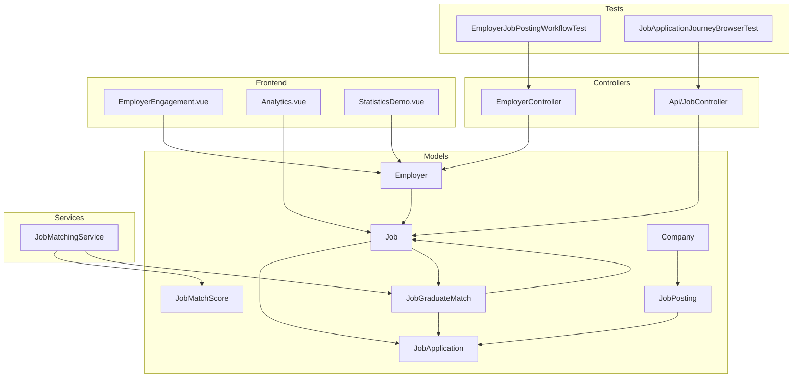
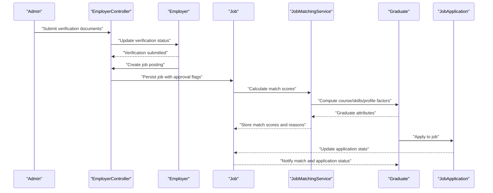
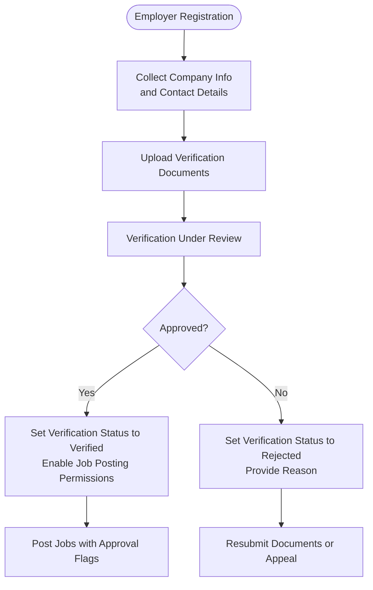
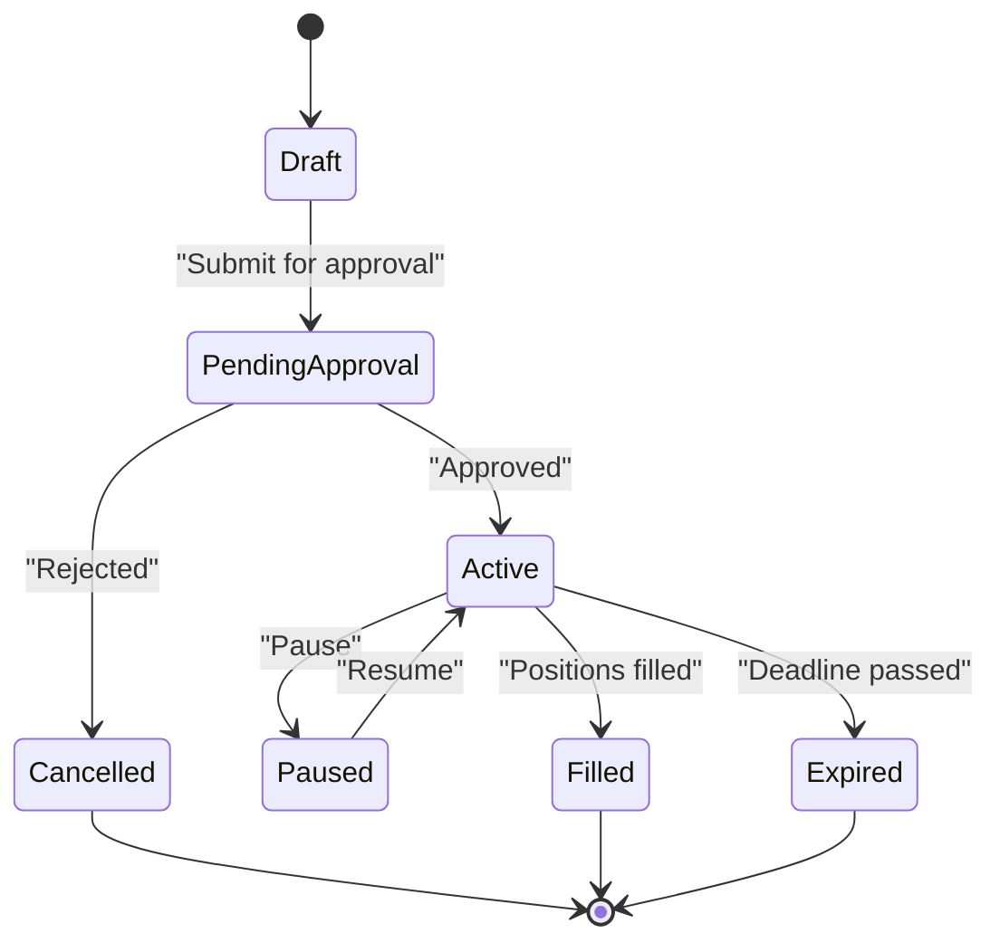
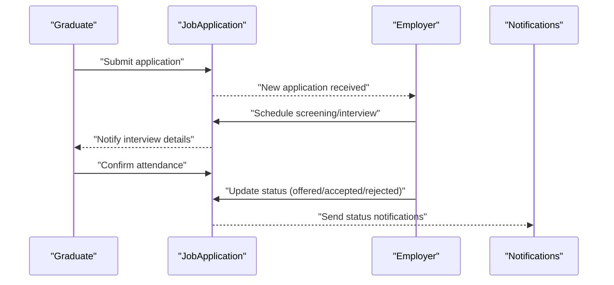
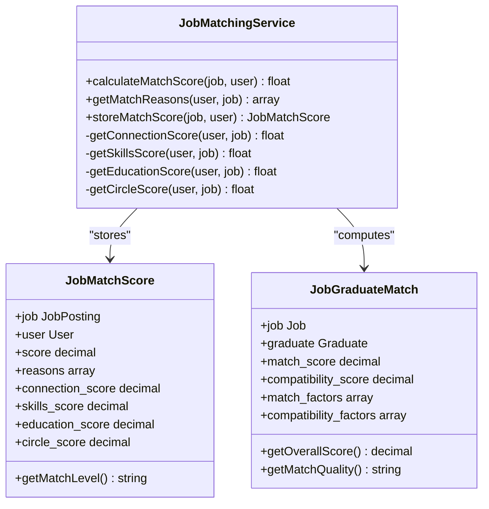
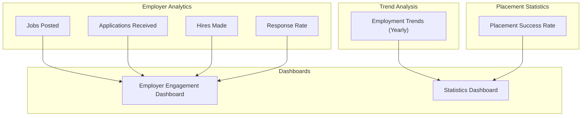
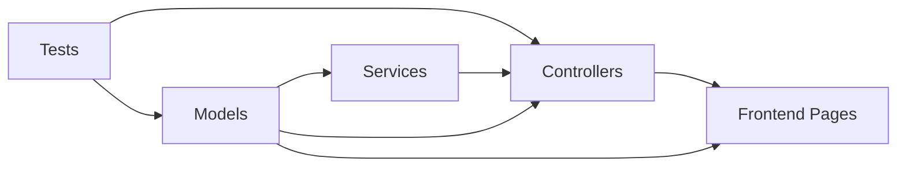

# Job Management System

<cite>
**Referenced Files in This Document**
- [Job.php](file://app/Models/Job.php)
- [JobPosting.php](file://app/Models/JobPosting.php)
- [JobApplication.php](file://app/Models/JobApplication.php)
- [JobMatchScore.php](file://app/Models/JobMatchScore.php)
- [JobGraduateMatch.php](file://app/Models/JobGraduateMatch.php)
- [Employer.php](file://app/Models/Employer.php)
- [Company.php](file://app/Models/Company.php)
- [JobMatchingService.php](file://app/Services/JobMatchingService.php)
- [EmployerController.php](file://app/Http/Controllers/EmployerController.php)
- [Api/JobController.php](file://app/Http/Controllers/Api/JobController.php)
- [task-07-employer-registration-verification-recap.md](file://docs/task-07-employer-registration-verification-recap.md)
- [task-11-search-matching-system-recap.md](file://docs/task-11-search-matching-system-recap.md)
- [employer-user-manual.md](file://docs/user-guides/employer/employer-user-manual.md)
- [EmployerJobPostingWorkflowTest.php](file://tests/Browser/EmployerJobPostingWorkflowTest.php)
- [JobApplicationJourneyBrowserTest.php](file://tests/Browser/JobApplicationJourneyBrowserTest.php)
- [AnalyticsServiceTest.php](file://tests/Unit/Services/AnalyticsServiceTest.php)
- [EmployerEngagement.vue](file://resources/js/Pages/InstitutionAdmin/Analytics/EmployerEngagement.vue)
- [Analytics.vue](file://resources/js/Pages/Courses/Analytics.vue)
- [StatisticsDemo.vue](file://resources/js/Pages/ComponentLibrary/StatisticsDemo.vue)
- [PredictionModel.php](file://app/Models/PredictionModel.php)
</cite>

## Table of Contents
1. [Introduction](#introduction)
2. [Project Structure](#project-structure)
3. [Core Components](#core-components)
4. [Architecture Overview](#architecture-overview)
5. [Detailed Component Analysis](#detailed-component-analysis)
6. [Dependency Analysis](#dependency-analysis)
7. [Performance Considerations](#performance-considerations)
8. [Troubleshooting Guide](#troubleshooting-guide)
9. [Conclusion](#conclusion)
10. [Appendices](#appendices)

## Introduction
This document describes the job management system covering job posting, application tracking, and smart matching algorithms. It explains the job posting workflow including employer verification, approval processes, and job lifecycle management; documents the application tracking system including candidate screening, interview scheduling, and hiring workflow automation; details the smart matching algorithms using AI/ML for candidate-job matching, score calculation, and recommendation engines; and includes implementation details for job analytics, employer insights, and placement statistics. Practical examples illustrate job posting workflows and matching algorithm outputs.

## Project Structure
The job management system spans models, services, controllers, Vue.js pages, and comprehensive documentation. Key areas include:
- Models: Job, JobPosting, JobApplication, JobMatchScore, JobGraduateMatch, Employer, Company
- Services: JobMatchingService
- Controllers: EmployerController, Api/JobController
- Frontend: Vue.js pages for analytics and employer engagement
- Tests: Browser tests for job posting and application workflows
- Documentation: Task recaps detailing employer verification and matching systems

**Diagram sources**
- [Job.php:1-573](file://app/Models/Job.php#L1-L573)
- [JobPosting.php:1-126](file://app/Models/JobPosting.php#L1-L126)
- [JobApplication.php:1-162](file://app/Models/JobApplication.php#L1-L162)
- [JobMatchScore.php:1-146](file://app/Models/JobMatchScore.php#L1-L146)
- [JobGraduateMatch.php:1-191](file://app/Models/JobGraduateMatch.php#L1-L191)
- [Employer.php:1-397](file://app/Models/Employer.php#L1-L397)
- [Company.php:1-78](file://app/Models/Company.php#L1-L78)
- [JobMatchingService.php:1-362](file://app/Services/JobMatchingService.php#L1-L362)
- [EmployerController.php:1-389](file://app/Http/Controllers/EmployerController.php#L1-L389)
- [Api/JobController.php:1-68](file://app/Http/Controllers/Api/JobController.php#L1-L68)
- [EmployerEngagement.vue:1-120](file://resources/js/Pages/InstitutionAdmin/Analytics/EmployerEngagement.vue#L1-L120)
- [Analytics.vue:226-239](file://resources/js/Pages/Courses/Analytics.vue#L226-L239)
- [StatisticsDemo.vue:351-422](file://resources/js/Pages/ComponentLibrary/StatisticsDemo.vue#L351-L422)
- [EmployerJobPostingWorkflowTest.php:119-312](file://tests/Browser/EmployerJobPostingWorkflowTest.php#L119-L312)
- [JobApplicationJourneyBrowserTest.php:213-282](file://tests/Browser/JobApplicationJourneyBrowserTest.php#L213-L282)

**Section sources**
- [Job.php:1-573](file://app/Models/Job.php#L1-L573)
- [JobPosting.php:1-126](file://app/Models/JobPosting.php#L1-L126)
- [JobApplication.php:1-162](file://app/Models/JobApplication.php#L1-L162)
- [JobMatchScore.php:1-146](file://app/Models/JobMatchScore.php#L1-L146)
- [JobGraduateMatch.php:1-191](file://app/Models/JobGraduateMatch.php#L1-L191)
- [Employer.php:1-397](file://app/Models/Employer.php#L1-L397)
- [Company.php:1-78](file://app/Models/Company.php#L1-L78)
- [JobMatchingService.php:1-362](file://app/Services/JobMatchingService.php#L1-L362)
- [EmployerController.php:1-389](file://app/Http/Controllers/EmployerController.php#L1-L389)
- [Api/JobController.php:1-68](file://app/Http/Controllers/Api/JobController.php#L1-L68)
- [EmployerEngagement.vue:1-120](file://resources/js/Pages/InstitutionAdmin/Analytics/EmployerEngagement.vue#L1-L120)
- [Analytics.vue:226-239](file://resources/js/Pages/Courses/Analytics.vue#L226-L239)
- [StatisticsDemo.vue:351-422](file://resources/js/Pages/ComponentLibrary/StatisticsDemo.vue#L351-L422)
- [EmployerJobPostingWorkflowTest.php:119-312](file://tests/Browser/EmployerJobPostingWorkflowTest.php#L119-L312)
- [JobApplicationJourneyBrowserTest.php:213-282](file://tests/Browser/JobApplicationJourneyBrowserTest.php#L213-L282)

## Core Components
- Job model encapsulates job lifecycle, status management, application statistics, matching logic, and performance metrics.
- JobPosting model handles legacy job posting records with match scoring and active job scoping.
- JobApplication tracks candidate applications with status transitions and metadata.
- JobMatchScore stores computed match scores and reasons for job-user pairs.
- JobGraduateMatch captures detailed match factors and compatibility for graduate-job pairs.
- Employer model manages verification status, subscription limits, and job posting permissions.
- Company model represents employer organizations and active job listings.
- JobMatchingService computes weighted match scores using connections, skills, education, and circles.
- Controllers orchestrate employer verification workflows and job API endpoints.
- Frontend pages present employer engagement analytics and job analytics dashboards.
- Tests validate end-to-end job posting and application workflows.

**Section sources**
- [Job.php:1-573](file://app/Models/Job.php#L1-L573)
- [JobPosting.php:1-126](file://app/Models/JobPosting.php#L1-L126)
- [JobApplication.php:1-162](file://app/Models/JobApplication.php#L1-L162)
- [JobMatchScore.php:1-146](file://app/Models/JobMatchScore.php#L1-L146)
- [JobGraduateMatch.php:1-191](file://app/Models/JobGraduateMatch.php#L1-L191)
- [Employer.php:1-397](file://app/Models/Employer.php#L1-L397)
- [Company.php:1-78](file://app/Models/Company.php#L1-L78)
- [JobMatchingService.php:1-362](file://app/Services/JobMatchingService.php#L1-L362)
- [EmployerController.php:1-389](file://app/Http/Controllers/EmployerController.php#L1-L389)
- [Api/JobController.php:1-68](file://app/Http/Controllers/Api/JobController.php#L1-L68)
- [EmployerEngagement.vue:1-120](file://resources/js/Pages/InstitutionAdmin/Analytics/EmployerEngagement.vue#L1-L120)
- [Analytics.vue:226-239](file://resources/js/Pages/Courses/Analytics.vue#L226-L239)
- [StatisticsDemo.vue:351-422](file://resources/js/Pages/ComponentLibrary/StatisticsDemo.vue#L351-L422)

## Architecture Overview
The system integrates employer verification, job lifecycle management, application tracking, and intelligent matching. Employers register and submit verification documents; verified employers can post jobs subject to approval rules. Jobs are matched to graduates and users via weighted algorithms, with performance analytics and recommendation engines.

**Diagram sources**
- [EmployerController.php:254-321](file://app/Http/Controllers/EmployerController.php#L254-L321)
- [Employer.php:239-291](file://app/Models/Employer.php#L239-L291)
- [Job.php:250-337](file://app/Models/Job.php#L250-L337)
- [JobMatchingService.php:26-41](file://app/Services/JobMatchingService.php#L26-L41)
- [JobApplication.php:1-162](file://app/Models/JobApplication.php#L1-L162)

**Section sources**
- [EmployerController.php:254-321](file://app/Http/Controllers/EmployerController.php#L254-L321)
- [Employer.php:239-291](file://app/Models/Employer.php#L239-L291)
- [Job.php:250-337](file://app/Models/Job.php#L250-L337)
- [JobMatchingService.php:26-41](file://app/Services/JobMatchingService.php#L26-L41)
- [JobApplication.php:1-162](file://app/Models/JobApplication.php#L1-L162)

## Detailed Component Analysis

### Employer Verification and Approval Workflow
- Multi-step registration collects company and contact information, with terms acceptance and profile completion tracking.
- Verification documents are uploaded and stored securely, transitioning verification status to under review.
- Administrators approve or reject verification with notes and reasons, updating employer permissions and subscription limits.
- Employers with verified status can post jobs; otherwise, jobs may require approval or restrict visibility.

**Diagram sources**
- [EmployerController.php:112-172](file://app/Http/Controllers/EmployerController.php#L112-L172)
- [EmployerController.php:254-321](file://app/Http/Controllers/EmployerController.php#L254-L321)
- [Employer.php:239-291](file://app/Models/Employer.php#L239-L291)
- [task-07-employer-registration-verification-recap.md:1-347](file://docs/task-07-employer-registration-verification-recap.md#L1-L347)

**Section sources**
- [EmployerController.php:112-172](file://app/Http/Controllers/EmployerController.php#L112-L172)
- [EmployerController.php:254-321](file://app/Http/Controllers/EmployerController.php#L254-L321)
- [Employer.php:239-291](file://app/Models/Employer.php#L239-L291)
- [task-07-employer-registration-verification-recap.md:1-347](file://docs/task-07-employer-registration-verification-recap.md#L1-L347)

### Job Lifecycle Management
- Jobs support active, paused, filled, cancelled, and expired statuses with automatic expiry checks against deadlines.
- Approval workflows can require verification status or admin approval depending on configuration.
- Application statistics track total applications, viewed applications, and shortlisted applications.
- Performance metrics include views, application rate, conversion rate, engagement score, and quality score.

**Diagram sources**
- [Job.php:218-248](file://app/Models/Job.php#L218-L248)
- [Job.php:355-364](file://app/Models/Job.php#L355-L364)
- [Job.php:381-400](file://app/Models/Job.php#L381-L400)

**Section sources**
- [Job.php:218-248](file://app/Models/Job.php#L218-L248)
- [Job.php:355-364](file://app/Models/Job.php#L355-L364)
- [Job.php:381-400](file://app/Models/Job.php#L381-L400)

### Application Tracking and Hiring Automation
- Application statuses progress through pending, reviewing, interviewing, offered, accepted, rejected, withdrawn, and hired.
- Status transitions trigger notifications and updates to application statistics.
- Interview scheduling and candidate preparation steps are integrated into the application journey.
- Bulk operations enable mass communication and status updates for candidate pools.

**Diagram sources**
- [JobApplication.php:39-53](file://app/Models/JobApplication.php#L39-L53)
- [JobApplication.php:103-140](file://app/Models/JobApplication.php#L103-L140)
- [JobApplicationJourneyBrowserTest.php:232-282](file://tests/Browser/JobApplicationJourneyBrowserTest.php#L232-L282)

**Section sources**
- [JobApplication.php:39-53](file://app/Models/JobApplication.php#L39-L53)
- [JobApplication.php:103-140](file://app/Models/JobApplication.php#L103-L140)
- [JobApplicationJourneyBrowserTest.php:232-282](file://tests/Browser/JobApplicationJourneyBrowserTest.php#L232-L282)

### Smart Matching Algorithms
- JobMatchingService calculates composite match scores using four weighted factors: connections, skills, education, and circles.
- Detailed reasons explain why a job matches a user, including counts and examples.
- JobGraduateMatch provides granular match factors and compatibility highlights for graduate-job pairs.

**Diagram sources**
- [JobMatchingService.php:26-41](file://app/Services/JobMatchingService.php#L26-L41)
- [JobMatchingService.php:175-233](file://app/Services/JobMatchingService.php#L175-L233)
- [JobMatchScore.php:13-35](file://app/Models/JobMatchScore.php#L13-L35)
- [JobGraduateMatch.php:12-34](file://app/Models/JobGraduateMatch.php#L12-L34)

**Section sources**
- [JobMatchingService.php:26-41](file://app/Services/JobMatchingService.php#L26-L41)
- [JobMatchingService.php:175-233](file://app/Services/JobMatchingService.php#L175-L233)
- [JobMatchScore.php:13-35](file://app/Models/JobMatchScore.php#L13-L35)
- [JobGraduateMatch.php:12-34](file://app/Models/JobGraduateMatch.php#L12-L34)

### Job Analytics, Employer Insights, and Placement Statistics
- Employer analytics include jobs posted, applications received, hires made, and response rate.
- Trend analysis supports yearly employment trends for courses and institutions.
- Placement success rate computation aggregates hires among applicants.
- Frontend dashboards present employer engagement, top engaging employers, and key statistics.

**Diagram sources**
- [AnalyticsServiceTest.php:159-195](file://tests/Unit/Services/AnalyticsServiceTest.php#L159-L195)
- [EmployerEngagement.vue:28-67](file://resources/js/Pages/InstitutionAdmin/Analytics/EmployerEngagement.vue#L28-L67)
- [Analytics.vue:226-239](file://resources/js/Pages/Courses/Analytics.vue#L226-L239)
- [StatisticsDemo.vue:351-422](file://resources/js/Pages/ComponentLibrary/StatisticsDemo.vue#L351-L422)

**Section sources**
- [AnalyticsServiceTest.php:159-195](file://tests/Unit/Services/AnalyticsServiceTest.php#L159-L195)
- [EmployerEngagement.vue:28-67](file://resources/js/Pages/InstitutionAdmin/Analytics/EmployerEngagement.vue#L28-L67)
- [Analytics.vue:226-239](file://resources/js/Pages/Courses/Analytics.vue#L226-L239)
- [StatisticsDemo.vue:351-422](file://resources/js/Pages/ComponentLibrary/StatisticsDemo.vue#L351-L422)

### Practical Examples
- Job posting workflow demonstrates multi-step form completion, approval process configuration, and automated workflow creation for application responses and qualification checks.
- Application journey illustrates resume download, interview scheduling, and candidate confirmation steps.

**Section sources**
- [EmployerJobPostingWorkflowTest.php:119-312](file://tests/Browser/EmployerJobPostingWorkflowTest.php#L119-L312)
- [JobApplicationJourneyBrowserTest.php:213-282](file://tests/Browser/JobApplicationJourneyBrowserTest.php#L213-L282)

## Dependency Analysis
The system exhibits clear separation of concerns:
- Models define domain entities and relationships.
- Services encapsulate matching logic and scoring computations.
- Controllers coordinate business operations and enforce authorization.
- Frontend pages consume analytics and engagement data.
- Tests validate end-to-end workflows.

**Diagram sources**
- [Job.php:1-573](file://app/Models/Job.php#L1-L573)
- [JobMatchingService.php:1-362](file://app/Services/JobMatchingService.php#L1-L362)
- [EmployerController.php:1-389](file://app/Http/Controllers/EmployerController.php#L1-L389)
- [Api/JobController.php:1-68](file://app/Http/Controllers/Api/JobController.php#L1-L68)
- [EmployerEngagement.vue:1-120](file://resources/js/Pages/InstitutionAdmin/Analytics/EmployerEngagement.vue#L1-L120)
- [Analytics.vue:226-239](file://resources/js/Pages/Courses/Analytics.vue#L226-L239)
- [StatisticsDemo.vue:351-422](file://resources/js/Pages/ComponentLibrary/StatisticsDemo.vue#L351-L422)

**Section sources**
- [Job.php:1-573](file://app/Models/Job.php#L1-L573)
- [JobMatchingService.php:1-362](file://app/Services/JobMatchingService.php#L1-L362)
- [EmployerController.php:1-389](file://app/Http/Controllers/EmployerController.php#L1-L389)
- [Api/JobController.php:1-68](file://app/Http/Controllers/Api/JobController.php#L1-L68)
- [EmployerEngagement.vue:1-120](file://resources/js/Pages/InstitutionAdmin/Analytics/EmployerEngagement.vue#L1-L120)
- [Analytics.vue:226-239](file://resources/js/Pages/Courses/Analytics.vue#L226-L239)
- [StatisticsDemo.vue:351-422](file://resources/js/Pages/ComponentLibrary/StatisticsDemo.vue#L351-L422)

## Performance Considerations
- Background processing: Matching recalculations and batch updates reduce latency.
- Caching: Match scores and frequently accessed analytics can be cached.
- Indexing: Proper indexing on job status, deadlines, and application metadata improves query performance.
- Parallel processing: Matching computations leverage parallelism for large datasets.
- Memory management: Incremental updates and pagination prevent excessive memory usage.

[No sources needed since this section provides general guidance]

## Troubleshooting Guide
- Verification status issues: Confirm document uploads, status transitions, and administrator notes.
- Job approval problems: Verify employer verification status and approval flags on job records.
- Application tracking errors: Check status transitions and notification triggers.
- Matching score discrepancies: Validate skill lists, education relevance, and connection/circle data.

**Section sources**
- [EmployerController.php:254-321](file://app/Http/Controllers/EmployerController.php#L254-L321)
- [Job.php:339-344](file://app/Models/Job.php#L339-L344)
- [JobApplication.php:103-140](file://app/Models/JobApplication.php#L103-L140)
- [JobMatchingService.php:26-41](file://app/Services/JobMatchingService.php#L26-L41)

## Conclusion
The job management system integrates robust employer verification, comprehensive job lifecycle controls, intelligent matching algorithms, and actionable analytics. Employers can efficiently manage job postings and applications, while graduates benefit from personalized recommendations and transparent tracking. The modular architecture supports scalability, maintainability, and continuous improvement through testing and monitoring.

[No sources needed since this section summarizes without analyzing specific files]

## Appendices

### Employer Verification Process Summary
- Registration: Collect company and contact details; accept terms and privacy policy.
- Document Upload: Submit verification documents with size and format constraints.
- Review and Decision: Administrators review documents and approve/reject with notes.
- Permissions: Verified employers gain posting privileges and expanded capabilities.

**Section sources**
- [EmployerController.php:112-172](file://app/Http/Controllers/EmployerController.php#L112-L172)
- [EmployerController.php:254-321](file://app/Http/Controllers/EmployerController.php#L254-L321)
- [task-07-employer-registration-verification-recap.md:1-347](file://docs/task-07-employer-registration-verification-recap.md#L1-L347)

### Smart Matching Algorithm Details
- Weights: Connections (35%), Skills (25%), Education (20%), Circles (20%).
- Scores: Normalized percentages capped at 100; bonuses for extra skills and senior connections.
- Reasons: Detailed explanations for top contributing factors.

**Section sources**
- [JobMatchingService.php:14-22](file://app/Services/JobMatchingService.php#L14-L22)
- [JobMatchingService.php:46-64](file://app/Services/JobMatchingService.php#L46-L64)
- [JobMatchingService.php:69-88](file://app/Services/JobMatchingService.php#L69-L88)
- [JobMatchingService.php:93-127](file://app/Services/JobMatchingService.php#L93-L127)
- [JobMatchingService.php:132-170](file://app/Services/JobMatchingService.php#L132-L170)

### Job Analytics and Reporting
- Performance metrics: Views, applications, application rate, conversion rate, engagement score, quality score.
- Recommendations: Suggestions for improving job visibility and requirements.
- Employer insights: Top engaging employers, jobs posted, and hires.

**Section sources**
- [Job.php:381-400](file://app/Models/Job.php#L381-L400)
- [Job.php:538-571](file://app/Models/Job.php#L538-L571)
- [EmployerEngagement.vue:28-67](file://resources/js/Pages/InstitutionAdmin/Analytics/EmployerEngagement.vue#L28-L67)
- [Analytics.vue:226-239](file://resources/js/Pages/Courses/Analytics.vue#L226-L239)

### Practical Workflow Examples
- Job posting: Multi-step form, approval configuration, workflow automation for application responses.
- Application journey: Resume download, interview scheduling, candidate confirmation.

**Section sources**
- [EmployerJobPostingWorkflowTest.php:119-312](file://tests/Browser/EmployerJobPostingWorkflowTest.php#L119-L312)
- [JobApplicationJourneyBrowserTest.php:213-282](file://tests/Browser/JobApplicationJourneyBrowserTest.php#L213-L282)