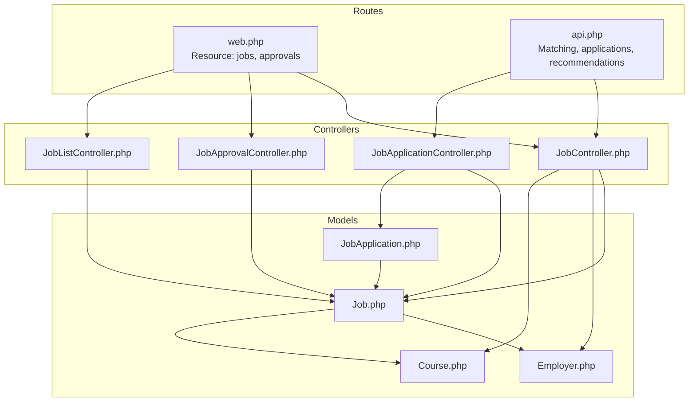
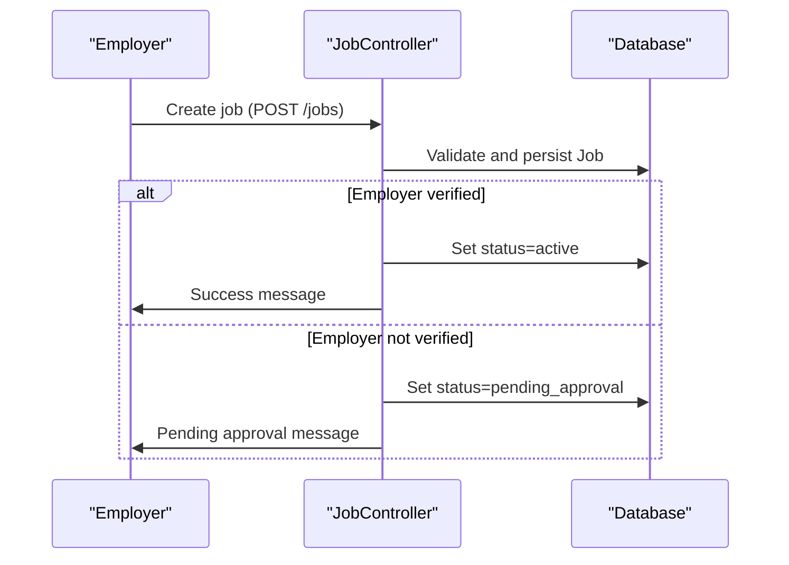
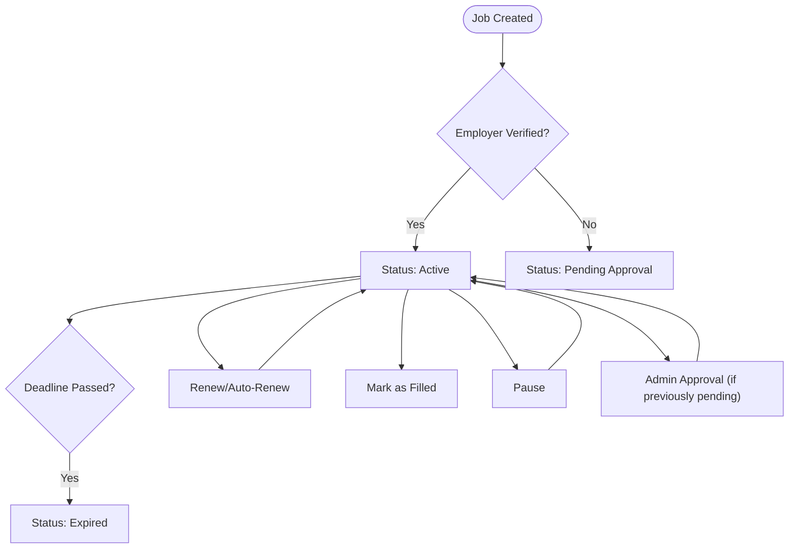
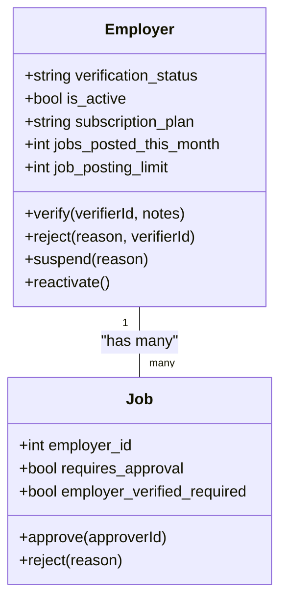
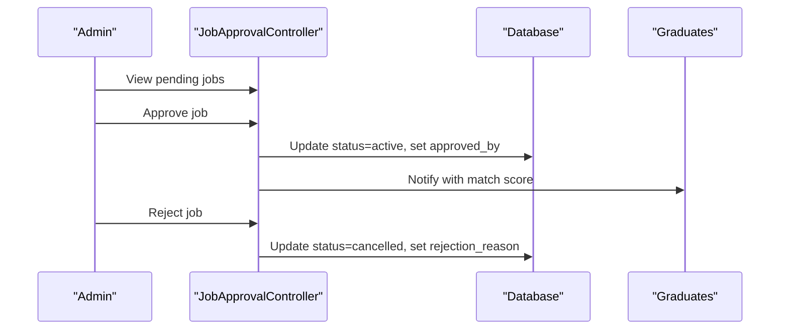
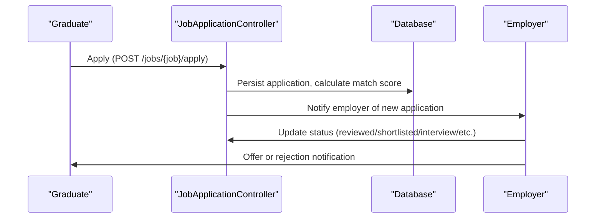
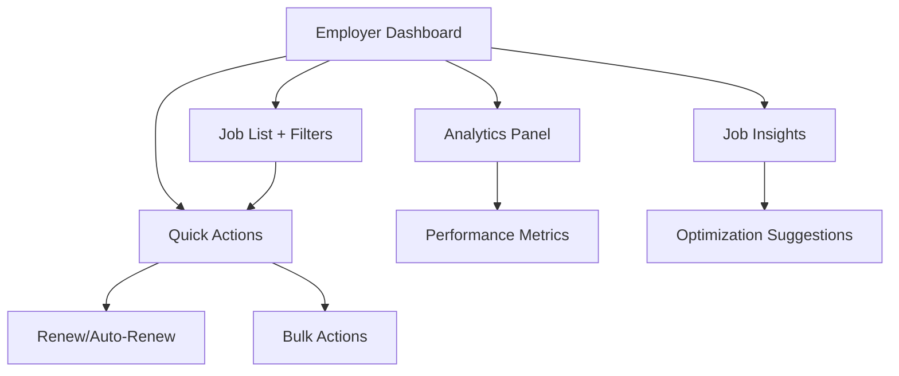
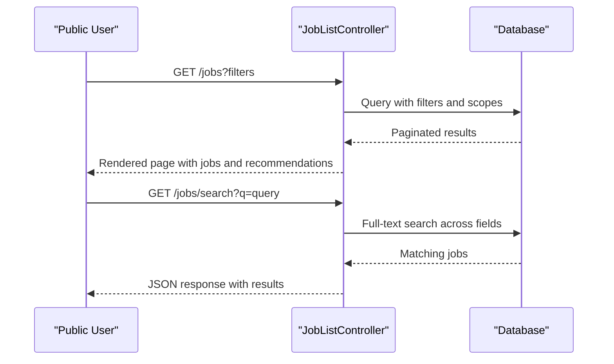
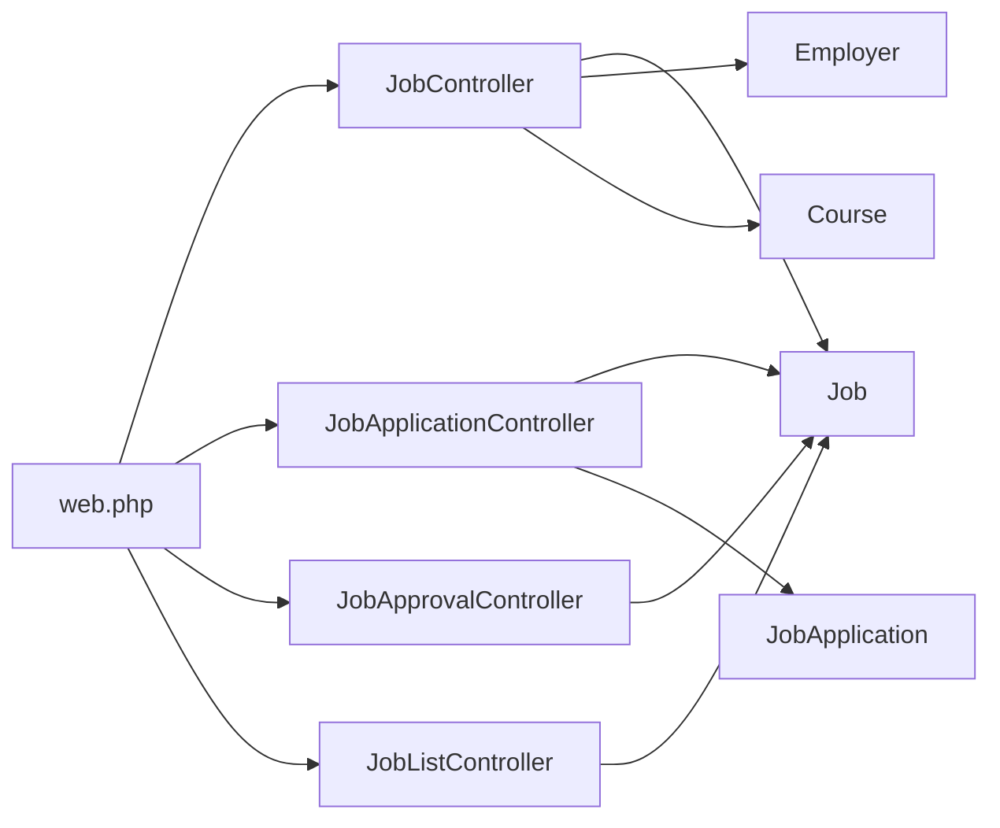

# Job Posting & Management

<cite>
**Referenced Files in This Document**
- [task-08-job-posting-management-recap.md](file://docs/task-08-job-posting-management-recap.md)
- [JobController.php](file://app/Http/Controllers/JobController.php)
- [JobApplicationController.php](file://app/Http/Controllers/JobApplicationController.php)
- [JobApprovalController.php](file://app/Http/Controllers/JobApprovalController.php)
- [JobListController.php](file://app/Http/Controllers/JobListController.php)
- [Job.php](file://app/Models/Job.php)
- [JobApplication.php](file://app/Models/JobApplication.php)
- [Employer.php](file://app/Models/Employer.php)
- [Course.php](file://app/Models/Course.php)
- [api.php](file://routes/api.php)
- [web.php](file://routes/web.php)
</cite>

## Table of Contents
1. [Introduction](#introduction)
2. [Project Structure](#project-structure)
3. [Core Components](#core-components)
4. [Architecture Overview](#architecture-overview)
5. [Detailed Component Analysis](#detailed-component-analysis)
6. [Dependency Analysis](#dependency-analysis)
7. [Performance Considerations](#performance-considerations)
8. [Troubleshooting Guide](#troubleshooting-guide)
9. [Conclusion](#conclusion)

## Introduction
This document describes the complete job posting and management system, covering the full lifecycle from creation to closure. It explains employer verification and company validation, job posting features, approval workflows, status management, dashboards for employers and graduates, and search/filtering capabilities. Practical workflows and interfaces are included to guide implementation and usage.

## Project Structure
The job system spans controllers, models, routes, and supporting services:
- Controllers handle employer job management, application handling, approvals, and public job browsing.
- Models define job, application, employer, and course entities with relationships and computed attributes.
- Routes expose both web and API endpoints for job operations and matching.
- Supporting services and commands underpin background processing and search optimization.

**Diagram sources**
- [web.php:200-223](file://routes/web.php#L200-L223)
- [api.php:220-231](file://routes/api.php#L220-L231)
- [JobController.php:11-780](file://app/Http/Controllers/JobController.php#L11-L780)
- [JobApplicationController.php:14-497](file://app/Http/Controllers/JobApplicationController.php#L14-L497)
- [JobApprovalController.php:9-164](file://app/Http/Controllers/JobApprovalController.php#L9-L164)
- [JobListController.php:12-321](file://app/Http/Controllers/JobListController.php#L12-L321)
- [Job.php:9-573](file://app/Models/Job.php#L9-L573)
- [JobApplication.php:9-162](file://app/Models/JobApplication.php#L9-L162)
- [Employer.php:9-397](file://app/Models/Employer.php#L9-L397)
- [Course.php:9-200](file://app/Models/Course.php#L9-L200)

**Section sources**
- [web.php:200-223](file://routes/web.php#L200-L223)
- [api.php:220-231](file://routes/api.php#L220-L231)

## Core Components
- Job entity: rich posting model with status, deadlines, salary, skills, and computed metrics.
- JobApplication entity: manages candidate applications, statuses, interviews, offers, and documents.
- Employer entity: verification pipeline, permissions, and job posting limits.
- Course entity: program context linking jobs to educational backgrounds.
- Controllers: job lifecycle, approvals, applications, and public job board.
- Routes: web resource endpoints and API endpoints for matching and applications.

**Section sources**
- [Job.php:13-70](file://app/Models/Job.php#L13-L70)
- [JobApplication.php:13-37](file://app/Models/JobApplication.php#L13-L37)
- [Employer.php:13-94](file://app/Models/Employer.php#L13-L94)
- [Course.php:13-52](file://app/Models/Course.php#L13-L52)
- [JobController.php:94-149](file://app/Http/Controllers/JobController.php#L94-L149)
- [JobApplicationController.php:183-252](file://app/Http/Controllers/JobApplicationController.php#L183-L252)
- [JobApprovalController.php:71-116](file://app/Http/Controllers/JobApprovalController.php#L71-L116)
- [JobListController.php:14-183](file://app/Http/Controllers/JobListController.php#L14-L183)

## Architecture Overview
The system separates employer-facing management, candidate-facing application, and public job discovery. Employers create and manage jobs; applications are handled via dedicated controllers; approvals are admin-only; public browsing supports search and filters.

**Diagram sources**
- [JobController.php:94-149](file://app/Http/Controllers/JobController.php#L94-L149)
- [Job.php:218-233](file://app/Models/Job.php#L218-L233)

**Section sources**
- [JobController.php:94-149](file://app/Http/Controllers/JobController.php#L94-L149)
- [Job.php:218-233](file://app/Models/Job.php#L218-L233)

## Detailed Component Analysis

### Job Lifecycle and Status Management
- Creation: Employers submit jobs with required fields and optional skills/qualifications. If the employer is not yet verified, the job enters a pending approval state.
- Status transitions: pause/resume, mark filled, expire on deadline, renew/auto-renew, bulk actions.
- Deadlines and expiry: automatic expiration and renewal workflows.
- Recommendations: send matching graduates notifications and compute match scores.

**Diagram sources**
- [JobController.php:129-149](file://app/Http/Controllers/JobController.php#L129-L149)
- [Job.php:218-248](file://app/Models/Job.php#L218-L248)
- [Job.php:355-379](file://app/Models/Job.php#L355-L379)

**Section sources**
- [JobController.php:235-275](file://app/Http/Controllers/JobController.php#L235-L275)
- [Job.php:355-379](file://app/Models/Job.php#L355-L379)

### Employer Verification and Company Validation
- Verification pipeline: verification status tracked per employer; verified employers can post without approval; otherwise jobs are held pending.
- Permissions: job posting eligibility depends on verification, subscription plan, and monthly limits.
- Approver identity: approvals record who approved and when.

**Diagram sources**
- [Employer.php:134-193](file://app/Models/Employer.php#L134-L193)
- [Employer.php:239-291](file://app/Models/Employer.php#L239-L291)
- [Job.php:218-233](file://app/Models/Job.php#L218-L233)

**Section sources**
- [Employer.php:134-193](file://app/Models/Employer.php#L134-L193)
- [Job.php:129-136](file://app/Models/Job.php#L129-L136)

### Job Posting Features and Required Fields
- Required fields validated during creation/update: title, description, location, course_id, experience level, salary range/type, job type, work arrangement, and contact info.
- Optional fields: skills, preferred qualifications, benefits, company culture, and application deadline.
- Course linkage: jobs are associated with academic programs to enable targeted recommendations.

**Section sources**
- [JobController.php:102-127](file://app/Http/Controllers/JobController.php#L102-L127)
- [JobController.php:195-220](file://app/Http/Controllers/JobController.php#L195-L220)
- [Job.php:13-49](file://app/Models/Job.php#L13-L49)

### Job Approval and Moderation Workflow
- Admin queue displays jobs awaiting approval.
- Review interface allows approve/reject with notes/reason.
- Bulk operations support mass approval/rejection.
- Approved jobs are sent to matching graduates.

**Diagram sources**
- [JobApprovalController.php:11-44](file://app/Http/Controllers/JobApprovalController.php#L11-L44)
- [JobApprovalController.php:71-116](file://app/Http/Controllers/JobApprovalController.php#L71-L116)
- [Job.php:315-337](file://app/Models/Job.php#L315-L337)

**Section sources**
- [JobApprovalController.php:71-116](file://app/Http/Controllers/JobApprovalController.php#L71-L116)
- [Job.php:315-337](file://app/Models/Job.php#L315-L337)

### Application Lifecycle Management
- Application submission: cover letter required, optional resume and additional documents.
- Status workflow: pending, reviewed, shortlisted, interview stages, offer, hired, rejected, withdrawn.
- Interview scheduling, offer management, and communication notifications.
- Bulk actions for mass status updates and flags.

**Diagram sources**
- [JobApplicationController.php:183-252](file://app/Http/Controllers/JobApplicationController.php#L183-L252)
- [JobApplicationController.php:254-270](file://app/Http/Controllers/JobApplicationController.php#L254-L270)
- [JobApplicationController.php:294-314](file://app/Http/Controllers/JobApplicationController.php#L294-L314)

**Section sources**
- [JobApplicationController.php:183-252](file://app/Http/Controllers/JobApplicationController.php#L183-L252)
- [JobApplicationController.php:254-314](file://app/Http/Controllers/JobApplicationController.php#L254-L314)

### Employer Job Dashboard
- Job listing with filters (status, search, course, experience, dates).
- Analytics: totals, active/expired/pending counts, expiring soon, top performing job.
- Job actions: pause/resume/mark filled, extend deadline, renew, duplicate, auto-renew, recommendations, bulk actions.
- Insights: skills demand, competitor analysis, optimization suggestions.

**Diagram sources**
- [JobController.php:13-83](file://app/Http/Controllers/JobController.php#L13-L83)
- [JobController.php:277-358](file://app/Http/Controllers/JobController.php#L277-L358)
- [JobController.php:508-526](file://app/Http/Controllers/JobController.php#L508-L526)
- [JobController.php:573-617](file://app/Http/Controllers/JobController.php#L573-L617)

**Section sources**
- [JobController.php:13-83](file://app/Http/Controllers/JobController.php#L13-L83)
- [JobController.php:277-358](file://app/Http/Controllers/JobController.php#L277-L358)

### Public Job Board and Search
- Public browsing with advanced filters: location, course, experience, job type, work arrangement, salary range, skills, benefits, industry, posted within.
- Sorting by relevance, salary, deadline, or creation date.
- Search endpoint supports full-text matching across titles, descriptions, skills, employer/company, and course.
- Recommendations for authenticated graduates based on match scoring.

**Diagram sources**
- [JobListController.php:14-183](file://app/Http/Controllers/JobListController.php#L14-L183)
- [JobListController.php:289-319](file://app/Http/Controllers/JobListController.php#L289-L319)

**Section sources**
- [JobListController.php:14-183](file://app/Http/Controllers/JobListController.php#L14-L183)
- [JobListController.php:289-319](file://app/Http/Controllers/JobListController.php#L289-L319)

### Job Matching, Filtering, and Search Optimization
- Match scoring considers course alignment, skills overlap, profile completion, and GPA.
- Filtering leverages JSON fields for skills and benefits, and scopes for locations and experience.
- Sorting supports dynamic relevance computation for authenticated graduates.

**Section sources**
- [Job.php:277-313](file://app/Models/Job.php#L277-L313)
- [JobListController.php:66-82](file://app/Http/Controllers/JobListController.php#L66-L82)
- [JobListController.php:108-129](file://app/Http/Controllers/JobListController.php#L108-L129)

### Practical Examples

#### Example: Employer creates a job
- Steps: authenticate as employer → navigate to create job → fill required fields → submit → observe status (active or pending approval) → receive notifications to matching graduates if approved.

**Section sources**
- [JobController.php:85-92](file://app/Http/Controllers/JobController.php#L85-L92)
- [JobController.php:94-149](file://app/Http/Controllers/JobController.php#L94-L149)

#### Example: Graduate applies to a job
- Steps: browse public jobs → view job details → click apply → upload cover letter and optional documents → submit → track application status via dashboard.

**Section sources**
- [JobListController.php:185-221](file://app/Http/Controllers/JobListController.php#L185-L221)
- [JobApplicationController.php:183-252](file://app/Http/Controllers/JobApplicationController.php#L183-L252)

#### Example: Admin approves a job
- Steps: log in as admin → open approval queue → review job → approve → job becomes active and is sent to matching graduates.

**Section sources**
- [JobApprovalController.php:11-44](file://app/Http/Controllers/JobApprovalController.php#L11-L44)
- [JobApprovalController.php:71-95](file://app/Http/Controllers/JobApprovalController.php#L71-L95)

## Dependency Analysis
- Controllers depend on models for persistence and computed metrics.
- Job model encapsulates business logic for status, deadlines, match scoring, and recommendations.
- Employer model governs verification and posting permissions.
- Routes connect web and API endpoints to controllers.

**Diagram sources**
- [web.php:200-223](file://routes/web.php#L200-L223)
- [api.php:220-231](file://routes/api.php#L220-L231)
- [JobController.php:11-780](file://app/Http/Controllers/JobController.php#L11-L780)
- [JobApplicationController.php:14-497](file://app/Http/Controllers/JobApplicationController.php#L14-L497)
- [JobApprovalController.php:9-164](file://app/Http/Controllers/JobApprovalController.php#L9-L164)
- [JobListController.php:12-321](file://app/Http/Controllers/JobListController.php#L12-L321)
- [Job.php:9-573](file://app/Models/Job.php#L9-L573)
- [JobApplication.php:9-162](file://app/Models/JobApplication.php#L9-L162)
- [Employer.php:9-397](file://app/Models/Employer.php#L9-L397)
- [Course.php:9-200](file://app/Models/Course.php#L9-L200)

**Section sources**
- [web.php:200-223](file://routes/web.php#L200-L223)
- [api.php:220-231](file://routes/api.php#L220-L231)

## Performance Considerations
- Database optimization: scopes and indexed JSON fields for skills and benefits; pagination for large lists.
- Background processing: sending recommendations to graduates via queued jobs.
- Caching and CDN: offload static assets; consider caching frequent queries.
- Lazy loading and image optimization: improve front-end responsiveness.

[No sources needed since this section provides general guidance]

## Troubleshooting Guide
- Job not appearing after creation: verify employer verification status and approval workflow.
- Applications not received: confirm resume/document uploads and notification delivery.
- Search not returning results: ensure filters and full-text search parameters are correct.
- Expiration issues: check deadline logic and scheduled renewals.

**Section sources**
- [Job.php:355-364](file://app/Models/Job.php#L355-L364)
- [JobApplicationController.php:214-238](file://app/Http/Controllers/JobApplicationController.php#L214-L238)

## Conclusion
The job posting and management system provides a robust, scalable solution for employers and graduates. It integrates employer verification, approval workflows, comprehensive dashboards, and intelligent matching to streamline recruitment and job discovery. The documented components and flows serve as a blueprint for implementation and maintenance.