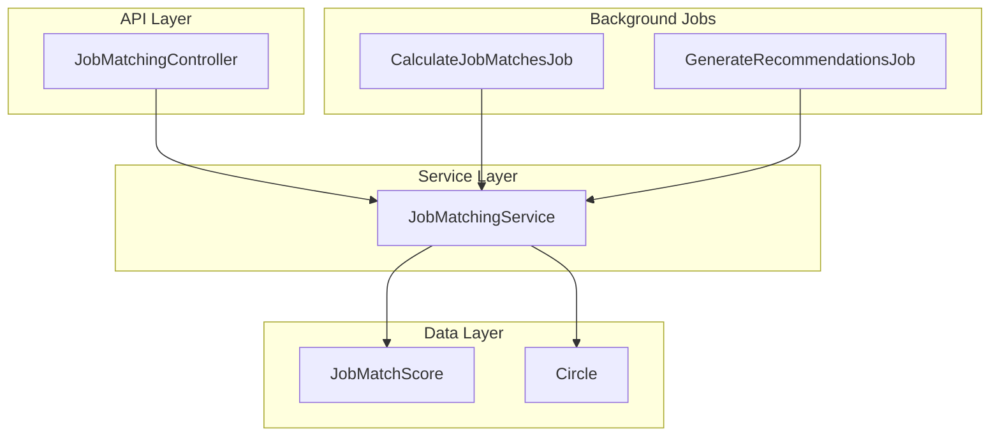
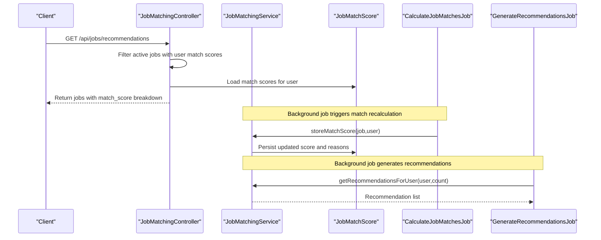
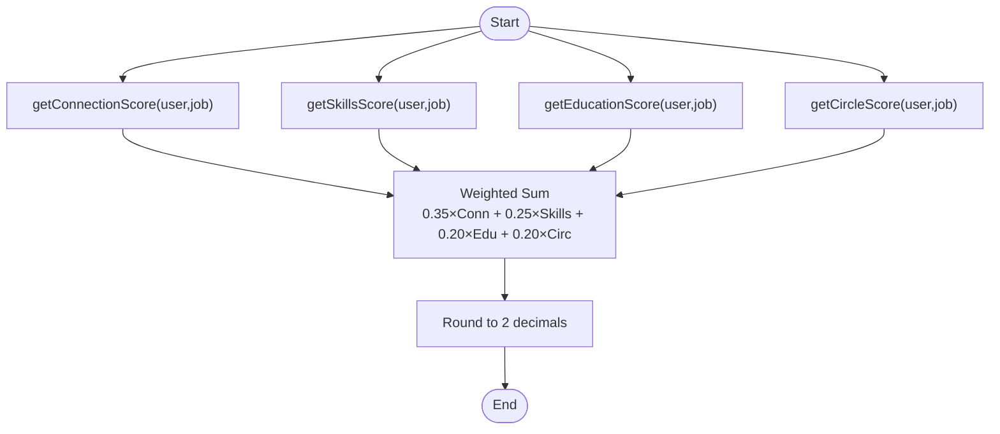
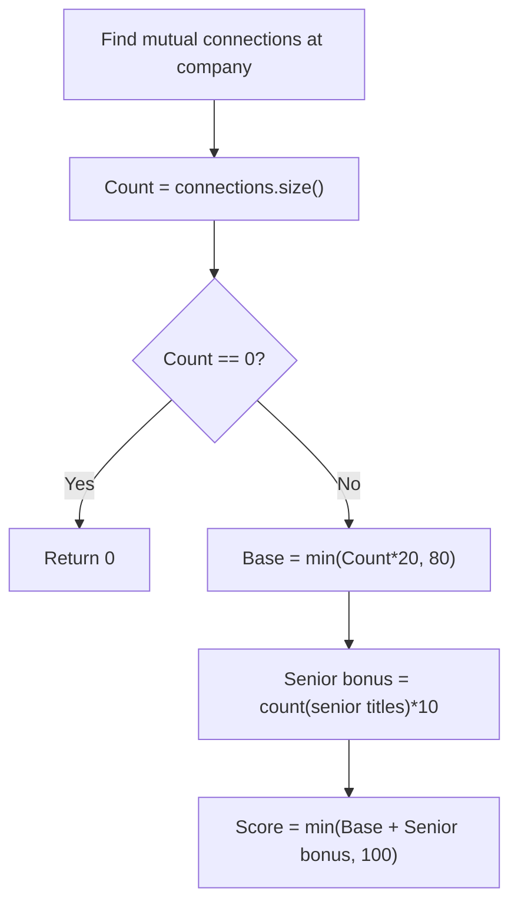
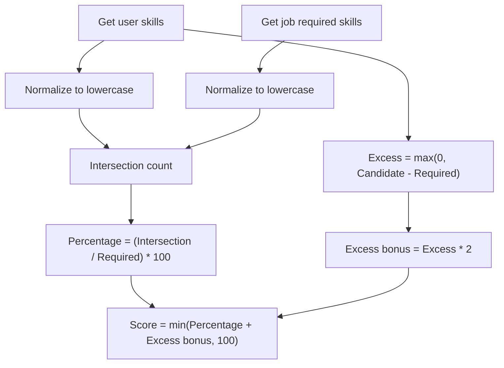
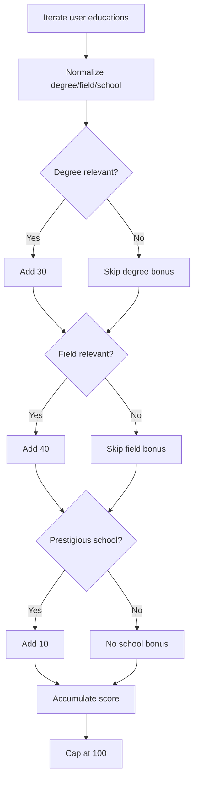
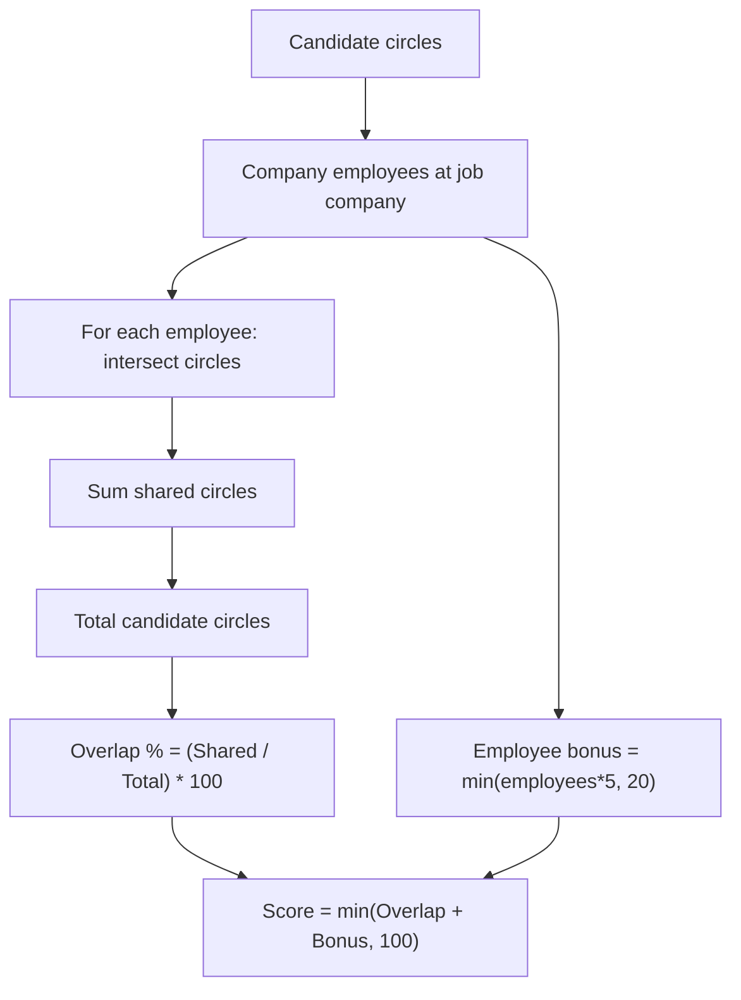
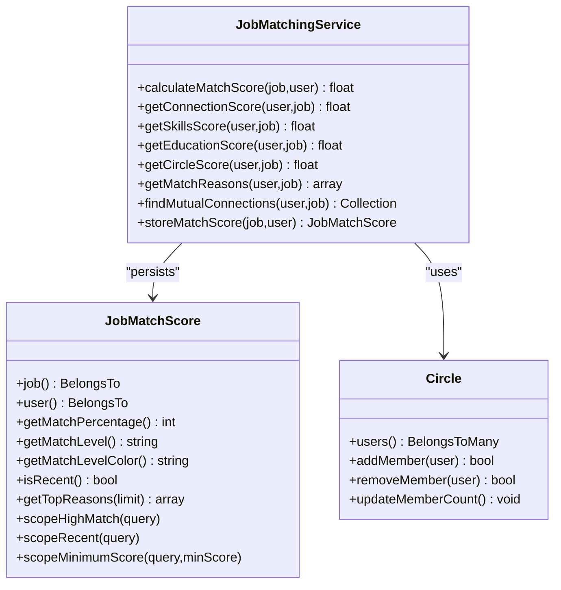

# Smart Matching Algorithms

<cite>
**Referenced Files in This Document**
- [JobMatchingService.php](file://app/Services/JobMatchingService.php)
- [CalculateJobMatchesJob.php](file://app/Jobs/CalculateJobMatchesJob.php)
- [GenerateRecommendationsJob.php](file://app/Jobs/GenerateRecommendationsJob.php)
- [JobMatchingController.php](file://app/Http/Controllers/Api/JobMatchingController.php)
- [JobMatchScore.php](file://app/Models/JobMatchScore.php)
- [Circle.php](file://app/Models/Circle.php)
- [JobMatchingServiceTest.php](file://tests/Unit/JobMatchingServiceTest.php)
- [JobMatchingTest.php](file://tests/Feature/JobMatchingTest.php)
</cite>

## Table of Contents
1. [Introduction](#introduction)
2. [Project Structure](#project-structure)
3. [Core Components](#core-components)
4. [Architecture Overview](#architecture-overview)
5. [Detailed Component Analysis](#detailed-component-analysis)
6. [Dependency Analysis](#dependency-analysis)
7. [Performance Considerations](#performance-considerations)
8. [Troubleshooting Guide](#troubleshooting-guide)
9. [Conclusion](#conclusion)

## Introduction
This document explains the smart matching algorithms that power job recommendations in the platform. The system combines four weighted scoring factors—network connections (35%), skills alignment (25%), education relevance (20%), and shared circles/community overlap (20%)—to compute personalized match scores for job candidates. It covers the mathematical formulations, implementation details, performance optimizations, and practical examples of match calculations.

## Project Structure
The matching system spans several layers:
- Service layer: core matching logic and scoring
- Background jobs: batch processing for match calculations and recommendations
- API controllers: expose recommendations and match details to clients
- Data models: persist match scores and relationships
- Tests: validate scoring correctness and edge cases

**Diagram sources**
- [JobMatchingController.php:26-96](file://app/Http/Controllers/Api/JobMatchingController.php#L26-L96)
- [JobMatchingService.php:26-41](file://app/Services/JobMatchingService.php#L26-L41)
- [CalculateJobMatchesJob.php:35-58](file://app/Jobs/CalculateJobMatchesJob.php#L35-L58)
- [GenerateRecommendationsJob.php:38-56](file://app/Jobs/GenerateRecommendationsJob.php#L38-L56)
- [JobMatchScore.php:13-35](file://app/Models/JobMatchScore.php#L13-L35)
- [Circle.php:14-26](file://app/Models/Circle.php#L14-L26)

**Section sources**
- [JobMatchingService.php:12-41](file://app/Services/JobMatchingService.php#L12-L41)
- [JobMatchingController.php:16-21](file://app/Http/Controllers/Api/JobMatchingController.php#L16-L21)
- [CalculateJobMatchesJob.php:15-30](file://app/Jobs/CalculateJobMatchesJob.php#L15-L30)
- [GenerateRecommendationsJob.php:14-33](file://app/Jobs/GenerateRecommendationsJob.php#L14-L33)

## Core Components
The matching system centers around a weighted composite score calculated from four dimensions:

- Connections (35%): Mutual connections at the target company, with bonuses for senior roles
- Skills (25%): Intersection of required and candidate skills, plus excess qualification bonus
- Education (20%): Degree relevance, field-of-study correlation, and prestigious school bonus
- Circles (20%): Shared alumni/network circles with company employees

Each dimension produces a normalized score (0–100), which are combined into a final composite score.

**Section sources**
- [JobMatchingService.php:14-21](file://app/Services/JobMatchingService.php#L14-L21)
- [JobMatchingService.php:26-41](file://app/Services/JobMatchingService.php#L26-L41)

## Architecture Overview
The recommendation pipeline integrates real-time and batch processing:

- Real-time match calculation: triggered when a job or user profile changes
- Batch match calculation: periodic recomputation for all users/jobs
- Recommendation generation: background job to precompute user-specific recommendations
- API exposure: endpoints to retrieve recommendations, job details, and mutual connections

**Diagram sources**
- [JobMatchingController.php:26-96](file://app/Http/Controllers/Api/JobMatchingController.php#L26-L96)
- [JobMatchingService.php:258-280](file://app/Services/JobMatchingService.php#L258-L280)
- [CalculateJobMatchesJob.php:35-58](file://app/Jobs/CalculateJobMatchesJob.php#L35-L58)
- [GenerateRecommendationsJob.php:38-56](file://app/Jobs/GenerateRecommendationsJob.php#L38-L56)

## Detailed Component Analysis

### Weighted Composite Scoring
The final match score is a weighted sum of the four dimensions:

- Final Score = (Connections × 0.35) + (Skills × 0.25) + (Education × 0.20) + (Circles × 0.20)
- Rounded to two decimal places

**Diagram sources**
- [JobMatchingService.php:26-41](file://app/Services/JobMatchingService.php#L26-L41)

**Section sources**
- [JobMatchingService.php:14-21](file://app/Services/JobMatchingService.php#L14-L21)
- [JobMatchingService.php:26-41](file://app/Services/JobMatchingService.php#L26-L41)

### Connection Scoring (35% weight)
Measures the strength of personal network ties to the target company.

- Base score: count of mutual connections at the company
- Diminishing returns: base score caps at 80 for large connection counts
- Seniority bonus: +10 per mutual connection whose title indicates senior role
- Formula:
  - Base = min(connectionCount × 20, 80)
  - Senior bonus = count(senior connections) × 10
  - Connection score = min(Base + Senior bonus, 100)

**Diagram sources**
- [JobMatchingService.php:46-64](file://app/Services/JobMatchingService.php#L46-L64)
- [JobMatchingService.php:238-253](file://app/Services/JobMatchingService.php#L238-L253)
- [JobMatchingService.php:355-360](file://app/Services/JobMatchingService.php#L355-L360)

**Section sources**
- [JobMatchingServiceTest.php:47-90](file://tests/Unit/JobMatchingServiceTest.php#L47-L90)
- [JobMatchingService.php:46-64](file://app/Services/JobMatchingService.php#L46-L64)

### Skills Matching (25% weight)
Computes alignment between required and candidate skills.

- Normalize both lists to lowercase
- Intersection: matching skills count
- Percentage: (matching / required) × 100
- Excess bonus: max(0, (candidate - required)) × 2
- Formula:
  - Skills score = min(Percentage + Excess bonus, 100)

**Diagram sources**
- [JobMatchingService.php:69-88](file://app/Services/JobMatchingService.php#L69-L88)

**Section sources**
- [JobMatchingServiceTest.php:92-124](file://tests/Unit/JobMatchingServiceTest.php#L92-L124)
- [JobMatchingService.php:69-88](file://app/Services/JobMatchingService.php#L69-L88)

### Education Relevance (20% weight)
Evaluates how well a candidate’s academic background aligns with the job.

- For each education record:
  - Degree relevance: checks if degree matches tech/business categories and job title/description
  - Field relevance: word overlap between degree field and job title/description
  - Prestigious school bonus: if school name contains keywords like Harvard, MIT, etc.
- Accumulated score per education, capped at 100

**Diagram sources**
- [JobMatchingService.php:93-127](file://app/Services/JobMatchingService.php#L93-L127)
- [JobMatchingService.php:309-350](file://app/Services/JobMatchingService.php#L309-L350)

**Section sources**
- [JobMatchingServiceTest.php:126-148](file://tests/Unit/JobMatchingServiceTest.php#L126-L148)
- [JobMatchingService.php:93-127](file://app/Services/JobMatchingService.php#L93-L127)

### Circle-Based Matching (20% weight)
Captures shared community ties (e.g., alumni networks) between the candidate and company employees.

- Candidate circles: user->circles ids
- Company employees: users with current career timeline at the company
- For each employee: intersect candidate circles with employee circles
- Overlap percentage: (sum of shared circles / total candidate circles) × 100
- Employee bonus: min(employeeCount × 5, 20)
- Formula:
  - Circle score = min(Overlap percentage + Employee bonus, 100)

**Diagram sources**
- [JobMatchingService.php:132-170](file://app/Services/JobMatchingService.php#L132-L170)
- [Circle.php:31-36](file://app/Models/Circle.php#L31-L36)

**Section sources**
- [JobMatchingServiceTest.php:150-180](file://tests/Unit/JobMatchingServiceTest.php#L150-L180)
- [JobMatchingService.php:132-170](file://app/Services/JobMatchingService.php#L132-L170)

### Match Reasons and Explanations
The system provides detailed reasons for each match, sorted by impact:

- Connections: number of mutual connections at the company
- Skills: number of matching skills
- Education: educational background relevance
- Circles: shared circles with company employees

These reasons are persisted alongside the match score for transparency.

**Section sources**
- [JobMatchingService.php:175-233](file://app/Services/JobMatchingService.php#L175-L233)
- [JobMatchingService.php:258-280](file://app/Services/JobMatchingService.php#L258-L280)

### API Exposure and Recommendations
The controller exposes:
- GET /api/jobs/recommendations: paginated jobs filtered by minimum match score and optional filters
- GET /api/jobs/{id}: detailed job view with match analysis and mutual connections
- GET /api/jobs/{id}/connections: mutual connections at the company
- POST /api/jobs/{id}/apply: submit application with optional introduction request
- POST /api/jobs/introductions/request: request an introduction through a mutual connection

Filters include minimum score, location, and remote-only options.

**Section sources**
- [JobMatchingController.php:26-96](file://app/Http/Controllers/Api/JobMatchingController.php#L26-L96)
- [JobMatchingController.php:101-185](file://app/Http/Controllers/Api/JobMatchingController.php#L101-L185)
- [JobMatchingController.php:338-366](file://app/Http/Controllers/Api/JobMatchingController.php#L338-L366)

### Background Jobs and Batch Processing
- CalculateJobMatchesJob: recalculates matches for specific job/user, all users for a job, or all jobs for a user, with batching to manage memory and performance
- GenerateRecommendationsJob: precomputes recommendations for users, with bulk generation support

Both jobs include retry logic, timeouts, and detailed logging.

**Section sources**
- [CalculateJobMatchesJob.php:35-210](file://app/Jobs/CalculateJobMatchesJob.php#L35-L210)
- [GenerateRecommendationsJob.php:38-136](file://app/Jobs/GenerateRecommendationsJob.php#L38-L136)

## Dependency Analysis
The matching system depends on:
- JobMatchingService for scoring logic
- JobMatchScore model for persistence and metadata
- Circle model for shared community relationships
- Background jobs for batch processing
- API controllers for client-facing endpoints

**Diagram sources**
- [JobMatchingService.php:26-280](file://app/Services/JobMatchingService.php#L26-L280)
- [JobMatchScore.php:46-145](file://app/Models/JobMatchScore.php#L46-L145)
- [Circle.php:31-96](file://app/Models/Circle.php#L31-L96)

**Section sources**
- [JobMatchingService.php:5-10](file://app/Services/JobMatchingService.php#L5-L10)
- [JobMatchScore.php:13-35](file://app/Models/JobMatchScore.php#L13-L35)
- [Circle.php:14-26](file://app/Models/Circle.php#L14-L26)

## Performance Considerations
- Batching: jobs process users and jobs in chunks to limit memory usage
- Indexing: queries leverage whereHas and chunking to avoid loading entire datasets
- Caching: recommendation caches are cleared and refreshed during generation
- Diminishing returns: connection and circle scores cap at 100 to prevent extreme outliers
- Database optimization: eager loading of related data (e.g., company, postedBy) reduces N+1 queries

**Section sources**
- [CalculateJobMatchesJob.php:108-132](file://app/Jobs/CalculateJobMatchesJob.php#L108-L132)
- [CalculateJobMatchesJob.php:149-173](file://app/Jobs/CalculateJobMatchesJob.php#L149-L173)
- [CalculateJobMatchesJob.php:181-210](file://app/Jobs/CalculateJobMatchesJob.php#L181-L210)
- [JobMatchingController.php:34-51](file://app/Http/Controllers/Api/JobMatchingController.php#L34-L51)

## Troubleshooting Guide
Common issues and resolutions:
- No mutual connections: connection score returns 0; verify accepted connections and current employment at the company
- Neutral skills score: occurs when either required or candidate skills are missing; ensure job has skills_required and user profile includes skills
- Low education score: check degree/field relevance heuristics and ensure job title/description contain relevant keywords
- Zero circle score: occurs when user has no circles or no shared circles with company employees; verify circle memberships and company employee records
- Inactive job filtering: recommendations exclude inactive jobs; ensure job status is active

**Section sources**
- [JobMatchingServiceTest.php:281-310](file://tests/Unit/JobMatchingServiceTest.php#L281-L310)
- [JobMatchingTest.php:308-344](file://tests/Feature/JobMatchingTest.php#L308-L344)

## Conclusion
The smart matching system provides a robust, explainable, and scalable foundation for job recommendations. By combining network insights, skills alignment, education relevance, and shared communities, it delivers personalized match scores with transparent reasoning. The modular design, background processing, and performance optimizations enable continuous improvements while maintaining responsiveness.