# Data Isolation and Security

<cite>
**Referenced Files in This Document**
- [config/tenancy.php](file://config/tenancy.php)
- [app/Providers/TenancyServiceProvider.php](file://app/Providers/TenancyServiceProvider.php)
- [app/Models/Tenant.php](file://app/Models/Tenant.php)
- [app/Models/Domain.php](file://app/Models/Domain.php)
- [config/security.php](file://config/security.php)
- [app/Services/SecurityService.php](file://app/Services/SecurityService.php)
- [app/Services/SecurityAuditService.php](file://app/Services/SecurityAuditService.php)
- [scripts/debugging/disable_security_middleware.php](file://scripts/debugging/disable_security_middleware.php)
- [database/migrations/2024_01_01_000001_create_domains_table.php](file://database/migrations/2024_01_01_000001_create_domains_table.php)
- [database/migrations/2025_09_05_080622_create_domains_table.php](file://database/migrations/2025_09_05_080622_create_domains_table.php)
- [database/migrations/2024_01_01_000000_create_tenants_table.php](file://database/migrations/2024_01_01_000000_create_tenants_table.php)
- [database/migrations/tenant/2024_01_01_000003_create_courses_table.php](file://database/migrations/tenant/2024_01_01_000003_create_courses_table.php)
- [database/migrations/tenant/2024_01_01_000004_create_graduates_table.php](file://database/migrations/tenant/2024_01_01_000004_create_graduates_table.php)
- [database/migrations/tenant/2024_01_01_000007_create_graduate_profiles_table.php](file://database/migrations/tenant/2024_01_01_000007_create_graduate_profiles_table.php)
- [database/migrations/tenant/2025_01_29_000003_create_posts_table.php](file://database/migrations/tenant/2025_01_29_000003_create_posts_table.php)
- [database/migrations/tenant/2025_01_29_000004_create_circles_and_groups_tables.php](file://database/migrations/tenant/2025_01_29_000004_create_circles_and_groups_tables.php)
- [database/migrations/tenant/2025_01_30_000001_create_performance_monitoring_tables.php](file://database/migrations/tenant/2025_01_30_000001_create_performance_monitoring_tables.php)
- [database/migrations/2025_09_04_074200_add_tenant_isolation_to_analytics_events_table.php](file://database/migrations/2025_09_04_074200_add_tenant_isolation_to_analytics_events_table.php)
- [database/migrations/2025_09_04_074201_add_tenant_isolation_to_landing_page_analytics_table.php](file://database/migrations/2025_09_04_074201_add_tenant_isolation_to_landing_page_analytics_table.php)
- [database/migrations/2025_09_05_101322_add_tenant_isolation_to_notifications_tables.php](file://database/migrations/2025_09_05_101322_add_tenant_isolation_to_notifications_tables.php)
- [tests/Integration/TenantIsolationVerificationTest.php](file://tests/Integration/TenantIsolationVerificationTest.php)
</cite>

## Table of Contents
1. [Introduction](#introduction)
2. [Project Structure](#project-structure)
3. [Core Components](#core-components)
4. [Architecture Overview](#architecture-overview)
5. [Detailed Component Analysis](#detailed-component-analysis)
6. [Dependency Analysis](#dependency-analysis)
7. [Performance Considerations](#performance-considerations)
8. [Troubleshooting Guide](#troubleshooting-guide)
9. [Conclusion](#conclusion)
10. [Appendices](#appendices)

## Introduction
This document explains how the platform enforces data isolation and security across tenants. It covers database-level tenant scoping, automatic tenant context initialization, middleware-based tenant resolution from domains and subdomains, session isolation, cache and Redis namespace separation, file storage isolation, schema-level tenant isolation, and tenant-specific resource management. It also documents security controls for preventing unauthorized access, audit logging, compliance monitoring, performance optimizations, and security testing methodologies.

## Project Structure
The isolation and security mechanisms are implemented across configuration, models, services, migrations, and tests:
- Configuration defines tenant bootstrappers and resource namespaces (database, cache, filesystem, Redis).
- Models define tenant and domain relationships and lifecycle hooks.
- Services implement security policies, session validation, rate limiting, and audit/compliance reporting.
- Migrations add tenant scoping to tenant-specific tables and notifications/analytics tables.
- Tests verify tenant isolation across queries and filters.

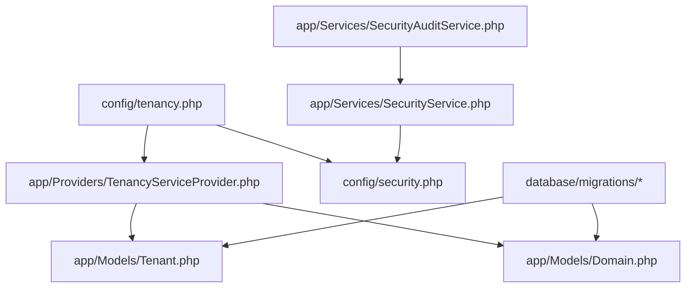

**Diagram sources**
- [config/tenancy.php:12-82](file://config/tenancy.php#L12-L82)
- [app/Providers/TenancyServiceProvider.php:24-40](file://app/Providers/TenancyServiceProvider.php#L24-L40)
- [app/Models/Tenant.php:11-85](file://app/Models/Tenant.php#L11-L85)
- [app/Models/Domain.php:12-58](file://app/Models/Domain.php#L12-L58)
- [config/security.php:1-76](file://config/security.php#L1-L76)
- [app/Services/SecurityService.php:19-526](file://app/Services/SecurityService.php#L19-L526)
- [app/Services/SecurityAuditService.php:7-347](file://app/Services/SecurityAuditService.php#L7-L347)
- [database/migrations/2024_01_01_000001_create_domains_table.php:14-34](file://database/migrations/2024_01_01_000001_create_domains_table.php#L14-L34)

**Section sources**
- [config/tenancy.php:12-82](file://config/tenancy.php#L12-L82)
- [app/Providers/TenancyServiceProvider.php:24-40](file://app/Providers/TenancyServiceProvider.php#L24-L40)
- [app/Models/Tenant.php:11-85](file://app/Models/Tenant.php#L11-L85)
- [app/Models/Domain.php:12-58](file://app/Models/Domain.php#L12-L58)
- [config/security.php:1-76](file://config/security.php#L1-L76)
- [app/Services/SecurityService.php:19-526](file://app/Services/SecurityService.php#L19-L526)
- [app/Services/SecurityAuditService.php:7-347](file://app/Services/SecurityAuditService.php#L7-L347)
- [database/migrations/2024_01_01_000001_create_domains_table.php:14-34](file://database/migrations/2024_01_01_000001_create_domains_table.php#L14-L34)

## Core Components
- Tenant configuration and bootstrappers: Defines database, cache, filesystem, and Redis isolation strategies and migration/seeding parameters.
- Tenant and Domain models: Encapsulate tenant identity, domain-to-tenant mapping, and domain lifecycle events.
- Security service: Implements 2FA, login security, rate limiting, session validation, malicious request detection, and security event logging.
- Audit service: Provides compliance checks, privacy violation scanning, and vulnerability scan outcomes.
- Database migrations: Add tenant scoping to tenant-specific tables and shared analytics/notifications tables.

**Section sources**
- [config/tenancy.php:21-82](file://config/tenancy.php#L21-L82)
- [app/Models/Tenant.php:11-85](file://app/Models/Tenant.php#L11-L85)
- [app/Models/Domain.php:12-58](file://app/Models/Domain.php#L12-L58)
- [app/Services/SecurityService.php:19-526](file://app/Services/SecurityService.php#L19-L526)
- [app/Services/SecurityAuditService.php:7-347](file://app/Services/SecurityAuditService.php#L7-L347)

## Architecture Overview
The system initializes tenant context via domain resolution and applies isolation across databases, caches, queues, and filesystems. Security controls enforce authentication, authorization, and monitoring.

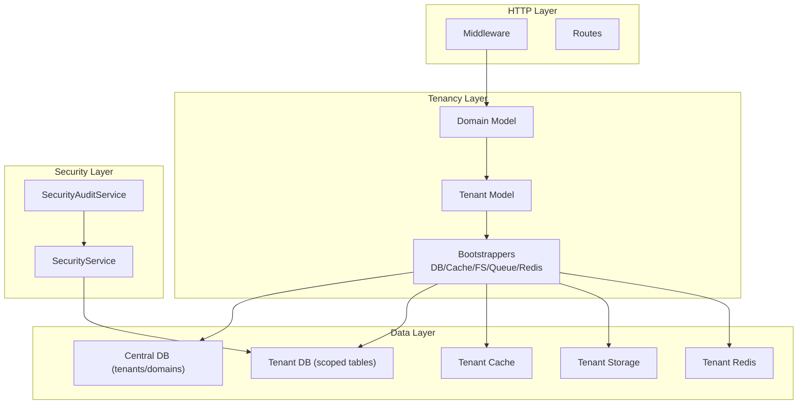

**Diagram sources**
- [config/tenancy.php:21-58](file://config/tenancy.php#L21-L58)
- [app/Models/Domain.php:19-33](file://app/Models/Domain.php#L19-L33)
- [app/Models/Tenant.php:48-84](file://app/Models/Tenant.php#L48-L84)
- [app/Services/SecurityService.php:19-526](file://app/Services/SecurityService.php#L19-L526)
- [app/Services/SecurityAuditService.php:7-347](file://app/Services/SecurityAuditService.php#L7-L347)

## Detailed Component Analysis

### Database-Level Tenant Scoping and Automatic Context Initialization
- Tenant bootstrappers initialize database, cache, filesystem, queue, and Redis namespaces per tenant.
- PostgreSQL schema manager is configured for tenant databases.
- Migration parameters target tenant migrations, ensuring tenant-scoped tables are created under tenant context.
- Domain model enforces uniqueness and lowercases domains and dispatches lifecycle events.

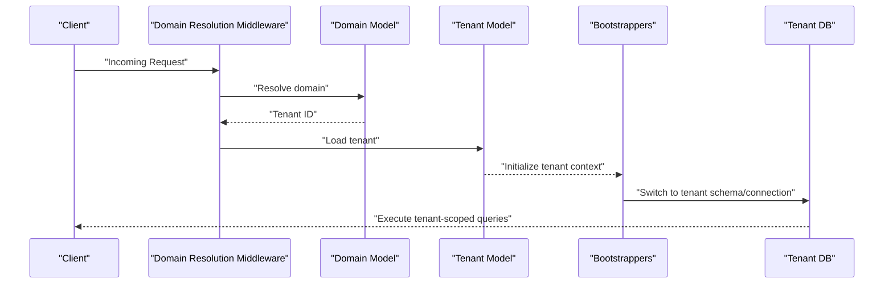

**Diagram sources**
- [config/tenancy.php:21-36](file://config/tenancy.php#L21-L36)
- [app/Models/Domain.php:19-33](file://app/Models/Domain.php#L19-L33)
- [app/Models/Tenant.php:48-84](file://app/Models/Tenant.php#L48-L84)

**Section sources**
- [config/tenancy.php:21-36](file://config/tenancy.php#L21-L36)
- [app/Models/Domain.php:38-57](file://app/Models/Domain.php#L38-L57)
- [database/migrations/2024_01_01_000001_create_domains_table.php:14-23](file://database/migrations/2024_01_01_000001_create_domains_table.php#L14-L23)

### Query Filtering and Tenant-Aware Models
- Tenant model exposes relations scoped to institution and tenant identifiers.
- Tenant-specific tables include courses, graduates, employers, jobs, posts, circles/groups, and performance monitoring tables.
- Shared analytics and notifications tables are migrated to include tenant scoping.

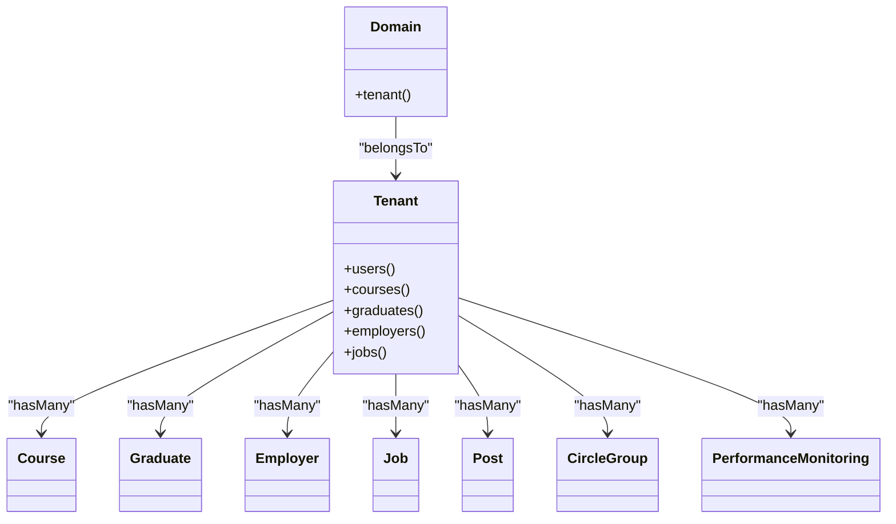

**Diagram sources**
- [app/Models/Tenant.php:48-84](file://app/Models/Tenant.php#L48-L84)
- [app/Models/Domain.php:19-22](file://app/Models/Domain.php#L19-L22)
- [database/migrations/tenant/2024_01_01_000003_create_courses_table.php:1-200](file://database/migrations/tenant/2024_01_01_000003_create_courses_table.php#L1-L200)
- [database/migrations/tenant/2024_01_01_000004_create_graduates_table.php:1-200](file://database/migrations/tenant/2024_01_01_000004_create_graduates_table.php#L1-L200)
- [database/migrations/tenant/2024_01_01_000007_create_graduate_profiles_table.php:1-200](file://database/migrations/tenant/2024_01_01_000007_create_graduate_profiles_table.php#L1-L200)
- [database/migrations/tenant/2025_01_29_000003_create_posts_table.php:1-200](file://database/migrations/tenant/2025_01_29_000003_create_posts_table.php#L1-L200)
- [database/migrations/tenant/2025_01_29_000004_create_circles_and_groups_tables.php:1-200](file://database/migrations/tenant/2025_01_29_000004_create_circles_and_groups_tables.php#L1-L200)
- [database/migrations/tenant/2025_01_30_000001_create_performance_monitoring_tables.php:1-200](file://database/migrations/tenant/2025_01_30_000001_create_performance_monitoring_tables.php#L1-L200)

**Section sources**
- [app/Models/Tenant.php:48-84](file://app/Models/Tenant.php#L48-L84)
- [database/migrations/2025_09_04_074200_add_tenant_isolation_to_analytics_events_table.php:1-200](file://database/migrations/2025_09_04_074200_add_tenant_isolation_to_analytics_events_table.php#L1-L200)
- [database/migrations/2025_09_04_074201_add_tenant_isolation_to_landing_page_analytics_table.php:1-200](file://database/migrations/2025_09_04_074201_add_tenant_isolation_to_landing_page_analytics_table.php#L1-L200)
- [database/migrations/2025_09_05_101322_add_tenant_isolation_to_notifications_tables.php:1-200](file://database/migrations/2025_09_05_101322_add_tenant_isolation_to_notifications_tables.php#L1-L200)

### Middleware-Based Tenant Resolution from Domains and Subdomains
- Domain model enforces domain uniqueness and lowercases entries, and dispatches lifecycle events.
- Migration updates normalize domain schema and add domain metadata (type, status, primary, SSL).
- The tenancy provider ensures middleware priority is correctly applied to tenant routes.

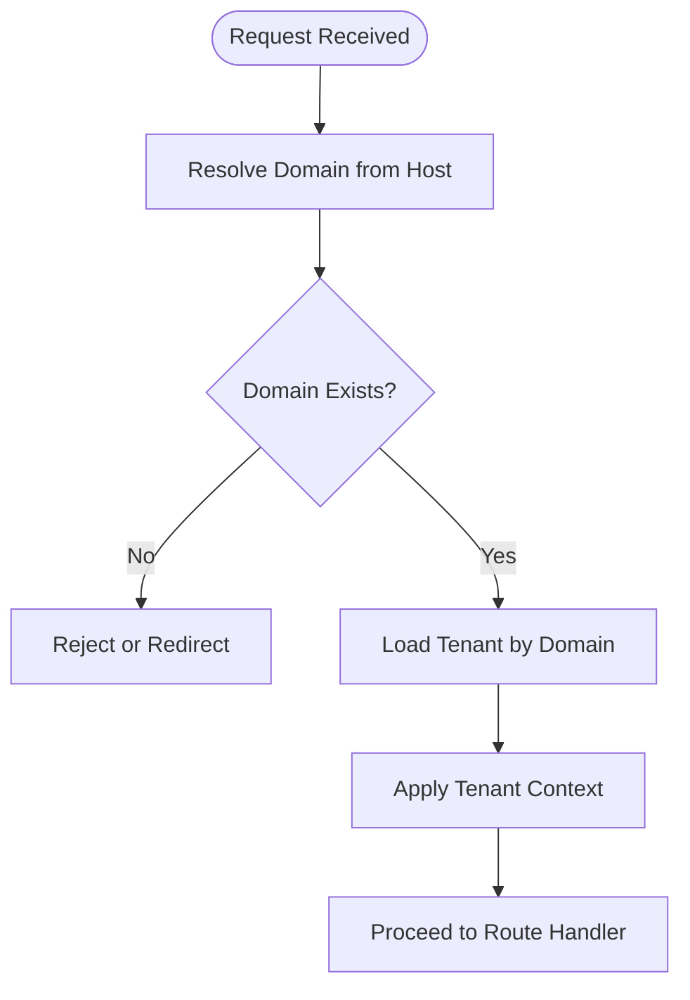

**Diagram sources**
- [app/Models/Domain.php:38-57](file://app/Models/Domain.php#L38-L57)
- [database/migrations/2025_09_05_080622_create_domains_table.php:14-34](file://database/migrations/2025_09_05_080622_create_domains_table.php#L14-L34)
- [app/Providers/TenancyServiceProvider.php:29-40](file://app/Providers/TenancyServiceProvider.php#L29-L40)

**Section sources**
- [app/Models/Domain.php:38-57](file://app/Models/Domain.php#L38-L57)
- [database/migrations/2025_09_05_080622_create_domains_table.php:14-34](file://database/migrations/2025_09_05_080622_create_domains_table.php#L14-L34)
- [app/Providers/TenancyServiceProvider.php:29-40](file://app/Providers/TenancyServiceProvider.php#L29-L40)

### Session Isolation and Cache Namespace Separation
- Session security tracks session IDs, IP, user agent, and expiration; validates IP consistency and updates activity timestamps.
- Cache tag base and Redis prefix base isolate tenant data in cache and Redis.
- Security configuration defines rate limits, lockout thresholds, and session timeouts.

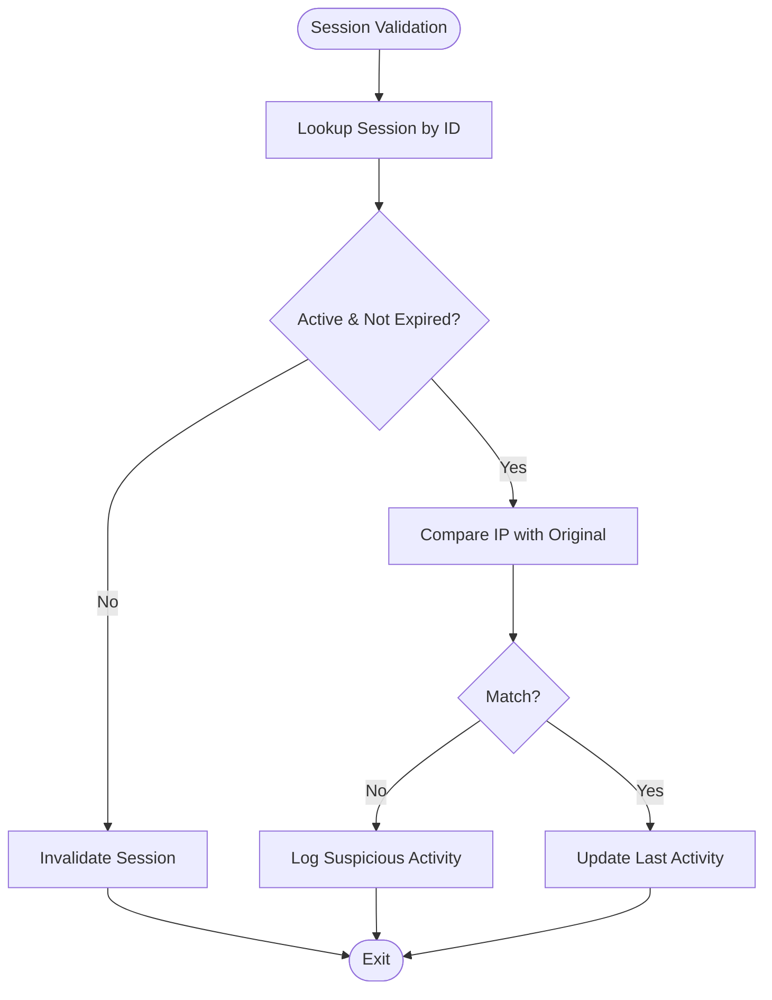

**Diagram sources**
- [app/Services/SecurityService.php:324-354](file://app/Services/SecurityService.php#L324-L354)
- [config/security.php:9-26](file://config/security.php#L9-L26)
- [config/tenancy.php:37-58](file://config/tenancy.php#L37-L58)

**Section sources**
- [app/Services/SecurityService.php:324-354](file://app/Services/SecurityService.php#L324-L354)
- [config/security.php:9-26](file://config/security.php#L9-L26)
- [config/tenancy.php:37-58](file://config/tenancy.php#L37-L58)

### File Storage Isolation and Tenant-Specific Resource Management
- Filesystem suffix base and disk overrides ensure tenant-specific storage roots for local and public disks.
- Root override configuration ensures storage paths are suffixed consistently.

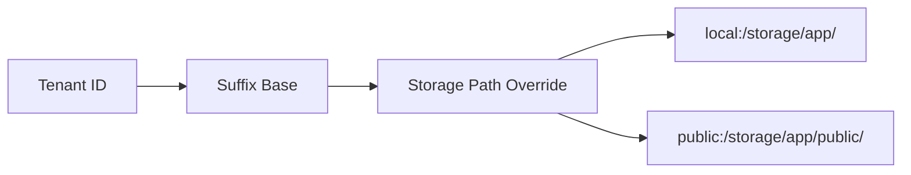

**Diagram sources**
- [config/tenancy.php:40-51](file://config/tenancy.php#L40-L51)

**Section sources**
- [config/tenancy.php:40-51](file://config/tenancy.php#L40-L51)

### Cross-Tenant Access Prevention and Query Filtering Verification
- Integration tests verify that search and filters return only tenant-scoped results.
- This demonstrates tenant isolation at the query/filter level.

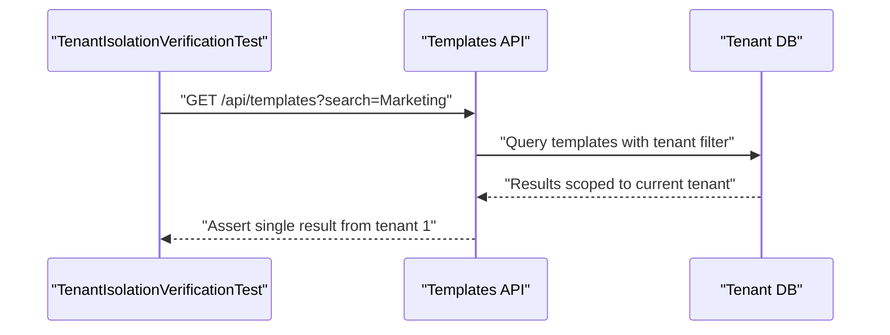

**Diagram sources**
- [tests/Integration/TenantIsolationVerificationTest.php:308-337](file://tests/Integration/TenantIsolationVerificationTest.php#L308-L337)

**Section sources**
- [tests/Integration/TenantIsolationVerificationTest.php:308-337](file://tests/Integration/TenantIsolationVerificationTest.php#L308-L337)

### Security Measures: Unauthorized Access Prevention, Audit Logging, and Compliance Monitoring
- SecurityService implements 2FA enable/disable, failed login tracking, malicious request detection, session validation, and security event logging.
- SecurityAuditService performs audits across authentication, authorization, data privacy, social graph security, API security, infrastructure, compliance, and vulnerability scans.
- Security configuration enables monitoring toggles for data access logging, malicious request detection, and critical event alerts.

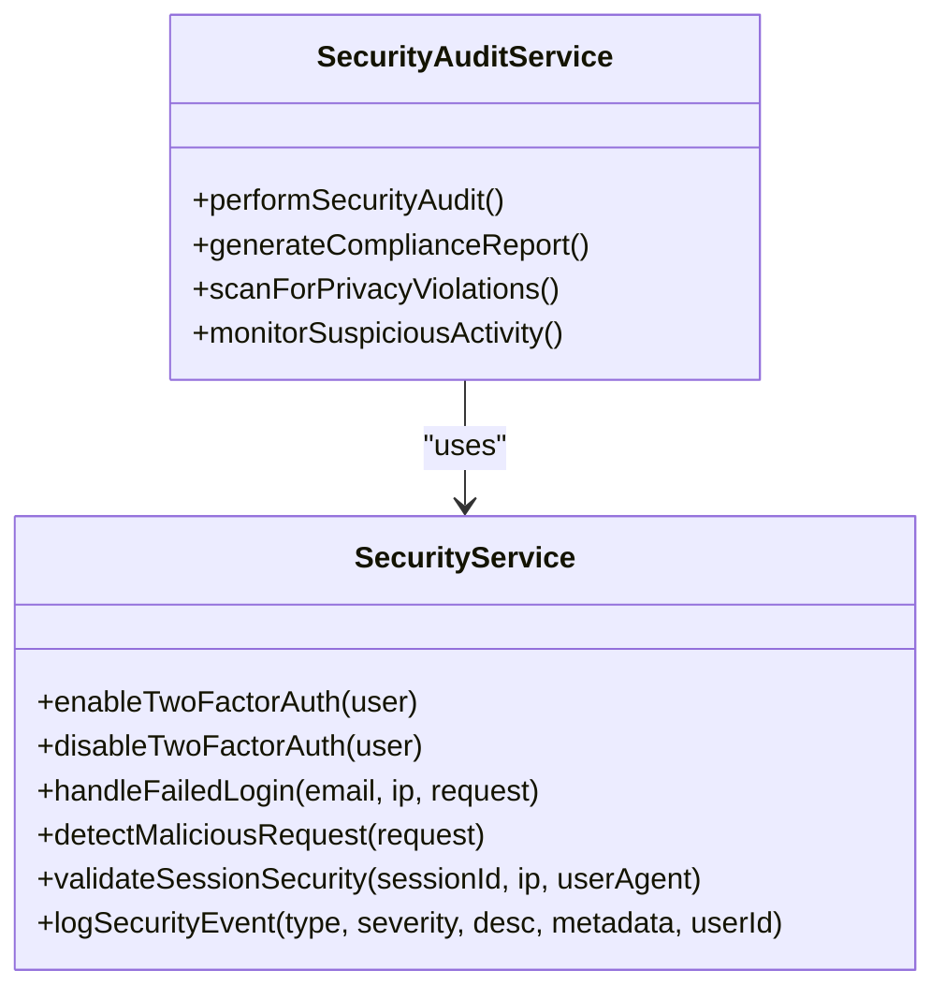

**Diagram sources**
- [app/Services/SecurityService.php:29-65](file://app/Services/SecurityService.php#L29-L65)
- [app/Services/SecurityService.php:100-145](file://app/Services/SecurityService.php#L100-L145)
- [app/Services/SecurityService.php:202-244](file://app/Services/SecurityService.php#L202-L244)
- [app/Services/SecurityService.php:324-354](file://app/Services/SecurityService.php#L324-L354)
- [app/Services/SecurityService.php:249-270](file://app/Services/SecurityService.php#L249-L270)
- [app/Services/SecurityAuditService.php:12-25](file://app/Services/SecurityAuditService.php#L12-L25)

**Section sources**
- [app/Services/SecurityService.php:29-65](file://app/Services/SecurityService.php#L29-L65)
- [app/Services/SecurityService.php:100-145](file://app/Services/SecurityService.php#L100-L145)
- [app/Services/SecurityService.php:202-244](file://app/Services/SecurityService.php#L202-L244)
- [app/Services/SecurityService.php:324-354](file://app/Services/SecurityService.php#L324-L354)
- [app/Services/SecurityService.php:249-270](file://app/Services/SecurityService.php#L249-L270)
- [app/Services/SecurityAuditService.php:12-25](file://app/Services/SecurityAuditService.php#L12-L25)
- [config/security.php:55-59](file://config/security.php#L55-L59)

### Performance Optimizations: Query Caching, Connection Pooling, and Tenant-Aware Indexing Strategies
- Cache tag base and Redis prefix base enable efficient tenant-scoped caching and pub/sub isolation.
- Migration parameters target tenant migrations, reducing cross-tenant interference during schema changes.
- Tenant-aware indexing can be implemented at the application level by ensuring tenant filters are present in query plans and adding composite indexes on tenant_id plus frequently filtered columns.

[No sources needed since this section provides general guidance]

### Implementation Details: Tenant-Aware Models, Repository Patterns, and Service Layer Isolation
- Tenant model encapsulates relations and tenant-specific scopes.
- Service layer integrates with security and audit services to enforce policies and produce compliance reports.
- Repository patterns can be layered on top of Eloquent models to centralize tenant scoping logic and reuse across services.

[No sources needed since this section provides general guidance]

### Security Testing Methodologies, Penetration Testing Approaches, and Vulnerability Assessment Procedures
- Use dedicated scripts to temporarily disable security middleware for controlled testing scenarios.
- Conduct vulnerability scans covering SQL injection, XSS, CSRF, and file upload security.
- Perform privacy violation scans and compliance checks regularly.

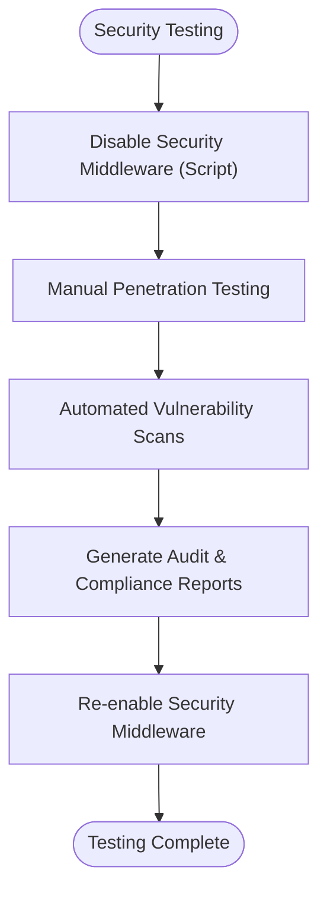

**Diagram sources**
- [scripts/debugging/disable_security_middleware.php:11-36](file://scripts/debugging/disable_security_middleware.php#L11-L36)
- [app/Services/SecurityAuditService.php:191-199](file://app/Services/SecurityAuditService.php#L191-L199)

**Section sources**
- [scripts/debugging/disable_security_middleware.php:11-36](file://scripts/debugging/disable_security_middleware.php#L11-L36)
- [app/Services/SecurityAuditService.php:191-199](file://app/Services/SecurityAuditService.php#L191-L199)

## Dependency Analysis
- Tenancy configuration depends on the tenant and domain models and bootstrappers.
- SecurityService depends on configuration and models for session and event logging.
- AuditService depends on SecurityService for contextual insights.
- Migrations depend on tenant models and domain models to establish tenant scoping.

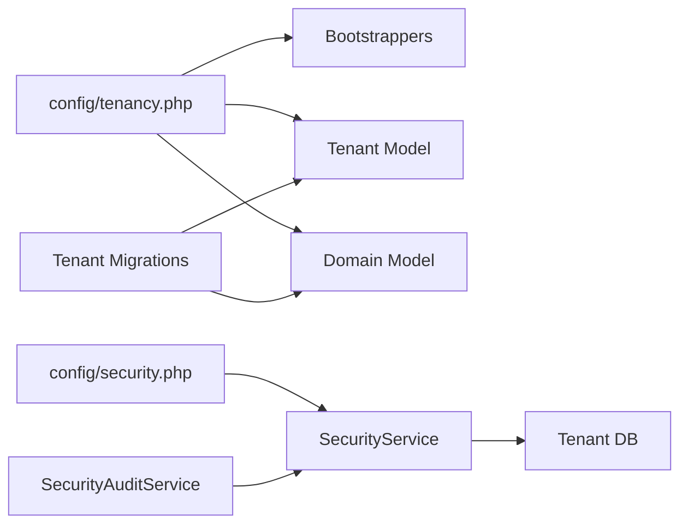

**Diagram sources**
- [config/tenancy.php:12-82](file://config/tenancy.php#L12-L82)
- [app/Services/SecurityService.php:19-526](file://app/Services/SecurityService.php#L19-L526)
- [app/Services/SecurityAuditService.php:7-347](file://app/Services/SecurityAuditService.php#L7-L347)
- [database/migrations/2024_01_01_000000_create_tenants_table.php:1-200](file://database/migrations/2024_01_01_000000_create_tenants_table.php#L1-L200)
- [database/migrations/2024_01_01_000001_create_domains_table.php:14-34](file://database/migrations/2024_01_01_000001_create_domains_table.php#L14-L34)

**Section sources**
- [config/tenancy.php:12-82](file://config/tenancy.php#L12-L82)
- [app/Services/SecurityService.php:19-526](file://app/Services/SecurityService.php#L19-L526)
- [app/Services/SecurityAuditService.php:7-347](file://app/Services/SecurityAuditService.php#L7-L347)
- [database/migrations/2024_01_01_000000_create_tenants_table.php:1-200](file://database/migrations/2024_01_01_000000_create_tenants_table.php#L1-L200)
- [database/migrations/2024_01_01_000001_create_domains_table.php:14-34](file://database/migrations/2024_01_01_000001_create_domains_table.php#L14-L34)

## Performance Considerations
- Use tenant-aware cache keys and Redis prefixes to avoid cross-tenant cache pollution.
- Apply tenant filters in queries and add appropriate indexes on tenant_id plus commonly filtered columns.
- Employ connection pooling at the database level and tenant-scoped pool routing.
- Implement tenant-aware query caching strategies with cache tags and TTL aligned to tenant session lifetimes.

[No sources needed since this section provides general guidance]

## Troubleshooting Guide
- If tenant context is missing, verify domain resolution and that bootstrappers are active.
- If cache or Redis appears mixed across tenants, confirm tag_base and prefix_base configurations.
- If session validation fails, inspect IP address mismatches and session expiration.
- To temporarily disable security middleware for testing, use the provided script and re-enable afterward.

**Section sources**
- [config/tenancy.php:21-58](file://config/tenancy.php#L21-L58)
- [app/Services/SecurityService.php:324-354](file://app/Services/SecurityService.php#L324-L354)
- [scripts/debugging/disable_security_middleware.php:11-36](file://scripts/debugging/disable_security_middleware.php#L11-L36)

## Conclusion
The platform achieves robust tenant isolation through domain-driven tenant resolution, database and resource bootstrapping, tenant-aware models, and comprehensive security controls. Tenant scoping is enforced at the database, cache, filesystem, and Redis layers, while security services and audit capabilities provide continuous monitoring and compliance assurance. Performance optimizations and rigorous testing practices further strengthen the system’s reliability and security posture.

## Appendices
- Additional tenant migrations demonstrate tenant scoping across diverse tenant-specific tables and shared analytics/notifications tables.

**Section sources**
- [database/migrations/tenant/2024_01_01_000003_create_courses_table.php:1-200](file://database/migrations/tenant/2024_01_01_000003_create_courses_table.php#L1-L200)
- [database/migrations/tenant/2024_01_01_000004_create_graduates_table.php:1-200](file://database/migrations/tenant/2024_01_01_000004_create_graduates_table.php#L1-L200)
- [database/migrations/tenant/2024_01_01_000007_create_graduate_profiles_table.php:1-200](file://database/migrations/tenant/2024_01_01_000007_create_graduate_profiles_table.php#L1-L200)
- [database/migrations/tenant/2025_01_29_000003_create_posts_table.php:1-200](file://database/migrations/tenant/2025_01_29_000003_create_posts_table.php#L1-L200)
- [database/migrations/tenant/2025_01_29_000004_create_circles_and_groups_tables.php:1-200](file://database/migrations/tenant/2025_01_29_000004_create_circles_and_groups_tables.php#L1-L200)
- [database/migrations/tenant/2025_01_30_000001_create_performance_monitoring_tables.php:1-200](file://database/migrations/tenant/2025_01_30_000001_create_performance_monitoring_tables.php#L1-L200)
- [database/migrations/2025_09_04_074200_add_tenant_isolation_to_analytics_events_table.php:1-200](file://database/migrations/2025_09_04_074200_add_tenant_isolation_to_analytics_events_table.php#L1-L200)
- [database/migrations/2025_09_04_074201_add_tenant_isolation_to_landing_page_analytics_table.php:1-200](file://database/migrations/2025_09_04_074201_add_tenant_isolation_to_landing_page_analytics_table.php#L1-L200)
- [database/migrations/2025_09_05_101322_add_tenant_isolation_to_notifications_tables.php:1-200](file://database/migrations/2025_09_05_101322_add_tenant_isolation_to_notifications_tables.php#L1-L200)