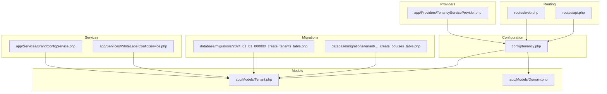
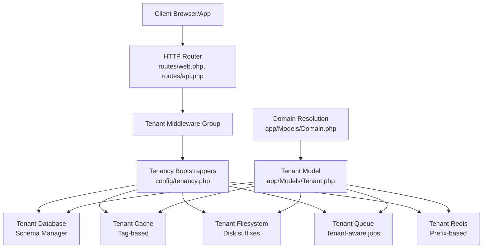
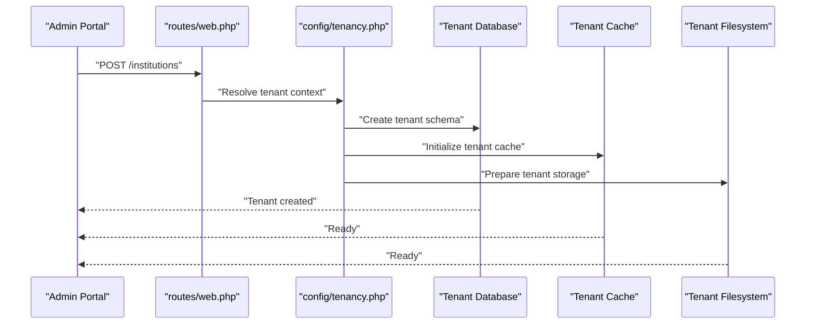
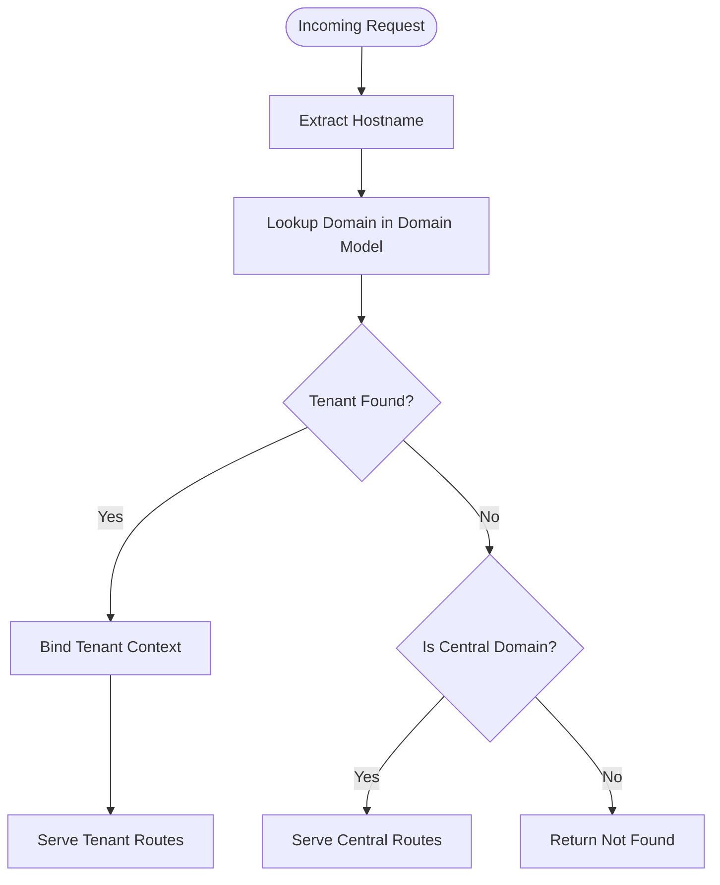
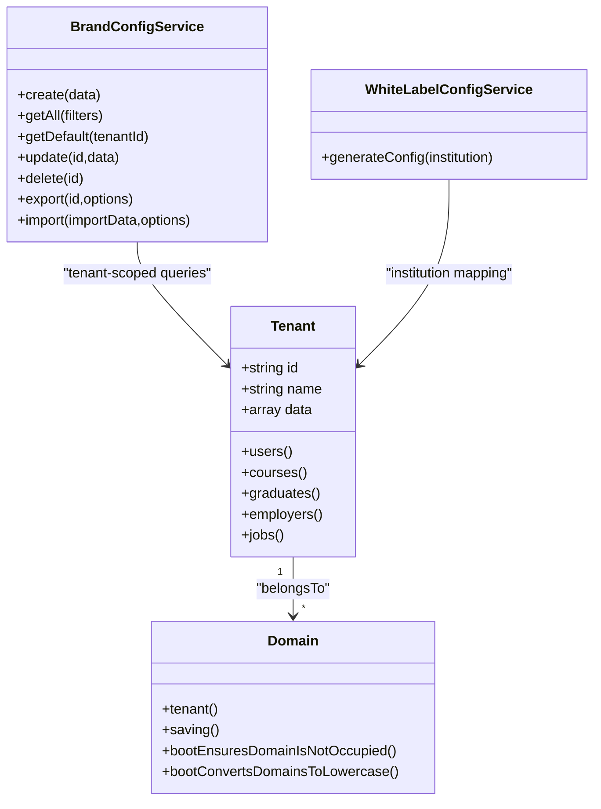
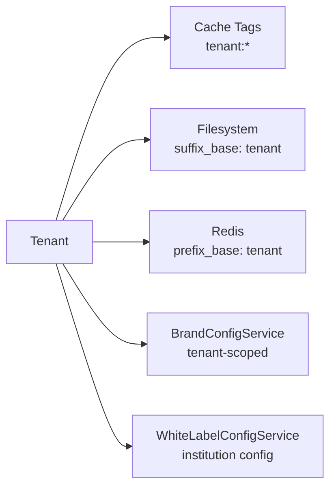
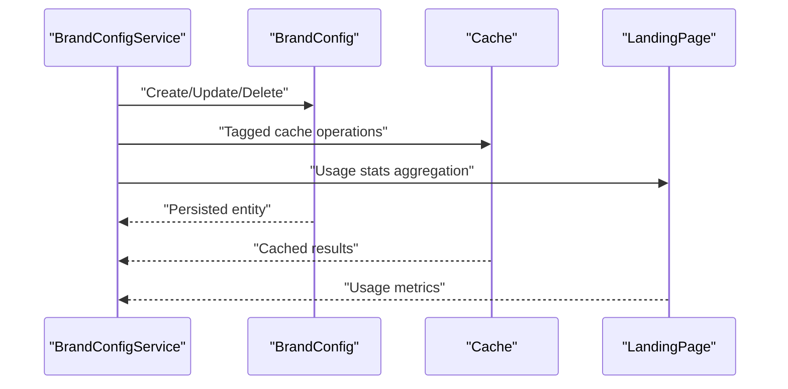
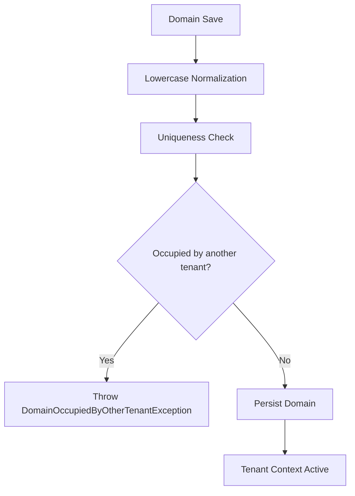
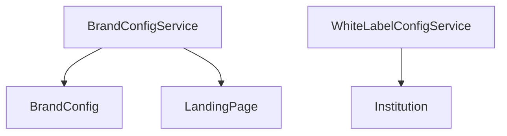
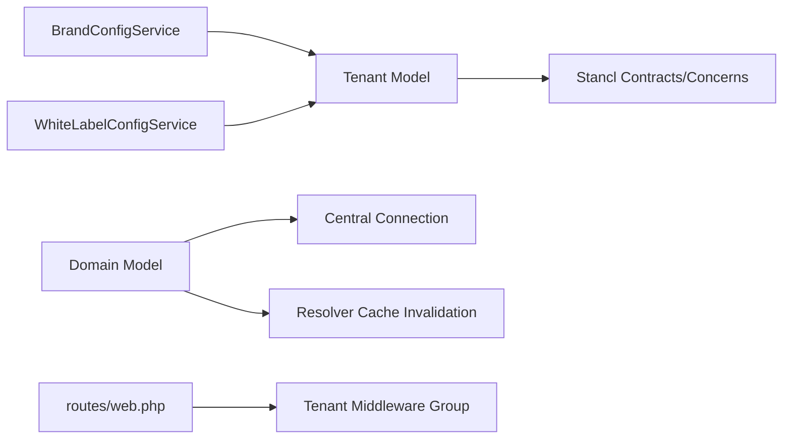

# Multi-Tenant Architecture

<cite>
**Referenced Files in This Document**
- [config/tenancy.php](file://config/tenancy.php)
- [app/Models/Tenant.php](file://app/Models/Tenant.php)
- [app/Models/Domain.php](file://app/Models/Domain.php)
- [app/Providers/TenancyServiceProvider.php](file://app/Providers/TenancyServiceProvider.php)
- [routes/web.php](file://routes/web.php)
- [routes/api.php](file://routes/api.php)
- [database/migrations/2024_01_01_000000_create_tenants_table.php](file://database/migrations/2024_01_01_000000_create_tenants_table.php)
- [database/migrations/tenant/2024_01_01_000003_create_courses_table.php](file://database/migrations/tenant/2024_01_01_000003_create_courses_table.php)
- [app/Services/BrandConfigService.php](file://app/Services/BrandConfigService.php)
- [app/Services/WhiteLabelConfigService.php](file://app/Services/WhiteLabelConfigService.php)
</cite>

## Table of Contents
1. [Introduction](#introduction)
2. [Project Structure](#project-structure)
3. [Core Components](#core-components)
4. [Architecture Overview](#architecture-overview)
5. [Detailed Component Analysis](#detailed-component-analysis)
6. [Dependency Analysis](#dependency-analysis)
7. [Performance Considerations](#performance-considerations)
8. [Troubleshooting Guide](#troubleshooting-guide)
9. [Conclusion](#conclusion)

## Introduction
This document explains the multi-tenant architecture implemented in the platform. It covers tenant creation, domain resolution, automatic tenant identification, data isolation mechanisms, tenant-specific resource management, lifecycle management, migration strategies, performance optimization, tenant-aware models/services, security measures, and practical examples of tenant customization and branding.

## Project Structure
The multi-tenant system is built on top of a Laravel-based application with Stancl Tenancy integration. Key areas include:
- Configuration: centralized tenant and domain model definitions, bootstrappers, and resource isolation settings
- Models: Tenant and Domain models implementing tenancy contracts
- Providers: Service provider bootstrapping tenancy middleware priorities
- Routing: tenant-scoped routes grouped under a dedicated middleware group
- Migrations: central tenant registry and tenant-scoped schema migrations
- Services: tenant-aware services for branding and white-label configuration

**Diagram sources**
- [config/tenancy.php:12-82](file://config/tenancy.php#L12-L82)
- [app/Models/Tenant.php:11-86](file://app/Models/Tenant.php#L11-L86)
- [app/Models/Domain.php:12-59](file://app/Models/Domain.php#L12-L59)
- [app/Providers/TenancyServiceProvider.php:24-41](file://app/Providers/TenancyServiceProvider.php#L24-L41)
- [routes/web.php:114-133](file://routes/web.php#L114-L133)
- [routes/api.php:26-28](file://routes/api.php#L26-L28)
- [database/migrations/2024_01_01_000000_create_tenants_table.php:14-35](file://database/migrations/2024_01_01_000000_create_tenants_table.php#L14-L35)
- [database/migrations/tenant/2024_01_01_000003_create_courses_table.php:14-35](file://database/migrations/tenant/2024_01_01_000003_create_courses_table.php#L14-L35)
- [app/Services/BrandConfigService.php:18-455](file://app/Services/BrandConfigService.php#L18-L455)
- [app/Services/WhiteLabelConfigService.php:7-202](file://app/Services/WhiteLabelConfigService.php#L7-L202)

**Section sources**
- [config/tenancy.php:12-82](file://config/tenancy.php#L12-L82)
- [app/Models/Tenant.php:11-86](file://app/Models/Tenant.php#L11-L86)
- [app/Models/Domain.php:12-59](file://app/Models/Domain.php#L12-L59)
- [app/Providers/TenancyServiceProvider.php:24-41](file://app/Providers/TenancyServiceProvider.php#L24-L41)
- [routes/web.php:114-133](file://routes/web.php#L114-L133)
- [routes/api.php:26-28](file://routes/api.php#L26-L28)
- [database/migrations/2024_01_01_000000_create_tenants_table.php:14-35](file://database/migrations/2024_01_01_000000_create_tenants_table.php#L14-L35)
- [database/migrations/tenant/2024_01_01_000003_create_courses_table.php:14-35](file://database/migrations/tenant/2024_01_01_000003_create_courses_table.php#L14-L35)
- [app/Services/BrandConfigService.php:18-455](file://app/Services/BrandConfigService.php#L18-L455)
- [app/Services/WhiteLabelConfigService.php:7-202](file://app/Services/WhiteLabelConfigService.php#L7-L202)

## Core Components
- Tenant model: central registry of tenants with custom columns and relations to users, courses, graduates, employers, and jobs
- Domain model: resolves hostnames to tenants, enforces uniqueness and lowercase normalization
- Configuration: defines tenant model, domain model, central domains, bootstrappers for database/cache/filesystem/queue/redis, database managers, cache and filesystem suffixes, redis prefix base, migration/seeder parameters, and job classes
- Provider: bootstraps tenancy and sets middleware priority for tenant routes
- Routing: tenant routes are grouped under a dedicated middleware group; central routes exclude tenancy middleware
- Migrations: central tenants table and tenant-scoped migrations for tenant-specific entities

**Section sources**
- [app/Models/Tenant.php:11-86](file://app/Models/Tenant.php#L11-L86)
- [app/Models/Domain.php:12-59](file://app/Models/Domain.php#L12-L59)
- [config/tenancy.php:12-82](file://config/tenancy.php#L12-L82)
- [app/Providers/TenancyServiceProvider.php:24-41](file://app/Providers/TenancyServiceProvider.php#L24-L41)
- [routes/web.php:114-133](file://routes/web.php#L114-L133)
- [database/migrations/2024_01_01_000000_create_tenants_table.php:14-35](file://database/migrations/2024_01_01_000000_create_tenants_table.php#L14-L35)
- [database/migrations/tenant/2024_01_01_000003_create_courses_table.php:14-35](file://database/migrations/tenant/2024_01_01_000003_create_courses_table.php#L14-L35)

## Architecture Overview
The system isolates tenants across databases, cache, filesystems, queues, and Redis. Automatic tenant identification occurs via domain resolution. Tenant-aware services manage branding and white-label configurations.

**Diagram sources**
- [routes/web.php:114-133](file://routes/web.php#L114-L133)
- [routes/api.php:26-28](file://routes/api.php#L26-L28)
- [config/tenancy.php:21-27](file://config/tenancy.php#L21-L27)
- [config/tenancy.php:37-58](file://config/tenancy.php#L37-L58)
- [app/Models/Tenant.php:11-86](file://app/Models/Tenant.php#L11-L86)
- [app/Models/Domain.php:19-22](file://app/Models/Domain.php#L19-L22)

## Detailed Component Analysis

### Tenant Creation and Lifecycle
- Tenant registration persists a primary-key tenant record with metadata and optional JSON data payload
- Domain records associate hostnames to tenants, enforce uniqueness, and normalize domains to lowercase
- Bootstrappers activate tenant-aware subsystems (database, cache, filesystem, queue, redis)
- Migration/seeder parameters target tenant-specific migrations and seeding

**Diagram sources**
- [routes/web.php:172-173](file://routes/web.php#L172-L173)
- [config/tenancy.php:21-27](file://config/tenancy.php#L21-L27)
- [config/tenancy.php:66-75](file://config/tenancy.php#L66-L75)

**Section sources**
- [database/migrations/2024_01_01_000000_create_tenants_table.php:14-35](file://database/migrations/2024_01_01_000000_create_tenants_table.php#L14-L35)
- [app/Models/Domain.php:38-57](file://app/Models/Domain.php#L38-L57)
- [config/tenancy.php:21-27](file://config/tenancy.php#L21-L27)
- [config/tenancy.php:66-75](file://config/tenancy.php#L66-L75)

### Domain Resolution and Automatic Tenant Identification
- Domain model resolves hostname to a tenant via belongs-to relationship
- Domain saving triggers uniqueness validation and lowercase normalization
- Central domains are configured separately to bypass tenant routing

**Diagram sources**
- [app/Models/Domain.php:19-33](file://app/Models/Domain.php#L19-L33)
- [app/Models/Domain.php:38-57](file://app/Models/Domain.php#L38-L57)
- [config/tenancy.php:15-20](file://config/tenancy.php#L15-L20)

**Section sources**
- [app/Models/Domain.php:19-33](file://app/Models/Domain.php#L19-L33)
- [app/Models/Domain.php:38-57](file://app/Models/Domain.php#L38-L57)
- [config/tenancy.php:15-20](file://config/tenancy.php#L15-L20)

### Data Isolation Mechanisms
- Database isolation: tenant schema manager for PostgreSQL; migrations target tenant schema
- Cache isolation: tag-based caching with tenant tag base
- Filesystem isolation: disk suffix base and root overrides for local/public disks
- Redis isolation: prefix base and configurable prefixed connections
- Tenant-scoped migrations define tenant-specific tables (e.g., courses)

**Diagram sources**
- [app/Models/Tenant.php:48-84](file://app/Models/Tenant.php#L48-L84)
- [app/Models/Domain.php:19-33](file://app/Models/Domain.php#L19-L33)
- [app/Services/BrandConfigService.php:88-137](file://app/Services/BrandConfigService.php#L88-L137)
- [app/Services/WhiteLabelConfigService.php:12-22](file://app/Services/WhiteLabelConfigService.php#L12-L22)

**Section sources**
- [config/tenancy.php:37-58](file://config/tenancy.php#L37-L58)
- [database/migrations/tenant/2024_01_01_000003_create_courses_table.php:14-35](file://database/migrations/tenant/2024_01_01_000003_create_courses_table.php#L14-L35)

### Tenant-Specific Resource Management
- Cache: tag-based caching scoped to tenant context
- Filesystem: suffix-based tenant storage roots for local/public disks
- Redis: prefix-based keys and optional prefixed connections
- Branding: tenant-scoped brand configurations with default selection and usage analytics
- White-label: generates deployment, branding, feature, customization, integration, and environment settings per institution

**Diagram sources**
- [config/tenancy.php:37-58](file://config/tenancy.php#L37-L58)
- [app/Services/BrandConfigService.php:88-137](file://app/Services/BrandConfigService.php#L88-L137)
- [app/Services/WhiteLabelConfigService.php:12-22](file://app/Services/WhiteLabelConfigService.php#L12-L22)

**Section sources**
- [config/tenancy.php:37-58](file://config/tenancy.php#L37-L58)
- [app/Services/BrandConfigService.php:88-137](file://app/Services/BrandConfigService.php#L88-L137)
- [app/Services/WhiteLabelConfigService.php:12-22](file://app/Services/WhiteLabelConfigService.php#L12-L22)

### Tenant-Aware Models, Repositories, and Services
- Tenant model defines relations to users, courses, graduates, employers, and jobs
- BrandConfigService encapsulates tenant-scoped brand configuration CRUD, caching, and usage analytics
- WhiteLabelConfigService builds comprehensive white-label configuration for institutions

**Diagram sources**
- [app/Services/BrandConfigService.php:34-62](file://app/Services/BrandConfigService.php#L34-L62)
- [app/Services/BrandConfigService.php:148-178](file://app/Services/BrandConfigService.php#L148-L178)
- [app/Services/BrandConfigService.php:242-280](file://app/Services/BrandConfigService.php#L242-L280)
- [app/Services/BrandConfigService.php:288-311](file://app/Services/BrandConfigService.php#L288-L311)

**Section sources**
- [app/Models/Tenant.php:48-84](file://app/Models/Tenant.php#L48-L84)
- [app/Services/BrandConfigService.php:34-62](file://app/Services/BrandConfigService.php#L34-L62)
- [app/Services/BrandConfigService.php:148-178](file://app/Services/BrandConfigService.php#L148-L178)
- [app/Services/BrandConfigService.php:242-280](file://app/Services/BrandConfigService.php#L242-L280)
- [app/Services/BrandConfigService.php:288-311](file://app/Services/BrandConfigService.php#L288-L311)
- [app/Services/WhiteLabelConfigService.php:12-22](file://app/Services/WhiteLabelConfigService.php#L12-L22)

### Security Measures and Audit Logging
- Domain uniqueness enforcement prevents cross-tenant domain hijacking
- Lowercase normalization reduces ambiguity and potential conflicts
- Tag-based caching and prefix-based storage isolate tenant data
- Tenant-scoped validation ensures brand configuration uniqueness and prevents deletion of defaults without alternatives

**Diagram sources**
- [app/Models/Domain.php:38-57](file://app/Models/Domain.php#L38-L57)

**Section sources**
- [app/Models/Domain.php:38-57](file://app/Models/Domain.php#L38-L57)
- [app/Services/BrandConfigService.php:152-168](file://app/Services/BrandConfigService.php#L152-L168)
- [app/Services/BrandConfigService.php:246-266](file://app/Services/BrandConfigService.php#L246-L266)

### Practical Examples: Customizations and Branding
- Brand configuration management supports creation, updates, duplication, default selection, and usage analytics
- White-label configuration generation produces deployment, branding, feature, customization, integration, and environment settings for institutions

**Diagram sources**
- [app/Services/BrandConfigService.php:34-62](file://app/Services/BrandConfigService.php#L34-L62)
- [app/Services/BrandConfigService.php:288-311](file://app/Services/BrandConfigService.php#L288-L311)
- [app/Services/WhiteLabelConfigService.php:12-22](file://app/Services/WhiteLabelConfigService.php#L12-L22)

**Section sources**
- [app/Services/BrandConfigService.php:34-62](file://app/Services/BrandConfigService.php#L34-L62)
- [app/Services/BrandConfigService.php:288-311](file://app/Services/BrandConfigService.php#L288-L311)
- [app/Services/WhiteLabelConfigService.php:12-22](file://app/Services/WhiteLabelConfigService.php#L12-L22)

## Dependency Analysis
- Tenant model depends on Stancl contracts and concerns for database/domain management
- Domain model depends on central connection and resolver cache invalidation
- Routes rely on tenant middleware group for tenant-scoped endpoints
- Services depend on tenant context for scoping operations

**Diagram sources**
- [app/Models/Tenant.php:6-13](file://app/Models/Tenant.php#L6-L13)
- [app/Models/Domain.php:8-15](file://app/Models/Domain.php#L8-L15)
- [routes/web.php:114-133](file://routes/web.php#L114-L133)
- [app/Services/BrandConfigService.php:34-62](file://app/Services/BrandConfigService.php#L34-L62)
- [app/Services/WhiteLabelConfigService.php:12-22](file://app/Services/WhiteLabelConfigService.php#L12-L22)

**Section sources**
- [app/Models/Tenant.php:6-13](file://app/Models/Tenant.php#L6-L13)
- [app/Models/Domain.php:8-15](file://app/Models/Domain.php#L8-L15)
- [routes/web.php:114-133](file://routes/web.php#L114-L133)
- [app/Services/BrandConfigService.php:34-62](file://app/Services/BrandConfigService.php#L34-L62)
- [app/Services/WhiteLabelConfigService.php:12-22](file://app/Services/WhiteLabelConfigService.php#L12-L22)

## Performance Considerations
- Tag-based caching with tenant tags improves cache locality and reduces cross-tenant cache pollution
- Prefix-based Redis keys minimize namespace collisions and enable efficient cache invalidation
- Disk suffixes for local/public disks reduce contention and improve I/O isolation
- Tenant-scoped migrations keep tenant schemas lean and manageable
- Central domains exclude tenant middleware to reduce overhead on non-tenant routes

## Troubleshooting Guide
- Domain Occupancy: if domain assignment fails due to occupancy, verify uniqueness and ensure lowercase normalization
- Cache Isolation: if cached data appears incorrect, flush tenant-tagged cache entries
- Storage Roots: if tenant files are not visible, confirm disk suffix base and root overrides are correctly configured
- Default Brand Config Deletion: if attempting to delete the default brand configuration, ensure an alternative default exists

**Section sources**
- [app/Models/Domain.php:38-57](file://app/Models/Domain.php#L38-L57)
- [app/Services/BrandConfigService.php:246-266](file://app/Services/BrandConfigService.php#L246-L266)

## Conclusion
The multi-tenant architecture provides robust tenant isolation across databases, cache, filesystems, queues, and Redis, with automatic tenant identification via domain resolution. Tenant-aware models, services, and routing ensure secure, scalable, and maintainable operations. The configuration and services support comprehensive tenant customization, branding, and white-label deployments while enforcing strict data isolation and operational safeguards.