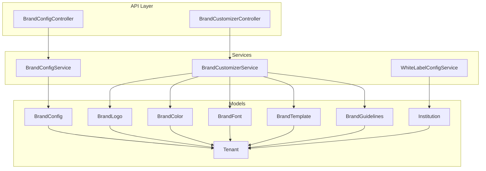
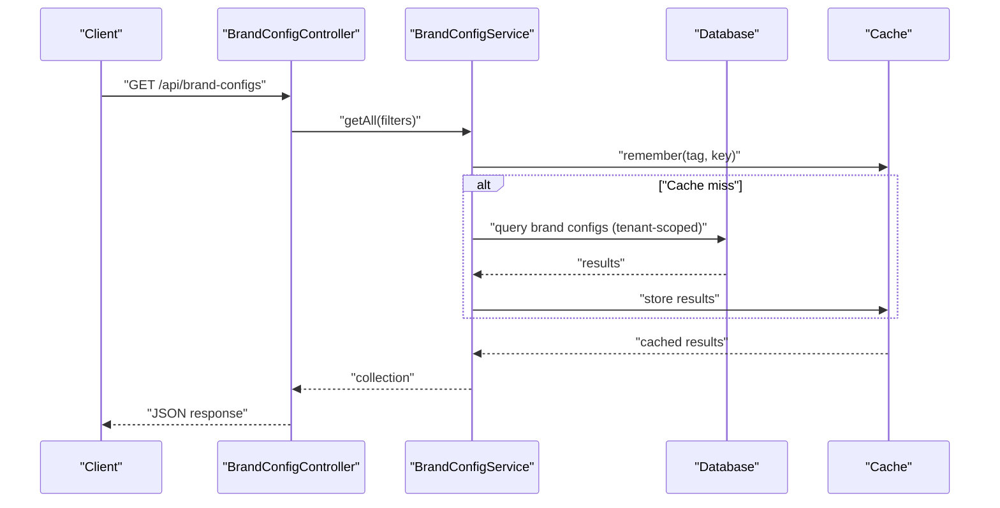
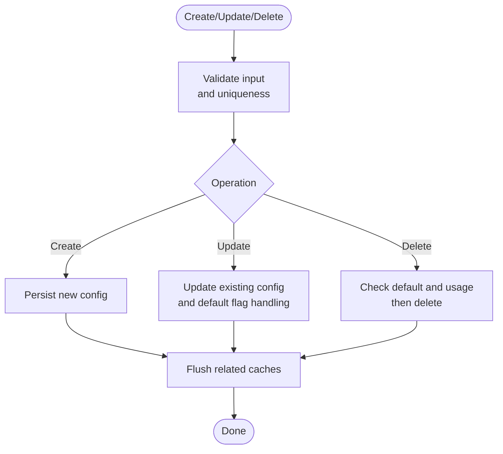
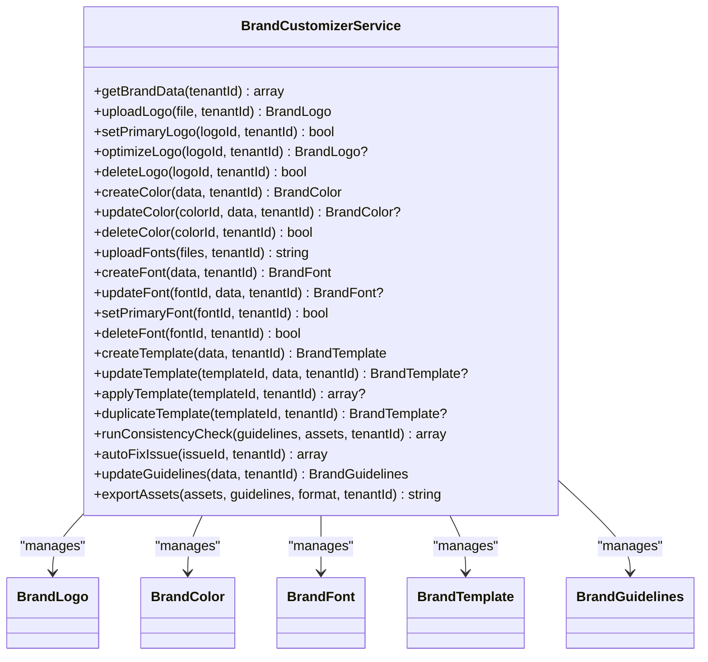
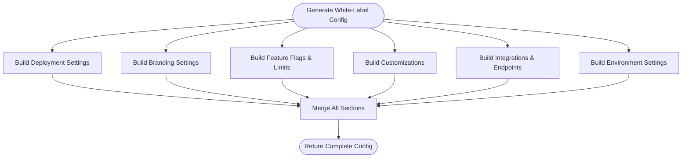
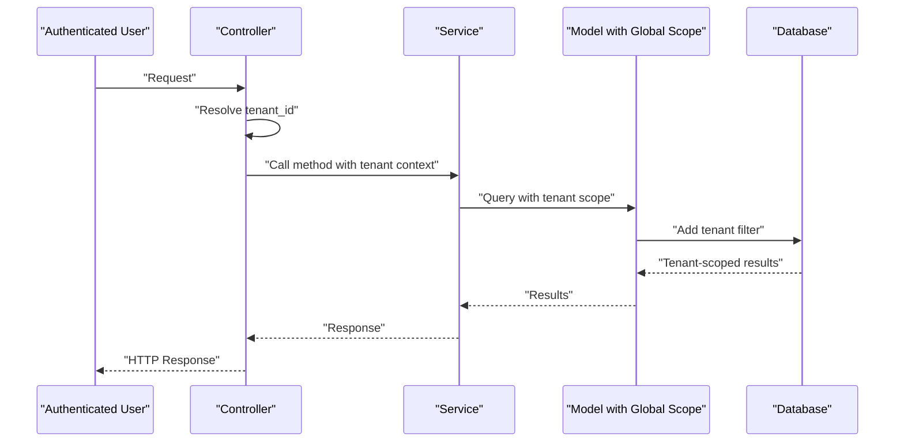
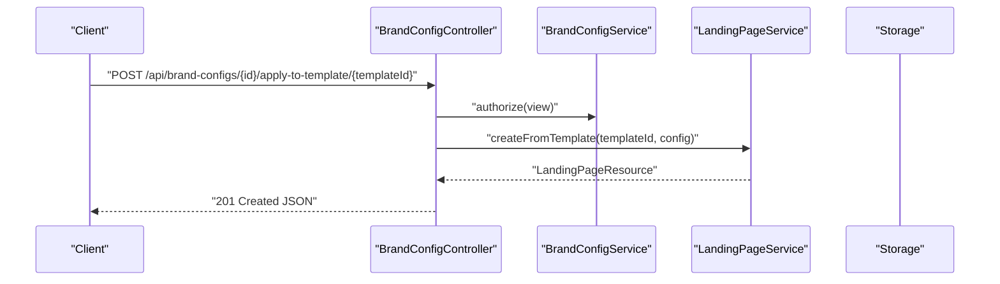
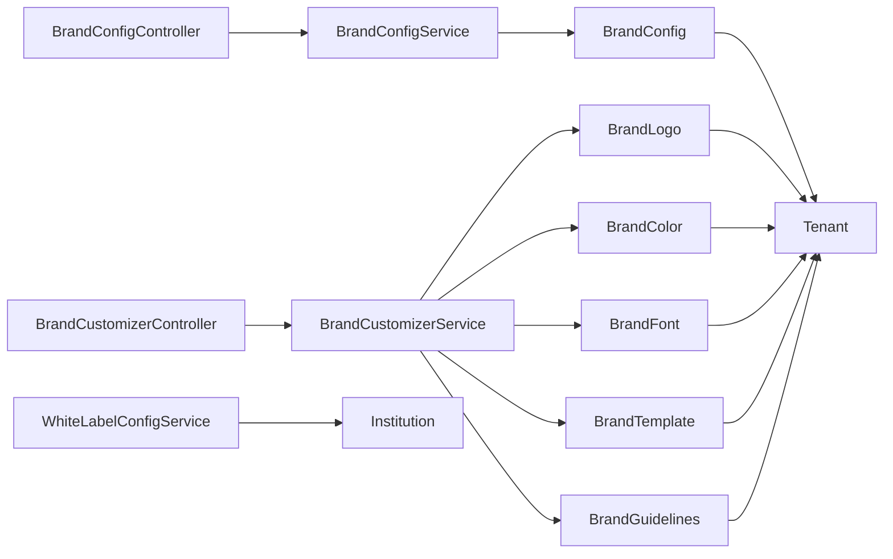

# Tenant Customization and Branding

<cite>
**Referenced Files in This Document**
- [BrandConfigService.php](file://app/Services/BrandConfigService.php)
- [BrandCustomizerService.php](file://app/Services/BrandCustomizerService.php)
- [WhiteLabelConfigService.php](file://app/Services/WhiteLabelConfigService.php)
- [BrandConfigController.php](file://app/Http/Controllers/Api/BrandConfigController.php)
- [BrandCustomizerController.php](file://app/Http/Controllers/Api/BrandCustomizerController.php)
- [BrandConfig.php](file://app/Models/BrandConfig.php)
- [BrandLogo.php](file://app/Models/BrandLogo.php)
- [BrandColor.php](file://app/Models/BrandColor.php)
- [BrandFont.php](file://app/Models/BrandFont.php)
- [BrandTemplate.php](file://app/Models/BrandTemplate.php)
- [BrandGuidelines.php](file://app/Models/BrandGuidelines.php)
- [Tenant.php](file://app/Models/Tenant.php)
- [Institution.php](file://app/Models/Institution.php)
</cite>

## Table of Contents
1. [Introduction](#introduction)
2. [Project Structure](#project-structure)
3. [Core Components](#core-components)
4. [Architecture Overview](#architecture-overview)
5. [Detailed Component Analysis](#detailed-component-analysis)
6. [Dependency Analysis](#dependency-analysis)
7. [Performance Considerations](#performance-considerations)
8. [Troubleshooting Guide](#troubleshooting-guide)
9. [Conclusion](#conclusion)

## Introduction
This document describes the tenant customization and branding system that enables institutions to define and manage their visual identity, feature toggles, and domain configuration within a multi-tenant environment. It covers:
- Theme and branding support via color palettes, typography, logos, and templates
- Custom domain configuration and white-label deployment
- Feature toggle management and institutional customization
- Tenant-specific configuration persistence and caching
- Real-time configuration updates and preview workflows
- Validation, versioning, and rollback strategies

## Project Structure
The system is organized around:
- Controllers for API endpoints that expose branding and customization operations
- Services that encapsulate business logic for brand configuration, customization, and white-label generation
- Eloquent models representing brand assets, templates, and institutional settings
- Tenant scoping to ensure data isolation across institutions

**Diagram sources**
- [BrandConfigController.php:26-512](file://app/Http/Controllers/Api/BrandConfigController.php#L26-L512)
- [BrandCustomizerController.php:12-514](file://app/Http/Controllers/Api/BrandCustomizerController.php#L12-L514)
- [BrandConfigService.php:18-455](file://app/Services/BrandConfigService.php#L18-L455)
- [BrandCustomizerService.php:18-920](file://app/Services/BrandCustomizerService.php#L18-L920)
- [WhiteLabelConfigService.php:7-202](file://app/Services/WhiteLabelConfigService.php#L7-L202)
- [BrandConfig.php:9-196](file://app/Models/BrandConfig.php#L9-L196)
- [BrandLogo.php:12-480](file://app/Models/BrandLogo.php#L12-L480)
- [BrandColor.php:10-292](file://app/Models/BrandColor.php#L10-L292)
- [BrandFont.php:10-414](file://app/Models/BrandFont.php#L10-L414)
- [BrandTemplate.php:11-337](file://app/Models/BrandTemplate.php#L11-L337)
- [BrandGuidelines.php:13-428](file://app/Models/BrandGuidelines.php#L13-L428)
- [Tenant.php:11-86](file://app/Models/Tenant.php#L11-L86)
- [Institution.php:10-77](file://app/Models/Institution.php#L10-L77)

**Section sources**
- [BrandConfigController.php:26-512](file://app/Http/Controllers/Api/BrandConfigController.php#L26-L512)
- [BrandCustomizerController.php:12-514](file://app/Http/Controllers/Api/BrandCustomizerController.php#L12-L514)
- [BrandConfigService.php:18-455](file://app/Services/BrandConfigService.php#L18-L455)
- [BrandCustomizerService.php:18-920](file://app/Services/BrandCustomizerService.php#L18-L920)
- [WhiteLabelConfigService.php:7-202](file://app/Services/WhiteLabelConfigService.php#L7-L202)
- [BrandConfig.php:9-196](file://app/Models/BrandConfig.php#L9-L196)
- [BrandLogo.php:12-480](file://app/Models/BrandLogo.php#L12-L480)
- [BrandColor.php:10-292](file://app/Models/BrandColor.php#L10-L292)
- [BrandFont.php:10-414](file://app/Models/BrandFont.php#L10-L414)
- [BrandTemplate.php:11-337](file://app/Models/BrandTemplate.php#L11-L337)
- [BrandGuidelines.php:13-428](file://app/Models/BrandGuidelines.php#L13-L428)
- [Tenant.php:11-86](file://app/Models/Tenant.php#L11-L86)
- [Institution.php:10-77](file://app/Models/Institution.php#L10-L77)

## Core Components
- BrandConfigService: Manages creation, retrieval, updates, duplication, deletion, previews, and exports of brand configurations with tenant scoping and caching.
- BrandCustomizerService: Handles brand assets (logos, colors, fonts), templates, guidelines, consistency checks, and export of brand assets.
- WhiteLabelConfigService: Generates a complete white-label configuration for an institution, including deployment, branding, features, customizations, integrations, and environment settings.
- Controllers: Expose REST endpoints for brand configuration and customization operations, including validation, uploads, and previews.
- Models: Define brand assets, templates, and institutional settings with tenant scoping and validation rules.

**Section sources**
- [BrandConfigService.php:18-455](file://app/Services/BrandConfigService.php#L18-L455)
- [BrandCustomizerService.php:18-920](file://app/Services/BrandCustomizerService.php#L18-L920)
- [WhiteLabelConfigService.php:7-202](file://app/Services/WhiteLabelConfigService.php#L7-L202)
- [BrandConfigController.php:26-512](file://app/Http/Controllers/Api/BrandConfigController.php#L26-L512)
- [BrandCustomizerController.php:12-514](file://app/Http/Controllers/Api/BrandCustomizerController.php#L12-L514)
- [BrandConfig.php:9-196](file://app/Models/BrandConfig.php#L9-L196)
- [BrandLogo.php:12-480](file://app/Models/BrandLogo.php#L12-L480)
- [BrandColor.php:10-292](file://app/Models/BrandColor.php#L10-L292)
- [BrandFont.php:10-414](file://app/Models/BrandFont.php#L10-L414)
- [BrandTemplate.php:11-337](file://app/Models/BrandTemplate.php#L11-L337)
- [BrandGuidelines.php:13-428](file://app/Models/BrandGuidelines.php#L13-L428)
- [Tenant.php:11-86](file://app/Models/Tenant.php#L11-L86)
- [Institution.php:10-77](file://app/Models/Institution.php#L10-L77)

## Architecture Overview
The system follows a layered architecture:
- API Controllers orchestrate requests and delegate to Services
- Services encapsulate business logic and coordinate with Models and external systems (storage, image processing)
- Models enforce tenant scoping and validation
- Caching improves performance for frequently accessed configurations

**Diagram sources**
- [BrandConfigController.php:40-66](file://app/Http/Controllers/Api/BrandConfigController.php#L40-L66)
- [BrandConfigService.php:88-120](file://app/Services/BrandConfigService.php#L88-L120)

**Section sources**
- [BrandConfigController.php:40-66](file://app/Http/Controllers/Api/BrandConfigController.php#L40-L66)
- [BrandConfigService.php:88-120](file://app/Services/BrandConfigService.php#L88-L120)

## Detailed Component Analysis

### Brand Configuration Management
- Creation and validation: Validates required fields and enforces uniqueness per tenant.
- Retrieval: Supports filtering by tenant, activity, default status, and search; paginated results with caching.
- Updates: Enforces uniqueness when changing names; manages default flags; clears caches after changes.
- Deletion: Prevents deletion of default configurations without alternatives; prevents deletion if in use by landing pages.
- Preview and export: Generates previews and exports brand configurations with usage statistics.

**Diagram sources**
- [BrandConfigService.php:34-62](file://app/Services/BrandConfigService.php#L34-L62)
- [BrandConfigService.php:148-178](file://app/Services/BrandConfigService.php#L148-L178)
- [BrandConfigService.php:242-280](file://app/Services/BrandConfigService.php#L242-L280)

**Section sources**
- [BrandConfigService.php:34-62](file://app/Services/BrandConfigService.php#L34-L62)
- [BrandConfigService.php:148-178](file://app/Services/BrandConfigService.php#L148-L178)
- [BrandConfigService.php:242-280](file://app/Services/BrandConfigService.php#L242-L280)
- [BrandConfigController.php:91-107](file://app/Http/Controllers/Api/BrandConfigController.php#L91-L107)
- [BrandConfigController.php:116-133](file://app/Http/Controllers/Api/BrandConfigController.php#L116-L133)
- [BrandConfigController.php:141-157](file://app/Http/Controllers/Api/BrandConfigController.php#L141-L157)

### Brand Customization (Assets, Templates, Guidelines)
- Assets: Upload and optimize logos, manage variants, set primary logo, delete logos.
- Colors: Create/update/delete colors; compute accessibility metrics and WCAG compliance.
- Fonts: Upload custom fonts, manage font families, set primary font, delete fonts.
- Templates: Create/update/delete templates; attach colors; auto-apply to existing components; duplicate templates.
- Guidelines: Update brand guidelines with enforcement rules; consistency checks; auto-fix suggestions.
- Export: Export brand assets in multiple formats (ZIP, JSON, CSS).

**Diagram sources**
- [BrandCustomizerService.php:18-920](file://app/Services/BrandCustomizerService.php#L18-L920)
- [BrandLogo.php:12-480](file://app/Models/BrandLogo.php#L12-L480)
- [BrandColor.php:10-292](file://app/Models/BrandColor.php#L10-L292)
- [BrandFont.php:10-414](file://app/Models/BrandFont.php#L10-L414)
- [BrandTemplate.php:11-337](file://app/Models/BrandTemplate.php#L11-L337)
- [BrandGuidelines.php:13-428](file://app/Models/BrandGuidelines.php#L13-L428)

**Section sources**
- [BrandCustomizerService.php:23-50](file://app/Services/BrandCustomizerService.php#L23-L50)
- [BrandCustomizerService.php:55-85](file://app/Services/BrandCustomizerService.php#L55-L85)
- [BrandCustomizerService.php:120-135](file://app/Services/BrandCustomizerService.php#L120-L135)
- [BrandCustomizerService.php:140-169](file://app/Services/BrandCustomizerService.php#L140-L169)
- [BrandCustomizerService.php:228-242](file://app/Services/BrandCustomizerService.php#L228-L242)
- [BrandCustomizerService.php:247-267](file://app/Services/BrandCustomizerService.php#L247-L267)
- [BrandCustomizerService.php:367-383](file://app/Services/BrandCustomizerService.php#L367-L383)
- [BrandCustomizerService.php:424-440](file://app/Services/BrandCustomizerService.php#L424-L440)
- [BrandCustomizerService.php:507-530](file://app/Services/BrandCustomizerService.php#L507-L530)
- [BrandCustomizerService.php:535-562](file://app/Services/BrandCustomizerService.php#L535-L562)
- [BrandCustomizerService.php:595-613](file://app/Services/BrandCustomizerService.php#L595-L613)
- [BrandCustomizerService.php:618-636](file://app/Services/BrandCustomizerService.php#L618-L636)
- [BrandCustomizerService.php:641-672](file://app/Services/BrandCustomizerService.php#L641-L672)
- [BrandCustomizerService.php:745-762](file://app/Services/BrandCustomizerService.php#L745-L762)
- [BrandCustomizerService.php:767-785](file://app/Services/BrandCustomizerService.php#L767-L785)

### White-Label Configuration Generation
- Generates deployment settings (subdomain, custom domain, SSL, CDN, app URL, prefixes)
- Builds branding settings (name, logo, banner, colors, fonts, theme style, custom CSS, meta/social)
- Assembles feature flags and limits based on subscription plan
- Aggregates customizations (fields, workflows, reporting, email templates, notifications)
- Composes integrations (sanitized provider info, webhook/endpoints)
- Defines environment settings (timezone, locale, currency, formats)

**Diagram sources**
- [WhiteLabelConfigService.php:12-22](file://app/Services/WhiteLabelConfigService.php#L12-L22)
- [WhiteLabelConfigService.php:27-39](file://app/Services/WhiteLabelConfigService.php#L27-L39)
- [WhiteLabelConfigService.php:44-63](file://app/Services/WhiteLabelConfigService.php#L44-L63)
- [WhiteLabelConfigService.php:68-79](file://app/Services/WhiteLabelConfigService.php#L68-L79)
- [WhiteLabelConfigService.php:84-95](file://app/Services/WhiteLabelConfigService.php#L84-L95)
- [WhiteLabelConfigService.php:99-120](file://app/Services/WhiteLabelConfigService.php#L99-L120)
- [WhiteLabelConfigService.php:125-134](file://app/Services/WhiteLabelConfigService.php#L125-L134)

**Section sources**
- [WhiteLabelConfigService.php:12-22](file://app/Services/WhiteLabelConfigService.php#L12-L22)
- [WhiteLabelConfigService.php:27-39](file://app/Services/WhiteLabelConfigService.php#L27-L39)
- [WhiteLabelConfigService.php:44-63](file://app/Services/WhiteLabelConfigService.php#L44-L63)
- [WhiteLabelConfigService.php:68-79](file://app/Services/WhiteLabelConfigService.php#L68-L79)
- [WhiteLabelConfigService.php:84-95](file://app/Services/WhiteLabelConfigService.php#L84-L95)
- [WhiteLabelConfigService.php:99-120](file://app/Services/WhiteLabelConfigService.php#L99-L120)
- [WhiteLabelConfigService.php:125-134](file://app/Services/WhiteLabelConfigService.php#L125-L134)

### Tenant Scoping and Multi-Tenancy
- Models apply tenant scoping globally to ensure isolation across institutions.
- Controllers derive tenant context from the authenticated user.
- Services leverage tenant-aware queries and cache tagging for tenant isolation.

**Diagram sources**
- [BrandConfig.php:57-75](file://app/Models/BrandConfig.php#L57-L75)
- [BrandLogo.php:103-128](file://app/Models/BrandLogo.php#L103-L128)
- [BrandColor.php:67-85](file://app/Models/BrandColor.php#L67-L85)
- [BrandFont.php:135-153](file://app/Models/BrandFont.php#L135-L153)
- [BrandTemplate.php:51-76](file://app/Models/BrandTemplate.php#L51-L76)
- [BrandGuidelines.php:86-111](file://app/Models/BrandGuidelines.php#L86-L111)
- [BrandConfigController.php:42-51](file://app/Http/Controllers/Api/BrandConfigController.php#L42-L51)
- [BrandCustomizerController.php:21-28](file://app/Http/Controllers/Api/BrandCustomizerController.php#L21-L28)

**Section sources**
- [BrandConfig.php:57-75](file://app/Models/BrandConfig.php#L57-L75)
- [BrandLogo.php:103-128](file://app/Models/BrandLogo.php#L103-L128)
- [BrandColor.php:67-85](file://app/Models/BrandColor.php#L67-L85)
- [BrandFont.php:135-153](file://app/Models/BrandFont.php#L135-L153)
- [BrandTemplate.php:51-76](file://app/Models/BrandTemplate.php#L51-L76)
- [BrandGuidelines.php:86-111](file://app/Models/BrandGuidelines.php#L86-L111)
- [BrandConfigController.php:42-51](file://app/Http/Controllers/Api/BrandConfigController.php#L42-L51)
- [BrandCustomizerController.php:21-28](file://app/Http/Controllers/Api/BrandCustomizerController.php#L21-L28)

### Configuration API Endpoints
- BrandConfigController: Index, show, store, update, destroy, upload logo/favicon/custom asset, apply to template, preview, export/import.
- BrandCustomizerController: Get brand data, upload/logos/colors/fonts/templates, apply/duplicate templates, consistency checks, auto-fix, update guidelines, export assets.

**Diagram sources**
- [BrandConfigController.php:279-303](file://app/Http/Controllers/Api/BrandConfigController.php#L279-L303)

**Section sources**
- [BrandConfigController.php:40-66](file://app/Http/Controllers/Api/BrandConfigController.php#L40-L66)
- [BrandConfigController.php:74-83](file://app/Http/Controllers/Api/BrandConfigController.php#L74-L83)
- [BrandConfigController.php:91-107](file://app/Http/Controllers/Api/BrandConfigController.php#L91-L107)
- [BrandConfigController.php:116-133](file://app/Http/Controllers/Api/BrandConfigController.php#L116-L133)
- [BrandConfigController.php:141-157](file://app/Http/Controllers/Api/BrandConfigController.php#L141-L157)
- [BrandConfigController.php:166-194](file://app/Http/Controllers/Api/BrandConfigController.php#L166-L194)
- [BrandConfigController.php:203-233](file://app/Http/Controllers/Api/BrandConfigController.php#L203-L233)
- [BrandConfigController.php:242-269](file://app/Http/Controllers/Api/BrandConfigController.php#L242-L269)
- [BrandConfigController.php:279-303](file://app/Http/Controllers/Api/BrandConfigController.php#L279-L303)
- [BrandConfigController.php:312-335](file://app/Http/Controllers/Api/BrandConfigController.php#L312-L335)
- [BrandConfigController.php:344-356](file://app/Http/Controllers/Api/BrandConfigController.php#L344-L356)
- [BrandConfigController.php:364-393](file://app/Http/Controllers/Api/BrandConfigController.php#L364-L393)
- [BrandCustomizerController.php:21-28](file://app/Http/Controllers/Api/BrandCustomizerController.php#L21-L28)
- [BrandCustomizerController.php:33-56](file://app/Http/Controllers/Api/BrandCustomizerController.php#L33-L56)
- [BrandCustomizerController.php:61-72](file://app/Http/Controllers/Api/BrandCustomizerController.php#L61-L72)
- [BrandCustomizerController.php:77-88](file://app/Http/Controllers/Api/BrandCustomizerController.php#L77-L88)
- [BrandCustomizerController.php:93-104](file://app/Http/Controllers/Api/BrandCustomizerController.php#L93-L104)
- [BrandCustomizerController.php:109-130](file://app/Http/Controllers/Api/BrandCustomizerController.php#L109-L130)
- [BrandCustomizerController.php:135-160](file://app/Http/Controllers/Api/BrandCustomizerController.php#L135-L160)
- [BrandCustomizerController.php:165-176](file://app/Http/Controllers/Api/BrandCustomizerController.php#L165-L176)
- [BrandCustomizerController.php:181-200](file://app/Http/Controllers/Api/BrandCustomizerController.php#L181-L200)
- [BrandCustomizerController.php:205-234](file://app/Http/Controllers/Api/BrandCustomizerController.php#L205-L234)
- [BrandCustomizerController.php:239-272](file://app/Http/Controllers/Api/BrandCustomizerController.php#L239-L272)
- [BrandCustomizerController.php:277-288](file://app/Http/Controllers/Api/BrandCustomizerController.php#L277-L288)
- [BrandCustomizerController.php:293-304](file://app/Http/Controllers/Api/BrandCustomizerController.php#L293-L304)
- [BrandCustomizerController.php:310-337](file://app/Http/Controllers/Api/BrandCustomizerController.php#L310-L337)
- [BrandCustomizerController.php:342-374](file://app/Http/Controllers/Api/BrandCustomizerController.php#L342-L374)
- [BrandCustomizerController.php:379-390](file://app/Http/Controllers/Api/BrandCustomizerController.php#L379-L390)
- [BrandCustomizerController.php:395-406](file://app/Http/Controllers/Api/BrandCustomizerController.php#L395-L406)
- [BrandCustomizerController.php:411-434](file://app/Http/Controllers/Api/BrandCustomizerController.php#L411-L434)
- [BrandCustomizerController.php:439-450](file://app/Http/Controllers/Api/BrandCustomizerController.php#L439-L450)
- [BrandCustomizerController.php:455-482](file://app/Http/Controllers/Api/BrandCustomizerController.php#L455-L482)
- [BrandCustomizerController.php:487-512](file://app/Http/Controllers/Api/BrandCustomizerController.php#L487-L512)

## Dependency Analysis
- Controllers depend on Services for business logic
- Services depend on Models for persistence and tenant scoping
- Models depend on Tenant for multi-tenancy
- BrandConfigController depends on BrandCustomizerService for asset operations
- WhiteLabelConfigService depends on Institution settings

**Diagram sources**
- [BrandConfigController.php:26-32](file://app/Http/Controllers/Api/BrandConfigController.php#L26-L32)
- [BrandCustomizerController.php:14-16](file://app/Http/Controllers/Api/BrandCustomizerController.php#L14-L16)
- [BrandConfigService.php:18-25](file://app/Services/BrandConfigService.php#L18-L25)
- [BrandCustomizerService.php:18-17](file://app/Services/BrandCustomizerService.php#L18-L17)
- [WhiteLabelConfigService.php:7-21](file://app/Services/WhiteLabelConfigService.php#L7-L21)
- [BrandConfig.php:9-107](file://app/Models/BrandConfig.php#L9-L107)
- [BrandLogo.php:12-208](file://app/Models/BrandLogo.php#L12-L208)
- [BrandColor.php:10-149](file://app/Models/BrandColor.php#L10-L149)
- [BrandFont.php:10-233](file://app/Models/BrandFont.php#L10-L233)
- [BrandTemplate.php:11-132](file://app/Models/BrandTemplate.php#L11-L132)
- [BrandGuidelines.php:13-183](file://app/Models/BrandGuidelines.php#L13-L183)
- [Tenant.php:11-86](file://app/Models/Tenant.php#L11-L86)
- [Institution.php:10-77](file://app/Models/Institution.php#L10-L77)

**Section sources**
- [BrandConfigController.php:26-32](file://app/Http/Controllers/Api/BrandConfigController.php#L26-L32)
- [BrandCustomizerController.php:14-16](file://app/Http/Controllers/Api/BrandCustomizerController.php#L14-L16)
- [BrandConfigService.php:18-25](file://app/Services/BrandConfigService.php#L18-L25)
- [BrandCustomizerService.php:18-17](file://app/Services/BrandCustomizerService.php#L18-L17)
- [WhiteLabelConfigService.php:7-21](file://app/Services/WhiteLabelConfigService.php#L7-L21)
- [BrandConfig.php:9-107](file://app/Models/BrandConfig.php#L9-L107)
- [BrandLogo.php:12-208](file://app/Models/BrandLogo.php#L12-L208)
- [BrandColor.php:10-149](file://app/Models/BrandColor.php#L10-L149)
- [BrandFont.php:10-233](file://app/Models/BrandFont.php#L10-L233)
- [BrandTemplate.php:11-132](file://app/Models/BrandTemplate.php#L11-L132)
- [BrandGuidelines.php:13-183](file://app/Models/BrandGuidelines.php#L13-L183)
- [Tenant.php:11-86](file://app/Models/Tenant.php#L11-L86)
- [Institution.php:10-77](file://app/Models/Institution.php#L10-L77)

## Performance Considerations
- Caching: BrandConfigService caches lists and defaults with tag-based invalidation to reduce database load.
- Tenant scoping: Global scopes avoid accidental cross-tenant queries; ensure indexes on tenant_id for optimal performance.
- Asset processing: Logo optimization generates multiple sizes; consider async processing and CDN delivery for large-scale deployments.
- Validation: Controllers validate inputs before delegating to services to fail fast and reduce unnecessary processing.

[No sources needed since this section provides general guidance]

## Troubleshooting Guide
- Validation failures: Controllers return structured errors for invalid inputs; ensure client-side validation aligns with server-side rules.
- Deletion constraints: BrandConfigService prevents deletion of default configurations without alternatives and when in use by landing pages.
- Access control: Controllers authorize actions on BrandConfig; ensure policies are properly configured.
- Consistency checks: BrandCustomizerService runs checks against guidelines; address warnings and errors reported in the consistency report.

**Section sources**
- [BrandConfigController.php:146-150](file://app/Http/Controllers/Api/BrandConfigController.php#L146-L150)
- [BrandConfigService.php:247-266](file://app/Services/BrandConfigService.php#L247-L266)
- [BrandCustomizerController.php:418-434](file://app/Http/Controllers/Api/BrandCustomizerController.php#L418-L434)
- [BrandCustomizerService.php:641-672](file://app/Services/BrandCustomizerService.php#L641-L672)

## Conclusion
The tenant customization and branding system provides a robust, tenant-isolated framework for managing institutional identities, feature flags, and white-label deployments. It combines strong validation, caching, and multi-tenant scoping with flexible APIs for assets, templates, and guidelines. The architecture supports real-time updates, previews, and exports, enabling institutions to maintain consistent and compliant branding across applications and domains.