# Tenant Management and Lifecycle

<cite>
**Referenced Files in This Document**
- [Tenant.php](file://app/Models/Tenant.php)
- [Domain.php](file://app/Models/Domain.php)
- [tenancy.php](file://config/tenancy.php)
- [2024_01_01_000000_create_tenants_table.php](file://database/migrations/2024_01_01_000000_create_tenants_table.php)
- [2024_01_01_000001_create_domains_table.php](file://database/migrations/2024_01_01_000001_create_domains_table.php)
- [2025_09_05_080622_create_domains_table.php](file://database/migrations/2025_09_05_080622_create_domains_table.php)
- [2024_01_01_000003_create_courses_table.php](file://database/migrations/tenant/2024_01_01_000003_create_courses_table.php)
- [2024_01_01_000004_create_graduates_table.php](file://database/migrations/tenant/2024_01_01_000004_create_graduates_table.php)
- [2024_01_01_000007_create_graduate_profiles_table.php](file://database/migrations/tenant/2024_01_01_000007_create_graduate_profiles_table.php)
- [2025_01_29_000003_create_posts_table.php](file://database/migrations/tenant/2025_01_29_000003_create_posts_table.php)
- [2025_01_29_000004_create_circles_and_groups_tables.php](file://database/migrations/tenant/2025_01_29_000004_create_circles_and_groups_tables.php)
- [2025_01_30_000001_create_performance_monitoring_tables.php](file://database/migrations/tenant/2025_01_30_000001_create_performance_monitoring_tables.php)
- [2025_07_14_061212_add_marital_status_and_hobbies_to_graduate_profiles_table.php](file://database/migrations/tenant/2025_07_14_061212_add_marital_status_and_hobbies_to_graduate_profiles_table.php)
- [2025_07_14_061213_add_high_school_and_primary_school_to_graduate_profiles_table.php](file://database/migrations/tenant/2025_07_14_061213_add_high_school_and_primary_school_to_graduate_profiles_table.php)
- [TenancyServiceProvider.php](file://app/Providers/TenancyServiceProvider.php)
- [api-layer-plan.md](file://api-layer-plan.md)
- [deployment-plan.md](file://deployment-plan.md)
- [task-03-multi-tenant-enhancement-recap.md](file://docs/task-03-multi-tenant-enhancement-recap.md)
- [README.md](file://README.md)
</cite>

## Table of Contents
1. [Introduction](#introduction)
2. [Project Structure](#project-structure)
3. [Core Components](#core-components)
4. [Architecture Overview](#architecture-overview)
5. [Detailed Component Analysis](#detailed-component-analysis)
6. [Dependency Analysis](#dependency-analysis)
7. [Performance Considerations](#performance-considerations)
8. [Troubleshooting Guide](#troubleshooting-guide)
9. [Conclusion](#conclusion)
10. [Appendices](#appendices)

## Introduction
This document describes the tenant management and lifecycle capabilities implemented in the platform. It covers tenant creation, activation, suspension, and termination; the management interface with CRUD and bulk operations; domain and subdomain configuration; plan and feature configuration; tenant switching and isolation; backup and restore; and health monitoring. The system leverages a multi-tenant architecture with database per tenant and domain-based routing.

## Project Structure
The tenant model and domain model define the core entities. Configuration governs tenancy bootstrapping, database managers, filesystem and cache isolation, and job handlers for lifecycle operations. Migrations establish the central tenants and domains tables and tenant-scoped tables for courses, graduates, posts, circles/groups, and performance monitoring. The API layer exposes tenant-scoped endpoints for templates, landing pages, brand assets, analytics, and A/B tests.

```mermaid
graph TB
subgraph "Configuration"
CFG["config/tenancy.php"]
TSP["app/Providers/TenancyServiceProvider.php"]
end
subgraph "Core Models"
TEN["app/Models/Tenant.php"]
DOM["app/Models/Domain.php"]
end
subgraph "Central Migrations"
MTEN["database/migrations/2024_01_01_000000_create_tenants_table.php"]
MDOM1["database/migrations/2024_01_01_000001_create_domains_table.php"]
MDOM2["database/migrations/2025_09_05_080622_create_domains_table.php"]
end
subgraph "Tenant Migrations"
CT[".../tenant/2024_01_01_000003_create_courses_table.php"]
GR[".../tenant/2024_01_01_000004_create_graduates_table.php"]
GP[".../tenant/2024_01_01_000007_create_graduate_profiles_table.php"]
PS[".../tenant/2025_01_29_000003_create_posts_table.php"]
CG[".../tenant/2025_01_29_000004_create_circles_and_groups_tables.php"]
PM[".../tenant/2025_01_30_000001_create_performance_monitoring_tables.php"]
end
CFG --> TEN
CFG --> DOM
TSP --> CFG
MTEN --> TEN
MDOM1 --> DOM
MDOM2 --> DOM
CT --> TEN
GR --> TEN
GP --> TEN
PS --> TEN
CG --> TEN
PM --> TEN
```

**Diagram sources**
- [tenancy.php:12-82](file://config/tenancy.php#L12-L82)
- [TenancyServiceProvider.php:24-40](file://app/Providers/TenancyServiceProvider.php#L24-L40)
- [Tenant.php:11-85](file://app/Models/Tenant.php#L11-L85)
- [Domain.php:12-58](file://app/Models/Domain.php#L12-L58)
- [2024_01_01_000000_create_tenants_table.php:14-25](file://database/migrations/2024_01_01_000000_create_tenants_table.php#L14-L25)
- [2024_01_01_000001_create_domains_table.php:14-23](file://database/migrations/2024_01_01_000001_create_domains_table.php#L14-L23)
- [2025_09_05_080622_create_domains_table.php:12-87](file://database/migrations/2025_09_05_080622_create_domains_table.php#L12-L87)
- [2024_01_01_000003_create_courses_table.php](file://database/migrations/tenant/2024_01_01_000003_create_courses_table.php)
- [2024_01_01_000004_create_graduates_table.php](file://database/migrations/tenant/2024_01_01_000004_create_graduates_table.php)
- [2024_01_01_000007_create_graduate_profiles_table.php](file://database/migrations/tenant/2024_01_01_000007_create_graduate_profiles_table.php)
- [2025_01_29_000003_create_posts_table.php](file://database/migrations/tenant/2025_01_29_000003_create_posts_table.php)
- [2025_01_29_000004_create_circles_and_groups_tables.php](file://database/migrations/tenant/2025_01_29_000004_create_circles_and_groups_tables.php)
- [2025_01_30_000001_create_performance_monitoring_tables.php](file://database/migrations/tenant/2025_01_30_000001_create_performance_monitoring_tables.php)

**Section sources**
- [tenancy.php:12-82](file://config/tenancy.php#L12-L82)
- [Tenant.php:11-85](file://app/Models/Tenant.php#L11-L85)
- [Domain.php:12-58](file://app/Models/Domain.php#L12-L58)
- [2024_01_01_000000_create_tenants_table.php:14-25](file://database/migrations/2024_01_01_000000_create_tenants_table.php#L14-L25)
- [2024_01_01_000001_create_domains_table.php:14-23](file://database/migrations/2024_01_01_000001_create_domains_table.php#L14-L23)
- [2025_09_05_080622_create_domains_table.php:12-87](file://database/migrations/2025_09_05_080622_create_domains_table.php#L12-L87)

## Core Components
- Tenant model: Defines tenant entity, fillable attributes, casting, and relations to users, courses, graduates, employers, and jobs. It integrates with the tenancy library’s base tenant model and database/domain concerns.
- Domain model: Represents tenant domains with central connection, tenant relationship, event hooks, and domain uniqueness and normalization rules.
- Configuration: Declares tenant and domain models, central domains, bootstrappers for database/cache/filesystem/queue/redis isolation, database manager, cache and filesystem suffixes, redis prefixing, migration/seeding parameters, and job handlers for lifecycle operations.

Key tenant lifecycle and management capabilities:
- Creation: Tenants are created with identifiers, name, address, contact info, plan, and optional structured data. Domains are associated to tenants for routing.
- Activation: Domain verification and SSL enablement are supported via domain records; tenancy bootstrappers activate isolation for caches, queues, and filesystems.
- Suspension and Termination: Deactivation can be modeled via domain status transitions and disabling tenant access; termination is handled by job handlers for database deletion and cleanup.
- Monitoring: Health monitoring and maintenance tasks are documented, including automated checks and tenant backup/restore.

**Section sources**
- [Tenant.php:11-85](file://app/Models/Tenant.php#L11-L85)
- [Domain.php:12-58](file://app/Models/Domain.php#L12-L58)
- [tenancy.php:12-82](file://config/tenancy.php#L12-L82)
- [task-03-multi-tenant-enhancement-recap.md:218-250](file://docs/task-03-multi-tenant-enhancement-recap.md#L218-L250)

## Architecture Overview
The system uses a multi-tenant architecture with:
- Central configuration and models for tenants and domains
- Per-tenant schema management via PostgreSQL schema manager
- Isolation across database, cache, filesystem, queue, and Redis
- Domain-based routing to resolve tenant context
- Tenant-scoped tables for core tenant resources

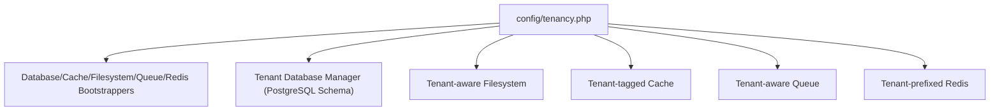

**Diagram sources**
- [tenancy.php:21-58](file://config/tenancy.php#L21-L58)

**Section sources**
- [tenancy.php:21-58](file://config/tenancy.php#L21-L58)

## Detailed Component Analysis

### Tenant Model
The Tenant model extends the tenancy base tenant and integrates database and domain concerns. It defines fillable attributes, custom columns, array casting for data, and relations to users, courses, graduates, employers, and jobs. These relations are scoped appropriately to tenant context.

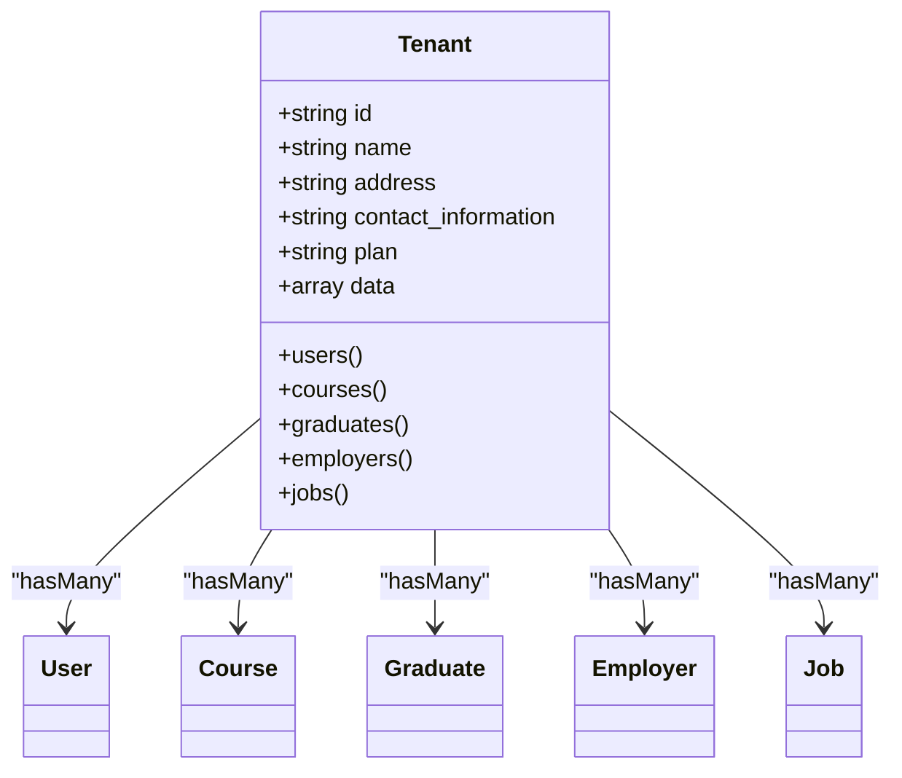

**Diagram sources**
- [Tenant.php:11-85](file://app/Models/Tenant.php#L11-L85)

**Section sources**
- [Tenant.php:11-85](file://app/Models/Tenant.php#L11-L85)

### Domain Model and Routing
The Domain model manages tenant domains with central connection, tenant relationship, and event hooks. It enforces domain uniqueness and lowercases domain names. The domains table supports status, primary flag, SSL, DNS records, and verification timestamps.

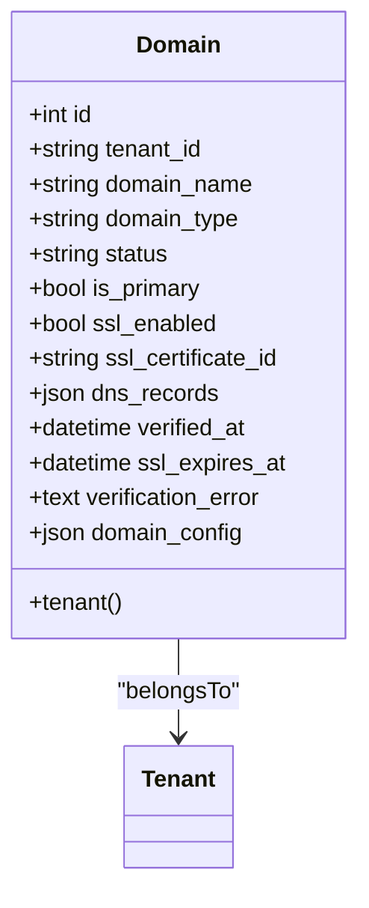

**Diagram sources**
- [Domain.php:12-58](file://app/Models/Domain.php#L12-L58)
- [2024_01_01_000001_create_domains_table.php:14-23](file://database/migrations/2024_01_01_000001_create_domains_table.php#L14-L23)
- [2025_09_05_080622_create_domains_table.php:62-86](file://database/migrations/2025_09_05_080622_create_domains_table.php#L62-L86)

**Section sources**
- [Domain.php:12-58](file://app/Models/Domain.php#L12-L58)
- [2024_01_01_000001_create_domains_table.php:14-23](file://database/migrations/2024_01_01_000001_create_domains_table.php#L14-L23)
- [2025_09_05_080622_create_domains_table.php:12-87](file://database/migrations/2025_09_05_080622_create_domains_table.php#L12-L87)

### Tenant Lifecycle Operations

#### Creation
- Create a tenant record with identifier, name, address, contact info, plan, and optional data.
- Associate domains to the tenant; domain statuses can reflect pending/verifying/verified/failed.
- Migrate and seed tenant-specific schema using configured migration parameters.

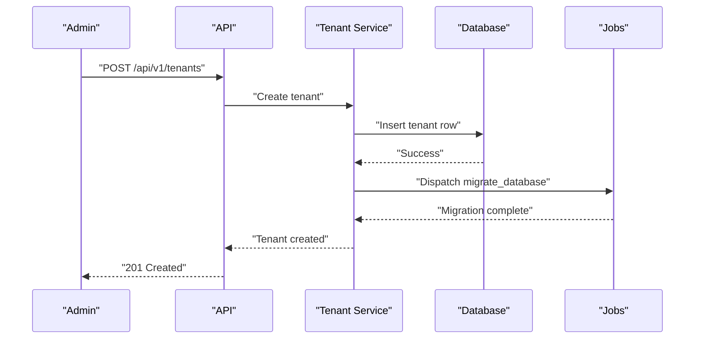

**Diagram sources**
- [tenancy.php:66-81](file://config/tenancy.php#L66-L81)
- [2024_01_01_000000_create_tenants_table.php:14-25](file://database/migrations/2024_01_01_000000_create_tenants_table.php#L14-L25)

#### Activation
- Configure domain(s) for the tenant and set status to verified upon successful DNS/SSL checks.
- Bootstrappers activate tenant isolation for cache, filesystem, queue, and Redis.

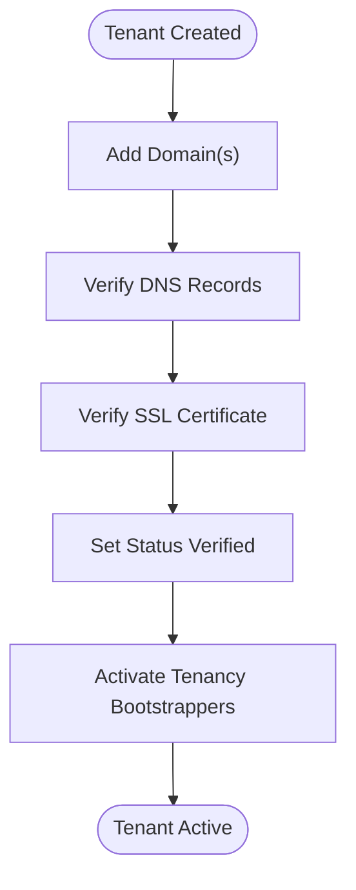

**Diagram sources**
- [2025_09_05_080622_create_domains_table.php:62-86](file://database/migrations/2025_09_05_080622_create_domains_table.php#L62-L86)
- [tenancy.php:21-27](file://config/tenancy.php#L21-L27)

#### Suspension
- Transition domain status to suspended or failed to restrict access.
- Optionally disable tenant-specific features via feature flags.

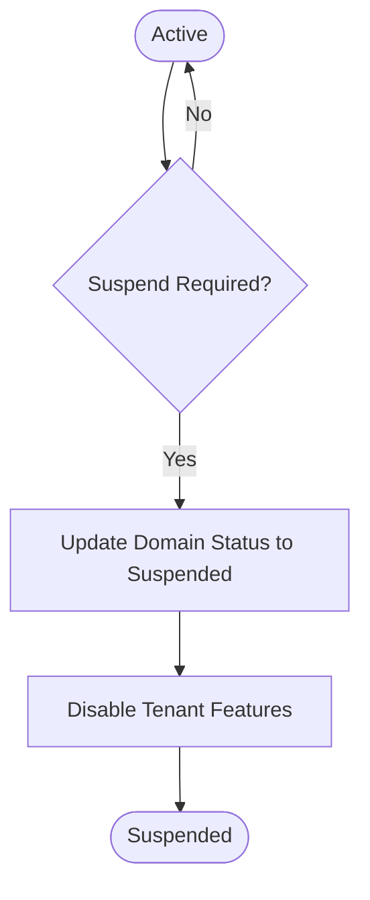

**Diagram sources**
- [2025_09_05_080622_create_domains_table.php:66-68](file://database/migrations/2025_09_05_080622_create_domains_table.php#L66-L68)
- [deployment-plan.md:1040-1113](file://deployment-plan.md#L1040-L1113)

#### Termination
- Dispatch job to delete tenant database and clean up resources.
- Remove domain associations and central records.

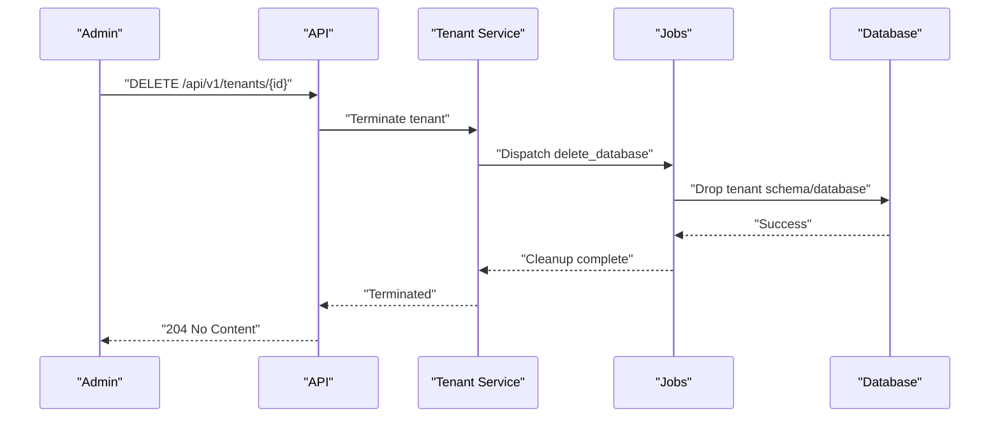

**Diagram sources**
- [tenancy.php:76-81](file://config/tenancy.php#L76-L81)

### Tenant Management Interface
The API layer exposes tenant-scoped endpoints for templates, landing pages, brand assets, analytics, and A/B tests. These endpoints include listing, retrieving, creating, updating, deleting, publishing, duplicating, and starting tests. Bulk operations can be implemented by iterating over tenant IDs and invoking respective endpoints.

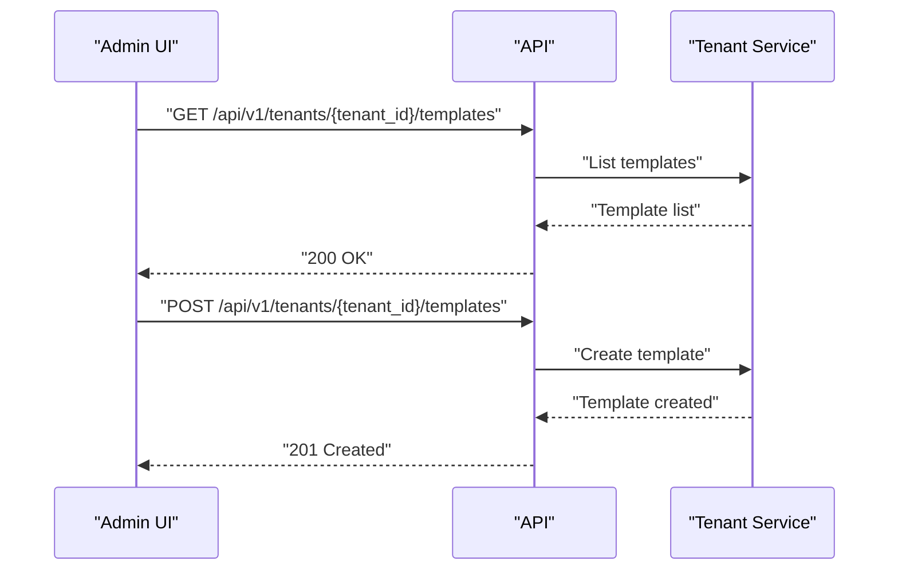

**Diagram sources**
- [api-layer-plan.md:96-141](file://api-layer-plan.md#L96-L141)

**Section sources**
- [api-layer-plan.md:96-141](file://api-layer-plan.md#L96-L141)

### Tenant Configuration Management
- Domain assignment: Domains table stores domain_name, type, status, primary flag, SSL fields, DNS records, and verification timestamps. Unique constraint prevents conflicts.
- Subdomain setup: Domain type supports custom/subdomain/tenant; subdomain resolution is managed by routing and domain records.
- Plan selection: Tenant plan stored in the tenants table; can drive feature availability and resource limits.

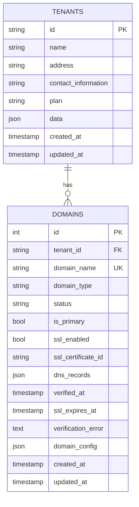

**Diagram sources**
- [2024_01_01_000000_create_tenants_table.php:16-24](file://database/migrations/2024_01_01_000000_create_tenants_table.php#L16-L24)
- [2024_01_01_000001_create_domains_table.php:16-23](file://database/migrations/2024_01_01_000001_create_domains_table.php#L16-L23)
- [2025_09_05_080622_create_domains_table.php:62-86](file://database/migrations/2025_09_05_080622_create_domains_table.php#L62-L86)

**Section sources**
- [2024_01_01_000000_create_tenants_table.php:16-24](file://database/migrations/2024_01_01_000000_create_tenants_table.php#L16-L24)
- [2024_01_01_000001_create_domains_table.php:16-23](file://database/migrations/2024_01_01_000001_create_domains_table.php#L16-L23)
- [2025_09_05_080622_create_domains_table.php:62-86](file://database/migrations/2025_09_05_080622_create_domains_table.php#L62-L86)

### Tenant-Specific Settings, Feature Toggles, and Business Rules
- Feature flags: A feature flag service enables/disables features per environment and rollout percentage, optionally considering tenant ID for hashing.
- Business rules: Can be enforced via policies, middleware, or service-level checks before applying tenant-scoped operations.

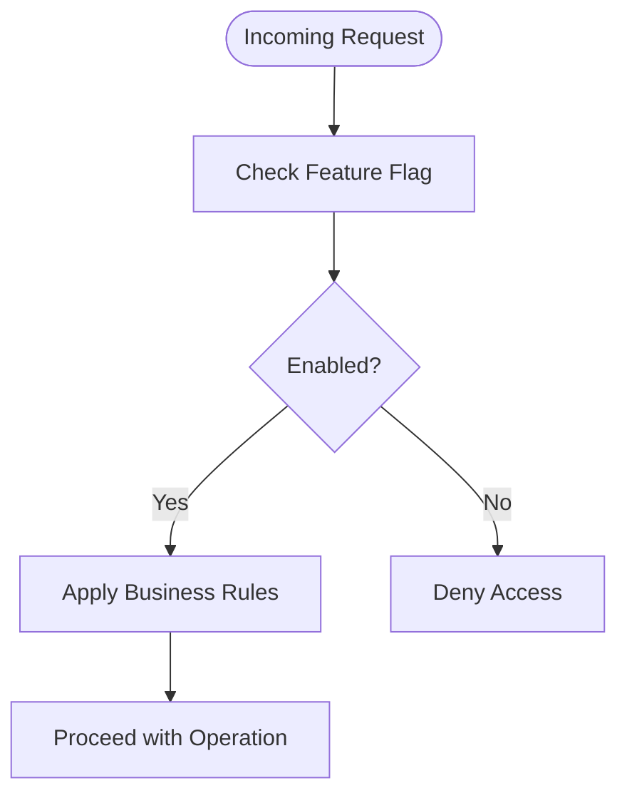

**Diagram sources**
- [deployment-plan.md:1040-1113](file://deployment-plan.md#L1040-L1113)

**Section sources**
- [deployment-plan.md:1040-1113](file://deployment-plan.md#L1040-L1113)

### Tenant Switching Mechanisms
- Domain-based switching: Requests are routed to tenant contexts via domain resolution using the domains table.
- Bootstrappers ensure cache, filesystem, queue, and Redis are tenant-aware, preventing cross-tenant leakage.

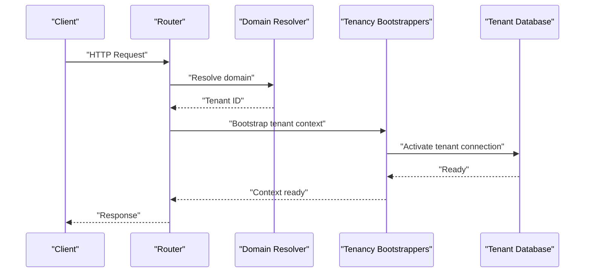

**Diagram sources**
- [Domain.php:19-22](file://app/Models/Domain.php#L19-L22)
- [tenancy.php:21-27](file://config/tenancy.php#L21-L27)

**Section sources**
- [Domain.php:19-22](file://app/Models/Domain.php#L19-L22)
- [tenancy.php:21-27](file://config/tenancy.php#L21-L27)

### Data Isolation During Tenant Changes
- Tenant-aware models and automatic scoping ensure queries remain isolated.
- Central connection for domain and tenant records prevents leakage into tenant scopes.
- Indexes on domains improve lookup performance for tenant resolution.

**Section sources**
- [Domain.php:14-15](file://app/Models/Domain.php#L14-L15)
- [2025_09_05_080622_create_domains_table.php:54-58](file://database/migrations/2025_09_05_080622_create_domains_table.php#L54-L58)

### Practical Examples of Workflows
- Tenant onboarding: Create tenant → add domains → verify DNS/SSL → activate bootstrappers → seed tenant data.
- Plan upgrade/downgrade: Update tenant plan → adjust feature flags → notify users.
- Domain migration: Update domain record → re-verify → switch routing.
- Bulk operations: Iterate tenant IDs and invoke API endpoints for batch updates.

**Section sources**
- [2025_09_05_080622_create_domains_table.php:62-86](file://database/migrations/2025_09_05_080622_create_domains_table.php#L62-L86)
- [deployment-plan.md:1040-1113](file://deployment-plan.md#L1040-L1113)

### Administrative Controls and Health Monitoring
- Centralized super admin management and tenant status monitoring are documented.
- Automated health checks and maintenance tools support operational efficiency.

**Section sources**
- [README.md:54-58](file://README.md#L54-L58)
- [task-03-multi-tenant-enhancement-recap.md:218-250](file://docs/task-03-multi-tenant-enhancement-recap.md#L218-L250)

### Backup and Restore Procedures, Data Archival, and Compliance
- Disaster recovery plan includes assessing damage, restoring database and files, verifying integrity, restarting services, and monitoring recovery.
- Backup records capture metadata per component and tenant for auditability.

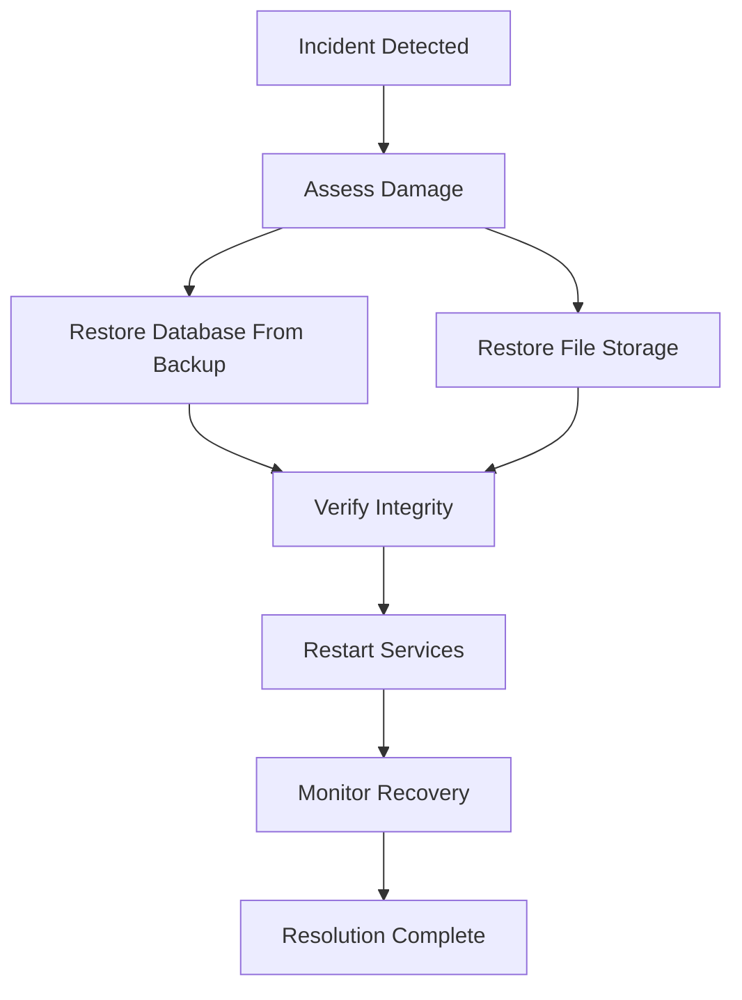

**Diagram sources**
- [deployment-plan.md:635-717](file://deployment-plan.md#L635-L717)

**Section sources**
- [deployment-plan.md:635-717](file://deployment-plan.md#L635-L717)

## Dependency Analysis
The tenant and domain models depend on the central configuration and tenancy bootstrappers. Tenant-scoped tables depend on the tenant model. The API layer depends on tenant-scoped endpoints.

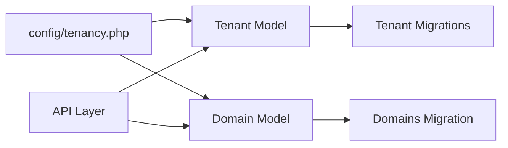

**Diagram sources**
- [tenancy.php:12-14](file://config/tenancy.php#L12-L14)
- [Tenant.php:11-13](file://app/Models/Tenant.php#L11-L13)
- [Domain.php:12-22](file://app/Models/Domain.php#L12-L22)
- [2024_01_01_000000_create_tenants_table.php:16-24](file://database/migrations/2024_01_01_000000_create_tenants_table.php#L16-L24)
- [2024_01_01_000001_create_domains_table.php:16-23](file://database/migrations/2024_01_01_000001_create_domains_table.php#L16-L23)

**Section sources**
- [tenancy.php:12-14](file://config/tenancy.php#L12-L14)
- [Tenant.php:11-13](file://app/Models/Tenant.php#L11-L13)
- [Domain.php:12-22](file://app/Models/Domain.php#L12-L22)

## Performance Considerations
- Use indexes on domains (tenant_id, status), domain_name, status/verified_at, and is_primary to optimize tenant resolution and filtering.
- Tenant isolation reduces cross-tenant contention but requires careful cache tagging and filesystem suffixing.
- Migration and seeding parameters target tenant migrations to minimize overhead.

**Section sources**
- [2025_09_05_080622_create_domains_table.php:54-58](file://database/migrations/2025_09_05_080622_create_domains_table.php#L54-L58)
- [tenancy.php:66-75](file://config/tenancy.php#L66-L75)

## Troubleshooting Guide
Common issues and resolutions:
- Domain occupied: Saving a domain that belongs to another tenant raises an exception; choose a unique domain.
- Domain normalization: Domains are converted to lowercase automatically; ensure consistent casing in requests.
- Tenant isolation failures: Verify bootstrappers are active and tenant context is resolved before accessing tenant data.
- Database operations: Use provided job handlers for create/migrate/seed/delete to ensure proper isolation and cleanup.

**Section sources**
- [Domain.php:38-57](file://app/Models/Domain.php#L38-L57)
- [tenancy.php:21-27](file://config/tenancy.php#L21-L27)
- [tenancy.php:76-81](file://config/tenancy.php#L76-L81)

## Conclusion
The platform implements a robust, scalable, and secure multi-tenant architecture with complete data isolation, domain-based routing, tenant lifecycle management, and operational tooling for monitoring and disaster recovery. The API layer and configuration provide a solid foundation for tenant administration, feature control, and compliance.

## Appendices
- Tenant-scoped tables include courses, graduates, graduate profiles, posts, circles/groups, and performance monitoring tables.
- Provider bootstrapping ensures tenancy middleware is applied appropriately to tenant routes.

**Section sources**
- [2024_01_01_000003_create_courses_table.php](file://database/migrations/tenant/2024_01_01_000003_create_courses_table.php)
- [2024_01_01_000004_create_graduates_table.php](file://database/migrations/tenant/2024_01_01_000004_create_graduates_table.php)
- [2024_01_01_000007_create_graduate_profiles_table.php](file://database/migrations/tenant/2024_01_01_000007_create_graduate_profiles_table.php)
- [2025_01_29_000003_create_posts_table.php](file://database/migrations/tenant/2025_01_29_000003_create_posts_table.php)
- [2025_01_29_000004_create_circles_and_groups_tables.php](file://database/migrations/tenant/2025_01_29_000004_create_circles_and_groups_tables.php)
- [2025_01_30_000001_create_performance_monitoring_tables.php](file://database/migrations/tenant/2025_01_30_000001_create_performance_monitoring_tables.php)
- [2025_07_14_061212_add_marital_status_and_hobbies_to_graduate_profiles_table.php](file://database/migrations/tenant/2025_07_14_061212_add_marital_status_and_hobbies_to_graduate_profiles_table.php)
- [2025_07_14_061213_add_high_school_and_primary_school_to_graduate_profiles_table.php](file://database/migrations/tenant/2025_07_14_061213_add_high_school_and_primary_school_to_graduate_profiles_table.php)
- [TenancyServiceProvider.php:24-40](file://app/Providers/TenancyServiceProvider.php#L24-L40)