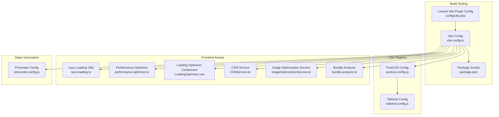
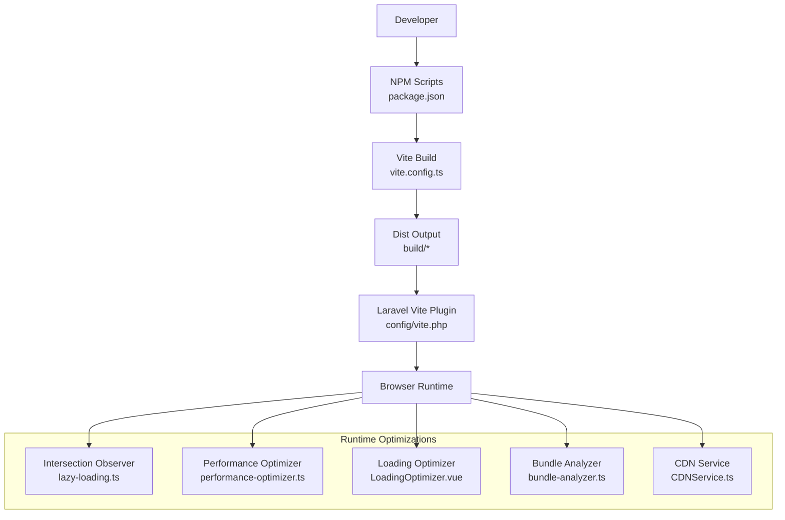
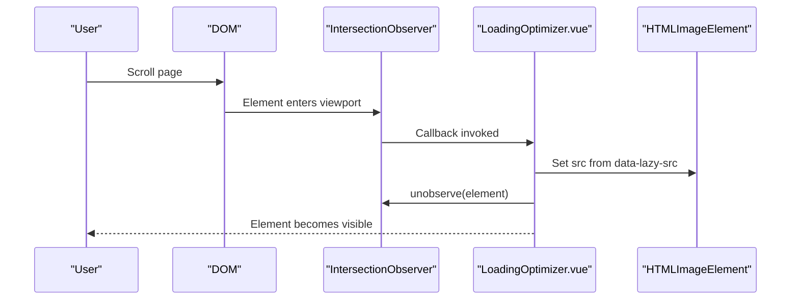
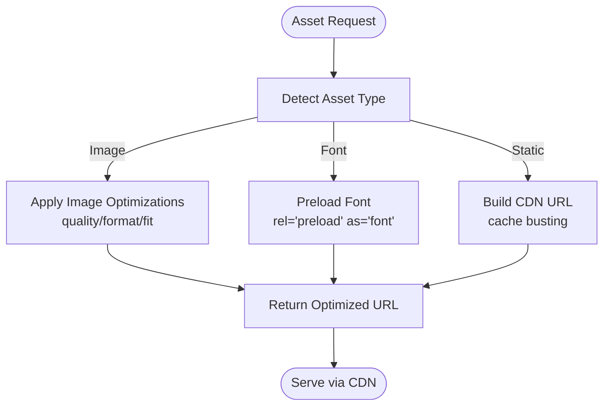
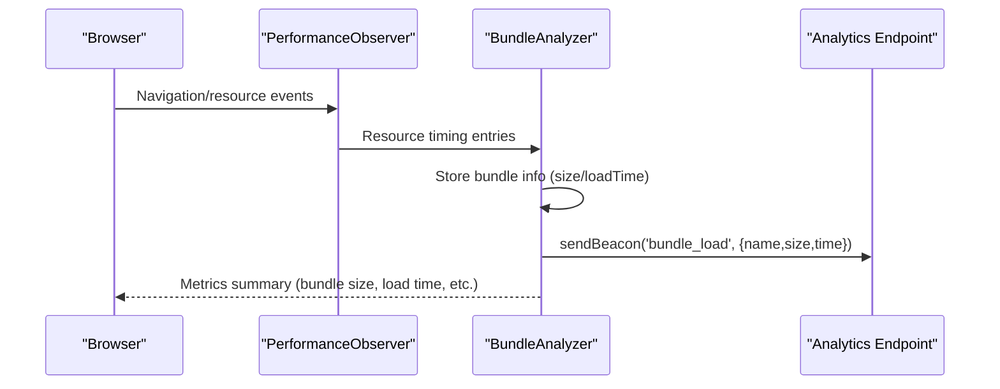
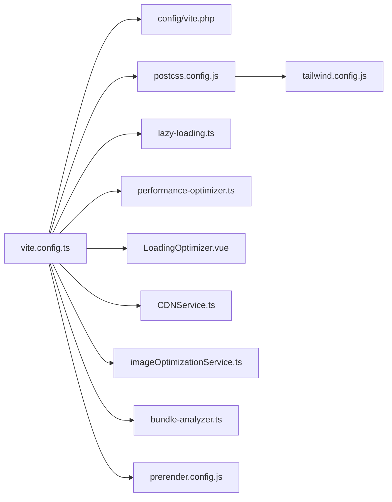

# Asset Delivery & Bundling

<cite>
**Referenced Files in This Document**
- [vite.config.ts](file://vite.config.ts)
- [package.json](file://package.json)
- [config/vite.php](file://config/vite.php)
- [postcss.config.js](file://postcss.config.js)
- [tailwind.config.js](file://tailwind.config.js)
- [prerender.config.js](file://prerender.config.js)
- [resources/js/utils/lazy-loading.ts](file://resources/js/utils/lazy-loading.ts)
- [resources/js/Utils/performance-optimizer.ts](file://resources/js/Utils/performance-optimizer.ts)
- [resources/js/components/Performance/LoadingOptimizer.vue](file://resources/js/components/Performance/LoadingOptimizer.vue)
- [resources/js/utils/bundle-analyzer.ts](file://resources/js/utils/bundle-analyzer.ts)
- [resources/js/services/CDNService.ts](file://resources/js/services/CDNService.ts)
- [resources/js/services/imageOptimizationService.ts](file://resources/js/services/imageOptimizationService.ts)
- [app/Services/PerformanceOptimizationService.php](file://app/Services/PerformanceOptimizationService.php)
- [resources/js/Utils/accessibility-performance-setup.js](file://resources/js/Utils/accessibility-performance-setup.js)
- [resources/js/Pages/Test/PerformanceOptimization.vue](file://resources/js/Pages/Test/PerformanceOptimization.vue)
</cite>

## Table of Contents
1. [Introduction](#introduction)
2. [Project Structure](#project-structure)
3. [Core Components](#core-components)
4. [Architecture Overview](#architecture-overview)
5. [Detailed Component Analysis](#detailed-component-analysis)
6. [Dependency Analysis](#dependency-analysis)
7. [Performance Considerations](#performance-considerations)
8. [Troubleshooting Guide](#troubleshooting-guide)
9. [Conclusion](#conclusion)
10. [Appendices](#appendices)

## Introduction
This document focuses on asset delivery and bundling optimization for the frontend build pipeline. It explains Vite configuration for production builds, code splitting and chunking strategies, lazy loading of components, images, and modules using the Intersection Observer API, asset compression and minification, CDN integration, performance monitoring, bundle size analysis, caching headers, responsive image optimization, font loading strategies, critical CSS extraction, progressive loading, preloading strategies, and browser caching optimization. It also provides examples of performance budgets, asset performance metrics, and troubleshooting slow-loading assets.

## Project Structure
The asset pipeline integrates Vite for bundling and dev server, Laravel’s Vite integration for manifest-based asset serving, PostCSS/Tailwind for CSS processing, and a suite of client-side utilities and services for performance optimization, lazy loading, and CDN integration.

**Diagram sources**
- [vite.config.ts:1-163](file://vite.config.ts#L1-L163)
- [package.json:1-90](file://package.json#L1-L90)
- [config/vite.php:1-55](file://config/vite.php#L1-L55)
- [postcss.config.js:1-7](file://postcss.config.js#L1-L7)
- [tailwind.config.js:1-106](file://tailwind.config.js#L1-L106)
- [prerender.config.js:1-32](file://prerender.config.js#L1-L32)
- [resources/js/utils/lazy-loading.ts:48-83](file://resources/js/utils/lazy-loading.ts#L48-L83)
- [resources/js/Utils/performance-optimizer.ts:94-135](file://resources/js/Utils/performance-optimizer.ts#L94-L135)
- [resources/js/components/Performance/LoadingOptimizer.vue:220-300](file://resources/js/components/Performance/LoadingOptimizer.vue#L220-L300)
- [resources/js/services/CDNService.ts:169-212](file://resources/js/services/CDNService.ts#L169-L212)
- [resources/js/services/imageOptimizationService.ts:261-308](file://resources/js/services/imageOptimizationService.ts#L261-L308)
- [resources/js/utils/bundle-analyzer.ts:1-239](file://resources/js/utils/bundle-analyzer.ts#L1-L239)

**Section sources**
- [vite.config.ts:1-163](file://vite.config.ts#L1-L163)
- [package.json:1-90](file://package.json#L1-L90)
- [config/vite.php:1-55](file://config/vite.php#L1-L55)
- [postcss.config.js:1-7](file://postcss.config.js#L1-L7)
- [tailwind.config.js:1-106](file://tailwind.config.js#L1-L106)
- [prerender.config.js:1-32](file://prerender.config.js#L1-L32)

## Core Components
- Vite configuration defines input entries, plugins, code splitting via manualChunks, chunk naming, asset naming, minification, sourcemaps, and dev server/proxy settings.
- Laravel Vite plugin configuration controls dev server URL, build path, manifest location, and hot file path for asset resolution.
- PostCSS and Tailwind handle CSS processing and design system utilities.
- Lazy loading utilities and components integrate Intersection Observer for deferred loading of images and components.
- CDN service centralizes asset URL construction, format selection, and cache busting.
- Bundle analyzer tracks resource timing, navigation metrics, and emits analytics.
- Performance optimization utilities add responsive image support, WebP detection, and compression.
- Prerender configuration lists static routes for SEO and performance.

**Section sources**
- [vite.config.ts:6-163](file://vite.config.ts#L6-L163)
- [config/vite.php:13-54](file://config/vite.php#L13-L54)
- [postcss.config.js:1-7](file://postcss.config.js#L1-L7)
- [tailwind.config.js:1-106](file://tailwind.config.js#L1-L106)
- [resources/js/utils/lazy-loading.ts:48-83](file://resources/js/utils/lazy-loading.ts#L48-L83)
- [resources/js/Utils/performance-optimizer.ts:94-135](file://resources/js/Utils/performance-optimizer.ts#L94-L135)
- [resources/js/components/Performance/LoadingOptimizer.vue:220-300](file://resources/js/components/Performance/LoadingOptimizer.vue#L220-L300)
- [resources/js/services/CDNService.ts:169-212](file://resources/js/services/CDNService.ts#L169-L212)
- [resources/js/utils/bundle-analyzer.ts:1-239](file://resources/js/utils/bundle-analyzer.ts#L1-L239)
- [prerender.config.js:1-32](file://prerender.config.js#L1-L32)

## Architecture Overview
The build and runtime architecture combines Vite for bundling, Laravel for manifest-based asset serving, and client-side performance utilities.

**Diagram sources**
- [package.json:4-21](file://package.json#L4-L21)
- [vite.config.ts:6-163](file://vite.config.ts#L6-L163)
- [config/vite.php:13-54](file://config/vite.php#L13-L54)
- [resources/js/utils/lazy-loading.ts:48-83](file://resources/js/utils/lazy-loading.ts#L48-L83)
- [resources/js/Utils/performance-optimizer.ts:94-135](file://resources/js/Utils/performance-optimizer.ts#L94-L135)
- [resources/js/components/Performance/LoadingOptimizer.vue:220-300](file://resources/js/components/Performance/LoadingOptimizer.vue#L220-L300)
- [resources/js/utils/bundle-analyzer.ts:1-239](file://resources/js/utils/bundle-analyzer.ts#L1-L239)
- [resources/js/services/CDNService.ts:169-212](file://resources/js/services/CDNService.ts#L169-L212)

## Detailed Component Analysis

### Vite Configuration for Production Builds
- Inputs include CSS and TypeScript entrypoints.
- Plugins: Laravel Vite plugin for manifest-based asset resolution and Vue plugin with asset URL transformation.
- Rollup output configuration:
  - manualChunks groups vendor, utility, and UI libraries into dedicated chunks.
  - Dynamic chunk naming for component libraries, admin, and analytics pages.
  - Asset naming separates images, fonts, and CSS into organized folders.
- Build targets modern browsers, enables esbuild minification, compresses CSS, disables sourcemaps in production, and sets a higher chunk size warning limit.
- Dev server configuration includes host, port, CORS, and proxy for API traffic.
- Dependency optimization excludes large libraries from pre-bundling and includes core dependencies.

**Section sources**
- [vite.config.ts:6-163](file://vite.config.ts#L6-L163)

### Code Splitting Strategies
- Vendor chunk isolates core libraries (Vue, Inertia, Axios).
- Utilities chunk consolidates lodash-es and date-fns.
- UI chunk groups Headless UI, Lucide icons, and Floating UI.
- Dynamic chunk naming splits large component libraries, admin, and analytics into separate files.
- Asset chunk naming organizes images, fonts, and CSS into dedicated folders.

**Section sources**
- [vite.config.ts:25-96](file://vite.config.ts#L25-L96)

### Bundle Optimization Techniques
- Minification via esbuild and CSS minification.
- Sourcemaps disabled in production to reduce bundle size.
- Target set to ES2015 for modern browser compatibility.
- Chunk size warning increased to reduce noisy warnings during development.

**Section sources**
- [vite.config.ts:99-108](file://vite.config.ts#L99-L108)

### Lazy Loading Implementation (Images, Modules, Components)
- Intersection Observer utilities:
  - createIntersectionObserver with default root margin and thresholds.
  - lazyLoadImage defers image loading until intersecting.
- Performance optimizer:
  - Watches DOM mutations to observe newly added lazy elements.
  - Loads images, components, and resources when they become visible.
- Loading Optimizer component:
  - Sets up Intersection Observer to trigger lazy loading of elements with data attributes.
  - Preloads critical resources (CSS, images, fonts) using rel="preload".
- Lazy loading directives/data attributes:
  - data-lazy-src for deferred script/link sources.
  - data-lazy-component for component lazy loading triggers.
  - loading="lazy" on images.

**Diagram sources**
- [resources/js/components/Performance/LoadingOptimizer.vue:220-262](file://resources/js/components/Performance/LoadingOptimizer.vue#L220-L262)
- [resources/js/utils/lazy-loading.ts:48-83](file://resources/js/utils/lazy-loading.ts#L48-L83)
- [resources/js/Utils/performance-optimizer.ts:94-135](file://resources/js/Utils/performance-optimizer.ts#L94-L135)

**Section sources**
- [resources/js/utils/lazy-loading.ts:48-83](file://resources/js/utils/lazy-loading.ts#L48-L83)
- [resources/js/Utils/performance-optimizer.ts:94-135](file://resources/js/Utils/performance-optimizer.ts#L94-L135)
- [resources/js/components/Performance/LoadingOptimizer.vue:220-300](file://resources/js/components/Performance/LoadingOptimizer.vue#L220-L300)

### Asset Compression, Minification, and CDN Integration
- Vite minifies JavaScript and CSS using esbuild and CSS minification.
- CDN service:
  - Builds CDN URLs, supports prefetch and preload.
  - Provides font URL with preload and CORS handling.
  - Adds image optimizations (quality, format, fit) and cache busting.
- Backend service configures CDN cache headers for images, CSS/JS, fonts, and documents.

**Diagram sources**
- [resources/js/services/CDNService.ts:169-212](file://resources/js/services/CDNService.ts#L169-L212)
- [resources/js/services/CDNService.ts:211-258](file://resources/js/services/CDNService.ts#L211-L258)
- [resources/js/services/imageOptimizationService.ts:261-308](file://resources/js/services/imageOptimizationService.ts#L261-L308)
- [app/Services/PerformanceOptimizationService.php:669-692](file://app/Services/PerformanceOptimizationService.php#L669-L692)

**Section sources**
- [vite.config.ts:100-108](file://vite.config.ts#L100-L108)
- [resources/js/services/CDNService.ts:169-212](file://resources/js/services/CDNService.ts#L169-L212)
- [resources/js/services/CDNService.ts:211-258](file://resources/js/services/CDNService.ts#L211-L258)
- [resources/js/services/imageOptimizationService.ts:261-308](file://resources/js/services/imageOptimizationService.ts#L261-L308)
- [app/Services/PerformanceOptimizationService.php:669-692](file://app/Services/PerformanceOptimizationService.php#L669-L692)

### Performance Monitoring, Bundle Size Analysis, and Caching Headers
- Bundle analyzer:
  - Tracks navigation and resource timing via PerformanceObserver.
  - Extracts bundle names and sizes from resource entries.
  - Emits analytics events and generates reports.
- Performance metrics exposed include bundle size, load time, first contentful paint, time to interactive, memory usage, and network requests.
- Caching headers configured in backend service for images, CSS/JS, fonts, and documents.

**Diagram sources**
- [resources/js/utils/bundle-analyzer.ts:33-50](file://resources/js/utils/bundle-analyzer.ts#L33-L50)
- [resources/js/utils/bundle-analyzer.ts:80-93](file://resources/js/utils/bundle-analyzer.ts#L80-L93)
- [resources/js/utils/bundle-analyzer.ts:155-197](file://resources/js/utils/bundle-analyzer.ts#L155-L197)

**Section sources**
- [resources/js/utils/bundle-analyzer.ts:1-239](file://resources/js/utils/bundle-analyzer.ts#L1-L239)
- [app/Services/PerformanceOptimizationService.php:669-692](file://app/Services/PerformanceOptimizationService.php#L669-L692)

### Responsive Image Optimization and Font Loading Strategies
- Responsive images:
  - Detects images without srcset and augments URLs with device pixel ratio and dimensions.
  - Adds WebP support detection and compression.
- Font loading:
  - Preloads fonts with cross-origin and explicit MIME type.
  - Supports prefetch for off-main-thread preparation.

**Section sources**
- [resources/js/Utils/performance-optimizer.ts:181-226](file://resources/js/Utils/performance-optimizer.ts#L181-L226)
- [resources/js/services/CDNService.ts:183-197](file://resources/js/services/CDNService.ts#L183-L197)

### Critical CSS Extraction and Progressive Loading
- Critical CSS can be marked for preload via data attributes on link elements.
- Progressive loading is achieved by deferring non-critical resources and components using Intersection Observer and data-lazy-* attributes.

**Section sources**
- [resources/js/components/Performance/LoadingOptimizer.vue:264-300](file://resources/js/components/Performance/LoadingOptimizer.vue#L264-L300)

### Preloading Strategies and Browser Caching Optimization
- Preload critical CSS, images, and fonts to improve first paint.
- Backend sets long-lived immutable cache headers for static assets and shorter cache for documents.

**Section sources**
- [resources/js/components/Performance/LoadingOptimizer.vue:264-300](file://resources/js/components/Performance/LoadingOptimizer.vue#L264-L300)
- [app/Services/PerformanceOptimizationService.php:669-692](file://app/Services/PerformanceOptimizationService.php#L669-L692)

### Performance Budgets and Metrics
- Performance budgets defined for Core Web Vitals and custom metrics.
- Periodic monitoring checks averages against budgets and records violations.

**Section sources**
- [resources/js/Utils/accessibility-performance-setup.js:204-247](file://resources/js/Utils/accessibility-performance-setup.js#L204-L247)

### Troubleshooting Slow-Loading Assets
- Use the bundle analyzer to inspect per-bundle sizes and load times.
- Verify preload links for critical resources.
- Confirm CDN URL generation and image optimization parameters.
- Review Intersection Observer thresholds and root margins for lazy loading.

**Section sources**
- [resources/js/utils/bundle-analyzer.ts:137-148](file://resources/js/utils/bundle-analyzer.ts#L137-L148)
- [resources/js/components/Performance/LoadingOptimizer.vue:264-300](file://resources/js/components/Performance/LoadingOptimizer.vue#L264-L300)
- [resources/js/services/CDNService.ts:211-258](file://resources/js/services/CDNService.ts#L211-L258)

## Dependency Analysis
The build pipeline depends on Vite and plugins, while runtime optimizations depend on browser APIs and centralized services.

**Diagram sources**
- [vite.config.ts:6-163](file://vite.config.ts#L6-L163)
- [config/vite.php:13-54](file://config/vite.php#L13-L54)
- [postcss.config.js:1-7](file://postcss.config.js#L1-L7)
- [tailwind.config.js:1-106](file://tailwind.config.js#L1-L106)
- [resources/js/utils/lazy-loading.ts:48-83](file://resources/js/utils/lazy-loading.ts#L48-L83)
- [resources/js/Utils/performance-optimizer.ts:94-135](file://resources/js/Utils/performance-optimizer.ts#L94-L135)
- [resources/js/components/Performance/LoadingOptimizer.vue:220-300](file://resources/js/components/Performance/LoadingOptimizer.vue#L220-L300)
- [resources/js/services/CDNService.ts:169-212](file://resources/js/services/CDNService.ts#L169-L212)
- [resources/js/services/imageOptimizationService.ts:261-308](file://resources/js/services/imageOptimizationService.ts#L261-L308)
- [resources/js/utils/bundle-analyzer.ts:1-239](file://resources/js/utils/bundle-analyzer.ts#L1-L239)
- [prerender.config.js:1-32](file://prerender.config.js#L1-L32)

**Section sources**
- [vite.config.ts:6-163](file://vite.config.ts#L6-L163)
- [package.json:4-21](file://package.json#L4-L21)

## Performance Considerations
- Keep chunk sizes reasonable; leverage manualChunks and dynamic chunk naming to split large features.
- Prefer lazy loading for non-critical images and components; tune Intersection Observer thresholds and root margins.
- Use preload for critical resources; defer others.
- Enable CDN with appropriate cache headers and image optimizations.
- Monitor bundle size and load times; enforce performance budgets.

[No sources needed since this section provides general guidance]

## Troubleshooting Guide
- If assets fail to load in production, verify Laravel Vite manifest path and build directory alignment.
- If lazy loading does not trigger, check Intersection Observer availability and thresholds.
- If images appear blurry, confirm responsive image generation and device pixel ratio calculations.
- If fonts block rendering, ensure preload with proper MIME type and crossOrigin attributes.
- If bundles are oversized, review manualChunks and remove unused dependencies.

**Section sources**
- [config/vite.php:28-54](file://config/vite.php#L28-L54)
- [resources/js/utils/lazy-loading.ts:48-83](file://resources/js/utils/lazy-loading.ts#L48-L83)
- [resources/js/Utils/performance-optimizer.ts:181-226](file://resources/js/Utils/performance-optimizer.ts#L181-L226)
- [resources/js/services/CDNService.ts:183-197](file://resources/js/services/CDNService.ts#L183-L197)

## Conclusion
The asset delivery and bundling system leverages Vite for robust production builds, strategic code splitting, and optimized asset naming. Client-side utilities implement Intersection Observer-based lazy loading, responsive image optimization, and CDN integration. Performance monitoring and caching headers further enhance speed and reliability. By tuning thresholds, preload strategies, and budgets, teams can maintain fast, efficient frontends.

[No sources needed since this section summarizes without analyzing specific files]

## Appendices
- Example performance budgets and metrics are defined in the accessibility performance setup utility.
- The performance optimization page surfaces bundle analysis and reporting capabilities.

**Section sources**
- [resources/js/Utils/accessibility-performance-setup.js:204-247](file://resources/js/Utils/accessibility-performance-setup.js#L204-L247)
- [resources/js/Pages/Test/PerformanceOptimization.vue:76-112](file://resources/js/Pages/Test/PerformanceOptimization.vue#L76-L112)