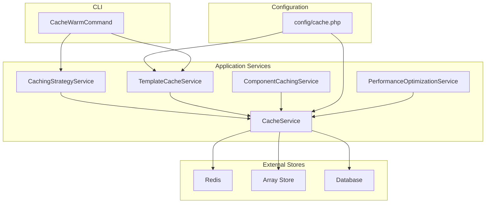
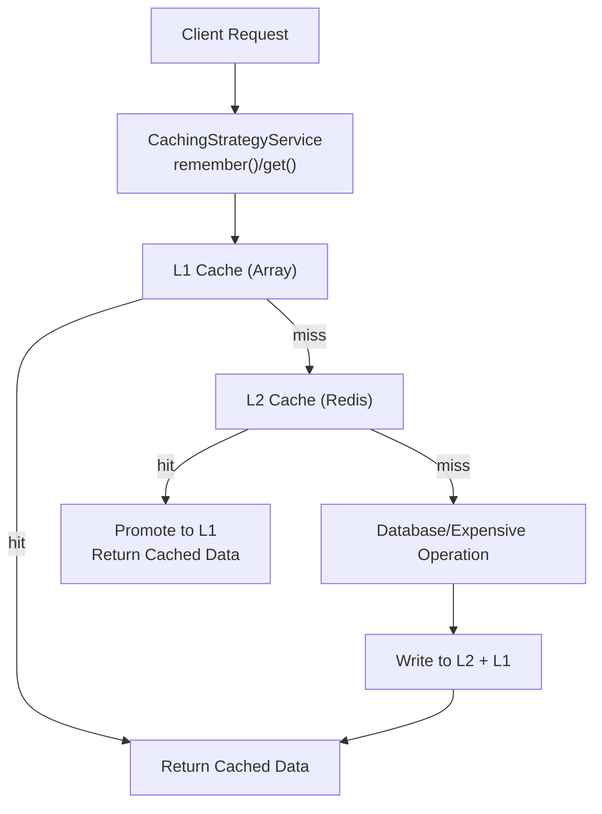
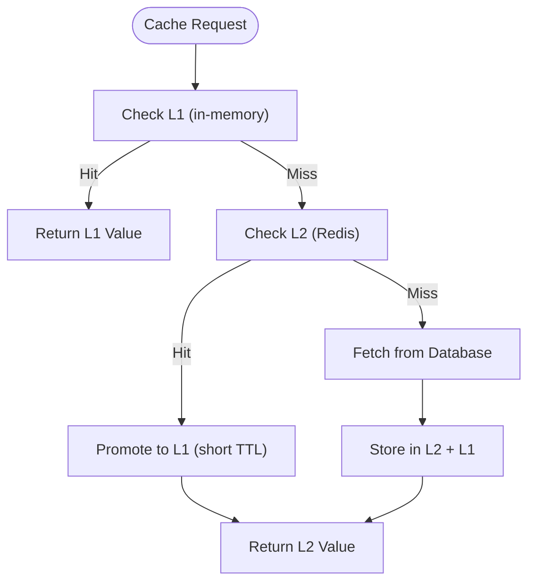
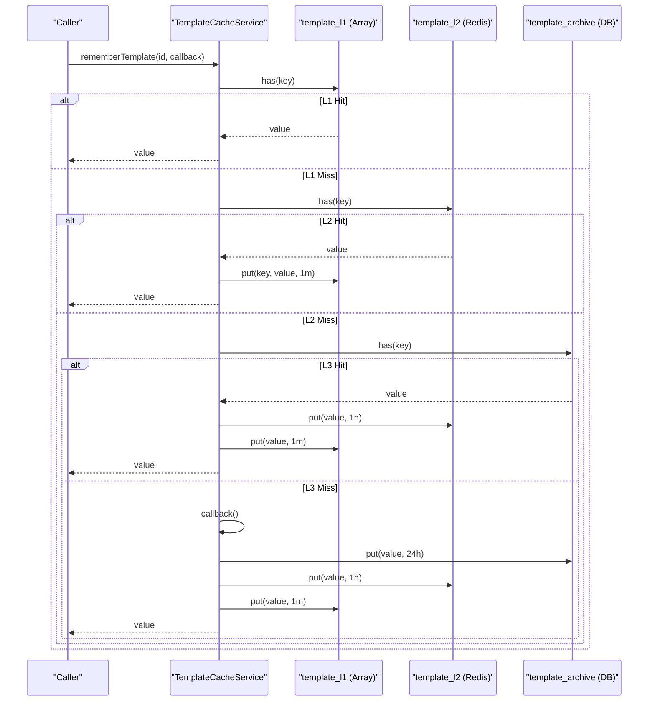
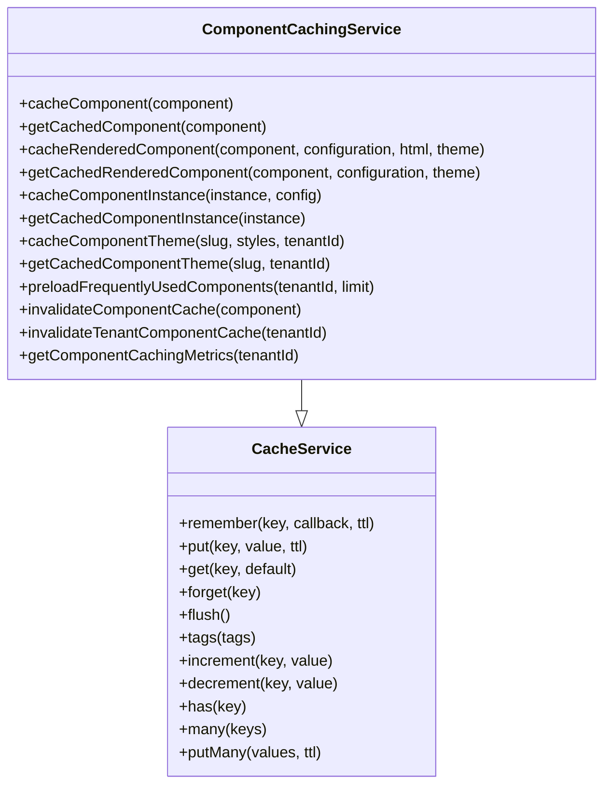
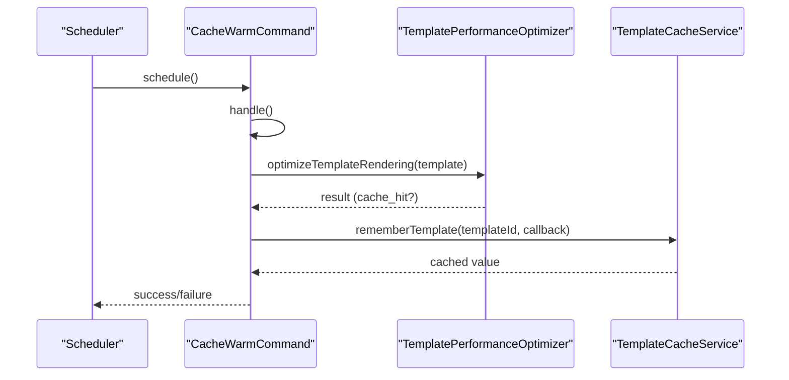
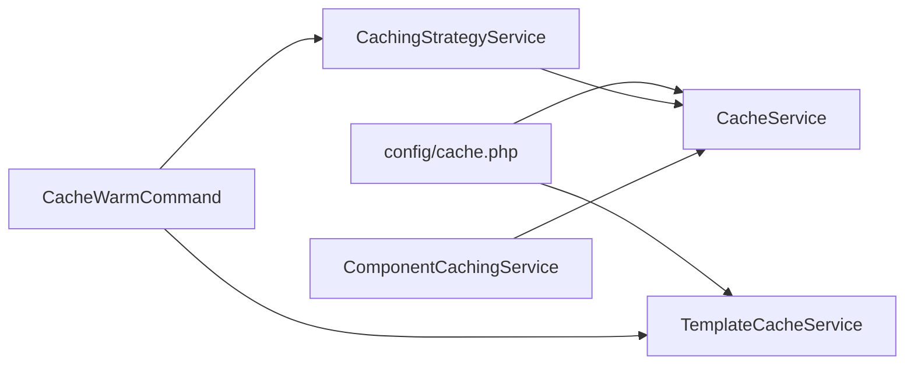

# Caching Strategies

<cite>
**Referenced Files in This Document**
- [CacheService.php](file://app/Services/CacheService.php)
- [CachingStrategyService.php](file://app/Services/CachingStrategyService.php)
- [ComponentCachingService.php](file://app/Services/ComponentCachingService.php)
- [TemplateCacheService.php](file://app/Services/TemplateCacheService.php)
- [cache.php](file://config/cache.php)
- [CacheWarmCommand.php](file://app/Console/Commands/CacheWarmCommand.php)
- [CacheServiceTest.php](file://tests/Unit/Services/CacheServiceTest.php)
- [TemplateCacheServiceTest.php](file://tests/Unit/Services/TemplateCacheServiceTest.php)
- [PerformanceOptimizationService.php](file://app/Services/PerformanceOptimizationService.php)
</cite>

## Table of Contents
1. [Introduction](#introduction)
2. [Project Structure](#project-structure)
3. [Core Components](#core-components)
4. [Architecture Overview](#architecture-overview)
5. [Detailed Component Analysis](#detailed-component-analysis)
6. [Dependency Analysis](#dependency-analysis)
7. [Performance Considerations](#performance-considerations)
8. [Troubleshooting Guide](#troubleshooting-guide)
9. [Conclusion](#conclusion)
10. [Appendices](#appendices)

## Introduction
This document explains the multi-layer caching architecture and implementation across the platform, focusing on Redis caching, array caching, and database caching. It documents the CacheService class and its methods, TTL management, cache tagging for Redis, and fallback mechanisms. Practical examples demonstrate caching expensive operations, API responses, and computed data. It also covers cache invalidation strategies, cache warming techniques, performance monitoring, configuration options, memory management, and troubleshooting.

## Project Structure
The caching system is implemented through several cohesive services and configuration layers:
- Centralized facade wrapper and helpers: CacheService
- Multi-layer caching orchestration: CachingStrategyService
- Template-specific multi-store caching: TemplateCacheService
- Component library caching: ComponentCachingService
- CLI cache warming: CacheWarmCommand
- Configuration: config/cache.php
- Tests: CacheServiceTest and TemplateCacheServiceTest
- Additional performance optimizations: PerformanceOptimizationService

**Diagram sources**
- [CacheService.php:1-173](file://app/Services/CacheService.php#L1-L173)
- [CachingStrategyService.php:1-558](file://app/Services/CachingStrategyService.php#L1-L558)
- [TemplateCacheService.php:1-311](file://app/Services/TemplateCacheService.php#L1-L311)
- [ComponentCachingService.php:1-325](file://app/Services/ComponentCachingService.php#L1-L325)
- [cache.php:1-328](file://config/cache.php#L1-L328)
- [CacheWarmCommand.php:1-568](file://app/Console/Commands/CacheWarmCommand.php#L1-L568)
- [PerformanceOptimizationService.php:1-1049](file://app/Services/PerformanceOptimizationService.php#L1-L1049)

**Section sources**
- [cache.php:1-328](file://config/cache.php#L1-L328)

## Core Components
- CacheService: A thin facade around Laravel’s Cache facade with robust error handling and fallbacks. Provides methods: remember(), put(), get(), forget(), flush(), tags(), increment(), decrement(), has(), many(), putMany().
- CachingStrategyService: Implements multi-layer caching (L1 in-memory, L2 Redis), TTL constants, cache warming, invalidation, and performance metrics.
- TemplateCacheService: Multi-store caching for templates with dedicated stores for L1 (array), L2 (Redis), L3 (archive/database), metadata, optimization, and popular caches.
- ComponentCachingService: Extends CacheService with component-specific caching, rendered component caching with configuration hashing, and tenant-aware invalidation.
- CacheWarmCommand: CLI command to warm caches for templates and other hot paths, with filtering and dry-run modes.
- config/cache.php: Defines cache stores, TTLs, tenant isolation, invalidation policies, compression, and key templates.

**Section sources**
- [CacheService.php:1-173](file://app/Services/CacheService.php#L1-L173)
- [CachingStrategyService.php:1-558](file://app/Services/CachingStrategyService.php#L1-L558)
- [TemplateCacheService.php:1-311](file://app/Services/TemplateCacheService.php#L1-L311)
- [ComponentCachingService.php:1-325](file://app/Services/ComponentCachingService.php#L1-L325)
- [cache.php:1-328](file://config/cache.php#L1-L328)
- [CacheWarmCommand.php:1-568](file://app/Console/Commands/CacheWarmCommand.php#L1-L568)

## Architecture Overview
The system supports three primary cache layers:
- L1: Fast in-memory cache (array store) for extremely hot data.
- L2: Persistent cache via Redis or Memcached for medium-term retention.
- L3: Long-term archive or database-backed cache for infrequent reads.

Redis is used for tag-based invalidation and multi-key operations. The configuration defines separate stores for templates and general caching, enabling granular TTLs, compression, and tagging per layer.

**Diagram sources**
- [CachingStrategyService.php:55-88](file://app/Services/CachingStrategyService.php#L55-L88)
- [cache.php:59-113](file://config/cache.php#L59-L113)

**Section sources**
- [CachingStrategyService.php:55-88](file://app/Services/CachingStrategyService.php#L55-L88)
- [cache.php:59-113](file://config/cache.php#L59-L113)

## Detailed Component Analysis

### CacheService
Provides a unified interface over Laravel’s Cache facade with built-in error handling and fallbacks. Methods:
- remember(key, callback, ttl?): Executes callback if cache miss; otherwise returns cached value. Logs and falls back on exception.
- put(key, value, ttl?): Stores value with TTL; logs and returns false on failure.
- get(key, default?): Retrieves value with default fallback; logs and returns default on failure.
- forget(key): Removes key; logs and returns false on failure.
- flush(): Clears all cache; logs and returns false on failure.
- tags(tags): Returns tagged cache context; falls back to array store on failure.
- increment(key, value): Atomic increment; logs and returns 0 on failure.
- decrement(key, value): Atomic decrement; logs and returns 0 on failure.
- has(key): Checks existence; logs and returns false on failure.
- many(keys): Bulk retrieval; logs and returns empty array on failure.
- putMany(values, ttl?): Bulk storage; logs and returns false on failure.

Error handling ensures graceful degradation: on exceptions, operations log and return safe defaults or false, preventing upstream failures.

**Section sources**
- [CacheService.php:16-171](file://app/Services/CacheService.php#L16-L171)

### CachingStrategyService
Implements a two-tier caching strategy with an in-memory L1 cache and Redis-backed L2 cache. Key capabilities:
- TTL constants for different domains (homepage stats, testimonials, success stories, job matches, user preferences, static content, A/B tests).
- getHomepageStatistics(): Multi-layer retrieval with L1/L2 promotion and L2/L1 persistence.
- Intelligent caching for testimonials, success stories (with pagination), job matches (user-specific), and A/B test configs.
- Cache warming: warms homepage stats, testimonials, success stories, job matches for active users, and static content.
- Invalidation: entity-centric invalidation (graduate, job, testimonial, success story, employer) plus pattern-based invalidation for Redis.
- Metrics: hit/miss counters and Redis metrics collection.
- Optimization: Redis tuning, serialization, and compression configuration.
- Preloading: critical data preloading into cache.

**Diagram sources**
- [CachingStrategyService.php:55-88](file://app/Services/CachingStrategyService.php#L55-L88)
- [CachingStrategyService.php:274-294](file://app/Services/CachingStrategyService.php#L274-L294)
- [CachingStrategyService.php:299-307](file://app/Services/CachingStrategyService.php#L299-L307)

**Section sources**
- [CachingStrategyService.php:16-31](file://app/Services/CachingStrategyService.php#L16-L31)
- [CachingStrategyService.php:55-88](file://app/Services/CachingStrategyService.php#L55-L88)
- [CachingStrategyService.php:145-178](file://app/Services/CachingStrategyService.php#L145-L178)
- [CachingStrategyService.php:183-205](file://app/Services/CachingStrategyService.php#L183-L205)
- [CachingStrategyService.php:209-233](file://app/Services/CachingStrategyService.php#L209-L233)
- [CachingStrategyService.php:238-250](file://app/Services/CachingStrategyService.php#L238-L250)
- [CachingStrategyService.php:255-270](file://app/Services/CachingStrategyService.php#L255-L270)
- [CachingStrategyService.php:274-307](file://app/Services/CachingStrategyService.php#L274-L307)

### TemplateCacheService
Multi-store caching for templates with explicit stores:
- template_l1: array, short TTL (1 minute)
- template_l2: redis/memcached, 1 hour TTL
- template_archive: database, 24 hours TTL
- template_metadata: redis, 5 minutes TTL
- template_optimization: redis, 30 minutes TTL
- template_popular: redis, 1 hour TTL

Methods:
- rememberTemplate(templateId, callback): multi-layer retrieval with promotion from L2 to L1 and from L3 to both L2/L1.
- rememberTemplateMetadata(templateId, callback): TTL-based caching for metadata.
- rememberTemplateOptimization(templateId, callback): caching for optimization artifacts.
- rememberPopularTemplates(callback): caching for popular templates.
- rememberSearchResults(query, filters, callback): search result caching with hashed keys.
- invalidateTemplate(templateId), invalidateTemplateMetadata(templateId), invalidateTemplateOptimization(templateId), invalidatePopularTemplates(), invalidateSearchCache(pattern): targeted invalidation.
- getCacheStats(): Redis connectivity and basic stats.

**Diagram sources**
- [TemplateCacheService.php:39-81](file://app/Services/TemplateCacheService.php#L39-L81)
- [TemplateCacheService.php:59-77](file://app/Services/TemplateCacheService.php#L59-L77)
- [cache.php:59-113](file://config/cache.php#L59-L113)

**Section sources**
- [TemplateCacheService.php:16-31](file://app/Services/TemplateCacheService.php#L16-L31)
- [TemplateCacheService.php:39-81](file://app/Services/TemplateCacheService.php#L39-L81)
- [TemplateCacheService.php:160-203](file://app/Services/TemplateCacheService.php#L160-L203)
- [TemplateCacheService.php:230-239](file://app/Services/TemplateCacheService.php#L230-L239)
- [TemplateCacheService.php:246-264](file://app/Services/TemplateCacheService.php#L246-L264)
- [cache.php:59-113](file://config/cache.php#L59-L113)

### ComponentCachingService
Extends CacheService with component-specific caching:
- cacheComponent(component), getCachedComponent(): cache component config.
- cacheRenderedComponent(component, configuration, renderedHtml, themeSlug), getCachedRenderedComponent(): cache rendered HTML with config hash validation.
- cacheComponentInstance(instance, mergedConfig), getCachedComponentInstance(): cache component instance data.
- cacheComponentTheme(themeSlug, styles, tenantId), getCachedComponentTheme(): cache theme styles.
- preloadFrequentlyUsedComponents(tenantId, limit): preloads popular components.
- invalidateComponentCache(component), invalidateTenantComponentCache(tenantId): pattern-based invalidation with Redis keys.
- getComponentCachingMetrics(tenantId): counts and sizes for tenant-scoped caches.

**Diagram sources**
- [CacheService.php:16-171](file://app/Services/CacheService.php#L16-L171)
- [ComponentCachingService.php:26-197](file://app/Services/ComponentCachingService.php#L26-L197)

**Section sources**
- [ComponentCachingService.php:17-197](file://app/Services/ComponentCachingService.php#L17-L197)
- [ComponentCachingService.php:202-248](file://app/Services/ComponentCachingService.php#L202-L248)
- [ComponentCachingService.php:302-324](file://app/Services/ComponentCachingService.php#L302-L324)

### Cache Warm-up and Invalidation
- CacheWarmCommand: Warms templates and other hot paths with filtering by template, category, audience, tenant, or popular templates. Supports dry-run, purge-first, progress, and metrics reporting. Scheduled for production.
- Invalidation strategies:
  - Entity-centric invalidation in CachingStrategyService (graduate, job, testimonial, success story, employer).
  - Pattern-based invalidation using Redis KEYS and DEL for wildcard patterns.
  - Tag-based invalidation via Cache::tags() and flush().

**Diagram sources**
- [CacheWarmCommand.php:73-120](file://app/Console/Commands/CacheWarmCommand.php#L73-L120)
- [CacheWarmCommand.php:344-358](file://app/Console/Commands/CacheWarmCommand.php#L344-L358)
- [TemplateCacheService.php:39-81](file://app/Services/TemplateCacheService.php#L39-L81)

**Section sources**
- [CacheWarmCommand.php:27-120](file://app/Console/Commands/CacheWarmCommand.php#L27-L120)
- [CacheWarmCommand.php:557-567](file://app/Console/Commands/CacheWarmCommand.php#L557-L567)
- [CachingStrategyService.php:183-205](file://app/Services/CachingStrategyService.php#L183-L205)
- [CachingStrategyService.php:440-448](file://app/Services/CachingStrategyService.php#L440-L448)

## Dependency Analysis
- CacheService depends on Laravel’s Cache facade and Redis for tag operations.
- CachingStrategyService orchestrates CacheService and uses Redis for pattern-based invalidation.
- TemplateCacheService uses multiple named stores defined in config/cache.php.
- ComponentCachingService extends CacheService and adds component-specific key generation and tenant scoping.
- CacheWarmCommand coordinates warming across services and uses scheduled tasks.

**Diagram sources**
- [cache.php:34-159](file://config/cache.php#L34-L159)
- [CacheService.php:5-7](file://app/Services/CacheService.php#L5-L7)
- [CachingStrategyService.php:5-8](file://app/Services/CachingStrategyService.php#L5-L8)
- [ComponentCachingService.php:7-9](file://app/Services/ComponentCachingService.php#L7-L9)
- [CacheWarmCommand.php:10-12](file://app/Console/Commands/CacheWarmCommand.php#L10-L12)

**Section sources**
- [cache.php:34-159](file://config/cache.php#L34-L159)
- [CacheService.php:5-7](file://app/Services/CacheService.php#L5-L7)
- [CachingStrategyService.php:5-8](file://app/Services/CachingStrategyService.php#L5-L8)
- [ComponentCachingService.php:7-9](file://app/Services/ComponentCachingService.php#L7-L9)
- [CacheWarmCommand.php:10-12](file://app/Console/Commands/CacheWarmCommand.php#L10-L12)

## Performance Considerations
- TTL Management:
  - CachingStrategyService defines domain-specific TTLs (e.g., homepage stats 1h, testimonials 30m, job matches 15m).
  - TemplateCacheService defines L1 (1m), L2 (1h), L3 (24h) TTLs for templates.
- Compression and Serialization:
  - CachingStrategyService configures cache serialization and compression when available.
  - TemplateCacheService enables compression for L2/L3 stores via environment variables.
- Memory Management:
  - L1 arrays are short-lived; size limits are configured per layer.
  - Redis maxmemory policy tuned to allkeys-lru.
- Monitoring:
  - CachingStrategyService collects cache hit/miss rates and Redis metrics.
  - TemplateCacheService exposes cache stats including Redis connectivity and key counts.
  - PerformanceOptimizationService stores performance metrics with hourly TTL.

**Section sources**
- [CachingStrategyService.php:16-31](file://app/Services/CachingStrategyService.php#L16-L31)
- [CachingStrategyService.php:487-513](file://app/Services/CachingStrategyService.php#L487-L513)
- [TemplateCacheService.php:25-31](file://app/Services/TemplateCacheService.php#L25-L31)
- [TemplateCacheService.php:246-264](file://app/Services/TemplateCacheService.php#L246-L264)
- [PerformanceOptimizationService.php:404-418](file://app/Services/PerformanceOptimizationService.php#L404-L418)

## Troubleshooting Guide
Common issues and resolutions:
- Cache Exceptions:
  - CacheService wraps operations in try/catch and logs errors, returning safe defaults or false. Verify logs for cache errors and ensure Redis connectivity.
- Redis Connectivity:
  - TemplateCacheService and CachingStrategyService use Redis for tagging and pattern invalidation. Confirm Redis availability and credentials.
- Invalidation Failures:
  - For pattern-based invalidation, ensure Redis KEYS/Del operations succeed. Consider using cache tags where supported.
- Performance Degradation:
  - Review cache hit rates and Redis metrics. Adjust TTLs and enable compression where appropriate.
- CLI Warm-up Failures:
  - CacheWarmCommand logs errors and continues. Inspect command output and fix underlying template rendering issues.

**Section sources**
- [CacheService.php:20-26](file://app/Services/CacheService.php#L20-L26)
- [CacheService.php:36-42](file://app/Services/CacheService.php#L36-L42)
- [CachingStrategyService.php:440-448](file://app/Services/CachingStrategyService.php#L440-L448)
- [TemplateCacheService.php:210-223](file://app/Services/TemplateCacheService.php#L210-L223)
- [CacheWarmCommand.php:103-119](file://app/Console/Commands/CacheWarmCommand.php#L103-L119)

## Conclusion
The platform implements a robust, layered caching strategy combining in-memory, Redis, and database stores. CacheService provides a resilient facade with error handling and fallbacks. CachingStrategyService orchestrates multi-layer caching, warming, invalidation, and metrics. TemplateCacheService offers specialized multi-store caching for templates. ComponentCachingService adds component-level caching with tenant scoping. Configuration supports granular TTLs, compression, tagging, and tenant isolation. Together, these components deliver scalable performance with observability and operational safety.

## Appendices

### Practical Examples
- Caching Expensive Operations:
  - Use CacheService::remember() with domain-specific TTLs for heavy computations.
  - Example path: [CacheService.php:16-27](file://app/Services/CacheService.php#L16-L27)
- API Responses:
  - Use CacheService::remember() for endpoint responses with appropriate TTLs.
  - Example path: [CacheService.php:16-27](file://app/Services/CacheService.php#L16-L27)
- Computed Data:
  - Cache aggregated metrics and derived data using CacheService::put() with TTL.
  - Example path: [CacheService.php:32-43](file://app/Services/CacheService.php#L32-L43)

### Cache Invalidation Strategies
- Entity-centric invalidation:
  - Invalidate related keys when entities change.
  - Example path: [CachingStrategyService.php:183-205](file://app/Services/CachingStrategyService.php#L183-L205)
- Pattern-based invalidation:
  - Use Redis KEYS and DEL for wildcard patterns.
  - Example path: [CachingStrategyService.php:440-448](file://app/Services/CachingStrategyService.php#L440-L448)
- Tag-based invalidation:
  - Use Cache::tags() and flush() for logical grouping.
  - Example path: [CacheService.php:90-99](file://app/Services/CacheService.php#L90-L99)

### Cache Warming Techniques
- Template cache warming:
  - Use CacheWarmCommand to warm popular templates and metadata.
  - Example path: [CacheWarmCommand.php:27-120](file://app/Console/Commands/CacheWarmCommand.php#L27-L120)
- Preloading critical data:
  - Preload frequently accessed data into cache.
  - Example path: [CachingStrategyService.php:255-270](file://app/Services/CachingStrategyService.php#L255-L270)

### Performance Monitoring
- Cache metrics:
  - Track hits/misses and compute hit rates.
  - Example path: [CachingStrategyService.php:210-233](file://app/Services/CachingStrategyService.php#L210-L233)
- Redis metrics:
  - Collect used memory, keyspace hits/misses, and client counts.
  - Example path: [CachingStrategyService.php:467-485](file://app/Services/CachingStrategyService.php#L467-L485)
- Performance metrics storage:
  - Store metrics with hourly TTL for historical analysis.
  - Example path: [PerformanceOptimizationService.php:404-418](file://app/Services/PerformanceOptimizationService.php#L404-L418)

### Configuration Options
- Cache stores and drivers:
  - Define stores for array, database, file, memcached, redis, dynamodb, octane, null.
  - Example path: [cache.php:34-159](file://config/cache.php#L34-L159)
- Template cache policies:
  - Layers, tenant isolation, invalidation, compression.
  - Example path: [cache.php:184-282](file://config/cache.php#L184-L282)
- Key templates:
  - Standardized cache key patterns for consistent management.
  - Example path: [cache.php:316-325](file://config/cache.php#L316-L325)

### Memory Management
- L1 size limits and short TTLs prevent memory bloat.
- Redis maxmemory policy set to allkeys-lru.
- Compression enabled for large values where applicable.

**Section sources**
- [cache.php:184-282](file://config/cache.php#L184-L282)
- [CachingStrategyService.php:487-513](file://app/Services/CachingStrategyService.php#L487-L513)