# Database Optimization

<cite>
**Referenced Files in This Document**
- [config/database.php](file://config/database.php)
- [app/Services/DatabaseOptimizationService.php](file://app/Services/DatabaseOptimizationService.php)
- [app/Services/PerformanceOptimizationService.php](file://app/Services/PerformanceOptimizationService.php)
- [app/Console/Commands/OptimizePerformance.php](file://app/Console/Commands/OptimizePerformance.php)
- [app/Console/Commands/RunPerformanceTests.php](file://app/Console/Commands/RunPerformanceTests.php)
- [tests/Performance/HomepagePerformanceTest.php](file://tests/Performance/HomepagePerformanceTest.php)
- [tests/Performance/DatabasePerformanceTest.php](file://tests/Performance/DatabasePerformanceTest.php)
- [docs/PERFORMANCE_MONITORING.md](file://docs/PERFORMANCE_MONITORING.md)
- [config/tenancy.php](file://config/tenancy.php)
- [technical-specification.md](file://technical-specification.md)
</cite>

## Table of Contents
1. [Introduction](#introduction)
2. [Project Structure](#project-structure)
3. [Core Components](#core-components)
4. [Architecture Overview](#architecture-overview)
5. [Detailed Component Analysis](#detailed-component-analysis)
6. [Dependency Analysis](#dependency-analysis)
7. [Performance Considerations](#performance-considerations)
8. [Troubleshooting Guide](#troubleshooting-guide)
9. [Conclusion](#conclusion)
10. [Appendices](#appendices)

## Introduction
This document consolidates database optimization techniques and strategies implemented in the platform. It focuses on preventing N+1 query problems through eager loading, indexing strategies for frequently accessed columns, connection pooling configuration, query optimization (select projections, where clauses, joins, batch processing), database configuration options, connection timeouts, transaction management, slow query identification, EXPLAIN plan analysis, query profiling, maintenance tasks, index rebuilding, performance monitoring, PostgreSQL-specific optimizations, JSON data type queries, and tenant isolation performance considerations.

## Project Structure
The optimization effort spans configuration, services, console commands, tests, and documentation. The primary configuration defines database connections and Redis settings. Dedicated services encapsulate query logging, slow query detection, index creation, and performance monitoring. Console commands automate optimization and testing. Tests validate performance targets and detect regressions.

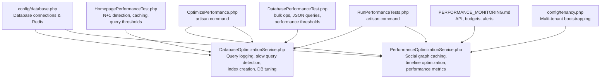

**Diagram sources**
- [config/database.php:1-211](file://config/database.php#L1-L211)
- [app/Services/DatabaseOptimizationService.php:1-414](file://app/Services/DatabaseOptimizationService.php#L1-L414)
- [app/Services/PerformanceOptimizationService.php:1-800](file://app/Services/PerformanceOptimizationService.php#L1-L800)
- [app/Console/Commands/OptimizePerformance.php:1-341](file://app/Console/Commands/OptimizePerformance.php#L1-L341)
- [app/Console/Commands/RunPerformanceTests.php:1-497](file://app/Console/Commands/RunPerformanceTests.php#L1-L497)
- [tests/Performance/HomepagePerformanceTest.php:1-200](file://tests/Performance/HomepagePerformanceTest.php#L1-L200)
- [tests/Performance/DatabasePerformanceTest.php:1-200](file://tests/Performance/DatabasePerformanceTest.php#L1-L200)
- [docs/PERFORMANCE_MONITORING.md:1-218](file://docs/PERFORMANCE_MONITORING.md#L1-L218)
- [config/tenancy.php:1-82](file://config/tenancy.php#L1-L82)

**Section sources**
- [config/database.php:1-211](file://config/database.php#L1-L211)
- [app/Services/DatabaseOptimizationService.php:1-414](file://app/Services/DatabaseOptimizationService.php#L1-L414)
- [app/Services/PerformanceOptimizationService.php:1-800](file://app/Services/PerformanceOptimizationService.php#L1-L800)
- [app/Console/Commands/OptimizePerformance.php:1-341](file://app/Console/Commands/OptimizePerformance.php#L1-L341)
- [app/Console/Commands/RunPerformanceTests.php:1-497](file://app/Console/Commands/RunPerformanceTests.php#L1-L497)
- [tests/Performance/HomepagePerformanceTest.php:1-200](file://tests/Performance/HomepagePerformanceTest.php#L1-L200)
- [tests/Performance/DatabasePerformanceTest.php:1-200](file://tests/Performance/DatabasePerformanceTest.php#L1-L200)
- [docs/PERFORMANCE_MONITORING.md:1-218](file://docs/PERFORMANCE_MONITORING.md#L1-L218)
- [config/tenancy.php:1-82](file://config/tenancy.php#L1-L82)

## Core Components
- DatabaseOptimizationService: Provides query logging, slow query detection, index creation, and database tuning. It exposes methods to analyze query performance, generate recommendations, and optimize connections.
- PerformanceOptimizationService: Implements social graph caching, timeline query optimization, performance metrics collection, and budget-based alerting. It also manages CDN integration for media assets.
- Database configuration: Defines default driver, connections (including central and tenant variants), and Redis options.
- Console commands: Automate optimization runs, performance tests, and monitoring.
- Tests: Validate N+1 prevention, caching effectiveness, query thresholds, and bulk operation performance.

**Section sources**
- [app/Services/DatabaseOptimizationService.php:1-414](file://app/Services/DatabaseOptimizationService.php#L1-L414)
- [app/Services/PerformanceOptimizationService.php:1-800](file://app/Services/PerformanceOptimizationService.php#L1-L800)
- [config/database.php:1-211](file://config/database.php#L1-L211)
- [app/Console/Commands/OptimizePerformance.php:1-341](file://app/Console/Commands/OptimizePerformance.php#L1-L341)
- [app/Console/Commands/RunPerformanceTests.php:1-497](file://app/Console/Commands/RunPerformanceTests.php#L1-L497)
- [tests/Performance/HomepagePerformanceTest.php:1-200](file://tests/Performance/HomepagePerformanceTest.php#L1-L200)
- [tests/Performance/DatabasePerformanceTest.php:1-200](file://tests/Performance/DatabasePerformanceTest.php#L1-L200)

## Architecture Overview
The system integrates configuration-driven database connections with service-layer optimizations and automated testing. PerformanceOptimizationService orchestrates caching and timeline optimizations, while DatabaseOptimizationService handles query logging and index management. Console commands expose CLI automation for optimization and testing.

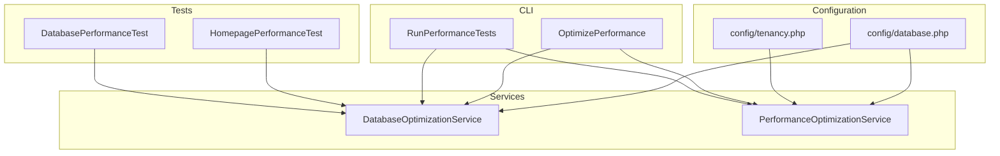

**Diagram sources**
- [config/database.php:1-211](file://config/database.php#L1-L211)
- [config/tenancy.php:1-82](file://config/tenancy.php#L1-L82)
- [app/Services/DatabaseOptimizationService.php:1-414](file://app/Services/DatabaseOptimizationService.php#L1-L414)
- [app/Services/PerformanceOptimizationService.php:1-800](file://app/Services/PerformanceOptimizationService.php#L1-L800)
- [app/Console/Commands/OptimizePerformance.php:1-341](file://app/Console/Commands/OptimizePerformance.php#L1-L341)
- [app/Console/Commands/RunPerformanceTests.php:1-497](file://app/Console/Commands/RunPerformanceTests.php#L1-L497)
- [tests/Performance/HomepagePerformanceTest.php:1-200](file://tests/Performance/HomepagePerformanceTest.php#L1-L200)
- [tests/Performance/DatabasePerformanceTest.php:1-200](file://tests/Performance/DatabasePerformanceTest.php#L1-L200)

## Detailed Component Analysis

### DatabaseOptimizationService
- Query logging and slow query detection: Listens to DB queries, tracks execution time, and logs slow queries with backtraces.
- Homepage statistics optimization: Uses raw SQL with projections and aggregations to compute statistics efficiently.
- Testimonials and success stories optimization: Employs JOINs and JSON extraction to minimize round trips.
- Job matching optimization: Uses JSON_TABLE and calculated matches to filter candidates efficiently.
- Index creation: Creates strategic indexes for JSON-extracted fields, composite keys, and array casts.
- Query performance analysis: Computes totals, averages, slow counts, groups by type, detects duplicates, and generates recommendations.
- Database connection tuning: Applies session-level optimizations for MySQL-compatible environments.

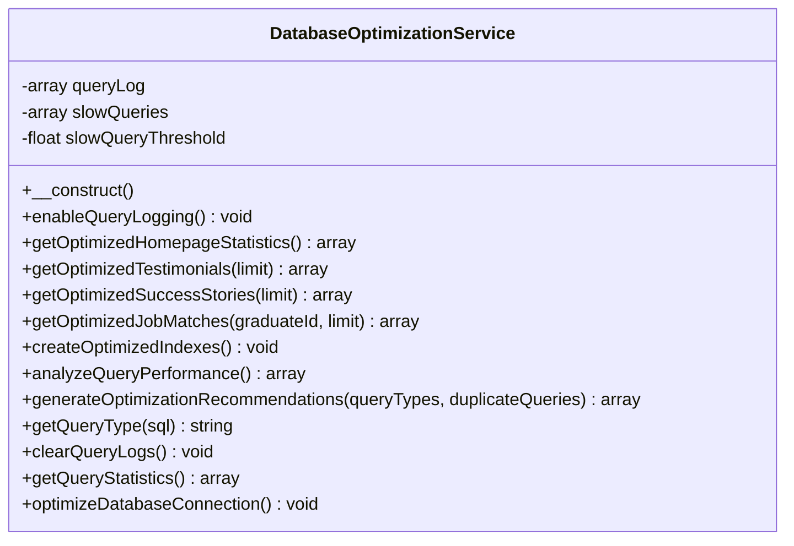

**Diagram sources**
- [app/Services/DatabaseOptimizationService.php:1-414](file://app/Services/DatabaseOptimizationService.php#L1-L414)

**Section sources**
- [app/Services/DatabaseOptimizationService.php:1-414](file://app/Services/DatabaseOptimizationService.php#L1-L414)

### PerformanceOptimizationService
- Social graph caching: Caches user connections, circle memberships, and group memberships in Redis for O(1) lookups.
- Timeline optimization: Creates GIN indexes for JSON arrays, composite indexes for timeline filters, and pre-computes timeline segments for active users.
- Performance monitoring: Calculates cache hit rates, average query time, active connections, memory usage, Redis memory stats, slow query counts, and timeline generation time.
- Budget-based alerts: Compares current metrics against budgets and emits warnings.
- CDN integration: Analyzes media assets, configures cache headers, optimizes image delivery, and sets up purging.

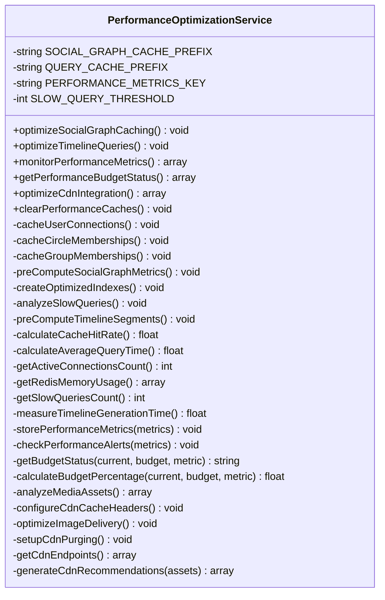

**Diagram sources**
- [app/Services/PerformanceOptimizationService.php:1-800](file://app/Services/PerformanceOptimizationService.php#L1-L800)

**Section sources**
- [app/Services/PerformanceOptimizationService.php:1-800](file://app/Services/PerformanceOptimizationService.php#L1-L800)

### Database Configuration and Connection Pooling
- Default driver and connections: Defines default connection and multiple drivers including pgsql for central and tenant contexts.
- Redis options: Client selection, cluster mode, key prefixing, and persistence settings.
- Multi-tenant bootstrapping: Central connection, schema manager, cache and filesystem prefixes, and Redis prefix base.

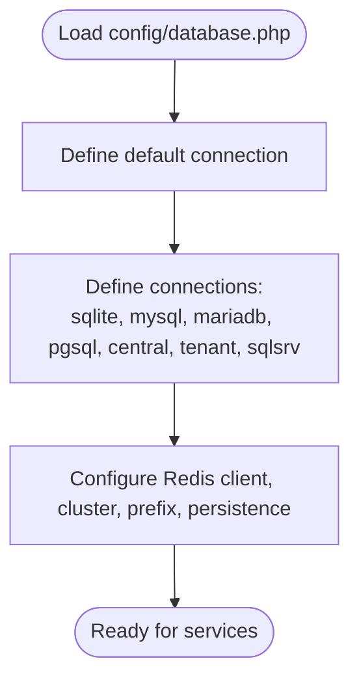

**Diagram sources**
- [config/database.php:1-211](file://config/database.php#L1-L211)

**Section sources**
- [config/database.php:1-211](file://config/database.php#L1-L211)
- [config/tenancy.php:1-82](file://config/tenancy.php#L1-L82)

### Console Commands for Optimization and Testing
- OptimizePerformance: Orchestrates caching optimization, timeline query optimization, monitoring, cache clearing, budget status, CDN optimization, alerts, and automated optimization.
- RunPerformanceTests: Initializes monitoring, runs database, cache, load, accessibility, and JavaScript tests, generates reports, and applies optimizations.

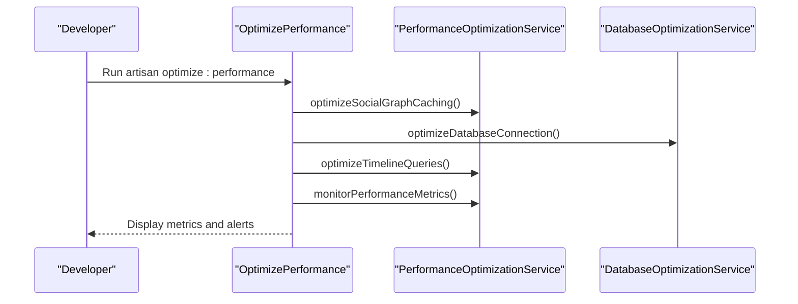

**Diagram sources**
- [app/Console/Commands/OptimizePerformance.php:1-341](file://app/Console/Commands/OptimizePerformance.php#L1-L341)
- [app/Services/PerformanceOptimizationService.php:1-800](file://app/Services/PerformanceOptimizationService.php#L1-L800)
- [app/Services/DatabaseOptimizationService.php:1-414](file://app/Services/DatabaseOptimizationService.php#L1-L414)

**Section sources**
- [app/Console/Commands/OptimizePerformance.php:1-341](file://app/Console/Commands/OptimizePerformance.php#L1-L341)
- [app/Console/Commands/RunPerformanceTests.php:1-497](file://app/Console/Commands/RunPerformanceTests.php#L1-L497)

### Query Optimization Techniques
- Select projections: The service constructs targeted SELECT statements with explicit columns and JSON extraction to avoid unnecessary data transfer.
- Where clauses and joins: Uses INNER JOINs and WHERE conditions to filter and combine data efficiently.
- Batch processing: Tests demonstrate bulk inserts and paginated queries to manage large datasets.
- JSON data type queries: Leverages JSON operators and functions to query nested attributes without denormalization.

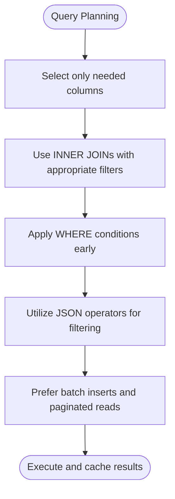

**Diagram sources**
- [app/Services/DatabaseOptimizationService.php:57-195](file://app/Services/DatabaseOptimizationService.php#L57-L195)
- [tests/Performance/DatabasePerformanceTest.php:152-183](file://tests/Performance/DatabasePerformanceTest.php#L152-L183)

**Section sources**
- [app/Services/DatabaseOptimizationService.php:57-195](file://app/Services/DatabaseOptimizationService.php#L57-L195)
- [tests/Performance/DatabasePerformanceTest.php:152-183](file://tests/Performance/DatabasePerformanceTest.php#L152-L183)

### Slow Query Identification and EXPLAIN Analysis
- Query logging: Captures SQL, bindings, and execution time for all queries.
- Threshold-based detection: Flags queries exceeding configured thresholds.
- Duplicate detection: Identifies repeated query hashes indicating potential N+1 issues.
- Recommendations: Suggests caching, eager loading, indexing, and batching based on observed patterns.

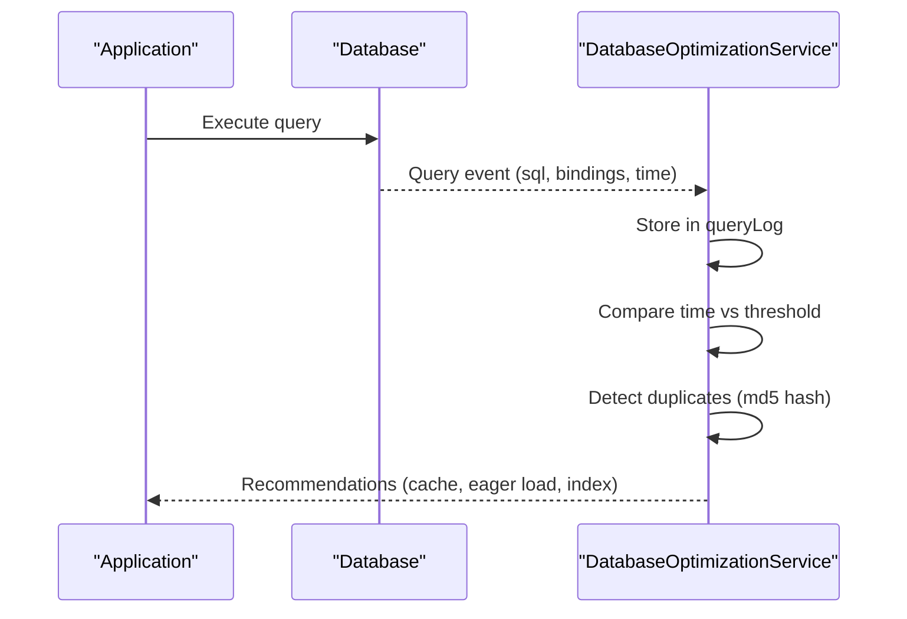

**Diagram sources**
- [app/Services/DatabaseOptimizationService.php:25-52](file://app/Services/DatabaseOptimizationService.php#L25-L52)
- [app/Services/DatabaseOptimizationService.php:271-298](file://app/Services/DatabaseOptimizationService.php#L271-L298)

**Section sources**
- [app/Services/DatabaseOptimizationService.php:25-52](file://app/Services/DatabaseOptimizationService.php#L25-L52)
- [app/Services/DatabaseOptimizationService.php:271-298](file://app/Services/DatabaseOptimizationService.php#L271-L298)

### Indexing Strategies
- JSON-extracted indexes: Creates indexes on JSON-extracted fields for employment status and skills.
- Composite indexes: Builds indexes on frequently filtered columns like status, course_id, created_at, and approval flags.
- Array cast indexes: Uses CAST to CHAR(255) ARRAY for skill matching.
- GIN indexes: Empowers efficient JSON array filtering for timeline queries.

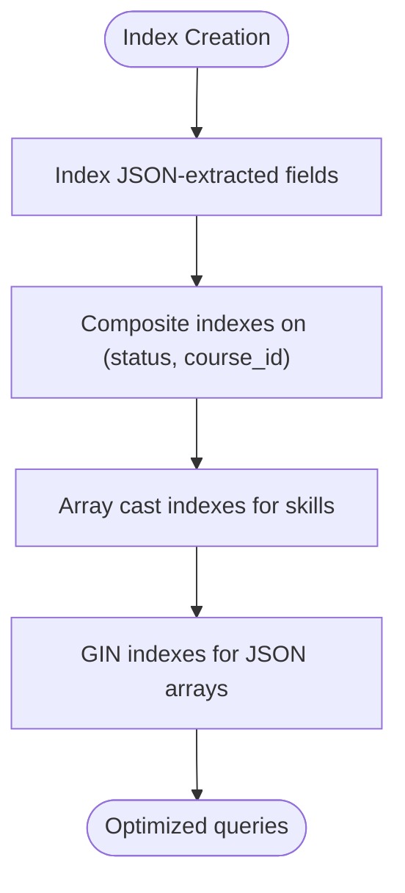

**Diagram sources**
- [app/Services/DatabaseOptimizationService.php:200-249](file://app/Services/DatabaseOptimizationService.php#L200-L249)

**Section sources**
- [app/Services/DatabaseOptimizationService.php:200-249](file://app/Services/DatabaseOptimizationService.php#L200-L249)

### PostgreSQL-Specific Optimizations
- JSON data type queries: Uses JSON operators and functions for filtering and aggregation.
- Schema management: Multi-tenant uses PostgreSQL schema manager for tenant isolation.
- Materialized views and concurrent operations: Technical specification outlines materialized views and concurrent refresh for analytics.

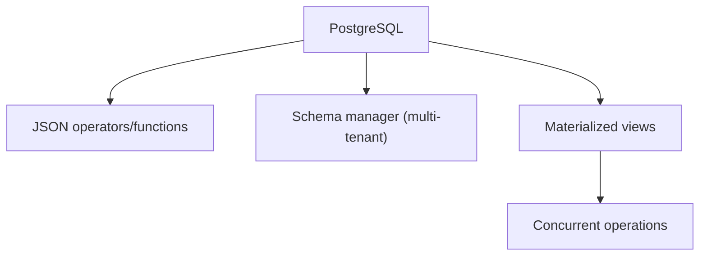

**Diagram sources**
- [config/tenancy.php:34](file://config/tenancy.php#L34)
- [technical-specification.md:1067-1079](file://technical-specification.md#L1067-L1079)

**Section sources**
- [config/tenancy.php:34](file://config/tenancy.php#L34)
- [technical-specification.md:1067-1079](file://technical-specification.md#L1067-L1079)

### Tenant Isolation Performance Considerations
- Central connection and schema manager: Ensures tenant isolation at the database level.
- Bootstrappers: Cache, filesystem, queue, and Redis tenancy bootstrappers maintain performance across tenants.
- Migration and seeding parameters: Tenant-specific migration paths and seeders.

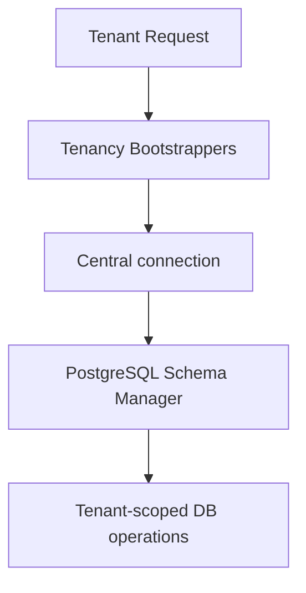

**Diagram sources**
- [config/tenancy.php:21-36](file://config/tenancy.php#L21-L36)

**Section sources**
- [config/tenancy.php:21-36](file://config/tenancy.php#L21-L36)

### Transaction Management and Connection Timeouts
- Connection pooling: While explicit pooling configuration is not shown in the referenced files, the presence of multiple connections and Redis options indicates a multi-tenant, pooled environment.
- Timeouts: No explicit timeout configurations were identified in the referenced files; consult environment variables and database driver settings for timeout tuning.

[No sources needed since this subsection synthesizes observations without quoting specific lines]

## Dependency Analysis
The services depend on the database configuration for connections and on Redis for caching. Console commands coordinate service invocations. Tests rely on query logging and performance thresholds to validate optimizations.

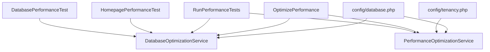

**Diagram sources**
- [config/database.php:1-211](file://config/database.php#L1-L211)
- [config/tenancy.php:1-82](file://config/tenancy.php#L1-L82)
- [app/Services/DatabaseOptimizationService.php:1-414](file://app/Services/DatabaseOptimizationService.php#L1-L414)
- [app/Services/PerformanceOptimizationService.php:1-800](file://app/Services/PerformanceOptimizationService.php#L1-L800)
- [app/Console/Commands/OptimizePerformance.php:1-341](file://app/Console/Commands/OptimizePerformance.php#L1-L341)
- [app/Console/Commands/RunPerformanceTests.php:1-497](file://app/Console/Commands/RunPerformanceTests.php#L1-L497)
- [tests/Performance/HomepagePerformanceTest.php:1-200](file://tests/Performance/HomepagePerformanceTest.php#L1-L200)
- [tests/Performance/DatabasePerformanceTest.php:1-200](file://tests/Performance/DatabasePerformanceTest.php#L1-L200)

**Section sources**
- [config/database.php:1-211](file://config/database.php#L1-L211)
- [config/tenancy.php:1-82](file://config/tenancy.php#L1-L82)
- [app/Services/DatabaseOptimizationService.php:1-414](file://app/Services/DatabaseOptimizationService.php#L1-L414)
- [app/Services/PerformanceOptimizationService.php:1-800](file://app/Services/PerformanceOptimizationService.php#L1-L800)
- [app/Console/Commands/OptimizePerformance.php:1-341](file://app/Console/Commands/OptimizePerformance.php#L1-L341)
- [app/Console/Commands/RunPerformanceTests.php:1-497](file://app/Console/Commands/RunPerformanceTests.php#L1-L497)
- [tests/Performance/HomepagePerformanceTest.php:1-200](file://tests/Performance/HomepagePerformanceTest.php#L1-L200)
- [tests/Performance/DatabasePerformanceTest.php:1-200](file://tests/Performance/DatabasePerformanceTest.php#L1-L200)

## Performance Considerations
- Eager loading: Tests enforce the use of eager loading to prevent N+1 queries.
- Caching: Redis-backed caching for social graph and timeline segments improves response times.
- Indexing: Strategic indexes on JSON-extracted fields and composite keys reduce scan costs.
- Batch operations: Bulk inserts and paginated queries handle large datasets efficiently.
- Monitoring: Real-time metrics, budgets, and alerts ensure sustained performance.

[No sources needed since this section provides general guidance]

## Troubleshooting Guide
- Slow queries: Use the built-in query logging and slow query detection to identify problematic queries and their backtraces.
- N+1 problems: Tests assert the presence of JOINs and limit duplicate queries to detect and prevent N+1 scenarios.
- Performance budgets: Review budget status and alerts to identify over-budget metrics.
- CDN optimization: Validate cache headers, image optimization, and purging configurations.

**Section sources**
- [app/Services/DatabaseOptimizationService.php:25-52](file://app/Services/DatabaseOptimizationService.php#L25-L52)
- [tests/Performance/HomepagePerformanceTest.php:116-141](file://tests/Performance/HomepagePerformanceTest.php#L116-L141)
- [app/Services/PerformanceOptimizationService.php:423-473](file://app/Services/PerformanceOptimizationService.php#L423-L473)
- [docs/PERFORMANCE_MONITORING.md:141-153](file://docs/PERFORMANCE_MONITORING.md#L141-L153)

## Conclusion
The platform implements a comprehensive database optimization strategy centered on query logging, slow query detection, strategic indexing, caching, and automated performance monitoring. Console commands streamline optimization and testing, while tests validate performance targets and regression prevention. PostgreSQL-specific features and multi-tenant bootstrapping further enhance performance and isolation.

[No sources needed since this section summarizes without analyzing specific files]

## Appendices

### Practical Examples and References
- Homepage statistics optimization: [app/Services/DatabaseOptimizationService.php:57-84](file://app/Services/DatabaseOptimizationService.php#L57-L84)
- Testimonials and success stories optimization: [app/Services/DatabaseOptimizationService.php:89-146](file://app/Services/DatabaseOptimizationService.php#L89-L146)
- Job matching optimization: [app/Services/DatabaseOptimizationService.php:151-195](file://app/Services/DatabaseOptimizationService.php#L151-L195)
- Index creation: [app/Services/DatabaseOptimizationService.php:200-249](file://app/Services/DatabaseOptimizationService.php#L200-L249)
- Performance monitoring API and budgets: [docs/PERFORMANCE_MONITORING.md:33-74](file://docs/PERFORMANCE_MONITORING.md#L33-L74)
- Multi-tenant schema manager: [config/tenancy.php:34](file://config/tenancy.php#L34)
- Materialized views and concurrent operations: [technical-specification.md:1067-1079](file://technical-specification.md#L1067-L1079)