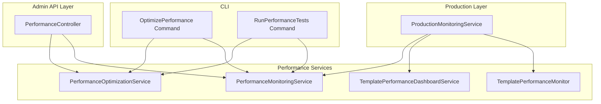
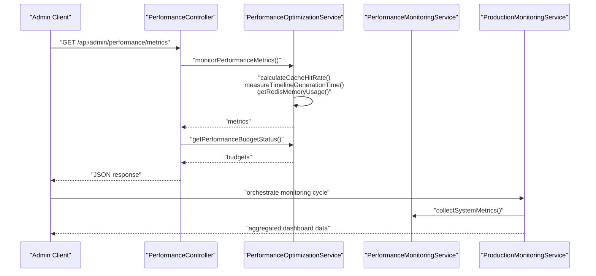
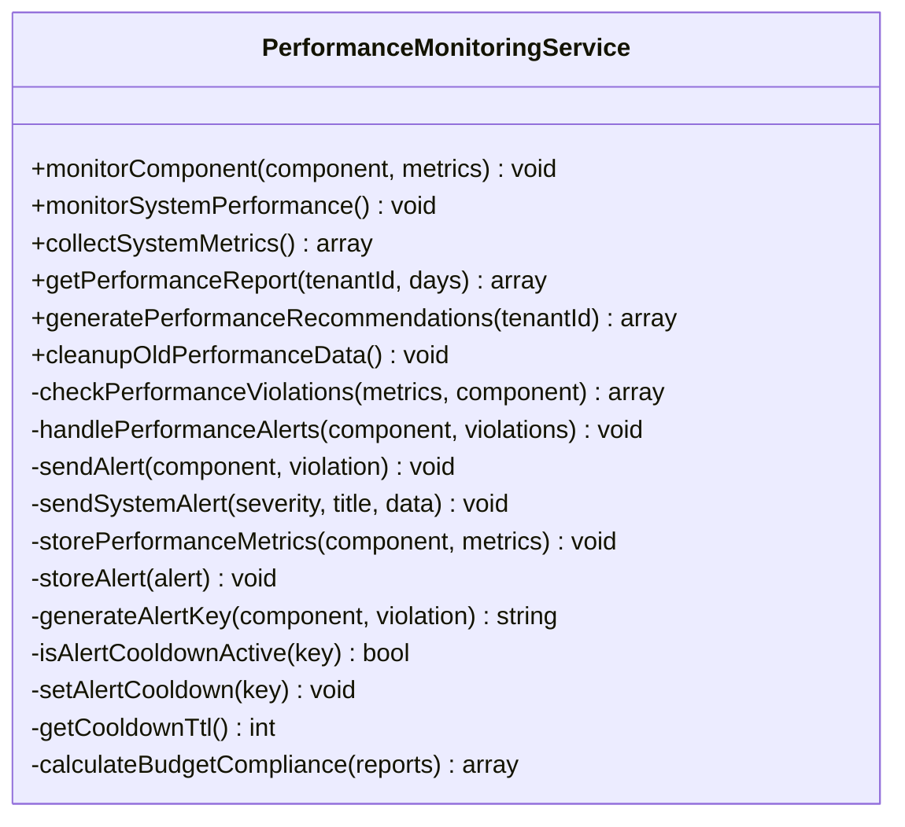
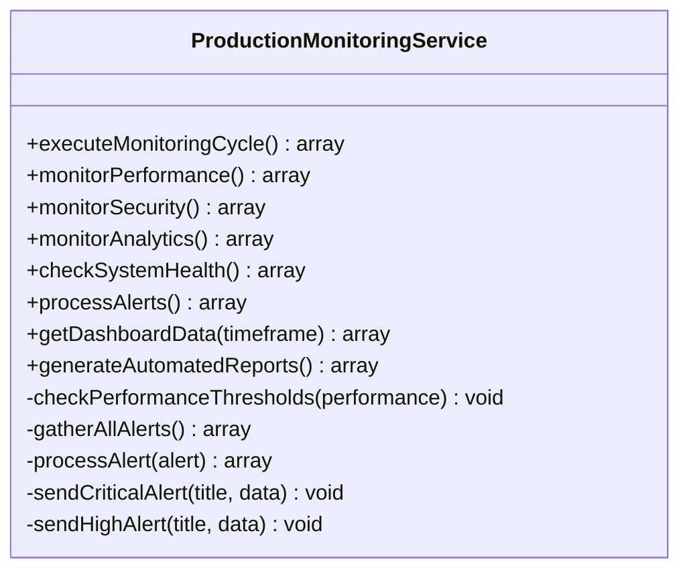
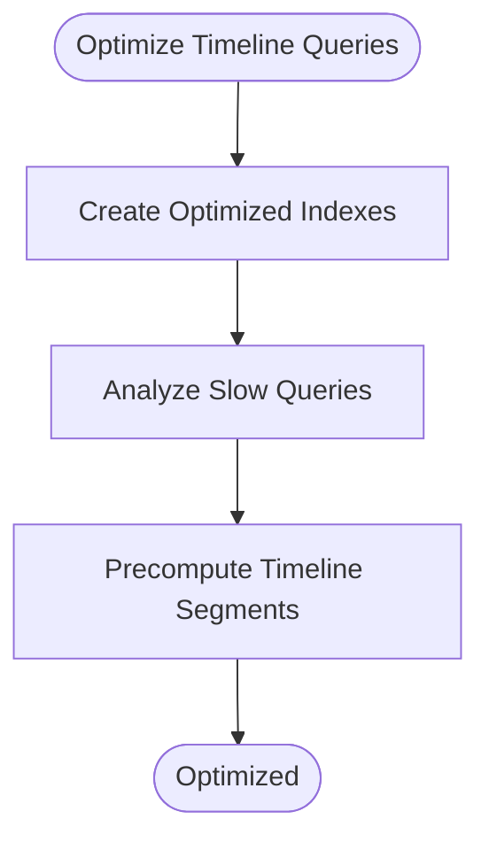
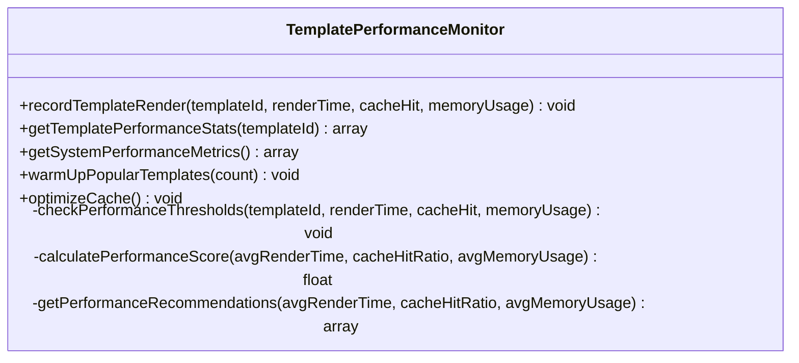
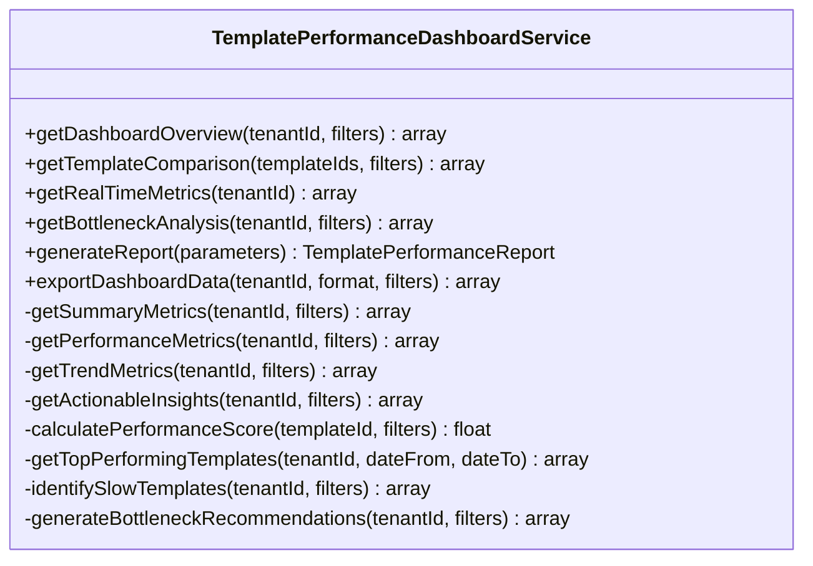
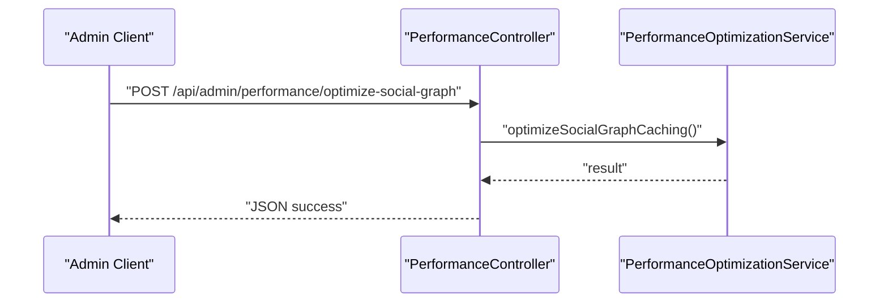
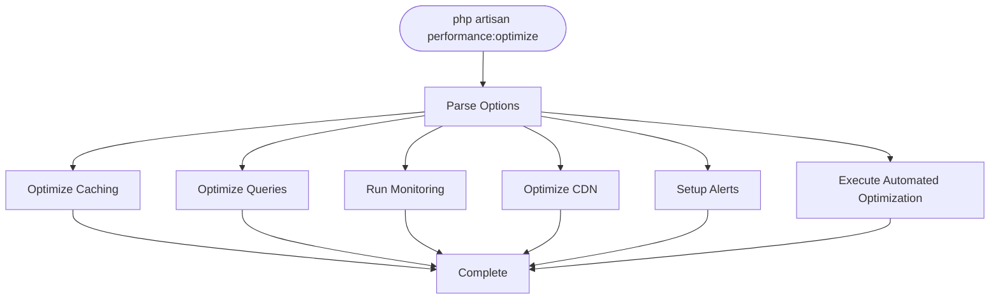
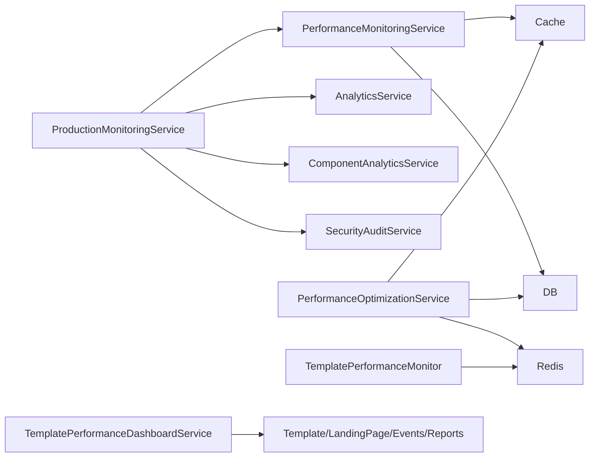

# Performance Monitoring & Profiling

<cite>
**Referenced Files in This Document**
- [PerformanceMonitoringService.php](file://app/Services/PerformanceMonitoringService.php)
- [ProductionMonitoringService.php](file://app/Services/ProductionMonitoringService.php)
- [PerformanceOptimizationService.php](file://app/Services/PerformanceOptimizationService.php)
- [TemplatePerformanceMonitor.php](file://app/Services/TemplatePerformanceMonitor.php)
- [TemplatePerformanceDashboardService.php](file://app/Services/TemplatePerformanceDashboardService.php)
- [PerformanceController.php](file://app/Http/Controllers/API/Admin/PerformanceController.php)
- [OptimizePerformance.php](file://app/Console/Commands/OptimizePerformance.php)
- [RunPerformanceTests.php](file://app/Console/Commands/RunPerformanceTests.php)
- [PerformanceMonitoringTest.php](file://tests/Feature/PerformanceMonitoringTest.php)
- [PERFORMANCE_MONITORING.md](file://docs/PERFORMANCE_MONITORING.md)
</cite>

## Table of Contents
1. [Introduction](#introduction)
2. [Project Structure](#project-structure)
3. [Core Components](#core-components)
4. [Architecture Overview](#architecture-overview)
5. [Detailed Component Analysis](#detailed-component-analysis)
6. [Dependency Analysis](#dependency-analysis)
7. [Performance Considerations](#performance-considerations)
8. [Troubleshooting Guide](#troubleshooting-guide)
9. [Conclusion](#conclusion)
10. [Appendices](#appendices)

## Introduction
This document provides comprehensive coverage of the performance monitoring and profiling systems implemented in the platform. It explains real-time performance metrics collection (response times, throughput, resource utilization), the PerformanceMonitoringService and ProductionMonitoringService implementations, alerting mechanisms, server-side profiling, database query performance monitoring, cache hit ratio tracking, dashboard creation, trend analysis, bottleneck identification, APM integration, custom metric collection, and performance regression detection. It also includes practical guidance for baselines, thresholds, and automated performance testing.

## Project Structure
The performance monitoring ecosystem is organized around several cohesive services and controllers:
- Performance monitoring services: collect metrics, enforce budgets, detect violations, and generate recommendations.
- Production monitoring service: orchestrates cross-cutting monitoring, security, analytics, and alerting.
- Template performance services: monitor template rendering performance, cache effectiveness, and provide recommendations.
- Admin API endpoints: expose metrics, trigger optimizations, and manage caches.
- CLI commands: automate performance optimization, monitoring, and testing.
- Feature tests: validate access control, API responses, and budget calculations.

**Diagram sources**
- [PerformanceController.php:1-283](file://app/Http/Controllers/API/Admin/PerformanceController.php#L1-L283)
- [PerformanceMonitoringService.php:1-433](file://app/Services/PerformanceMonitoringService.php#L1-L433)
- [PerformanceOptimizationService.php:1-800](file://app/Services/PerformanceOptimizationService.php#L1-L800)
- [TemplatePerformanceMonitor.php:1-333](file://app/Services/TemplatePerformanceMonitor.php#L1-L333)
- [TemplatePerformanceDashboardService.php:1-638](file://app/Services/TemplatePerformanceDashboardService.php#L1-L638)
- [ProductionMonitoringService.php:1-795](file://app/Services/ProductionMonitoringService.php#L1-L795)
- [OptimizePerformance.php:1-341](file://app/Console/Commands/OptimizePerformance.php#L1-L341)
- [RunPerformanceTests.php:1-497](file://app/Console/Commands/RunPerformanceTests.php#L1-L497)

**Section sources**
- [PERFORMANCE_MONITORING.md:1-218](file://docs/PERFORMANCE_MONITORING.md#L1-L218)

## Core Components
- PerformanceMonitoringService: central component for collecting system metrics, enforcing budgets, detecting violations, generating alerts, and producing performance reports and recommendations.
- ProductionMonitoringService: orchestrates monitoring cycles, aggregates performance, security, and analytics, and manages alert escalation and dashboard updates.
- PerformanceOptimizationService: implements caching strategies for social graphs, database indexing, timeline segment precomputation, and CDN optimization; exposes metrics and budget status.
- TemplatePerformanceMonitor: records template render performance, tracks cache hits, computes performance scores, and provides recommendations.
- TemplatePerformanceDashboardService: generates dashboard analytics, trend analysis, bottleneck identification, and supports report generation and exports.
- Admin API: exposes endpoints for metrics, cache management, and optimization triggers.
- CLI Commands: automate optimization, monitoring, and performance testing.

**Section sources**
- [PerformanceMonitoringService.php:1-433](file://app/Services/PerformanceMonitoringService.php#L1-L433)
- [ProductionMonitoringService.php:1-795](file://app/Services/ProductionMonitoringService.php#L1-L795)
- [PerformanceOptimizationService.php:1-800](file://app/Services/PerformanceOptimizationService.php#L1-L800)
- [TemplatePerformanceMonitor.php:1-333](file://app/Services/TemplatePerformanceMonitor.php#L1-L333)
- [TemplatePerformanceDashboardService.php:1-638](file://app/Services/TemplatePerformanceDashboardService.php#L1-L638)
- [PerformanceController.php:1-283](file://app/Http/Controllers/API/Admin/PerformanceController.php#L1-L283)
- [OptimizePerformance.php:1-341](file://app/Console/Commands/OptimizePerformance.php#L1-L341)
- [RunPerformanceTests.php:1-497](file://app/Console/Commands/RunPerformanceTests.php#L1-L497)

## Architecture Overview
The system follows a layered architecture:
- Presentation: Admin API endpoints and CLI commands.
- Orchestration: ProductionMonitoringService coordinates monitoring cycles and integrates multiple subsystems.
- Services: PerformanceMonitoringService, PerformanceOptimizationService, TemplatePerformanceMonitor, and TemplatePerformanceDashboardService encapsulate domain logic.
- Data and Caching: Redis and Laravel Cache store metrics, alerts, and dashboard data.
- Persistence: Database-backed models support analytics and reporting.

**Diagram sources**
- [PerformanceController.php:19-39](file://app/Http/Controllers/API/Admin/PerformanceController.php#L19-L39)
- [PerformanceOptimizationService.php:266-285](file://app/Services/PerformanceOptimizationService.php#L266-L285)
- [PerformanceMonitoringService.php:257-273](file://app/Services/PerformanceMonitoringService.php#L257-L273)
- [ProductionMonitoringService.php:55-97](file://app/Services/ProductionMonitoringService.php#L55-L97)

## Detailed Component Analysis

### PerformanceMonitoringService
Responsibilities:
- Collect system metrics (memory, CPU, response time).
- Enforce performance budgets and detect violations.
- Generate and store performance alerts with cooldowns.
- Store component performance metrics for trend analysis.
- Produce performance reports and recommendations.
- Clean up old performance data.

Key behaviors:
- Budget thresholds for response time, memory usage, component render time, and database query time.
- Cooldown mechanism to prevent alert spam.
- Trend storage using cache with time-stamped entries.
- Compliance calculation across components.

**Diagram sources**
- [PerformanceMonitoringService.php:18-433](file://app/Services/PerformanceMonitoringService.php#L18-L433)

**Section sources**
- [PerformanceMonitoringService.php:47-138](file://app/Services/PerformanceMonitoringService.php#L47-L138)
- [PerformanceMonitoringService.php:257-368](file://app/Services/PerformanceMonitoringService.php#L257-L368)

### ProductionMonitoringService
Responsibilities:
- Execute monitoring cycles integrating performance, security, analytics, and system health.
- Aggregate and store monitoring results for real-time dashboards.
- Determine alert priorities and escalate as needed.
- Generate automated reports (daily, weekly, monthly, quarterly).
- Provide KPIs and chart data for dashboards.

**Diagram sources**
- [ProductionMonitoringService.php:23-795](file://app/Services/ProductionMonitoringService.php#L23-L795)

**Section sources**
- [ProductionMonitoringService.php:55-198](file://app/Services/ProductionMonitoringService.php#L55-L198)
- [ProductionMonitoringService.php:255-266](file://app/Services/ProductionMonitoringService.php#L255-L266)

### PerformanceOptimizationService
Responsibilities:
- Implement social graph caching (connections, circles, groups) with hierarchical structure.
- Optimize timeline queries via database indexing and precomputed segments.
- Monitor performance metrics and generate alerts.
- Manage performance budgets and calculate compliance percentages.
- Optimize CDN integration for media assets.
- Clear performance caches.

**Diagram sources**
- [PerformanceOptimizationService.php:167-177](file://app/Services/PerformanceOptimizationService.php#L167-L177)

**Section sources**
- [PerformanceOptimizationService.php:25-38](file://app/Services/PerformanceOptimizationService.php#L25-L38)
- [PerformanceOptimizationService.php:167-261](file://app/Services/PerformanceOptimizationService.php#L167-L261)
- [PerformanceOptimizationService.php:266-473](file://app/Services/PerformanceOptimizationService.php#L266-L473)
- [PerformanceOptimizationService.php:478-535](file://app/Services/PerformanceOptimizationService.php#L478-L535)

### TemplatePerformanceMonitor
Responsibilities:
- Record template render performance (render time, cache hit, memory usage).
- Compute performance statistics and performance scores.
- Provide recommendations for template optimization.
- Support cache warming and optimization routines.

**Diagram sources**
- [TemplatePerformanceMonitor.php:15-333](file://app/Services/TemplatePerformanceMonitor.php#L15-L333)

**Section sources**
- [TemplatePerformanceMonitor.php:38-102](file://app/Services/TemplatePerformanceMonitor.php#L38-L102)
- [TemplatePerformanceMonitor.php:128-157](file://app/Services/TemplatePerformanceMonitor.php#L128-L157)

### TemplatePerformanceDashboardService
Responsibilities:
- Provide dashboard overview, real-time metrics, trend analysis, and bottleneck analysis.
- Generate performance reports and export dashboard data.
- Identify top/bottom performing templates and conversion bottlenecks.
- Support template comparison and recommendations.

**Diagram sources**
- [TemplatePerformanceDashboardService.php:21-638](file://app/Services/TemplatePerformanceDashboardService.php#L21-L638)

**Section sources**
- [TemplatePerformanceDashboardService.php:37-135](file://app/Services/TemplatePerformanceDashboardService.php#L37-L135)
- [TemplatePerformanceDashboardService.php:176-176](file://app/Services/TemplatePerformanceDashboardService.php#L176-L176)

### Admin API Endpoints
Endpoints:
- GET /api/admin/performance/metrics: returns current metrics, budgets, and alerts.
- POST /api/admin/performance/clear-caches: clears performance caches.
- POST /api/admin/performance/optimize-social-graph: triggers social graph caching optimization.
- POST /api/admin/performance/optimize-timeline: triggers timeline query optimization.
- POST /api/admin/performance/optimize-cdn: optimizes CDN integration.
- POST /api/admin/performance/setup-alerts: sets up automated alerts.
- POST /api/admin/performance/execute-automated-optimization: executes automated optimization.
- GET /api/admin/performance/budget-details: returns budget details with recommendations.

**Diagram sources**
- [PerformanceController.php:65-81](file://app/Http/Controllers/API/Admin/PerformanceController.php#L65-L81)

**Section sources**
- [PerformanceController.php:19-39](file://app/Http/Controllers/API/Admin/PerformanceController.php#L19-L39)
- [PerformanceController.php:44-102](file://app/Http/Controllers/API/Admin/PerformanceController.php#L44-L102)
- [PerformanceController.php:129-168](file://app/Http/Controllers/API/Admin/PerformanceController.php#L129-L168)
- [PerformanceController.php:173-209](file://app/Http/Controllers/API/Admin/PerformanceController.php#L173-L209)

### CLI Commands
- OptimizePerformance: runs caching optimization, query optimization, monitoring, CDN optimization, alert setup, and automated optimization; supports selective options.
- RunPerformanceTests: runs comprehensive performance test suites (load, database, cache, accessibility, JavaScript), generates reports, and optionally applies optimizations.

**Diagram sources**
- [OptimizePerformance.php:42-98](file://app/Console/Commands/OptimizePerformance.php#L42-L98)

**Section sources**
- [OptimizePerformance.php:16-34](file://app/Console/Commands/OptimizePerformance.php#L16-L34)
- [OptimizePerformance.php:42-98](file://app/Console/Commands/OptimizePerformance.php#L42-L98)
- [RunPerformanceTests.php:43-102](file://app/Console/Commands/RunPerformanceTests.php#L43-L102)

## Dependency Analysis
- PerformanceMonitoringService depends on Cache, DB, Log, and Notification channels for metrics, alerts, and persistence.
- ProductionMonitoringService composes PerformanceMonitoringService, AnalyticsService, ComponentAnalyticsService, and SecurityAuditService.
- PerformanceOptimizationService depends on Cache, DB, Redis, and TimelineService for caching, indexing, and timeline computation.
- TemplatePerformanceMonitor depends on TemplateCacheService and Redis for recording and retrieving metrics.
- TemplatePerformanceDashboardService relies on Template, LandingPage, TemplateAnalyticsEvent, and TemplatePerformanceReport models.

**Diagram sources**
- [PerformanceMonitoringService.php:1-433](file://app/Services/PerformanceMonitoringService.php#L1-L433)
- [ProductionMonitoringService.php:23-795](file://app/Services/ProductionMonitoringService.php#L23-L795)
- [PerformanceOptimizationService.php:1-800](file://app/Services/PerformanceOptimizationService.php#L1-L800)
- [TemplatePerformanceMonitor.php:1-333](file://app/Services/TemplatePerformanceMonitor.php#L1-L333)
- [TemplatePerformanceDashboardService.php:1-638](file://app/Services/TemplatePerformanceDashboardService.php#L1-L638)

**Section sources**
- [ProductionMonitoringService.php:40-50](file://app/Services/ProductionMonitoringService.php#L40-L50)
- [PerformanceOptimizationService.php:5-11](file://app/Services/PerformanceOptimizationService.php#L5-L11)

## Performance Considerations
- Real-time metrics refresh: 30-second auto-refresh in admin dashboards; 5-minute caching for aggregated metrics; 1-minute caching for real-time metrics.
- Budget enforcement: conservative thresholds with inverse metrics (e.g., higher cache hit rate is better).
- Trend analysis: stores up to 100 component metrics per component and cleans up old data after 90 days.
- Alert cooldowns: different TTLs for development vs production to balance responsiveness and noise.
- CDN optimization: cache headers, image optimization, and purging configurations stored for performance gains.
- Database indexing: composite indexes for timeline and membership queries to reduce slow query counts.

[No sources needed since this section provides general guidance]

## Troubleshooting Guide
Common issues and resolutions:
- Access control failures: ensure super-admin role for accessing performance monitoring pages and endpoints.
- Cache misses: verify Redis connectivity and cache keys; use cache clearing and warming utilities.
- Slow query detection: review slow query logs and apply recommended indexes; precompute timeline segments.
- Budget overruns: adjust thresholds, implement optimizations, and monitor trends.
- CLI command failures: check logs for detailed error messages and stack traces.

**Section sources**
- [PerformanceMonitoringTest.php:19-32](file://tests/Feature/PerformanceMonitoringTest.php#L19-L32)
- [PerformanceController.php:146-168](file://app/Http/Controllers/API/Admin/PerformanceController.php#L146-L168)
- [OptimizePerformance.php:89-97](file://app/Console/Commands/OptimizePerformance.php#L89-L97)
- [RunPerformanceTests.php:94-101](file://app/Console/Commands/RunPerformanceTests.php#L94-L101)

## Conclusion
The performance monitoring and profiling system provides robust real-time metrics collection, budget enforcement, alerting, and actionable recommendations. It integrates server-side profiling, database optimization, cache strategies, and template performance monitoring with comprehensive dashboards and automated testing. The modular design enables scalable enhancements and reliable operations across environments.

[No sources needed since this section summarizes without analyzing specific files]

## Appendices

### API Definitions
- GET /api/admin/performance/metrics: Returns current performance metrics, budgets, and alerts.
- POST /api/admin/performance/clear-caches: Clears performance caches.
- POST /api/admin/performance/optimize-social-graph: Triggers social graph caching optimization.
- POST /api/admin/performance/optimize-timeline: Triggers timeline query optimization.
- POST /api/admin/performance/optimize-cdn: Optimizes CDN integration.
- POST /api/admin/performance/setup-alerts: Sets up automated alerts.
- POST /api/admin/performance/execute-automated-optimization: Executes automated optimization.
- GET /api/admin/performance/budget-details: Returns budget details with recommendations.

**Section sources**
- [PerformanceController.php:19-209](file://app/Http/Controllers/API/Admin/PerformanceController.php#L19-L209)

### Performance Baselines and Thresholds
- Response time: warning at 500ms, critical at 1000ms.
- Memory usage: warning at 128MB, critical at 256MB.
- Component render time: warning at 100ms, critical at 300ms.
- Database query time: warning at 50ms, critical at 200ms.
- Timeline generation: target 1000ms; approaching limit at 800ms; over budget at 1200ms.
- Cache hit rate: target 85%; below 80% is warning.
- Active connections: limit 50 concurrent.

**Section sources**
- [PerformanceMonitoringService.php:23-40](file://app/Services/PerformanceMonitoringService.php#L23-L40)
- [PERFORMANCE_MONITORING.md:16-21](file://docs/PERFORMANCE_MONITORING.md#L16-L21)
- [PerformanceOptimizationService.php:478-535](file://app/Services/PerformanceOptimizationService.php#L478-L535)

### Automated Performance Testing
- Test suites: load, database, cache, accessibility, and JavaScript performance tests.
- Reporting: generates JSON and HTML reports with metrics and system info.
- Optimization after tests: optional execution of database and cache optimizations.

**Section sources**
- [RunPerformanceTests.php:120-129](file://app/Console/Commands/RunPerformanceTests.php#L120-L129)
- [RunPerformanceTests.php:308-336](file://app/Console/Commands/RunPerformanceTests.php#L308-L336)
- [RunPerformanceTests.php:432-447](file://app/Console/Commands/RunPerformanceTests.php#L432-L447)