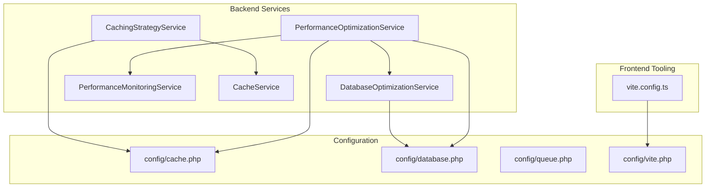
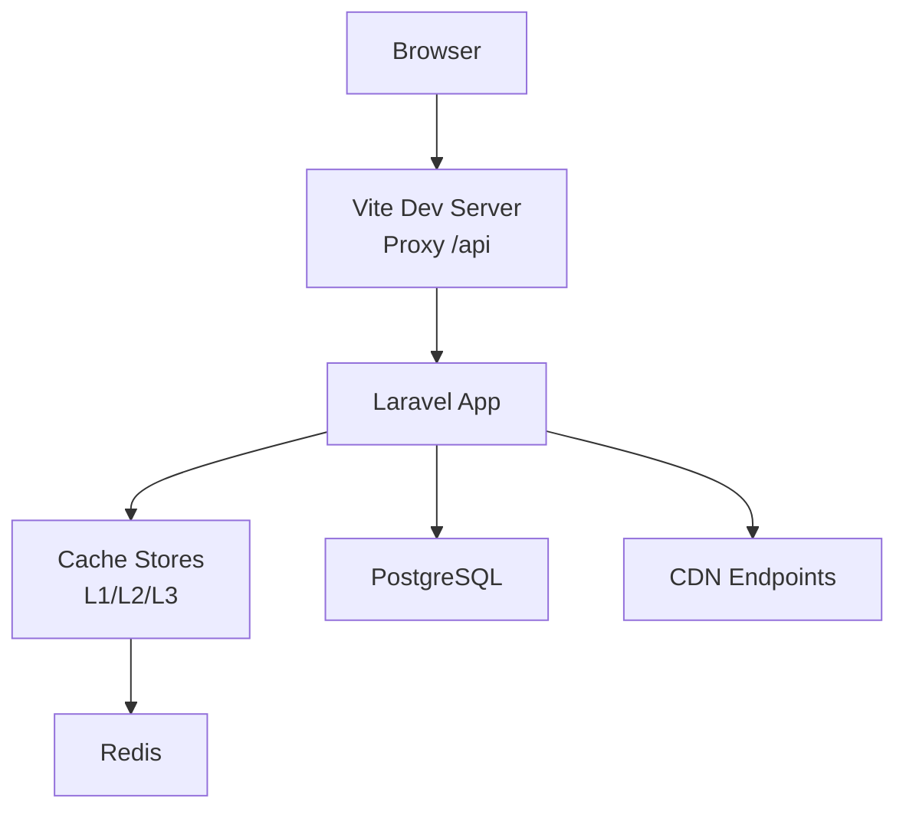
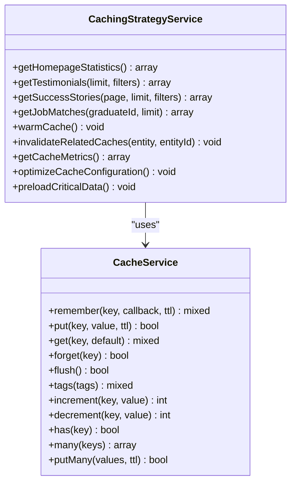
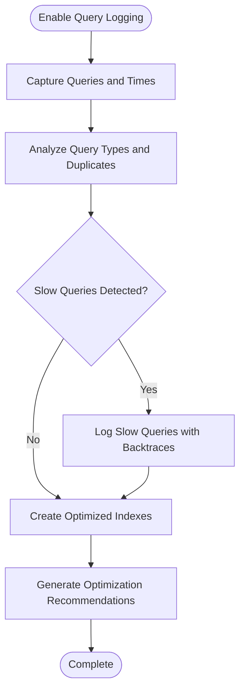
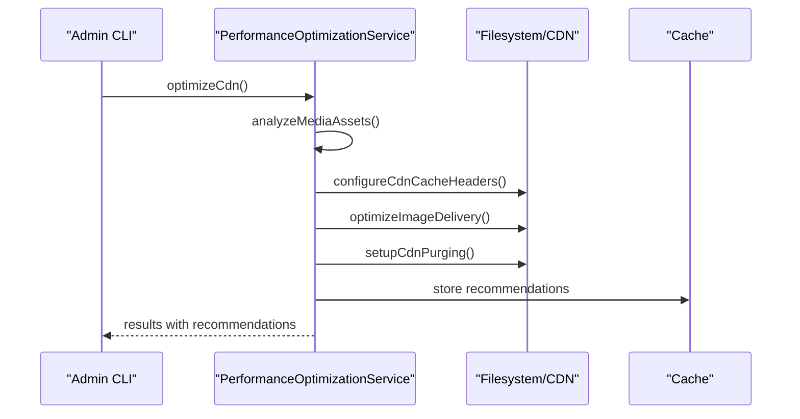
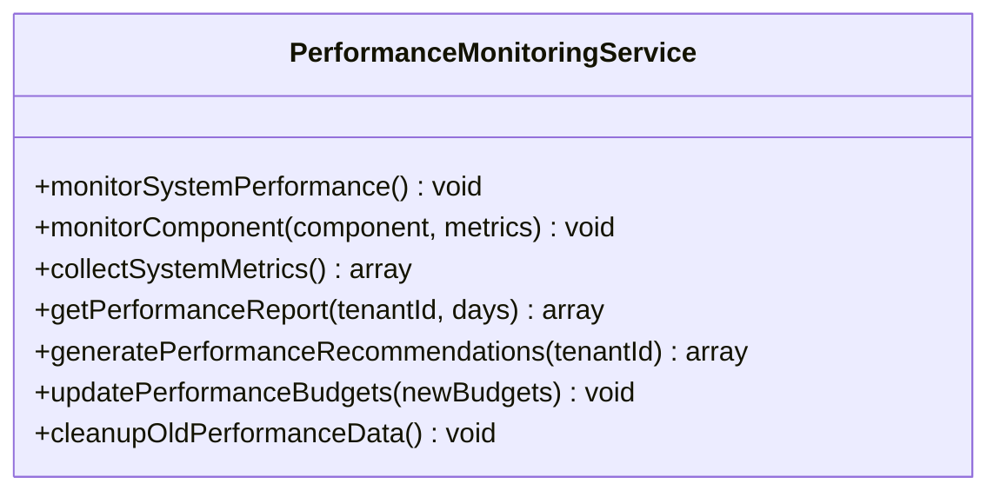
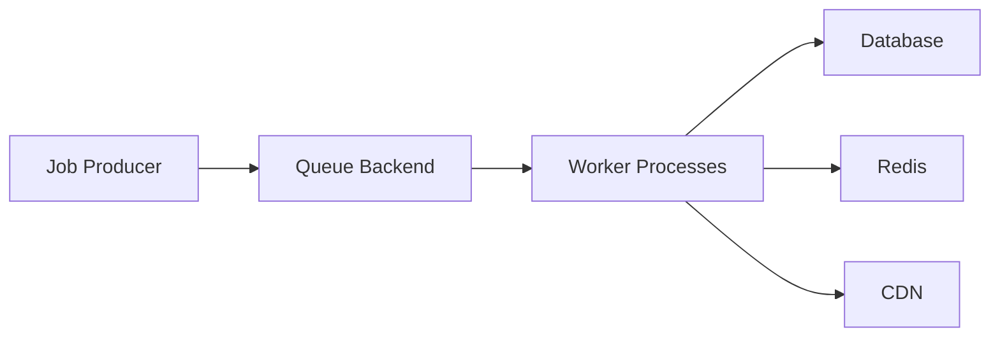
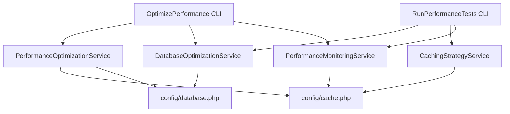

# Performance Optimization

<cite>
**Referenced Files in This Document**
- [PerformanceOptimizationService.php](file://app/Services/PerformanceOptimizationService.php)
- [DatabaseOptimizationService.php](file://app/Services/DatabaseOptimizationService.php)
- [PerformanceMonitoringService.php](file://app/Services/PerformanceMonitoringService.php)
- [CachingStrategyService.php](file://app/Services/CachingStrategyService.php)
- [CacheService.php](file://app/Services/CacheService.php)
- [cache.php](file://config/cache.php)
- [database.php](file://config/database.php)
- [vite.config.ts](file://vite.config.ts)
- [vite.php](file://config/vite.php)
- [queue.php](file://config/queue.php)
- [OptimizePerformance.php](file://app/Console/Commands/OptimizePerformance.php)
- [RunPerformanceTests.php](file://app/Console/Commands/RunPerformanceTests.php)
</cite>

## Table of Contents
1. [Introduction](#introduction)
2. [Project Structure](#project-structure)
3. [Core Components](#core-components)
4. [Architecture Overview](#architecture-overview)
5. [Detailed Component Analysis](#detailed-component-analysis)
6. [Dependency Analysis](#dependency-analysis)
7. [Performance Considerations](#performance-considerations)
8. [Troubleshooting Guide](#troubleshooting-guide)
9. [Conclusion](#conclusion)
10. [Appendices](#appendices)

## Introduction
This document provides a comprehensive guide to performance optimization across caching strategies, database optimization, and asset delivery. It explains multi-layer caching (including Redis), database query optimization, browser caching, CDN integration, performance monitoring, profiling tools, and queue-based background processing. Practical examples and measurement techniques are included to help teams implement and validate improvements.

## Project Structure
The performance optimization implementation spans backend services, configuration, and frontend tooling:
- Backend services encapsulate caching, database optimization, and monitoring.
- Configuration files define cache stores, template policies, database connections, Redis, and queue backends.
- Frontend tooling integrates Vite for asset bundling, code splitting, and development server proxying.

**Diagram sources**
- [PerformanceOptimizationService.php:1-1049](file://app/Services/PerformanceOptimizationService.php#L1-L1049)
- [DatabaseOptimizationService.php:1-414](file://app/Services/DatabaseOptimizationService.php#L1-L414)
- [PerformanceMonitoringService.php:1-433](file://app/Services/PerformanceMonitoringService.php#L1-L433)
- [CachingStrategyService.php:1-558](file://app/Services/CachingStrategyService.php#L1-L558)
- [CacheService.php:1-173](file://app/Services/CacheService.php#L1-L173)
- [cache.php:1-328](file://config/cache.php#L1-L328)
- [database.php:1-211](file://config/database.php#L1-L211)
- [queue.php:1-113](file://config/queue.php#L1-L113)
- [vite.config.ts:1-163](file://vite.config.ts#L1-L163)
- [vite.php:1-55](file://config/vite.php#L1-L55)

**Section sources**
- [PerformanceOptimizationService.php:1-1049](file://app/Services/PerformanceOptimizationService.php#L1-L1049)
- [DatabaseOptimizationService.php:1-414](file://app/Services/DatabaseOptimizationService.php#L1-L414)
- [PerformanceMonitoringService.php:1-433](file://app/Services/PerformanceMonitoringService.php#L1-L433)
- [CachingStrategyService.php:1-558](file://app/Services/CachingStrategyService.php#L1-L558)
- [CacheService.php:1-173](file://app/Services/CacheService.php#L1-L173)
- [cache.php:1-328](file://config/cache.php#L1-L328)
- [database.php:1-211](file://config/database.php#L1-L211)
- [queue.php:1-113](file://config/queue.php#L1-L113)
- [vite.config.ts:1-163](file://vite.config.ts#L1-L163)
- [vite.php:1-55](file://config/vite.php#L1-L55)

## Core Components
- Multi-layer caching with L1/L2/L3 layers, tenant isolation, and invalidation strategies.
- Database query optimization via index creation, query logging, and performance analysis.
- CDN integration for media assets with cache headers, image optimization, and purging.
- Performance monitoring with budgets, alerts, and reporting.
- Asset bundling and delivery via Vite with code splitting and chunk naming.
- Queue-based background processing for scalable, asynchronous workloads.

**Section sources**
- [CachingStrategyService.php:1-558](file://app/Services/CachingStrategyService.php#L1-L558)
- [PerformanceOptimizationService.php:1-1049](file://app/Services/PerformanceOptimizationService.php#L1-L1049)
- [DatabaseOptimizationService.php:1-414](file://app/Services/DatabaseOptimizationService.php#L1-L414)
- [PerformanceMonitoringService.php:1-433](file://app/Services/PerformanceMonitoringService.php#L1-L433)
- [vite.config.ts:1-163](file://vite.config.ts#L1-L163)
- [queue.php:1-113](file://config/queue.php#L1-L113)

## Architecture Overview
The system implements a layered performance architecture:
- Caching: L1 (in-memory), L2 (Redis), and L3 (archive) with tenant isolation and tagging.
- Database: PostgreSQL with optimized indexes and connection tuning.
- CDN: Configurable CDN endpoints with cache headers and image optimization.
- Monitoring: Real-time metrics, budgets, and alerting channels.
- Delivery: Vite-powered asset bundling with code splitting and development proxying.
- Background processing: Queues for asynchronous tasks.

**Diagram sources**
- [vite.config.ts:119-138](file://vite.config.ts#L119-L138)
- [cache.php:59-113](file://config/cache.php#L59-L113)
- [database.php:181-209](file://config/database.php#L181-L209)
- [PerformanceOptimizationService.php:561-603](file://app/Services/PerformanceOptimizationService.php#L561-L603)

## Detailed Component Analysis

### Multi-Layer Caching Implementation
The caching strategy provides three layers:
- L1: Fast in-memory cache for short-lived, high-frequency reads.
- L2: Redis-backed cache for medium-term persistence and cross-process sharing.
- L3: Archive cache for long-term storage with compression.

Key features:
- Tenant isolation with configurable key prefixes and tag-based invalidation.
- Intelligent cache warming and preloading for critical paths.
- Cache metrics collection and Redis configuration optimization.

**Diagram sources**
- [CachingStrategyService.php:10-558](file://app/Services/CachingStrategyService.php#L10-L558)
- [CacheService.php:9-173](file://app/Services/CacheService.php#L9-L173)

**Section sources**
- [CachingStrategyService.php:1-558](file://app/Services/CachingStrategyService.php#L1-L558)
- [CacheService.php:1-173](file://app/Services/CacheService.php#L1-L173)
- [cache.php:59-113](file://config/cache.php#L59-L113)

### Database Optimization
Database optimization focuses on:
- Index creation tailored to frequent queries (composite indexes, GIN indexes for JSON arrays).
- Query logging and slow query detection with backtraces.
- Performance analysis with recommendations for N+1 prevention and bulk operations.
- Connection tuning for improved throughput and reduced contention.

**Diagram sources**
- [DatabaseOptimizationService.php:25-52](file://app/Services/DatabaseOptimizationService.php#L25-L52)
- [DatabaseOptimizationService.php:254-298](file://app/Services/DatabaseOptimizationService.php#L254-L298)
- [DatabaseOptimizationService.php:200-249](file://app/Services/DatabaseOptimizationService.php#L200-L249)

**Section sources**
- [DatabaseOptimizationService.php:1-414](file://app/Services/DatabaseOptimizationService.php#L1-L414)
- [database.php:181-209](file://config/database.php#L181-L209)

### CDN Integration and Asset Delivery
CDN integration includes:
- Asset analysis for media and static assets.
- Cache header configuration for immutable assets and documents.
- Image optimization settings (WebP, responsive images, compression levels).
- Purging configuration for batch updates and pattern-based invalidation.

**Diagram sources**
- [PerformanceOptimizationService.php:561-603](file://app/Services/PerformanceOptimizationService.php#L561-L603)
- [PerformanceOptimizationService.php:608-739](file://app/Services/PerformanceOptimizationService.php#L608-L739)

**Section sources**
- [PerformanceOptimizationService.php:561-800](file://app/Services/PerformanceOptimizationService.php#L561-L800)
- [vite.config.ts:25-108](file://vite.config.ts#L25-L108)
- [vite.php:1-55](file://config/vite.php#L1-L55)

### Performance Monitoring and Alerting
Performance monitoring encompasses:
- System-wide metrics collection (memory, CPU, response time).
- Component-level performance tracking with budgets and violations.
- Alerting with cooldowns and channel routing.
- Reporting and recommendations generation.

**Diagram sources**
- [PerformanceMonitoringService.php:18-433](file://app/Services/PerformanceMonitoringService.php#L18-L433)

**Section sources**
- [PerformanceMonitoringService.php:1-433](file://app/Services/PerformanceMonitoringService.php#L1-L433)

### Queue-Based Background Processing
Queue configuration supports:
- Multiple drivers (database, Redis, SQS, Beanstalkd).
- Retry policies and failed job handling.
- Batch processing for large workloads.

**Diagram sources**
- [queue.php:31-75](file://config/queue.php#L31-L75)

**Section sources**
- [queue.php:1-113](file://config/queue.php#L1-L113)

## Dependency Analysis
The performance subsystems depend on configuration and each other:
- Caching depends on cache stores and Redis configuration.
- Database optimization relies on PostgreSQL configuration and index definitions.
- CDN integration depends on Vite configuration and filesystem/driver settings.
- Monitoring depends on cache stores and logging channels.
- CLI commands orchestrate services and expose operational controls.

**Diagram sources**
- [PerformanceOptimizationService.php:1-1049](file://app/Services/PerformanceOptimizationService.php#L1-L1049)
- [DatabaseOptimizationService.php:1-414](file://app/Services/DatabaseOptimizationService.php#L1-L414)
- [PerformanceMonitoringService.php:1-433](file://app/Services/PerformanceMonitoringService.php#L1-L433)
- [CachingStrategyService.php:1-558](file://app/Services/CachingStrategyService.php#L1-L558)
- [cache.php:1-328](file://config/cache.php#L1-L328)
- [database.php:1-211](file://config/database.php#L1-L211)
- [OptimizePerformance.php:1-341](file://app/Console/Commands/OptimizePerformance.php#L1-L341)
- [RunPerformanceTests.php:1-497](file://app/Console/Commands/RunPerformanceTests.php#L1-L497)

**Section sources**
- [cache.php:1-328](file://config/cache.php#L1-L328)
- [database.php:1-211](file://config/database.php#L1-L211)
- [OptimizePerformance.php:1-341](file://app/Console/Commands/OptimizePerformance.php#L1-L341)
- [RunPerformanceTests.php:1-497](file://app/Console/Commands/RunPerformanceTests.php#L1-L497)

## Performance Considerations
- Caching
  - Use L1 for hot data, L2 for shared persistence, and L3 for archival.
  - Implement tenant isolation and tag-based invalidation.
  - Pre-warm caches during deployments and off-peak hours.
  - Monitor cache hit rates and tune TTLs based on access patterns.

- Database
  - Create composite and GIN indexes for JSON/array columns.
  - Use query logging to detect slow queries and N+1 patterns.
  - Apply bulk operations and connection tuning for throughput.

- CDN and Assets
  - Configure immutable cache headers for static assets.
  - Enable image optimization (WebP, responsive images) and compression.
  - Set up CDN purging for efficient cache invalidation.

- Monitoring and Profiling
  - Enforce performance budgets and alert on violations.
  - Use CLI commands to run targeted tests and generate reports.
  - Track real-time metrics and historical trends.

- Background Processing
  - Choose appropriate queue drivers and retry policies.
  - Scale workers horizontally to handle bursts.

[No sources needed since this section provides general guidance]

## Troubleshooting Guide
Common issues and resolutions:
- Low cache hit rate
  - Verify Redis connectivity and configuration.
  - Review cache TTLs and warming strategies.
  - Check for cache fragmentation and eviction.

- Slow database queries
  - Inspect slow query logs and recommendations.
  - Add missing indexes and refactor N+1 queries.
  - Tune connection limits and buffer pool settings.

- CDN delivery problems
  - Confirm CDN endpoints and cache headers.
  - Validate image optimization settings and purging rules.
  - Test asset URLs and fallback to origin.

- Performance CLI failures
  - Review command options and environment variables.
  - Check logs for detailed error messages.
  - Re-run with verbose output and minimal options.

**Section sources**
- [PerformanceOptimizationService.php:423-473](file://app/Services/PerformanceOptimizationService.php#L423-L473)
- [DatabaseOptimizationService.php:254-298](file://app/Services/DatabaseOptimizationService.php#L254-L298)
- [PerformanceMonitoringService.php:118-166](file://app/Services/PerformanceMonitoringService.php#L118-L166)
- [OptimizePerformance.php:89-97](file://app/Console/Commands/OptimizePerformance.php#L89-L97)

## Conclusion
The performance optimization framework combines multi-layer caching, database tuning, CDN integration, and robust monitoring to deliver scalable, high-performance experiences. By leveraging the provided services, configurations, and CLI tools, teams can continuously measure, identify bottlenecks, and apply targeted improvements.

[No sources needed since this section summarizes without analyzing specific files]

## Appendices

### Practical Examples and Measurement
- Run performance tests and generate reports
  - Use the performance test runner to execute suites and produce JSON/HTML reports.
  - Example invocation: [RunPerformanceTests.php:15-20](file://app/Console/Commands/RunPerformanceTests.php#L15-L20)

- Optimize performance via CLI
  - Execute targeted optimizations and monitor results.
  - Example invocation: [OptimizePerformance.php:16-24](file://app/Console/Commands/OptimizePerformance.php#L16-L24)

- Monitor budgets and metrics
  - Display performance budget status and current metrics.
  - Example invocation: [OptimizePerformance.php:52-58](file://app/Console/Commands/OptimizePerformance.php#L52-L58)

**Section sources**
- [RunPerformanceTests.php:1-497](file://app/Console/Commands/RunPerformanceTests.php#L1-L497)
- [OptimizePerformance.php:1-341](file://app/Console/Commands/OptimizePerformance.php#L1-L341)