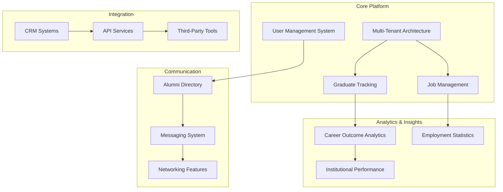
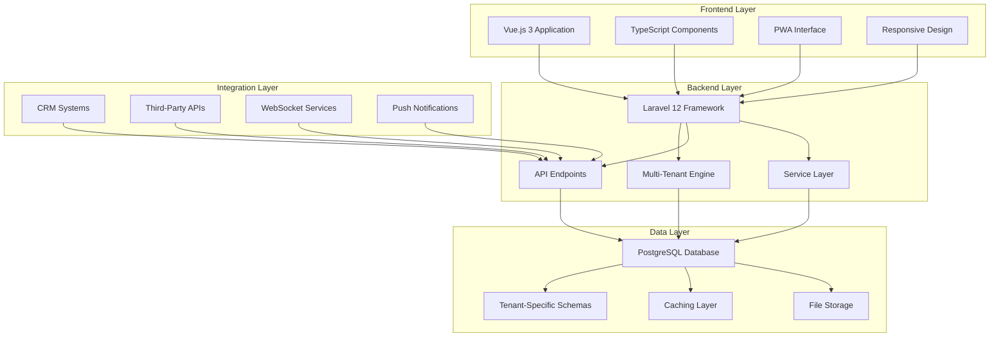
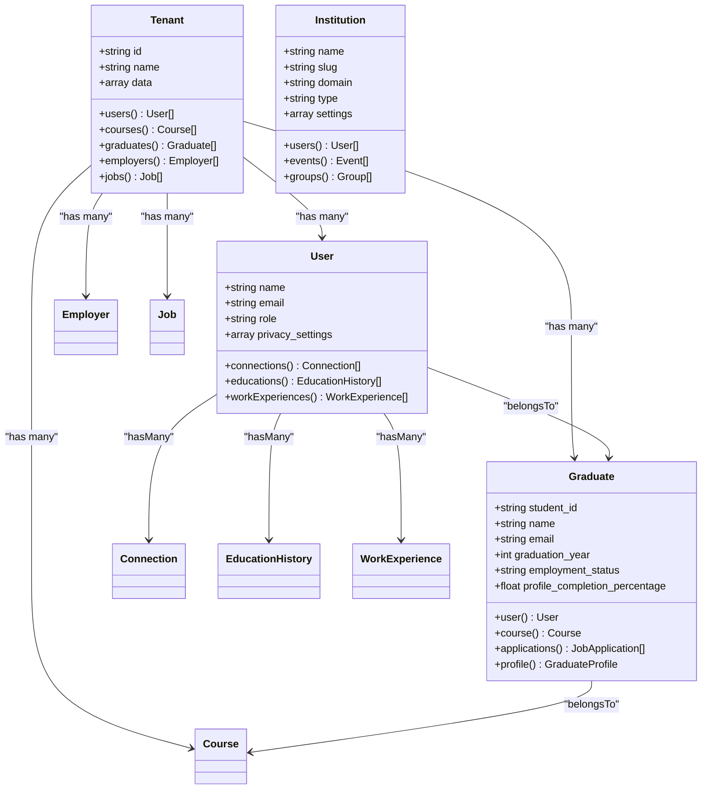
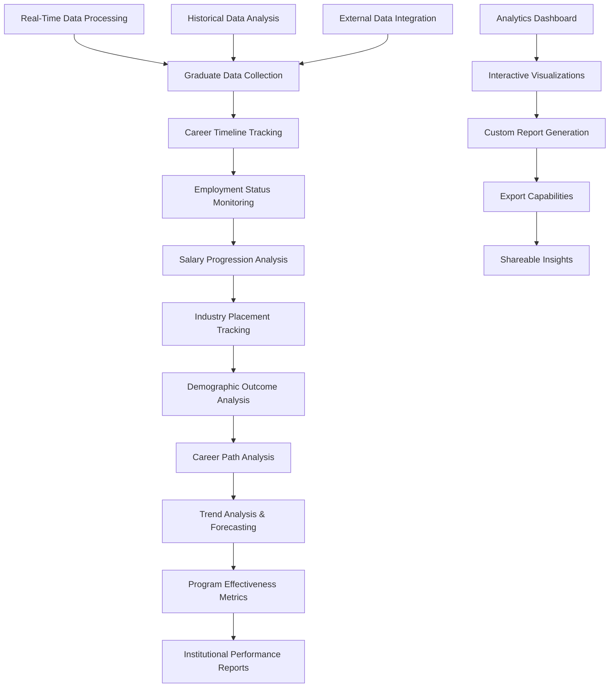
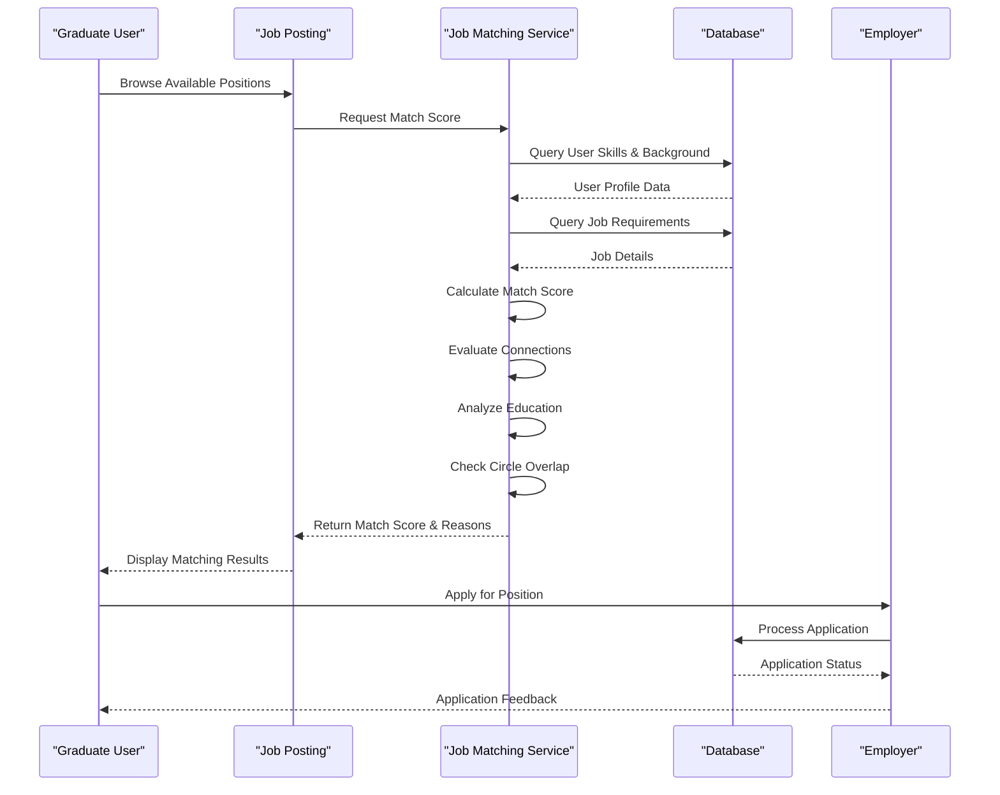
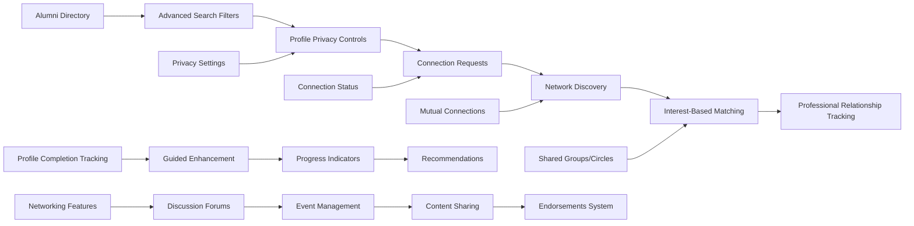
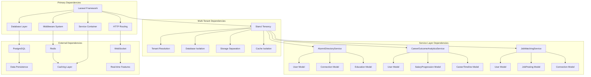

# Introduction and Mission

<cite>
**Referenced Files in This Document**
- [README.md](file://README.md)
- [ROADMAP.md](file://ROADMAP.md)
- [config/tenancy.php](file://config/tenancy.php)
- [app/Models/Tenant.php](file://app/Models/Tenant.php)
- [app/Models/Institution.php](file://app/Models/Institution.php)
- [app/Models/Graduate.php](file://app/Models/Graduate.php)
- [app/Services/AlumniDirectoryService.php](file://app/Services/AlumniDirectoryService.php)
- [app/Services/CareerOutcomeAnalyticsService.php](file://app/Services/CareerOutcomeAnalyticsService.php)
- [app/Services/JobMatchingService.php](file://app/Services/JobMatchingService.php)
- [app/Http/Controllers/SuperAdminDashboardController.php](file://app/Http/Controllers/SuperAdminDashboardController.php)
- [docs/README.md](file://docs/README.md)
</cite>

## Table of Contents
1. [Introduction](#introduction)
2. [Project Structure](#project-structure)
3. [Core Components](#core-components)
4. [Architecture Overview](#architecture-overview)
5. [Detailed Component Analysis](#detailed-component-analysis)
6. [Dependency Analysis](#dependency-analysis)
7. [Performance Considerations](#performance-considerations)
8. [Troubleshooting Guide](#troubleshooting-guide)
9. [Conclusion](#conclusion)

## Introduction
Alumate is a comprehensive multi-tenant platform designed to connect Technical and Vocational Education and Training (TVET) institutions with their graduates and potential employers. The platform's mission is to create a thriving digital ecosystem where educational institutions can effectively track alumni success, graduates can advance their careers, employers can find top talent, and students can access mentorship and opportunities. The vision is to become the leading platform that bridges the gap between education and career success, fostering lifelong connections and continuous growth.

The platform addresses real-world challenges in graduate tracking and career development through advanced technology integration. It maintains separate data spaces for different institutions while enabling seamless collaboration across the ecosystem. The multi-tenant architecture ensures complete data isolation between institutions, allowing each to operate independently with their own users, data, and configurations.

## Project Structure
The Alumate platform follows a modern Laravel architecture with Vue.js frontend components. The system is organized around several key areas:

**Diagram sources**
- [README.md:40-178](file://README.md#L40-L178)
- [ROADMAP.md:36-52](file://ROADMAP.md#L36-L52)

The platform consists of:
- **Multi-Tenant Infrastructure**: Complete data isolation between institutions
- **User Management**: Role-based access control with granular permissions
- **Graduate Management**: Comprehensive tracking of career progression
- **Job Management**: Smart matching and placement systems
- **Analytics & Reporting**: Advanced insights and trend analysis
- **Communication Systems**: Integrated messaging and networking
- **Integration Layer**: CRM connectivity and API services

**Section sources**
- [README.md:40-178](file://README.md#L40-L178)
- [ROADMAP.md:36-52](file://ROADMAP.md#L36-L52)

## Core Components
The platform's core components work together to deliver a comprehensive graduate tracking and career development solution:

### Multi-Tenant Architecture
The platform implements a sophisticated multi-tenant system that provides complete data isolation between institutions. Each tenant operates in its own secure environment with independent databases, file storage, and configurations. The system supports automatic tenant resolution through domain-based identification and provides centralized management capabilities for super admins.

### User Management System
The platform supports four primary user roles with distinct capabilities:
- **Super Admin**: System-wide management and analytics
- **Institution Admin**: Graduate and course management within their institution
- **Employer**: Job posting, candidate search, and application management
- **Graduate**: Profile management, job applications, and career tracking

### Graduate Tracking System
Comprehensive graduate management includes profile completion tracking, employment status monitoring, skills assessment, and career timeline visualization. The system provides detailed analytics on graduate outcomes and career progression.

### Job Management & Matching
Smart job matching algorithms connect graduates with relevant opportunities based on skills, education, connections, and career interests. The system includes automated notifications, application tracking, and employer verification processes.

**Section sources**
- [README.md:181-219](file://README.md#L181-L219)
- [config/tenancy.php:12-82](file://config/tenancy.php#L12-L82)
- [app/Models/Tenant.php:11-85](file://app/Models/Tenant.php#L11-L85)

## Architecture Overview
The Alumate platform employs a modern, scalable architecture built on Laravel and Vue.js:

**Diagram sources**
- [README.md:236-264](file://README.md#L236-L264)
- [config/tenancy.php:21-27](file://config/tenancy.php#L21-L27)

The architecture emphasizes:
- **Scalability**: Support for unlimited institutions with independent data
- **Security**: Complete data isolation and tenant-specific access controls
- **Performance**: Multi-layer caching and optimized database queries
- **Integration**: Extensive API connectivity and third-party integrations

**Section sources**
- [README.md:236-264](file://README.md#L236-L264)
- [ROADMAP.md:46-51](file://ROADMAP.md#L46-L51)

## Detailed Component Analysis

### Multi-Tenant Data Management
The platform's multi-tenant architecture ensures complete data isolation between institutions while maintaining efficient resource utilization:

**Diagram sources**
- [app/Models/Tenant.php:11-85](file://app/Models/Tenant.php#L11-L85)
- [app/Models/Institution.php:10-76](file://app/Models/Institution.php#L10-L76)
- [app/Models/Graduate.php:11-242](file://app/Models/Graduate.php#L11-L242)

The multi-tenant implementation provides:
- **Complete Data Isolation**: Each institution's data remains separate and secure
- **Independent Configurations**: Custom branding, settings, and features per tenant
- **Scalable Infrastructure**: Support for unlimited institutions with independent databases
- **Centralized Management**: Super admin oversight and control across all tenants

**Section sources**
- [config/tenancy.php:12-82](file://config/tenancy.php#L12-L82)
- [app/Models/Tenant.php:11-85](file://app/Models/Tenant.php#L11-L85)

### Career Outcome Analytics System
The platform provides comprehensive analytics for tracking graduate success and institutional performance:

**Diagram sources**
- [app/Services/CareerOutcomeAnalyticsService.php:15-511](file://app/Services/CareerOutcomeAnalyticsService.php#L15-L511)

The analytics system enables:
- **Employment Rate Tracking**: Real-time monitoring of graduate employment outcomes
- **Salary Progression Analysis**: Detailed compensation tracking over time
- **Industry Placement Insights**: Geographic and sector-based placement analysis
- **Program Effectiveness Measurement**: Comparative analysis of academic programs
- **Demographic Outcome Analysis**: Diversity and inclusion metrics
- **Trend Forecasting**: Predictive analytics for future outcomes

**Section sources**
- [app/Services/CareerOutcomeAnalyticsService.php:15-511](file://app/Services/CareerOutcomeAnalyticsService.php#L15-L511)

### Job Matching and Placement System
The intelligent job matching system connects graduates with relevant opportunities through advanced algorithms:

**Diagram sources**
- [app/Services/JobMatchingService.php:12-362](file://app/Services/JobMatchingService.php#L12-L362)

The job matching system incorporates:
- **Network-Based Recommendations**: Leverages mutual connections for relevant opportunities
- **Skills-Based Matching**: Advanced algorithm matching graduate skills with job requirements
- **Education Relevance Scoring**: Evaluates academic background against position requirements
- **Circle Overlap Analysis**: Identifies shared alumni circles with company employees
- **Dynamic Scoring Weights**: Adjustable weighting for different match factors

**Section sources**
- [app/Services/JobMatchingService.php:12-362](file://app/Services/JobMatchingService.php#L12-L362)

### Alumni Directory and Networking
The platform facilitates meaningful connections between graduates and professionals:

**Diagram sources**
- [app/Services/AlumniDirectoryService.php:12-464](file://app/Services/AlumniDirectoryService.php#L12-L464)

The networking system provides:
- **Advanced Search Capabilities**: Multi-criteria filtering for finding connections
- **Privacy-First Design**: Granular control over profile visibility and contact information
- **Connection Discovery**: Algorithm-driven suggestions based on mutual connections
- **Interest-Based Matching**: Similarity scoring for professional relationships
- **Group & Circle Integration**: Community building through shared interests
- **Professional Development**: Skills endorsement and recommendation systems

**Section sources**
- [app/Services/AlumniDirectoryService.php:12-464](file://app/Services/AlumniDirectoryService.php#L12-L464)

## Dependency Analysis
The platform's architecture demonstrates clear separation of concerns with well-defined dependencies:

**Diagram sources**
- [README.md:236-264](file://README.md#L236-L264)
- [config/tenancy.php:21-58](file://config/tenancy.php#L21-L58)

The dependency structure ensures:
- **Modular Design**: Clear separation between core platform and tenant-specific implementations
- **Service-Oriented Architecture**: Well-defined service boundaries and dependencies
- **External Integration Points**: Clean interfaces for CRM systems and third-party tools
- **Scalable Infrastructure**: Independent caching, database, and storage layers per tenant

**Section sources**
- [README.md:236-264](file://README.md#L236-L264)
- [config/tenancy.php:21-58](file://config/tenancy.php#L21-L58)

## Performance Considerations
The platform is designed with performance and scalability as core priorities:

### Multi-Tenant Performance Optimization
- **Database Query Optimization**: Tenant-scoped queries with proper indexing strategies
- **Caching Strategy**: Tenant-aware caching with Redis for frequently accessed data
- **Connection Pooling**: Efficient database connection management across tenants
- **Storage Separation**: Independent file storage per tenant to prevent bottlenecks

### Real-Time Features
- **WebSocket Integration**: Pusher/WebSocket implementation for live updates
- **Background Processing**: Queue-based job processing for heavy computations
- **Service Worker Caching**: Progressive Web App caching for offline functionality
- **CDN Integration**: Content delivery network for global asset distribution

### Analytics and Reporting
- **Aggregation Strategies**: Tenant-specific data aggregation for performance
- **Index Optimization**: Database indexes tailored for analytics queries
- **Data Partitioning**: Logical partitioning of large datasets by tenant
- **Query Optimization**: Efficient analytical queries with proper joins and filters

## Troubleshooting Guide
Common issues and their resolutions:

### Multi-Tenant Issues
- **Tenant Resolution Failures**: Verify domain configuration in tenancy settings
- **Data Isolation Problems**: Check tenant database schema and connection settings
- **Cross-Tenant Access Attempts**: Review tenant bootstrapper configuration
- **Storage Path Issues**: Verify tenant-specific storage path configuration

### Performance Issues
- **Slow Query Performance**: Implement proper database indexing and query optimization
- **Memory Usage**: Monitor Redis cache usage and implement eviction policies
- **Database Connection Limits**: Configure connection pooling and limit per tenant
- **API Response Timeouts**: Implement background job processing for heavy operations

### Integration Problems
- **CRM Connection Failures**: Verify API credentials and endpoint configurations
- **WebSocket Connection Issues**: Check Pusher configuration and network connectivity
- **File Upload Problems**: Verify tenant-specific storage permissions and quotas
- **Email Delivery Issues**: Configure proper SMTP settings per tenant

**Section sources**
- [app/Http/Controllers/SuperAdminDashboardController.php:417-445](file://app/Http/Controllers/SuperAdminDashboardController.php#L417-L445)

## Conclusion
Alumate represents a comprehensive solution for modern graduate tracking and career development. The platform's multi-tenant architecture, combined with advanced analytics and intelligent matching systems, creates a powerful ecosystem that connects educational institutions, alumni, employers, and students.

The platform's commitment to fostering lifelong connections and continuous growth is evident in its comprehensive feature set, from detailed graduate tracking to sophisticated job matching algorithms. The multi-tenant approach serves as a key differentiator, enabling institutions to maintain complete data sovereignty while participating in a broader educational ecosystem.

Through its focus on real-world applications, the platform addresses critical challenges in graduate tracking and career development, providing actionable insights and meaningful connections that drive success for all stakeholders. The combination of technical excellence and practical functionality positions Alumate as a leading solution in the education technology space.