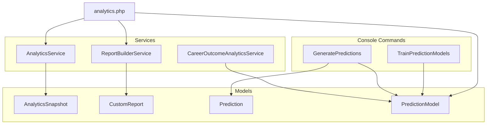
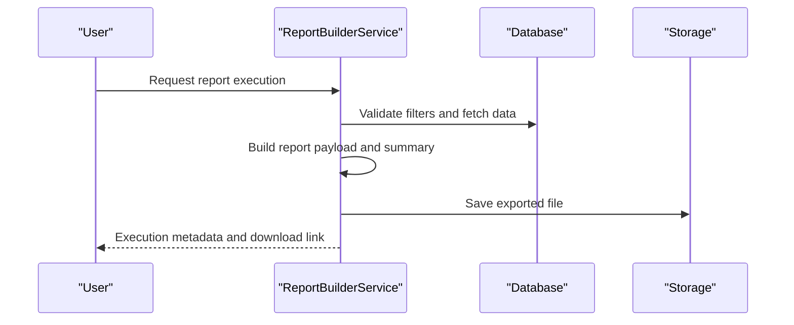
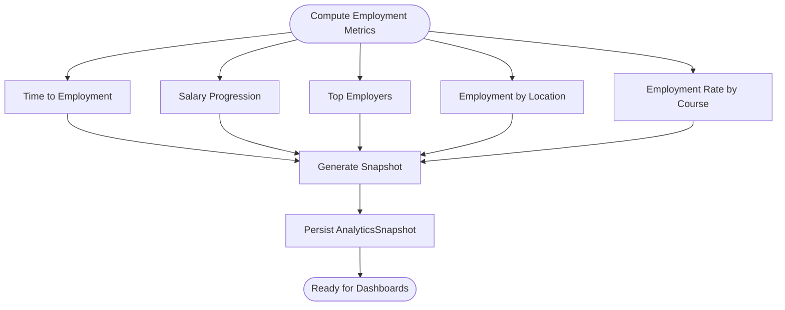
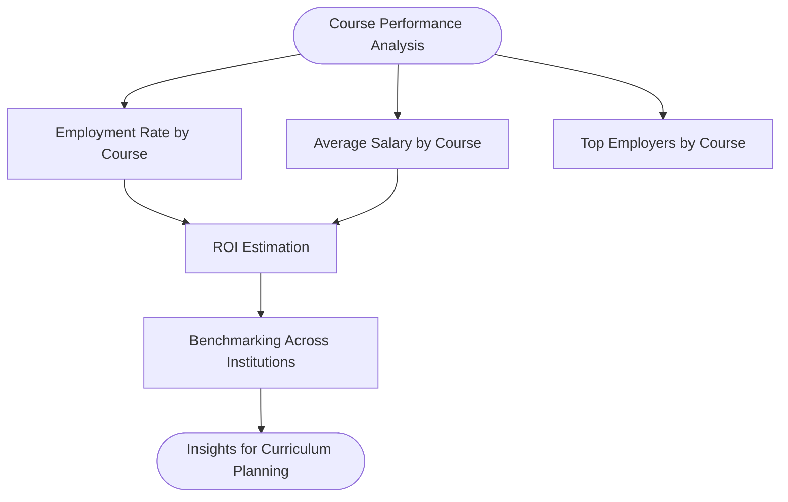
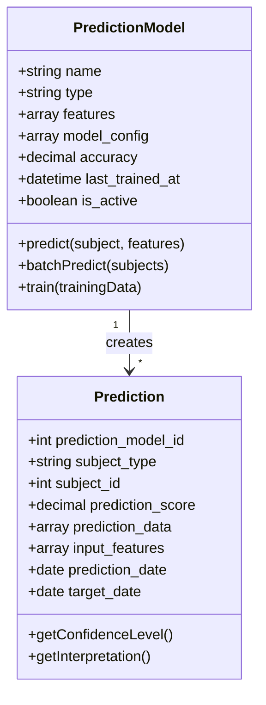
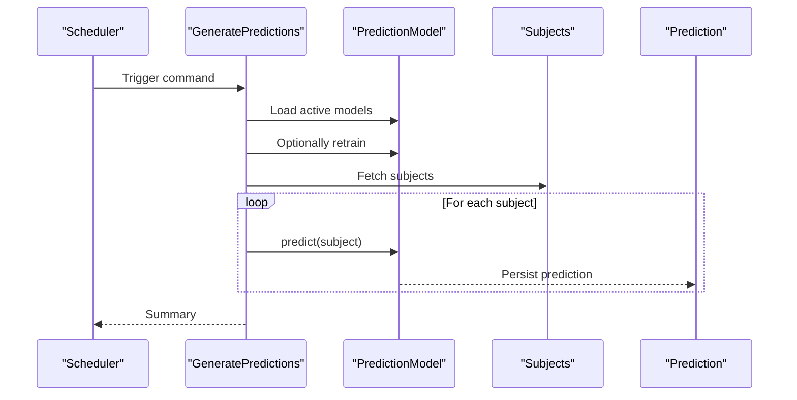
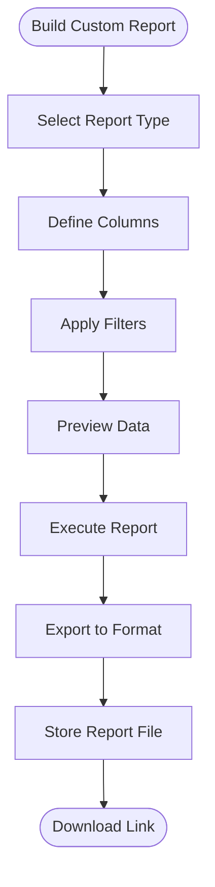
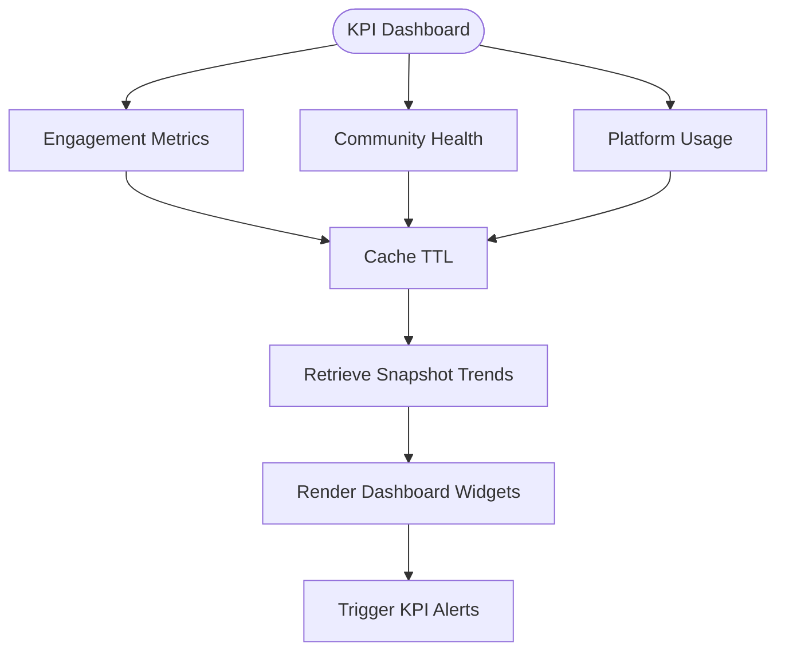
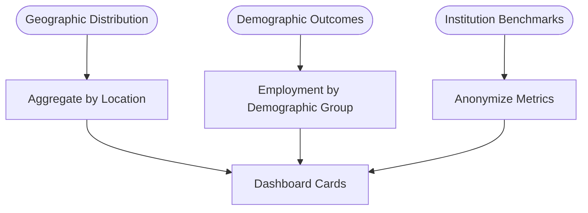
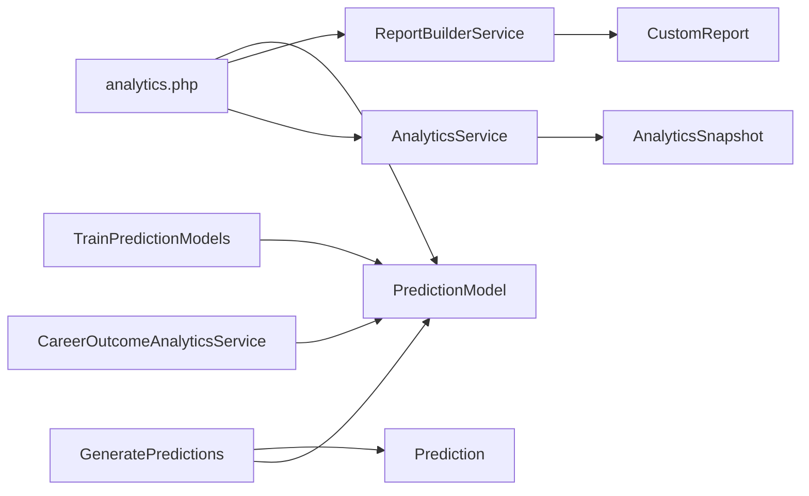

# Analytics & Reporting

<cite>
**Referenced Files in This Document**
- [AnalyticsService.php](file://app/Services/AnalyticsService.php)
- [CareerOutcomeAnalyticsService.php](file://app/Services/CareerOutcomeAnalyticsService.php)
- [ReportBuilderService.php](file://app/Services/ReportBuilderService.php)
- [AnalyticsSnapshot.php](file://app/Models/AnalyticsSnapshot.php)
- [CustomReport.php](file://app/Models/CustomReport.php)
- [Prediction.php](file://app/Models/Prediction.php)
- [PredictionModel.php](file://app/Models/PredictionModel.php)
- [GeneratePredictions.php](file://app/Console/Commands/GeneratePredictions.php)
- [TrainPredictionModels.php](file://app/Console/Commands/TrainPredictionModels.php)
- [analytics.php](file://config/analytics.php)
</cite>

## Table of Contents
1. [Introduction](#introduction)
2. [Project Structure](#project-structure)
3. [Core Components](#core-components)
4. [Architecture Overview](#architecture-overview)
5. [Detailed Component Analysis](#detailed-component-analysis)
6. [Dependency Analysis](#dependency-analysis)
7. [Performance Considerations](#performance-considerations)
8. [Troubleshooting Guide](#troubleshooting-guide)
9. [Conclusion](#conclusion)
10. [Appendices](#appendices)

## Introduction
This document describes the analytics and reporting system powering employment insights, course performance analysis, predictive modeling, and customizable reporting. It covers:
- Employment analytics with graduation-to-employment tracking and ROI measurement
- Course performance analysis and benchmarking
- Predictive analytics with job placement modeling and automated model training
- Custom report builder with scheduling and export
- KPI dashboards, trend analysis, demographic and geographic distribution
- Historical data snapshots, forecasting capabilities, and real-time performance indicators

## Project Structure
The analytics system is organized around services, models, and console commands:
- Services encapsulate analytics computations and report generation
- Models represent persisted analytics artifacts (snapshots, predictions, reports)
- Console commands automate periodic tasks (predictions, training, snapshots)
- Configuration centralizes behavior toggles and thresholds

**Diagram sources**
- [AnalyticsService.php:22-800](file://app/Services/AnalyticsService.php#L22-L800)
- [CareerOutcomeAnalyticsService.php:15-511](file://app/Services/CareerOutcomeAnalyticsService.php#L15-L511)
- [ReportBuilderService.php:14-736](file://app/Services/ReportBuilderService.php#L14-L736)
- [AnalyticsSnapshot.php:9-82](file://app/Models/AnalyticsSnapshot.php#L9-L82)
- [CustomReport.php:10-195](file://app/Models/CustomReport.php#L10-L195)
- [Prediction.php:11-239](file://app/Models/Prediction.php#L11-L239)
- [PredictionModel.php:9-380](file://app/Models/PredictionModel.php#L9-L380)
- [GeneratePredictions.php:11-161](file://app/Console/Commands/GeneratePredictions.php#L11-L161)
- [TrainPredictionModels.php:8-436](file://app/Console/Commands/TrainPredictionModels.php#L8-L436)
- [analytics.php:1-242](file://config/analytics.php#L1-L242)

**Section sources**
- [AnalyticsService.php:22-800](file://app/Services/AnalyticsService.php#L22-L800)
- [CareerOutcomeAnalyticsService.php:15-511](file://app/Services/CareerOutcomeAnalyticsService.php#L15-L511)
- [ReportBuilderService.php:14-736](file://app/Services/ReportBuilderService.php#L14-L736)
- [AnalyticsSnapshot.php:9-82](file://app/Models/AnalyticsSnapshot.php#L9-L82)
- [CustomReport.php:10-195](file://app/Models/CustomReport.php#L10-L195)
- [Prediction.php:11-239](file://app/Models/Prediction.php#L11-L239)
- [PredictionModel.php:9-380](file://app/Models/PredictionModel.php#L9-L380)
- [GeneratePredictions.php:11-161](file://app/Console/Commands/GeneratePredictions.php#L11-L161)
- [TrainPredictionModels.php:8-436](file://app/Console/Commands/TrainPredictionModels.php#L8-L436)
- [analytics.php:1-242](file://config/analytics.php#L1-L242)

## Core Components
- AnalyticsService: Computes engagement, community health, platform usage, and graduate outcome metrics; supports custom report generation and exports.
- CareerOutcomeAnalyticsService: Provides comprehensive career outcome analytics including program effectiveness, salary analysis, industry placement, demographics, and trends.
- ReportBuilderService: Builds custom reports across domains (employment, course performance, job market, employer analytics), validates filters, generates previews, and exports to multiple formats.
- AnalyticsSnapshot: Stores historical snapshots of aggregated metrics for trend analysis.
- CustomReport: Defines report templates, available columns/filters, scheduling, and execution history.
- PredictionModel: Manages predictive models (job placement, employment success), training, and configuration.
- Prediction: Stores individual predictions with confidence interpretation and risk factors.
- Console commands: Automate prediction generation and model retraining.

**Section sources**
- [AnalyticsService.php:22-800](file://app/Services/AnalyticsService.php#L22-L800)
- [CareerOutcomeAnalyticsService.php:15-511](file://app/Services/CareerOutcomeAnalyticsService.php#L15-L511)
- [ReportBuilderService.php:14-736](file://app/Services/ReportBuilderService.php#L14-L736)
- [AnalyticsSnapshot.php:9-82](file://app/Models/AnalyticsSnapshot.php#L9-L82)
- [CustomReport.php:10-195](file://app/Models/CustomReport.php#L10-L195)
- [Prediction.php:11-239](file://app/Models/Prediction.php#L11-L239)
- [PredictionModel.php:9-380](file://app/Models/PredictionModel.php#L9-L380)
- [GeneratePredictions.php:11-161](file://app/Console/Commands/GeneratePredictions.php#L11-L161)
- [TrainPredictionModels.php:8-436](file://app/Console/Commands/TrainPredictionModels.php#L8-L436)

## Architecture Overview
The system integrates domain services, persistence, and automation:
- Services query models and compute aggregates, applying filters and caching.
- Snapshots capture historical states for trend analysis.
- Reports are templated and executed asynchronously with validation and export.
- Predictive models are trained periodically and used to generate predictions with interpretability.

**Diagram sources**
- [ReportBuilderService.php:16-73](file://app/Services/ReportBuilderService.php#L16-L73)
- [ReportBuilderService.php:40-54](file://app/Services/ReportBuilderService.php#L40-L54)
- [ReportBuilderService.php:56-73](file://app/Services/ReportBuilderService.php#L56-L73)
- [CustomReport.php:14-51](file://app/Models/CustomReport.php#L14-L51)

**Section sources**
- [ReportBuilderService.php:14-736](file://app/Services/ReportBuilderService.php#L14-L736)
- [CustomReport.php:10-195](file://app/Models/CustomReport.php#L10-L195)

## Detailed Component Analysis

### Employment Analytics and Graduation-to-Employment Tracking
- Metrics include time-to-employment, salary progression, top employers, employment by location, and employment rate by course.
- Snapshot generation captures outcomes for historical trend analysis.
- ROI calculation for courses uses average salary and estimated earnings over time.

**Diagram sources**
- [AnalyticsService.php:511-588](file://app/Services/AnalyticsService.php#L511-L588)
- [AnalyticsService.php:590-618](file://app/Services/AnalyticsService.php#L590-L618)
- [AnalyticsSnapshot.php:48-70](file://app/Models/AnalyticsSnapshot.php#L48-L70)

**Section sources**
- [AnalyticsService.php:511-618](file://app/Services/AnalyticsService.php#L511-L618)
- [AnalyticsSnapshot.php:9-82](file://app/Models/AnalyticsSnapshot.php#L9-L82)

### Course Performance Analysis and ROI Measurement
- Computes employment rates, average salary, and top hiring companies per course.
- Generates ROI estimates based on projected lifetime earnings minus program costs.
- Benchmarks across institutions using anonymized snapshots.

**Diagram sources**
- [AnalyticsService.php:775-793](file://app/Services/AnalyticsService.php#L775-L793)
- [AnalyticsService.php:590-618](file://app/Services/AnalyticsService.php#L590-L618)
- [AnalyticsService.php:680-701](file://app/Services/AnalyticsService.php#L680-L701)

**Section sources**
- [AnalyticsService.php:590-701](file://app/Services/AnalyticsService.php#L590-L701)

### Predictive Analytics with Job Placement Modeling
- PredictionModel defines model types, features, configuration, and training/validation.
- Prediction stores scores, confidence, risk factors, and recommendations.
- Console commands automate training and prediction generation with retraining checks.

**Diagram sources**
- [PredictionModel.php:9-380](file://app/Models/PredictionModel.php#L9-L380)
- [Prediction.php:11-239](file://app/Models/Prediction.php#L11-L239)

**Diagram sources**
- [GeneratePredictions.php:20-116](file://app/Console/Commands/GeneratePredictions.php#L20-L116)
- [TrainPredictionModels.php:17-168](file://app/Console/Commands/TrainPredictionModels.php#L17-L168)
- [PredictionModel.php:71-126](file://app/Models/PredictionModel.php#L71-L126)
- [Prediction.php:11-239](file://app/Models/Prediction.php#L11-L239)

**Section sources**
- [PredictionModel.php:9-380](file://app/Models/PredictionModel.php#L9-L380)
- [Prediction.php:11-239](file://app/Models/Prediction.php#L11-L239)
- [GeneratePredictions.php:11-161](file://app/Console/Commands/GeneratePredictions.php#L11-L161)
- [TrainPredictionModels.php:8-436](file://app/Console/Commands/TrainPredictionModels.php#L8-L436)

### Custom Report Builder
- Supports multiple report types (employment, course performance, job market, graduate outcomes, employer analytics, institution overview).
- Validates filters, builds previews, executes asynchronously, and exports to CSV, Excel, PDF, JSON.
- Integrates with scheduling and access controls.

**Diagram sources**
- [ReportBuilderService.php:16-54](file://app/Services/ReportBuilderService.php#L16-L54)
- [ReportBuilderService.php:56-73](file://app/Services/ReportBuilderService.php#L56-L73)
- [ReportBuilderService.php:93-130](file://app/Services/ReportBuilderService.php#L93-L130)
- [CustomReport.php:70-156](file://app/Models/CustomReport.php#L70-L156)

**Section sources**
- [ReportBuilderService.php:14-736](file://app/Services/ReportBuilderService.php#L14-L736)
- [CustomReport.php:10-195](file://app/Models/CustomReport.php#L10-L195)

### KPI Dashboards, Trend Analysis, and Real-Time Indicators
- AnalyticsService computes engagement, community health, platform usage, and growth metrics with caching.
- AnalyticsSnapshot persists daily/weekly/monthly snapshots for trend retrieval.
- Configuration defines KPI thresholds, refresh intervals, and widget defaults.

**Diagram sources**
- [AnalyticsService.php:27-96](file://app/Services/AnalyticsService.php#L27-L96)
- [AnalyticsService.php:48-78](file://app/Services/AnalyticsService.php#L48-L78)
- [AnalyticsSnapshot.php:48-70](file://app/Models/AnalyticsSnapshot.php#L48-L70)
- [analytics.php:22-71](file://config/analytics.php#L22-L71)

**Section sources**
- [AnalyticsService.php:22-133](file://app/Services/AnalyticsService.php#L22-L133)
- [AnalyticsSnapshot.php:9-82](file://app/Models/AnalyticsSnapshot.php#L9-L82)
- [analytics.php:1-242](file://config/analytics.php#L1-L242)

### Demographic and Geographic Distribution
- Geographic distribution aggregates counts by location.
- Demographic outcomes are computed via CareerOutcomeAnalyticsService for employment rates by group.
- Platform benchmarks compare institutions anonymously.

**Diagram sources**
- [AnalyticsService.php:283-292](file://app/Services/AnalyticsService.php#L283-L292)
- [CareerOutcomeAnalyticsService.php:243-256](file://app/Services/CareerOutcomeAnalyticsService.php#L243-L256)
- [AnalyticsService.php:680-701](file://app/Services/AnalyticsService.php#L680-L701)

**Section sources**
- [AnalyticsService.php:283-292](file://app/Services/AnalyticsService.php#L283-L292)
- [CareerOutcomeAnalyticsService.php:243-256](file://app/Services/CareerOutcomeAnalyticsService.php#L243-L256)
- [AnalyticsService.php:680-701](file://app/Services/AnalyticsService.php#L680-L701)

## Dependency Analysis
- Services depend on models for data access and persistence.
- Console commands orchestrate model lifecycle and prediction generation.
- Configuration drives caching, thresholds, and operational behavior.

**Diagram sources**
- [AnalyticsService.php:22-800](file://app/Services/AnalyticsService.php#L22-L800)
- [CareerOutcomeAnalyticsService.php:15-511](file://app/Services/CareerOutcomeAnalyticsService.php#L15-L511)
- [ReportBuilderService.php:14-736](file://app/Services/ReportBuilderService.php#L14-L736)
- [AnalyticsSnapshot.php:9-82](file://app/Models/AnalyticsSnapshot.php#L9-L82)
- [CustomReport.php:10-195](file://app/Models/CustomReport.php#L10-L195)
- [Prediction.php:11-239](file://app/Models/Prediction.php#L11-L239)
- [PredictionModel.php:9-380](file://app/Models/PredictionModel.php#L9-L380)
- [GeneratePredictions.php:11-161](file://app/Console/Commands/GeneratePredictions.php#L11-L161)
- [TrainPredictionModels.php:8-436](file://app/Console/Commands/TrainPredictionModels.php#L8-L436)
- [analytics.php:1-242](file://config/analytics.php#L1-L242)

**Section sources**
- [AnalyticsService.php:22-800](file://app/Services/AnalyticsService.php#L22-L800)
- [ReportBuilderService.php:14-736](file://app/Services/ReportBuilderService.php#L14-L736)
- [PredictionModel.php:9-380](file://app/Models/PredictionModel.php#L9-L380)
- [analytics.php:1-242](file://config/analytics.php#L1-L242)

## Performance Considerations
- Caching: Metrics are cached with configurable TTL to reduce query load.
- Chunking and timeouts: Query and memory limits, chunk sizes, and optional parallel processing are configurable.
- Export batching: Large exports are processed in batches to manage memory and time limits.
- Snapshot retention: Historical snapshots are retained for a configurable number of days.

[No sources needed since this section provides general guidance]

## Troubleshooting Guide
- Prediction model training failures: Inspect minimum training data thresholds and validation warnings; use force retraining when necessary.
- Prediction generation errors: Review per-subject exceptions and ensure models are active and not expired.
- Report execution timeouts: Adjust report timeout and record limits; consider reducing requested columns or date ranges.
- Export size exceeded: Reduce dataset size or adjust batch size and file size limits.
- KPI alerts: Verify threshold configuration and schedule; confirm auto-calculation settings.

**Section sources**
- [TrainPredictionModels.php:150-153](file://app/Console/Commands/TrainPredictionModels.php#L150-L153)
- [TrainPredictionModels.php:166-168](file://app/Console/Commands/TrainPredictionModels.php#L166-L168)
- [GeneratePredictions.php:100-103](file://app/Console/Commands/GeneratePredictions.php#L100-L103)
- [analytics.php:97-107](file://config/analytics.php#L97-L107)
- [analytics.php:140-144](file://config/analytics.php#L140-L144)
- [analytics.php:54-71](file://config/analytics.php#L54-L71)

## Conclusion
The analytics and reporting system provides robust employment insights, course performance analysis, predictive modeling, and customizable reporting. With caching, snapshots, and configurable thresholds, it supports dashboards, trend analysis, and automated model maintenance. The modular design enables extensibility for additional metrics, models, and report types.

[No sources needed since this section summarizes without analyzing specific files]

## Appendices

### Example Workflows
- Employment report generation: Select “Employment Report,” choose filters (date range, course, employment status), preview, execute, and export to CSV/Excel/PDF/JSON.
- Predictive model training: Use the training command to retrain models by type or ID; validate predictions afterward.
- Snapshot-based trend: Retrieve latest weekly snapshot and render trends for employment rate and salary progression.

**Section sources**
- [ReportBuilderService.php:16-54](file://app/Services/ReportBuilderService.php#L16-L54)
- [TrainPredictionModels.php:17-168](file://app/Console/Commands/TrainPredictionModels.php#L17-L168)
- [AnalyticsSnapshot.php:48-70](file://app/Models/AnalyticsSnapshot.php#L48-L70)