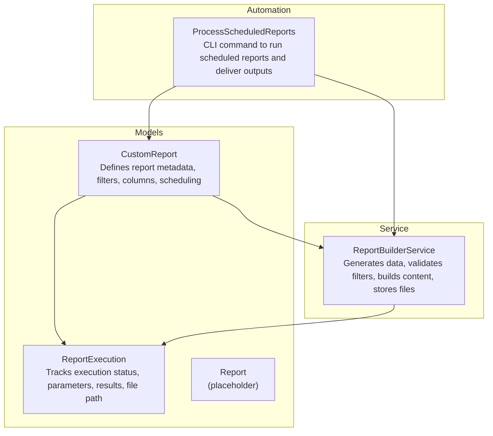
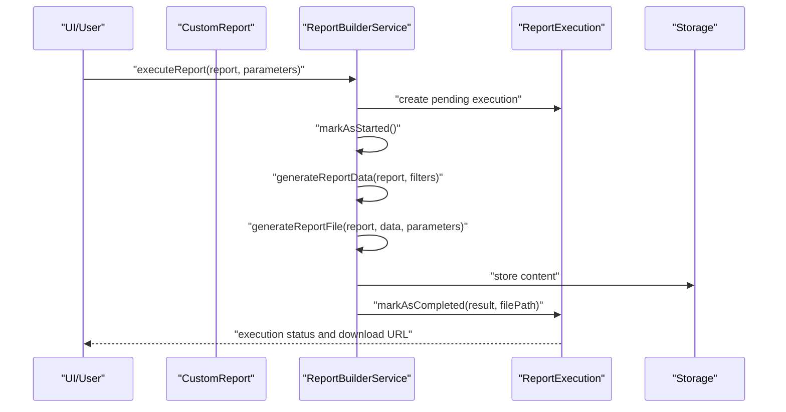
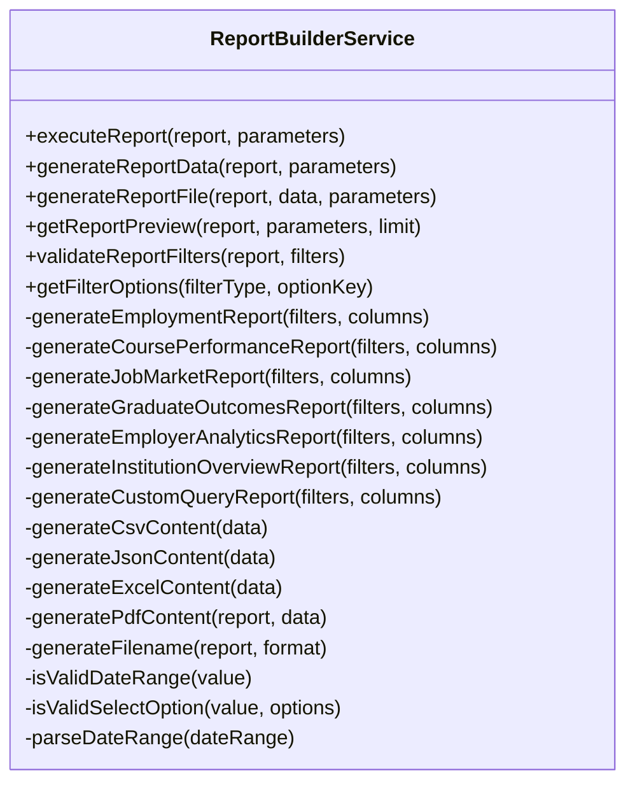
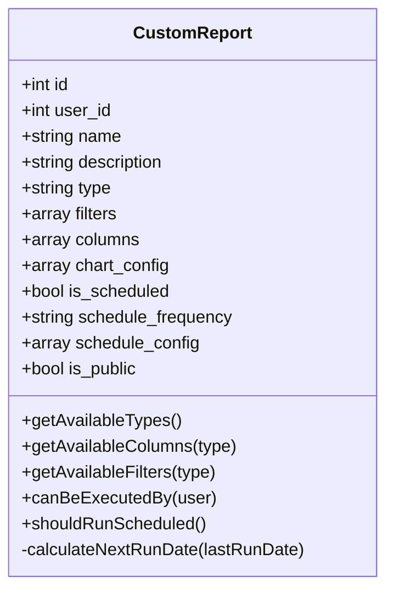
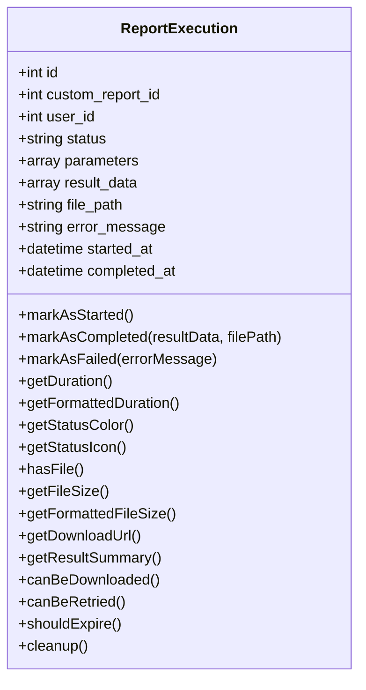
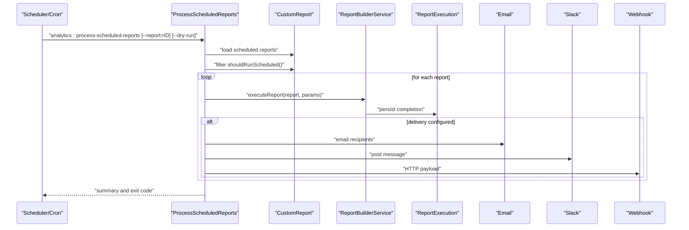
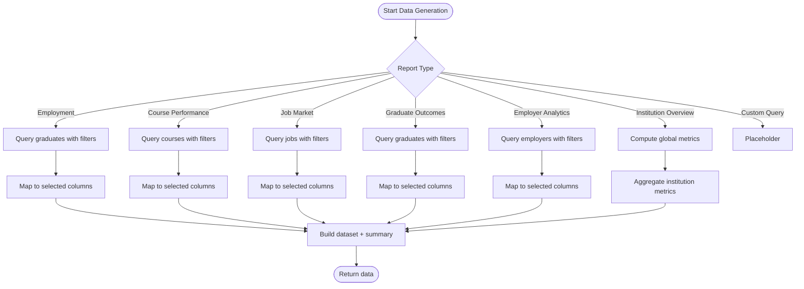
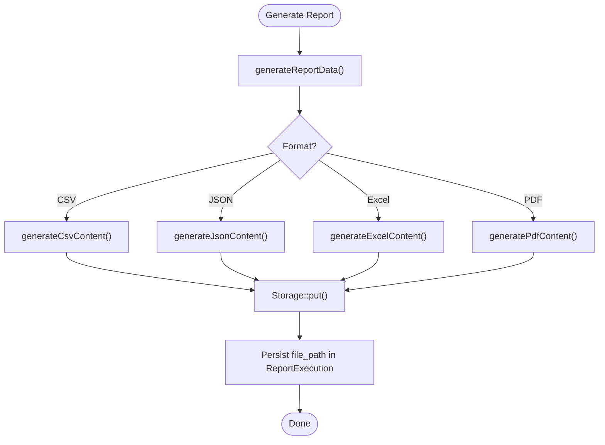
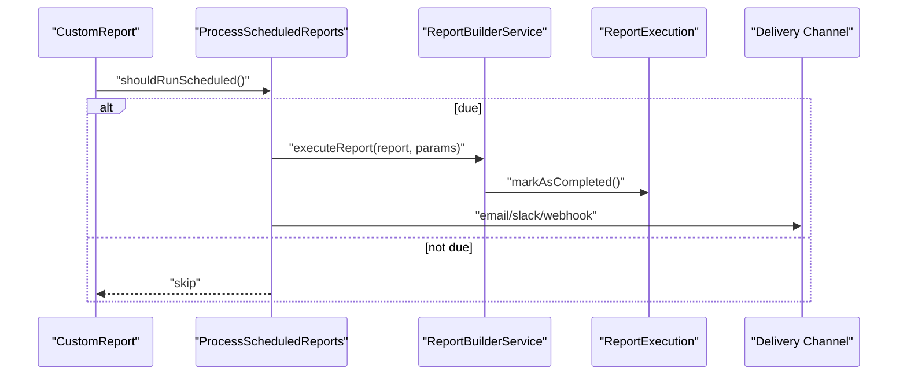
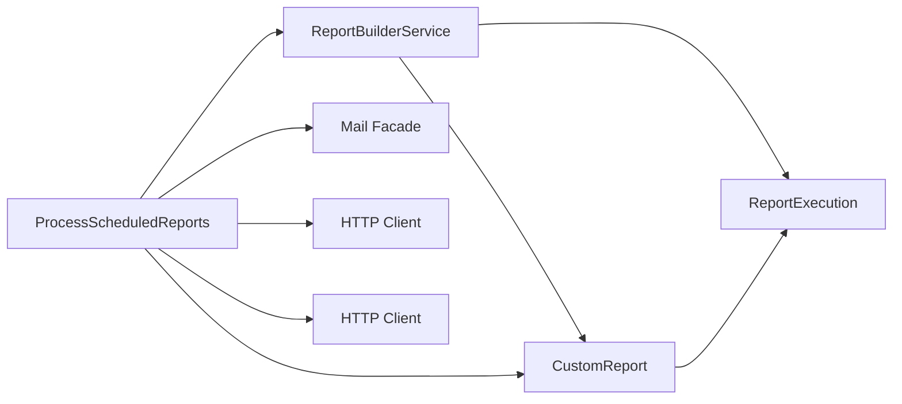

# Custom Report Builder

<cite>
**Referenced Files in This Document**
- [ReportBuilderService.php](file://app/Services/ReportBuilderService.php)
- [CustomReport.php](file://app/Models/CustomReport.php)
- [ReportExecution.php](file://app/Models/ReportExecution.php)
- [ProcessScheduledReports.php](file://app/Console/Commands/ProcessScheduledReports.php)
- [Report.php](file://app/Models/Report.php)
</cite>

## Table of Contents
1. [Introduction](#introduction)
2. [Project Structure](#project-structure)
3. [Core Components](#core-components)
4. [Architecture Overview](#architecture-overview)
5. [Detailed Component Analysis](#detailed-component-analysis)
6. [Dependency Analysis](#dependency-analysis)
7. [Performance Considerations](#performance-considerations)
8. [Troubleshooting Guide](#troubleshooting-guide)
9. [Conclusion](#conclusion)
10. [Appendices](#appendices)

## Introduction
This document describes the Custom Report Builder system that enables users to define, configure, and generate analytical reports across multiple domains (employment, course performance, job market, graduate outcomes, employer analytics, institution overview, and custom queries). It covers:
- Report generation capabilities and supported formats (CSV, JSON, Excel, PDF)
- Metric selection interface and filter configuration
- Data aggregation engine and column mapping
- Preview and export pipeline
- Scheduling capabilities and automated delivery via email, Slack, and webhooks
- Sharing mechanisms and access controls
- Performance characteristics and optimization strategies for large datasets

## Project Structure
The report builder spans three primary areas:
- Models: define report metadata, filters, columns, scheduling, and execution lifecycle
- Service: orchestrates report execution, data aggregation, content generation, and storage
- Console command: processes scheduled reports and delivers them according to configured channels

**Diagram sources**
- [CustomReport.php:10-195](file://app/Models/CustomReport.php#L10-L195)
- [ReportExecution.php:9-247](file://app/Models/ReportExecution.php#L9-L247)
- [ReportBuilderService.php:14-736](file://app/Services/ReportBuilderService.php#L14-L736)
- [ProcessScheduledReports.php:9-281](file://app/Console/Commands/ProcessScheduledReports.php#L9-L281)

**Section sources**
- [CustomReport.php:10-195](file://app/Models/CustomReport.php#L10-L195)
- [ReportExecution.php:9-247](file://app/Models/ReportExecution.php#L9-L247)
- [ReportBuilderService.php:14-736](file://app/Services/ReportBuilderService.php#L14-L736)
- [ProcessScheduledReports.php:9-281](file://app/Console/Commands/ProcessScheduledReports.php#L9-L281)

## Core Components
- CustomReport model
  - Stores report definition (name, type, filters, columns, chart_config)
  - Supports scheduling flags and configuration
  - Provides helper methods to enumerate available types, columns, and filters per type
  - Determines whether a report can be executed by a given user (owner, public flag, or super admin)
  - Calculates next scheduled run time based on frequency and last execution
- ReportExecution model
  - Tracks each run’s lifecycle: pending → processing → completed/failed
  - Captures parameters, result metadata, file path, timestamps, and error messages
  - Offers helpers to compute duration, format file size, and derive download URLs
  - Includes cleanup logic to remove generated files and records when expired
- ReportBuilderService
  - Executes a report: creates an execution record, marks started, generates data, writes file, marks completed
  - Validates filters against report type and filter configuration
  - Generates preview data with optional row limits
  - Builds content in CSV, JSON, Excel, and PDF formats
  - Aggregates domain-specific metrics and summaries
- ProcessScheduledReports command
  - Processes scheduled reports based on last execution and schedule configuration
  - Supports dry-run mode
  - Delivers outputs via email, Slack, or webhook depending on delivery configuration

**Section sources**
- [CustomReport.php:14-195](file://app/Models/CustomReport.php#L14-L195)
- [ReportExecution.php:13-247](file://app/Models/ReportExecution.php#L13-L247)
- [ReportBuilderService.php:16-736](file://app/Services/ReportBuilderService.php#L16-L736)
- [ProcessScheduledReports.php:25-281](file://app/Console/Commands/ProcessScheduledReports.php#L25-L281)

## Architecture Overview
The system follows a layered design:
- UI triggers report execution (either manually or via scheduler)
- ReportBuilderService coordinates data retrieval, transformation, and export
- ReportExecution persists the run state and result metadata
- Storage holds generated files
- Delivery pipeline sends results to configured channels

**Diagram sources**
- [ReportBuilderService.php:16-38](file://app/Services/ReportBuilderService.php#L16-L38)
- [ReportExecution.php:65-90](file://app/Models/ReportExecution.php#L65-L90)
- [ReportExecution.php:194-201](file://app/Models/ReportExecution.php#L194-L201)

## Detailed Component Analysis

### ReportBuilderService
Responsibilities:
- Execution orchestration: create execution record, update status, capture errors
- Data generation: dispatch to type-specific generators and apply filters
- Content generation: CSV, JSON, Excel, PDF
- Preview: limit rows and attach preview metadata
- Validation: ensure filters conform to declared types and options
- Column mapping: transform domain entities into selected columns

Key behaviors:
- Type routing: employment, course performance, job market, graduate outcomes, employer analytics, institution overview, custom query
- Filter application: date ranges, numeric ranges, select options, text matching
- Summary computation: counts, rates, totals, averages
- File naming: safe report name + timestamp + extension
- Export formats: CSV and JSON fully implemented; Excel/PDF placeholders included

**Diagram sources**
- [ReportBuilderService.php:14-736](file://app/Services/ReportBuilderService.php#L14-L736)

**Section sources**
- [ReportBuilderService.php:16-736](file://app/Services/ReportBuilderService.php#L16-L736)

### CustomReport
Responsibilities:
- Define report metadata and configuration
- Enumerate available types, columns, and filters
- Enforce access control (owner, public, super admin)
- Schedule evaluation and next-run calculation

Highlights:
- Types include employment, course performance, job market, graduate outcomes, employer analytics, institution overview, and custom query
- Columns vary by type and are mapped to human-readable labels
- Filters include date ranges, numeric thresholds, and select lists backed by dynamic option sets
- Scheduling supports daily, weekly, monthly, and custom intervals with configurable delivery

**Diagram sources**
- [CustomReport.php:10-195](file://app/Models/CustomReport.php#L10-L195)

**Section sources**
- [CustomReport.php:14-195](file://app/Models/CustomReport.php#L14-L195)

### ReportExecution
Responsibilities:
- Track execution lifecycle and metadata
- Compute durations and file sizes
- Derive download URLs and determine eligibility for retry/expiry
- Provide helpers for status rendering and cleanup

**Diagram sources**
- [ReportExecution.php:9-247](file://app/Models/ReportExecution.php#L9-L247)

**Section sources**
- [ReportExecution.php:13-247](file://app/Models/ReportExecution.php#L13-L247)

### ProcessScheduledReports
Responsibilities:
- Scan scheduled reports and determine which should run based on last execution and schedule
- Execute reports and deliver outputs via email, Slack, or webhook
- Support dry-run mode to preview upcoming runs
- Aggregate processing statistics and log failures

**Diagram sources**
- [ProcessScheduledReports.php:25-281](file://app/Console/Commands/ProcessScheduledReports.php#L25-L281)
- [ReportBuilderService.php:16-38](file://app/Services/ReportBuilderService.php#L16-L38)
- [ReportExecution.php:65-90](file://app/Models/ReportExecution.php#L65-L90)

**Section sources**
- [ProcessScheduledReports.php:25-281](file://app/Console/Commands/ProcessScheduledReports.php#L25-L281)

### Data Aggregation and Filtering
The service applies filters per report type and aggregates domain-specific metrics:
- Employment report: graduates with course associations, employment status, salary ranges
- Course performance: counts, employment rates, average salaries, top employers
- Job market: jobs with employer and applications, location, salary ranges
- Graduate outcomes: career progression, skills, certifications
- Employer analytics: posted jobs, hires, verification status
- Institution overview: global counts and rates
- Custom query: placeholder for future SQL-based reports

**Diagram sources**
- [ReportBuilderService.php:40-285](file://app/Services/ReportBuilderService.php#L40-L285)

**Section sources**
- [ReportBuilderService.php:40-285](file://app/Services/ReportBuilderService.php#L40-L285)

### Export Formats and Preview
- Formats: CSV, JSON, Excel, PDF
- Preview: truncates dataset to a fixed limit and annotates preview metadata
- Storage: files written under a reports directory with timestamped filenames

**Diagram sources**
- [ReportBuilderService.php:56-73](file://app/Services/ReportBuilderService.php#L56-L73)
- [ReportExecution.php:73-81](file://app/Models/ReportExecution.php#L73-L81)

**Section sources**
- [ReportBuilderService.php:56-73](file://app/Services/ReportBuilderService.php#L56-L73)
- [ReportExecution.php:73-81](file://app/Models/ReportExecution.php#L73-L81)

### Scheduling and Delivery
- Scheduling: daily, weekly, monthly, or custom intervals; next run computed from last execution
- Delivery: email, Slack, or webhook with structured payloads
- Dry-run: inspect which reports would run without executing

**Diagram sources**
- [CustomReport.php:165-193](file://app/Models/CustomReport.php#L165-L193)
- [ProcessScheduledReports.php:131-175](file://app/Console/Commands/ProcessScheduledReports.php#L131-L175)

**Section sources**
- [CustomReport.php:165-193](file://app/Models/CustomReport.php#L165-L193)
- [ProcessScheduledReports.php:131-175](file://app/Console/Commands/ProcessScheduledReports.php#L131-L175)

## Dependency Analysis
- ReportBuilderService depends on:
  - Eloquent models for data access
  - Storage facade for file persistence
  - Carbon for date parsing and arithmetic
- CustomReport depends on:
  - ReportExecution for run history
  - User model for ownership and permissions
- ProcessScheduledReports depends on:
  - ReportBuilderService for execution
  - Mail/Social/Webhook clients for delivery

**Diagram sources**
- [ReportBuilderService.php:5-12](file://app/Services/ReportBuilderService.php#L5-L12)
- [CustomReport.php:38-51](file://app/Models/CustomReport.php#L38-L51)
- [ProcessScheduledReports.php:17-177](file://app/Console/Commands/ProcessScheduledReports.php#L17-L177)

**Section sources**
- [ReportBuilderService.php:5-12](file://app/Services/ReportBuilderService.php#L5-L12)
- [CustomReport.php:38-51](file://app/Models/CustomReport.php#L38-L51)
- [ProcessScheduledReports.php:17-177](file://app/Console/Commands/ProcessScheduledReports.php#L17-L177)

## Performance Considerations
- Data retrieval
  - Use eager loading (with relations) to avoid N+1 queries during mapping
  - Apply filters early in the query chain to reduce result sets
- Memory efficiency
  - Stream CSV generation to avoid loading entire datasets into memory
  - Limit preview sizes to a small subset for interactive previews
- Caching
  - Cache frequently accessed filter options (e.g., courses, employers, departments) to reduce repeated queries
  - Cache computed summaries for institution overview and course performance where appropriate
- Asynchronous execution
  - Offload heavy report generation to queued jobs to prevent request timeouts
- Storage
  - Compress or split large exports if needed
  - Implement retention policies to clean up old files and executions

[No sources needed since this section provides general guidance]

## Troubleshooting Guide
Common issues and resolutions:
- Report fails to run
  - Check execution status and error message captured in the execution record
  - Verify filters are valid for the report type
- No scheduled reports being processed
  - Confirm the schedule frequency and last execution timestamp
  - Use dry-run mode to see which reports are due
- Delivery failures
  - Inspect email provider logs, Slack webhook URL validity, or webhook endpoint response
- Download link unavailable
  - Ensure the file exists in storage and the execution record has a valid file path

Operational checks:
- Review execution duration and file size to identify bottlenecks
- Validate that the expiration policy is not prematurely removing files
- Retries are available only for failed executions

**Section sources**
- [ReportExecution.php:83-90](file://app/Models/ReportExecution.php#L83-L90)
- [ReportExecution.php:227-245](file://app/Models/ReportExecution.php#L227-L245)
- [ProcessScheduledReports.php:177-279](file://app/Console/Commands/ProcessScheduledReports.php#L177-L279)

## Conclusion
The Custom Report Builder provides a flexible, extensible framework for generating analytical reports across multiple domains. It supports robust filtering, preview capabilities, multiple export formats, scheduling, and automated delivery. By leveraging eager loading, streaming, caching, and asynchronous processing, the system can scale to handle large datasets efficiently while maintaining a clear separation of concerns across models, services, and automation layers.

[No sources needed since this section summarizes without analyzing specific files]

## Appendices

### Creating a Custom Report
Steps:
- Define report metadata (name, type, filters, columns)
- Configure scheduling and delivery preferences
- Trigger execution (manually or via scheduler)
- Review preview, then export to desired format
- Share or schedule recurring delivery

References:
- [CustomReport.php:14-81](file://app/Models/CustomReport.php#L14-L81)
- [ReportBuilderService.php:16-38](file://app/Services/ReportBuilderService.php#L16-L38)
- [ProcessScheduledReports.php:25-47](file://app/Console/Commands/ProcessScheduledReports.php#L25-L47)

**Section sources**
- [CustomReport.php:14-81](file://app/Models/CustomReport.php#L14-L81)
- [ReportBuilderService.php:16-38](file://app/Services/ReportBuilderService.php#L16-L38)
- [ProcessScheduledReports.php:25-47](file://app/Console/Commands/ProcessScheduledReports.php#L25-L47)

### Configuring Report Parameters
- Filters: date ranges, numeric thresholds, select lists
- Columns: choose from type-specific available columns
- Format: CSV, JSON, Excel, PDF
- Preview limit: restrict returned rows for quick inspection

References:
- [CustomReport.php:83-156](file://app/Models/CustomReport.php#L83-L156)
- [ReportBuilderService.php:93-143](file://app/Services/ReportBuilderService.php#L93-L143)
- [ReportBuilderService.php:75-91](file://app/Services/ReportBuilderService.php#L75-L91)

**Section sources**
- [CustomReport.php:83-156](file://app/Models/CustomReport.php#L83-L156)
- [ReportBuilderService.php:93-143](file://app/Services/ReportBuilderService.php#L93-L143)
- [ReportBuilderService.php:75-91](file://app/Services/ReportBuilderService.php#L75-L91)

### Automating Report Delivery
- Set schedule frequency and delivery method
- Configure recipients (email), Slack webhook URL, or generic webhook endpoint
- Use dry-run to preview upcoming runs

References:
- [CustomReport.php:22-25](file://app/Models/CustomReport.php#L22-L25)
- [ProcessScheduledReports.php:131-175](file://app/Console/Commands/ProcessScheduledReports.php#L131-L175)
- [ProcessScheduledReports.php:177-279](file://app/Console/Commands/ProcessScheduledReports.php#L177-L279)

**Section sources**
- [CustomReport.php:22-25](file://app/Models/CustomReport.php#L22-L25)
- [ProcessScheduledReports.php:131-175](file://app/Console/Commands/ProcessScheduledReports.php#L131-L175)
- [ProcessScheduledReports.php:177-279](file://app/Console/Commands/ProcessScheduledReports.php#L177-L279)