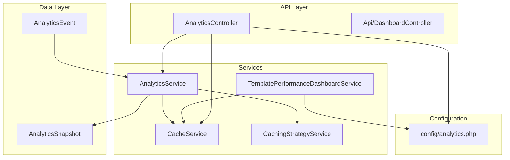
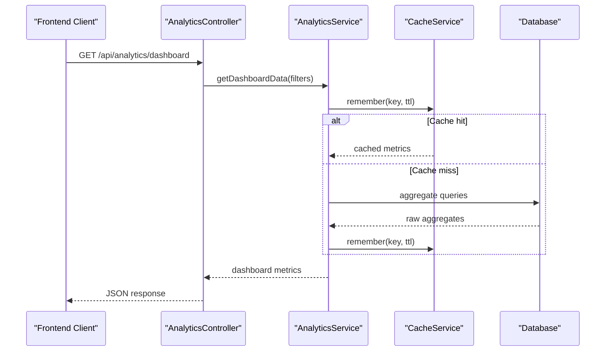
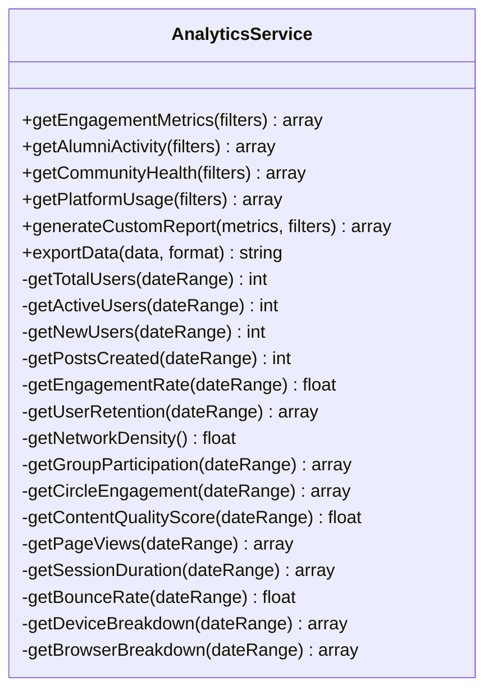
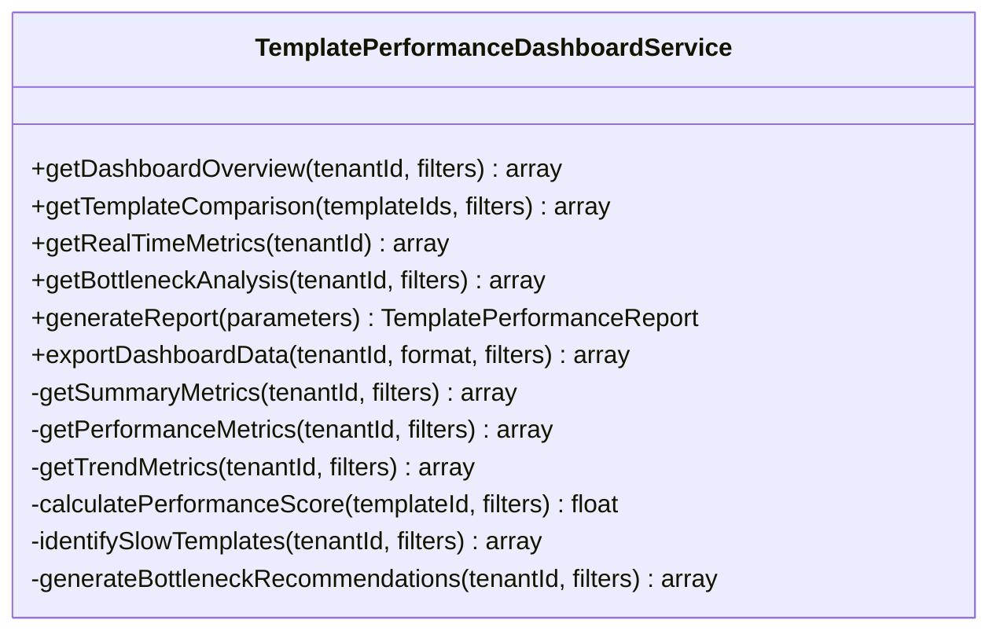
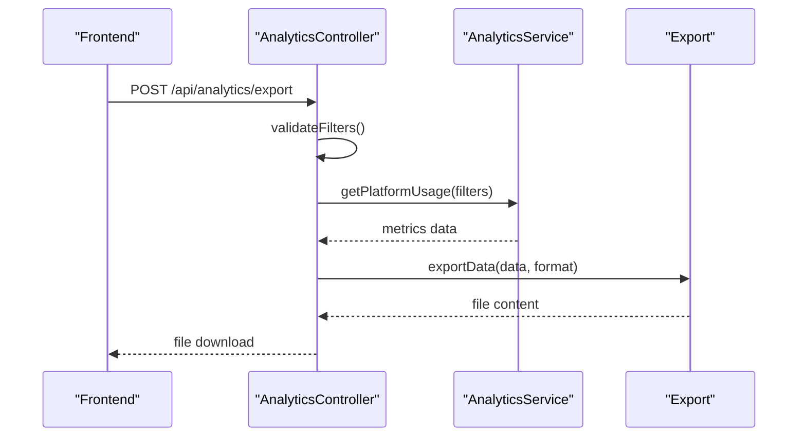
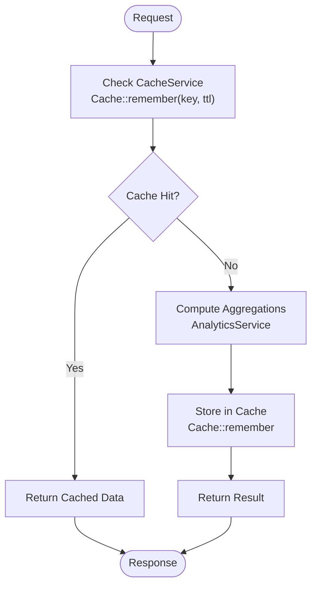
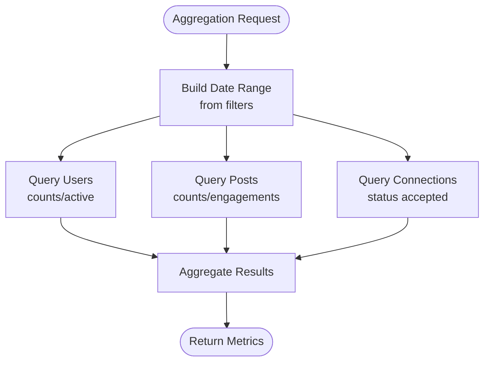
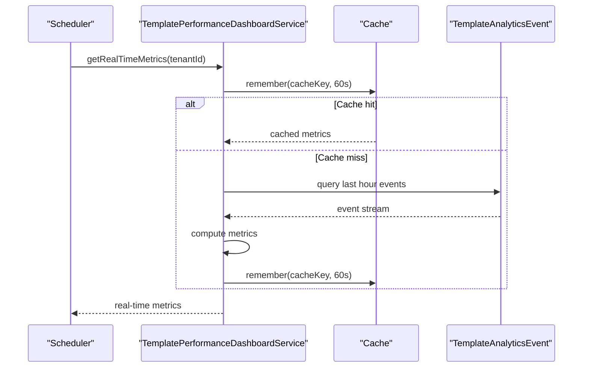
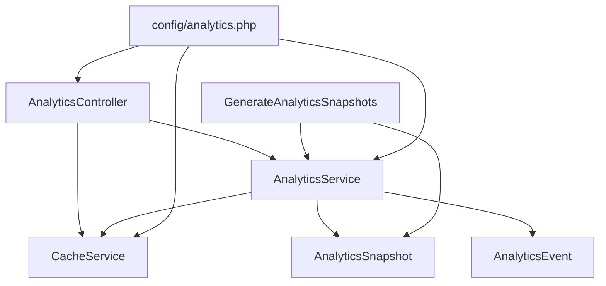

# Dashboard Analytics

<cite>
**Referenced Files in This Document**
- [AnalyticsService.php](file://app/Services/AnalyticsService.php)
- [TemplatePerformanceDashboardService.php](file://app/Services/TemplatePerformanceDashboardService.php)
- [analytics.php](file://config/analytics.php)
- [AnalyticsController.php](file://app/Http/Controllers/Api/AnalyticsController.php)
- [Api/DashboardController.php](file://app/Http/Controllers/Api/DashboardController.php)
- [DashboardController.php](file://app/Http/Controllers/DashboardController.php)
- [AnalyticsSnapshot.php](file://app/Models/AnalyticsSnapshot.php)
- [GenerateAnalyticsSnapshots.php](file://app/Console/Commands/GenerateAnalyticsSnapshots.php)
- [CacheService.php](file://app/Services/CacheService.php)
- [CachingStrategyService.php](file://app/Services/CachingStrategyService.php)
- [AnalyticsEvent.php](file://app/Models/AnalyticsEvent.php)
- [api.php](file://routes/api.php)
</cite>

## Table of Contents
1. [Introduction](#introduction)
2. [Project Structure](#project-structure)
3. [Core Components](#core-components)
4. [Architecture Overview](#architecture-overview)
5. [Detailed Component Analysis](#detailed-component-analysis)
6. [Dependency Analysis](#dependency-analysis)
7. [Performance Considerations](#performance-considerations)
8. [Troubleshooting Guide](#troubleshooting-guide)
9. [Conclusion](#conclusion)

## Introduction
This document describes the dashboard analytics system that powers key performance insights across the platform. It covers engagement metrics (total users, active users, new users, posts created, engagement rate), community health indicators (network density, group participation, circle engagement, content quality score), platform usage statistics (page views, session duration, bounce rate, device/browser breakdown), and user retention analysis. It also documents caching mechanisms, data aggregation methods, real-time dashboard updates, filtering capabilities, and dashboard customization options. Finally, it outlines integration points with frontend components and data visualization libraries.

## Project Structure
The dashboard analytics system is organized around several core services and controllers:
- AnalyticsService: central aggregation and calculation engine for all dashboard metrics
- TemplatePerformanceDashboardService: specialized analytics for template performance dashboards
- AnalyticsController: API endpoints for retrieving dashboard data and generating reports
- CacheService and CachingStrategyService: caching infrastructure for performance
- AnalyticsSnapshot and scheduling commands: historical snapshot generation
- Configuration: centralized analytics settings and defaults

**Diagram sources**
- [AnalyticsController.php:12-144](file://app/Http/Controllers/Api/AnalyticsController.php#L12-L144)
- [Api/DashboardController.php:14-275](file://app/Http/Controllers/Api/DashboardController.php#L14-L275)
- [AnalyticsService.php:22-134](file://app/Services/AnalyticsService.php#L22-L134)
- [TemplatePerformanceDashboardService.php:21-113](file://app/Services/TemplatePerformanceDashboardService.php#L21-L113)
- [CacheService.php:9-173](file://app/Services/CacheService.php#L9-L173)
- [CachingStrategyService.php:10-270](file://app/Services/CachingStrategyService.php#L10-L270)
- [AnalyticsEvent.php:9-115](file://app/Models/AnalyticsEvent.php#L9-L115)
- [AnalyticsSnapshot.php:9-82](file://app/Models/AnalyticsSnapshot.php#L9-L82)
- [analytics.php:1-242](file://config/analytics.php#L1-L242)

**Section sources**
- [AnalyticsController.php:12-144](file://app/Http/Controllers/Api/AnalyticsController.php#L12-L144)
- [AnalyticsService.php:22-134](file://app/Services/AnalyticsService.php#L22-L134)
- [TemplatePerformanceDashboardService.php:21-113](file://app/Services/TemplatePerformanceDashboardService.php#L21-L113)
- [analytics.php:1-242](file://config/analytics.php#L1-L242)

## Core Components
- AnalyticsService: Provides comprehensive dashboard metrics including engagement, community health, platform usage, and custom reports. Implements caching via Laravel Cache facade and supports export to CSV/JSON/XLSX.
- TemplatePerformanceDashboardService: Specialized service for template performance dashboards with real-time metrics, bottleneck analysis, and report generation.
- AnalyticsController: Exposes REST endpoints for dashboard data retrieval, custom report generation, and export functionality.
- CacheService and CachingStrategyService: Robust caching utilities with fallbacks, tagging support, and multi-tier caching strategies.
- AnalyticsSnapshot and GenerateAnalyticsSnapshots: Historical snapshot generation for time-series analytics and trend analysis.
- Configuration: Centralized settings for cache TTL, snapshot retention, KPI thresholds, chart defaults, and refresh intervals.

**Section sources**
- [AnalyticsService.php:22-134](file://app/Services/AnalyticsService.php#L22-L134)
- [TemplatePerformanceDashboardService.php:21-113](file://app/Services/TemplatePerformanceDashboardService.php#L21-L113)
- [AnalyticsController.php:12-144](file://app/Http/Controllers/Api/AnalyticsController.php#L12-L144)
- [CacheService.php:9-173](file://app/Services/CacheService.php#L9-L173)
- [CachingStrategyService.php:10-270](file://app/Services/CachingStrategyService.php#L10-L270)
- [AnalyticsSnapshot.php:9-82](file://app/Models/AnalyticsSnapshot.php#L9-L82)
- [GenerateAnalyticsSnapshots.php:9-80](file://app/Console/Commands/GenerateAnalyticsSnapshots.php#L9-L80)
- [analytics.php:1-242](file://config/analytics.php#L1-L242)

## Architecture Overview
The analytics architecture follows a layered pattern:
- API layer exposes endpoints for dashboard data and operations
- Service layer encapsulates business logic and data aggregation
- Cache layer improves performance and reduces database load
- Data persistence layer stores raw events and aggregated snapshots
- Configuration layer defines operational defaults and policies

**Diagram sources**
- [AnalyticsController.php:120-144](file://app/Http/Controllers/Api/AnalyticsController.php#L120-L144)
- [AnalyticsService.php:27-44](file://app/Services/AnalyticsService.php#L27-L44)
- [CacheService.php:16-27](file://app/Services/CacheService.php#L16-L27)

## Detailed Component Analysis

### AnalyticsService: Core Dashboard Metrics Engine
AnalyticsService orchestrates all dashboard metric calculations:
- Engagement metrics: total users, active users, new users, posts created, engagement rate, connections made, events attended, user retention
- Community health: network density, group participation, circle engagement, content quality score, user satisfaction metrics, platform growth rate
- Platform usage: page views, session duration, bounce rate, device/browser breakdown, peak usage times, feature adoption
- Custom reports: dynamic metric selection and export
- Retention analysis: cohort-based 7-day and 30-day retention rates

**Diagram sources**
- [AnalyticsService.php:22-134](file://app/Services/AnalyticsService.php#L22-L134)

**Section sources**
- [AnalyticsService.php:27-226](file://app/Services/AnalyticsService.php#L27-L226)
- [AnalyticsService.php:306-370](file://app/Services/AnalyticsService.php#L306-L370)
- [AnalyticsService.php:371-432](file://app/Services/AnalyticsService.php#L371-L432)

### TemplatePerformanceDashboardService: Real-Time Template Analytics
TemplatePerformanceDashboardService focuses on template performance:
- Real-time metrics: last hour page views, conversions, unique users, top templates
- Bottleneck analysis: slow templates, conversion bottlenecks, engagement issues
- Performance scoring: weighted score based on conversion rate, usage, and load time
- Report generation: performance, comparison, trend, and bottleneck reports
- Cache management: separate cache keys and durations for real-time vs. overview metrics

**Diagram sources**
- [TemplatePerformanceDashboardService.php:21-135](file://app/Services/TemplatePerformanceDashboardService.php#L21-L135)

**Section sources**
- [TemplatePerformanceDashboardService.php:37-135](file://app/Services/TemplatePerformanceDashboardService.php#L37-L135)
- [TemplatePerformanceDashboardService.php:202-339](file://app/Services/TemplatePerformanceDashboardService.php#L202-L339)
- [TemplatePerformanceDashboardService.php:344-567](file://app/Services/TemplatePerformanceDashboardService.php#L344-L567)

### AnalyticsController: API Endpoints
AnalyticsController exposes REST endpoints for dashboard data:
- Dashboard data retrieval: engagement metrics, community health, platform usage, combined dashboard
- Custom report generation and export
- Analytics summary with trends and alerts
- Email analytics endpoints (performance, funnel, A/B tests, real-time)

**Diagram sources**
- [AnalyticsController.php:182-223](file://app/Http/Controllers/Api/AnalyticsController.php#L182-L223)

**Section sources**
- [AnalyticsController.php:24-144](file://app/Http/Controllers/Api/AnalyticsController.php#L24-L144)
- [AnalyticsController.php:182-223](file://app/Http/Controllers/Api/AnalyticsController.php#L182-L223)
- [AnalyticsController.php:426-513](file://app/Http/Controllers/Api/AnalyticsController.php#L426-L513)

### Caching Mechanisms and Strategies
The system employs multiple caching layers:
- CacheService: unified interface with error handling, TTL management, and fallbacks
- CachingStrategyService: multi-tier caching (L1 in-memory, L2 Redis), cache warming, invalidation, and performance metrics
- AnalyticsService: uses Cache::remember with computed cache keys based on filters
- TemplatePerformanceDashboardService: separate cache prefixes and durations for real-time vs. overview metrics

**Diagram sources**
- [CacheService.php:16-27](file://app/Services/CacheService.php#L16-L27)
- [CachingStrategyService.php:58-88](file://app/Services/CachingStrategyService.php#L58-L88)
- [AnalyticsService.php:30-43](file://app/Services/AnalyticsService.php#L30-L43)

**Section sources**
- [CacheService.php:9-173](file://app/Services/CacheService.php#L9-L173)
- [CachingStrategyService.php:10-270](file://app/Services/CachingStrategyService.php#L10-L270)
- [AnalyticsService.php:27-44](file://app/Services/AnalyticsService.php#L27-L44)
- [TemplatePerformanceDashboardService.php:26-49](file://app/Services/TemplatePerformanceDashboardService.php#L26-L49)

### Data Aggregation Methods
AnalyticsService performs aggregations across multiple models:
- User counts, activity windows, and retention cohorts
- Post creation and engagement counts
- Connection and event attendance tracking
- Geographic distribution and graduation year activity
- Content quality scoring based on engagement and comments
- Platform growth rate comparisons across time periods

**Diagram sources**
- [AnalyticsService.php:137-148](file://app/Services/AnalyticsService.php#L137-L148)
- [AnalyticsService.php:150-226](file://app/Services/AnalyticsService.php#L150-L226)

**Section sources**
- [AnalyticsService.php:137-226](file://app/Services/AnalyticsService.php#L137-L226)

### Real-Time Dashboard Updates
TemplatePerformanceDashboardService provides near real-time metrics:
- Real-time cache with 1-minute TTL for last hour metrics
- Event counting for page views, conversions, and unique users
- Top-performing template identification
- Bottleneck detection and recommendations

**Diagram sources**
- [TemplatePerformanceDashboardService.php:90-113](file://app/Services/TemplatePerformanceDashboardService.php#L90-L113)

**Section sources**
- [TemplatePerformanceDashboardService.php:90-113](file://app/Services/TemplatePerformanceDashboardService.php#L90-L113)

### Filtering Capabilities
The system supports flexible filtering:
- Date ranges (start_date, end_date)
- Institution-level filtering
- Demographic filters (graduation year, location, program)
- Metric-specific filters for custom reports

**Section sources**
- [AnalyticsController.php:319-329](file://app/Http/Controllers/Api/AnalyticsController.php#L319-L329)
- [AnalyticsController.php:149-177](file://app/Http/Controllers/Api/AnalyticsController.php#L149-L177)

### Dashboard Customization Options
- Widget ordering and enablement via configuration
- Default timeframes and refresh intervals
- Chart color palettes and animation settings
- Export formats and batch sizes

**Section sources**
- [analytics.php:212-224](file://config/analytics.php#L212-L224)
- [analytics.php:117-130](file://config/analytics.php#L117-L130)
- [analytics.php:140-144](file://config/analytics.php#L140-L144)

### Integration with Frontend Components and Visualization Libraries
- RESTful API endpoints for dashboard data
- JSON responses suitable for React/Vue/Angular consumption
- Export endpoints for CSV/JSON/XLSX downloads
- Real-time polling or WebSocket integration (not implemented in referenced files)

**Section sources**
- [AnalyticsController.php:24-144](file://app/Http/Controllers/Api/AnalyticsController.php#L24-L144)
- [AnalyticsController.php:182-223](file://app/Http/Controllers/Api/AnalyticsController.php#L182-L223)
- [Api/DashboardController.php:14-275](file://app/Http/Controllers/Api/DashboardController.php#L14-L275)

## Dependency Analysis
The analytics system exhibits clear separation of concerns:
- Controllers depend on Services for business logic
- Services depend on CacheService for performance
- Services depend on Eloquent models for data access
- Commands depend on Services for snapshot generation
- Configuration drives caching and export behavior

**Diagram sources**
- [AnalyticsController.php:14-19](file://app/Http/Controllers/Api/AnalyticsController.php#L14-L19)
- [AnalyticsService.php:5-20](file://app/Services/AnalyticsService.php#L5-L20)
- [AnalyticsSnapshot.php:9-24](file://app/Models/AnalyticsSnapshot.php#L9-L24)
- [AnalyticsEvent.php:9-37](file://app/Models/AnalyticsEvent.php#L9-L37)
- [GenerateAnalyticsSnapshots.php:20-24](file://app/Console/Commands/GenerateAnalyticsSnapshots.php#L20-L24)
- [analytics.php:22-26](file://config/analytics.php#L22-L26)

**Section sources**
- [AnalyticsController.php:14-19](file://app/Http/Controllers/Api/AnalyticsController.php#L14-L19)
- [AnalyticsService.php:5-20](file://app/Services/AnalyticsService.php#L5-L20)
- [GenerateAnalyticsSnapshots.php:20-24](file://app/Console/Commands/GenerateAnalyticsSnapshots.php#L20-L24)
- [analytics.php:22-26](file://config/analytics.php#L22-L26)

## Performance Considerations
- Cache TTL tuning: default 5-minute TTL for dashboard metrics; real-time metrics use 1-minute TTL
- Multi-tier caching: in-memory and Redis layers with warming strategies
- Batch processing: configurable chunk sizes and parallel processing options
- Export limits: max file size and cleanup policies
- Query timeouts and memory limits for large datasets

[No sources needed since this section provides general guidance]

## Troubleshooting Guide
Common issues and resolutions:
- Cache failures: CacheService wraps operations in try-catch blocks and logs errors
- Snapshot generation: GenerateAnalyticsSnapshots command validates types and dates, with force regeneration option
- Export errors: AnalyticsController handles unsupported formats and throws descriptive exceptions
- Data compliance: AnalyticsEvent model enforces consent and retention policies

**Section sources**
- [CacheService.php:20-26](file://app/Services/CacheService.php#L20-L26)
- [GenerateAnalyticsSnapshots.php:75-79](file://app/Console/Commands/GenerateAnalyticsSnapshots.php#L75-L79)
- [AnalyticsController.php:216-222](file://app/Http/Controllers/Api/AnalyticsController.php#L216-L222)
- [AnalyticsEvent.php:98-113](file://app/Models/AnalyticsEvent.php#L98-L113)

## Conclusion
The dashboard analytics system provides a robust foundation for monitoring platform health and user engagement. Its modular design, comprehensive caching strategy, and flexible filtering capabilities enable scalable and maintainable analytics. The integration points with frontend frameworks and visualization libraries make it straightforward to build interactive dashboards. Future enhancements could include real-time streaming updates, advanced segmentation, and expanded export formats.