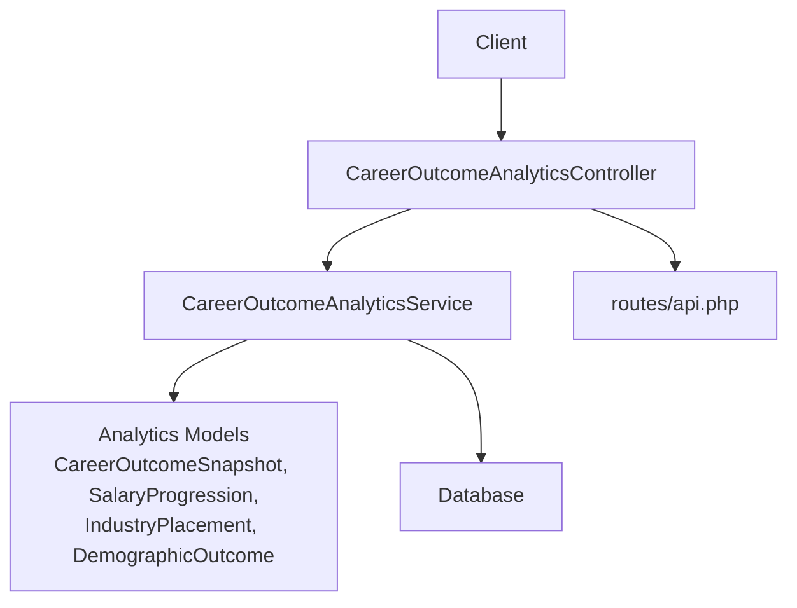
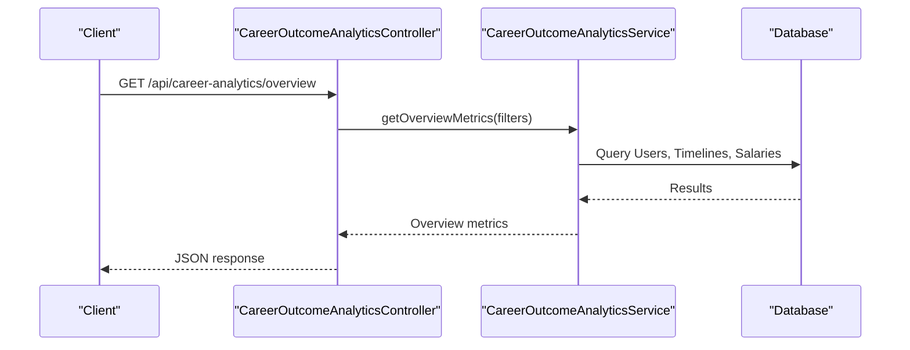
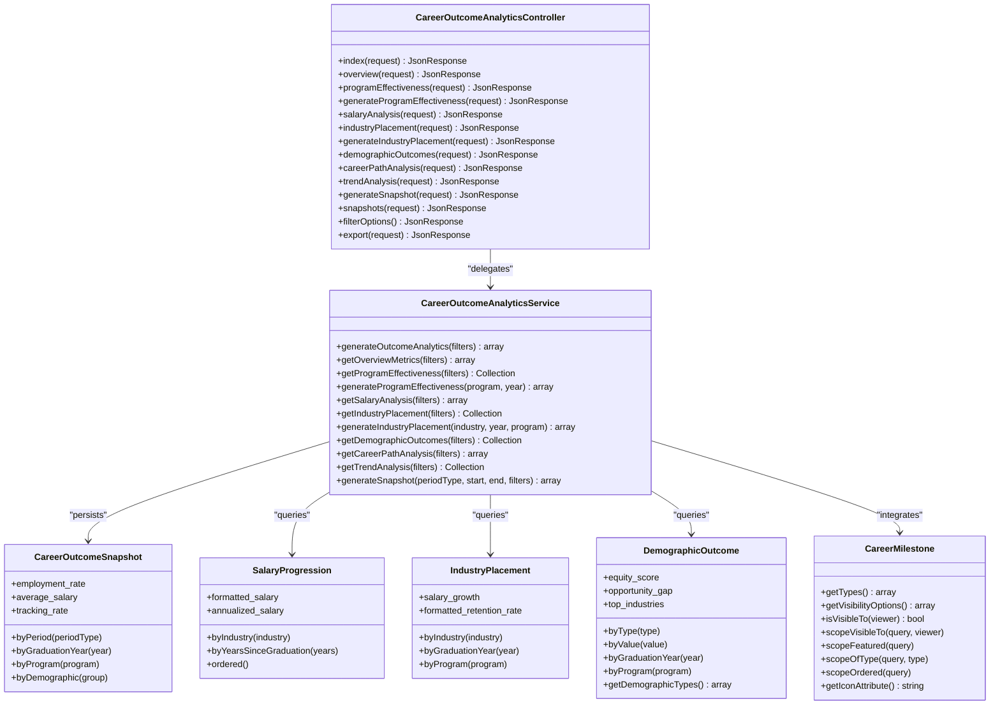
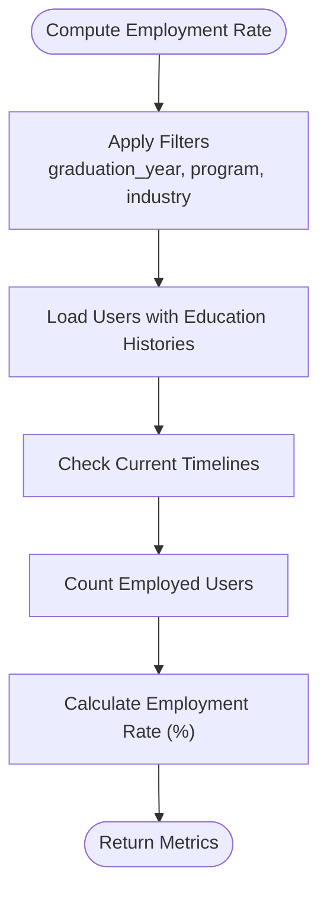
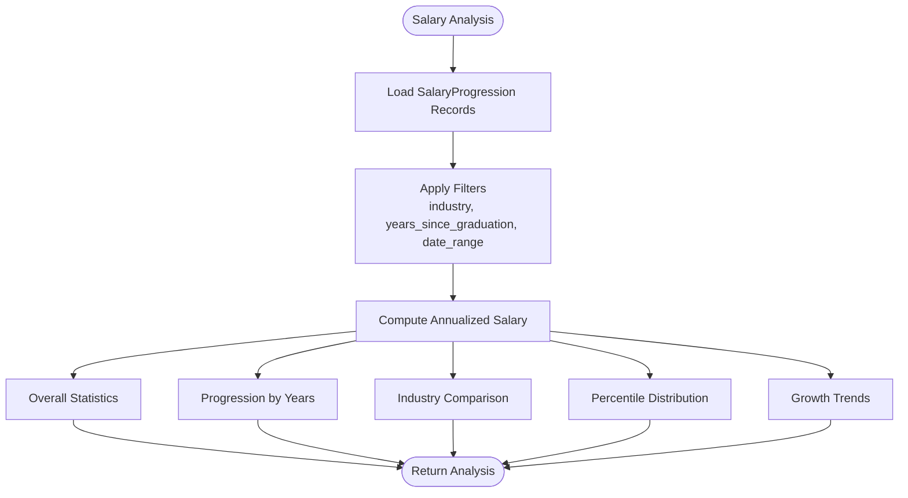
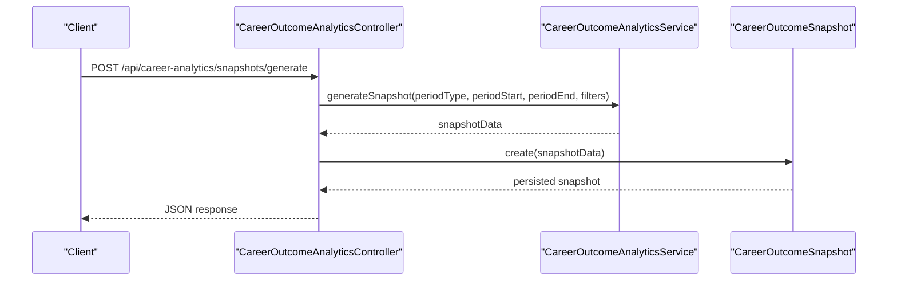
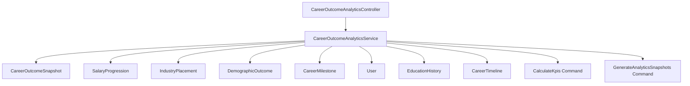

# Graduate Outcome Analytics

<cite>
**Referenced Files in This Document**
- [CareerOutcomeAnalyticsController.php](file://app/Http/Controllers/Api/CareerOutcomeAnalyticsController.php)
- [CareerOutcomeAnalyticsService.php](file://app/Services/CareerOutcomeAnalyticsService.php)
- [CareerOutcomeSnapshot.php](file://app/Models/CareerOutcomeSnapshot.php)
- [Graduate.php](file://app/Models/Graduate.php)
- [SalaryProgression.php](file://app/Models/SalaryProgression.php)
- [IndustryPlacement.php](file://app/Models/IndustryPlacement.php)
- [DemographicOutcome.php](file://app/Models/DemographicOutcome.php)
- [CareerMilestone.php](file://app/Models/CareerMilestone.php)
- [CareerMilestoneCreated.php](file://app/Events/CareerMilestoneCreated.php)
- [GenerateAnalyticsSnapshots.php](file://app/Console/Commands/GenerateAnalyticsSnapshots.php)
- [CalculateKpis.php](file://app/Console/Commands/CalculateKpis.php)
- [routes/api.php](file://routes/api.php)
</cite>

## Table of Contents
1. [Introduction](#introduction)
2. [Project Structure](#project-structure)
3. [Core Components](#core-components)
4. [Architecture Overview](#architecture-overview)
5. [Detailed Component Analysis](#detailed-component-analysis)
6. [Dependency Analysis](#dependency-analysis)
7. [Performance Considerations](#performance-considerations)
8. [Troubleshooting Guide](#troubleshooting-guide)
9. [Conclusion](#conclusion)

## Introduction
This document describes the graduate outcome analytics and career tracking system. It covers time-to-employment metrics, salary progression analysis, top employers tracking, employment by location distribution, and employment rate by course calculation. It also explains the graduate outcome snapshot system, ROI calculation for courses, benchmarking against peer institutions, and market trends analysis. Examples include career timeline visualization, industry placement tracking, and demographic outcome analysis. The document details integration with career milestone tracking and employment verification systems.

## Project Structure
The graduate outcome analytics system is organized around:
- API controller for analytics endpoints
- Service layer implementing analytics computations
- Eloquent models representing analytics entities
- Console commands for scheduled analytics generation
- Routes exposing the analytics API

**Diagram sources**
- [CareerOutcomeAnalyticsController.php:16-437](file://app/Http/Controllers/Api/CareerOutcomeAnalyticsController.php#L16-L437)
- [CareerOutcomeAnalyticsService.php:15-511](file://app/Services/CareerOutcomeAnalyticsService.php#L15-L511)
- [routes/api.php](file://routes/api.php)

**Section sources**
- [CareerOutcomeAnalyticsController.php:16-437](file://app/Http/Controllers/Api/CareerOutcomeAnalyticsController.php#L16-L437)
- [CareerOutcomeAnalyticsService.php:15-511](file://app/Services/CareerOutcomeAnalyticsService.php#L15-L511)

## Core Components
- CareerOutcomeAnalyticsController: Exposes REST endpoints for analytics queries, snapshot generation, and filter options.
- CareerOutcomeAnalyticsService: Implements core analytics computations including overview metrics, program effectiveness, salary analysis, industry placement, demographic outcomes, career path analysis, and trend analysis. Provides snapshot generation for time-based reporting.
- Analytics Models:
  - CareerOutcomeSnapshot: Stores time-bound outcome snapshots with metrics and filters.
  - SalaryProgression: Tracks annualized salary and related attributes per user.
  - IndustryPlacement: Aggregated placement counts, salaries, retention, and demand indicators.
  - DemographicOutcome: Demographic breakdowns of employment, salary, leadership, entrepreneurship, and industry distribution.
- Integrations:
  - CareerMilestone: Career milestones tracked by users, supporting visualization and verification.
  - Console Commands: Scheduled jobs for generating snapshots and calculating KPIs.

**Section sources**
- [CareerOutcomeAnalyticsController.php:25-437](file://app/Http/Controllers/Api/CareerOutcomeAnalyticsController.php#L25-L437)
- [CareerOutcomeAnalyticsService.php:20-339](file://app/Services/CareerOutcomeAnalyticsService.php#L20-L339)
- [CareerOutcomeSnapshot.php:12-69](file://app/Models/CareerOutcomeSnapshot.php#L12-L69)
- [SalaryProgression.php:13-69](file://app/Models/SalaryProgression.php#L13-L69)
- [IndustryPlacement.php:12-63](file://app/Models/IndustryPlacement.php#L12-L63)
- [DemographicOutcome.php:22-122](file://app/Models/DemographicOutcome.php#L22-L122)
- [CareerMilestone.php:32-180](file://app/Models/CareerMilestone.php#L32-L180)

## Architecture Overview
The system follows a layered architecture:
- Presentation: API endpoints in the controller
- Application: Service orchestrates analytics computation
- Persistence: Eloquent models and database-backed aggregations
- Scheduling: Console commands for periodic analytics generation

**Diagram sources**
- [CareerOutcomeAnalyticsController.php:47-62](file://app/Http/Controllers/Api/CareerOutcomeAnalyticsController.php#L47-L62)
- [CareerOutcomeAnalyticsService.php:36-82](file://app/Services/CareerOutcomeAnalyticsService.php#L36-L82)

## Detailed Component Analysis

### CareerOutcomeAnalyticsController
Responsibilities:
- Validates and applies filters for analytics queries
- Delegates to the service layer for computations
- Persists generated snapshots and returns standardized responses
- Exposes filter option discovery endpoints

Key endpoints:
- GET overview: Returns total alumni, employment rate, average salary, tracking rate, top industries, top employers, and geographic distribution
- GET program effectiveness: Retrieves program effectiveness records
- POST program effectiveness: Generates program effectiveness data and persists it
- GET salary analysis: Returns salary statistics, progression, industry comparison, percentiles, and growth trends
- GET industry placement: Returns placement distributions
- POST industry placement: Generates industry placement data and persists it
- GET demographic outcomes: Returns demographic outcomes
- GET career path analysis: Returns path distributions, success metrics, progression patterns, and leadership development metrics
- GET trend analysis: Returns trend records
- POST generate snapshot: Creates a snapshot for a given period and filters
- GET snapshots: Lists snapshots with optional filtering
- GET filter options: Returns available filter options

**Section sources**
- [CareerOutcomeAnalyticsController.php:25-437](file://app/Http/Controllers/Api/CareerOutcomeAnalyticsController.php#L25-L437)

### CareerOutcomeAnalyticsService
Responsibilities:
- Computes overview metrics from user career timelines and recent salary progressions
- Calculates program effectiveness with employment rates at 6 months, 1 year, and 2 years, average salaries, and top employers
- Performs salary analysis with statistics, progression by years, industry comparison, percentiles, and growth trends
- Aggregates industry placement data including placement counts, average starting/current salary, retention rate, top companies, and skills in demand
- Produces demographic outcomes with employment rate, average salary, leadership rate, entrepreneurship rate, industry distribution, challenges, and success factors
- Analyzes career paths and trends
- Generates time-bound snapshots with employment rate, average salary, job satisfaction, and tracking rate

Helper methods:
- applyFilters, applySalaryFilters, applyCareerPathFilters: Apply query filters
- getTopIndustries, getTopEmployers, getGeographicDistribution: Top lists aggregation
- calculateEmploymentRates, getEmploymentRateAtDate: Employment rate calculations
- calculateSalaryProgression, getAverageSalaryAtDate: Salary progression computations
- Empty result handlers: getEmptyOverviewMetrics, getEmptySalaryAnalysis, getEmptyCareerPathAnalysis

**Section sources**
- [CareerOutcomeAnalyticsService.php:20-511](file://app/Services/CareerOutcomeAnalyticsService.php#L20-L511)

### CareerOutcomeSnapshot Model
Purpose:
- Persist time-bound analytics snapshots with associated metrics and filters

Attributes:
- period_type, period_start, period_end, graduation_year, program, department, demographic_group
- metrics (array containing employment_rate, average_salary, job_satisfaction, tracking_rate)
- total_graduates, tracked_graduates

Accessors:
- employment_rate, average_salary, tracking_rate derived from metrics and counts

Scopes:
- byPeriod, byGraduationYear, byProgram, byDemographic for filtering

**Section sources**
- [CareerOutcomeSnapshot.php:12-69](file://app/Models/CareerOutcomeSnapshot.php#L12-L69)

### SalaryProgression Model
Purpose:
- Track salary history per user with annualized salary conversion

Attributes:
- user_id, salary, currency, salary_type, position_title, company, industry, effective_date, years_since_graduation, metadata
- Casts for numeric and date fields

Accessors:
- formatted_salary, annualized_salary based on salary_type

Scopes:
- byIndustry, byYearsSinceGraduation, ordered

**Section sources**
- [SalaryProgression.php:13-69](file://app/Models/SalaryProgression.php#L13-L69)

### IndustryPlacement Model
Purpose:
- Store aggregated industry placement statistics

Attributes:
- industry, sub_industry, graduation_year, program, placement_count, avg_starting_salary, avg_current_salary, retention_rate, top_companies, skills_in_demand

Accessors:
- salary_growth, formatted_retention_rate

Scopes:
- byIndustry, byGraduationYear, byProgram

**Section sources**
- [IndustryPlacement.php:12-63](file://app/Models/IndustryPlacement.php#L12-L63)

### DemographicOutcome Model
Purpose:
- Capture demographic-specific outcomes

Attributes:
- demographic_type, demographic_value, graduation_year, program, employment_rate, avg_salary, leadership_rate, entrepreneurship_rate, industry_distribution, challenges, success_factors

Accessors:
- equity_score, opportunity_gap, top_industries

Static methods:
- getDemographicTypes: Available demographic categories

**Section sources**
- [DemographicOutcome.php:22-122](file://app/Models/DemographicOutcome.php#L22-L122)

### CareerMilestone Integration
Purpose:
- Track significant career events (promotions, job changes, awards, certifications, education, achievements) that inform career timeline visualization and verification

Key capabilities:
- Visibility controls (public, connections, private)
- Type taxonomy and icons
- Scopes for featured, type filtering, and ordering
- Integration with events for milestone creation notifications

**Section sources**
- [CareerMilestone.php:32-180](file://app/Models/CareerMilestone.php#L32-L180)
- [CareerMilestoneCreated.php](file://app/Events/CareerMilestoneCreated.php)

### Console Commands for Analytics
- GenerateAnalyticsSnapshots: Periodic job to generate snapshots for predefined periods and filters
- CalculateKpis: Background job to compute key performance indicators for career outcomes

These commands integrate with the service layer to produce and persist analytics data regularly.

**Section sources**
- [GenerateAnalyticsSnapshots.php](file://app/Console/Commands/GenerateAnalyticsSnapshots.php)
- [CalculateKpis.php](file://app/Console/Commands/CalculateKpis.php)

## Architecture Overview

**Diagram sources**
- [CareerOutcomeAnalyticsController.php:16-437](file://app/Http/Controllers/Api/CareerOutcomeAnalyticsController.php#L16-L437)
- [CareerOutcomeAnalyticsService.php:15-511](file://app/Services/CareerOutcomeAnalyticsService.php#L15-L511)
- [CareerOutcomeSnapshot.php:8-69](file://app/Models/CareerOutcomeSnapshot.php#L8-L69)
- [SalaryProgression.php:9-69](file://app/Models/SalaryProgression.php#L9-L69)
- [IndustryPlacement.php:8-63](file://app/Models/IndustryPlacement.php#L8-L63)
- [DemographicOutcome.php:8-122](file://app/Models/DemographicOutcome.php#L8-L122)
- [CareerMilestone.php:10-180](file://app/Models/CareerMilestone.php#L10-L180)

## Detailed Component Analysis

### Time-to-Employment Metrics
Overview:
- Employment rate computed from current career timelines
- Tracking rate computed from presence of career timelines or salary progressions
- Top industries, top employers, and geographic distribution derived from current positions

Implementation highlights:
- Filters applied to restrict analysis to specific graduation years, programs, and industries
- Employment rate at 6 months, 1 year, and 2 years calculated by checking timeline overlaps with target dates
- Average salary computed from recent salary progressions within a rolling window

**Diagram sources**
- [CareerOutcomeAnalyticsService.php:36-82](file://app/Services/CareerOutcomeAnalyticsService.php#L36-L82)
- [CareerOutcomeAnalyticsService.php:459-483](file://app/Services/CareerOutcomeAnalyticsService.php#L459-L483)

**Section sources**
- [CareerOutcomeAnalyticsService.php:36-82](file://app/Services/CareerOutcomeAnalyticsService.php#L36-L82)
- [CareerOutcomeAnalyticsService.php:459-483](file://app/Services/CareerOutcomeAnalyticsService.php#L459-L483)

### Salary Progression Analysis
Overview:
- Annualized salary conversions from hourly, monthly, or annual figures
- Salary statistics, progression by years since graduation, industry comparison, percentile distribution, and growth trends

Implementation highlights:
- Annualized salary computed per record
- Average salary at specific dates using latest entries per user up to a target date
- Industry and time-based aggregations for comparative analysis

**Diagram sources**
- [CareerOutcomeAnalyticsService.php:152-171](file://app/Services/CareerOutcomeAnalyticsService.php#L152-L171)
- [SalaryProgression.php:55-68](file://app/Models/SalaryProgression.php#L55-L68)

**Section sources**
- [CareerOutcomeAnalyticsService.php:152-171](file://app/Services/CareerOutcomeAnalyticsService.php#L152-L171)
- [SalaryProgression.php:55-68](file://app/Models/SalaryProgression.php#L55-L68)

### Top Employers Tracking
Overview:
- Top employers derived from current career timelines grouped by company
- Used in overview metrics and industry placement analysis

Implementation highlights:
- Group by company on current timelines and sort by count
- Limited to top 10 for concise reporting

**Section sources**
- [CareerOutcomeAnalyticsService.php:437-446](file://app/Services/CareerOutcomeAnalyticsService.php#L437-L446)

### Employment by Location Distribution
Overview:
- Geographic distribution derived from current career timelines grouped by location
- Used in overview metrics

Implementation highlights:
- Group by location on current timelines and sort by count
- Limited to top 10 for concise reporting

**Section sources**
- [CareerOutcomeAnalyticsService.php:448-457](file://app/Services/CareerOutcomeAnalyticsService.php#L448-L457)

### Employment Rate by Course Calculation
Overview:
- Employment rate filtered by course using education history associations
- Computed from current career timelines linked to graduates via course enrollment

Implementation highlights:
- Apply course filter through education histories
- Employment rate computed as ratio of employed users to total users in the course cohort

**Section sources**
- [CareerOutcomeAnalyticsController.php:27-34](file://app/Http/Controllers/Api/CareerOutcomeAnalyticsController.php#L27-L34)
- [CareerOutcomeAnalyticsService.php:343-362](file://app/Services/CareerOutcomeAnalyticsService.php#L343-L362)

### Graduate Outcome Snapshot System
Overview:
- Time-bound snapshots capturing employment rate, average salary, job satisfaction, and tracking rate
- Stored with period type, start/end dates, and filter context

Implementation highlights:
- Generate snapshot for a period and filters, persist to CareerOutcomeSnapshot
- Retrieve snapshots with scoping by period, graduation year, program, department, and demographic group

**Diagram sources**
- [CareerOutcomeAnalyticsController.php:263-306](file://app/Http/Controllers/Api/CareerOutcomeAnalyticsController.php#L263-L306)
- [CareerOutcomeAnalyticsService.php:302-339](file://app/Services/CareerOutcomeAnalyticsService.php#L302-L339)
- [CareerOutcomeSnapshot.php:12-29](file://app/Models/CareerOutcomeSnapshot.php#L12-L29)

**Section sources**
- [CareerOutcomeAnalyticsController.php:263-352](file://app/Http/Controllers/Api/CareerOutcomeAnalyticsController.php#L263-L352)
- [CareerOutcomeAnalyticsService.php:302-339](file://app/Services/CareerOutcomeAnalyticsService.php#L302-L339)
- [CareerOutcomeSnapshot.php:12-69](file://app/Models/CareerOutcomeSnapshot.php#L12-L69)

### ROI Calculation for Courses
Overview:
- Not implemented in the current codebase
- Suggested approach:
  - Define ROI as (Net Benefits / Cost of Education) × 100
  - Net Benefits = Lifetime Earnings - Total Cost of Education
  - Lifetime Earnings estimated from salary progression data
  - Total Cost includes tuition, fees, books, and opportunity cost assumptions
  - Compare ROI across courses and programs

[No sources needed since this section provides conceptual guidance]

### Benchmarking Against Peer Institutions
Overview:
- Not implemented in the current codebase
- Suggested approach:
  - Collect peer institution data externally
  - Normalize metrics (employment rate, average salary, retention)
  - Establish benchmarks and percentiles
  - Compare institutional metrics against peer averages

[No sources needed since this section provides conceptual guidance]

### Market Trends Analysis
Overview:
- Trend records stored and retrieved via CareerTrend model
- Controller exposes trend analysis endpoint with filtering by trend type and category

Implementation highlights:
- Retrieve trend records ordered by period start
- Filter by trend type and category for targeted insights

**Section sources**
- [CareerOutcomeAnalyticsController.php:243-258](file://app/Http/Controllers/Api/CareerOutcomeAnalyticsController.php#L243-L258)
- [CareerOutcomeAnalyticsService.php:284-297](file://app/Services/CareerOutcomeAnalyticsService.php#L284-L297)

### Career Timeline Visualization
Overview:
- Career timelines integrated with overview metrics and snapshots
- CareerMilestone supports milestone-driven timeline events

Implementation highlights:
- Use current career timelines for employment rate and geographic distribution
- CareerMilestone types (promotion, job change, award, certification, education, achievement) support timeline storytelling

**Section sources**
- [CareerOutcomeAnalyticsService.php:52-54](file://app/Services/CareerOutcomeAnalyticsService.php#L52-L54)
- [CareerMilestone.php:69-91](file://app/Models/CareerMilestone.php#L69-L91)

### Industry Placement Tracking
Overview:
- IndustryPlacement model aggregates placement counts, average salaries, retention, top companies, and skills in demand
- Industry placement analysis and generation endpoints

Implementation highlights:
- Group by industry and program, compute averages and counts
- Generate industry placement data for specific industry, graduation year, and program

**Section sources**
- [IndustryPlacement.php:12-63](file://app/Models/IndustryPlacement.php#L12-L63)
- [CareerOutcomeAnalyticsController.php:145-199](file://app/Http/Controllers/Api/CareerOutcomeAnalyticsController.php#L145-L199)
- [CareerOutcomeAnalyticsService.php:176-238](file://app/Services/CareerOutcomeAnalyticsService.php#L176-L238)

### Demographic Outcome Analysis
Overview:
- DemographicOutcome captures employment rate, average salary, leadership rate, entrepreneurship rate, industry distribution, challenges, and success factors
- Equity score and opportunity gap placeholders for deeper equity analysis

Implementation highlights:
- Filter by demographic type/value, graduation year, and program
- Compute equity score and top industries for each demographic group

**Section sources**
- [DemographicOutcome.php:22-122](file://app/Models/DemographicOutcome.php#L22-L122)
- [CareerOutcomeAnalyticsController.php:204-219](file://app/Http/Controllers/Api/CareerOutcomeAnalyticsController.php#L204-L219)
- [CareerOutcomeAnalyticsService.php:243-256](file://app/Services/CareerOutcomeAnalyticsService.php#L243-L256)

### Integration with Career Milestone Tracking
Overview:
- CareerMilestone model supports visibility, type taxonomy, and scoping
- CareerMilestoneCreated event enables integration with analytics workflows

Implementation highlights:
- Milestone types and visibility options
- Scopes for featured, type filtering, and ordering
- Event-driven integrations for milestone creation

**Section sources**
- [CareerMilestone.php:32-180](file://app/Models/CareerMilestone.php#L32-L180)
- [CareerMilestoneCreated.php](file://app/Events/CareerMilestoneCreated.php)

### Integration with Employment Verification Systems
Overview:
- Employment verification not implemented in the current codebase
- Suggested approach:
  - Add verification status to career timelines or dedicated verification records
  - Integrate with external verification APIs or manual review workflows
  - Flag verified vs unverified employment for analytics accuracy

[No sources needed since this section provides conceptual guidance]

## Dependency Analysis

**Diagram sources**
- [CareerOutcomeAnalyticsController.php:16-437](file://app/Http/Controllers/Api/CareerOutcomeAnalyticsController.php#L16-L437)
- [CareerOutcomeAnalyticsService.php:15-511](file://app/Services/CareerOutcomeAnalyticsService.php#L15-L511)
- [CareerOutcomeSnapshot.php:8-69](file://app/Models/CareerOutcomeSnapshot.php#L8-L69)
- [SalaryProgression.php:9-69](file://app/Models/SalaryProgression.php#L9-L69)
- [IndustryPlacement.php:8-63](file://app/Models/IndustryPlacement.php#L8-L63)
- [DemographicOutcome.php:8-122](file://app/Models/DemographicOutcome.php#L8-L122)
- [CareerMilestone.php:10-180](file://app/Models/CareerMilestone.php#L10-L180)

**Section sources**
- [CareerOutcomeAnalyticsController.php:16-437](file://app/Http/Controllers/Api/CareerOutcomeAnalyticsController.php#L16-L437)
- [CareerOutcomeAnalyticsService.php:15-511](file://app/Services/CareerOutcomeAnalyticsService.php#L15-L511)

## Performance Considerations
- Use scopes and indexed columns for filters (graduation_year, program, industry, department, demographic_group)
- Limit result sets with pagination and reasonable limits for snapshot listings
- Cache frequently accessed filter options and aggregate summaries
- Batch process large datasets in console commands to avoid request timeouts
- Index effective_date and user_id for salary progression queries

[No sources needed since this section provides general guidance]

## Troubleshooting Guide
Common issues and resolutions:
- No data returned for a period or filters:
  - Verify period boundaries and filters align with stored data
  - Confirm snapshot generation command has run for the requested period
- Employment rate or tracking rate appears incorrect:
  - Check current timeline flags and date overlap logic
  - Validate salary progression records exist for the relevant timeframe
- Export functionality placeholder:
  - Implement export handler in the controller and service layer
- Snapshot persistence errors:
  - Ensure fillable attributes and casts are correct for CareerOutcomeSnapshot

**Section sources**
- [CareerOutcomeAnalyticsController.php:378-393](file://app/Http/Controllers/Api/CareerOutcomeAnalyticsController.php#L378-L393)
- [CareerOutcomeAnalyticsController.php:292-297](file://app/Http/Controllers/Api/CareerOutcomeAnalyticsController.php#L292-L297)
- [CareerOutcomeAnalyticsService.php:306-308](file://app/Services/CareerOutcomeAnalyticsService.php#L306-L308)

## Conclusion
The graduate outcome analytics system provides a robust foundation for measuring and visualizing career outcomes. It supports time-bound snapshots, salary progression analysis, industry placement tracking, demographic outcomes, and trend analysis. While some advanced features like ROI calculation, peer benchmarking, and employment verification are not yet implemented, the existing architecture offers clear extension points for future enhancements.